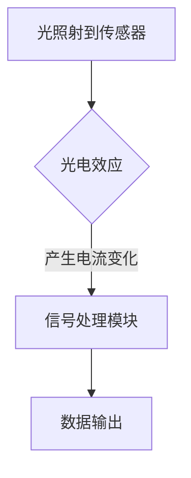

                 

关键词：物联网（IoT），传感器设备，光线传感器，集成，使用案例，技术探讨，应用场景，未来展望。

摘要：本文将探讨物联网（IoT）技术中传感器设备，特别是光线传感器的集成与应用。通过分析光线传感器的工作原理及其在不同领域的应用案例，我们将深入理解其在智能系统中的重要性。文章将涵盖光线传感器的核心概念、算法原理、数学模型、项目实践以及未来应用展望，旨在为读者提供一个全面的指南。

## 1. 背景介绍

### 1.1 物联网（IoT）的兴起

物联网（Internet of Things，简称IoT）是近年来快速发展的技术领域，通过互联网将各种物品连接起来，实现信息的交换和智能控制。随着传感器技术、云计算、大数据和人工智能等技术的进步，IoT已经渗透到各个行业，从智能家居、智能城市到工业自动化，带来了前所未有的变革。

### 1.2 传感器设备在IoT中的重要性

传感器是IoT系统的“感官器官”，它们负责收集环境数据，并将其转换为电信号或其他形式的数据，为系统的决策和控制提供依据。传感器设备种类繁多，包括温度传感器、湿度传感器、压力传感器、光线传感器等。其中，光线传感器在IoT中的应用日益广泛，成为智能系统中的一个关键组成部分。

### 1.3 光线传感器的工作原理与应用

光线传感器是一种能感知光强度变化的传感器，通过光电效应、光生电效应或光吸收效应等原理工作。它们可以用于测量环境光强、光照强度分布、日照时间等参数，广泛应用于智能家居、智能交通、农业监测等领域。

## 2. 核心概念与联系

### 2.1 光线传感器的基本原理

光线传感器通常由光电二极管、光敏电阻或光电晶体管等组件构成。这些组件通过光电效应将光能转化为电能，从而实现光强度的测量。以下是光线传感器工作原理的Mermaid流程图：



### 2.2 光线传感器在IoT系统中的应用

光线传感器在IoT系统中的应用范围广泛，主要包括以下几个方面：

1. **智能家居**：光线传感器可以用于调节室内照明，实现自动化控制，提高居住舒适度。
2. **智能交通**：光线传感器可以用于监测道路照明情况，优化交通信号灯控制，提高交通安全。
3. **农业监测**：光线传感器可以用于监测植物生长过程中的光照条件，优化种植策略，提高产量。
4. **环境监测**：光线传感器可以用于监测大气光照强度，研究气候变化等。

## 3. 核心算法原理 & 具体操作步骤

### 3.1 算法原理概述

光线传感器的工作原理涉及光电效应，即光子与物质相互作用时，会导致物质内部的电子能量发生变化，从而产生电流。具体算法原理如下：

1. **光电二极管**：光子照射到光电二极管表面，产生电子-空穴对，导致二极管的电阻变化，从而输出电流。
2. **光敏电阻**：光子照射到光敏电阻表面，吸收光能，导致电阻值变化。
3. **光电晶体管**：光子照射到光电晶体管基区，产生电子注入，改变晶体管的导通状态。

### 3.2 算法步骤详解

1. **传感器数据采集**：通过光线传感器采集环境光强数据。
2. **信号预处理**：对采集到的数据进行滤波处理，去除噪声和干扰。
3. **阈值判断**：根据预设的阈值，判断光强是否超过设定范围。
4. **输出控制**：根据判断结果，控制相关设备的开关或调整参数。

### 3.3 算法优缺点

1. **优点**：光线传感器响应速度快，精度高，能实时反映环境光照变化。
2. **缺点**：光线传感器易受外界环境干扰，如天气、光照角度等。

### 3.4 算法应用领域

光线传感器算法广泛应用于智能家居、智能交通、农业监测和环境监测等领域，有助于实现自动化控制和优化决策。

## 4. 数学模型和公式 & 详细讲解 & 举例说明

### 4.1 数学模型构建

光线传感器的工作原理可以通过以下数学模型进行描述：

\[ I = I_0 e^{-\alpha d} \]

其中，\( I \) 为传感器接收到的光强，\( I_0 \) 为入射光强，\( \alpha \) 为吸收系数，\( d \) 为光线传播距离。

### 4.2 公式推导过程

光线传感器的光强测量公式可以通过以下推导过程获得：

1. **入射光强与传感器光强关系**：根据光学原理，入射光强与传感器接收到的光强之间存在指数关系。
2. **吸收系数与光线传播距离关系**：吸收系数与光线传播距离成正比，即吸收的光能量随距离增加而减小。

### 4.3 案例分析与讲解

**案例：智能家居环境光调控**

假设室内光线传感器距离窗户2米，吸收系数为0.1。当窗户光线强度为1000勒克斯时，室内光线传感器接收到的光强为多少？

根据数学模型：

\[ I = I_0 e^{-\alpha d} \]

将已知参数代入公式：

\[ I = 1000 e^{-0.1 \times 2} \approx 82.6 \]

因此，室内光线传感器接收到的光强约为82.6勒克斯。

## 5. 项目实践：代码实例和详细解释说明

### 5.1 开发环境搭建

1. **硬件环境**：光线传感器、Arduino开发板、电源
2. **软件环境**：Arduino IDE、编程语言（如C++）

### 5.2 源代码详细实现

以下是一个简单的Arduino程序，用于读取光线传感器的数据，并根据光强调整LED亮度：

```cpp
// 定义光线传感器引脚
const int lightSensorPin = A0;
// 定义LED引脚
const int ledPin = 9;
// 定义阈值
const int threshold = 500;

void setup() {
  // 初始化串口通信
  Serial.begin(9600);
  // 初始化LED引脚为输出模式
  pinMode(ledPin, OUTPUT);
}

void loop() {
  // 读取光线传感器值
  int lightValue = analogRead(lightSensorPin);
  // 根据光线传感器值调整LED亮度
  if (lightValue > threshold) {
    analogWrite(ledPin, 255); // 最大亮度
  } else {
    analogWrite(ledPin, 0); // 最小亮度
  }
  // 打印光线传感器值
  Serial.println(lightValue);
  // 延时100毫秒
  delay(100);
}
```

### 5.3 代码解读与分析

1. **引脚定义**：程序首先定义了光线传感器和LED的引脚。
2. **初始化**：在setup函数中，初始化串口通信和LED引脚。
3. **循环读取数据**：在loop函数中，读取光线传感器的值，并根据阈值调整LED亮度。
4. **输出数据**：通过串口打印光线传感器值，便于调试。

### 5.4 运行结果展示

运行程序后，可以通过串口监视器查看光线传感器值，并观察到LED亮度随光线变化而变化。

## 6. 实际应用场景

### 6.1 智能家居

在智能家居领域，光线传感器可以用于调节室内照明，提高居住舒适度。例如，根据自然光强自动调整灯光亮度，实现节能效果。

### 6.2 智能交通

在智能交通领域，光线传感器可以用于监测道路照明情况，优化交通信号灯控制，提高交通安全。

### 6.3 农业监测

在农业监测领域，光线传感器可以用于监测植物生长过程中的光照条件，优化种植策略，提高产量。

### 6.4 环境监测

在环境监测领域，光线传感器可以用于监测大气光照强度，研究气候变化等。

## 7. 工具和资源推荐

### 7.1 学习资源推荐

1. **书籍**：《物联网技术导论》、《传感器技术与应用》
2. **在线课程**：Coursera上的《物联网设计与开发》课程

### 7.2 开发工具推荐

1. **硬件**：Arduino开发板、Raspberry Pi
2. **软件**：Arduino IDE、Python编程环境

### 7.3 相关论文推荐

1. **论文1**：《基于物联网的智能家居系统设计与实现》
2. **论文2**：《智能交通系统中光线传感器的应用研究》
3. **论文3**：《农业监测中的物联网应用与光线传感器技术》

## 8. 总结：未来发展趋势与挑战

### 8.1 研究成果总结

本文从物联网（IoT）技术和传感器设备的集成出发，重点探讨了光线传感器的应用。通过分析光线传感器的工作原理、算法原理、数学模型以及项目实践，我们全面了解了光线传感器在IoT系统中的重要性。

### 8.2 未来发展趋势

随着物联网技术的不断发展，光线传感器在智能系统中的应用将更加广泛。未来发展趋势包括：

1. **更高精度**：开发更高精度、响应速度更快的光线传感器。
2. **集成化**：将光线传感器与其他传感器进行集成，实现多功能、一体化系统。
3. **智能化**：利用人工智能技术，实现光线传感器的智能化识别和预测。

### 8.3 面临的挑战

在未来的发展中，光线传感器将面临以下挑战：

1. **环境适应性**：提高光线传感器对恶劣环境的适应性，如高温、低温、高湿度等。
2. **功耗优化**：降低光线传感器的功耗，延长设备续航时间。
3. **安全性**：确保传感器数据的安全传输和存储，防止数据泄露。

### 8.4 研究展望

未来，研究者应关注以下方向：

1. **新材料和新工艺**：探索新型材料和新工艺，提高光线传感器的性能。
2. **跨学科研究**：结合光学、电子工程、计算机科学等多个学科，推动光线传感器技术的创新。

## 9. 附录：常见问题与解答

### 9.1 光线传感器与光敏电阻的区别

光线传感器和光敏电阻都是用于测量光强度的设备，但它们的工作原理和应用场景有所不同。光线传感器通过光电效应将光能转化为电能，适用于复杂环境下的光强测量；而光敏电阻通过电阻值变化来感知光强，适用于简单环境下的光强检测。

### 9.2 光线传感器在智能家居中的应用

光线传感器在智能家居中的应用广泛，如调节室内照明、自动开关窗帘、监测家居安全等。通过实时监测环境光强，实现自动化控制，提高居住舒适度和能源利用效率。

### 9.3 光线传感器在农业监测中的作用

光线传感器在农业监测中可用于监测植物生长过程中的光照条件，优化种植策略，提高产量。例如，通过测量土壤中的光强，调整植物的生长环境，实现精准农业。

### 9.4 光线传感器在智能交通领域的应用

光线传感器在智能交通领域可用于监测道路照明情况，优化交通信号灯控制，提高交通安全。例如，通过测量道路上的光线强度，自动调整信号灯的亮度和颜色，确保交通流畅。

作者：禅与计算机程序设计艺术 / Zen and the Art of Computer Programming
```

