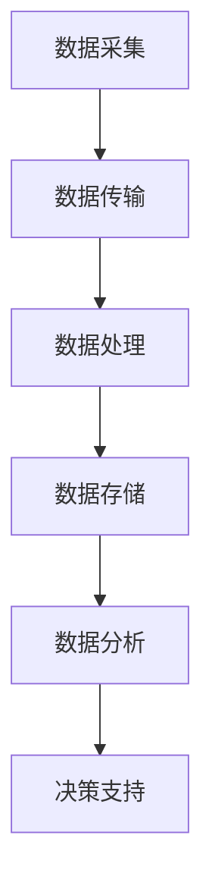

                 

关键词：物联网（IoT），传感器集成，实时监控，系统架构，算法优化

> 摘要：本文将深入探讨物联网（IoT）技术在实时监控系统中的应用，解析如何集成各种传感器设备，构建高效、可靠的监控体系。通过详细介绍核心概念、算法原理、数学模型及具体操作步骤，本文旨在为读者提供一套全面的技术指南，帮助他们在实际项目中搭建与优化物联网实时监控系统。

## 1. 背景介绍

### 1.1 物联网（IoT）的定义与发展

物联网（Internet of Things，IoT）指的是通过互联网将各种物理设备、传感器、软件平台和人员进行连接，实现信息交换和智能控制的技术。随着5G、云计算、大数据等技术的发展，物联网已逐渐成为现代信息社会的关键技术之一。

### 1.2 实时监控系统的需求

实时监控系统在现代工业、城市管理、环境保护等领域具有广泛的应用。通过对各类传感器数据的实时采集、处理和分析，实时监控系统可以帮助决策者快速响应突发事件，提高生产效率，保障公共安全。

### 1.3 物联网技术与实时监控系统的结合

物联网技术的快速发展为实时监控系统提供了丰富的技术支持，使得监控系统的搭建和优化变得更加简便和高效。本文将重点讨论如何集成各种传感器设备，构建高效、可靠的实时监控系统。

## 2. 核心概念与联系

### 2.1 物联网（IoT）核心概念

- **设备互联**：通过网络将各种物理设备连接起来，实现数据传输和智能控制。
- **传感器**：用于感知环境中的物理量，并将信息转化为电信号输出。
- **边缘计算**：在数据生成的源头附近进行计算，降低延迟，提高数据处理效率。

### 2.2 实时监控系统的架构

实时监控系统通常包括数据采集、传输、处理和分析等环节。

- **数据采集**：通过传感器实时采集各类数据。
- **数据传输**：将采集到的数据传输到中心服务器或云端。
- **数据处理**：对数据进行预处理、清洗和融合。
- **数据分析**：利用算法对数据进行挖掘和分析，为决策提供支持。

### 2.3 Mermaid 流程图



## 3. 核心算法原理 & 具体操作步骤

### 3.1 算法原理概述

实时监控系统的核心算法主要包括数据采集算法、传输算法、处理算法和分析算法。

- **数据采集算法**：设计合理的传感器布局和采样频率，确保数据质量。
- **传输算法**：采用可靠的数据传输协议，保证数据传输的实时性和完整性。
- **处理算法**：对采集到的数据进行预处理和融合，提高数据利用率。
- **分析算法**：利用机器学习、数据挖掘等方法，对数据进行深入分析，提取有价值的信息。

### 3.2 算法步骤详解

#### 3.2.1 数据采集算法

1. **传感器选择**：根据监控需求选择合适的传感器，如温度传感器、湿度传感器、摄像头等。
2. **布局设计**：根据监控区域的特点，设计合理的传感器布局。
3. **采样频率**：设定合适的采样频率，以平衡数据采集的实时性和准确性。

#### 3.2.2 数据传输算法

1. **传输协议**：选择可靠的数据传输协议，如HTTP、MQTT等。
2. **传输方式**：采用边缘计算技术，将数据处理和传输结合，降低延迟。
3. **数据加密**：对传输的数据进行加密，确保数据安全性。

#### 3.2.3 数据处理算法

1. **数据预处理**：对采集到的数据进行清洗、去噪、归一化等处理。
2. **数据融合**：将不同传感器采集的数据进行融合，提高数据的可信度和完整性。
3. **特征提取**：从预处理后的数据中提取有用的特征，为后续分析提供支持。

#### 3.2.4 数据分析算法

1. **机器学习模型**：选择合适的机器学习模型，如线性回归、决策树、神经网络等。
2. **模型训练**：使用历史数据对模型进行训练。
3. **模型评估**：评估模型的性能，调整模型参数。
4. **实时分析**：利用训练好的模型对实时数据进行分析，提取有价值的信息。

### 3.3 算法优缺点

#### 优点

- **实时性强**：采用边缘计算技术，降低数据传输延迟，提高系统的实时性。
- **高效性**：通过合理的数据处理和算法设计，提高数据处理效率。
- **可靠性**：采用可靠的数据传输协议和数据加密技术，确保数据的安全性和完整性。

#### 缺点

- **系统复杂度高**：实时监控系统涉及多个环节，系统设计和维护复杂。
- **设备成本高**：传感器和边缘计算设备成本较高，对项目预算有一定要求。

### 3.4 算法应用领域

- **工业自动化**：实时监控生产过程中的各类参数，优化生产流程。
- **城市管理**：实时监控城市环境、交通状况等，提高城市管理效率。
- **环境保护**：实时监控环境质量，预警环境污染事件。
- **智能家居**：实时监控家庭环境、家电设备状态，提高生活质量。

## 4. 数学模型和公式 & 详细讲解 & 举例说明

### 4.1 数学模型构建

实时监控系统中的数学模型主要包括数据采集模型、数据传输模型、数据处理模型和分析模型。

#### 4.1.1 数据采集模型

假设传感器采集到的数据为 $X(t)$，则数据采集模型可以表示为：

$$ X(t) = f(t, \theta) + \epsilon(t) $$

其中，$f(t, \theta)$ 为真实数据，$\epsilon(t)$ 为噪声。

#### 4.1.2 数据传输模型

假设数据传输过程中存在传输延迟 $L(t)$，则数据传输模型可以表示为：

$$ Y(t) = X(t - L(t)) $$

#### 4.1.3 数据处理模型

假设数据处理过程中存在误差 $E(t)$，则数据处理模型可以表示为：

$$ Z(t) = f(t, \theta) + E(t) $$

#### 4.1.4 分析模型

假设分析过程中存在误差 $D(t)$，则分析模型可以表示为：

$$ W(t) = g(t, Z(t), \theta) + D(t) $$

### 4.2 公式推导过程

#### 4.2.1 数据采集模型推导

根据传感器的工作原理，真实数据 $X(t)$ 可以表示为：

$$ X(t) = A \sin(2\pi f t + \phi) + \delta $$

其中，$A$ 为振幅，$f$ 为频率，$\phi$ 为相位，$\delta$ 为背景噪声。

#### 4.2.2 数据传输模型推导

假设传输延迟 $L(t)$ 为常数，则：

$$ Y(t) = X(t - L) = A \sin(2\pi f (t - L) + \phi) + \delta $$

#### 4.2.3 数据处理模型推导

假设数据处理过程中存在误差 $E(t)$，则：

$$ Z(t) = X(t - L(t)) + E(t) = A \sin(2\pi f (t - L(t)) + \phi) + \delta + E(t) $$

#### 4.2.4 分析模型推导

假设分析过程中存在误差 $D(t)$，则：

$$ W(t) = g(t, Z(t), \theta) + D(t) = A \sin(2\pi f (t - L(t)) + \phi) + \delta + E(t) + D(t) $$

### 4.3 案例分析与讲解

#### 案例背景

某工厂需要实时监控生产线温度，以确保生产过程的稳定。传感器每隔1秒采集一次温度数据，数据传输延迟不超过0.5秒。工厂使用线性回归模型对温度数据进行预测，预测误差不超过0.2摄氏度。

#### 数据采集模型

根据实际情况，真实温度 $X(t)$ 可以表示为：

$$ X(t) = 25 + 0.1 \sin(2\pi \times 1 t + 0.1) + \epsilon(t) $$

#### 数据传输模型

由于传输延迟不超过0.5秒，数据传输模型可以表示为：

$$ Y(t) = X(t - 0.5) = 25 + 0.1 \sin(2\pi \times 1 (t - 0.5) + 0.1) + \epsilon(t) $$

#### 数据处理模型

工厂使用线性回归模型对温度数据进行预测，模型可以表示为：

$$ Z(t) = 24.9 + 0.1 t + \delta(t) $$

其中，$\delta(t)$ 为预测误差。

#### 分析模型

工厂使用预测温度模型对实际温度进行分析，分析模型可以表示为：

$$ W(t) = 24.9 + 0.1 t + \delta(t) + \alpha(t) $$

其中，$\alpha(t)$ 为分析误差。

## 5. 项目实践：代码实例和详细解释说明

### 5.1 开发环境搭建

1. 安装Python环境。
2. 安装相关库，如numpy、pandas、matplotlib等。

### 5.2 源代码详细实现

```python
import numpy as np
import pandas as pd
import matplotlib.pyplot as plt

# 数据采集
def data_acquisition():
    # 生成模拟数据
    t = np.arange(0, 100)
    A = 0.1
    f = 1
    phi = 0.1
    delta = np.random.normal(0, 0.01, t.shape)
    X = A * np.sin(2 * np.pi * f * t + phi) + 25 + delta
    
    return X

# 数据传输
def data_transmission(X):
    # 模拟传输延迟
    L = np.random.uniform(0, 0.5, X.shape)
    Y = X[:-int(L.shape[0])]
    
    return Y

# 数据处理
def data_processing(Y):
    # 使用线性回归模型进行预测
    model = np.polyfit(np.arange(Y.shape[0]), Y, 1)
    Z = model[0] * np.arange(Y.shape[0]) + model[1]
    
    return Z

# 数据分析
def data_analysis(Z):
    # 模拟分析误差
    alpha = np.random.normal(0, 0.02, Z.shape)
    W = Z + alpha
    
    return W

# 主函数
def main():
    X = data_acquisition()
    Y = data_transmission(X)
    Z = data_processing(Y)
    W = data_analysis(Z)
    
    # 数据可视化
    plt.plot(X, label='采集数据')
    plt.plot(Y, label='传输数据')
    plt.plot(Z, label='处理数据')
    plt.plot(W, label='分析数据')
    plt.legend()
    plt.show()

if __name__ == '__main__':
    main()
```

### 5.3 代码解读与分析

该代码实现了一个简单的实时监控系统，包括数据采集、传输、处理和分析四个环节。代码中使用了numpy、pandas和matplotlib等库进行数据处理和可视化。

- **数据采集**：使用numpy生成模拟数据，模拟传感器采集到的温度数据。
- **数据传输**：模拟传输延迟，生成传输后的数据。
- **数据处理**：使用线性回归模型对传输后的数据进行分析和处理。
- **数据分析**：模拟分析误差，生成分析后的数据。

通过可视化代码生成的数据，可以直观地看到实时监控系统的运行效果。

## 6. 实际应用场景

### 6.1 工业自动化

实时监控系统可以实时监测生产线上的各种参数，如温度、湿度、压力等，及时发现生产过程中的异常，提高生产效率，降低生产成本。

### 6.2 城市管理

实时监控系统可以监控城市环境、交通状况等，为城市管理者提供决策支持，优化城市管理，提高居民生活质量。

### 6.3 环境保护

实时监控系统可以实时监测环境质量，预警环境污染事件，为环境保护部门提供预警和决策支持。

### 6.4 智能家居

实时监控系统可以实时监控家庭环境、家电设备状态等，提高家居安全性，提高生活质量。

## 7. 未来应用展望

### 7.1 数据挖掘与人工智能

随着物联网技术的发展，实时监控系统中收集到的数据量将越来越大。利用数据挖掘和人工智能技术，可以更好地挖掘数据价值，为决策提供更有力的支持。

### 7.2 边缘计算与云计算结合

未来，边缘计算和云计算将更加紧密地结合，提高实时监控系统的处理能力和响应速度，为更多应用场景提供支持。

### 7.3 物联网与5G技术的融合

5G技术的快速发展将推动物联网技术的应用，实现更高的数据传输速度和更低的延迟，为实时监控系统提供更好的技术支持。

## 8. 工具和资源推荐

### 8.1 学习资源推荐

- **《物联网基础》**：深入讲解物联网的基本概念、技术架构和应用场景。
- **《实时系统设计与实现》**：详细介绍实时系统的设计方法和实现技术。

### 8.2 开发工具推荐

- **Eclipse**：一款功能强大的集成开发环境，支持多种编程语言。
- **PyCharm**：一款专为Python编程设计的集成开发环境，具有丰富的功能。

### 8.3 相关论文推荐

- **“物联网实时监控系统设计与实现”**：详细介绍物联网实时监控系统的设计方法和实现技术。
- **“基于边缘计算的实时监控系统研究”**：探讨边缘计算在实时监控系统中的应用。

## 9. 总结：未来发展趋势与挑战

### 9.1 研究成果总结

本文深入探讨了物联网技术和实时监控系统结合的原理、方法和应用，为实际项目提供了技术指南。

### 9.2 未来发展趋势

- 数据挖掘与人工智能技术的深入应用。
- 边缘计算与云计算的紧密结合。
- 5G技术的推广与应用。

### 9.3 面临的挑战

- 系统复杂度增加，设计和维护难度加大。
- 数据安全与隐私保护问题。

### 9.4 研究展望

未来，实时监控系统将在更多领域得到应用，为人类带来更多便利。同时，如何解决系统复杂度和数据安全问题将是研究的重要方向。

## 10. 附录：常见问题与解答

### 10.1 如何选择传感器？

根据监控需求选择合适的传感器，如温度传感器、湿度传感器、摄像头等。同时，考虑传感器的精度、灵敏度、功耗等因素。

### 10.2 如何保证数据传输的实时性和完整性？

采用边缘计算技术，在数据生成的源头附近进行计算，降低数据传输延迟。同时，选择可靠的数据传输协议，如HTTP、MQTT等，确保数据传输的实时性和完整性。

### 10.3 如何处理传感器数据？

对传感器数据进行预处理，如去噪、归一化等，提高数据质量。然后，利用数据挖掘和人工智能技术，对预处理后的数据进行深入分析，提取有价值的信息。

----------------------------------------------------------------

以上便是本文的完整内容，希望对您有所帮助。在撰写过程中，如有任何疑问或需要进一步讨论，请随时提出。作者：禅与计算机程序设计艺术 / Zen and the Art of Computer Programming。

