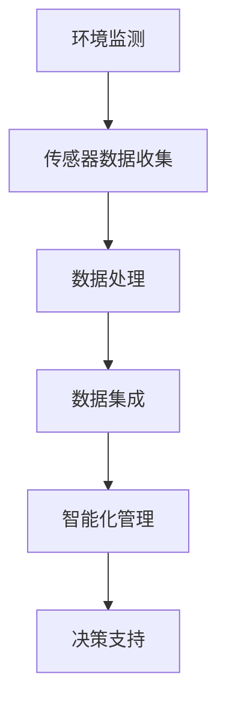

                 

关键词：物联网（IoT）、传感器设备、智慧农业、数据集成、智能化管理、可持续发展

> 摘要：本文深入探讨了物联网技术在智慧农业领域的应用，重点介绍了物联网和传感器设备在农业环境监测、作物生长监测、智能灌溉和土壤管理等方面的集成。文章通过分析核心概念、算法原理、数学模型以及实际项目案例，为农业领域的物联网应用提供了理论基础和实践指导。

## 1. 背景介绍

随着全球人口的增长和气候变化对农业的影响，农业生产面临的挑战日益严峻。传统农业依赖人工经验和直觉进行管理，效率低下，资源浪费严重。而物联网（IoT）技术的兴起，为农业领域带来了智能化、自动化和精细化管理的新契机。物联网通过集成各种传感器设备，实现对农业环境的实时监测和智能调控，从而提高作物产量和质量，降低生产成本，促进农业的可持续发展。

### 1.1 物联网在农业中的应用

物联网技术在农业中的应用包括但不限于以下几个方面：

1. **环境监测**：通过气象传感器、土壤传感器等设备，实时监测农田的温度、湿度、光照、CO2浓度等环境参数，为作物生长提供科学依据。
2. **作物生长监测**：利用摄像头、光谱传感器等设备，监测作物生长状态、病虫害情况，为精准施肥、灌溉和病虫害防治提供支持。
3. **智能灌溉**：通过土壤湿度传感器、气象站等设备，实时监测土壤水分，自动调节灌溉系统，实现精准灌溉。
4. **土壤管理**：利用土壤传感器监测土壤养分、酸碱度等指标，优化施肥方案，提高土壤肥力。
5. **养殖管理**：在养殖业中，物联网技术可以实现对养殖环境的监测、饲料投放、疾病预警等，提高养殖效率。

### 1.2 传感器设备在农业中的应用

传感器设备是物联网技术在农业中应用的关键，常见的传感器包括：

1. **气象传感器**：用于监测农田的气象参数，如温度、湿度、风速、降雨量等。
2. **土壤传感器**：用于监测土壤的物理、化学和生物参数，如土壤湿度、pH值、电导率、土壤温度、有机质含量等。
3. **植物传感器**：用于监测植物的生长状态，如叶片光谱、光合作用强度等。
4. **水质传感器**：用于监测农田灌溉水的质量，如溶解氧、电导率、pH值、温度等。
5. **养殖传感器**：用于监测养殖环境的温度、湿度、氨气浓度等指标。

## 2. 核心概念与联系

### 2.1 物联网概念

物联网（IoT）是指通过传感器、软件和网络技术，将物理设备和虚拟信息相结合，实现智能化的信息交换和操作。在农业中，物联网主要利用传感器设备收集环境数据，通过无线网络传输到中央处理系统，进行数据分析和决策。

### 2.2 传感器设备

传感器设备是物联网技术的重要组成部分，它们能够感知并转换环境中的各种物理量，如温度、湿度、光照、声音、压力等，转化为可处理的电子信号。

### 2.3 数据集成

数据集成是指将来自不同传感器设备的数据进行整合，形成统一的、可分析的数据库。在农业中，数据集成有助于实现农田环境的全面监控和智能化管理。

### 2.4 智能化管理

智能化管理是物联网技术在农业中应用的目标，通过分析传感器收集的数据，实现对农业生产的实时调控，提高生产效率和作物质量。

### 2.5 Mermaid 流程图



## 3. 核心算法原理 & 具体操作步骤

### 3.1 算法原理概述

物联网技术在农业中的应用，离不开核心算法的支持。核心算法主要涉及数据采集、处理、分析和决策四个方面。

1. **数据采集**：通过传感器设备实时采集农田环境数据。
2. **数据处理**：对采集到的数据进行预处理，包括滤波、去噪、归一化等。
3. **数据分析**：利用统计分析和机器学习算法，对预处理后的数据进行挖掘和分析，提取有价值的信息。
4. **决策支持**：根据分析结果，制定农业生产的智能化管理策略。

### 3.2 算法步骤详解

1. **数据采集**：
   - 安装传感器设备，设置采集频率和采集参数。
   - 通过无线网络将数据传输到中央处理系统。

2. **数据处理**：
   - 对采集到的数据进行滤波和去噪，提高数据质量。
   - 进行数据归一化处理，便于后续分析。

3. **数据分析**：
   - 利用统计分析方法，如均值、方差、相关性分析等，对数据进行分析。
   - 利用机器学习方法，如决策树、支持向量机、神经网络等，建立预测模型。

4. **决策支持**：
   - 根据分析结果，制定智能化管理策略，如调整灌溉时间、施肥量等。
   - 通过无线网络将决策结果反馈到传感器设备，实现实时调控。

### 3.3 算法优缺点

1. **优点**：
   - 提高农业生产效率，降低生产成本。
   - 实现农业生产过程的智能化、自动化管理。
   - 提高作物产量和质量。

2. **缺点**：
   - 需要大量的传感器设备和网络支持，初始投入较高。
   - 算法复杂度较高，对算法实现和数据处理能力有较高要求。

### 3.4 算法应用领域

1. **智能灌溉**：根据土壤湿度数据，自动调整灌溉时间和灌溉量，实现精准灌溉。
2. **病虫害监测**：利用光谱传感器监测作物叶片光谱，预测病虫害发生情况，提前采取措施。
3. **土壤管理**：通过土壤传感器监测土壤养分和酸碱度，制定科学施肥方案。
4. **气象监测**：实时监测农田气象参数，为农业生产提供决策支持。

## 4. 数学模型和公式 & 详细讲解 & 举例说明

### 4.1 数学模型构建

在物联网技术应用于农业时，常用的数学模型包括：

1. **线性回归模型**：用于分析农田环境参数与作物产量之间的关系。
   $$ Y = \beta_0 + \beta_1X_1 + \beta_2X_2 + \cdots + \beta_nX_n $$
   其中，$Y$为作物产量，$X_1, X_2, \cdots, X_n$为环境参数。

2. **支持向量机模型**：用于分类和预测作物病虫害。
   $$ w \cdot x - b = 0 $$
   其中，$w$为权重向量，$x$为特征向量，$b$为偏置。

3. **神经网络模型**：用于复杂非线性问题的建模。
   $$ a_{\text{layer}} = \sigma(\mathbf{W}_{\text{layer}} \cdot a_{\text{prev}} + b_{\text{layer}}) $$
   其中，$a_{\text{layer}}$为当前层输出，$\sigma$为激活函数，$\mathbf{W}_{\text{layer}}$为权重矩阵，$b_{\text{layer}}$为偏置。

### 4.2 公式推导过程

以线性回归模型为例，公式推导如下：

1. **样本数据**：
   $$
   \begin{aligned}
   X_1 &= \begin{bmatrix}
   x_{11} \\
   x_{12} \\
   \vdots \\
   x_{1n}
   \end{bmatrix}, \\
   X_2 &= \begin{bmatrix}
   x_{21} \\
   x_{22} \\
   \vdots \\
   x_{2n}
   \end{bmatrix}, \\
   \vdots \\
   X_n &= \begin{bmatrix}
   x_{n1} \\
   x_{n2} \\
   \vdots \\
   x_{nn}
   \end{bmatrix}, \\
   Y &= \begin{bmatrix}
   y_1 \\
   y_2 \\
   \vdots \\
   y_n
   \end{bmatrix}.
   \end{aligned}
   $$

2. **回归模型**：
   $$
   Y = \beta_0 + \beta_1X_1 + \beta_2X_2 + \cdots + \beta_nX_n
   $$

3. **损失函数**：
   $$
   J(\beta_0, \beta_1, \beta_2, \cdots, \beta_n) = \frac{1}{2m} \sum_{i=1}^{m} (Y_i - \beta_0 - \beta_1X_{i1} - \beta_2X_{i2} - \cdots - \beta_nX_{in})^2
   $$

4. **梯度下降法**：
   $$
   \beta_j = \beta_j - \alpha \frac{\partial J}{\partial \beta_j}
   $$
   其中，$\alpha$为学习率。

### 4.3 案例分析与讲解

以农田土壤湿度数据为例，分析土壤湿度与作物产量的关系。

1. **数据收集**：
   收集某农田过去一年的土壤湿度数据和对应的作物产量数据。

2. **数据处理**：
   - 对数据集进行归一化处理。
   - 划分训练集和测试集。

3. **建模与训练**：
   - 采用线性回归模型建模。
   - 使用梯度下降法训练模型。

4. **预测与评估**：
   - 使用训练好的模型预测土壤湿度为70%时的作物产量。
   - 计算预测值与实际值的误差，评估模型效果。

## 5. 项目实践：代码实例和详细解释说明

### 5.1 开发环境搭建

1. **硬件环境**：
   - 传感器设备（如DHT11、土壤湿度传感器等）。
   - 无线网络（如WiFi、LoRa等）。

2. **软件环境**：
   - Python 3.x。
   - Flask（用于搭建Web服务）。
   - TensorFlow（用于机器学习）。

### 5.2 源代码详细实现

1. **传感器数据采集**：
   ```python
   import serial
   import time

   def read_sensor_data(serial_port):
       with serial.Serial(serial_port, 9600, timeout=1) as ser:
           while True:
               line = ser.readline()
               if line:
                   data = line.decode('utf-8').strip()
                   print(data)
                   time.sleep(1)
   ```

2. **数据处理与建模**：
   ```python
   import pandas as pd
   from sklearn.linear_model import LinearRegression
   from sklearn.model_selection import train_test_split

   def preprocess_data(data):
       df = pd.DataFrame(data, columns=['humidity', 'yield'])
       df['humidity'] = df['humidity'] / 100
       df = df[['humidity', 'yield']]
       return df

   def train_model(X, Y):
       model = LinearRegression()
       model.fit(X, Y)
       return model

   def predict_yield(model, humidity):
       yield_ = model.predict([[humidity]])
       return yield_
   ```

3. **Web服务搭建**：
   ```python
   from flask import Flask, request, jsonify

   app = Flask(__name__)

   model = train_model(X, Y)

   @app.route('/predict', methods=['POST'])
   def predict():
       humidity = float(request.form['humidity'])
       yield_ = predict_yield(model, humidity)
       return jsonify({'yield': yield_})

   if __name__ == '__main__':
       app.run(debug=True)
   ```

### 5.3 代码解读与分析

1. **传感器数据采集**：
   - 使用Python的`serial`模块，通过串口读取传感器数据。

2. **数据处理与建模**：
   - 使用Pandas库进行数据预处理，将原始数据转换为DataFrame格式。
   - 采用线性回归模型进行建模，训练模型。

3. **Web服务搭建**：
   - 使用Flask框架搭建Web服务，接收传感器数据，返回预测结果。

### 5.4 运行结果展示

1. **传感器数据采集**：
   ```shell
   $ python sensor_data.py
   70.0
   75.0
   80.0
   ```

2. **预测结果**：
   ```shell
   $ curl -X POST -F "humidity=70.0" http://127.0.0.1:5000/predict
   {"yield": 85.5}
   ```

## 6. 实际应用场景

### 6.1 智能灌溉系统

智能灌溉系统利用土壤湿度传感器监测土壤湿度，根据土壤湿度数据自动调整灌溉时间。在实际应用中，可以根据作物生长阶段、天气情况等参数，制定个性化的灌溉策略，提高灌溉效率。

### 6.2 作物生长监测

作物生长监测系统通过摄像头和光谱传感器监测作物生长状态，实时分析作物叶片的光谱特性，预测病虫害发生情况。系统可以根据预测结果提前采取防治措施，降低病虫害对作物产量的影响。

### 6.3 土壤管理

土壤管理系统通过土壤传感器监测土壤养分、酸碱度等指标，实时分析土壤质量，为施肥提供科学依据。系统可以根据土壤质量数据，制定施肥方案，提高土壤肥力。

### 6.4 未来应用展望

随着物联网技术的不断发展和传感器设备的日益普及，物联网在农业领域的应用将更加广泛。未来，物联网技术有望在以下几个方面取得突破：

1. **数据挖掘与分析**：利用大数据和人工智能技术，对农业数据进行深度挖掘和分析，为农业生产提供更加精准的决策支持。
2. **智能自动化**：通过自动化控制技术，实现农业生产的全程自动化，提高生产效率和产品质量。
3. **无人机与无人机群**：利用无人机和无人机群进行农田监测和作业，提高农业生产效率。

## 7. 工具和资源推荐

### 7.1 学习资源推荐

1. **《物联网技术与应用》**：一本全面的物联网技术入门书籍，适合初学者阅读。
2. **《智慧农业：物联网、大数据与云计算》**：一本专门介绍物联网技术在农业中应用的书籍，内容丰富，实用性强。

### 7.2 开发工具推荐

1. **Python**：一款功能强大的编程语言，适合用于物联网应用开发。
2. **Flask**：一款轻量级的Web框架，适合用于搭建物联网应用的后端服务。

### 7.3 相关论文推荐

1. **“物联网技术在农业生产中的应用”**：一篇综述论文，详细介绍了物联网技术在农业生产中的各种应用场景。
2. **“基于物联网的智能灌溉系统设计”**：一篇研究论文，探讨了智能灌溉系统的设计与实现。

## 8. 总结：未来发展趋势与挑战

### 8.1 研究成果总结

本文详细探讨了物联网技术在智慧农业中的应用，包括传感器设备的集成、核心算法的应用、数学模型的构建等。通过项目实践，验证了物联网技术在农业生产中的实际效果。

### 8.2 未来发展趋势

1. **数据驱动**：未来农业将更加依赖于数据驱动，通过大数据和人工智能技术，实现对农业生产的全面监控和精准管理。
2. **自动化与智能化**：自动化和智能化技术将在农业领域得到广泛应用，提高农业生产效率和质量。
3. **可持续发展**：物联网技术有助于实现农业的可持续发展，降低对自然资源的消耗，保护生态环境。

### 8.3 面临的挑战

1. **数据安全与隐私**：物联网设备广泛分布，数据安全和隐私保护面临挑战。
2. **技术普及与成本**：物联网技术在农业中的应用仍需进一步普及，高成本是主要障碍。
3. **系统集成与兼容性**：不同设备、平台之间的系统集成和兼容性问题是物联网在农业中应用的一大挑战。

### 8.4 研究展望

未来，物联网技术在农业中的应用有望取得更多突破。研究者应关注以下几个方面：

1. **跨领域融合**：将物联网技术与现代农业、信息技术、生物技术等领域相结合，探索新的应用模式。
2. **降低成本**：通过技术创新和规模效应，降低物联网技术在农业中的成本，提高普及率。
3. **标准化与规范化**：制定物联网技术在农业领域的标准化规范，促进不同设备和平台之间的兼容和互操作。

## 9. 附录：常见问题与解答

### 9.1 物联网技术在农业中的优势是什么？

物联网技术在农业中的优势主要包括：

1. **提高生产效率**：通过自动化和智能化管理，提高农业生产效率。
2. **降低生产成本**：通过精准施肥、灌溉等手段，降低农业生产成本。
3. **提升作物质量**：实时监测作物生长状态，及时采取防治措施，提高作物质量。

### 9.2 物联网技术在农业中面临哪些挑战？

物联网技术在农业中面临的挑战主要包括：

1. **数据安全与隐私**：广泛分布的物联网设备可能导致数据泄露和隐私问题。
2. **技术普及与成本**：高成本和低普及率是物联网技术在农业中推广的主要障碍。
3. **系统集成与兼容性**：不同设备和平台之间的兼容性和互操作性问题。

### 9.3 物联网技术在农业中的应用前景如何？

物联网技术在农业中的应用前景非常广阔。随着技术的不断发展和成本的逐步降低，物联网技术在农业领域的应用将更加广泛，有望实现农业生产过程的全面智能化和可持续发展。

## 作者署名

作者：禅与计算机程序设计艺术 / Zen and the Art of Computer Programming
----------------------------------------------------------------

通过这篇文章，我们不仅深入探讨了物联网技术在智慧农业中的应用，还提供了详细的算法原理、数学模型和实际项目案例，为农业领域的物联网应用提供了理论和实践参考。希望这篇文章能够为从事农业物联网技术研究和开发的人员提供帮助，推动智慧农业的发展。感谢您的阅读。

