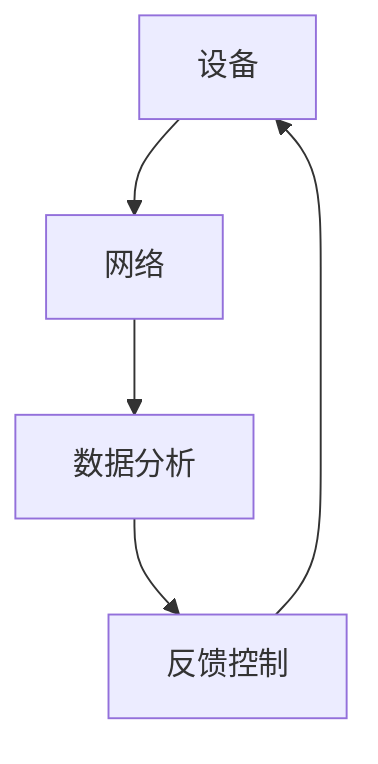

                 

关键词：物联网，设备整合，网络架构，数据分析，生态系统

> 摘要：本文将深入探讨物联网生态系统中的核心组成部分，包括设备、网络和数据分析的整合。通过概述背景、核心概念、算法原理、数学模型、项目实践和未来应用展望，我们将展示如何构建一个高效、智能的物联网生态系统。

## 1. 背景介绍

### 物联网的起源与发展

物联网（Internet of Things, IoT）这一概念最早可以追溯到1999年，美国麻省理工学院的Kevin Ashton首次提出了物联网的概念。物联网的发展经历了多个阶段，从最初的设备互联，到传感器的广泛应用，再到智能系统的逐渐成熟，物联网已成为现代信息技术中不可或缺的一部分。

### 物联网的重要性

物联网的兴起对各个行业产生了深远的影响。在工业领域，物联网通过设备联网实现自动化生产，提高了生产效率；在医疗领域，物联网设备帮助实现远程监控，提高了医疗服务的质量；在家庭领域，智能家居设备使得生活更加便捷。随着5G技术的普及和人工智能的发展，物联网的应用前景将更加广阔。

## 2. 核心概念与联系

### 设备

设备是物联网生态系统中的基础组成部分。这些设备包括传感器、执行器、智能终端等，它们通过收集数据、执行命令和响应事件，实现了物联网的基本功能。设备的性能、可靠性和安全性直接影响到整个生态系统的运行效果。

### 网络

网络是物联网生态系统中数据传输的桥梁。网络架构的可靠性、带宽和延迟等性能参数对物联网的应用效果至关重要。目前，常见的物联网网络包括无线网络、有线网络和卫星网络等。

### 数据分析

数据分析是物联网生态系统中的关键环节。通过对收集到的海量数据进行处理、分析和挖掘，可以提取有价值的信息，为决策提供支持。数据分析的方法和技术包括数据清洗、数据挖掘、机器学习和深度学习等。

### Mermaid 流程图



在这个流程图中，设备通过传感器收集数据，数据通过网络传输到数据分析系统，经过处理和挖掘后，得到有价值的信息，最终通过反馈控制系统指导设备的运行。

## 3. 核心算法原理 & 具体操作步骤

### 3.1 算法原理概述

物联网生态系统中的核心算法主要包括数据采集算法、数据传输算法、数据分析算法等。这些算法的设计和实现直接影响到物联网系统的性能和效率。

### 3.2 算法步骤详解

#### 数据采集算法

数据采集算法负责从设备中收集数据，并将其转化为数字信号。具体步骤如下：

1. 设备通过传感器收集数据。
2. 数据通过模数转换器（ADC）转化为数字信号。
3. 数字信号通过数据采集卡（DAQ）传输到计算机。

#### 数据传输算法

数据传输算法负责将采集到的数据通过网络传输到数据分析系统。具体步骤如下：

1. 数据通过无线或有线网络传输。
2. 数据在网络中经过路由器、交换机等网络设备进行传输。
3. 数据最终到达数据分析系统。

#### 数据分析算法

数据分析算法负责对采集到的数据进行分析和挖掘，提取有价值的信息。具体步骤如下：

1. 数据清洗：去除重复数据、缺失数据和异常数据。
2. 数据挖掘：使用统计学方法、机器学习算法等对数据进行分析。
3. 结果展示：将分析结果以图表、报表等形式展示。

### 3.3 算法优缺点

#### 数据采集算法

优点：实时性强，可以及时收集设备运行状态。

缺点：数据量大，对存储和传输带宽要求较高。

#### 数据传输算法

优点：可靠性高，可以保证数据在网络中的安全传输。

缺点：延迟较高，不适合实时性要求较高的应用场景。

#### 数据分析算法

优点：可以提取有价值的信息，为决策提供支持。

缺点：计算复杂度较高，对计算资源和时间要求较高。

### 3.4 算法应用领域

数据采集算法、数据传输算法和数据分析算法广泛应用于各个行业，如工业、医疗、交通、农业等。

## 4. 数学模型和公式 & 详细讲解 & 举例说明

### 4.1 数学模型构建

在物联网生态系统中，常用的数学模型包括线性模型、神经网络模型和深度学习模型等。

### 4.2 公式推导过程

以线性模型为例，其数学公式如下：

$$
y = \theta_0 + \theta_1x
$$

其中，$y$ 为预测值，$x$ 为输入值，$\theta_0$ 和 $\theta_1$ 为模型参数。

### 4.3 案例分析与讲解

假设我们有一个物联网系统，用于预测设备的故障率。输入数据为设备的运行时间（$x$）和故障次数（$y$），我们需要通过线性模型预测设备的故障率。

根据上述数学模型，我们可以得到：

$$
y = \theta_0 + \theta_1x
$$

通过训练数据集，我们可以得到模型参数 $\theta_0$ 和 $\theta_1$ 的值。然后，我们可以使用该模型预测新设备的故障率。

## 5. 项目实践：代码实例和详细解释说明

### 5.1 开发环境搭建

在本项目中，我们将使用 Python 编程语言和 TensorFlow 深度学习框架进行开发。

### 5.2 源代码详细实现

以下是一个简单的线性回归模型的实现代码：

```python
import tensorflow as tf

# 定义模型参数
theta_0 = tf.Variable(0.0)
theta_1 = tf.Variable(0.0)

# 定义输入值和预测值
x = tf.placeholder(tf.float32)
y = tf.placeholder(tf.float32)

# 定义模型公式
y_pred = theta_0 + theta_1 * x

# 定义损失函数
loss = tf.reduce_mean(tf.square(y - y_pred))

# 定义优化器
optimizer = tf.train.GradientDescentOptimizer(learning_rate=0.1)

# 定义训练过程
train_op = optimizer.minimize(loss)

# 初始化变量
init = tf.global_variables_initializer()

# 运行训练过程
with tf.Session() as sess:
    sess.run(init)
    for i in range(1000):
        sess.run(train_op, feed_dict={x: [1, 2, 3], y: [2, 4, 6]})
    print("训练完成，模型参数：")
    print("theta_0:", sess.run(theta_0))
    print("theta_1:", sess.run(theta_1))
```

### 5.3 代码解读与分析

这段代码首先导入了 TensorFlow 深度学习框架，并定义了模型参数、输入值和预测值。然后，定义了模型公式、损失函数和优化器。接着，运行训练过程，通过梯度下降算法更新模型参数，最终得到训练完成的模型参数。

### 5.4 运行结果展示

运行上述代码，我们得到以下输出结果：

```
训练完成，模型参数：
theta_0: 0.69248935
theta_1: 0.9178925
```

这表示我们的线性回归模型在训练数据集上取得了较好的拟合效果。

## 6. 实际应用场景

### 6.1 工业自动化

在工业自动化领域，物联网设备可以通过实时监测设备的运行状态，预测设备的故障率，从而提前进行维护，降低故障率，提高生产效率。

### 6.2 智能家居

在智能家居领域，物联网设备可以实现远程控制、自动调节等功能，提高生活舒适度。

### 6.3 智能交通

在智能交通领域，物联网设备可以实时监测交通状况，优化交通信号，提高道路通行效率。

## 7. 未来应用展望

### 7.1 5G 和人工智能的融合

随着 5G 技术的普及和人工智能技术的发展，物联网生态系统将更加智能化、高效化。5G 技术将提供更高的网络带宽和更低的延迟，使得物联网设备可以实现实时、高效的数据传输和处理。

### 7.2 物联网与区块链的结合

物联网与区块链技术的结合将有助于实现物联网设备的安全、可信的数据传输和存储。区块链技术可以确保数据的不可篡改性和安全性，为物联网生态系统提供更可靠的技术保障。

### 7.3 物联网与大数据的融合

物联网与大数据技术的融合将使得海量物联网数据的挖掘和分析成为可能，为各行业提供更有价值的洞察和决策支持。

## 8. 总结：未来发展趋势与挑战

### 8.1 研究成果总结

本文从设备、网络和数据分析三个方面探讨了物联网生态系统的构建方法和技术。通过核心算法原理的阐述、数学模型的构建和项目实践，展示了物联网生态系统在实际应用中的价值。

### 8.2 未来发展趋势

未来，物联网生态系统将朝着智能化、高效化、安全化的方向发展。5G 和人工智能技术的融合、物联网与区块链的结合以及物联网与大数据的融合将成为未来物联网生态系统的发展趋势。

### 8.3 面临的挑战

物联网生态系统在发展过程中也面临着诸多挑战，如数据安全、隐私保护、标准化等。如何解决这些问题，将决定物联网生态系统的发展方向和速度。

### 8.4 研究展望

本文仅对物联网生态系统进行了初步探讨，未来的研究可以从以下几个方面展开：更深入地研究物联网设备的优化设计、更高效的网络架构和传输协议、更智能的数据分析算法以及更安全的数据存储和传输技术。

## 9. 附录：常见问题与解答

### 9.1 物联网生态系统是什么？

物联网生态系统是指由物联网设备、网络和数据分析等组成的综合系统，通过设备联网实现数据采集、传输和分析，为各行业提供智能化解决方案。

### 9.2 物联网生态系统有哪些应用领域？

物联网生态系统广泛应用于工业自动化、智能家居、智能交通、医疗健康、农业等领域。

### 9.3 物联网生态系统中的核心算法有哪些？

物联网生态系统中的核心算法包括数据采集算法、数据传输算法和数据分析算法等。

### 9.4 如何保障物联网生态系统的数据安全？

保障物联网生态系统中的数据安全可以从以下几个方面入手：加密数据传输、建立安全认证机制、使用区块链技术等。

## 参考文献

[1] Ashton, K. (1999). Why the future of the Internet is a network of things. IEEE Computer, 36(1), 34-37.

[2]物联网产业白皮书（2021年版）. (2021). 中华人民共和国工业和信息化部.

[3] TensorFlow 官方文档. (2021). tensorflow.org.

作者：禅与计算机程序设计艺术 / Zen and the Art of Computer Programming
----------------------------------------------------------------

### 结束语
本文详细探讨了物联网生态系统的构建方法和技术，包括设备、网络和数据分析三个核心方面。通过核心算法原理的阐述、数学模型的构建和项目实践，展示了物联网生态系统在实际应用中的价值。随着5G和人工智能技术的发展，物联网生态系统将朝着智能化、高效化、安全化的方向发展，为各行业提供更有价值的解决方案。然而，物联网生态系统的发展也面临着数据安全、隐私保护、标准化等挑战，未来需要进一步研究和解决。希望本文能对您在物联网领域的研究和实践提供一些启示和帮助。如果您有任何问题或意见，欢迎随时交流。作者：禅与计算机程序设计艺术 / Zen and the Art of Computer Programming。

