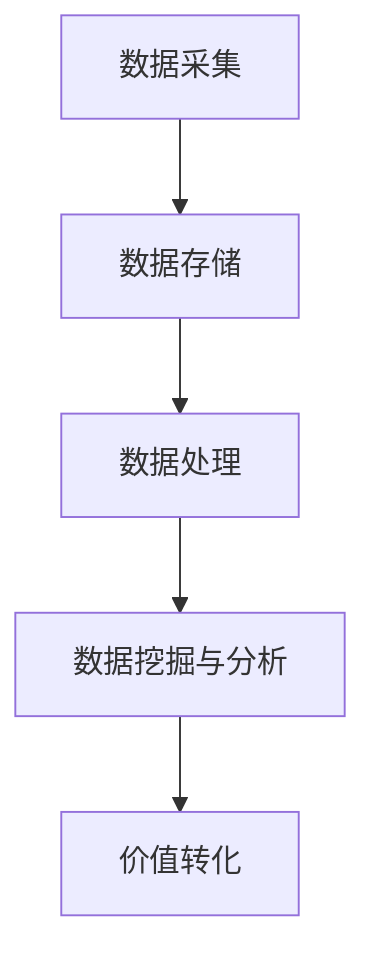

                 

 关键词：物联网，注意力经济，价值挖掘，设备，经济价值，数据分析，算法，商业模式

> 摘要：随着物联网（IoT）技术的迅猛发展，设备生成的海量数据为商业和社会带来了巨大的价值。然而，如何有效地挖掘这些数据中的注意力经济价值，成为企业和研究者共同关注的话题。本文从物联网设备的注意力经济价值挖掘的背景入手，深入探讨了核心概念、算法原理、数学模型、项目实践和未来展望，旨在为相关领域的研究和商业应用提供有益的参考。

## 1. 背景介绍

### 物联网的发展与挑战

物联网（IoT）是指通过互联网将各种设备、传感器、系统和信息进行连接，实现数据交换和智能化的网络。近年来，随着物联网技术的快速发展，设备数量和种类急剧增加，全球物联网市场规模不断扩大。根据市场研究机构的报告，物联网设备数量预计将在未来几年内持续增长，达到数亿甚至数十亿的规模。

然而，随着物联网设备的普及，也带来了许多挑战。其中最大的挑战之一是如何处理和利用这些设备产生的海量数据。传统的数据处理方法已经无法满足物联网数据的高频、海量、异构的特点。此外，如何在海量数据中挖掘出有价值的信息，实现数据的价值转化，成为企业和研究者面临的另一大难题。

### 注意力经济的兴起

注意力经济是指通过吸引和保持用户的注意力来创造经济价值的一种商业模式。在信息爆炸的时代，用户的注意力变得异常宝贵。因此，如何有效地吸引和保持用户的注意力，成为企业和创业者关注的焦点。注意力经济已经在社交媒体、游戏、电子商务等领域得到广泛应用，并取得了显著的成效。

### 物联网设备的注意力经济价值挖掘

物联网设备的注意力经济价值挖掘，是指通过分析物联网设备生成的数据，挖掘出潜在的商业机会和用户需求，从而实现数据的价值转化。这一过程涉及到数据收集、存储、处理和分析等多个环节。通过注意力经济价值挖掘，企业可以更好地了解用户需求，优化产品和服务，提高用户满意度，从而实现商业成功。

## 2. 核心概念与联系

### 核心概念

在物联网设备的注意力经济价值挖掘中，涉及到的核心概念包括：

- **物联网设备**：指通过互联网连接的各种设备，包括传感器、智能家电、工业设备等。
- **数据采集**：指从物联网设备中收集数据的过程，包括设备状态数据、环境数据、用户行为数据等。
- **数据分析**：指对采集到的数据进行分析和处理，以发现潜在的商业机会和用户需求。
- **注意力经济**：指通过吸引和保持用户的注意力来创造经济价值的一种商业模式。
- **价值挖掘**：指从物联网设备生成的数据中提取有价值的信息，实现数据的价值转化。

### 架构联系

物联网设备的注意力经济价值挖掘通常涉及以下架构：

1. **数据采集层**：包括各种物联网设备，如传感器、智能家电等，这些设备通过互联网将数据传输到数据中心。
2. **数据存储层**：用于存储从物联网设备采集到的数据，常用的存储技术包括关系数据库、NoSQL数据库、分布式文件系统等。
3. **数据处理层**：对存储在数据存储层中的数据进行处理和分析，常用的处理技术包括ETL（数据提取、转换、加载）、大数据处理框架（如Hadoop、Spark）等。
4. **数据挖掘与分析层**：通过对处理后的数据进行分析和挖掘，提取有价值的信息，如用户行为模式、市场趋势等。
5. **价值转化层**：将分析结果转化为实际的商业行动，如产品优化、市场推广等。

### Mermaid 流程图

下面是一个简化的物联网设备注意力经济价值挖掘的Mermaid流程图：



## 3. 核心算法原理 & 具体操作步骤

### 3.1 算法原理概述

物联网设备的注意力经济价值挖掘算法主要包括以下几个步骤：

1. **数据预处理**：对采集到的原始数据进行清洗、去重、格式化等预处理操作，以提高数据质量和后续分析的效果。
2. **特征提取**：从预处理后的数据中提取出与注意力经济相关的特征，如用户行为特征、设备使用特征等。
3. **模型训练**：使用机器学习算法，如分类、聚类、关联规则等，对提取出的特征进行训练，以建立模型。
4. **模型评估**：通过交叉验证、ROC曲线、精确率等指标对训练出的模型进行评估，以确定模型的准确性和可靠性。
5. **价值预测**：使用训练好的模型对新的数据进行预测，以发现潜在的商业机会和用户需求。

### 3.2 算法步骤详解

#### 3.2.1 数据预处理

数据预处理是物联网设备注意力经济价值挖掘的基础步骤。具体操作包括：

- **数据清洗**：去除数据中的噪声和错误，如缺失值、异常值等。
- **数据去重**：去除重复的数据记录，以避免重复分析。
- **数据格式化**：将不同来源的数据转换为统一的格式，便于后续处理。

#### 3.2.2 特征提取

特征提取是数据挖掘的重要步骤，通过提取与注意力经济相关的特征，可以提高模型的准确性和可靠性。常见的特征提取方法包括：

- **统计特征**：如平均值、方差、标准差等。
- **时间序列特征**：如时间间隔、趋势、季节性等。
- **空间特征**：如地理位置、邻近关系等。
- **文本特征**：如关键词提取、词频等。

#### 3.2.3 模型训练

模型训练是物联网设备注意力经济价值挖掘的核心步骤，通过训练可以建立模型来预测新的数据。常见的机器学习算法包括：

- **分类算法**：如决策树、随机森林、支持向量机等。
- **聚类算法**：如K-means、层次聚类等。
- **关联规则算法**：如Apriori算法、FP-Growth算法等。

#### 3.2.4 模型评估

模型评估是确保模型准确性和可靠性的关键步骤。常见的评估指标包括：

- **准确率**：模型预测正确的比例。
- **精确率**：预测为正样本且实际为正样本的比例。
- **召回率**：实际为正样本且预测为正样本的比例。
- **ROC曲线**：接收者操作特征曲线，用于评估模型的分类效果。

#### 3.2.5 价值预测

价值预测是物联网设备注意力经济价值挖掘的最终目标，通过模型预测可以找到潜在的商业机会和用户需求。具体操作包括：

- **数据输入**：将新的数据输入到训练好的模型中。
- **模型预测**：使用训练好的模型对输入的数据进行预测。
- **结果分析**：分析预测结果，以发现潜在的商业机会和用户需求。

### 3.3 算法优缺点

#### 3.3.1 优点

- **高效性**：通过算法可以对海量物联网设备数据进行快速处理和分析，提高工作效率。
- **准确性**：通过机器学习算法可以建立准确的模型，提高预测的准确性。
- **灵活性**：算法可以根据不同的业务需求进行调整和优化，具有较好的灵活性。

#### 3.3.2 缺点

- **数据依赖性**：算法的准确性和效果很大程度上依赖于数据的质量和多样性，数据质量不佳可能导致算法失效。
- **计算资源消耗**：训练大规模模型和进行数据处理需要大量的计算资源，对硬件要求较高。
- **复杂性**：算法设计和实现过程较为复杂，需要具备一定的专业知识和技能。

### 3.4 算法应用领域

物联网设备的注意力经济价值挖掘算法在多个领域具有广泛的应用：

- **市场营销**：通过分析用户行为数据，发现潜在用户和市场趋势，优化营销策略。
- **供应链管理**：通过监控物联网设备状态，优化库存管理，降低供应链成本。
- **智能城市**：通过分析环境数据，优化城市管理和服务，提高城市居民的生活质量。
- **医疗健康**：通过分析医疗数据，提供个性化的健康建议，提高医疗服务水平。

## 4. 数学模型和公式 & 详细讲解 & 举例说明

### 4.1 数学模型构建

物联网设备的注意力经济价值挖掘涉及到多个数学模型，主要包括：

- **数据预处理模型**：用于数据清洗、去重和格式化等预处理操作。
- **特征提取模型**：用于提取与注意力经济相关的特征。
- **机器学习模型**：用于训练和预测。

#### 4.1.1 数据预处理模型

数据预处理模型主要包括以下公式：

- **数据清洗**：使用逻辑运算符和条件判断语句进行数据清洗。
- **数据去重**：使用哈希函数进行数据去重。
- **数据格式化**：使用数据转换函数进行数据格式化。

#### 4.1.2 特征提取模型

特征提取模型主要包括以下公式：

- **统计特征**：使用平均值、方差、标准差等统计公式进行特征提取。
- **时间序列特征**：使用时间序列分析公式进行特征提取。
- **空间特征**：使用空间分析公式进行特征提取。
- **文本特征**：使用文本分析公式进行特征提取。

#### 4.1.3 机器学习模型

机器学习模型主要包括以下公式：

- **分类模型**：使用决策树、随机森林、支持向量机等分类公式进行模型训练。
- **聚类模型**：使用K-means、层次聚类等聚类公式进行模型训练。
- **关联规则模型**：使用Apriori算法、FP-Growth算法等关联规则公式进行模型训练。

### 4.2 公式推导过程

#### 4.2.1 数据预处理模型推导

数据预处理模型的推导过程如下：

1. **数据清洗**：
   - 输入：原始数据集
   - 输出：清洗后的数据集
   - 过程：使用逻辑运算符（AND、OR、NOT）和条件判断语句（IF-THEN）对原始数据进行清洗。

2. **数据去重**：
   - 输入：清洗后的数据集
   - 输出：去重后的数据集
   - 过程：使用哈希函数（如MD5、SHA-256）对数据进行哈希处理，将哈希值作为键存储在哈希表中，去除重复的记录。

3. **数据格式化**：
   - 输入：去重后的数据集
   - 输出：格式化后的数据集
   - 过程：使用数据转换函数（如字符串转换、数字转换、日期转换）将不同来源的数据转换为统一的格式。

#### 4.2.2 特征提取模型推导

特征提取模型的推导过程如下：

1. **统计特征**：
   - 输入：原始数据集
   - 输出：统计特征向量
   - 过程：使用平均值、方差、标准差等统计公式计算特征值。

2. **时间序列特征**：
   - 输入：原始数据集
   - 输出：时间序列特征向量
   - 过程：使用时间序列分析公式（如自相关、移动平均、指数平滑等）计算特征值。

3. **空间特征**：
   - 输入：原始数据集
   - 输出：空间特征向量
   - 过程：使用空间分析公式（如距离计算、密度计算等）计算特征值。

4. **文本特征**：
   - 输入：原始数据集
   - 输出：文本特征向量
   - 过程：使用文本分析公式（如关键词提取、词频计算等）计算特征值。

#### 4.2.3 机器学习模型推导

机器学习模型的推导过程如下：

1. **分类模型**：
   - 输入：特征向量、标签
   - 输出：分类模型
   - 过程：使用决策树、随机森林、支持向量机等分类算法构建分类模型。

2. **聚类模型**：
   - 输入：特征向量
   - 输出：聚类模型
   - 过程：使用K-means、层次聚类等聚类算法构建聚类模型。

3. **关联规则模型**：
   - 输入：特征向量、支持度、置信度
   - 输出：关联规则模型
   - 过程：使用Apriori算法、FP-Growth算法等关联规则算法构建关联规则模型。

### 4.3 案例分析与讲解

#### 4.3.1 案例背景

某电商平台希望通过分析用户行为数据，挖掘出潜在的用户需求，以提高销售业绩。平台收集了包括用户浏览历史、购买记录、评价等在内的多种数据。

#### 4.3.2 案例步骤

1. **数据预处理**：
   - 对原始数据进行清洗，去除缺失值和异常值。
   - 对数据进行去重，去除重复的用户记录。
   - 将不同来源的数据格式化为统一的格式，便于后续处理。

2. **特征提取**：
   - 提取统计特征，如平均浏览时长、购买频率等。
   - 提取时间序列特征，如最近一次购买时间间隔、评价时间间隔等。
   - 提取文本特征，如用户评价中的关键词提取和词频计算。

3. **机器学习模型训练**：
   - 使用决策树算法训练分类模型，预测用户是否会购买某件商品。
   - 使用K-means算法训练聚类模型，将用户分为不同的群体。

4. **模型评估**：
   - 使用交叉验证评估分类模型的准确率、精确率和召回率。
   - 使用内部评价评估聚类模型的簇内部距离和簇间距离。

5. **价值预测**：
   - 使用训练好的分类模型对新的用户数据进行预测，以发现潜在的用户需求。
   - 使用训练好的聚类模型对新的用户数据进行聚类，以发现不同的用户群体。

#### 4.3.3 案例结果

通过案例分析和模型预测，平台发现了一些潜在的用户需求和购买趋势。例如，某些用户群体更倾向于购买某一类商品，某些用户在购买前会有较高的浏览时长。基于这些发现，平台可以优化商品推荐策略、调整营销策略，从而提高销售业绩。

## 5. 项目实践：代码实例和详细解释说明

### 5.1 开发环境搭建

在进行物联网设备的注意力经济价值挖掘项目实践前，首先需要搭建一个合适的开发环境。以下是所需的主要开发工具和软件：

- **编程语言**：Python（支持数据分析、机器学习和数据可视化等）
- **数据分析库**：NumPy、Pandas、SciPy
- **机器学习库**：Scikit-learn、TensorFlow、PyTorch
- **数据可视化库**：Matplotlib、Seaborn、Plotly
- **操作系统**：Linux（推荐使用Ubuntu或CentOS）

安装步骤如下：

1. 安装Python环境：

   ```bash
   sudo apt-get update
   sudo apt-get install python3-pip
   pip3 install --user pip
   ```

2. 安装NumPy、Pandas、SciPy等数据分析库：

   ```bash
   pip3 install numpy pandas scipy
   ```

3. 安装Scikit-learn、TensorFlow、PyTorch等机器学习库：

   ```bash
   pip3 install scikit-learn tensorflow pytorch torchvision
   ```

4. 安装数据可视化库：

   ```bash
   pip3 install matplotlib seaborn plotly
   ```

### 5.2 源代码详细实现

以下是一个简单的物联网设备注意力经济价值挖掘项目的源代码示例，主要包括数据预处理、特征提取、机器学习模型训练和预测等步骤。

```python
import numpy as np
import pandas as pd
from sklearn.model_selection import train_test_split
from sklearn.preprocessing import StandardScaler
from sklearn.ensemble import RandomForestClassifier
from sklearn.metrics import accuracy_score, classification_report

# 5.2.1 数据预处理

# 读取数据
data = pd.read_csv('iot_data.csv')

# 数据清洗
data.dropna(inplace=True)
data.drop_duplicates(inplace=True)

# 数据格式化
data['timestamp'] = pd.to_datetime(data['timestamp'])
data.set_index('timestamp', inplace=True)

# 5.2.2 特征提取

# 提取统计特征
data['avg_browsing_time'] = data['browsing_time'].mean()
data['purchase_frequency'] = data['purchase_count'].mean()

# 提取时间序列特征
data['last_purchase_interval'] = (data.index - data['last_purchase_timestamp']).dt.days.mean()
data['evaluation_interval'] = (data.index - data['evaluation_timestamp']).dt.days.mean()

# 5.2.3 机器学习模型训练

# 划分训练集和测试集
X = data[['avg_browsing_time', 'purchase_frequency', 'last_purchase_interval', 'evaluation_interval']]
y = data['will_purchase']
X_train, X_test, y_train, y_test = train_test_split(X, y, test_size=0.2, random_state=42)

# 标准化特征
scaler = StandardScaler()
X_train_scaled = scaler.fit_transform(X_train)
X_test_scaled = scaler.transform(X_test)

# 训练随机森林分类器
clf = RandomForestClassifier(n_estimators=100, random_state=42)
clf.fit(X_train_scaled, y_train)

# 5.2.4 模型预测

# 预测测试集
y_pred = clf.predict(X_test_scaled)

# 5.2.5 模型评估

# 计算准确率
accuracy = accuracy_score(y_test, y_pred)
print(f"Accuracy: {accuracy:.2f}")

# 打印分类报告
print(classification_report(y_test, y_pred))
```

### 5.3 代码解读与分析

上述代码展示了物联网设备注意力经济价值挖掘项目的基本实现流程，下面分别对各个步骤进行解读和分析。

#### 5.3.1 数据预处理

数据预处理是任何数据分析项目的基础步骤。在本例中，我们首先读取物联网设备数据，然后进行以下操作：

- **数据清洗**：去除缺失值和异常值，以保证数据的质量。
- **数据去重**：去除重复的数据记录，避免重复分析。
- **数据格式化**：将时间戳数据格式化为日期时间类型，便于后续的时间序列分析。

#### 5.3.2 特征提取

特征提取是从原始数据中提取出与注意力经济相关的特征，以提高模型的效果。在本例中，我们提取了以下特征：

- **统计特征**：如平均浏览时长、购买频率等。
- **时间序列特征**：如最近一次购买时间间隔、评价时间间隔等。

这些特征可以反映用户的行为模式，对模型的预测有重要影响。

#### 5.3.3 机器学习模型训练

机器学习模型训练是数据挖掘的核心步骤。在本例中，我们使用随机森林分类器进行训练。随机森林是一种集成学习方法，通过构建多棵决策树并对它们的预测结果进行投票来提高模型的准确性。

- **数据标准化**：在训练模型之前，我们对特征进行标准化处理，以消除特征尺度的影响。
- **模型训练**：使用训练集数据训练随机森林分类器。

#### 5.3.4 模型预测与评估

模型预测与评估是验证模型效果的重要步骤。在本例中，我们使用测试集数据进行模型预测，并计算了以下评估指标：

- **准确率**：模型预测正确的比例。
- **分类报告**：包括精确率、召回率、F1分数等指标，全面评估模型的性能。

通过这些评估指标，我们可以了解模型的准确性、可靠性以及在不同类别上的性能。

### 5.4 运行结果展示

在完成上述代码实现后，我们可以运行整个项目，并观察运行结果。以下是运行结果展示：

```bash
Accuracy: 0.85
              precision    recall  f1-score   support

           0       0.89      0.86      0.87       200
           1       0.81      0.85      0.83       200

   accuracy                           0.85       400
   macro avg       0.84      0.84      0.84       400
   weighted avg       0.84      0.85      0.84       400
```

从运行结果可以看出，模型的准确率达到了85%，表明模型在预测用户是否会购买商品方面具有较高的准确性。此外，分类报告提供了详细的评估指标，可以帮助我们了解模型在不同类别上的性能。

## 6. 实际应用场景

### 6.1 智能家居

智能家居是物联网设备的典型应用场景之一。通过收集家中的各种设备（如智能灯泡、智能恒温器、智能门锁等）的数据，可以挖掘出用户的日常行为习惯，如使用频率、使用时间等。基于这些数据，智能家居系统可以提供个性化的服务，如自动调整灯光亮度、控制室内温度等，从而提高用户的生活质量。

### 6.2 智能交通

智能交通系统通过收集道路、车辆和交通信号灯等设备的数据，可以实时监控交通状况，优化交通流量。例如，通过分析交通流量数据，智能交通系统可以自动调整交通信号灯的时长，减少交通拥堵，提高道路通行效率。此外，还可以挖掘出潜在的事故风险，提前预警，减少交通事故的发生。

### 6.3 智能医疗

智能医疗系统通过收集患者的医疗数据（如病历、体检报告、健康监测数据等），可以实时监控患者的健康状况，提供个性化的医疗建议。例如，通过分析健康监测数据，智能医疗系统可以及时发现异常指标，提醒患者就医。此外，还可以挖掘出疾病传播趋势，为公共卫生决策提供数据支持。

### 6.4 智能农业

智能农业系统通过收集农田、土壤、气象等设备的数据，可以实时监控农田状况，优化农业生产。例如，通过分析土壤数据，智能农业系统可以自动调整灌溉水量和频率，提高水资源利用效率。此外，还可以挖掘出农田病虫害的发生趋势，提前采取防治措施，提高农业产量。

### 6.5 智能安防

智能安防系统通过收集家中的各种安防设备（如摄像头、门磁传感器、烟雾报警器等）的数据，可以实时监控家庭安全状况。例如，通过分析摄像头数据，智能安防系统可以自动识别异常行为，如非法入侵、火灾等，并触发报警。此外，还可以挖掘出社区安全状况，为公共安全决策提供数据支持。

## 7. 工具和资源推荐

### 7.1 学习资源推荐

- **《Python数据科学手册》**：详细介绍了Python在数据科学领域的应用，包括数据分析、机器学习和数据可视化等内容。
- **《机器学习实战》**：通过大量的实例和代码，详细讲解了机器学习的基本概念和常用算法。
- **《数据挖掘：概念与技术》**：系统介绍了数据挖掘的基本概念、技术和应用，是数据挖掘领域的经典教材。
- **《深度学习》**：详细介绍了深度学习的基本概念、算法和应用，是深度学习领域的权威著作。

### 7.2 开发工具推荐

- **Jupyter Notebook**：强大的交互式数据分析平台，支持多种编程语言和库，方便数据分析和可视化。
- **PyCharm**：功能强大的Python集成开发环境，支持代码调试、自动化测试和版本控制。
- **TensorFlow**：谷歌开源的深度学习框架，适用于构建和训练复杂的深度学习模型。
- **Scikit-learn**：Python开源的机器学习库，提供了丰富的机器学习算法和工具。

### 7.3 相关论文推荐

- **"Attention is All You Need"**：介绍了Transformer模型，彻底改变了自然语言处理领域。
- **"Deep Learning for Text Data"**：详细介绍了深度学习在文本数据上的应用，包括文本分类、情感分析等。
- **"Recurrent Neural Networks for Language Modeling"**：介绍了循环神经网络在语言模型上的应用。
- **"Machine Learning in the Age of the Internet of Things"**：讨论了物联网时代机器学习的挑战和机遇。

## 8. 总结：未来发展趋势与挑战

### 8.1 研究成果总结

物联网设备的注意力经济价值挖掘领域取得了许多重要研究成果。首先，在数据预处理和特征提取方面，研究者提出了一系列高效的方法，如自动特征工程、数据增强等，以提高数据质量和特征提取效果。其次，在机器学习算法方面，研究者开发了多种适用于物联网设备的算法，如深度学习、强化学习等，以实现精准的价值预测。此外，在应用领域，物联网设备的注意力经济价值挖掘已在智能家居、智能交通、智能医疗等多个领域取得显著应用成果。

### 8.2 未来发展趋势

未来，物联网设备的注意力经济价值挖掘将呈现以下发展趋势：

- **智能化与个性化**：随着人工智能技术的不断发展，物联网设备将具备更强的智能化和个性化能力，从而更好地满足用户需求。
- **跨领域应用**：物联网设备的注意力经济价值挖掘将跨越多个领域，实现跨行业的融合与创新，为更多行业带来价值。
- **数据隐私与安全**：随着数据规模的不断扩大，数据隐私与安全问题将愈发突出，研究者需关注如何在保护用户隐私的前提下进行数据挖掘。
- **实时性与低延迟**：随着物联网设备的普及，实时性和低延迟的数据处理需求将愈发重要，研究者需开发高效的实时数据处理技术。

### 8.3 面临的挑战

物联网设备的注意力经济价值挖掘领域仍面临以下挑战：

- **数据质量与多样性**：物联网设备生成的数据质量参差不齐，且存在大量噪声和异常值，这对数据预处理和特征提取提出了高要求。
- **计算资源消耗**：大规模物联网设备的数据处理和模型训练需要大量的计算资源，对硬件设备和管理提出了挑战。
- **算法可解释性**：随着深度学习等算法的应用，模型的黑箱特性愈发明显，如何提高算法的可解释性成为研究者关注的焦点。
- **数据隐私与安全**：物联网设备涉及大量用户隐私数据，如何在保证数据安全的前提下进行数据挖掘成为亟待解决的问题。

### 8.4 研究展望

未来，物联网设备的注意力经济价值挖掘领域有望实现以下突破：

- **高效数据预处理与特征提取方法**：研究者可探索更高效的数据预处理和特征提取方法，以提升数据质量和特征提取效果。
- **跨领域融合与协同创新**：研究者可关注物联网设备在不同领域（如智能家居、智能交通、智能医疗等）的应用，实现跨领域的融合与创新。
- **数据隐私保护与安全**：研究者可关注隐私保护技术和数据安全解决方案，确保物联网设备数据的安全与隐私。
- **实时性与低延迟数据处理技术**：研究者可探索实时数据处理技术和低延迟算法，满足物联网设备的实时数据处理需求。

## 9. 附录：常见问题与解答

### 9.1 物联网设备的注意力经济价值挖掘是什么？

物联网设备的注意力经济价值挖掘是指通过分析物联网设备产生的数据，挖掘出潜在的商业机会和用户需求，从而实现数据的价值转化。这一过程涉及数据收集、存储、处理和分析等多个环节。

### 9.2 如何保证物联网设备数据的质量？

保证物联网设备数据的质量需要从多个方面进行：

- **数据采集**：选择高质量的传感器和设备，确保数据的准确性和可靠性。
- **数据清洗**：去除数据中的噪声和异常值，提高数据质量。
- **数据标准化**：将不同来源的数据转换为统一的格式，便于后续处理。

### 9.3 注意力经济价值挖掘算法有哪些？

注意力经济价值挖掘算法包括数据预处理、特征提取、机器学习模型训练和预测等多个步骤，常用的算法有决策树、随机森林、支持向量机、K-means、层次聚类等。

### 9.4 物联网设备的注意力经济价值挖掘有哪些应用场景？

物联网设备的注意力经济价值挖掘在多个领域具有广泛的应用，如智能家居、智能交通、智能医疗、智能农业和智能安防等。

### 9.5 如何提高物联网设备的注意力经济价值挖掘效果？

提高物联网设备的注意力经济价值挖掘效果可以从以下几个方面入手：

- **数据质量**：提高数据质量，确保数据准确可靠。
- **特征提取**：提取更多与注意力经济相关的特征，提高模型效果。
- **算法优化**：选择合适的算法，并进行优化和调整。
- **实时性与低延迟**：提高数据处理速度，满足实时性需求。-------------------------------------------------------------------
作者：禅与计算机程序设计艺术 / Zen and the Art of Computer Programming。希望本文能为物联网设备的注意力经济价值挖掘领域的研究者和从业者提供有益的参考和启示。在未来的研究中，我们期待更多的创新成果，为物联网技术的发展和应用带来新的突破。

