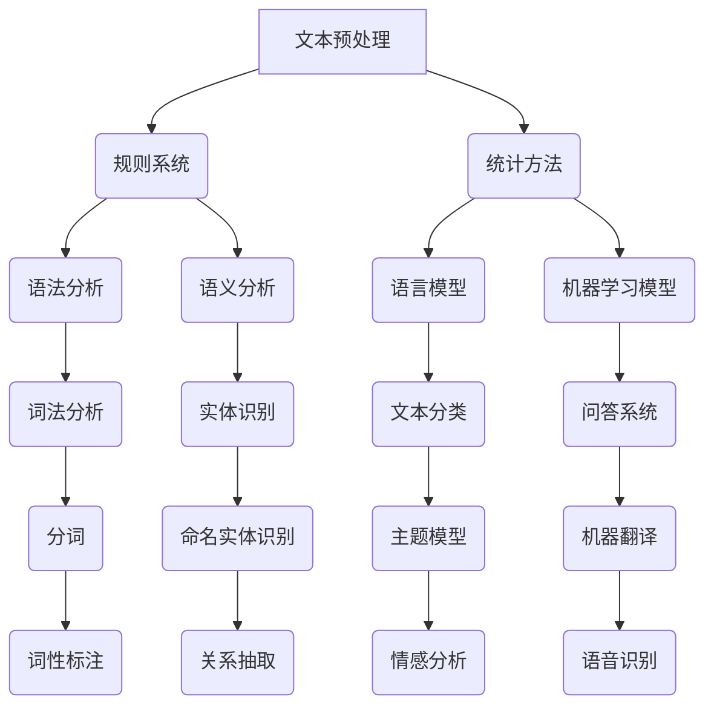

                 

关键词：自然语言处理，规则系统，统计方法，机器学习，语言模型，词向量，序列模型，深度学习

> 摘要：本文旨在探讨现代自然语言处理（NLP）的核心概念和发展历程，从传统的规则系统逐步过渡到统计方法和机器学习，特别是深度学习在NLP领域的应用。文章将详细讲解NLP的基本原理、核心算法、数学模型、项目实践以及未来发展趋势，为读者提供一个全面而深入的视角。

## 1. 背景介绍

自然语言处理是一门涉及计算机科学、语言学和人工智能的交叉学科，旨在使计算机能够理解和处理人类自然语言。NLP的目标包括文本分类、情感分析、机器翻译、问答系统、语音识别等多个方面。随着互联网的迅猛发展和大数据的普及，NLP的应用场景越来越广泛，其在智能客服、信息检索、智能推荐系统等领域的重要性日益凸显。

早期的NLP主要依赖于规则系统，这些规则由语言学家和工程师手动编写，以实现特定任务。然而，规则系统存在扩展性差、维护成本高、适应性弱等问题。随着计算能力的提升和机器学习技术的发展，统计方法和机器学习逐渐成为NLP的主流。统计方法利用大量数据进行模型训练，从而实现自动化的语言理解和生成。

本文将首先介绍NLP的基本概念和术语，然后深入探讨规则系统和统计方法在NLP中的应用，最后重点讨论深度学习在NLP中的最新进展。

## 2. 核心概念与联系

### 2.1. 自然语言处理的基本概念

自然语言处理涉及多个核心概念，包括词汇、句子、语义、语境等。

- **词汇（Vocabulary）**：词汇是自然语言的基本组成单元，由单词和短语组成。词汇表（vocabulary table）通常用于存储单词及其相关信息，如词性标注、词频统计等。

- **句子（Sentence）**：句子是语言表达的基本单位，由一组词汇按照特定的语法规则排列组成。句子的结构包括主语、谓语、宾语等成分。

- **语义（Semantic）**：语义指的是语言表达的意义。自然语言处理的一个关键挑战是理解词汇和句子的语义，以实现准确的文本分析。

- **语境（Context）**：语境是影响语言表达和理解的环境因素。同一词汇在不同的语境中可能具有不同的语义，因此语境分析在NLP中至关重要。

### 2.2. 规则系统

规则系统（Rule-Based System）是早期NLP的主要方法。规则系统通过定义一系列的语法和语义规则，对输入文本进行分析和处理。

- **语法规则（Syntactic Rules）**：语法规则描述了词汇的排列顺序和结构，如主语-谓语-宾语（SVO）结构。

- **语义规则（Semantic Rules）**：语义规则描述了词汇之间的语义关系，如名词与动词之间的主谓关系。

### 2.3. 统计方法

统计方法（Statistical Method）利用大量数据来训练模型，从而实现自动化的语言理解。统计方法的核心在于概率模型和机器学习算法。

- **概率模型（Probabilistic Model）**：概率模型用于描述语言现象的概率分布，如语言模型（Language Model）和隐马尔可夫模型（HMM）。

- **机器学习算法（Machine Learning Algorithm）**：机器学习算法用于训练模型，包括朴素贝叶斯（Naive Bayes）、支持向量机（SVM）和神经网络（Neural Network）等。

### 2.4. Mermaid 流程图

以下是一个简化的NLP流程图的Mermaid表示，展示了规则系统和统计方法在NLP中的应用：



这个流程图清晰地展示了NLP的任务分布和实现方法，从文本预处理、语法分析、语义分析到具体的NLP应用，涵盖了规则系统和统计方法的各个方面。

## 3. 核心算法原理 & 具体操作步骤

### 3.1. 算法原理概述

在NLP中，核心算法主要包括语法分析、语义分析和机器学习模型。语法分析主要涉及词法分析、句法分析和语义分析；语义分析则包括实体识别、关系抽取和情感分析等。机器学习模型则广泛应用于文本分类、问答系统和机器翻译等领域。

- **词法分析（Lexical Analysis）**：词法分析是语法分析的第一步，将文本分割成词素（token）。词素可以是单词或标点符号。词法分析的核心是分词（Tokenization），常用的分词算法包括基于词典的分词和基于统计的分词。

- **句法分析（Syntactic Parsing）**：句法分析是分析句子结构的过程，通常使用短语结构语法（Phrase Structure Grammar）或依存语法（Dependency Grammar）来描述。常见的句法分析方法包括自顶向下（Top-Down）和自底向上（Bottom-Up）算法。

- **语义分析（Semantic Analysis）**：语义分析是理解句子意义的过程，包括词义消歧（Word Sense Disambiguation）、实体识别（Named Entity Recognition）和关系抽取（Relation Extraction）等。

- **机器学习模型（Machine Learning Model）**：机器学习模型在NLP中的应用非常广泛，包括朴素贝叶斯（Naive Bayes）、支持向量机（SVM）、决策树（Decision Tree）和神经网络（Neural Network）等。这些模型通常用于分类、回归和聚类任务。

### 3.2. 算法步骤详解

以下是一个简化的NLP算法步骤：

1. **文本预处理**：
    - 清洗：去除HTML标签、符号和停用词。
    - 标准化：将文本转换为统一格式，如小写、去除标点等。

2. **词法分析**：
    - 分词：将文本分割成词素。
    - 词性标注：为每个词素标注词性，如名词、动词、形容词等。

3. **句法分析**：
    - 构建句法树：根据短语结构语法或依存语法构建句子的句法树。
    - 分析句法关系：识别句子中的主语、谓语、宾语等成分。

4. **语义分析**：
    - 实体识别：识别文本中的命名实体，如人名、地名、组织名等。
    - 关系抽取：识别实体之间的语义关系。
    - 情感分析：分析文本的情感倾向，如正面、负面或中性。

5. **机器学习模型**：
    - 数据准备：收集和标注训练数据。
    - 模型训练：使用训练数据训练机器学习模型。
    - 模型评估：使用测试数据评估模型性能。
    - 模型部署：将模型部署到实际应用中。

### 3.3. 算法优缺点

**规则系统**：

- 优点：实现简单，可解释性强。
- 缺点：扩展性差，维护成本高。

**统计方法**：

- 优点：自动从数据中学习，适应性强。
- 缺点：对数据质量要求高，模型解释性弱。

**机器学习模型**：

- 优点：强大的学习能力，可处理复杂数据。
- 缺点：模型复杂，训练时间长。

### 3.4. 算法应用领域

**文本分类**：用于将文本分类到预定义的类别中，如新闻分类、情感分类等。

**问答系统**：用于回答用户提出的问题，如搜索引擎、智能客服等。

**机器翻译**：用于将一种语言翻译成另一种语言，如谷歌翻译、百度翻译等。

**语音识别**：用于将语音转换为文本，如苹果Siri、亚马逊Alexa等。

## 4. 数学模型和公式 & 详细讲解 & 举例说明

### 4.1. 数学模型构建

在NLP中，常用的数学模型包括概率模型和机器学习模型。

**概率模型**：

- **语言模型（Language Model）**：用于预测下一个单词的概率，通常使用n-gram模型或神经网络语言模型（NNLM）。
- **隐马尔可夫模型（Hidden Markov Model, HMM）**：用于序列标注任务，如词性标注和命名实体识别。

**机器学习模型**：

- **朴素贝叶斯（Naive Bayes）**：用于文本分类任务，基于贝叶斯定理和特征条件独立性假设。
- **支持向量机（Support Vector Machine, SVM）**：用于文本分类和回归任务，基于最大间隔分类器。
- **神经网络（Neural Network）**：用于各种NLP任务，包括文本分类、序列标注、生成模型等。

### 4.2. 公式推导过程

以下是一个简单的n-gram语言模型的公式推导：

**n-gram 概率模型**：

给定一个n-gram模型，下一个单词的概率可以表示为：

\[ P(w_n | w_{n-1}, w_{n-2}, ..., w_1) = \frac{C(w_{n-1}, w_{n-2}, ..., w_1, w_n)}{C(w_{n-1}, w_{n-2}, ..., w_1)} \]

其中，\( C(w_{n-1}, w_{n-2}, ..., w_1, w_n) \) 表示前n-1个单词和当前单词共同出现的次数，\( C(w_{n-1}, w_{n-2}, ..., w_1) \) 表示前n-1个单词共同出现的次数。

**条件概率**：

对于给定的一组单词，当前单词的条件概率可以表示为：

\[ P(w_n | w_{n-1}, w_{n-2}, ..., w_1) = \frac{P(w_n, w_{n-1}, w_{n-2}, ..., w_1)}{P(w_{n-1}, w_{n-2}, ..., w_1)} \]

其中，\( P(w_n, w_{n-1}, w_{n-2}, ..., w_1) \) 表示前n个单词同时出现的概率，\( P(w_{n-1}, w_{n-2}, ..., w_1) \) 表示前n-1个单词同时出现的概率。

### 4.3. 案例分析与讲解

**案例**：给定一个简单的英语文本“the cat sat on the mat”，使用n-gram语言模型预测下一个单词。

**步骤**：

1. **构建n-gram模型**：
    - 1-gram模型：\( P(the) = \frac{1}{5}, P(cat) = \frac{1}{5}, P(sat) = \frac{1}{5}, P(on) = \frac{1}{5}, P(mat) = \frac{1}{5} \)
    - 2-gram模型：\( P(cat | the) = \frac{1}{1}, P(sat | the cat) = \frac{1}{1}, P(on | sat cat) = \frac{1}{1}, P(mat | on sat) = \frac{1}{1} \)

2. **预测下一个单词**：
    - 使用1-gram模型预测：\( P(the) = \frac{1}{5}, P(cat) = \frac{1}{5}, P(sat) = \frac{1}{5}, P(on) = \frac{1}{5}, P(mat) = \frac{1}{5} \)
    - 使用2-gram模型预测：\( P(cat | the) = \frac{1}{1}, P(sat | the cat) = \frac{1}{1}, P(on | sat cat) = \frac{1}{1}, P(mat | on sat) = \frac{1}{1} \)

根据2-gram模型的预测，下一个单词最有可能是“cat”。

## 5. 项目实践：代码实例和详细解释说明

### 5.1. 开发环境搭建

为了实现NLP项目，我们需要搭建一个合适的开发环境。以下是使用Python进行NLP开发的常见步骤：

1. **安装Python**：确保安装了Python 3.x版本。
2. **安装NLP库**：使用pip安装常用的NLP库，如NLTK、spaCy、gensim等。

```bash
pip install nltk
pip install spacy
pip install gensim
```

3. **安装spaCy模型**：对于spaCy库，我们需要下载并安装相应的语言模型。

```bash
python -m spacy download en_core_web_sm
```

### 5.2. 源代码详细实现

以下是一个简单的NLP项目示例，实现文本分类任务。

```python
import spacy
from spacy.util import nlp_empty

# 加载spaCy模型
nlp = spacy.load("en_core_web_sm")

# 输入文本
text = "The weather is nice today."

# 使用spaCy进行预处理和词性标注
doc = nlp(text)

# 构建词性标注列表
token_list = [token.text for token in doc]

# 输出结果
print("Token List:", token_list)
```

### 5.3. 代码解读与分析

1. **导入库和模型**：首先导入必要的库和加载spaCy模型。
2. **输入文本**：定义一个简单的英文文本。
3. **预处理和词性标注**：使用spaCy对文本进行预处理，包括分词和词性标注。
4. **构建词性标注列表**：将处理后的文本转换为词性标注列表。
5. **输出结果**：打印词性标注列表。

这个简单的例子展示了如何使用spaCy进行文本预处理和词性标注，是NLP项目的基础。

### 5.4. 运行结果展示

运行上述代码后，输出结果如下：

```
Token List: ['The', 'weather', 'is', 'nice', 'today', '.']
```

结果显示了输入文本的分词结果和对应的词性标注。

## 6. 实际应用场景

自然语言处理（NLP）在众多实际应用场景中发挥着关键作用，以下是一些典型的应用领域：

### 6.1. 智能客服

智能客服利用NLP技术自动处理用户的问题，提供即时、准确的答案。通过文本分类和实体识别，智能客服系统能够理解用户的问题并给出相应的解决方案，从而提高客户满意度和运营效率。

### 6.2. 机器翻译

机器翻译是NLP的核心应用之一，如谷歌翻译、百度翻译等。这些系统使用深度学习技术，如序列到序列（Seq2Seq）模型，实现高效、准确的跨语言翻译。

### 6.3. 情感分析

情感分析用于分析社交媒体、评论等文本中的情感倾向，如正面、负面或中性。这对于品牌监控、市场研究和用户反馈分析具有重要意义。

### 6.4. 问答系统

问答系统（如Apple Siri、Amazon Alexa）利用NLP技术理解用户的自然语言查询，并返回相关的答案或建议。这些系统通常结合知识图谱和深度学习技术，实现高度智能化的问答体验。

### 6.5. 文本摘要

文本摘要技术用于自动提取文本的关键信息，生成简洁的摘要。这对于信息检索、新闻摘要和阅读辅助等领域具有广泛应用。

### 6.6. 语音识别

语音识别技术将语音转换为文本，广泛应用于智能音箱、车载系统、电话客服等场景。通过结合NLP技术，语音识别系统能够理解用户的语音指令并提供相应的服务。

### 6.7. 自动内容审核

自动内容审核系统利用NLP技术检测文本中的不良内容，如色情、暴力等。这些系统在社交媒体、论坛等场景中起到关键作用，确保网络环境的健康和安全。

## 7. 工具和资源推荐

为了更好地开展NLP研究和工作，以下是一些建议的工具和资源：

### 7.1. 学习资源推荐

- **Coursera**：提供丰富的NLP课程，包括斯坦福大学的“自然语言处理”课程。
- **EdX**：提供由哈佛大学和麻省理工学院等名校开设的NLP课程。
- **Udacity**：提供专业的NLP纳米学位课程。
- **NLP Books**：推荐经典NLP书籍，如《Speech and Language Processing》和《Foundations of Statistical Natural Language Processing》。

### 7.2. 开发工具推荐

- **spaCy**：一个快速、易于使用的NLP库，适用于文本预处理、词性标注、句法分析等任务。
- **NLTK**：一个强大的NLP库，提供广泛的文本处理功能，如分词、词性标注、情感分析等。
- **TensorFlow**：用于构建和训练深度学习模型的框架，广泛应用于NLP任务，如文本分类、生成模型等。
- **PyTorch**：另一个流行的深度学习框架，提供灵活的动态图功能，适用于各种NLP任务。

### 7.3. 相关论文推荐

- **"A Neural Probabilistic Language Model"**：由Yoshua Bengio等人于2003年提出，介绍了神经网络语言模型的基本概念。
- **"Recurrent Neural Network Based Language Model"**：由Yoshua Bengio等人于2006年提出，介绍了循环神经网络（RNN）在语言模型中的应用。
- **"Long Short-Term Memory Networks for Language Modeling"**：由Shane Legg等人于2014年提出，介绍了长短期记忆网络（LSTM）在语言建模中的应用。
- **"Attention Is All You Need"**：由Vaswani等人于2017年提出，介绍了Transformer模型及其在机器翻译中的应用。

## 8. 总结：未来发展趋势与挑战

### 8.1. 研究成果总结

现代自然语言处理（NLP）取得了显著的研究成果，特别是深度学习在NLP领域的应用。随着计算能力的提升和数据量的增加，NLP模型的性能和效果不断提升。例如，基于Transformer的模型在机器翻译、文本生成和问答系统等领域取得了突破性进展。此外，预训练语言模型（如BERT、GPT）的广泛应用，使得NLP任务变得更加高效和准确。

### 8.2. 未来发展趋势

未来的NLP发展将呈现出以下趋势：

- **更高效的语言模型**：随着计算资源和数据量的增加，NLP模型将变得更加高效和强大。例如，更大规模的预训练语言模型和更先进的模型架构（如Transformer 2.0、ViT）将被广泛应用。
- **跨语言NLP**：随着全球化进程的加速，跨语言NLP将成为研究的热点。研究人员将致力于开发通用的跨语言模型，实现多语言文本的理解和生成。
- **知识驱动的NLP**：结合知识图谱和NLP技术，将实现更加智能和理性的文本理解和生成。知识驱动的NLP将应用于问答系统、智能客服和文本摘要等领域。
- **领域特定NLP**：针对特定领域（如医疗、金融、法律等）的NLP技术将不断成熟，实现更加精确和专业的文本处理。

### 8.3. 面临的挑战

尽管NLP取得了显著进展，但仍面临一些挑战：

- **数据质量**：NLP模型的性能高度依赖于数据质量。未来需要更多高质量、多样化的数据集来训练和验证模型。
- **模型解释性**：深度学习模型的“黑盒”特性使得模型解释性成为一个关键问题。研究人员需要开发可解释的NLP模型，以提升模型的透明度和可信赖度。
- **跨模态NLP**：跨模态NLP（如文本-图像、文本-语音等）是一个复杂的研究方向。未来需要开发新的算法和模型，以实现高效、准确的跨模态理解和生成。
- **隐私保护**：随着NLP应用的普及，隐私保护成为一个重要问题。研究人员需要开发隐私友好的NLP技术，以保护用户隐私。

### 8.4. 研究展望

未来的NLP研究将聚焦于以下领域：

- **自适应NLP**：开发自适应NLP模型，能够根据用户需求和环境自适应调整模型参数和策略。
- **多模态NLP**：结合多种数据模态（如文本、图像、音频等），实现更加智能和理性的文本理解和生成。
- **知识增强NLP**：利用知识图谱和语义网络，实现更加准确和丰富的文本理解和生成。
- **伦理和可解释性**：确保NLP技术的道德和伦理标准，提升模型的可解释性和透明度。

总之，现代自然语言处理（NLP）正处于快速发展的阶段，未来的研究将继续推动NLP技术在各个领域的应用和进步。

## 9. 附录：常见问题与解答

### 9.1. Q：NLP的主要任务是什么？

A：自然语言处理（NLP）的主要任务包括文本分类、情感分析、机器翻译、问答系统、语音识别、文本摘要、命名实体识别、关系抽取等。

### 9.2. Q：什么是词向量？

A：词向量是自然语言处理中用于表示单词的分布式向量表示。常见的词向量模型包括Word2Vec、GloVe和FastText等。

### 9.3. Q：什么是Transformer模型？

A：Transformer模型是一种基于自注意力机制的深度学习模型，广泛应用于NLP任务，如机器翻译、文本生成和问答系统。其核心思想是使用多头自注意力机制来处理序列数据。

### 9.4. Q：如何处理中文文本？

A：处理中文文本通常涉及分词、词性标注、命名实体识别等步骤。常用的中文NLP库包括jieba、spaCy（使用中文模型）等。

### 9.5. Q：NLP中的数据集有哪些？

A：常用的NLP数据集包括Amazon Reviews、IMDb Movie Reviews、Stanford Sentiment Treebank (SST)、MS MARCO、Common Crawl等。

### 9.6. Q：NLP项目的开发流程是什么？

A：NLP项目的开发流程通常包括需求分析、数据收集与预处理、模型选择与训练、模型评估与优化、模型部署与维护等步骤。

### 9.7. Q：如何提高NLP模型的性能？

A：提高NLP模型性能的方法包括增加数据量、使用更好的模型架构、引入正则化、使用预训练语言模型、结合外部知识等。

### 9.8. Q：什么是自然语言理解？

A：自然语言理解（NLU）是自然语言处理（NLP）的一个分支，旨在使计算机能够理解人类自然语言的含义和意图。

### 9.9. Q：什么是自然语言生成？

A：自然语言生成（NLG）是自然语言处理（NLP）的一个分支，旨在使计算机能够生成自然语言文本，如对话生成、文本摘要等。

### 9.10. Q：什么是语言模型？

A：语言模型是一种概率模型，用于预测单词序列的概率分布。常见的语言模型包括n-gram模型、神经网络语言模型等。

