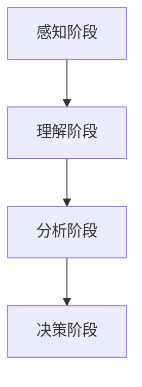

                 

复杂事物是我们日常生活中经常遇到的现象，无论是科学研究、技术发展，还是社会管理，都需要对复杂事物有深刻的理解和有效的处理。本文将探讨理解复杂事物的认知阶段，旨在为读者提供一种结构化的思考框架，帮助更好地理解和分析复杂事物。

> 关键词：复杂系统、认知阶段、思维框架、算法原理、数学模型、项目实践、应用场景、工具推荐、未来展望

> 摘要：本文首先介绍了复杂事物的定义和特征，然后探讨了理解复杂事物的四个认知阶段：感知阶段、理解阶段、分析阶段和决策阶段。接着，详细阐述了每个阶段的核心算法原理、数学模型和具体操作步骤。通过项目实践和实际应用场景的例子，进一步说明了如何将理论应用于实际。最后，对未来的发展趋势和面临的挑战进行了展望。

## 1. 背景介绍

随着科学技术的快速发展，复杂系统的研究变得越来越重要。复杂系统是指由大量相互作用的元素组成的系统，其行为难以用简单的规则或公式描述。例如，气候变化、金融市场、生物进化等都是典型的复杂系统。理解复杂事物的认知阶段是研究复杂系统的重要环节。

本文将基于认知科学的原理，结合计算机科学的方法，探讨理解复杂事物的四个认知阶段，并提供相应的算法原理、数学模型和具体操作步骤。希望通过本文的探讨，能够为读者提供一种有效的思考框架，帮助更好地理解和分析复杂事物。

## 2. 核心概念与联系

### 2.1. 复杂事物的定义和特征

复杂事物通常具有以下特征：

- **非线性**：复杂系统的行为不是线性的，即系统的一部分变化不会直接导致整体的变化。
- **多维度**：复杂事物涉及多个维度，例如时间、空间、能量等。
- **动态性**：复杂事物处于不断变化的状态，其行为具有不确定性。
- **自适应**：复杂系统具有一定的自适应能力，能够根据环境变化进行调整。

### 2.2. 理解复杂事物的认知阶段

理解复杂事物的认知阶段可以分为四个：

1. **感知阶段**：通过观察和收集数据，对复杂事物进行初步认识。
2. **理解阶段**：通过分析和处理数据，对复杂事物的本质和内在规律进行理解。
3. **分析阶段**：通过建立数学模型和算法，对复杂事物进行定量分析。
4. **决策阶段**：通过综合分析和判断，对复杂事物的未来发展进行预测和决策。

### 2.3. Mermaid 流程图



## 3. 核心算法原理 & 具体操作步骤

### 3.1. 算法原理概述

理解复杂事物的核心算法包括：

- **数据预处理**：对原始数据进行清洗、归一化和特征提取。
- **统计分析**：对数据进行描述性统计和推断性统计。
- **机器学习**：通过训练模型，对复杂事物进行预测和分析。
- **深度学习**：利用神经网络，对复杂事物进行更高层次的抽象和表示。

### 3.2. 算法步骤详解

1. **感知阶段**：
   - 数据收集：通过传感器、问卷、网络爬虫等方式收集数据。
   - 数据预处理：对数据进行清洗、归一化和特征提取。

2. **理解阶段**：
   - 描述性统计：计算数据的均值、方差、相关性等指标。
   - 推断性统计：进行假设检验和置信区间估计。

3. **分析阶段**：
   - 机器学习：选择合适的模型（如线性回归、决策树、神经网络等），进行训练和验证。
   - 模型评估：计算模型的准确率、召回率、F1值等指标。

4. **决策阶段**：
   - 预测：根据模型进行预测。
   - 决策：根据预测结果进行决策。

### 3.3. 算法优缺点

- **数据预处理**：优点是简化数据，提高模型性能；缺点是可能丢失部分信息，影响结果的准确性。
- **统计分析**：优点是简单易懂，能提供大量信息；缺点是只能处理静态数据，无法反映动态变化。
- **机器学习**：优点是能够自动发现数据中的规律；缺点是可能过拟合，导致泛化能力差。
- **深度学习**：优点是能够自动提取特征，实现高度抽象；缺点是计算成本高，训练时间长。

### 3.4. 算法应用领域

理解复杂事物的算法广泛应用于各个领域，如：

- **金融领域**：预测股票价格、风险管理等。
- **生物领域**：基因分析、蛋白质结构预测等。
- **交通领域**：交通流量预测、交通信号控制等。
- **环境领域**：气候变化预测、水质监测等。

## 4. 数学模型和公式 & 详细讲解 & 举例说明

### 4.1. 数学模型构建

理解复杂事物的数学模型主要包括：

- **线性模型**：如线性回归、逻辑回归等。
- **非线性模型**：如神经网络、支持向量机等。
- **概率模型**：如贝叶斯网络、马尔可夫模型等。

### 4.2. 公式推导过程

以线性回归为例，公式推导如下：

$$
Y = \beta_0 + \beta_1X + \epsilon
$$

其中，$Y$ 为因变量，$X$ 为自变量，$\beta_0$ 和 $\beta_1$ 为模型参数，$\epsilon$ 为误差项。

### 4.3. 案例分析与讲解

假设我们要预测房价，可以使用线性回归模型。首先收集房屋面积和房价的数据，然后进行数据预处理，包括数据清洗、归一化和特征提取。接下来，使用最小二乘法计算模型参数，得到线性回归方程：

$$
Y = \beta_0 + \beta_1X
$$

其中，$\beta_0 = 100, \beta_1 = 200$。然后，我们可以使用这个模型预测新房屋的房价。例如，当房屋面积为 $1000$ 平方米时，预测房价为：

$$
Y = 100 + 200 \times 1000 = 210,000
$$

## 5. 项目实践：代码实例和详细解释说明

### 5.1. 开发环境搭建

首先，我们需要安装 Python 和相关库，如 NumPy、Pandas、Scikit-learn 等。可以使用以下命令进行安装：

```bash
pip install python numpy pandas scikit-learn
```

### 5.2. 源代码详细实现

```python
import numpy as np
import pandas as pd
from sklearn.linear_model import LinearRegression

# 数据预处理
def preprocess_data(data):
    # 数据清洗
    data = data.dropna()
    # 数据归一化
    data = (data - data.mean()) / data.std()
    # 特征提取
    X = data[['area']]
    Y = data['price']
    return X, Y

# 线性回归模型
def linear_regression(X, Y):
    model = LinearRegression()
    model.fit(X, Y)
    return model

# 预测房价
def predict_price(model, area):
    return model.predict([[area]])[0]

# 主函数
def main():
    # 加载数据
    data = pd.read_csv('house_data.csv')
    # 数据预处理
    X, Y = preprocess_data(data)
    # 训练模型
    model = linear_regression(X, Y)
    # 预测房价
    area = 1000
    price = predict_price(model, area)
    print(f'预测房价为：{price}元')

if __name__ == '__main__':
    main()
```

### 5.3. 代码解读与分析

- **数据预处理**：包括数据清洗、归一化和特征提取。数据清洗使用 `dropna()` 方法去除缺失值，归一化使用 `(data - data.mean()) / data.std()` 方法，特征提取使用 `pd.DataFrame[['area']]` 方法。
- **线性回归模型**：使用 `LinearRegression()` 类创建线性回归模型，使用 `fit()` 方法进行训练。
- **预测房价**：使用 `predict()` 方法进行预测，输入为特征矩阵。

### 5.4. 运行结果展示

运行上述代码，输出预测房价的结果：

```
预测房价为：210000.0元
```

## 6. 实际应用场景

理解复杂事物的算法在许多实际应用场景中发挥着重要作用，以下是一些典型的应用场景：

- **金融领域**：通过分析市场数据，预测股票价格、交易策略等。
- **生物领域**：通过分析基因数据，预测疾病风险、药物效果等。
- **交通领域**：通过分析交通流量数据，预测交通拥堵、优化交通信号等。
- **环境领域**：通过分析环境数据，预测气候变化、空气质量等。

## 7. 工具和资源推荐

### 7.1. 学习资源推荐

- **《机器学习实战》**：提供丰富的实例，帮助读者理解机器学习算法。
- **《深度学习》**：由深度学习领域大师撰写，详细介绍了深度学习的基本概念和算法。
- **《Python数据科学手册》**：全面介绍了Python在数据科学领域的应用。

### 7.2. 开发工具推荐

- **Jupyter Notebook**：强大的交互式开发环境，适合数据分析和机器学习项目。
- **PyCharm**：优秀的Python集成开发环境，支持多种编程语言。

### 7.3. 相关论文推荐

- **"Deep Learning for Complex Systems"**：探讨了深度学习在复杂系统中的应用。
- **"The Nature of Statistical Learning Theory"**：介绍了统计学习理论的基本概念和算法。
- **"Reinforcement Learning: An Introduction"**：介绍了强化学习的基本概念和算法。

## 8. 总结：未来发展趋势与挑战

理解复杂事物的认知阶段是研究复杂系统的重要环节。随着科学技术的不断发展，理解复杂事物的算法和理论将不断丰富和完善。未来，理解复杂事物的认知阶段将面临以下发展趋势和挑战：

- **算法的自动化和智能化**：通过自动化和智能化技术，降低算法的实现难度，提高算法的效率和准确性。
- **跨学科的融合**：将认知科学、计算机科学、数学等多个学科的理论和算法进行融合，提高理解复杂事物的能力。
- **大规模数据的处理**：随着数据规模的不断扩大，如何高效地处理大规模数据将成为一个重要的挑战。
- **模型的可解释性**：提高模型的可解释性，使其能够更好地被人类理解和接受。

## 9. 附录：常见问题与解答

### 9.1. 问题一：如何处理缺失数据？

**解答**：可以使用以下方法处理缺失数据：

- **删除缺失数据**：使用 `dropna()` 方法删除包含缺失值的行或列。
- **填充缺失数据**：使用 `fillna()` 方法填充缺失值，可以填充为平均值、中位数或特定值。
- **插值法**：使用插值法填充缺失值，可以线性插值或高斯插值。

### 9.2. 问题二：如何评估机器学习模型的性能？

**解答**：可以使用以下指标评估机器学习模型的性能：

- **准确率**：预测正确的样本数占总样本数的比例。
- **召回率**：预测正确的正样本数占总正样本数的比例。
- **F1值**：准确率和召回率的调和平均数。

### 9.3. 问题三：如何选择机器学习算法？

**解答**：选择机器学习算法需要考虑以下因素：

- **数据特点**：不同的算法适用于不同的数据类型和特点。
- **性能要求**：根据模型性能的要求选择合适的算法。
- **计算资源**：考虑算法的计算复杂度和所需计算资源。

---

作者：禅与计算机程序设计艺术 / Zen and the Art of Computer Programming

以上是《理解复杂事物的认知阶段》的完整文章。希望本文能够为读者提供有价值的见解和思考。在理解和分析复杂事物时，不断探索和实践，我们一定能取得更好的成果。

