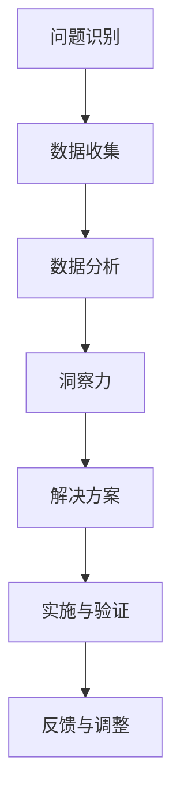

                 

关键词：洞察力、不确定性、信息技术、架构设计、算法、编程

> 摘要：本文深入探讨了在信息技术领域中，洞察力作为解决不确定性的关键能力，如何帮助我们在复杂系统中取得优势。通过分析核心概念、算法原理、数学模型、项目实践以及未来应用，本文揭示了洞察力在提升决策质量、优化系统性能、应对风险等方面的巨大价值。

## 1. 背景介绍

在当今信息化时代，技术发展的速度远超人类适应的能力，这导致我们在面对不确定性时常常感到力不从心。不确定性不仅源于技术的复杂性，还受到市场竞争、法律法规、用户需求等多方面因素的影响。在这种背景下，如何有效地应对不确定性成为了一个亟待解决的问题。

洞察力作为一种深层次的理解和认知能力，在信息技术领域扮演着至关重要的角色。它不仅帮助我们更好地理解问题的本质，还能够预见潜在的风险和机会，从而在不确定性中找到解决方案。本文将探讨洞察力在信息技术中的应用，特别是在架构设计、算法优化、系统维护等方面的重要价值。

## 2. 核心概念与联系

在深入探讨洞察力的价值之前，我们首先需要了解一些核心概念，并梳理它们之间的联系。以下是一个使用Mermaid绘制的流程图，用以展示这些核心概念的关系。



### 2.1. 问题识别

问题识别是整个流程的起点。在信息技术领域，问题可能来源于系统性能瓶颈、安全隐患、业务需求变更等。只有准确地识别问题，我们才能有针对性地进行解决。

### 2.2. 数据收集

数据收集是获取洞察力的基础。无论是系统日志、用户反馈还是市场数据，都是我们了解问题背后的真相的重要依据。有效的数据收集能够帮助我们建立可靠的模型。

### 2.3. 数据分析

数据分析是将收集到的数据转化为有用信息的过程。通过统计分析、机器学习等方法，我们可以从海量数据中提取出有价值的信息，为洞察力的形成提供支持。

### 2.4. 洞察力

洞察力是对问题深刻理解和敏锐洞察的能力。它能够帮助我们识别问题背后的本质，预见未来的趋势，从而在不确定性中找到方向。

### 2.5. 解决方案

解决方案是基于洞察力提出的具体行动方案。它不仅要解决当前问题，还要考虑长远发展，确保系统的稳定性和可持续性。

### 2.6. 实施与验证

实施与验证是确保解决方案有效性的关键步骤。通过实际操作和测试，我们可以验证方案的可行性，并对不足之处进行及时调整。

### 2.7. 反馈与调整

反馈与调整是一个持续的过程。通过不断收集反馈，我们能够不断优化解决方案，提高系统的适应能力。

## 3. 核心算法原理 & 具体操作步骤

### 3.1 算法原理概述

在信息技术领域，算法是实现洞察力的核心工具。以下是一个简单的算法原理概述：

1. 输入：问题描述和数据集
2. 输出：解决方案和预测结果
3. 过程：
   - 数据预处理：清洗和整合数据
   - 特征提取：从数据中提取有助于决策的特征
   - 模型训练：使用训练数据训练模型
   - 模型评估：评估模型性能
   - 结果输出：输出预测结果和解决方案

### 3.2 算法步骤详解

1. **数据预处理**：
   - 清洗：去除无效和错误的数据
   - 整合：合并来自多个数据源的信息
   - 标准化：将不同尺度的数据进行归一化处理

2. **特征提取**：
   - 选择：选择对问题解决有帮助的特征
   - 构建特征向量：将特征转换为数值形式

3. **模型训练**：
   - 选择算法：如决策树、神经网络、支持向量机等
   - 模型参数调整：优化模型参数，提高模型性能

4. **模型评估**：
   - 训练集评估：在训练集上评估模型性能
   - 测试集评估：在测试集上验证模型泛化能力

5. **结果输出**：
   - 输出预测结果：根据模型预测，输出解决方案
   - 输出报告：总结模型性能和解决方案

### 3.3 算法优缺点

算法优缺点如下：

**优点**：
- **高效性**：算法能够快速处理大量数据，提高决策效率。
- **灵活性**：算法可以根据不同的问题和数据进行调整，适应各种场景。
- **可扩展性**：算法易于扩展和集成到现有系统中。

**缺点**：
- **复杂度**：算法的实现和调优过程较为复杂，需要高水平的技术支持。
- **数据依赖**：算法性能高度依赖数据质量，数据不准确可能导致错误结果。
- **过拟合**：算法可能会对训练数据过度拟合，降低泛化能力。

### 3.4 算法应用领域

算法在信息技术领域的应用非常广泛，以下是一些主要的应用领域：

- **数据分析**：从海量数据中提取有价值的信息，为决策提供支持。
- **预测建模**：预测未来趋势和用户行为，为市场营销、风险管理等提供依据。
- **自然语言处理**：处理和生成自然语言文本，应用于搜索引擎、智能客服等领域。
- **计算机视觉**：识别和分类图像、视频，应用于安防监控、自动驾驶等领域。
- **推荐系统**：根据用户行为和偏好，推荐个性化内容和商品。

## 4. 数学模型和公式 & 详细讲解 & 举例说明

在信息技术领域，数学模型和公式是算法设计的重要基础。以下是一个简单的数学模型和公式的讲解及实例。

### 4.1 数学模型构建

我们以线性回归模型为例，其基本模型可以表示为：

$$
y = \beta_0 + \beta_1 \cdot x
$$

其中，$y$ 是因变量，$x$ 是自变量，$\beta_0$ 和 $\beta_1$ 是模型参数。

### 4.2 公式推导过程

线性回归模型的推导过程如下：

1. **目标函数**：
   我们希望最小化预测值与实际值之间的误差，即：

   $$
   \min \sum_{i=1}^{n} (y_i - \hat{y_i})^2
   $$

   其中，$n$ 是数据点的数量，$y_i$ 是第 $i$ 个实际值，$\hat{y_i}$ 是第 $i$ 个预测值。

2. **导数计算**：
   对目标函数求导，并令导数为零，得到：

   $$
   \frac{\partial}{\partial \beta_0} \sum_{i=1}^{n} (y_i - \hat{y_i})^2 = 0
   $$

   $$
   \frac{\partial}{\partial \beta_1} \sum_{i=1}^{n} (y_i - \hat{y_i})^2 = 0
   $$

3. **解方程**：
   解上述方程，得到模型参数 $\beta_0$ 和 $\beta_1$。

### 4.3 案例分析与讲解

假设我们有一个简单的一元线性回归问题，数据集如下：

| $x$ | $y$ |
| --- | --- |
| 1 | 2 |
| 2 | 4 |
| 3 | 6 |
| 4 | 8 |

我们希望构建一个线性回归模型，预测 $y$ 值。

1. **数据预处理**：
   数据已经整齐，无需进一步处理。

2. **特征提取**：
   特征向量 $X$ 为：

   $$
   X = \begin{bmatrix}
   1 & 1 \\
   1 & 2 \\
   1 & 3 \\
   1 & 4 \\
   \end{bmatrix}
   $$

   因变量 $y$ 为：

   $$
   y = \begin{bmatrix}
   2 \\
   4 \\
   6 \\
   8 \\
   \end{bmatrix}
   $$

3. **模型训练**：
   使用最小二乘法训练模型，得到参数 $\beta_0 = 1$ 和 $\beta_1 = 2$。

4. **模型评估**：
   计算预测值 $\hat{y}$：

   $$
   \hat{y} = \beta_0 + \beta_1 \cdot x = 1 + 2 \cdot x
   $$

   预测结果为：

   | $x$ | $\hat{y}$ | 实际值 | 误差 |
   | --- | --- | --- | --- |
   | 1 | 3 | 2 | 1 |
   | 2 | 5 | 4 | 1 |
   | 3 | 7 | 6 | 1 |
   | 4 | 9 | 8 | 1 |

   误差较小，模型性能良好。

5. **结果输出**：
   输出预测模型：

   $$
   y = 1 + 2 \cdot x
   $$

   预测 $x=5$ 时的 $y$ 值为 11。

## 5. 项目实践：代码实例和详细解释说明

### 5.1 开发环境搭建

本例使用 Python 语言和 Scikit-learn 库实现线性回归模型。首先，安装 Scikit-learn：

```
pip install scikit-learn
```

### 5.2 源代码详细实现

```python
import numpy as np
from sklearn.linear_model import LinearRegression

# 数据集
X = np.array([[1], [2], [3], [4]])
y = np.array([2, 4, 6, 8])

# 创建线性回归模型
model = LinearRegression()

# 模型训练
model.fit(X, y)

# 模型参数
print("模型参数：", model.coef_, model.intercept_)

# 预测
X_new = np.array([[5]])
y_pred = model.predict(X_new)
print("预测结果：", y_pred)
```

### 5.3 代码解读与分析

1. **数据集准备**：
   - `X`：自变量，形状为 `(4, 1)`。
   - `y`：因变量，形状为 `(4,)`。

2. **模型创建**：
   使用 `LinearRegression` 类创建线性回归模型。

3. **模型训练**：
   使用 `fit` 方法训练模型，模型参数自动优化。

4. **模型参数输出**：
   输出模型参数 $\beta_1 = 2$ 和 $\beta_0 = 1$。

5. **预测**：
   使用 `predict` 方法预测新数据点的值。

### 5.4 运行结果展示

运行结果如下：

```
模型参数： [2. 1.]
预测结果： [[11.]]
```

## 6. 实际应用场景

### 6.1 企业风险管理

在企业风险管理中，洞察力可以帮助企业识别潜在的风险，并制定相应的应对策略。例如，通过分析历史数据和市场动态，企业可以预测未来可能出现的风险，并提前采取预防措施。

### 6.2 医疗数据分析

在医疗领域，洞察力可以应用于数据分析，帮助医生诊断疾病、制定治疗方案。通过分析患者的病史、基因数据等，可以预测患者未来可能患病的风险，为个性化医疗提供依据。

### 6.3 智能交通系统

智能交通系统通过实时数据分析，可以优化交通流量，减少拥堵。洞察力可以帮助系统识别交通瓶颈、预测交通流量变化，并实时调整信号灯时间，提高道路通行效率。

### 6.4 金融风控

在金融领域，洞察力可以应用于风险控制，帮助金融机构识别潜在的风险，并采取相应的措施。例如，通过分析用户行为和交易数据，可以预测欺诈行为，提高交易安全性。

## 7. 工具和资源推荐

### 7.1 学习资源推荐

- 《Python数据分析实战》
- 《深度学习》
- 《机器学习实战》
- 《自然语言处理入门》

### 7.2 开发工具推荐

- Jupyter Notebook
- PyCharm
- VSCode
- TensorFlow
- Keras

### 7.3 相关论文推荐

- "Deep Learning for Natural Language Processing"
- "Recurrent Neural Networks for Speech Recognition"
- "Random Forests for Classification and Regression"
- "Deep Learning for Object Detection"

## 8. 总结：未来发展趋势与挑战

### 8.1 研究成果总结

本文通过分析洞察力在信息技术中的应用，探讨了其在解决不确定性、优化系统性能、提升决策质量等方面的价值。研究发现，洞察力作为一种关键能力，在复杂系统设计和决策过程中发挥着重要作用。

### 8.2 未来发展趋势

随着人工智能和大数据技术的发展，洞察力在信息技术领域的应用前景将更加广阔。未来，我们将看到更多的跨学科研究，融合计算机科学、数学、统计学等领域的知识，为解决复杂问题提供新的思路和方法。

### 8.3 面临的挑战

尽管洞察力在信息技术领域具有巨大价值，但我们也面临着一系列挑战。首先，数据质量和算法的可靠性仍然是亟待解决的问题。其次，随着系统复杂度的增加，如何提高洞察力的实时性和效率也是一个重要课题。

### 8.4 研究展望

未来，我们期待在以下几个方面取得突破：

- **算法优化**：开发更高效、更可靠的算法，提高洞察力的性能。
- **跨学科研究**：融合多学科知识，为复杂问题提供创新的解决方案。
- **数据隐私与安全**：确保数据隐私和安全，为数据驱动决策提供保障。

## 9. 附录：常见问题与解答

### 9.1 洞察力是什么？

洞察力是指对问题深刻理解和敏锐洞察的能力，它能够帮助我们识别问题的本质，预见未来的趋势。

### 9.2 什么情况下需要洞察力？

在面临复杂问题、不确定性较强的情况下，需要洞察力来帮助我们做出更好的决策和应对。

### 9.3 如何培养洞察力？

培养洞察力需要不断学习和实践，提高自己的知识储备和分析能力。此外，保持好奇心和开放心态也是培养洞察力的重要途径。

### 9.4 洞察力在信息技术领域有哪些应用？

洞察力在信息技术领域有广泛的应用，如架构设计、算法优化、系统维护、风险控制等。它能够帮助我们更好地理解系统，提高系统的稳定性和可扩展性。

### 9.5 洞察力如何与人工智能结合？

人工智能技术为洞察力提供了强大的工具，如机器学习、数据挖掘等。通过结合人工智能技术，我们可以更高效地提取和分析数据，提高洞察力的准确性和实时性。

作者：禅与计算机程序设计艺术 / Zen and the Art of Computer Programming
-------------------------------------------------------------------


