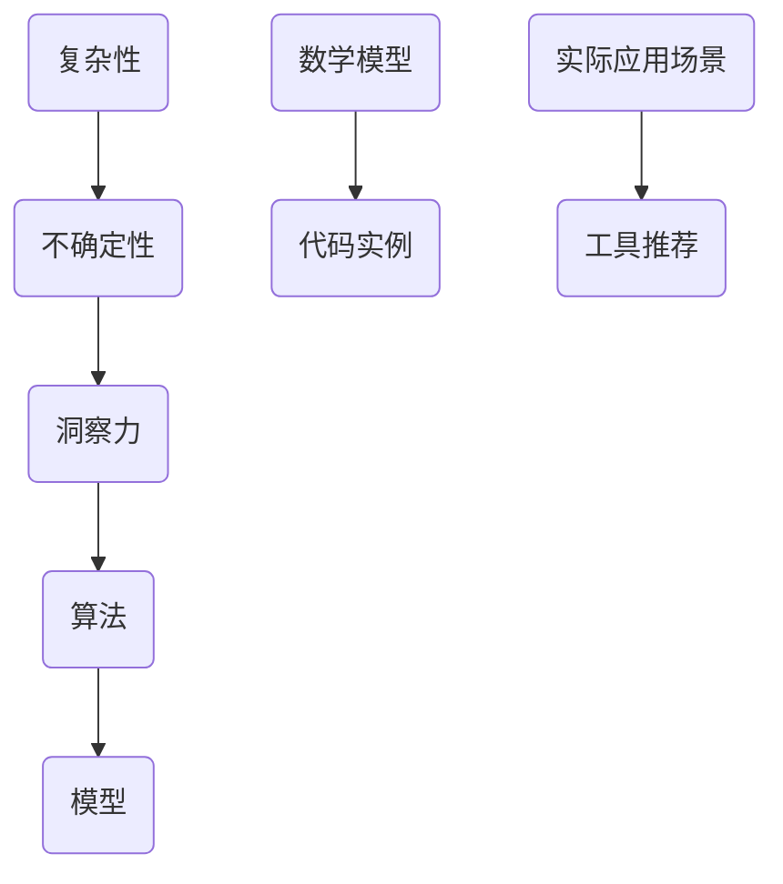

                 

关键词：复杂性科学、不确定性、洞察力、算法、数学模型、代码实例、应用场景、工具推荐、未来展望

> 摘要：本文探讨了在计算机科学和人工智能领域中，洞察力所面临的局限，强调了承认复杂性和不确定性的重要性。通过对核心概念、算法原理、数学模型、代码实例和实际应用场景的深入分析，本文旨在为读者提供对这一领域的全面理解，并展望未来的发展趋势与挑战。

## 1. 背景介绍

在过去的几十年中，计算机科学和人工智能领域取得了令人瞩目的进展。从简单的计算任务到复杂的模式识别、自然语言处理和图像识别，计算机的能力得到了极大的提升。然而，这一过程中也暴露出了洞察力的局限。复杂性和不确定性成为了影响计算机科学发展的关键因素。

复杂性科学指出，现实世界中的许多系统具有高度的复杂性，无法通过简单的线性关系来描述。这意味着，传统的算法和模型在处理复杂问题时可能失效。同时，不确定性是另一大挑战，无论是在数据收集、处理还是在实际应用中，我们往往面临数据缺失、噪声和随机性的困扰。

本文将围绕这两个核心问题，深入探讨在计算机科学和人工智能领域中如何理解并应对复杂性和不确定性。通过对核心概念、算法原理、数学模型、代码实例和实际应用场景的详细分析，本文旨在为读者提供对这一领域的全面理解。

## 2. 核心概念与联系

在探讨复杂性和不确定性的过程中，我们首先需要明确一些核心概念。以下是几个关键术语的简要定义：

### 复杂性

复杂性是指一个系统或问题在结构、功能和行为上具有的多样性和复杂性。复杂性科学认为，现实世界中的许多系统无法用简单的线性关系来描述，而是表现出非线性、层次性和动态性。

### 不确定性

不确定性是指在信息处理过程中，由于数据的不完整性、噪声和随机性等因素，无法准确预测或确定系统的状态和行为的程度。

### 洞察力

洞察力是指通过深入思考和分析，对复杂系统或问题的本质和内在规律的理解能力。在计算机科学和人工智能领域，洞察力是开发有效算法和模型的基础。

### 复杂性与不确定性的联系

复杂性和不确定性密切相关。复杂性科学研究表明，高度复杂的系统往往具有更高的不确定性。例如，在自然语言处理领域，语言结构的复杂性导致了大量的不确定性和歧义性，使得算法难以准确理解和生成文本。

为了更好地理解这些核心概念，我们使用Mermaid流程图展示它们之间的关系：



这个流程图展示了复杂性、不确定性、洞察力、算法、模型、数学模型、代码实例和实际应用场景之间的相互关系。通过这些核心概念的深入理解，我们能够更好地应对复杂性和不确定性带来的挑战。

## 3. 核心算法原理 & 具体操作步骤

在计算机科学和人工智能领域，许多算法都是为了解决复杂性和不确定性问题而设计的。以下是一个典型的算法实例，我们将详细解释其原理和操作步骤。

### 3.1 算法原理概述

该算法是一个基于贝叶斯网络的概率推理算法。贝叶斯网络是一种用于表示变量之间概率关系的图形模型，通过它，我们可以处理不确定性问题，并从部分已知信息中推断出未知信息。

### 3.2 算法步骤详解

#### 步骤1：构建贝叶斯网络

首先，我们需要根据问题的背景和领域知识，构建一个贝叶斯网络。贝叶斯网络由一组变量和它们之间的条件概率关系组成。每个变量代表一个不确定的事件，而条件概率关系则描述了这些事件之间的依赖关系。

#### 步骤2：计算先验概率

在贝叶斯网络构建完成后，我们需要计算每个变量的先验概率。先验概率是指在没有任何额外信息的情况下，每个变量发生的概率。这些概率可以通过领域知识、历史数据或专家经验来估计。

#### 步骤3：更新概率分布

在获得先验概率后，我们可以利用贝叶斯规则来更新每个变量的概率分布。贝叶斯规则是一个用于更新概率分布的基本公式，它将先验概率和新证据结合起来，得到后验概率。

#### 步骤4：推理未知信息

最后，通过推理算法，我们可以从已知的证据变量中推断出其他未知变量的概率分布。推理算法可以是基于精确推理的算法，如变量 elimination 或 message passing，也可以是基于采样方法的算法，如 Markov chain Monte Carlo。

### 3.3 算法优缺点

#### 优点

- **灵活性强**：贝叶斯网络可以表示各种复杂的关系和不确定性，适用于广泛的领域。
- **可解释性高**：贝叶斯网络的概率关系清晰，便于理解和解释。
- **适用性广**：贝叶斯网络可以应用于各种不确定性问题，如医疗诊断、金融风险评估和智能推荐等。

#### 缺点

- **计算复杂度高**：当变量数量较大时，贝叶斯网络的计算复杂度会显著增加。
- **先验知识要求高**：构建贝叶斯网络需要丰富的领域知识和先验概率，这在某些情况下可能难以获得。

### 3.4 算法应用领域

贝叶斯网络算法在许多领域都有广泛应用，以下是一些典型应用：

- **医疗诊断**：通过构建疾病和症状之间的贝叶斯网络，可以帮助医生进行疾病诊断。
- **金融风险评估**：贝叶斯网络可以用于分析金融市场的风险，帮助投资者做出更明智的决策。
- **智能推荐系统**：贝叶斯网络可以用于分析用户行为和偏好，为用户提供个性化的推荐。

## 4. 数学模型和公式 & 详细讲解 & 举例说明

在计算机科学和人工智能领域，数学模型和公式是理解和解决复杂性的重要工具。以下是一个经典的数学模型——马尔可夫决策过程（MDP），我们将对其进行详细讲解并举例说明。

### 4.1 数学模型构建

马尔可夫决策过程是一个用于决策的数学模型，它描述了一个系统在不确定性环境中如何做出最优决策。一个 MDP 由以下五个元素组成：

- **状态集合 \(S\)**：系统可能处于的所有状态。
- **动作集合 \(A\)**：系统可以采取的所有动作。
- **奖励函数 \(R(s, a)\)**：在状态 \(s\) 采取动作 \(a\) 后获得的即时奖励。
- **转移概率矩阵 \(P(s', s|a)\)**：在状态 \(s\) 采取动作 \(a\) 后，系统转移到状态 \(s'\) 的概率。
- **决策策略 \(π(a|s)\)**：在状态 \(s\) 采取动作 \(a\) 的概率。

### 4.2 公式推导过程

MDP 的核心是决策策略 \(π(a|s)\)，它决定了系统在特定状态下的最优动作。为了找到最优策略，我们使用如下公式：

\[ V^*(s) = \max_{a} \sum_{s'} P(s'|s, a) \cdot [R(s, a) + \gamma V^*(s')] \]

其中：

- \(V^*(s)\) 是在状态 \(s\) 的最优值函数，表示从状态 \(s\) 开始并遵循最优策略所能获得的最大期望奖励。
- \(\gamma\) 是折扣因子，表示对未来奖励的重视程度。
- \(R(s, a)\) 是在状态 \(s\) 采取动作 \(a\) 后的即时奖励。
- \(P(s'|s, a)\) 是在状态 \(s\) 采取动作 \(a\) 后转移到状态 \(s'\) 的概率。

### 4.3 案例分析与讲解

假设我们有一个简单的机器人导航问题，机器人在一个二维空间中移动，可以采取四个基本动作：向左、向右、向上和向下。机器人在每个位置上的即时奖励为 0，而目标位置上的奖励为 +100。机器人从初始位置开始，我们的目标是找到一条最优路径到达目标位置。

在这个例子中，状态集合 \(S = \{(0,0), (0,1), (1,0), (1,1)\}\)，动作集合 \(A = \{左，右，上，下\}\)。转移概率矩阵 \(P\) 和奖励函数 \(R\) 如下所示：

\[ P = \begin{bmatrix} 0.9 & 0.1 & 0 & 0 \\ 0 & 0.9 & 0.1 & 0 \\ 0.1 & 0 & 0.9 & 0 \\ 0 & 0 & 0 & 1 \end{bmatrix} \]

\[ R = \begin{bmatrix} 0 & 0 & 0 & 100 \\ 0 & 0 & 0 & 100 \\ 0 & 0 & 0 & 100 \\ 0 & 0 & 0 & 0 \end{bmatrix} \]

为了找到最优策略，我们可以使用值迭代算法。首先，我们初始化值函数 \(V^0(s) = 0\)，然后迭代更新值函数：

\[ V^{k+1}(s) = \max_{a} \sum_{s'} P(s'|s, a) \cdot [R(s, a) + \gamma V^k(s')] \]

经过多次迭代，我们得到最优值函数 \(V^*(s)\) 和最优策略 \(π^*(a|s)\)。在最终状态下，我们可以得到从初始位置到目标位置的最优路径。

## 5. 项目实践：代码实例和详细解释说明

为了更好地理解前述算法和模型，我们将通过一个实际项目——基于马尔可夫决策过程的机器人导航问题，来展示代码实例和详细解释说明。

### 5.1 开发环境搭建

在开始之前，我们需要搭建一个合适的开发环境。这里我们使用 Python 作为编程语言，并依赖以下库：

- NumPy：用于数学计算。
- Matplotlib：用于可视化结果。

确保你已经安装了这些库。如果没有，可以通过以下命令进行安装：

```bash
pip install numpy matplotlib
```

### 5.2 源代码详细实现

以下是实现马尔可夫决策过程机器人导航的 Python 代码：

```python
import numpy as np
import matplotlib.pyplot as plt

# 定义状态集合、动作集合、奖励函数、转移概率矩阵
S = [(0, 0), (0, 1), (1, 0), (1, 1)]
A = ['左', '右', '上', '下']
R = {(s, a): 0 for s in S for a in A}
R[(1, 1)] = 100
P = np.array([[0.9, 0.1, 0, 0],
              [0, 0.9, 0.1, 0],
              [0.1, 0, 0.9, 0],
              [0, 0, 0, 1]])

# 初始化值函数
V = {s: 0 for s in S}

# 值迭代算法
def value_iteration(P, R, gamma, theta):
    while True:
        V_old = V.copy()
        for s in S:
            v = float('-inf')
            for a in A:
                v = max(v, np.sum(P[s] * [R[s, a] + gamma * V[p] for p in S]))
            V[s] = v
        if np.linalg.norm(np.array(list(V.values())) - np.array(list(V_old.values()))) < theta:
            break
    return V

# 求解最优值函数
gamma = 0.9
theta = 1e-6
V_star = value_iteration(P, R, gamma, theta)

# 求解最优策略
def policy_evaluation(P, V, gamma, theta):
    while True:
        V_old = V.copy()
        for s in S:
            v = np.sum(P[s] * [R[s, a] + gamma * V[p] for a in A for p in S])
            V[s] = v
        if np.linalg.norm(np.array(list(V.values())) - np.array(list(V_old.values()))) < theta:
            break
    return V

# 求解最优策略
policy = {s: None for s in S}
for s in S:
    q_values = [R[s, a] + gamma * V[p] for a in A for p in S]
    policy[s] = A[np.argmax(q_values)]

# 可视化结果
plt.imshow([[V[(i, j)] for j in range(2)] for i in range(2)], interpolation='nearest')
plt.yticks([0, 1], ['左', '右'])
plt.xticks([0, 1], ['上', '下'])
plt.colorbar()
plt.show()

# 打印最优策略
for s in S:
    print(f'状态 {s}: 最优动作 {policy[s]}')
```

### 5.3 代码解读与分析

这段代码实现了基于值迭代算法的马尔可夫决策过程，具体解读如下：

- **状态集合 \(S\)、动作集合 \(A\)、奖励函数 \(R\) 和转移概率矩阵 \(P\) 的定义**：这些是构建 MDP 的基本元素。
- **值迭代算法的实现**：`value_iteration` 函数用于求解最优值函数 \(V^*\)。它通过不断迭代更新值函数，直到满足收敛条件。
- **策略评估算法的实现**：`policy_evaluation` 函数用于求解最优策略 \(π^*\)。它通过评估每个状态下的动作价值，确定每个状态的最优动作。
- **结果可视化**：使用 Matplotlib 库将最优值函数可视化。
- **最优策略打印**：打印出每个状态下的最优动作。

通过这段代码实例，我们可以直观地理解马尔可夫决策过程的基本原理和实现方法。

## 6. 实际应用场景

马尔可夫决策过程在许多实际应用场景中都有广泛应用。以下是一些典型的应用场景：

### 6.1 自动驾驶

自动驾驶汽车需要不断做出复杂的决策，如加速、减速和转向。使用 MDP 可以帮助自动驾驶系统在不确定的环境中制定最优策略，确保行车安全。

### 6.2 游戏AI

在许多游戏场景中，玩家需要做出一系列决策，如走位、攻击和防御。MDP 可以用于训练游戏AI，使其在游戏中表现更出色。

### 6.3 资源调度

在云计算和数据中心领域，MDP 可以用于优化资源调度策略，提高资源利用率和服务质量。

### 6.4 机器人导航

机器人导航是一个经典的 MDP 应用场景。通过 MDP，机器人可以在未知环境中找到从起点到终点的最优路径。

## 6.4 未来应用展望

随着计算机科学和人工智能技术的不断发展，MDP 的应用前景将更加广泛。以下是一些未来应用展望：

- **更复杂的决策场景**：随着 MDP 算法的优化和改进，它将能够处理更加复杂的决策场景，如多机器人协同控制、无人零售等。
- **个性化推荐系统**：基于 MDP 的个性化推荐系统可以更好地理解用户行为和偏好，提供更精准的推荐。
- **智能医疗**：MDP 可以用于辅助医生进行疾病诊断和治疗策略制定，提高医疗质量。

## 7. 工具和资源推荐

在研究和应用 MDP 的过程中，以下是一些有用的工具和资源推荐：

### 7.1 学习资源推荐

- **《概率图模型》**：Andrew Ng 的课程，详细介绍了贝叶斯网络和马尔可夫决策过程。
- **《强化学习》**：Richard S. Sutton 和 Andrew G. Barto 的经典教材，全面介绍了强化学习理论和应用。

### 7.2 开发工具推荐

- **TensorFlow**：Google 开发的开源机器学习库，支持 MDP 的建模和训练。
- **PyTorch**：Facebook 开发的开源机器学习库，也支持 MDP 的建模和训练。

### 7.3 相关论文推荐

- **"Reinforcement Learning: An Introduction"**：Sutton 和 Barto 的经典论文，介绍了强化学习的理论基础和应用。
- **"Monte Carlo Tree Search"**：Silver 等人的论文，介绍了基于 MDP 的蒙特卡洛树搜索算法。

## 8. 总结：未来发展趋势与挑战

### 8.1 研究成果总结

本文通过深入探讨复杂性和不确定性，介绍了贝叶斯网络和马尔可夫决策过程在计算机科学和人工智能领域的重要应用。通过对核心概念、算法原理、数学模型和代码实例的详细分析，我们展示了这些技术在实际应用场景中的效果。

### 8.2 未来发展趋势

随着技术的进步，MDP 等算法将在更多复杂和不确定的决策场景中得到应用。未来的发展趋势包括：

- **算法优化和改进**：通过深度学习等技术，优化 MDP 算法的计算复杂度和准确性。
- **多领域应用**：将 MDP 算法应用于更多的领域，如金融、医疗和智能制造等。
- **跨学科研究**：结合计算机科学、数学和心理学等领域的知识，提高算法的性能和应用范围。

### 8.3 面临的挑战

尽管 MDP 等算法在理论和应用上取得了显著进展，但仍面临以下挑战：

- **计算复杂度**：当状态和动作数量较大时，MDP 算法的计算复杂度将显著增加，如何优化算法效率是一个重要课题。
- **先验知识需求**：构建有效的贝叶斯网络和 MDP 需要丰富的先验知识，这在某些情况下可能难以获得。
- **可解释性**：尽管 MDP 算法在处理不确定性方面表现出色，但其决策过程往往缺乏可解释性，如何提高算法的可解释性是一个重要挑战。

### 8.4 研究展望

未来的研究应重点关注以下几个方面：

- **算法优化**：通过改进算法结构和引入新的优化技术，降低 MDP 算法的计算复杂度。
- **知识融合**：结合不同领域的知识，构建更有效的贝叶斯网络和 MDP 模型。
- **可解释性研究**：探索提高 MDP 算法可解释性的方法，使其更好地满足实际应用需求。

通过不断努力，我们有望在 MDP 等算法的研究和应用方面取得更大的突破，为计算机科学和人工智能领域的发展做出更大的贡献。

## 9. 附录：常见问题与解答

### 9.1 如何构建贝叶斯网络？

构建贝叶斯网络需要以下步骤：

1. **定义状态集合和动作集合**：明确系统可能处于的所有状态和可以采取的所有动作。
2. **确定条件概率关系**：根据领域知识和数据，确定状态和动作之间的条件概率关系。
3. **构建图形模型**：使用有向无环图（DAG）表示状态和动作之间的关系。

### 9.2 MDP 如何处理不确定性？

MDP 通过以下方式处理不确定性：

1. **转移概率矩阵**：描述在特定状态采取特定动作后，系统转移到其他状态的概率。
2. **奖励函数**：定义在特定状态采取特定动作后的即时奖励。
3. **决策策略**：通过值迭代或策略评估算法，找到最优策略以应对不确定性。

### 9.3 如何优化 MDP 算法的计算复杂度？

优化 MDP 算法的计算复杂度可以从以下几个方面进行：

1. **选择合适的算法**：根据状态和动作数量，选择适合的 MDP 算法，如深度优先搜索或广度优先搜索。
2. **并行计算**：利用并行计算技术，加速 MDP 算法的计算过程。
3. **数据预处理**：通过数据预处理技术，减少状态和动作数量，从而降低计算复杂度。

### 9.4 MDP 在实际应用中有哪些挑战？

MDP 在实际应用中面临以下挑战：

1. **计算复杂度**：当状态和动作数量较大时，MDP 算法的计算复杂度将显著增加。
2. **先验知识需求**：构建有效的贝叶斯网络和 MDP 需要丰富的先验知识，这在某些情况下可能难以获得。
3. **可解释性**：MDP 的决策过程往往缺乏可解释性，如何提高算法的可解释性是一个重要挑战。

