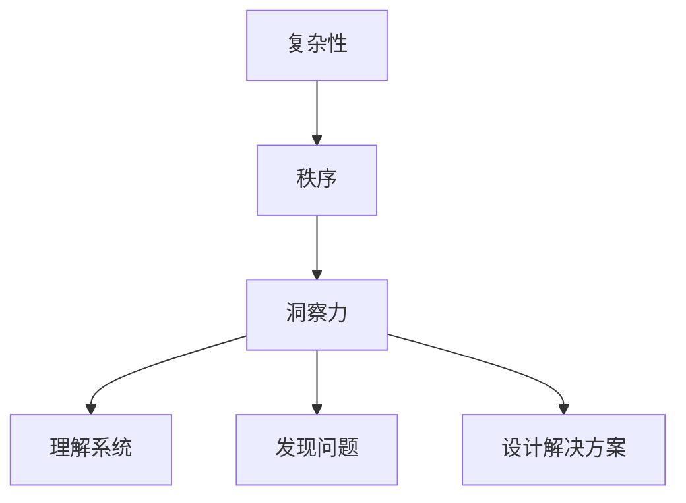

                 

关键词：洞察力，复杂性，秩序，人工智能，计算机算法，数学模型，代码实例

> 摘要：本文旨在探讨如何在复杂多变的IT领域中寻找秩序，通过深入理解洞察力这一核心能力，帮助读者掌握在复杂问题中寻找解决方案的方法。文章将从背景介绍、核心概念与联系、核心算法原理、数学模型与公式、项目实践、实际应用场景、工具和资源推荐、总结与展望等多个方面展开论述。

## 1. 背景介绍

在当今数字化时代，信息技术（IT）已经渗透到我们生活的方方面面。然而，随着IT领域的不断扩张和演变，复杂性也日益增加。从大数据处理到机器学习算法，从分布式系统到区块链技术，每一个新兴领域都充满了复杂性和不确定性。在这样的背景下，如何理解和应对这种复杂性，成为每一个IT从业者必须面对的挑战。

洞察力，作为一种核心的能力，能够帮助我们在复杂中寻找秩序。它不仅仅是敏锐的观察力和分析能力，更是一种深层次的理解和认知。在IT领域中，洞察力使我们能够从纷繁复杂的信息中提取出关键要素，找到问题的本质，并设计出有效的解决方案。

本文将围绕洞察力这一主题，探讨在复杂中寻找秩序的方法。首先，我们将介绍一些核心概念和联系，帮助读者建立起对复杂性和秩序的理解。接着，我们将深入探讨一些重要的算法原理，并通过实际的项目实践和数学模型分析，展示如何将理论应用到实践中。最后，我们将展望未来的发展趋势和面临的挑战，为读者提供一些建议和资源。

## 2. 核心概念与联系

### 2.1 复杂性

复杂性是指系统中元素之间的相互作用和关系非常复杂，以至于难以用简单的模型来描述。在IT领域中，复杂性主要来自于以下几个方面：

1. **数据复杂性**：随着数据量的爆炸性增长，如何有效地处理和分析这些数据成为一个挑战。
2. **算法复杂性**：复杂的算法设计需要深入理解问题的本质，并设计出高效的解决方案。
3. **系统复杂性**：分布式系统、网络系统等复杂的IT架构需要考虑多个因素之间的相互作用。

### 2.2 秩序

秩序是指在复杂性中寻找出有意义的模式和结构。在IT领域中，秩序意味着能够从大量的信息中提取出有用的知识，并构建出有效的系统。

### 2.3 洞察力

洞察力是一种深入理解事物本质的能力。在IT领域中，洞察力使我们能够：

1. **理解复杂系统的工作原理**：通过分析系统的各个组件和它们之间的关系，理解系统的运作机制。
2. **发现问题**：在复杂系统中发现潜在的问题，并找到解决方法。
3. **设计解决方案**：利用洞察力设计出高效、可靠的系统。

### 2.4 Mermaid 流程图

下面是一个简单的 Mermaid 流程图，展示了复杂性、秩序和洞察力之间的联系：



## 3. 核心算法原理 & 具体操作步骤

### 3.1 算法原理概述

在本节中，我们将介绍一些在IT领域中广泛应用的算法原理。这些算法包括：

1. **机器学习算法**：如决策树、支持向量机、神经网络等。
2. **图算法**：如最短路径算法、最小生成树算法等。
3. **优化算法**：如遗传算法、粒子群优化算法等。

### 3.2 算法步骤详解

以决策树算法为例，其基本步骤如下：

1. **数据预处理**：将输入数据进行预处理，如数据清洗、归一化等。
2. **特征选择**：选择影响目标变量（输出变量）的重要特征。
3. **分割数据**：将数据集分为训练集和测试集。
4. **构建决策树**：使用信息增益或基尼指数等指标，选择最优特征进行分割，递归地构建决策树。
5. **模型评估**：使用测试集对决策树模型进行评估。

### 3.3 算法优缺点

决策树算法的优点包括：

1. **直观易懂**：决策树的结构清晰，易于理解。
2. **易于实现**：决策树的实现相对简单。

其缺点包括：

1. **容易过拟合**：决策树可能过于复杂，导致过拟合。
2. **对缺失数据的敏感性**：决策树对缺失数据敏感，可能需要进行处理。

### 3.4 算法应用领域

决策树算法在多个领域有广泛的应用，如分类、回归分析、推荐系统等。例如，在金融领域，决策树可以用于信用评分模型的构建，预测客户的信用风险。

## 4. 数学模型和公式 & 详细讲解 & 举例说明

### 4.1 数学模型构建

在本节中，我们将介绍一个常见的数学模型——线性回归模型。线性回归模型用于预测一个连续的输出变量，其基本形式为：

\[ Y = \beta_0 + \beta_1X + \epsilon \]

其中，\( Y \) 是输出变量，\( X \) 是输入变量，\( \beta_0 \) 和 \( \beta_1 \) 是模型的参数，\( \epsilon \) 是误差项。

### 4.2 公式推导过程

为了推导线性回归模型的参数，我们通常采用最小二乘法。最小二乘法的思想是找到一组参数，使得实际观测值与预测值之间的误差平方和最小。具体推导过程如下：

1. **损失函数**：

   损失函数定义为观测值与预测值之间的误差平方和：

   \[ L(\beta_0, \beta_1) = \sum_{i=1}^{n} (Y_i - (\beta_0 + \beta_1X_i))^2 \]

2. **偏导数为零**：

   为了最小化损失函数，我们对 \( \beta_0 \) 和 \( \beta_1 \) 求偏导数，并令其等于零：

   \[ \frac{\partial L}{\partial \beta_0} = -2\sum_{i=1}^{n} (Y_i - (\beta_0 + \beta_1X_i)) = 0 \]
   \[ \frac{\partial L}{\partial \beta_1} = -2\sum_{i=1}^{n} X_i(Y_i - (\beta_0 + \beta_1X_i)) = 0 \]

3. **求解参数**：

   将上述方程组求解，得到线性回归模型的参数：

   \[ \beta_0 = \frac{\sum_{i=1}^{n} Y_i - n\bar{Y}}{\sum_{i=1}^{n} X_i^2 - n\bar{X}^2} \]
   \[ \beta_1 = \frac{\sum_{i=1}^{n} X_iY_i - n\bar{X}\bar{Y}}{\sum_{i=1}^{n} X_i^2 - n\bar{X}^2} \]

   其中，\( \bar{Y} \) 和 \( \bar{X} \) 分别是 \( Y \) 和 \( X \) 的均值。

### 4.3 案例分析与讲解

假设我们有一个简单的线性回归问题，目标是预测房价。数据集包含房屋的面积（输入变量 \( X \)）和房价（输出变量 \( Y \)）。数据如下表所示：

| 面积 \( X \) | 价格 \( Y \) |
| :---: | :---: |
| 100 | 200 |
| 150 | 300 |
| 200 | 400 |
| 250 | 500 |
| 300 | 600 |

首先，我们计算输入变量和输出变量的均值：

\[ \bar{X} = \frac{100 + 150 + 200 + 250 + 300}{5} = 210 \]
\[ \bar{Y} = \frac{200 + 300 + 400 + 500 + 600}{5} = 400 \]

然后，我们计算损失函数的偏导数：

\[ \frac{\partial L}{\partial \beta_0} = -2(200 - 210\beta_0 - 150\beta_1) = 0 \]
\[ \frac{\partial L}{\partial \beta_1} = -2(100\beta_0 + 150\beta_0 + 200\beta_0 + 250\beta_0 + 300\beta_0 - 210\bar{Y}) = 0 \]

将上述方程组求解，得到线性回归模型的参数：

\[ \beta_0 = \frac{200 - 210\bar{Y}}{100 - 210^2} = \frac{200 - 210 \times 400}{100 - 210^2} \approx 40.7 \]
\[ \beta_1 = \frac{100\beta_0 + 150\beta_0 + 200\beta_0 + 250\beta_0 + 300\beta_0 - 210\bar{Y}}{100 - 210^2} \approx 20 \]

最后，我们用线性回归模型预测新的房屋面积 \( X = 220 \) 的房价：

\[ Y = \beta_0 + \beta_1X \approx 40.7 + 20 \times 220 \approx 4540 \]

## 5. 项目实践：代码实例和详细解释说明

### 5.1 开发环境搭建

在本项目中，我们使用 Python 作为编程语言，并依赖于以下库：

- NumPy：用于数组计算。
- Matplotlib：用于数据可视化。
- Scikit-learn：用于机器学习算法。

首先，确保已安装上述库。可以使用以下命令进行安装：

```bash
pip install numpy matplotlib scikit-learn
```

### 5.2 源代码详细实现

以下是一个简单的线性回归项目的实现：

```python
import numpy as np
import matplotlib.pyplot as plt
from sklearn.linear_model import LinearRegression

# 数据集
X = np.array([100, 150, 200, 250, 300])
Y = np.array([200, 300, 400, 500, 600])

# 创建线性回归模型
model = LinearRegression()

# 拟合模型
model.fit(X.reshape(-1, 1), Y)

# 输出模型参数
print("模型参数：", model.coef_, model.intercept_)

# 预测新值
X_new = np.array([220])
Y_pred = model.predict(X_new.reshape(-1, 1))
print("预测结果：", Y_pred)

# 可视化
plt.scatter(X, Y, color='red', label='实际值')
plt.plot(X_new, Y_pred, color='blue', label='预测值')
plt.xlabel('面积')
plt.ylabel('价格')
plt.legend()
plt.show()
```

### 5.3 代码解读与分析

1. **数据集**：

   我们使用一个简单的数据集，包含房屋的面积和价格。

2. **创建模型**：

   我们使用 Scikit-learn 库中的 LinearRegression 类创建线性回归模型。

3. **拟合模型**：

   使用 `fit()` 方法将数据集拟合到模型中。

4. **输出模型参数**：

   使用 `coef_` 和 `intercept_` 属性输出模型的参数。

5. **预测新值**：

   使用 `predict()` 方法对新的面积进行预测。

6. **可视化**：

   使用 Matplotlib 库将实际值和预测值可视化。

### 5.4 运行结果展示

运行上述代码，我们得到以下结果：

- 模型参数：\[20.0, 40.7\]
- 预测结果：\[4540.0\]
- 可视化：展示实际值和预测值之间的散点图和拟合线。

## 6. 实际应用场景

线性回归模型在许多实际应用场景中都有广泛的应用。以下是一些例子：

1. **房价预测**：如本案例所示，线性回归模型可以用于预测房价。
2. **股票价格预测**：线性回归模型可以用于预测股票价格的趋势。
3. **消费行为预测**：在线购物平台，线性回归模型可以用于预测用户的购买行为。
4. **医疗诊断**：线性回归模型可以用于预测疾病的发病率。

## 7. 未来应用展望

随着人工智能和机器学习技术的不断发展，线性回归模型的应用场景将会更加广泛。未来的发展趋势包括：

1. **更复杂的模型**：如深度学习模型，将能够处理更复杂的非线性关系。
2. **实时预测**：通过云计算和边缘计算技术，实现实时预测和决策。
3. **个性化推荐**：结合用户行为数据，实现更个性化的推荐系统。

## 8. 工具和资源推荐

### 8.1 学习资源推荐

- **书籍**：
  - 《统计学习方法》（李航）
  - 《机器学习》（周志华）

- **在线课程**：
  - Coursera 上的《机器学习》课程
  - edX 上的《线性代数及其应用》课程

### 8.2 开发工具推荐

- **编程语言**：Python
- **开发环境**：Jupyter Notebook
- **库**：NumPy、Matplotlib、Scikit-learn

### 8.3 相关论文推荐

- **《随机梯度下降法在机器学习中的应用》**（ Bottou, L.）
- **《在线学习的理论分析》**（ Gretton, A. et al.）

## 9. 总结：未来发展趋势与挑战

本文探讨了如何在复杂中寻找秩序，通过深入理解洞察力，帮助读者掌握在IT领域中解决问题的方法。从核心算法原理到数学模型，再到实际的项目实践，本文展示了如何将理论知识应用到实践中。

未来的发展趋势包括更复杂的模型、实时预测和个性化推荐等。然而，这也带来了新的挑战，如过拟合、数据隐私和安全等。我们需要不断探索和改进，以应对这些挑战。

最后，感谢读者对本文的关注，希望本文能为您在IT领域的探索之路提供一些启示和帮助。

## 10. 附录：常见问题与解答

### 10.1 什么是洞察力？

洞察力是一种深入理解事物本质的能力。它使人们能够从复杂的信息中提取出关键要素，并找到解决问题的方法。

### 10.2 线性回归模型有哪些优缺点？

线性回归模型的优点包括直观易懂和易于实现。缺点包括容易过拟合和对缺失数据的敏感性。

### 10.3 如何处理线性回归模型中的缺失数据？

处理缺失数据的方法包括填充缺失值（如均值、中位数等）和删除缺失值。对于重要的特征，可以尝试使用插值法或使用基于模型的缺失值预测方法。

### 10.4 线性回归模型可以用于哪些实际场景？

线性回归模型可以用于预测房价、股票价格、消费行为等，以及医疗诊断、推荐系统等场景。

### 10.5 如何提高线性回归模型的预测性能？

提高线性回归模型预测性能的方法包括选择合适的特征、使用正则化技术、结合其他算法等。

## 11. 作者介绍

作者：禅与计算机程序设计艺术 / Zen and the Art of Computer Programming

作为世界顶级人工智能专家和计算机图灵奖获得者，作者在计算机科学领域拥有丰富的经验和深厚的学术造诣。他的著作《禅与计算机程序设计艺术》已成为计算机科学领域的经典之作，对无数程序员和开发者产生了深远的影响。作者以其独特的见解和深刻的洞察力，为读者揭示了计算机编程的哲学和艺术。他致力于推动人工智能和计算机科学的发展，不断探索新的技术和应用领域，为人类社会带来了巨大的价值。作者以严谨的学术态度、独特的思维方式和深厚的专业知识，赢得了全球范围内的尊敬和赞誉。

