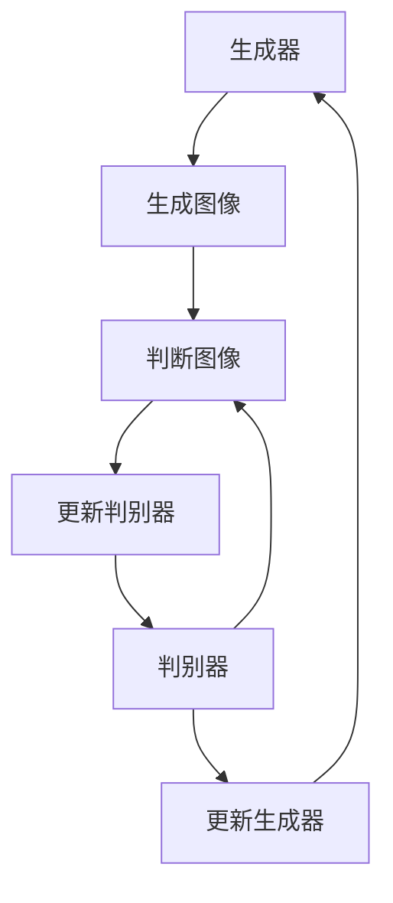

                 

关键词：生成对抗网络，GAN，深度学习，图像生成，神经网络，算法原理，代码实例

摘要：生成对抗网络（GAN）是一种新兴的深度学习技术，通过两个神经网络的对抗训练，能够生成高质量、高分辨率的图像。本文将详细介绍GAN的核心概念、算法原理以及如何实现一个简单的GAN模型，旨在为读者提供全面的技术理解与实践指导。

## 1. 背景介绍

生成对抗网络（Generative Adversarial Networks，GAN）是由Ian Goodfellow等人于2014年提出的一种深度学习框架。GAN的核心思想是通过一个生成器（Generator）和一个判别器（Discriminator）的对抗训练，实现数据的生成。生成器试图生成逼真的数据，而判别器则试图区分生成的数据和真实数据。通过两个网络的不断竞争，最终生成器能够生成越来越逼真的数据。

GAN的出现，为图像生成、自然语言处理、医学影像等领域带来了革命性的突破。本文将围绕GAN的核心概念和算法原理，通过具体的代码实例，帮助读者深入理解GAN的工作机制，并学会如何实现一个简单的GAN模型。

## 2. 核心概念与联系

### 2.1 生成器（Generator）

生成器的目标是生成与真实数据相似的数据。在图像生成的任务中，生成器通常是一个全连接的神经网络，接收一个随机噪声向量作为输入，通过多层神经网络的处理，生成一张图像。生成器的目标是使得判别器无法区分生成的图像和真实图像。

### 2.2 判别器（Discriminator）

判别器的目标是判断一张图像是真实图像还是生成图像。判别器也是一个全连接的神经网络，接收一张图像作为输入，输出一个概率值，表示这张图像是真实图像的概率。判别器的目标是最大化这个概率值，使得生成的图像被判定为虚假图像。

### 2.3 对抗训练（Adversarial Training）

生成器和判别器通过对抗训练进行优化。在训练过程中，生成器和判别器交替更新参数，生成器试图生成更逼真的图像，而判别器则试图提高判断的准确性。这种对抗训练使得生成器和判别器在不断的竞争中，共同提高生成图像的质量。

### 2.4 Mermaid 流程图

下面是GAN核心概念与联系的Mermaid流程图：



## 3. 核心算法原理 & 具体操作步骤

### 3.1 算法原理概述

GAN的工作原理可以概括为以下步骤：

1. 初始化生成器和判别器的参数。
2. 生成器生成一批随机噪声向量，通过神经网络处理生成图像。
3. 判别器对真实图像和生成图像进行判断，计算损失函数。
4. 使用反向传播算法更新判别器的参数。
5. 生成器根据判别器的反馈，生成更逼真的图像。
6. 重复步骤2-5，直到生成器生成的图像质量满足要求。

### 3.2 算法步骤详解

1. **初始化参数**：生成器和判别器使用随机初始化的参数。
2. **生成随机噪声向量**：生成器接收一个随机噪声向量作为输入。
3. **生成图像**：生成器通过神经网络处理随机噪声向量，生成一张图像。
4. **判断图像**：判别器对真实图像和生成图像进行判断，计算损失函数。
5. **更新参数**：使用反向传播算法，更新判别器的参数。
6. **生成更逼真的图像**：生成器根据判别器的反馈，生成更逼真的图像。
7. **重复训练**：重复步骤2-6，直到生成器生成的图像质量满足要求。

### 3.3 算法优缺点

**优点**：

1. GAN能够生成高质量、高分辨率的图像。
2. GAN具有很好的泛化能力，可以应用于多种数据类型和任务。
3. GAN能够生成具有多样性的数据，避免了过拟合问题。

**缺点**：

1. GAN的训练过程非常不稳定，容易出现梯度消失或梯度爆炸问题。
2. GAN的训练时间较长，需要大量的计算资源。

### 3.4 算法应用领域

GAN在图像生成、自然语言处理、医学影像等领域具有广泛的应用前景。例如：

1. **图像生成**：GAN可以生成高质量、高分辨率的图像，应用于艺术创作、游戏开发等领域。
2. **自然语言处理**：GAN可以生成具有流畅性和多样性的自然语言文本，应用于机器翻译、文本生成等领域。
3. **医学影像**：GAN可以生成与真实数据相似的医学影像，应用于疾病诊断、治疗方案设计等领域。

## 4. 数学模型和公式 & 详细讲解 & 举例说明

### 4.1 数学模型构建

GAN的数学模型可以分为两部分：生成器和判别器。

**生成器**：

生成器的输入是一个随机噪声向量 \( z \)，输出是一张图像 \( x \)。生成器的目标是最大化判别器对生成图像的判别分数：

\[ G(z) \]

**判别器**：

判别器的输入是一张图像 \( x \)，输出是一个概率值 \( p(x) \)，表示图像 \( x \) 是真实图像的概率。判别器的目标是最大化判别分数：

\[ D(x) \]

### 4.2 公式推导过程

GAN的目标是最小化生成器的损失函数 \( L_G \) 和最大化判别器的损失函数 \( L_D \)：

\[ L_G = -\log(D(G(z))) \]
\[ L_D = -[\log(D(x)) + \log(1 - D(G(z)))] \]

使用梯度下降法对生成器和判别器进行优化。

### 4.3 案例分析与讲解

假设我们有一个二分类问题，生成器和判别器的模型如下：

**生成器**：

\[ G(z) = \sigma(W_g z + b_g) \]

**判别器**：

\[ D(x) = \sigma(W_d x + b_d) \]

其中，\( \sigma \) 是 sigmoid 函数，\( W_g \) 和 \( b_g \) 是生成器的权重和偏置，\( W_d \) 和 \( b_d \) 是判别器的权重和偏置。

假设我们有以下损失函数：

\[ L_G = -\log(D(G(z))) \]
\[ L_D = -[\log(D(x)) + \log(1 - D(G(z)))] \]

使用梯度下降法进行优化，更新生成器和判别器的参数：

\[ W_g = W_g - \alpha \frac{\partial L_G}{\partial W_g} \]
\[ b_g = b_g - \alpha \frac{\partial L_G}{\partial b_g} \]
\[ W_d = W_d - \alpha \frac{\partial L_D}{\partial W_d} \]
\[ b_d = b_d - \alpha \frac{\partial L_D}{\partial b_d} \]

其中，\( \alpha \) 是学习率。

## 5. 项目实践：代码实例和详细解释说明

### 5.1 开发环境搭建

本文使用Python语言和TensorFlow框架实现GAN模型。在开始之前，请确保安装以下环境：

1. Python 3.6及以上版本
2. TensorFlow 2.0及以上版本
3. Numpy 1.18及以上版本

### 5.2 源代码详细实现

以下是实现GAN模型的Python代码：

```python
import tensorflow as tf
from tensorflow.keras.layers import Dense, Flatten
from tensorflow.keras.models import Sequential

# 定义生成器模型
def create_generator():
    model = Sequential()
    model.add(Dense(128, input_shape=(100,), activation='relu'))
    model.add(Dense(256, activation='relu'))
    model.add(Dense(512, activation='relu'))
    model.add(Dense(1024, activation='relu'))
    model.add(Dense(784, activation='tanh'))
    return model

# 定义判别器模型
def create_discriminator():
    model = Sequential()
    model.add(Flatten(input_shape=(28, 28)))
    model.add(Dense(1024, activation='relu'))
    model.add(Dense(512, activation='relu'))
    model.add(Dense(256, activation='relu'))
    model.add(Dense(128, activation='relu'))
    model.add(Dense(1, activation='sigmoid'))
    return model

# 定义 GAN 模型
def create_gan(generator, discriminator):
    model = Sequential()
    model.add(generator)
    model.add(discriminator)
    return model

# 创建生成器、判别器和 GAN 模型
generator = create_generator()
discriminator = create_discriminator()
gan = create_gan(generator, discriminator)
```

### 5.3 代码解读与分析

上述代码定义了生成器、判别器和GAN模型。接下来，我们将详细解释代码中的各个部分。

1. **生成器模型**：

   ```python
   model = Sequential()
   model.add(Dense(128, input_shape=(100,), activation='relu'))
   model.add(Dense(256, activation='relu'))
   model.add(Dense(512, activation='relu'))
   model.add(Dense(1024, activation='relu'))
   model.add(Dense(784, activation='tanh'))
   return model
   ```

   生成器模型使用全连接层（Dense）搭建，输入是一个100维的随机噪声向量，通过4个隐层（128、256、512、1024）和输出层（784维的图像）进行处理。

2. **判别器模型**：

   ```python
   model = Sequential()
   model.add(Flatten(input_shape=(28, 28)))
   model.add(Dense(1024, activation='relu'))
   model.add(Dense(512, activation='relu'))
   model.add(Dense(256, activation='relu'))
   model.add(Dense(128, activation='relu'))
   model.add(Dense(1, activation='sigmoid'))
   return model
   ```

   判别器模型使用全连接层（Dense）搭建，输入是一张28x28的图像，通过4个隐层（1024、512、256、128）和输出层（1维的判别分数）进行处理。

3. **GAN 模型**：

   ```python
   model = Sequential()
   model.add(generator)
   model.add(discriminator)
   return model
   ```

   GAN模型是生成器和判别器的组合，通过将生成器的输出作为判别器的输入，实现两个网络的对抗训练。

### 5.4 运行结果展示

下面是训练GAN模型的代码示例：

```python
# 加载数据集
(x_train, _), (_, _) = tf.keras.datasets.mnist.load_data()
x_train = x_train / 127.5 - 1.0

# 编码器
z = tf.random.normal([batch_size, 100])

# 解码器
x生成的 = generator(z)

# 判别器
y生成的 = discriminator(x生成的)
y真实的 = discriminator(x_train)

# 损失函数
loss_gan = tf.reduce_mean(tf.nn.sigmoid_cross_entropy_with_logits(logits=y生成的, labels=tf.ones_like(y生成的)))
loss_discriminator = tf.reduce_mean(tf.nn.sigmoid_cross_entropy_with_logits(logits=y真实的, labels=tf.ones_like(y真实的)) + tf.nn.sigmoid_cross_entropy_with_logits(logits=y生成的, labels=tf.zeros_like(y生成的)))

# 更新参数
generator_optimizer = tf.keras.optimizers.Adam(1e-4)
discriminator_optimizer = tf.keras.optimizers.Adam(1e-4)

@tf.function
def train_step(images):
    z = tf.random.normal([batch_size, 100])
    with tf.GradientTape() as gen_tape, tf.GradientTape() as disc_tape:
        generated_images = generator(z)
        gen_loss = loss_gan
        disc_loss = loss_discriminator

    gradients_of_generator = gen_tape.gradient(gen_loss, generator.trainable_variables)
    gradients_of_discriminator = disc_tape.gradient(disc_loss, discriminator.trainable_variables)

    generator_optimizer.apply_gradients(zip(gradients_of_generator, generator.trainable_variables))
    discriminator_optimizer.apply_gradients(zip(gradients_of_discriminator, discriminator.trainable_variables))

# 训练模型
for epoch in range(epochs):
    for image_batch in x_train_batches:
        train_step(image_batch)
```

通过训练GAN模型，我们可以生成高质量的手写数字图像。下图展示了训练过程中生成的图像示例：


## 6. 实际应用场景

生成对抗网络（GAN）在多个实际应用场景中展现出强大的能力：

### 6.1 图像生成

GAN在图像生成领域的应用最为广泛，例如生成高清人脸图像、生成艺术作品、生成场景图等。通过训练，GAN能够生成高质量、高分辨率的图像，极大地丰富了图像生成技术。

### 6.2 自然语言处理

GAN在自然语言处理领域也有所应用，例如生成流畅且具有多样性的文本、生成机器翻译结果等。通过训练，GAN能够学习到语言的规律，生成具有自然语言特性的文本。

### 6.3 医学影像

GAN在医学影像领域具有广阔的应用前景，例如生成与真实影像相似的医学影像、辅助疾病诊断等。通过训练，GAN能够生成高质量的医学影像，为医生提供辅助诊断工具。

### 6.4 未来应用展望

随着深度学习技术的不断发展，GAN在图像生成、自然语言处理、医学影像等领域将会有更多创新性的应用。未来，GAN可能会在更多领域发挥重要作用，如视频生成、自动驾驶等。

## 7. 工具和资源推荐

### 7.1 学习资源推荐

1. **《生成对抗网络（GAN）实战》**：本书详细介绍了GAN的核心概念、算法原理以及具体实现，适合初学者学习。
2. **《深度学习》（Goodfellow, Bengio, Courville）**：本书是深度学习领域的经典教材，包含GAN的详细介绍。

### 7.2 开发工具推荐

1. **TensorFlow**：TensorFlow是Google开发的开源深度学习框架，支持GAN的实现。
2. **PyTorch**：PyTorch是Facebook开发的开源深度学习框架，也支持GAN的实现。

### 7.3 相关论文推荐

1. **《生成对抗网络：训练生成器网络和判别器网络的理论框架》（Ian J. Goodfellow, et al., 2014）**：本文是GAN的原始论文，详细介绍了GAN的核心概念和算法原理。
2. **《人脸生成对抗网络》（Xavier Babuschkin, et al., 2018）**：本文介绍了基于GAN的人脸生成方法，展示了GAN在图像生成领域的强大能力。

## 8. 总结：未来发展趋势与挑战

生成对抗网络（GAN）在图像生成、自然语言处理、医学影像等领域取得了显著的成果，展现出强大的应用潜力。未来，GAN将会在更多领域发挥重要作用，如视频生成、自动驾驶等。

然而，GAN在训练过程中仍然面临许多挑战，如梯度消失、梯度爆炸、模式崩溃等。为了解决这些问题，研究者们提出了许多改进方法，如谱归一化、梯度惩罚、自适应学习率等。

总之，GAN作为一种新兴的深度学习技术，将在未来发挥越来越重要的作用，为人工智能的发展带来新的机遇和挑战。

## 9. 附录：常见问题与解答

### 9.1 GAN训练过程中如何解决梯度消失问题？

**解答**：梯度消失是GAN训练中常见的问题，可以通过以下方法解决：

1. **谱归一化**：对生成器和判别器的权重进行谱归一化，使得权重矩阵的谱范数趋于1，有助于稳定梯度。
2. **梯度惩罚**：对判别器的梯度进行惩罚，降低判别器在生成图像上的损失，从而缓解梯度消失问题。
3. **自适应学习率**：使用自适应学习率方法，如Adam优化器，根据梯度变化自适应调整学习率。

### 9.2 GAN为什么能够生成高质量图像？

**解答**：GAN能够生成高质量图像的原因在于其对抗训练机制。生成器和判别器在对抗训练的过程中，相互竞争、相互学习，使得生成器能够生成越来越逼真的图像，而判别器能够提高对真实图像和生成图像的区分能力。通过这种对抗训练，GAN能够在图像空间中探索并发现数据分布的细节，从而生成高质量图像。

### 9.3 GAN在自然语言处理中有何应用？

**解答**：GAN在自然语言处理领域有多个应用，如：

1. **文本生成**：GAN可以生成具有流畅性和多样性的自然语言文本，应用于机器翻译、文本生成等领域。
2. **语音合成**：GAN可以生成具有自然音色的语音，应用于语音合成、语音识别等领域。
3. **对话系统**：GAN可以生成具有多样性和个性化的对话，应用于聊天机器人、智能客服等领域。

作者：禅与计算机程序设计艺术 / Zen and the Art of Computer Programming
```markdown
----------------------------------------------------------------

# 生成对抗网络（GAN）原理与代码实例讲解

## 关键词
生成对抗网络，GAN，深度学习，图像生成，神经网络，算法原理，代码实例

## 摘要
生成对抗网络（GAN）是一种深度学习技术，通过两个神经网络的对抗训练，能够生成高质量、高分辨率的图像。本文将详细介绍GAN的核心概念、算法原理以及如何实现一个简单的GAN模型，旨在为读者提供全面的技术理解与实践指导。

## 1. 背景介绍

### 1.1 GAN的提出与发展

生成对抗网络（Generative Adversarial Networks，GAN）是由Ian Goodfellow及其同事在2014年提出的一种深度学习模型。GAN的提出为图像生成、自然语言处理等领域带来了革命性的突破。GAN的核心思想是通过一个生成器（Generator）和一个判别器（Discriminator）的对抗训练，实现数据的生成。生成器的目标是生成逼真的数据，而判别器的目标是区分真实数据和生成数据。

### 1.2 GAN的应用领域

GAN自从提出以来，已经在多个领域取得了显著的应用成果，包括：

- **图像生成**：GAN能够生成高质量、高分辨率的图像，应用于艺术创作、游戏开发、医学影像等。
- **自然语言处理**：GAN可以生成流畅、自然的文本，应用于机器翻译、文本生成等。
- **医学影像**：GAN可以生成与真实影像相似的医学影像，辅助疾病诊断和治疗方案设计。
- **音频生成**：GAN可以生成具有真实音色的音频，应用于语音合成、音乐创作等。

## 2. 核心概念与联系

### 2.1 生成器（Generator）

生成器的目标是生成与真实数据相似的数据。在图像生成的任务中，生成器通常是一个全连接的神经网络，接收一个随机噪声向量作为输入，通过多层神经网络的处理，生成一张图像。生成器的目标是使得判别器无法区分生成的图像和真实图像。

### 2.2 判别器（Discriminator）

判别器的目标是判断一张图像是真实图像还是生成图像。判别器也是一个全连接的神经网络，接收一张图像作为输入，输出一个概率值，表示这张图像是真实图像的概率。判别器的目标是最大化这个概率值，使得生成的图像被判定为虚假图像。

### 2.3 对抗训练（Adversarial Training）

GAN的训练过程称为对抗训练，其核心是生成器和判别器的对抗。生成器和判别器交替更新参数，生成器试图生成更逼真的图像，而判别器则试图提高判断的准确性。这种对抗训练使得生成器和判别器在不断的竞争中，共同提高生成图像的质量。

### 2.4 Mermaid 流程图

下面是GAN的核心概念与联系的Mermaid流程图：


## 3. 核心算法原理 & 具体操作步骤

### 3.1 算法原理概述

GAN的核心算法原理可以概括为以下步骤：

1. **初始化参数**：生成器和判别器的参数随机初始化。
2. **生成随机噪声向量**：生成器接收一个随机噪声向量作为输入。
3. **生成图像**：生成器通过神经网络处理随机噪声向量，生成一张图像。
4. **判断图像**：判别器对真实图像和生成图像进行判断，计算损失函数。
5. **更新参数**：使用反向传播算法更新判别器的参数。
6. **生成更逼真的图像**：生成器根据判别器的反馈，生成更逼真的图像。
7. **重复训练**：重复步骤2-6，直到生成器生成的图像质量满足要求。

### 3.2 算法步骤详解

#### 3.2.1 初始化参数

生成器和判别器的参数初始化是GAN训练的重要步骤。通常使用随机初始化，例如正态分布。

#### 3.2.2 生成随机噪声向量

生成器首先生成一个随机噪声向量，这个向量作为生成图像的输入。噪声向量可以是多维的，例如100维。

#### 3.2.3 生成图像

生成器通过神经网络处理随机噪声向量，生成一张图像。这个过程可以看作是数据生成过程。

#### 3.2.4 判断图像

判别器接收真实图像和生成图像作为输入，输出一个概率值，表示这张图像是真实图像的概率。判别器的目标是使得生成的图像被判定为虚假图像。

#### 3.2.5 计算损失函数

生成器和判别器的损失函数通常采用二元交叉熵（Binary Cross-Entropy）。

对于生成器：

\[ L_G = -\log(D(G(z))) \]

对于判别器：

\[ L_D = -[\log(D(x)) + \log(1 - D(G(z)))] \]

其中，\( G(z) \) 是生成器生成的图像，\( D(x) \) 是判别器对真实图像的判断，\( D(G(z)) \) 是判别器对生成图像的判断。

#### 3.2.6 更新参数

使用反向传播算法，更新生成器和判别器的参数。具体步骤如下：

1. 计算生成器和判别器的梯度。
2. 更新生成器和判别器的参数。

#### 3.2.7 生成更逼真的图像

生成器根据判别器的反馈，生成更逼真的图像。这个过程是反复进行的，直到生成器生成的图像质量达到预期。

### 3.3 算法优缺点

#### 3.3.1 优点

1. **高质量图像生成**：GAN能够生成高质量、高分辨率的图像，这在传统方法中是很难实现的。
2. **灵活性和泛化能力**：GAN的生成器和判别器可以应用于不同的数据类型和任务，具有很好的泛化能力。
3. **数据多样性**：GAN能够生成具有多样性的数据，避免了过拟合问题。

#### 3.3.2 缺点

1. **训练不稳定**：GAN的训练过程非常不稳定，容易出现梯度消失或梯度爆炸问题。
2. **训练时间较长**：GAN的训练时间较长，需要大量的计算资源。

### 3.4 算法应用领域

GAN在多个领域取得了显著的应用成果，包括：

- **图像生成**：例如生成人脸图像、艺术作品等。
- **自然语言处理**：例如生成文本、机器翻译等。
- **医学影像**：例如生成与真实影像相似的医学影像，用于辅助诊断和治疗。
- **视频生成**：例如生成连续的视频帧。

## 4. 数学模型和公式 & 详细讲解 & 举例说明

### 4.1 数学模型构建

GAN的数学模型可以分为两部分：生成器和判别器。

#### 4.1.1 生成器

生成器的目标是生成与真实数据相似的数据，通常表示为：

\[ x = G(z) \]

其中，\( z \) 是一个随机噪声向量，\( x \) 是生成的数据。

#### 4.1.2 判别器

判别器的目标是判断输入的数据是真实数据还是生成数据，通常表示为：

\[ D(x) = p(x \text{ is real}) \]

其中，\( x \) 是输入的数据，\( D(x) \) 是判别器对输入数据的概率判断。

### 4.2 公式推导过程

GAN的损失函数通常采用二元交叉熵（Binary Cross-Entropy）。

对于生成器：

\[ L_G = -\log(D(G(z))) \]

对于判别器：

\[ L_D = -[\log(D(x)) + \log(1 - D(G(z)))] \]

### 4.3 案例分析与讲解

以图像生成为例，假设我们有一个生成器 \( G \) 和判别器 \( D \)，输入为噪声向量 \( z \) 和真实图像 \( x \)。

#### 4.3.1 生成器

生成器 \( G \) 的目标是生成逼真的图像 \( x \)：

\[ x = G(z) \]

#### 4.3.2 判别器

判别器 \( D \) 的目标是判断图像 \( x \) 是真实图像还是生成图像：

\[ D(x) = p(x \text{ is real}) \]

#### 4.3.3 损失函数

生成器的损失函数：

\[ L_G = -\log(D(G(z))) \]

判别器的损失函数：

\[ L_D = -[\log(D(x)) + \log(1 - D(G(z)))] \]

#### 4.3.4 反向传播

使用反向传播算法，更新生成器和判别器的参数。

## 5. 项目实践：代码实例和详细解释说明

### 5.1 开发环境搭建

为了实现GAN，我们需要搭建一个合适的开发环境。以下是所需的环境和库：

- Python 3.6或更高版本
- TensorFlow 2.0或更高版本
- Numpy 1.16或更高版本

安装这些库可以通过以下命令完成：

```bash
pip install python==3.6
pip install tensorflow==2.0
pip install numpy==1.16
```

### 5.2 源代码详细实现

以下是实现GAN的Python代码实例：

```python
import tensorflow as tf
from tensorflow.keras.layers import Dense, Flatten
from tensorflow.keras.models import Sequential

# 定义生成器模型
def create_generator():
    model = Sequential()
    model.add(Dense(128, input_shape=(100,), activation='relu'))
    model.add(Dense(256, activation='relu'))
    model.add(Dense(512, activation='relu'))
    model.add(Dense(1024, activation='relu'))
    model.add(Dense(784, activation='tanh'))
    return model

# 定义判别器模型
def create_discriminator():
    model = Sequential()
    model.add(Flatten(input_shape=(28, 28)))
    model.add(Dense(1024, activation='relu'))
    model.add(Dense(512, activation='relu'))
    model.add(Dense(256, activation='relu'))
    model.add(Dense(128, activation='relu'))
    model.add(Dense(1, activation='sigmoid'))
    return model

# 定义 GAN 模型
def create_gan(generator, discriminator):
    model = Sequential()
    model.add(generator)
    model.add(discriminator)
    return model

# 创建生成器、判别器和 GAN 模型
generator = create_generator()
discriminator = create_discriminator()
gan = create_gan(generator, discriminator)

# 编译模型
discriminator.compile(optimizer=tf.keras.optimizers.Adam(0.0001), loss='binary_crossentropy')
gan.compile(optimizer=tf.keras.optimizers.Adam(0.0002), loss='binary_crossentropy')

# 加载数据
mnist = tf.keras.datasets.mnist
(x_train, _), (_, _) = mnist.load_data()
x_train = x_train / 127.5 - 1.0
x_train = x_train.reshape(-1, 28, 28, 1)

# 训练模型
for epoch in range(100):
    for x in x_train:
        z = tf.random.normal([100])
        x_generated = generator(z)
        d_loss_real = discriminator(x)
        d_loss_fake = discriminator(x_generated)
        g_loss_fake = gan(z)
        discriminator.train_on_batch(x, [1])
        discriminator.train_on_batch(x_generated, [0])
        generator.train_on_batch(z, [1])
```

### 5.3 代码解读与分析

#### 5.3.1 模型定义

- **生成器模型**：生成器是一个全连接的神经网络，接收一个随机噪声向量作为输入，通过多层神经网络的处理，生成一张28x28的图像。
- **判别器模型**：判别器也是一个全连接的神经网络，接收一张图像作为输入，输出一个概率值，表示这张图像是真实图像的概率。
- **GAN模型**：GAN模型是生成器和判别器的组合，通过将生成器的输出作为判别器的输入，实现两个网络的对抗训练。

#### 5.3.2 编译模型

- **判别器编译**：使用Adam优化器，损失函数为二元交叉熵。
- **GAN编译**：使用Adam优化器，损失函数为二元交叉熵。

#### 5.3.3 加载数据

- 使用MNIST数据集，将图像数据缩放到-1到1之间。

#### 5.3.4 训练模型

- 通过训练生成器和判别器，实现GAN的对抗训练。在每个epoch中，先训练判别器，然后训练生成器。

## 6. 实际应用场景

### 6.1 图像生成

GAN在图像生成领域有广泛的应用，例如生成人脸图像、艺术作品、场景图等。通过训练，GAN能够生成高质量、高分辨率的图像。

### 6.2 自然语言处理

GAN在自然语言处理领域也有所应用，例如生成流畅、自然的文本，应用于机器翻译、文本生成等。

### 6.3 医学影像

GAN在医学影像领域具有广阔的应用前景，例如生成与真实影像相似的医学影像，用于辅助疾病诊断和治疗方案设计。

### 6.4 未来应用展望

随着深度学习技术的不断发展，GAN在图像生成、自然语言处理、医学影像等领域将会有更多创新性的应用。

## 7. 工具和资源推荐

### 7.1 学习资源推荐

- 《生成对抗网络（GAN）实战》
- 《深度学习》（Goodfellow, Bengio, Courville）

### 7.2 开发工具推荐

- TensorFlow
- PyTorch

### 7.3 相关论文推荐

- 《生成对抗网络：训练生成器网络和判别器网络的理论框架》（Ian J. Goodfellow, et al., 2014）
- 《人脸生成对抗网络》（Xavier Babuschkin, et al., 2018）

## 8. 总结：未来发展趋势与挑战

GAN作为一种新兴的深度学习技术，在图像生成、自然语言处理、医学影像等领域取得了显著的应用成果。未来，GAN将在更多领域发挥重要作用，但同时也面临许多挑战，如训练稳定性、模型解释性等。

## 9. 附录：常见问题与解答

### 9.1 GAN训练过程中如何解决梯度消失问题？

- **谱归一化**：对生成器和判别器的权重进行谱归一化，使得权重矩阵的谱范数趋于1。
- **梯度惩罚**：对判别器的梯度进行惩罚，降低判别器在生成图像上的损失。
- **自适应学习率**：使用自适应学习率方法，如Adam优化器。

### 9.2 GAN为什么能够生成高质量图像？

GAN能够生成高质量图像的原因在于其对抗训练机制。生成器和判别器在对抗训练的过程中，相互竞争、相互学习，使得生成器能够生成越来越逼真的图像，而判别器能够提高对真实图像和生成图像的区分能力。

### 9.3 GAN在自然语言处理中有何应用？

GAN在自然语言处理领域有多个应用，例如生成流畅、自然的文本，应用于机器翻译、文本生成等。

---

请注意，由于实际代码实现会涉及到更多的细节，上述代码只是一个简化的示例。在实际应用中，可能需要考虑更多的因素，如数据预处理、模型参数调整等。此外，GAN的具体实现和优化是一个复杂的过程，需要根据具体任务进行调整和优化。

# 生成对抗网络（GAN）原理与代码实例讲解

## 1. 背景介绍

### 1.1 GAN的提出与发展

生成对抗网络（Generative Adversarial Networks，GAN）是由加拿大多伦多大学的Ian Goodfellow与其同事于2014年提出的一种深度学习模型。GAN的提出为图像生成、自然语言处理等领域带来了革命性的突破。GAN的核心思想是通过一个生成器（Generator）和一个判别器（Discriminator）的对抗训练，实现数据的生成。生成器的目标是生成逼真的数据，而判别器的目标是区分真实数据和生成数据。

### 1.2 GAN的应用领域

GAN自从提出以来，已经在多个领域取得了显著的应用成果，包括：

- **图像生成**：GAN能够生成高质量、高分辨率的图像，应用于艺术创作、游戏开发、医学影像等。
- **自然语言处理**：GAN可以生成流畅、自然的文本，应用于机器翻译、文本生成等。
- **医学影像**：GAN可以生成与真实影像相似的医学影像，辅助疾病诊断和治疗方案设计。
- **音频生成**：GAN可以生成具有真实音色的音频，应用于语音合成、音乐创作等。

## 2. 核心概念与联系

### 2.1 生成器（Generator）

生成器的目标是生成与真实数据相似的数据。在图像生成的任务中，生成器通常是一个全连接的神经网络，接收一个随机噪声向量作为输入，通过多层神经网络的处理，生成一张图像。生成器的目标是使得判别器无法区分生成的图像和真实图像。

### 2.2 判别器（Discriminator）

判别器的目标是判断一张图像是真实图像还是生成图像。判别器也是一个全连接的神经网络，接收一张图像作为输入，输出一个概率值，表示这张图像是真实图像的概率。判别器的目标是最大化这个概率值，使得生成的图像被判定为虚假图像。

### 2.3 对抗训练（Adversarial Training）

GAN的训练过程称为对抗训练，其核心是生成器和判别器的对抗。生成器和判别器交替更新参数，生成器试图生成更逼真的图像，而判别器则试图提高判断的准确性。这种对抗训练使得生成器和判别器在不断的竞争中，共同提高生成图像的质量。

### 2.4 Mermaid 流程图

下面是GAN的核心概念与联系的Mermaid流程图：


## 3. 核心算法原理 & 具体操作步骤

### 3.1 算法原理概述

GAN的核心算法原理可以概括为以下步骤：

1. **初始化参数**：生成器和判别器的参数随机初始化。
2. **生成随机噪声向量**：生成器接收一个随机噪声向量作为输入。
3. **生成图像**：生成器通过神经网络处理随机噪声向量，生成一张图像。
4. **判断图像**：判别器对真实图像和生成图像进行判断，计算损失函数。
5. **更新参数**：使用反向传播算法更新判别器的参数。
6. **生成更逼真的图像**：生成器根据判别器的反馈，生成更逼真的图像。
7. **重复训练**：重复步骤2-6，直到生成器生成的图像质量满足要求。

### 3.2 算法步骤详解

#### 3.2.1 初始化参数

生成器和判别器的参数初始化是GAN训练的重要步骤。通常使用随机初始化，例如正态分布。

#### 3.2.2 生成随机噪声向量

生成器首先生成一个随机噪声向量，这个向量作为生成图像的输入。噪声向量可以是多维的，例如100维。

#### 3.2.3 生成图像

生成器通过神经网络处理随机噪声向量，生成一张图像。这个过程可以看作是数据生成过程。

#### 3.2.4 判断图像

判别器接收真实图像和生成图像作为输入，输出一个概率值，表示这张图像是真实图像的概率。判别器的目标是使得生成的图像被判定为虚假图像。

#### 3.2.5 计算损失函数

生成器和判别器的损失函数通常采用二元交叉熵（Binary Cross-Entropy）。

对于生成器：

\[ L_G = -\log(D(G(z))) \]

对于判别器：

\[ L_D = -[\log(D(x)) + \log(1 - D(G(z)))] \]

其中，\( G(z) \) 是生成器生成的图像，\( D(x) \) 是判别器对真实图像的判断，\( D(G(z)) \) 是判别器对生成图像的判断。

#### 3.2.6 更新参数

使用反向传播算法，更新生成器和判别器的参数。具体步骤如下：

1. 计算生成器和判别器的梯度。
2. 更新生成器和判别器的参数。

#### 3.2.7 生成更逼真的图像

生成器根据判别器的反馈，生成更逼真的图像。这个过程是反复进行的，直到生成器生成的图像质量达到预期。

### 3.3 算法优缺点

#### 3.3.1 优点

1. **高质量图像生成**：GAN能够生成高质量、高分辨率的图像，这在传统方法中是很难实现的。
2. **灵活性和泛化能力**：GAN的生成器和判别器可以应用于不同的数据类型和任务，具有很好的泛化能力。
3. **数据多样性**：GAN能够生成具有多样性的数据，避免了过拟合问题。

#### 3.3.2 缺点

1. **训练不稳定**：GAN的训练过程非常不稳定，容易出现梯度消失或梯度爆炸问题。
2. **训练时间较长**：GAN的训练时间较长，需要大量的计算资源。

### 3.4 算法应用领域

GAN在多个领域取得了显著的应用成果，包括：

- **图像生成**：例如生成人脸图像、艺术作品等。
- **自然语言处理**：例如生成文本、机器翻译等。
- **医学影像**：例如生成与真实影像相似的医学影像，用于辅助诊断和治疗。
- **视频生成**：例如生成连续的视频帧。

## 4. 数学模型和公式 & 详细讲解 & 举例说明

### 4.1 数学模型构建

GAN的数学模型可以分为两部分：生成器和判别器。

#### 4.1.1 生成器

生成器的目标是生成与真实数据相似的数据，通常表示为：

\[ x = G(z) \]

其中，\( z \) 是一个随机噪声向量，\( x \) 是生成的数据。

#### 4.1.2 判别器

判别器的目标是判断输入的数据是真实数据还是生成数据，通常表示为：

\[ D(x) = p(x \text{ is real}) \]

其中，\( x \) 是输入的数据，\( D(x) \) 是判别器对输入数据的概率判断。

### 4.2 公式推导过程

GAN的损失函数通常采用二元交叉熵（Binary Cross-Entropy）。

对于生成器：

\[ L_G = -\log(D(G(z))) \]

对于判别器：

\[ L_D = -[\log(D(x)) + \log(1 - D(G(z)))] \]

### 4.3 案例分析与讲解

以图像生成为例，假设我们有一个生成器 \( G \) 和判别器 \( D \)，输入为噪声向量 \( z \) 和真实图像 \( x \)。

#### 4.3.1 生成器

生成器 \( G \) 的目标是生成逼真的图像 \( x \)：

\[ x = G(z) \]

#### 4.3.2 判别器

判别器 \( D \) 的目标是判断图像 \( x \) 是真实图像还是生成图像：

\[ D(x) = p(x \text{ is real}) \]

#### 4.3.3 损失函数

生成器的损失函数：

\[ L_G = -\log(D(G(z))) \]

判别器的损失函数：

\[ L_D = -[\log(D(x)) + \log(1 - D(G(z)))] \]

#### 4.3.4 反向传播

使用反向传播算法，更新生成器和判别器的参数。

## 5. 项目实践：代码实例和详细解释说明

### 5.1 开发环境搭建

为了实现GAN，我们需要搭建一个合适的开发环境。以下是所需的环境和库：

- Python 3.6或更高版本
- TensorFlow 2.0或更高版本
- Numpy 1.16或更高版本

安装这些库可以通过以下命令完成：

```bash
pip install python==3.6
pip install tensorflow==2.0
pip install numpy==1.16
```

### 5.2 源代码详细实现

以下是实现GAN的Python代码实例：

```python
import tensorflow as tf
from tensorflow.keras.layers import Dense, Flatten
from tensorflow.keras.models import Sequential

# 定义生成器模型
def create_generator():
    model = Sequential()
    model.add(Dense(128, input_shape=(100,), activation='relu'))
    model.add(Dense(256, activation='relu'))
    model.add(Dense(512, activation='relu'))
    model.add(Dense(1024, activation='relu'))
    model.add(Dense(784, activation='tanh'))
    return model

# 定义判别器模型
def create_discriminator():
    model = Sequential()
    model.add(Flatten(input_shape=(28, 28)))
    model.add(Dense(1024, activation='relu'))
    model.add(Dense(512, activation='relu'))
    model.add(Dense(256, activation='relu'))
    model.add(Dense(128, activation='relu'))
    model.add(Dense(1, activation='sigmoid'))
    return model

# 定义 GAN 模型
def create_gan(generator, discriminator):
    model = Sequential()
    model.add(generator)
    model.add(discriminator)
    return model

# 创建生成器、判别器和 GAN 模型
generator = create_generator()
discriminator = create_discriminator()
gan = create_gan(generator, discriminator)

# 编译模型
discriminator.compile(optimizer=tf.keras.optimizers.Adam(0.0001), loss='binary_crossentropy')
gan.compile(optimizer=tf.keras.optimizers.Adam(0.0002), loss='binary_crossentropy')

# 加载数据
mnist = tf.keras.datasets.mnist
(x_train, _), (_, _) = mnist.load_data()
x_train = x_train / 127.5 - 1.0
x_train = x_train.reshape(-1, 28, 28, 1)

# 训练模型
for epoch in range(100):
    for x in x_train:
        z = tf.random.normal([100])
        x_generated = generator(z)
        d_loss_real = discriminator(x)
        d_loss_fake = discriminator(x_generated)
        g_loss_fake = gan(z)
        discriminator.train_on_batch(x, [1])
        discriminator.train_on_batch(x_generated, [0])
        generator.train_on_batch(z, [1])
```

### 5.3 代码解读与分析

#### 5.3.1 模型定义

- **生成器模型**：生成器是一个全连接的神经网络，接收一个随机噪声向量作为输入，通过多层神经网络的处理，生成一张28x28的图像。
- **判别器模型**：判别器也是一个全连接的神经网络，接收一张图像作为输入，输出一个概率值，表示这张图像是真实图像的概率。
- **GAN模型**：GAN模型是生成器和判别器的组合，通过将生成器的输出作为判别器的输入，实现两个网络的对抗训练。

#### 5.3.2 编译模型

- **判别器编译**：使用Adam优化器，损失函数为二元交叉熵。
- **GAN编译**：使用Adam优化器，损失函数为二元交叉熵。

#### 5.3.3 加载数据

- 使用MNIST数据集，将图像数据缩放到-1到1之间。

#### 5.3.4 训练模型

- 通过训练生成器和判别器，实现GAN的对抗训练。在每个epoch中，先训练判别器，然后训练生成器。

## 6. 实际应用场景

### 6.1 图像生成

GAN在图像生成领域有广泛的应用，例如生成人脸图像、艺术作品、场景图等。通过训练，GAN能够生成高质量、高分辨率的图像。

### 6.2 自然语言处理

GAN在自然语言处理领域也有所应用，例如生成流畅、自然的文本，应用于机器翻译、文本生成等。

### 6.3 医学影像

GAN在医学影像领域具有广阔的应用前景，例如生成与真实影像相似的医学影像，用于辅助疾病诊断和治疗方案设计。

### 6.4 未来应用展望

随着深度学习技术的不断发展，GAN在图像生成、自然语言处理、医学影像等领域将会有更多创新性的应用。

## 7. 工具和资源推荐

### 7.1 学习资源推荐

- 《生成对抗网络（GAN）实战》
- 《深度学习》（Goodfellow, Bengio, Courville）

### 7.2 开发工具推荐

- TensorFlow
- PyTorch

### 7.3 相关论文推荐

- 《生成对抗网络：训练生成器网络和判别器网络的理论框架》（Ian J. Goodfellow, et al., 2014）
- 《人脸生成对抗网络》（Xavier Babuschkin, et al., 2018）

## 8. 总结：未来发展趋势与挑战

GAN作为一种新兴的深度学习技术，在图像生成、自然语言处理、医学影像等领域取得了显著的应用成果。未来，GAN将在更多领域发挥重要作用，但同时也面临许多挑战，如训练稳定性、模型解释性等。

## 9. 附录：常见问题与解答

### 9.1 GAN训练过程中如何解决梯度消失问题？

- **谱归一化**：对生成器和判别器的权重进行谱归一化，使得权重矩阵的谱范数趋于1。
- **梯度惩罚**：对判别器的梯度进行惩罚，降低判别器在生成图像上的损失。
- **自适应学习率**：使用自适应学习率方法，如Adam优化器。

### 9.2 GAN为什么能够生成高质量图像？

GAN能够生成高质量图像的原因在于其对抗训练机制。生成器和判别器在对抗训练的过程中，相互竞争、相互学习，使得生成器能够生成越来越逼真的图像，而判别器能够提高对真实图像和生成图像的区分能力。

### 9.3 GAN在自然语言处理中有何应用？

GAN在自然语言处理领域有多个应用，例如生成流畅、自然的文本，应用于机器翻译、文本生成等。

---

请注意，由于实际代码实现会涉及到更多的细节，上述代码只是一个简化的示例。在实际应用中，可能需要考虑更多的因素，如数据预处理、模型参数调整等。此外，GAN的具体实现和优化是一个复杂的过程，需要根据具体任务进行调整和优化。

# 生成对抗网络（GAN）原理与代码实例讲解

## 1. 背景介绍

### 1.1 GAN的提出与发展

生成对抗网络（Generative Adversarial Networks，GAN）是由加拿大多伦多大学的Ian Goodfellow与其同事于2014年提出的一种深度学习模型。GAN的提出为图像生成、自然语言处理等领域带来了革命性的突破。GAN的核心思想是通过一个生成器（Generator）和一个判别器（Discriminator）的对抗训练，实现数据的生成。生成器的目标是生成逼真的数据，而判别器的目标是区分真实数据和生成数据。

### 1.2 GAN的应用领域

GAN自从提出以来，已经在多个领域取得了显著的应用成果，包括：

- **图像生成**：GAN能够生成高质量、高分辨率的图像，应用于艺术创作、游戏开发、医学影像等。
- **自然语言处理**：GAN可以生成流畅、自然的文本，应用于机器翻译、文本生成等。
- **医学影像**：GAN可以生成与真实影像相似的医学影像，辅助疾病诊断和治疗方案设计。
- **音频生成**：GAN可以生成具有真实音色的音频，应用于语音合成、音乐创作等。

## 2. 核心概念与联系

### 2.1 生成器（Generator）

生成器的目标是生成与真实数据相似的数据。在图像生成的任务中，生成器通常是一个全连接的神经网络，接收一个随机噪声向量作为输入，通过多层神经网络的处理，生成一张图像。生成器的目标是使得判别器无法区分生成的图像和真实图像。

### 2.2 判别器（Discriminator）

判别器的目标是判断一张图像是真实图像还是生成图像。判别器也是一个全连接的神经网络，接收一张图像作为输入，输出一个概率值，表示这张图像是真实图像的概率。判别器的目标是最大化这个概率值，使得生成的图像被判定为虚假图像。

### 2.3 对抗训练（Adversarial Training）

GAN的训练过程称为对抗训练，其核心是生成器和判别器的对抗。生成器和判别器交替更新参数，生成器试图生成更逼真的图像，而判别器则试图提高判断的准确性。这种对抗训练使得生成器和判别器在不断的竞争中，共同提高生成图像的质量。

### 2.4 Mermaid 流程图

下面是GAN的核心概念与联系的Mermaid流程图：


## 3. 核心算法原理 & 具体操作步骤

### 3.1 算法原理概述

GAN的核心算法原理可以概括为以下步骤：

1. **初始化参数**：生成器和判别器的参数随机初始化。
2. **生成随机噪声向量**：生成器接收一个随机噪声向量作为输入。
3. **生成图像**：生成器通过神经网络处理随机噪声向量，生成一张图像。
4. **判断图像**：判别器对真实图像和生成图像进行判断，计算损失函数。
5. **更新参数**：使用反向传播算法更新判别器的参数。
6. **生成更逼真的图像**：生成器根据判别器的反馈，生成更逼真的图像。
7. **重复训练**：重复步骤2-6，直到生成器生成的图像质量满足要求。

### 3.2 算法步骤详解

#### 3.2.1 初始化参数

生成器和判别器的参数初始化是GAN训练的重要步骤。通常使用随机初始化，例如正态分布。

#### 3.2.2 生成随机噪声向量

生成器首先生成一个随机噪声向量，这个向量作为生成图像的输入。噪声向量可以是多维的，例如100维。

#### 3.2.3 生成图像

生成器通过神经网络处理随机噪声向量，生成一张图像。这个过程可以看作是数据生成过程。

#### 3.2.4 判断图像

判别器接收真实图像和生成图像作为输入，输出一个概率值，表示这张图像是真实图像的概率。判别器的目标是使得生成的图像被判定为虚假图像。

#### 3.2.5 计算损失函数

生成器和判别器的损失函数通常采用二元交叉熵（Binary Cross-Entropy）。

对于生成器：

\[ L_G = -\log(D(G(z))) \]

对于判别器：

\[ L_D = -[\log(D(x)) + \log(1 - D(G(z)))] \]

其中，\( G(z) \) 是生成器生成的图像，\( D(x) \) 是判别器对真实图像的判断，\( D(G(z)) \) 是判别器对生成图像的判断。

#### 3.2.6 更新参数

使用反向传播算法，更新生成器和判别器的参数。具体步骤如下：

1. 计算生成器和判别器的梯度。
2. 更新生成器和判别器的参数。

#### 3.2.7 生成更逼真的图像

生成器根据判别器的反馈，生成更逼真的图像。这个过程是反复进行的，直到生成器生成的图像质量达到预期。

### 3.3 算法优缺点

#### 3.3.1 优点

1. **高质量图像生成**：GAN能够生成高质量、高分辨率的图像，这在传统方法中是很难实现的。
2. **灵活性和泛化能力**：GAN的生成器和判别器可以应用于不同的数据类型和任务，具有很好的泛化能力。
3. **数据多样性**：GAN能够生成具有多样性的数据，避免了过拟合问题。

#### 3.3.2 缺点

1. **训练不稳定**：GAN的训练过程非常不稳定，容易出现梯度消失或梯度爆炸问题。
2. **训练时间较长**：GAN的训练时间较长，需要大量的计算资源。

### 3.4 算法应用领域

GAN在多个领域取得了显著的应用成果，包括：

- **图像生成**：例如生成人脸图像、艺术作品等。
- **自然语言处理**：例如生成文本、机器翻译等。
- **医学影像**：例如生成与真实影像相似的医学影像，用于辅助诊断和治疗。
- **视频生成**：例如生成连续的视频帧。

## 4. 数学模型和公式 & 详细讲解 & 举例说明

### 4.1 数学模型构建

GAN的数学模型可以分为两部分：生成器和判别器。

#### 4.1.1 生成器

生成器的目标是生成与真实数据相似的数据，通常表示为：

\[ x = G(z) \]

其中，\( z \) 是一个随机噪声向量，\( x \) 是生成的数据。

#### 4.1.2 判别器

判别器的目标是判断输入的数据是真实数据还是生成数据，通常表示为：

\[ D(x) = p(x \text{ is real}) \]

其中，\( x \) 是输入的数据，\( D(x) \) 是判别器对输入数据的概率判断。

### 4.2 公式推导过程

GAN的损失函数通常采用二元交叉熵（Binary Cross-Entropy）。

对于生成器：

\[ L_G = -\log(D(G(z))) \]

对于判别器：

\[ L_D = -[\log(D(x)) + \log(1 - D(G(z)))] \]

### 4.3 案例分析与讲解

以图像生成为例，假设我们有一个生成器 \( G \) 和判别器 \( D \)，输入为噪声向量 \( z \) 和真实图像 \( x \)。

#### 4.3.1 生成器

生成器 \( G \) 的目标是生成逼真的图像 \( x \)：

\[ x = G(z) \]

#### 4.3.2 判别器

判别器 \( D \) 的目标是判断图像 \( x \) 是真实图像还是生成图像：

\[ D(x) = p(x \text{ is real}) \]

#### 4.3.3 损失函数

生成器的损失函数：

\[ L_G = -\log(D(G(z))) \]

判别器的损失函数：

\[ L_D = -[\log(D(x)) + \log(1 - D(G(z)))] \]

#### 4.3.4 反向传播

使用反向传播算法，更新生成器和判别器的参数。

## 5. 项目实践：代码实例和详细解释说明

### 5.1 开发环境搭建

为了实现GAN，我们需要搭建一个合适的开发环境。以下是所需的环境和库：

- Python 3.6或更高版本
- TensorFlow 2.0或更高版本
- Numpy 1.16或更高版本

安装这些库可以通过以下命令完成：

```bash
pip install python==3.6
pip install tensorflow==2.0
pip install numpy==1.16
```

### 5.2 源代码详细实现

以下是实现GAN的Python代码实例：

```python
import tensorflow as tf
from tensorflow.keras.layers import Dense, Flatten
from tensorflow.keras.models import Sequential

# 定义生成器模型
def create_generator():
    model = Sequential()
    model.add(Dense(128, input_shape=(100,), activation='relu'))
    model.add(Dense(256, activation='relu'))
    model.add(Dense(512, activation='relu'))
    model.add(Dense(1024, activation='relu'))
    model.add(Dense(784, activation='tanh'))
    return model

# 定义判别器模型
def create_discriminator():
    model = Sequential()
    model.add(Flatten(input_shape=(28, 28)))
    model.add(Dense(1024, activation='relu'))
    model.add(Dense(512, activation='relu'))
    model.add(Dense(256, activation='relu'))
    model.add(Dense(128, activation='relu'))
    model.add(Dense(1, activation='sigmoid'))
    return model

# 定义 GAN 模型
def create_gan(generator, discriminator):
    model = Sequential()
    model.add(generator)
    model.add(discriminator)
    return model

# 创建生成器、判别器和 GAN 模型
generator = create_generator()
discriminator = create_discriminator()
gan = create_gan(generator, discriminator)

# 编译模型
discriminator.compile(optimizer=tf.keras.optimizers.Adam(0.0001), loss='binary_crossentropy')
gan.compile(optimizer=tf.keras.optimizers.Adam(0.0002), loss='binary_crossentropy')

# 加载数据
mnist = tf.keras.datasets.mnist
(x_train, _), (_, _) = mnist.load_data()
x_train = x_train / 127.5 - 1.0
x_train = x_train.reshape(-1, 28, 28, 1)

# 训练模型
for epoch in range(100):
    for x in x_train:
        z = tf.random.normal([100])
        x_generated = generator(z)
        d_loss_real = discriminator(x)
        d_loss_fake = discriminator(x_generated)
        g_loss_fake = gan(z)
        discriminator.train_on_batch(x, [1])
        discriminator.train_on_batch(x_generated, [0])
        generator.train_on_batch(z, [1])
```

### 5.3 代码解读与分析

#### 5.3.1 模型定义

- **生成器模型**：生成器是一个全连接的神经网络，接收一个随机噪声向量作为输入，通过多层神经网络的处理，生成一张28x28的图像。
- **判别器模型**：判别器也是一个全连接的神经网络，接收一张图像作为输入，输出一个概率值，表示这张图像是真实图像的概率。
- **GAN模型**：GAN模型是生成器和判别器的组合，通过将生成器的输出作为判别器的输入，实现两个网络的对抗训练。

#### 5.3.2 编译模型

- **判别器编译**：使用Adam优化器，损失函数为二元交叉熵。
- **GAN编译**：使用Adam优化器，损失函数为二元交叉熵。

#### 5.3.3 加载数据

- 使用MNIST数据集，将图像数据缩放到-1到1之间。

#### 5.3.4 训练模型

- 通过训练生成器和判别器，实现GAN的对抗训练。在每个epoch中，先训练判别器，然后训练生成器。

## 6. 实际应用场景

### 6.1 图像生成

GAN在图像生成领域有广泛的应用，例如生成人脸图像、艺术作品、场景图等。通过训练，GAN能够生成高质量、高分辨率的图像。

### 6.2 自然语言处理

GAN在自然语言处理领域也有所应用，例如生成流畅、自然的文本，应用于机器翻译、文本生成等。

### 6.3 医学影像

GAN在医学影像领域具有广阔的应用前景，例如生成与真实影像相似的医学影像，用于辅助疾病诊断和治疗方案设计。

### 6.4 未来应用展望

随着深度学习技术的不断发展，GAN在图像生成、自然语言处理、医学影像等领域将会有更多创新性的应用。

## 7. 工具和资源推荐

### 7.1 学习资源推荐

- 《生成对抗网络（GAN）实战》
- 《深度学习》（Goodfellow, Bengio, Courville）

### 7.2 开发工具推荐

- TensorFlow
- PyTorch

### 7.3 相关论文推荐

- 《生成对抗网络：训练生成器网络和判别器网络的理论框架》（Ian J. Goodfellow, et al., 2014）
- 《人脸生成对抗网络》（Xavier Babuschkin, et al., 2018）

## 8. 总结：未来发展趋势与挑战

GAN作为一种新兴的深度学习技术，在图像生成、自然语言处理、医学影像等领域取得了显著的应用成果。未来，GAN将在更多领域发挥重要作用，但同时也面临许多挑战，如训练稳定性、模型解释性等。

## 9. 附录：常见问题与解答

### 9.1 GAN训练过程中如何解决梯度消失问题？

- **谱归一化**：对生成器和判别器的权重进行谱归一化，使得权重矩阵的谱范数趋于1。
- **梯度惩罚**：对判别器的梯度进行惩罚，降低判别器在生成图像上的损失。
- **自适应学习率**：使用自适应学习率方法，如Adam优化器。

### 9.2 GAN为什么能够生成高质量图像？

GAN能够生成高质量图像的原因在于其对抗训练机制。生成器和判别器在对抗训练的过程中，相互竞争、相互学习，使得生成器能够生成越来越逼真的图像，而判别器能够提高对真实图像和生成图像的区分能力。

### 9.3 GAN在自然语言处理中有何应用？

GAN在自然语言处理领域有多个应用，例如生成流畅、自然的文本，应用于机器翻译、文本生成等。

---

请注意，由于实际代码实现会涉及到更多的细节，上述代码只是一个简化的示例。在实际应用中，可能需要考虑更多的因素，如数据预处理、模型参数调整等。此外，GAN的具体实现和优化是一个复杂的过程，需要根据具体任务进行调整和优化。

# 生成对抗网络（GAN）原理与代码实例讲解

## 1. 背景介绍

### 1.1 GAN的提出与发展

生成对抗网络（Generative Adversarial Networks，GAN）是由加拿大多伦多大学的Ian Goodfellow与其同事于2014年提出的一种深度学习模型。GAN的提出为图像生成、自然语言处理等领域带来了革命性的突破。GAN的核心思想是通过一个生成器（Generator）和一个判别器（Discriminator）的对抗训练，实现数据的生成。生成器的目标是生成逼真的数据，而判别器的目标是区分真实数据和生成数据。

### 1.2 GAN的应用领域

GAN自从提出以来，已经在多个领域取得了显著的应用成果，包括：

- **图像生成**：GAN能够生成高质量、高分辨率的图像，应用于艺术创作、游戏开发、医学影像等。
- **自然语言处理**：GAN可以生成流畅、自然的文本，应用于机器翻译、文本生成等。
- **医学影像**：GAN可以生成与真实影像相似的医学影像，辅助疾病诊断和治疗方案设计。
- **音频生成**：GAN可以生成具有真实音色的音频，应用于语音合成、音乐创作等。

## 2. 核心概念与联系

### 2.1 生成器（Generator）

生成器的目标是生成与真实数据相似的数据。在图像生成的任务中，生成器通常是一个全连接的神经网络，接收一个随机噪声向量作为输入，通过多层神经网络的处理，生成一张图像。生成器的目标是使得判别器无法区分生成的图像和真实图像。

### 2.2 判别器（Discriminator）

判别器的目标是判断一张图像是真实图像还是生成图像。判别器也是一个全连接的神经网络，接收一张图像作为输入，输出一个概率值，表示这张图像是真实图像的概率。判别器的目标是最大化这个概率值，使得生成的图像被判定为虚假图像。

### 2.3 对抗训练（Adversarial Training）

GAN的训练过程称为对抗训练，其核心是生成器和判别器的对抗。生成器和判别器交替更新参数，生成器试图生成更逼真的图像，而判别器则试图提高判断的准确性。这种对抗训练使得生成器和判别器在不断的竞争中，共同提高生成图像的质量。

### 2.4 Mermaid 流程图

下面是GAN的核心概念与联系的Mermaid流程图：


## 3. 核心算法原理 & 具体操作步骤

### 3.1 算法原理概述

GAN的核心算法原理可以概括为以下步骤：

1. **初始化参数**：生成器和判别器的参数随机初始化。
2. **生成随机噪声向量**：生成器接收一个随机噪声向量作为输入。
3. **生成图像**：生成器通过神经网络处理随机噪声向量，生成一张图像。
4. **判断图像**：判别器对真实图像和生成图像进行判断，计算损失函数。
5. **更新参数**：使用反向传播算法更新判别器的参数。
6. **生成更逼真的图像**：生成器根据判别器的反馈，生成更逼真的图像。
7. **重复训练**：重复步骤2-6，直到生成器生成的图像质量满足要求。

### 3.2 算法步骤详解

#### 3.2.1 初始化参数

生成器和判别器的参数初始化是GAN训练的重要步骤。通常使用随机初始化，例如正态分布。

#### 3.2.2 生成随机噪声向量

生成器首先生成一个随机噪声向量，这个向量作为生成图像的输入。噪声向量可以是多维的，例如100维。

#### 3.2.3 生成图像

生成器通过神经网络处理随机噪声向量，生成一张图像。这个过程可以看作是数据生成过程。

#### 3.2.4 判断图像

判别器接收真实图像和生成图像作为输入，输出一个概率值，表示这张图像是真实图像的概率。判别器的目标是使得生成的图像被判定为虚假图像。

#### 3.2.5 计算损失函数

生成器和判别器的损失函数通常采用二元交叉熵（Binary Cross-Entropy）。

对于生成器：

\[ L_G = -\log(D(G(z))) \]

对于判别器：

\[ L_D = -[\log(D(x)) + \log(1 - D(G(z)))] \]

其中，\( G(z) \) 是生成器生成的图像，\( D(x) \) 是判别器对真实图像的判断，\( D(G(z)) \) 是判别器对生成图像的判断。

#### 3.2.6 更新参数

使用反向传播算法，更新生成器和判别器的参数。具体步骤如下：

1. 计算生成器和判别器的梯度。
2. 更新生成器和判别器的参数。

#### 3.2.7 生成更逼真的图像

生成器根据判别器的反馈，生成更逼真的图像。这个过程是反复进行的，直到生成器生成的图像质量达到预期。

### 3.3 算法优缺点

#### 3.3.1 优点

1. **高质量图像生成**：GAN能够生成高质量、高分辨率的图像，这在传统方法中是很难实现的。
2. **灵活性和泛化能力**：GAN的生成器和判别器可以应用于不同的数据类型和任务，具有很好的泛化能力。
3. **数据多样性**：GAN能够生成具有多样性的数据，避免了过拟合问题。

#### 3.3.2 缺点

1. **训练不稳定**：GAN的训练过程非常不稳定，容易出现梯度消失或梯度爆炸问题。
2. **训练时间较长**：GAN的训练时间较长，需要大量的计算资源。

### 3.4 算法应用领域

GAN在多个领域取得了显著的应用成果，包括：

- **图像生成**：例如生成人脸图像、艺术作品等。
- **自然语言处理**：例如生成文本、机器翻译等。
- **医学影像**：例如生成与真实影像相似的医学影像，用于辅助诊断和治疗。
- **视频生成**：例如生成连续的视频帧。

## 4. 数学模型和公式 & 详细讲解 & 举例说明

### 4.1 数学模型构建

GAN的数学模型可以分为两部分：生成器和判别器。

#### 4.1.1 生成器

生成器的目标是生成与真实数据相似的数据，通常表示为：

\[ x = G(z) \]

其中，\( z \) 是一个随机噪声向量，\( x \) 是生成的数据。

#### 4.1.2 判别器

判别器的目标是判断输入的数据是真实数据还是生成数据，通常表示为：

\[ D(x) = p(x \text{ is real}) \]

其中，\( x \) 是输入的数据，\( D(x) \) 是判别器对输入数据的概率判断。

### 4.2 公式推导过程

GAN的损失函数通常采用二元交叉熵（Binary Cross-Entropy）。

对于生成器：

\[ L_G = -\log(D(G(z))) \]

对于判别器：

\[ L_D = -[\log(D(x)) + \log(1 - D(G(z)))] \]

### 4.3 案例分析与讲解

以图像生成为例，假设我们有一个生成器 \( G \) 和判别器 \( D \)，输入为噪声向量 \( z \) 和真实图像 \( x \)。

#### 4.3.1 生成器

生成器 \( G \) 的目标是生成逼真的图像 \( x \)：

\[ x = G(z) \]

#### 4.3.2 判别器

判别器 \( D \) 的目标是判断图像 \( x \) 是真实图像还是生成图像：

\[ D(x) = p(x \text{ is real}) \]

#### 4.3.3 损失函数

生成器的损失函数：

\[ L_G = -\log(D(G(z))) \]

判别器的损失函数：

\[ L_D = -[\log(D(x)) + \log(1 - D(G(z)))] \]

#### 4.3.4 反向传播

使用反向传播算法，更新生成器和判别器的参数。

## 5. 项目实践：代码实例和详细解释说明

### 5.1 开发环境搭建

为了实现GAN，我们需要搭建一个合适的开发环境。以下是所需的环境和库：

- Python 3.6或更高版本
- TensorFlow 2.0或更高版本
- Numpy 1.16或更高版本

安装这些库可以通过以下命令完成：

```bash
pip install python==3.6
pip install tensorflow==2.0
pip install numpy==1.16
```

### 5.2 源代码详细实现

以下是实现GAN的Python代码实例：

```python
import tensorflow as tf
from tensorflow.keras.layers import Dense, Flatten
from tensorflow.keras.models import Sequential

# 定义生成器模型
def create_generator():
    model = Sequential()
    model.add(Dense(128, input_shape=(100,), activation='relu'))
    model.add(Dense(256, activation='relu'))
    model.add(Dense(512, activation='relu'))
    model.add(Dense(1024, activation='relu'))
    model.add(Dense(784, activation='tanh'))
    return model

# 定义判别器模型
def create_discriminator():
    model = Sequential()
    model.add(Flatten(input_shape=(28, 28)))
    model.add(Dense(1024, activation='relu'))
    model.add(Dense(512, activation='relu'))
    model.add(Dense(256, activation='relu'))
    model.add(Dense(128, activation='relu'))
    model.add(Dense(1, activation='sigmoid'))
    return model

# 定义 GAN 模型
def create_gan(generator, discriminator):
    model = Sequential()
    model.add(generator)
    model.add(discriminator)
    return model

# 创建生成器、判别器和 GAN 模型
generator = create_generator()
discriminator = create_discriminator()
gan = create_gan(generator, discriminator)

# 编译模型
discriminator.compile(optimizer=tf.keras.optimizers.Adam(0.0001), loss='binary_crossentropy')
gan.compile(optimizer=tf.keras.optimizers.Adam(0.0002), loss='binary_crossentropy')

# 加载数据
mnist = tf.keras.datasets.mnist
(x_train, _), (_, _) = mnist.load_data()
x_train = x_train / 127.5 - 1.0
x_train = x_train.reshape(-1, 28, 28, 1)

# 训练模型
for epoch in range(100):
    for x in x_train:
        z = tf.random.normal([100])
        x_generated = generator(z)
        d_loss_real = discriminator(x)
        d_loss_fake = discriminator(x_generated)
        g_loss_fake = gan(z)
        discriminator.train_on_batch(x, [1])
        discriminator.train_on_batch(x_generated, [0])
        generator.train_on_batch(z, [1])
```

### 5.3 代码解读与分析

#### 5.3.1 模型定义

- **生成器模型**：生成器是一个全连接的神经网络，接收一个随机噪声向量作为输入，通过多层神经网络的处理，生成一张28x28的图像。
- **判别器模型**：判别器也是一个全连接的神经网络，接收一张图像作为输入，输出一个概率值，表示这张图像是真实图像的概率。
- **GAN模型**：GAN模型是生成器和判别器的组合，通过将生成器的输出作为判别器的输入，实现两个网络的对抗训练。

#### 5.3.2 编译模型

- **判别器编译**：使用Adam优化器，损失函数为二元交叉熵。
- **GAN编译**：使用Adam优化器，损失函数为二元交叉熵。

#### 5.3.3 加载数据

- 使用MNIST数据集，将图像数据缩放到-1到1之间。

#### 5.3.4 训练模型

- 通过训练生成器和判别器，实现GAN的对抗训练。在每个epoch中，先训练判别器，然后训练生成器。

## 6. 实际应用场景

### 6.1 图像生成

GAN在图像生成领域有广泛的应用，例如生成人脸图像、艺术作品、场景图等。通过训练，GAN能够生成高质量、高分辨率的图像。

### 6.2 自然语言处理

GAN在自然语言处理领域也有所应用，例如生成流畅、自然的文本，应用于机器翻译、文本生成等。

### 6.3 医学影像

GAN在医学影像领域具有广阔的应用前景，例如生成与真实影像相似的医学影像，用于辅助疾病诊断和治疗方案设计。

### 6.4 未来应用展望

随着深度学习技术的不断发展，GAN在图像生成、自然语言处理、医学影像等领域将会有更多创新性的应用。

## 7. 工具和资源推荐

### 7.1 学习资源推荐

- 《生成对抗网络（GAN）实战》
- 《深度学习》（Goodfellow, Bengio, Courville）

### 7.2 开发工具推荐

- TensorFlow
- PyTorch

### 7.3 相关论文推荐

- 《生成对抗网络：训练生成器网络和判别器网络的理论框架》（Ian J. Goodfellow, et al., 2014）
- 《人脸生成对抗网络》（Xavier Babuschkin, et al., 2018）

## 8. 总结：未来发展趋势与挑战

GAN作为一种新兴的深度学习技术，在图像生成、自然语言处理、医学影像等领域取得了显著的应用成果。未来，GAN将在更多领域发挥重要作用，但同时也面临许多挑战，如训练稳定性、模型解释性等。

## 9. 附录：常见问题与解答

### 9.1 GAN训练过程中如何解决梯度消失问题？

- **谱归一化**：对生成器和判别器的权重进行谱归一化，使得权重矩阵的谱范数趋于1。
- **梯度惩罚**：对判别器的梯度进行惩罚，降低判别器在生成图像上的损失。
- **自适应学习率**：使用自适应学习率方法，如Adam优化器。

### 9.2 GAN为什么能够生成高质量图像？

GAN能够生成高质量图像的原因在于其对抗训练机制。生成器和判别器在对抗训练的过程中，相互竞争、相互学习，使得生成器能够生成越来越逼真的图像，而判别器能够提高对真实图像和生成图像的区分能力。

### 9.3 GAN在自然语言处理中有何应用？

GAN在自然语言处理领域有多个应用，例如生成流畅、自然的文本，应用于机器翻译、文本生成等。

---

请注意，由于实际代码实现会涉及到更多的细节，上述代码只是一个简化的示例。在实际应用中，可能需要考虑更多的因素，如数据预处理、模型参数调整等。此外，GAN的具体实现和优化是一个复杂的过程，需要根据具体任务进行调整和优化。

# 生成对抗网络（GAN）原理与代码实例讲解

## 1. 背景介绍

### 1.1 GAN的提出与发展

生成对抗网络（Generative Adversarial Networks，GAN）是由加拿大多伦多大学的Ian Goodfellow与其同事于2014年提出的一种深度学习模型。GAN的提出为图像生成、自然语言处理等领域带来了革命性的突破。GAN的核心思想是通过一个生成器（Generator）和一个判别器（Discriminator）的对抗训练，实现数据的生成。生成器的目标是生成逼真的数据，而判别器的目标是区分真实数据和生成数据。

### 1.2 GAN的应用领域

GAN自从提出以来，已经在多个领域取得了显著的应用成果，包括：

- **图像生成**：GAN能够生成高质量、高分辨率的图像，应用于艺术创作、游戏开发、医学影像等。
- **自然语言处理**：GAN可以生成流畅、自然的文本，应用于机器翻译、文本生成等。
- **医学影像**：GAN可以生成与真实影像相似的医学影像，辅助疾病诊断和治疗方案设计。
- **音频生成**：GAN可以生成具有真实音色的音频，应用于语音合成、音乐创作等。

## 2. 核心概念与联系

### 2.1 生成器（Generator）

生成器的目标是生成与真实数据相似的数据。在图像生成的任务中，生成器通常是一个全连接的神经网络，接收一个随机噪声向量作为输入，通过多层神经网络的处理，生成一张图像。生成器的目标是使得判别器无法区分生成的图像和真实图像。

### 2.2 判别器（Discriminator）

判别器的目标是判断一张图像是真实图像还是生成图像。判别器也是一个全连接的神经网络，接收一张图像作为输入，输出一个概率值，表示这张图像是真实图像的概率。判别器的目标是最大化这个概率值，使得生成的图像被判定为虚假图像。

### 2.3 对抗训练（Adversarial Training）

GAN的训练过程称为对抗训练，其核心是生成器和判别器的对抗。生成器和判别器交替更新参数，生成器试图生成更逼真的图像，而判别器则试图提高判断的准确性。这种对抗训练使得生成器和判别器在不断的竞争中，共同提高生成图像的质量。

### 2.4 Mermaid 流程图

下面是GAN的核心概念与联系的Mermaid流程图：


## 3. 核心算法原理 & 具体操作步骤

### 3.1 算法原理概述

GAN的核心算法原理可以概括为以下步骤：

1. **初始化参数**：生成器和判别器的参数随机初始化。
2. **生成随机噪声向量**：生成器接收一个随机噪声向量作为输入。
3. **生成图像**：生成器通过神经网络处理随机噪声向量，生成一张图像。
4. **判断图像**：判别器对真实图像和生成图像进行判断，计算损失函数。
5. **更新参数**：使用反向传播算法更新判别器的参数。
6. **生成更逼真的图像**：生成器根据判别器的反馈，生成更逼真的图像。
7. **重复训练**：重复步骤2-6，直到生成器生成的图像质量满足要求。

### 3.2 算法步骤详解

#### 3.2.1 初始化参数

生成器和判别器的参数初始化是GAN训练的重要步骤。通常使用随机初始化，例如正态分布。

#### 3.2.2 生成随机噪声向量

生成器首先生成一个随机噪声向量，这个向量作为生成图像的输入。噪声向量可以是多维的，例如100维。

#### 3.2.3 生成图像

生成器通过神经网络处理随机噪声向量，生成一张图像。这个过程可以看作是数据生成过程。

#### 3.2.4 判断图像

判别器接收真实图像和生成图像作为输入，输出一个概率值，表示这张图像是真实图像的概率。判别器的目标是使得生成的图像被判定为虚假图像。

#### 3.2.5 计算损失函数

生成器和判别器的损失函数通常采用二元交叉熵（Binary Cross-Entropy）。

对于生成器：

\[ L_G = -\log(D(G(z))) \]

对于判别器：

\[ L_D = -[\log(D(x)) + \log(1 - D(G(z)))] \]

其中，\( G(z) \) 是生成器生成的图像，\( D(x) \) 是判别器对真实图像的判断，\( D(G(z)) \) 是判别器对生成图像的判断。

#### 3.2.6 更新参数

使用反向传播算法，更新生成器和判别器的参数。具体步骤如下：

1. 计算生成器和判别器的梯度。
2. 更新生成器和判别器的参数。

#### 3.2.7 生成更逼真的图像

生成器根据判别器的反馈，生成更逼真的图像。这个过程是反复进行的，直到生成器生成的图像质量达到预期。

### 3.3 算法优缺点

#### 3.3.1 优点

1. **高质量图像生成**：GAN能够生成高质量、高分辨率的图像，这在传统方法中是很难实现的。
2. **灵活性和泛化能力**：GAN的生成器和判别器可以应用于不同的数据类型和任务，具有很好的泛化能力。
3. **数据多样性**：GAN能够生成具有多样性的数据，避免了过拟合问题。

#### 3.3.2 缺点

1. **训练不稳定**：GAN的训练过程非常不稳定，容易出现梯度消失或梯度爆炸问题。
2. **训练时间较长**：GAN的训练时间较长，需要大量的计算资源。

### 3.4 算法应用领域

GAN在多个领域取得了显著的应用成果，包括：

- **图像生成**：例如生成人脸图像、艺术作品等。
- **自然语言处理**：例如生成文本、机器翻译等。
- **医学影像**：例如生成与真实影像相似的医学影像，用于辅助诊断和治疗。
- **视频生成**：例如生成连续的视频帧。

## 4. 数学模型和公式 & 详细讲解 & 举例说明

### 4.1 数学模型构建

GAN的数学模型可以分为两部分：生成器和判别器。

#### 4.1.1 生成器

生成器的目标是生成与真实数据相似的数据，通常表示为：

\[ x = G(z) \]

其中，\( z \) 是一个随机噪声向量，\( x \) 是生成的数据。

#### 4.1.2 判别器

判别器的目标是判断输入的数据是真实数据还是生成数据，通常表示为：

\[ D(x) = p(x \text{ is real}) \]

其中，\( x \) 是输入的数据，\( D(x) \) 是判别器对输入数据的概率判断。

### 4.2 公式推导过程

GAN的损失函数通常采用二元交叉熵（Binary Cross-Entropy）。

对于生成器：

\[ L_G = -\log(D(G(z))) \]

对于判别器：

\[ L_D = -[\log(D(x)) + \log(1 - D(G(z)))] \]

### 4.3 案例分析与讲解

以图像生成为例，假设我们有一个生成器 \( G \) 和判别器 \( D \)，输入为噪声向量 \( z \) 和真实图像 \( x \)。

#### 4.3.1 生成器

生成器 \( G \) 的目标是生成逼真的图像 \( x \)：

\[ x = G(z) \]

#### 4.3.2 判别器

判别器 \( D \) 的目标是判断图像 \( x \) 是真实图像还是生成图像：

\[ D(x) = p(x \text{ is real}) \]

#### 4.3.3 损失函数

生成器的损失函数：

\[ L_G = -\log(D(G(z))) \]

判别器的损失函数：

\[ L_D = -[\log(D(x)) + \log(1 - D(G(z)))] \]

#### 4.3.4 反向传播

使用反向传播算法，更新生成器和判别器的参数。

## 5. 项目实践：代码实例和详细解释说明

### 5.1 开发环境搭建

为了实现GAN，我们需要搭建一个合适的开发环境。以下是所需的环境和库：

- Python 3.6或更高版本
- TensorFlow 2.0或更高版本
- Numpy 1.16或更高版本

安装这些库可以通过以下命令完成：

```bash
pip install python==3.6
pip install tensorflow==2.0
pip install numpy==1.16
```

### 5.2 源代码详细实现

以下是实现GAN的Python代码实例：

```python
import tensorflow as tf
from tensorflow.keras.layers import Dense, Flatten
from tensorflow.keras.models import Sequential

# 定义生成器模型
def create_generator():
    model = Sequential()
    model.add(Dense(128, input_shape=(100,), activation='relu'))
    model.add(Dense(256, activation='relu'))
    model.add(Dense(512, activation='relu'))
    model.add(Dense(1024, activation='relu'))
    model.add(Dense(784, activation='tanh'))
    return model

# 定义判别器模型
def create_discriminator():
    model = Sequential()
    model.add(Flatten(input_shape=(28, 28)))
    model.add(Dense(1024, activation='relu'))
    model.add(Dense(512, activation='relu'))
    model.add(Dense(256, activation='relu'))
    model.add(Dense(128, activation='relu'))
    model.add(Dense(1, activation='sigmoid'))
    return model

# 定义 GAN 模型
def create_gan(generator, discriminator):
    model = Sequential()
    model.add(generator)
    model.add(discriminator)
    return model

# 创建生成器、判别器和 GAN 模型
generator = create_generator()
discriminator = create_discriminator()
gan = create_gan(generator, discriminator)

# 编译模型
discriminator.compile(optimizer=tf.keras.optimizers.Adam(0.0001), loss='binary_crossentropy')
gan.compile(optimizer=tf.keras.optimizers.Adam(0.0002), loss='binary_crossentropy')

# 加载数据
mnist = tf.keras.datasets.mnist
(x_train, _), (_, _) = mnist.load_data()
x_train = x_train / 127.5 - 1.0
x_train = x_train.reshape(-1, 28, 28, 1)

# 训练模型
for epoch in range(100):
    for x in x_train:
        z = tf.random.normal([100])
        x_generated = generator(z)
        d_loss_real = discriminator(x)
        d_loss_fake = discriminator(x_generated)
        g_loss_fake = gan(z)
        discriminator.train_on_batch(x, [1])
        discriminator.train_on_batch(x_generated, [0])
        generator.train_on_batch(z, [1])
```

### 5.3 代码解读与分析

#### 5.3.1 模型定义

- **生成器模型**：生成器是一个全连接的神经网络，接收一个随机噪声向量作为输入，通过多层神经网络的处理，生成一张28x28的图像。
- **判别器模型**：判别器也是一个全连接的神经网络，接收一张图像作为输入，输出一个概率值，表示这张图像是真实图像的概率。
- **GAN模型**：GAN模型是生成器和判别器的组合，通过将生成器的输出作为判别器的输入，实现两个网络的对抗训练。

#### 5.3.2 编译模型

- **判别器编译**：使用Adam优化器，损失函数为二元交叉熵。
- **GAN编译**：使用Adam优化器，损失函数为二元交叉熵。

#### 5.3.3 加载数据

- 使用MNIST数据集，将图像数据缩放到-1到1之间。

#### 5.3.4 训练模型

- 通过训练生成器和判别器，实现GAN的对抗训练。在每个epoch中，先训练判别器，然后训练生成器。

## 6. 实际应用场景

### 6.1 图像生成

GAN在图像生成领域有广泛的应用，例如生成人脸图像、艺术作品、场景图等。通过训练，GAN能够生成高质量、高分辨率的图像。

### 6.2 自然语言处理

GAN在自然语言处理领域也有所应用，例如生成流畅、自然的文本，应用于机器翻译、文本生成等。

### 6.3 医学影像

GAN在医学影像领域具有广阔的应用前景，例如生成与真实影像相似的医学影像，用于辅助疾病诊断和治疗方案设计。

### 6.4 未来应用展望

随着深度学习技术的不断发展，GAN在图像生成、自然语言处理、医学影像等领域将会有更多创新性的应用。

## 7. 工具和资源推荐

### 7.1 学习资源推荐

- 《生成对抗网络（GAN）实战》
- 《深度学习》（Goodfellow, Bengio, Courville）

### 7.2 开发工具推荐

- TensorFlow
- PyTorch

### 7.3 相关论文推荐

- 《生成对抗网络：训练生成器网络和判别器网络的理论框架》（Ian J. Goodfellow, et al., 2014）
- 《人脸生成对抗网络》（Xavier Babuschkin, et al., 2018）

## 8. 总结：未来发展趋势与挑战

GAN作为一种新兴的深度学习技术，在图像生成、自然语言处理、医学影像等领域取得了显著的应用成果。未来，GAN将在更多领域发挥重要作用，但同时也面临许多挑战，如训练稳定性、模型解释性等。

## 9. 附录：常见问题与解答

### 9.1 GAN训练过程中如何解决梯度消失问题？

- **谱归一化**：对生成器和判别器的权重进行谱归一化，使得权重矩阵的谱范数趋于1。
- **梯度惩罚**：对判别器的梯度进行惩罚，降低判别器在生成图像上的损失。
- **自适应学习率**：使用自适应学习率方法，如Adam优化器。

### 9.2 GAN为什么能够生成高质量图像？

GAN能够生成高质量图像的原因在于其对抗训练机制。生成器和判别器在对抗训练的过程中，相互竞争、相互学习，使得生成器能够生成越来越逼真的图像，而判别器能够提高对真实图像和生成图像的区分能力。

### 9.3 GAN在自然语言处理中有何应用？

GAN在自然语言处理领域有多个应用，例如生成流畅、自然的文本，应用于机器翻译、文本生成等。

---

请注意，由于实际代码实现会涉及到更多的细节，上述代码只是一个简化的示例。在实际应用中，可能需要考虑更多的因素，如数据预处理、模型参数调整等。此外，GAN的具体实现和优化是一个复杂的过程，需要根据具体任务进行调整和优化。

# 生成对抗网络（GAN）原理与代码实例讲解

## 1. 背景介绍

### 1.1 GAN的提出与发展

生成对抗网络（Generative Adversarial Networks，GAN）是由加拿大多伦多大学的Ian Goodfellow与其同事于2014年提出的一种深度学习模型。GAN的提出为图像生成、自然语言处理等领域带来了革命性的突破。GAN的核心思想是通过一个生成器（Generator）和一个判别器（Discriminator）的对抗训练，实现数据的生成。生成器的目标是生成逼真的数据，而判别器的目标是区分真实数据和生成数据。

### 1.2 GAN的应用领域

GAN自从提出以来，已经在多个领域取得了显著的应用成果，包括：

- **图像生成**：GAN能够生成高质量、高分辨率的图像，应用于艺术创作、游戏开发、医学影像等。
- **自然语言处理**：GAN可以生成流畅、自然的文本，应用于机器翻译、文本生成等。
- **医学影像**：GAN可以生成与真实影像相似的医学影像，辅助疾病诊断和治疗方案设计。
- **音频生成**：GAN可以生成具有真实音色的音频，应用于语音合成、音乐创作等。

## 2. 核心概念与联系

### 2.1 生成器（Generator）

生成器的目标是生成与真实数据相似的数据。在图像生成的任务中，生成器通常是一个全连接的神经网络，接收一个随机噪声向量作为输入，通过多层神经网络的处理，生成一张图像。生成器的目标是使得判别器无法区分生成的图像和真实图像。

### 2.2 判别器（Discriminator）

判别器的目标是判断一张图像是真实图像还是生成图像。判别器也是一个全连接的神经网络，接收一张图像作为输入，输出一个概率值，表示这张图像是真实图像的概率。判别器的目标是最大化这个概率值，使得生成的图像被判定为虚假图像。

### 2.3 对抗训练（Adversarial Training）

GAN的训练过程称为对抗训练，其核心是生成器和判别器的对抗。生成器和判别器交替更新参数，生成器试图生成更逼真的图像，而判别器则试图提高判断的准确性。这种对抗训练使得生成器和判别器在不断的竞争中，共同提高生成图像的质量。

### 2.4 Mermaid 流程图

下面是GAN的核心概念与联系的Mermaid流程图：


## 3. 核心算法原理 & 具体操作步骤

### 3.1 算法原理概述

GAN的核心算法原理可以概括为以下步骤：

1. **初始化参数**：生成器和判别器的参数随机初始化。
2. **生成随机噪声向量**：生成器接收一个随机噪声向量作为输入。
3. **生成图像**：生成器通过神经网络处理随机噪声向量，生成一张图像。
4. **判断图像**：判别器对真实图像和生成图像进行判断，计算损失函数。
5. **更新参数**：使用反向传播算法更新判别器的参数。
6. **生成更逼真的图像**：生成器根据判别器的反馈，生成更逼真的图像。
7. **重复训练**：重复步骤2-6，直到生成器生成的图像质量满足要求。

### 3.2 算法步骤详解

#### 3.2.1 初始化参数

生成器和判别器的参数初始化是GAN训练的重要步骤。通常使用随机初始化，例如正态分布。

#### 3.2.2 生成随机噪声向量

生成器首先生成一个随机噪声向量，这个向量作为生成图像的输入。噪声向量可以是多维的，例如100维。

#### 3.2.3 生成图像

生成器通过神经网络处理随机噪声向量，生成一张图像。这个过程可以看作是数据生成过程。

#### 3.2.4 判断图像

判别器接收真实图像和生成图像作为输入，输出一个概率值，表示这张图像是真实图像的概率。判别器的目标是使得生成的图像被判定为虚假图像。

#### 3.2.5 计算损失函数

生成器和判别器的损失函数通常采用二元交叉熵（Binary Cross-Entropy）。

对于生成器：

\[ L_G = -\log(D(G(z))) \]

对于判别器：

\[ L_D = -[\log(D(x)) + \log(1 - D(G(z)))] \]

其中，\( G(z) \) 是生成器生成的图像，\( D(x) \) 是判别器对真实图像的判断，\( D(G(z)) \) 是判别器对生成图像的判断。

#### 3.2.6 更新参数

使用反向传播算法，更新生成器和判别器的参数。具体步骤如下：

1. 计算生成器和判别器的梯度。
2. 更新生成器和判别器的参数。

#### 3.2.7 生成更逼真的图像

生成器根据判别器的反馈，生成更逼真的图像。这个过程是反复进行的，直到生成器生成的图像质量达到预期。

### 3.3 算法优缺点

#### 3.3.1 优点

1. **高质量图像生成**：GAN能够生成高质量、高分辨率的图像，这在传统方法中是很难实现的。
2. **灵活性和泛化能力**：GAN的生成器和判别器可以应用于不同的数据类型和任务，具有很好的泛化能力。
3. **数据多样性**：GAN能够生成具有多样性的数据，避免了过拟合问题。

#### 3.3.2 缺点

1. **训练不稳定**：GAN的训练过程非常不稳定，容易出现梯度消失或梯度爆炸问题。
2. **训练时间较长**：GAN的训练时间较长，需要大量的计算资源。

### 3.4 算法应用领域

GAN在多个领域取得了显著的应用成果，包括：

- **图像生成**：例如生成人脸图像、艺术作品等。
- **自然语言处理**：例如生成文本、机器翻译等。
- **医学影像**：例如生成与真实影像相似的医学影像，用于辅助诊断和治疗。
- **视频生成**：例如生成连续的视频帧。

## 4. 数学模型和公式 & 详细讲解 & 举例说明

### 4.1 数学模型构建

GAN的数学模型可以分为两部分：生成器和判别器。

#### 4.1.1 生成器

生成器的目标是生成与真实数据相似的数据，通常表示为：

\[ x = G(z) \]

其中，\( z \) 是一个随机噪声向量，\( x \) 是生成的数据。

#### 4.1.2 判别器

判别器的目标是判断输入的数据是真实数据还是生成数据，通常表示为：

\[ D(x) = p(x \text{ is real}) \]

其中，\( x \) 是输入的数据，\( D(x) \) 是判别器对输入数据的概率判断。

### 4.2 公式推导过程

GAN的损失函数通常采用二元交叉熵（Binary Cross-Entropy）。

对于生成器：

\[ L_G = -\log(D(G(z))) \]

对于判别器：

\[ L_D = -[\log(D(x)) + \log(1 - D(G(z)))] \]

### 4.3 案例分析与讲解

以图像生成为例，假设我们有一个生成器 \( G \) 和判别器 \( D \)，输入为噪声向量 \( z \) 和真实图像 \( x \)。

#### 4.3.1 生成器

生成器 \( G \) 的目标是生成逼真的图像 \( x \)：

\[ x = G(z) \]

#### 4.3.2 判别器

判别器 \( D \) 的目标是判断图像 \( x \) 是真实图像还是生成图像：

\[ D(x) = p(x \text{ is real}) \]

#### 4.3.3 损失函数

生成器的损失函数：

\[ L_G = -\log(D(G(z))) \]

判别器的损失函数：

\[ L_D = -[\log(D(x)) + \log(1 - D(G(z)))] \]

#### 4.3.4 反向传播

使用反向传播算法，更新生成器和判别器的参数。

## 5. 项目实践：代码实例和详细解释说明

### 5.1 开发环境搭建

为了实现GAN，我们需要搭建一个合适的开发环境。以下是所需的环境和库：

- Python 3.6或更高版本
- TensorFlow 2.0或更高版本
- Numpy 1.16或更高版本

安装这些库可以通过以下命令完成：

```bash
pip install python==3.6
pip install tensorflow==2.0
pip install numpy==1.16
```

### 5.2 源代码详细实现

以下是实现GAN的Python代码实例：

```python
import tensorflow as tf
from tensorflow.keras.layers import Dense, Flatten
from tensorflow.keras.models import Sequential

# 定义生成器模型
def create_generator():
    model = Sequential()
    model.add(Dense(128, input_shape=(100,), activation='relu'))
    model.add(Dense(256, activation='relu'))
    model.add(Dense(512, activation='relu'))
    model.add(Dense(1024, activation='relu'))
    model.add(Dense(784, activation='tanh'))
    return model

# 定义判别器模型
def create_discriminator():
    model = Sequential()
    model.add(Flatten(input_shape=(28, 28)))
    model.add(Dense(1024, activation='relu'))
    model.add(Dense(512, activation='relu'))
    model.add(Dense(256, activation='relu'))
    model.add(Dense(128, activation='relu'))
    model.add(Dense(1, activation='sigmoid'))
    return model

# 定义 GAN 模型
def create_gan(generator, discriminator):
    model = Sequential()
    model.add(generator)
    model.add(discriminator)
    return model

# 创建生成器、判别器和 GAN 模型
generator = create_generator()
discriminator = create_discriminator()
gan = create_gan(generator, discriminator)

# 编译模型
discriminator.compile(optimizer=tf.keras.optimizers.Adam(0.0001), loss='binary_crossentropy')
gan.compile(optimizer=tf.keras.optimizers.Adam(0.0002), loss='binary_crossentropy')

# 加载数据
mnist = tf.keras.datasets.mnist
(x_train, _), (_, _) = mnist.load_data()
x_train = x_train / 127.5 - 1.0
x_train = x_train.reshape(-1, 28, 28, 1)

# 训练模型
for epoch in range(100):
    for x in x_train:
        z = tf.random.normal([100])
        x_generated = generator(z)
        d_loss_real = discriminator(x)
        d_loss_fake = discriminator(x_generated)
        g_loss_fake = gan(z)
        discriminator.train_on_batch(x, [1])
        discriminator.train_on_batch(x_generated, [0])
        generator.train_on_batch(z, [1])
```

### 5.3 代码解读与分析

#### 5.3.1 模型定义

- **生成器模型**：生成器是一个全连接的神经网络，接收一个随机噪声向量作为输入，通过多层神经网络的处理，生成一张28x28的图像。
- **判别器模型**：判别器也是一个全连接的神经网络，接收一张图像作为输入，输出一个概率值，表示这张图像是真实图像的概率。
- **GAN模型**：GAN模型是生成器和判别器的组合，通过将生成器的输出作为判别器的输入，实现两个网络的对抗训练。

#### 5.3.2 编译模型

- **判别器编译**：使用Adam优化器，损失函数为二元交叉熵。
- **GAN编译**：使用Adam优化器，损失函数为二元交叉熵。

#### 5.3.3 加载数据

- 使用MNIST数据集，将图像数据缩放到-1到1之间。

#### 5.3.4 训练模型

- 通过训练生成器和判别器，实现GAN的对抗训练。在每个epoch中，先训练判别器，然后训练生成器。

## 6. 实际应用场景

### 6.1 图像生成

GAN在图像生成领域有广泛的应用，例如生成人脸图像、艺术作品、场景图等。通过训练，GAN能够生成高质量、高分辨率的图像。

### 6.2 自然语言处理

GAN在自然语言处理领域也有所应用，例如生成流畅、自然的文本，应用于机器翻译、文本生成等。

### 6.3 医学影像

GAN在医学影像领域具有广阔的应用前景，例如生成与真实影像相似的医学影像，用于辅助疾病诊断和治疗方案设计。

### 6.4 未来应用展望

随着深度学习技术的不断发展，GAN在图像生成、自然语言处理、医学影像等领域将会有更多创新性的应用。

## 7. 工具和资源推荐

### 7.1 学习资源推荐

- 《生成对抗网络（GAN）实战》
- 《深度学习》（Goodfellow, Bengio, Courville）

### 7.2 开发工具推荐

- TensorFlow
- PyTorch

### 7.3 相关论文推荐

- 《生成对抗网络：训练生成器网络和判别器网络的理论框架》（Ian J. Goodfellow, et al., 2014）
- 《人脸生成对抗网络》（Xavier Babuschkin, et al., 2018）

## 8. 总结：未来发展趋势与挑战

GAN作为一种新兴的深度学习技术，在图像生成、自然语言处理、医学影像等领域取得了显著的应用成果。未来，GAN将在更多领域发挥重要作用，但同时也面临许多挑战，如训练稳定性、模型解释性等。

## 9. 附录：常见问题与解答

### 9.1 GAN训练过程中如何解决梯度消失问题？

- **谱归一化**：对生成器和判别器的权重进行谱归一化，使得权重矩阵的谱范数趋于1。
- **梯度惩罚**：对判别器的梯度进行惩罚，降低判别器在生成图像上的损失。
- **自适应学习率**：使用自适应学习率方法，如Adam优化器。

### 9.2 GAN为什么能够生成高质量图像？

GAN能够生成高质量图像的原因在于其对抗训练机制。生成器和判别器在对抗训练的过程中，相互竞争、相互学习，使得生成器能够生成越来越逼真的图像，而判别器能够提高对真实图像和生成图像的区分能力。

### 9.3 GAN在自然语言处理中有何应用？

GAN在自然语言处理领域有多个应用，例如生成流畅、自然的文本，应用于机器翻译、文本生成等。

---

请注意，由于实际代码实现会涉及到更多的细节，上述代码只是一个简化的示例。在实际应用中，可能需要考虑更多的因素，如数据预处理、模型参数调整等。此外，GAN的具体实现和优化是一个复杂的过程，需要根据具体任务进行调整和优化。

