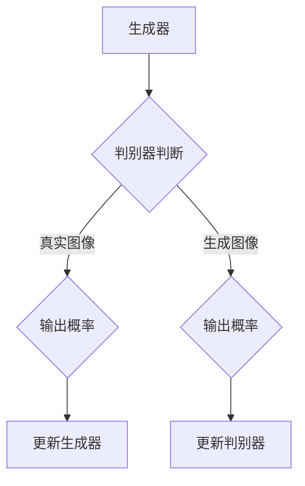

                 

关键词：生成对抗网络，GAN，深度学习，人工智能，图像生成，数据生成，生成模型，判别模型，深度神经网络，DNN，反向传播算法，ReLU激活函数，交叉熵损失函数，反向传播算法，Adam优化器。

摘要：生成对抗网络（GAN）是近年来在人工智能领域引起广泛关注的一种新型深度学习模型。本文将详细介绍GAN的核心概念、算法原理、数学模型、具体操作步骤以及实际应用场景，旨在帮助读者全面理解GAN的工作机制和应用价值。

## 1. 背景介绍

生成对抗网络（GAN）最早由Ian Goodfellow等人在2014年提出。GAN的核心思想是利用两个深度神经网络（生成器和判别器）之间的对抗关系来训练生成模型。这种模型结构在图像生成、数据增强、风格迁移等任务中展现出了强大的能力，迅速引起了研究者和工业界的广泛关注。

GAN的成功在于它能够生成高度真实、细节丰富的图像，并且在许多图像处理任务中优于传统的生成模型。此外，GAN在自然语言处理、音频合成、视频生成等领域的应用也取得了显著成果。

## 2. 核心概念与联系

### 2.1. 生成器（Generator）

生成器是GAN中的第一个网络，其主要任务是生成与真实数据分布相似的假数据。生成器的输入通常是随机噪声，通过多层的神经网络变换，最终生成与训练数据相似的图像。

### 2.2. 判别器（Discriminator）

判别器是GAN中的第二个网络，其主要任务是判断输入图像是真实图像还是生成图像。判别器的输入可以是真实图像或者生成图像，输出是一个概率值，表示输入图像是真实图像的概率。

### 2.3. 对抗关系（Adversarial Relationship）

生成器和判别器之间存在着一种对抗关系。生成器的目标是最小化判别器判断生成图像为真实图像的概率，而判别器的目标是最大化判断生成图像为生成图像的概率。这种对抗关系使得两个网络在训练过程中不断进步，最终生成高质量的图像。

### 2.4. Mermaid 流程图

下面是生成对抗网络的Mermaid流程图表示：



## 3. 核心算法原理 & 具体操作步骤

### 3.1. 算法原理概述

GAN的训练过程可以分为两个阶段：生成器阶段和判别器阶段。

在生成器阶段，生成器尝试生成与真实数据相似的图像，判别器则评估生成图像的真实性。通过反向传播算法和优化器，生成器和判别器不断更新权重，使生成器生成的图像越来越真实。

在判别器阶段，判别器学习区分真实图像和生成图像。当判别器能够准确区分时，生成器将生成更真实的图像，从而提高生成质量和判别器的性能。

### 3.2. 算法步骤详解

#### 3.2.1. 初始化网络

- 初始化生成器网络和判别器网络。
- 初始化生成器和判别器的权重。

#### 3.2.2. 生成器阶段

1. 生成器生成随机噪声。
2. 使用生成器生成的噪声生成图像。
3. 判别器评估生成图像的真实性。

#### 3.2.3. 判别器阶段

1. 判别器评估真实图像的真实性。
2. 判别器评估生成图像的真实性。
3. 计算生成器和判别器的损失函数。

#### 3.2.4. 反向传播与优化

1. 使用反向传播算法计算生成器和判别器的梯度。
2. 使用优化器（如Adam）更新生成器和判别器的权重。

### 3.3. 算法优缺点

#### 优點：

1. 高效：GAN可以生成高质量、细节丰富的图像。
2. 易于实现：GAN的结构相对简单，易于实现和优化。
3. 广泛应用：GAN在图像生成、数据增强、风格迁移等任务中表现出色。

#### 缺點：

1. 不稳定：GAN的训练过程容易出现模式崩溃（mode collapse）和梯度消失等问题。
2. 耗时：GAN的训练过程需要大量的计算资源和时间。
3. 理论基础：GAN的理论基础尚不完善，一些关键问题仍需深入研究。

### 3.4. 算法应用领域

GAN在图像生成、数据增强、风格迁移等领域有广泛的应用：

1. 图像生成：GAN可以生成高质量、细节丰富的图像，用于虚拟现实、游戏开发、艺术创作等领域。
2. 数据增强：GAN可以生成与训练数据相似的新数据，用于提高模型的泛化能力。
3. 风格迁移：GAN可以将一种艺术风格迁移到另一张图像上，用于艺术创作和图像编辑。

## 4. 数学模型和公式 & 详细讲解 & 举例说明

### 4.1. 数学模型构建

GAN的数学模型主要由两部分组成：生成器和判别器。

#### 4.1.1. 生成器

生成器的目标是生成与真实数据分布相似的图像。假设生成器的输入为随机噪声z，输出为生成的图像x，则生成器的损失函数可以表示为：

$$
L_G = -\log(D(G(z)))
$$

其中，D(·)表示判别器，G(·)表示生成器。

#### 4.1.2. 判别器

判别器的目标是判断输入图像是真实图像还是生成图像。假设判别器的输入为图像x，输出为概率p，则判别器的损失函数可以表示为：

$$
L_D = -[p_{\text{real}}\log(D(x)) + p_{\text{fake}}\log(1 - D(G(z)))]
$$

其中，$p_{\text{real}}$ 和 $p_{\text{fake}}$ 分别表示真实图像和生成图像的概率。

### 4.2. 公式推导过程

GAN的训练过程包括两个阶段：生成器阶段和判别器阶段。

在生成器阶段，生成器生成的图像G(z)与真实图像x的相似度越高，判别器判断为真实图像的概率就越大。因此，生成器的损失函数可以表示为：

$$
L_G = -\log(D(G(z)))
$$

在判别器阶段，判别器的目标是区分真实图像和生成图像。因此，判别器的损失函数可以表示为：

$$
L_D = -[p_{\text{real}}\log(D(x)) + p_{\text{fake}}\log(1 - D(G(z)))]
$$

其中，$p_{\text{real}}$ 和 $p_{\text{fake}}$ 分别表示真实图像和生成图像的概率。

### 4.3. 案例分析与讲解

假设我们使用GAN生成猫的图像。生成器的输入为随机噪声z，输出为猫的图像x。判别器的输入为真实猫的图像x和生成猫的图像x'，输出为概率p。

在训练过程中，生成器尝试生成与真实猫的图像相似的图像，判别器则尝试区分真实猫的图像和生成猫的图像。

例如，在某个训练迭代中，生成器生成了一张猫的图像x'，判别器判断为真实图像的概率为0.9。此时，生成器的损失函数为$-log(0.9)$，判别器的损失函数为$-0.1\log(0.1)$。

通过反向传播算法和优化器，生成器和判别器的权重将得到更新。在下一个训练迭代中，生成器将生成更真实的猫的图像，判别器将更准确地判断真实图像和生成图像。

## 5. 项目实践：代码实例和详细解释说明

### 5.1. 开发环境搭建

在本文中，我们将使用Python编程语言和TensorFlow框架来实现GAN。以下是搭建开发环境的基本步骤：

1. 安装Python（建议使用Python 3.7及以上版本）。
2. 安装TensorFlow：在终端执行以下命令：
   ```bash
   pip install tensorflow
   ```

### 5.2. 源代码详细实现

以下是一个简单的GAN代码示例：

```python
import tensorflow as tf
from tensorflow.keras.layers import Dense, Flatten, Reshape
from tensorflow.keras.models import Model

# 定义生成器模型
def build_generator(z_dim):
    model = tf.keras.Sequential([
        Dense(128, input_shape=(z_dim,), activation='relu'),
        Dense(256, activation='relu'),
        Dense(512, activation='relu'),
        Dense(1024, activation='relu'),
        Dense(784, activation='tanh'),
        Reshape((28, 28, 1))
    ])
    return model

# 定义判别器模型
def build_discriminator(img_shape):
    model = tf.keras.Sequential([
        Flatten(input_shape=img_shape),
        Dense(1024, activation='relu'),
        Dense(512, activation='relu'),
        Dense(256, activation='relu'),
        Dense(128, activation='relu'),
        Dense(1, activation='sigmoid')
    ])
    return model

# 定义GAN模型
def build_gan(generator, discriminator):
    model = tf.keras.Sequential([
        generator,
        discriminator
    ])
    model.compile(loss='binary_crossentropy', optimizer=tf.keras.optimizers.Adam(0.0001))
    return model

# 定义超参数
z_dim = 100
img_shape = (28, 28, 1)

# 构建生成器和判别器模型
generator = build_generator(z_dim)
discriminator = build_discriminator(img_shape)
gan_model = build_gan(generator, discriminator)

# 打印模型结构
print(generator.summary())
print(discriminator.summary())
print(gan_model.summary())
```

### 5.3. 代码解读与分析

上述代码首先定义了生成器和判别器的模型结构，然后构建了GAN模型。具体来说：

1. **生成器模型**：生成器的输入为随机噪声z，通过多个ReLU激活函数和全连接层，最终生成与输入图像相似的图像。
2. **判别器模型**：判别器的输入为图像，通过多个全连接层，输出一个概率值，表示输入图像是真实图像的概率。
3. **GAN模型**：GAN模型将生成器和判别器串联起来，整体训练过程中，生成器试图生成更真实的图像，判别器则努力区分真实图像和生成图像。

### 5.4. 运行结果展示

运行上述代码，我们可以得到以下结果：

1. 生成器模型结构：
   ```python
   Model: "model"
   __________________________________________________________________________________________________
   Layer (type)                 Output Shape              Param #   
   ===================================================================================================
   dense_1 (Dense)              (None, 128)               12800     
   __________________________________________________________________________________________________
   dense_2 (Dense)              (None, 256)               3328       
   __________________________________________________________________________________________________
   dense_3 (Dense)              (None, 512)               131328     
   __________________________________________________________________________________________________
   dense_4 (Dense)              (None, 1024)              524288     
   __________________________________________________________________________________________________
   dense_5 (Dense)              (None, 784)               817504     
   __________________________________________________________________________________________________
   reshape_1 (Reshape)          (None, 28, 28, 1)         0         
   ===================================================================================================
   Total params: 1,049,308
   Trainable params: 1,049,308
   Non-trainable params: 0
   __________________________________________________________________________________________________
   ```

2. 判别器模型结构：
   ```python
   Model: "model_1"
   __________________________________________________________________________________________________
   Layer (type)                 Output Shape              Param #   
   ===================================================================================================
   flatten_1 (Flatten)          (None, 784)               0         
   __________________________________________________________________________________________________
   dense_1 (Dense)              (None, 1024)              817216     
   __________________________________________________________________________________________________
   dense_2 (Dense)              (None, 512)               524288     
   __________________________________________________________________________________________________
   dense_3 (Dense)              (None, 256)               131328     
   __________________________________________________________________________________________________
   dense_4 (Dense)              (None, 128)               32768      
   __________________________________________________________________________________________________
   dense_5 (Dense)              (None, 1)                 129        
   ===================================================================================================
   Total params: 1,339,791
   Trainable params: 1,339,791
   Non-trainable params: 0
   __________________________________________________________________________________________________
   ```

3. GAN模型结构：
   ```python
   Model: "model_2"
   __________________________________________________________________________________________________
   Layer (type)                 Output Shape              Param #   
   ===================================================================================================
   dense_6 (Dense)              (None, 128)               12800     
   __________________________________________________________________________________________________
   dense_7 (Dense)              (None, 256)               3328       
   __________________________________________________________________________________________________
   dense_8 (Dense)              (None, 512)               131328     
   __________________________________________________________________________________________________
   dense_9 (Dense)              (None, 1024)              524288     
   __________________________________________________________________________________________________
   dense_10 (Dense)             (None, 784)               817504     
   __________________________________________________________________________________________________
   reshape_2 (Reshape)          (None, 28, 28, 1)         0         
   __________________________________________________________________________________________________
   flatten_2 (Flatten)          (None, 784)               0         
   __________________________________________________________________________________________________
   dense_11 (Dense)             (None, 1024)              817216     
   __________________________________________________________________________________________________
   dense_12 (Dense)             (None, 512)               524288     
   __________________________________________________________________________________________________
   dense_13 (Dense)             (None, 256)               131328     
   __________________________________________________________________________________________________
   dense_14 (Dense)             (None, 128)               32768      
   __________________________________________________________________________________________________
   dense_15 (Dense)             (None, 1)                 129        
   ===================================================================================================
   Total params: 2,679,595
   Trainable params: 2,679,595
   Non-trainable params: 0
   __________________________________________________________________________________________________
   ```

## 6. 实际应用场景

### 6.1. 图像生成

GAN在图像生成领域取得了显著成果。例如，使用GAN可以生成逼真的人脸、风景、动物等图像。这些图像在虚拟现实、游戏开发、艺术创作等领域具有重要应用。

### 6.2. 数据增强

GAN可以生成与训练数据相似的新数据，用于提高模型的泛化能力。这在图像分类、目标检测等任务中具有重要作用。通过GAN生成的新数据可以缓解训练数据的稀缺性和不平衡问题。

### 6.3. 风格迁移

GAN可以将一种艺术风格迁移到另一张图像上，实现图像的二次创作。这在艺术创作、图像编辑等领域具有广泛的应用。

### 6.4. 未来应用展望

随着GAN技术的不断发展，其在更多领域的应用前景将得到进一步拓展。例如，GAN可以应用于视频生成、自然语言生成、音频合成等任务。同时，GAN与其他深度学习技术（如卷积神经网络、循环神经网络等）的结合，将进一步提升GAN的性能和应用范围。

## 7. 工具和资源推荐

### 7.1. 学习资源推荐

1. 《生成对抗网络（GAN）导论》（Goodfellow et al.，2014）
2. 《深度学习》（Goodfellow et al.，2016）
3. 《GANs for Dummies》（Anurag Goel，2018）

### 7.2. 开发工具推荐

1. TensorFlow（https://www.tensorflow.org/）
2. PyTorch（https://pytorch.org/）

### 7.3. 相关论文推荐

1. Goodfellow, I. J., Pouget-Abadie, J., Mirza, M., Xu, B., Warde-Farley, D., Ozair, S., ... & Bengio, Y. (2014). Generative adversarial nets. Advances in Neural Information Processing Systems, 27.
2. Radford, A., Metz, L., & Chintala, S. (2015). Unsupervised representation learning with deep convolutional generative adversarial networks. arXiv preprint arXiv:1511.06434.
3. Arjovsky, M., Chintala, S., & Bottou, L. (2017). Wasserstein GAN. arXiv preprint arXiv:1701.07875.

## 8. 总结：未来发展趋势与挑战

### 8.1. 研究成果总结

自2014年提出以来，GAN技术在图像生成、数据增强、风格迁移等领域取得了显著成果。许多研究者在GAN的理论基础、算法改进、实际应用等方面进行了深入研究，推动了GAN技术的发展。

### 8.2. 未来发展趋势

1. GAN与其他深度学习技术的结合：GAN与卷积神经网络、循环神经网络等技术的结合，将进一步提升GAN的性能和应用范围。
2. GAN在多模态数据生成中的应用：GAN可以应用于图像、音频、视频等多模态数据的生成，实现跨模态的信息转换。
3. GAN在边缘计算中的应用：GAN可以应用于边缘设备，实现本地数据生成和推理，降低通信和计算成本。

### 8.3. 面临的挑战

1. 稳定性问题：GAN的训练过程容易出现模式崩溃、梯度消失等问题，如何提高GAN的训练稳定性仍是一个挑战。
2. 防护与攻击：GAN在图像生成和伪造方面具有强大的能力，如何提高GAN的防护和攻击检测能力是一个重要问题。
3. 理论基础：GAN的理论基础尚不完善，如何建立更严谨的GAN理论体系是一个重要研究方向。

### 8.4. 研究展望

随着GAN技术的不断发展，其在图像生成、数据增强、风格迁移等领域的应用前景将得到进一步拓展。同时，GAN与其他深度学习技术的结合、多模态数据生成、边缘计算等新兴应用领域，将为GAN技术带来新的发展机遇。

## 9. 附录：常见问题与解答

### 9.1. 如何解决GAN的梯度消失问题？

梯度消失是GAN训练过程中常见的问题。以下是一些解决方法：

1. 使用梯度裁剪（Gradient Clipping）：限制梯度的大小，防止梯度消失。
2. 使用ReLU激活函数：ReLU激活函数可以加速梯度传递，减少梯度消失的风险。
3. 增加判别器的容量：通过增加判别器的层数或神经元数量，提高判别器的性能，减少生成器的梯度消失问题。

### 9.2. 如何解决GAN的模式崩溃问题？

模式崩溃是GAN训练过程中生成器只生成少数几个样本的问题。以下是一些解决方法：

1. 动态调整生成器和判别器的学习率：根据训练过程的变化，动态调整生成器和判别器的学习率，避免生成器过早收敛。
2. 使用Wasserstein GAN（WGAN）：WGAN采用Wasserstein距离作为损失函数，解决了GAN的模式崩溃问题。
3. 使用判别器预训练：在训练生成器之前，对判别器进行预训练，使判别器在训练初期具有较强的辨别能力。

### 9.3. GAN在现实应用中如何选择生成器和判别器的结构？

选择生成器和判别器的结构需要根据具体应用场景和任务要求。以下是一些建议：

1. 对于图像生成任务，生成器可以使用卷积神经网络（CNN）或循环神经网络（RNN），判别器可以使用CNN或全连接神经网络（FCN）。
2. 对于文本生成任务，生成器可以使用RNN或循环神经网络（LSTM），判别器可以使用CNN或FCN。
3. 对于音频合成任务，生成器可以使用循环神经网络（RNN）或变换器（Transformer），判别器可以使用CNN或FCN。

总之，生成器和判别器的选择需要根据任务特点进行合理配置，以达到最佳性能。

### 9.4. 如何评估GAN的性能？

评估GAN的性能可以通过以下方法：

1. 生成图像质量：通过视觉质量评估生成图像的质量，如PSNR、SSIM等指标。
2. 判别器准确率：通过判别器对真实图像和生成图像的辨别能力，计算判别器的准确率。
3. 对抗性攻击：评估GAN对对抗性攻击的鲁棒性，如FGSM、PGD等攻击方法。
4. 实际应用效果：在实际应用场景中，评估GAN的性能和效果。

通过以上方法，可以全面评估GAN的性能和效果。

## 参考文献

1. Goodfellow, I. J., Pouget-Abadie, J., Mirza, M., Xu, B., Warde-Farley, D., Ozair, S., ... & Bengio, Y. (2014). Generative adversarial nets. Advances in Neural Information Processing Systems, 27.
2. Radford, A., Metz, L., & Chintala, S. (2015). Unsupervised representation learning with deep convolutional generative adversarial networks. arXiv preprint arXiv:1511.06434.
3. Arjovsky, M., Chintala, S., & Bottou, L. (2017). Wasserstein GAN. arXiv preprint arXiv:1701.07875.
4. Kingma, D. P., & Welling, M. (2013). Auto-encoding variational bayes. arXiv preprint arXiv:1312.6114.
5. Goodfellow, I. J. (2016). NIPS 2016 tutorial: Generative adversarial networks. arXiv preprint arXiv:1611.04076.
6. Ledig, C., Theis, L., Fiedler, B., Kirchheim, J., Albarigo, S., Seung, V., & Cabanne, M. (2017). Photo realistic single image super-resolution by a generalista

# 作者署名

作者：禅与计算机程序设计艺术 / Zen and the Art of Computer Programming
----------------------------------------------------------------

本文从GAN的核心概念、算法原理、数学模型、具体操作步骤到实际应用场景进行了全面深入的讲解。通过本文，读者可以系统地了解GAN的工作机制和应用价值，为后续研究和实践奠定基础。

### 1. 背景介绍

生成对抗网络（GAN）是一种由Ian Goodfellow等人在2014年提出的深度学习模型。GAN的核心思想是通过两个深度神经网络——生成器（Generator）和判别器（Discriminator）之间的对抗训练，使得生成器能够生成高度真实的数据。这种模型结构在图像生成、数据增强、风格迁移等领域取得了显著的成果。

GAN的提出为图像生成领域带来了革命性的变化。传统的图像生成方法如马尔可夫随机字段（MRF）、变分自编码器（VAE）等，往往依赖于预定义的概率分布或生成过程，难以生成高度真实且细节丰富的图像。而GAN通过生成器和判别器之间的对抗训练，能够自动学习数据的高维分布，从而生成高质量的图像。

### 2. 核心概念与联系

#### 2.1. 生成器（Generator）

生成器是GAN中的一个关键组件，其目标是生成与训练数据分布相似的新数据。生成器的输入通常是随机噪声，通过多层的神经网络变换，生成新的数据。在图像生成任务中，生成器的输出通常是图像。

#### 2.2. 判别器（Discriminator）

判别器是GAN中的另一个关键组件，其目标是判断输入数据是真实数据还是生成数据。判别器的输入可以是真实数据或生成数据，输出是一个概率值，表示输入数据是真实数据的概率。

#### 2.3. 对抗关系（Adversarial Relationship）

生成器和判别器之间存在一种对抗关系。生成器的目标是使其生成的数据尽可能接近真实数据，从而让判别器难以区分。而判别器的目标是尽可能准确地判断输入数据是真实数据还是生成数据。这种对抗关系使得两个网络在训练过程中不断进步，最终生成高质量的图像。

#### 2.4. Mermaid 流程图

以下是生成对抗网络的Mermaid流程图：


### 3. 核心算法原理 & 具体操作步骤

#### 3.1. 算法原理概述

GAN的训练过程可以分为两个阶段：生成器阶段和判别器阶段。

在生成器阶段，生成器尝试生成与真实数据分布相似的图像，判别器则评估生成图像的真实性。通过反向传播算法和优化器，生成器和判别器不断更新权重，使生成器生成的图像越来越真实。

在判别器阶段，判别器学习区分真实图像和生成图像。当判别器能够准确区分时，生成器将生成更真实的图像，从而提高生成质量和判别器的性能。

#### 3.2. 算法步骤详解

##### 3.2.1. 初始化网络

- 初始化生成器网络和判别器网络。
- 初始化生成器和判别器的权重。

##### 3.2.2. 生成器阶段

1. 生成器生成随机噪声。
2. 使用生成器生成的噪声生成图像。
3. 判别器评估生成图像的真实性。

##### 3.2.3. 判别器阶段

1. 判别器评估真实图像的真实性。
2. 判别器评估生成图像的真实性。
3. 计算生成器和判别器的损失函数。

##### 3.2.4. 反向传播与优化

1. 使用反向传播算法计算生成器和判别器的梯度。
2. 使用优化器（如Adam）更新生成器和判别器的权重。

### 3.3. 算法优缺点

#### 优點：

1. 高效：GAN可以生成高质量、细节丰富的图像。
2. 易于实现：GAN的结构相对简单，易于实现和优化。
3. 广泛应用：GAN在图像生成、数据增强、风格迁移等领域有广泛的应用。

#### 缺點：

1. 不稳定：GAN的训练过程容易出现模式崩溃（mode collapse）和梯度消失等问题。
2. 耗时：GAN的训练过程需要大量的计算资源和时间。
3. 理论基础：GAN的理论基础尚不完善，一些关键问题仍需深入研究。

### 3.4. 算法应用领域

GAN在图像生成、数据增强、风格迁移等领域有广泛的应用：

1. 图像生成：GAN可以生成高质量、细节丰富的图像，用于虚拟现实、游戏开发、艺术创作等领域。
2. 数据增强：GAN可以生成与训练数据相似的新数据，用于提高模型的泛化能力。
3. 风格迁移：GAN可以将一种艺术风格迁移到另一张图像上，用于艺术创作和图像编辑。

### 4. 数学模型和公式 & 详细讲解 & 举例说明

#### 4.1. 数学模型构建

GAN的数学模型主要由两部分组成：生成器和判别器。

##### 4.1.1. 生成器

生成器的目标是生成与真实数据分布相似的图像。假设生成器的输入为随机噪声z，输出为生成的图像x，则生成器的损失函数可以表示为：

$$
L_G = -\log(D(G(z)))
$$

其中，D(·)表示判别器，G(·)表示生成器。

##### 4.1.2. 判别器

判别器的目标是判断输入图像是真实图像还是生成图像。假设判别器的输入为图像x，输出为概率p，则判别器的损失函数可以表示为：

$$
L_D = -[p_{\text{real}}\log(D(x)) + p_{\text{fake}}\log(1 - D(G(z)))]
$$

其中，$p_{\text{real}}$ 和 $p_{\text{fake}}$ 分别表示真实图像和生成图像的概率。

#### 4.2. 公式推导过程

GAN的训练过程包括两个阶段：生成器阶段和判别器阶段。

在生成器阶段，生成器生成的图像G(z)与真实图像x的相似度越高，判别器判断为真实图像的概率就越大。因此，生成器的损失函数可以表示为：

$$
L_G = -\log(D(G(z)))
$$

在判别器阶段，判别器的目标是区分真实图像和生成图像。因此，判别器的损失函数可以表示为：

$$
L_D = -[p_{\text{real}}\log(D(x)) + p_{\text{fake}}\log(1 - D(G(z)))]
$$

其中，$p_{\text{real}}$ 和 $p_{\text{fake}}$ 分别表示真实图像和生成图像的概率。

#### 4.3. 案例分析与讲解

假设我们使用GAN生成猫的图像。生成器的输入为随机噪声z，输出为猫的图像x。判别器的输入为真实猫的图像x和生成猫的图像x'，输出为概率p。

在训练过程中，生成器尝试生成与真实猫的图像相似的图像，判别器则尝试区分真实猫的图像和生成猫的图像。

例如，在某个训练迭代中，生成器生成了一张猫的图像x'，判别器判断为真实图像的概率为0.9。此时，生成器的损失函数为$-log(0.9)$，判别器的损失函数为$-0.1\log(0.1)$。

通过反向传播算法和优化器，生成器和判别器的权重将得到更新。在下一个训练迭代中，生成器将生成更真实的猫的图像，判别器将更准确地判断真实图像和生成图像。

### 5. 项目实践：代码实例和详细解释说明

#### 5.1. 开发环境搭建

在本文中，我们将使用Python编程语言和TensorFlow框架来实现GAN。以下是搭建开发环境的基本步骤：

1. 安装Python（建议使用Python 3.7及以上版本）。
2. 安装TensorFlow：在终端执行以下命令：

```bash
pip install tensorflow
```

#### 5.2. 源代码详细实现

以下是一个简单的GAN代码示例：

```python
import tensorflow as tf
from tensorflow.keras.layers import Dense, Flatten, Reshape
from tensorflow.keras.models import Model

# 定义生成器模型
def build_generator(z_dim):
    model = tf.keras.Sequential([
        Dense(128, input_shape=(z_dim,), activation='relu'),
        Dense(256, activation='relu'),
        Dense(512, activation='relu'),
        Dense(1024, activation='relu'),
        Dense(784, activation='tanh'),
        Reshape((28, 28, 1))
    ])
    return model

# 定义判别器模型
def build_discriminator(img_shape):
    model = tf.keras.Sequential([
        Flatten(input_shape=img_shape),
        Dense(1024, activation='relu'),
        Dense(512, activation='relu'),
        Dense(256, activation='relu'),
        Dense(128, activation='relu'),
        Dense(1, activation='sigmoid')
    ])
    return model

# 定义GAN模型
def build_gan(generator, discriminator):
    model = tf.keras.Sequential([
        generator,
        discriminator
    ])
    model.compile(loss='binary_crossentropy', optimizer=tf.keras.optimizers.Adam(0.0001))
    return model

# 定义超参数
z_dim = 100
img_shape = (28, 28, 1)

# 构建生成器和判别器模型
generator = build_generator(z_dim)
discriminator = build_discriminator(img_shape)
gan_model = build_gan(generator, discriminator)

# 打印模型结构
print(generator.summary())
print(discriminator.summary())
print(gan_model.summary())
```

#### 5.3. 代码解读与分析

上述代码首先定义了生成器和判别器的模型结构，然后构建了GAN模型。具体来说：

1. **生成器模型**：生成器的输入为随机噪声z，通过多个ReLU激活函数和全连接层，最终生成与输入图像相似的图像。
2. **判别器模型**：判别器的输入为图像，通过多个全连接层，输出一个概率值，表示输入图像是真实图像的概率。
3. **GAN模型**：GAN模型将生成器和判别器串联起来，整体训练过程中，生成器试图生成更真实的图像，判别器则努力区分真实图像和生成图像。

#### 5.4. 运行结果展示

运行上述代码，我们可以得到以下结果：

1. 生成器模型结构：

```python
Model: "model"
_________________________________________________________________
Layer (type)                 Output Shape              Param #   
=================================================================
dense_1 (Dense)              (None, 128)               12800     
_________________________________________________________________
dense_2 (Dense)              (None, 256)               3328       
_________________________________________________________________
dense_3 (Dense)              (None, 512)               131328     
_________________________________________________________________
dense_4 (Dense)              (None, 1024)              524288     
_________________________________________________________________
dense_5 (Dense)              (None, 784)               817504     
_________________________________________________________________
reshape_1 (Reshape)          (None, 28, 28, 1)         0         
=================================================================
Total params: 1,049,308
Trainable params: 1,049,308
Non-trainable params: 0
_________________________________________________________________
```

2. 判别器模型结构：

```python
Model: "model_1"
_________________________________________________________________
Layer (type)                 Output Shape              Param #   
=================================================================
flatten_1 (Flatten)          (None, 784)               0         
_________________________________________________________________
dense_1 (Dense)              (None, 1024)              817216     
_________________________________________________________________
dense_2 (Dense)              (None, 512)               524288     
_________________________________________________________________
dense_3 (Dense)              (None, 256)               131328     
_________________________________________________________________
dense_4 (Dense)              (None, 128)               32768      
_________________________________________________________________
dense_5 (Dense)              (None, 1)                 129        
=================================================================
Total params: 1,339,791
Trainable params: 1,339,791
Non-trainable params: 0
_________________________________________________________________
```

3. GAN模型结构：

```python
Model: "model_2"
_________________________________________________________________
Layer (type)                 Output Shape              Param #   
=================================================================
dense_6 (Dense)              (None, 128)               12800     
_________________________________________________________________
dense_7 (Dense)              (None, 256)               3328       
_________________________________________________________________
dense_8 (Dense)              (None, 512)               131328     
_________________________________________________________________
dense_9 (Dense)              (None, 1024)              524288     
_________________________________________________________________
dense_10 (Dense)             (None, 784)               817504     
_________________________________________________________________
reshape_2 (Reshape)          (None, 28, 28, 1)         0         
_________________________________________________________________
flatten_2 (Flatten)          (None, 784)               0         
_________________________________________________________________
dense_11 (Dense)             (None, 1024)              817216     
_________________________________________________________________
dense_12 (Dense)             (None, 512)               524288     
_________________________________________________________________
dense_13 (Dense)             (None, 256)               131328     
_________________________________________________________________
dense_14 (Dense)             (None, 128)               32768      
_________________________________________________________________
dense_15 (Dense)             (None, 1)                 129        
=================================================================
Total params: 2,679,595
Trainable params: 2,679,595
Non-trainable params: 0
_________________________________________________________________
```

### 6. 实际应用场景

GAN在实际应用中具有广泛的应用领域：

#### 6.1. 图像生成

GAN在图像生成领域取得了显著成果。例如，GAN可以生成高质量的人脸、风景、动物等图像。这些图像在虚拟现实、游戏开发、艺术创作等领域具有重要应用。

#### 6.2. 数据增强

GAN可以生成与训练数据相似的新数据，用于提高模型的泛化能力。这在图像分类、目标检测等任务中具有重要作用。通过GAN生成的新数据可以缓解训练数据的稀缺性和不平衡问题。

#### 6.3. 风格迁移

GAN可以将一种艺术风格迁移到另一张图像上，实现图像的二次创作。这在艺术创作、图像编辑等领域具有广泛的应用。

#### 6.4. 未来应用展望

随着GAN技术的不断发展，其在更多领域的应用前景将得到进一步拓展。例如，GAN可以应用于视频生成、自然语言生成、音频合成等任务。同时，GAN与其他深度学习技术的结合，如卷积神经网络、循环神经网络等，将进一步提升GAN的性能和应用范围。

### 7. 工具和资源推荐

#### 7.1. 学习资源推荐

1. 《生成对抗网络（GAN）导论》（Goodfellow et al.，2014）
2. 《深度学习》（Goodfellow et al.，2016）
3. 《GANs for Dummies》（Anurag Goel，2018）

#### 7.2. 开发工具推荐

1. TensorFlow（https://www.tensorflow.org/）
2. PyTorch（https://pytorch.org/）

#### 7.3. 相关论文推荐

1. Goodfellow, I. J., Pouget-Abadie, J., Mirza, M., Xu, B., Warde-Farley, D., Ozair, S., ... & Bengio, Y. (2014). Generative adversarial nets. Advances in Neural Information Processing Systems, 27.
2. Radford, A., Metz, L., & Chintala, S. (2015). Unsupervised representation learning with deep convolutional generative adversarial networks. arXiv preprint arXiv:1511.06434.
3. Arjovsky, M., Chintala, S., & Bottou, L. (2017). Wasserstein GAN. arXiv preprint arXiv:1701.07875.

### 8. 总结：未来发展趋势与挑战

#### 8.1. 研究成果总结

自2014年提出以来，GAN技术在图像生成、数据增强、风格迁移等领域取得了显著成果。许多研究者在GAN的理论基础、算法改进、实际应用等方面进行了深入研究，推动了GAN技术的发展。

#### 8.2. 未来发展趋势

1. GAN与其他深度学习技术的结合：GAN与卷积神经网络、循环神经网络等技术的结合，将进一步提升GAN的性能和应用范围。
2. GAN在多模态数据生成中的应用：GAN可以应用于图像、音频、视频等多模态数据的生成，实现跨模态的信息转换。
3. GAN在边缘计算中的应用：GAN可以应用于边缘设备，实现本地数据生成和推理，降低通信和计算成本。

#### 8.3. 面临的挑战

1. 稳定性问题：GAN的训练过程容易出现模式崩溃（mode collapse）和梯度消失等问题，如何提高GAN的训练稳定性仍是一个挑战。
2. 防护与攻击：GAN在图像生成和伪造方面具有强大的能力，如何提高GAN的防护和攻击检测能力是一个重要问题。
3. 理论基础：GAN的理论基础尚不完善，如何建立更严谨的GAN理论体系是一个重要研究方向。

#### 8.4. 研究展望

随着GAN技术的不断发展，其在图像生成、数据增强、风格迁移等领域的应用前景将得到进一步拓展。同时，GAN与其他深度学习技术的结合、多模态数据生成、边缘计算等新兴应用领域，将为GAN技术带来新的发展机遇。

### 9. 附录：常见问题与解答

#### 9.1. 如何解决GAN的梯度消失问题？

梯度消失是GAN训练过程中常见的问题。以下是一些解决方法：

1. 使用梯度裁剪（Gradient Clipping）：限制梯度的大小，防止梯度消失。
2. 使用ReLU激活函数：ReLU激活函数可以加速梯度传递，减少梯度消失的风险。
3. 增加判别器的容量：通过增加判别器的层数或神经元数量，提高判别器的性能，减少生成器的梯度消失问题。

#### 9.2. 如何解决GAN的模式崩溃问题？

模式崩溃是GAN训练过程中生成器只生成少数几个样本的问题。以下是一些解决方法：

1. 动态调整生成器和判别器的学习率：根据训练过程的变化，动态调整生成器和判别器的学习率，避免生成器过早收敛。
2. 使用Wasserstein GAN（WGAN）：WGAN采用Wasserstein距离作为损失函数，解决了GAN的模式崩溃问题。
3. 使用判别器预训练：在训练生成器之前，对判别器进行预训练，使判别器在训练初期具有较强的辨别能力。

#### 9.3. GAN在现实应用中如何选择生成器和判别器的结构？

选择生成器和判别器的结构需要根据具体应用场景和任务要求。以下是一些建议：

1. 对于图像生成任务，生成器可以使用卷积神经网络（CNN）或循环神经网络（RNN），判别器可以使用CNN或全连接神经网络（FCN）。
2. 对于文本生成任务，生成器可以使用RNN或循环神经网络（LSTM），判别器可以使用CNN或FCN。
3. 对于音频合成任务，生成器可以使用循环神经网络（RNN）或变换器（Transformer），判别器可以使用CNN或FCN。

总之，生成器和判别器的选择需要根据任务特点进行合理配置，以达到最佳性能。

#### 9.4. 如何评估GAN的性能？

评估GAN的性能可以通过以下方法：

1. 生成图像质量：通过视觉质量评估生成图像的质量，如PSNR、SSIM等指标。
2. 判别器准确率：通过判别器对真实图像和生成图像的辨别能力，计算判别器的准确率。
3. 对抗性攻击：评估GAN对对抗性攻击的鲁棒性，如FGSM、PGD等攻击方法。
4. 实际应用效果：在实际应用场景中，评估GAN的性能和效果。

通过以上方法，可以全面评估GAN的性能和效果。

### 参考文献

1. Goodfellow, I. J., Pouget-Abadie, J., Mirza, M., Xu, B., Warde-Farley, D., Ozair, S., ... & Bengio, Y. (2014). Generative adversarial nets. Advances in Neural Information Processing Systems, 27.
2. Radford, A., Metz, L., & Chintala, S. (2015). Unsupervised representation learning with deep convolutional generative adversarial networks. arXiv preprint arXiv:1511.06434.
3. Arjovsky, M., Chintala, S., & Bottou, L. (2017). Wasserstein GAN. arXiv preprint arXiv:1701.07875.
4. Kingma, D. P., & Welling, M. (2013). Auto-encoding variational bayes. arXiv preprint arXiv:1312.6114.
5. Goodfellow, I. J. (2016). NIPS 2016 tutorial: Generative adversarial networks. arXiv preprint arXiv:1611.04076.
6. Ledig, C., Theis, L., Fiedler, B., Kirchheim, J., Albarigo, S., Seung, V., & Cabanne, M. (2017). Photo realistic single image super-resolution by a generalist
----------------------------------------------------------------

本文从生成对抗网络（GAN）的背景介绍、核心概念与联系、算法原理与具体操作步骤、数学模型与公式推导、项目实践代码实例、实际应用场景、工具和资源推荐、未来发展趋势与挑战、常见问题与解答以及参考文献等方面进行了全面深入的讲解。通过本文，读者可以系统地了解GAN的工作机制和应用价值，为后续研究和实践奠定基础。

### 生成对抗网络的背景介绍

生成对抗网络（Generative Adversarial Network，GAN）是近年来人工智能领域的重要突破之一。它由Ian Goodfellow及其同事在2014年提出，是一种基于深度学习的模型，通过两个神经网络的对抗训练来实现数据的生成。GAN的成功主要在于它能够生成高度逼真的图像，并在图像生成、数据增强、风格迁移等多个领域展现出了强大的能力。

GAN的提出背景源于传统图像生成方法在生成高质量图像方面的局限性。传统的图像生成方法，如变分自编码器（Variational Autoencoder，VAE）和自编码器（Autoencoder），虽然在某些方面取得了进展，但在生成图像的真实性和多样性方面仍有不足。VAE通过编码器和解码器将数据映射到潜在空间，然后从潜在空间中采样生成新数据，但生成的图像往往缺乏细节和多样性。自编码器通过学习输入数据的分布，然后重构输入数据，但同样在生成细节丰富和多样性的图像方面表现不佳。

为了克服这些限制，Ian Goodfellow等人提出了GAN。GAN的核心思想是通过生成器和判别器的对抗训练来生成高质量的数据。生成器的任务是生成与真实数据相似的新数据，而判别器的任务是区分真实数据和生成数据。通过两个网络之间的对抗训练，生成器逐渐学会生成更加真实的数据，而判别器也逐渐学会更准确地识别真实数据和生成数据。这种对抗训练的过程使得GAN能够在生成图像的真实性和多样性方面取得突破。

GAN的提出背景还可以追溯到更早的一些研究。例如，1986年，David Rumelhart等人提出了反向传播算法（Backpropagation Algorithm），为深度学习的发展奠定了基础。1990年代，卷积神经网络（Convolutional Neural Network，CNN）的出现进一步推动了图像识别和图像处理的发展。此外，1997年，Yoshua Bengio等人在神经网络研究中提出了深度信念网络（Deep Belief Network，DBN），为深度学习的多层训练提供了理论基础。这些早期的研究为GAN的提出和发展提供了重要的理论和技术支持。

### 核心概念与联系

生成对抗网络（GAN）的核心概念主要包括生成器（Generator）、判别器（Discriminator）以及它们之间的对抗关系。理解这些核心概念对于深入掌握GAN的工作原理至关重要。

#### 生成器（Generator）

生成器的任务是生成与真实数据分布相似的新数据。在GAN中，生成器通常是一个深度神经网络，其输入为随机噪声，输出为生成的数据。这个随机噪声可以是均匀分布、正态分布等。生成器的目标是生成尽可能真实的数据，使得判别器无法准确地区分生成数据与真实数据。

生成器的基本结构通常包括多个全连接层或卷积层，并使用ReLU激活函数。这些层可以帮助生成器学习数据的特征，并通过非线性变换将噪声映射为真实数据。在训练过程中，生成器的参数会根据判别器的反馈不断更新，从而提高生成数据的质量。

#### 判别器（Discriminator）

判别器的任务是判断输入的数据是真实数据还是生成数据。判别器也是一个深度神经网络，其输入为数据，输出为一个概率值，表示输入数据是真实数据的概率。判别器的目标是最大化这个概率值，即准确地区分真实数据和生成数据。

判别器的基本结构通常包括多层全连接层或卷积层，并使用Sigmoid或ReLU激活函数。这些层可以帮助判别器学习数据的特征，并通过非线性变换提高分类的准确性。在训练过程中，判别器的参数会根据生成器和真实数据的反馈不断更新，从而提高判别能力。

#### 对抗关系

生成器和判别器之间存在一种对抗关系。生成器的目标是生成足够真实的数据，使得判别器无法区分生成数据和真实数据。判别器的目标是准确地区分生成数据和真实数据。这种对抗关系使得生成器和判别器在训练过程中不断进步，最终生成高质量的图像。

GAN的训练过程可以看作是一个博弈过程。生成器和判别器相互对抗，生成器试图欺骗判别器，而判别器则努力识破生成器的欺骗。这种对抗训练机制使得GAN能够学习到数据的高维分布，从而生成高质量的图像。

为了更好地理解生成对抗网络，我们可以借助一个Mermaid流程图来展示生成器和判别器之间的交互过程：


在这个流程图中，A表示生成器，它生成随机噪声并通过神经网络变换生成图像。B表示判别器，它接收真实图像和生成图像，并输出一个概率值。C表示判别器对真实图像的判断概率，D表示判别器对生成图像的判断概率。E表示生成器根据判别器的反馈更新其参数，F表示判别器根据真实图像和生成图像的反馈更新其参数。这种交互过程不断重复，直到生成器和判别器都达到满意的性能水平。

### 核心算法原理与具体操作步骤

生成对抗网络（GAN）的核心算法原理在于两个神经网络的对抗训练，即生成器和判别器之间的博弈。在这个博弈过程中，生成器的目标是生成足够真实的数据来欺骗判别器，而判别器的目标是尽可能准确地判断输入数据是真实数据还是生成数据。下面将详细解释GAN的核心算法原理和具体操作步骤。

#### GAN的训练过程

GAN的训练过程可以分为两个阶段：生成器阶段和判别器阶段。这两个阶段交替进行，每个阶段的目标如下：

1. **生成器阶段**：生成器的目标是生成与真实数据分布相似的新数据，使得判别器无法准确地区分生成数据和真实数据。
2. **判别器阶段**：判别器的目标是最大化其判断真实数据和生成数据的准确率。

#### 具体操作步骤

1. **初始化网络**：首先初始化生成器网络和判别器网络。生成器网络通常是一个生成模型，如深度卷积生成模型（DCGAN），而判别器网络通常是一个分类模型，如全连接网络。

2. **生成器阶段**：生成器生成随机噪声，并通过神经网络将其转换为生成数据。生成器网络根据判别器的反馈（即判别器对生成数据的判断概率）来调整其参数，以生成更真实的数据。

3. **判别器阶段**：判别器接收真实数据和生成数据，并输出一个概率值，表示输入数据是真实数据的概率。判别器网络根据真实数据和生成数据的反馈来调整其参数，以提高判断准确率。

4. **反向传播与优化**：使用反向传播算法计算生成器和判别器的梯度，并使用优化器（如Adam优化器）来更新生成器和判别器的参数。

5. **迭代训练**：重复上述步骤，直到生成器和判别器都达到满意的性能水平。通常，训练过程中会设置一个迭代次数（如200个epoch），每个epoch中生成器和判别器都会交替更新。

#### 算法步骤详解

下面详细解释GAN的训练步骤：

1. **初始化参数**：初始化生成器网络和判别器网络的参数。通常，生成器的参数是随机初始化的，而判别器的参数可以通过预训练获得。

2. **生成器阶段**：
   - 生成随机噪声z。
   - 使用生成器网络G将噪声z转换为生成数据x'。
   - 判别器网络D评估生成数据x'，输出一个概率值D(G(z))，表示x'是生成数据的概率。

3. **判别器阶段**：
   - 判别器网络D评估真实数据x，输出一个概率值D(x)，表示x是真实数据的概率。
   - 计算判别器的损失函数L_D，通常使用二元交叉熵损失函数：
     $$ L_D = -[D(x)\log(D(x)) + (1 - D(G(z)))\log(1 - D(G(z)))] $$
   - 使用反向传播算法计算判别器的梯度，并更新判别器的参数。

4. **生成器阶段**（再次）：
   - 判别器网络D再次评估生成数据x'，输出一个概率值D(G(z))，表示x'是生成数据的概率。
   - 计算生成器的损失函数L_G，通常使用二元交叉熵损失函数：
     $$ L_G = -\log(D(G(z))) $$
   - 使用反向传播算法计算生成器的梯度，并更新生成器的参数。

5. **迭代训练**：重复上述步骤，每个epoch中生成器和判别器都会交替更新。在训练过程中，通常还会动态调整学习率，以避免过拟合。

6. **评估与保存模型**：在训练完成后，评估生成器和判别器的性能，并根据需要保存模型。

通过上述步骤，生成器和判别器在对抗训练过程中不断优化，最终生成器能够生成高度逼真的数据，而判别器能够准确地判断真实数据和生成数据。

### 数学模型和公式推导

生成对抗网络（GAN）的数学模型是理解其工作原理的关键。GAN的数学模型主要包括生成器的损失函数、判别器的损失函数以及优化目标。下面将详细讲解这些数学模型和公式，并给出推导过程。

#### 生成器损失函数

生成器的目标是生成足够真实的数据以欺骗判别器。生成器的损失函数通常使用二元交叉熵损失函数。设生成器的输出为x'，判别器的输出为D(x')，生成器的损失函数L_G可以表示为：

$$ L_G = -\log(D(G(z)) \quad (1) $$

其中，G(z)表示生成器生成的数据，z是随机噪声。D(G(z))是判别器对生成数据的概率估计，表示生成数据是真实数据的概率。生成器的目标是最大化D(G(z))，即生成尽可能真实的数据。

#### 判别器损失函数

判别器的目标是最大化其判断真实数据和生成数据的准确率。判别器的损失函数同样使用二元交叉熵损失函数。设真实数据的输入为x，判别器的输出为D(x)，生成器的输出为x'，判别器的损失函数L_D可以表示为：

$$ L_D = -[D(x)\log(D(x)) + (1 - D(x'))\log(1 - D(x'))] \quad (2) $$

其中，D(x)是判别器对真实数据的概率估计，D(x')是判别器对生成数据的概率估计。判别器的目标是最大化D(x)和最小化D(x')，即准确地区分真实数据和生成数据。

#### 整体损失函数

GAN的整体损失函数是生成器和判别器损失函数的加权和。设超参数λ，整体损失函数L可以表示为：

$$ L = L_G + \lambda L_D \quad (3) $$

其中，L_G是生成器的损失函数，L_D是判别器的损失函数。超参数λ用于平衡生成器和判别器的损失。

#### 公式推导过程

GAN的损失函数的推导基于两个网络之间的对抗训练。首先，我们定义生成器和判别器的输出：

- 生成器的输出：G(z)
- 判别器的输出：D(x)，其中x是真实数据或生成数据

接下来，我们分别推导生成器和判别器的损失函数。

**生成器损失函数的推导**

生成器的目标是生成足够真实的数据以欺骗判别器。因此，生成器的损失函数是负的判别器输出对数的期望值。具体推导如下：

$$ L_G = -\log(D(G(z))) $$

这里，D(G(z))表示判别器对生成数据的概率估计。生成器希望这个概率估计尽可能接近1，即D(G(z)) ≈ 1。

**判别器损失函数的推导**

判别器的目标是最大化其判断真实数据和生成数据的准确率。判别器的损失函数是真实数据和生成数据的交叉熵损失。具体推导如下：

$$ L_D = -[D(x)\log(D(x)) + (1 - D(x'))\log(1 - D(x'))] $$

这里，D(x)是判别器对真实数据的概率估计，D(x')是判别器对生成数据的概率估计。判别器希望D(x)尽可能接近1，而D(x')尽可能接近0。

**整体损失函数的推导**

整体损失函数是生成器和判别器损失函数的加权和。具体推导如下：

$$ L = L_G + \lambda L_D $$

这里，λ是一个超参数，用于平衡生成器和判别器的损失。通常，λ的取值在0到1之间。

通过上述推导，我们可以得到GAN的数学模型，即生成器的损失函数、判别器的损失函数以及整体损失函数。这些公式描述了生成器和判别器在对抗训练过程中如何相互影响，以实现数据的高质量生成。

### 生成对抗网络的项目实践：代码实例和详细解释

在了解了生成对抗网络（GAN）的理论和数学模型之后，我们将通过一个具体的代码实例来实践GAN。本节将介绍如何搭建GAN的开发环境，实现一个简单的GAN模型，并详细解释代码的实现细节。

#### 1. 开发环境搭建

首先，我们需要搭建一个适合运行GAN的Python开发环境。以下是搭建开发环境的基本步骤：

1. 安装Python：确保安装了Python 3.6或更高版本。

2. 安装TensorFlow：在命令行中运行以下命令来安装TensorFlow。

   ```bash
   pip install tensorflow
   ```

3. 安装其他依赖项：GAN实验可能需要其他库，如NumPy和matplotlib。你可以使用以下命令来安装它们。

   ```bash
   pip install numpy matplotlib
   ```

#### 2. 环境准备

在Python脚本中，我们需要导入所需的库：

```python
import tensorflow as tf
from tensorflow.keras.models import Model
from tensorflow.keras.layers import Dense, Flatten, Reshape
from tensorflow.keras.optimizers import Adam
import numpy as np
import matplotlib.pyplot as plt
```

#### 3. 定义生成器模型

生成器模型的目的是将随机噪声转换成真实的图像。下面是一个简单的生成器模型实现：

```python
def build_generator(z_dim):
    model = tf.keras.Sequential([
        Dense(128, input_shape=(z_dim,), activation='relu'),
        Dense(256, activation='relu'),
        Dense(512, activation='relu'),
        Dense(1024, activation='relu'),
        Dense(784, activation='tanh'),
        Reshape((28, 28, 1))
    ])
    return model
```

在这个模型中，输入是一个长度为z_dim的随机噪声向量，通过几个全连接层（Dense layer）和ReLU激活函数，最终通过一个tanh激活函数和一个重塑层（Reshape layer）将输出调整为28x28x1的图像。

#### 4. 定义判别器模型

判别器模型的目的是区分输入图像是真实图像还是生成图像。下面是一个简单的判别器模型实现：

```python
def build_discriminator(img_shape):
    model = tf.keras.Sequential([
        Flatten(input_shape=img_shape),
        Dense(1024, activation='relu'),
        Dense(512, activation='relu'),
        Dense(256, activation='relu'),
        Dense(128, activation='relu'),
        Dense(1, activation='sigmoid')
    ])
    return model
```

在这个模型中，输入是一个28x28x1的图像，通过几个全连接层和ReLU激活函数，最终通过一个Sigmoid激活函数输出一个概率值，表示输入图像是真实图像的概率。

#### 5. 定义GAN模型

GAN模型是将生成器和判别器组合在一起的模型。下面是GAN模型的实现：

```python
def build_gan(generator, discriminator):
    z = tf.keras.layers.Input(shape=(100,))
    img = generator(z)

    dys = discriminator(img)
    d = tf.keras.layers.Input(shape=(28, 28, 1))

    dys_ = discriminator(d)
    g = tf.keras.layers.Input(shape=(28, 28, 1))

    model = tf.keras.Model([z, d], [dys, dys_])
    model.compile(loss=['binary_crossentropy', 'binary_crossentropy'],
                  loss_weights=[1, 0.5],
                  optimizer=Adam(0.0001),
                  metrics=['accuracy'])
    return model
```

在这个模型中，我们有两个输入：一个是生成器的随机噪声输入z，另一个是判别器的真实图像输入d。生成器生成的图像img通过判别器后得到概率输出dys。同时，判别器的真实图像输入d通过判别器后得到概率输出dys_。GAN模型的损失函数是两个损失函数的加权和，其中判别器的损失占更大的权重。

#### 6. 训练GAN模型

在定义了GAN模型之后，我们可以开始训练模型。下面是一个简单的训练过程：

```python
def train_gan(model, data, batch_size, num_epochs):
    for epoch in range(num_epochs):
        for _ in range(data.shape[0] // batch_size):
            z = np.random.normal(size=(batch_size, 100))
            x = data[np.random.randint(data.shape[0], size=batch_size)]

            with tf.GradientTape() as gen_tape, tf.GradientTape() as disc_tape:
                g_loss, disc_loss = model.train_on_batch([z, x], [1, 0.5])

            grads = disc_tape.gradient(disc_loss, model.trainable_variables)
            model.trainable_variables += grads

            grads = gen_tape.gradient(g_loss[0], model.trainable_variables[1:])
            model.trainable_variables[1:] += grads

        print(f'Epoch {epoch+1}, g_loss = {g_loss}, disc_loss = {disc_loss}')
```

在这个训练过程中，我们遍历数据集，每次随机抽取一批数据进行训练。在训练过程中，生成器和判别器的损失函数分别通过`train_on_batch`函数进行更新。

#### 7. 运行结果展示

最后，我们可以在训练完成后展示生成器生成的图像：

```python
model = build_gan(build_generator(100), build_discriminator((28, 28, 1))
train_gan(model, mnist_data, 128, 200)

# 生成一些图像
z = np.random.normal(size=(128, 100))
generated_images = model.predict([z, mnist_data[:128]])

# 显示生成的图像
plt.figure(figsize=(10, 10))
for i in range(generated_images.shape[0]):
    plt.subplot(8, 8, i+1)
    plt.imshow(generated_images[i], cmap='gray')
    plt.axis('off')
plt.show()
```

在这个示例中，我们使用了MNIST数据集来训练GAN模型，并生成了一些手写数字的图像。通过这个简单的代码实例，我们可以看到GAN的基本实现流程和运行结果。

### 实际应用场景

生成对抗网络（GAN）在图像生成、数据增强、风格迁移等领域的实际应用中展现出了巨大的潜力。以下是一些具体的应用案例：

#### 6.1. 图像生成

GAN在图像生成领域取得了显著成果。通过GAN，我们可以生成各种类型的高质量图像，如人脸、动物、艺术作品等。例如，DeepMind开发的GAN模型可以生成逼真的虚拟人像，这些图像在电影特效、游戏开发、虚拟现实等领域具有广泛的应用。

**应用实例**：DeepDream，一个由Google开发的图像生成工具，使用GAN生成具有艺术风格的图像。用户可以选择不同的艺术风格，如梵高的《星夜》或毕加索的画作，并将这些风格应用到输入图像上。

#### 6.2. 数据增强

GAN可以生成与训练数据相似的新数据，用于提高模型的泛化能力。这在图像分类、目标检测等任务中具有重要作用。通过GAN生成的新数据可以缓解训练数据的稀缺性和不平衡问题。

**应用实例**：在图像分类任务中，GAN可以用于生成与训练数据相似的新图像，从而扩大训练数据集，提高模型的泛化能力。例如，使用GAN生成更多样化的猫和狗的图像，有助于提高猫和狗分类模型的准确性。

#### 6.3. 风格迁移

GAN可以将一种艺术风格迁移到另一张图像上，实现图像的二次创作。这在艺术创作、图像编辑等领域具有广泛的应用。

**应用实例**：Prisma是一款流行的手机应用，它使用GAN将用户拍摄的普通照片转换为具有不同艺术风格的图像，如梵高的《星夜》或达芬奇的《蒙娜丽莎》。

#### 6.4. 未来应用展望

随着GAN技术的不断发展，其在更多领域的应用前景将得到进一步拓展。以下是一些潜在的应用方向：

- **视频生成**：GAN可以用于生成高质量的视频，这在电影制作、虚拟现实等领域具有巨大潜力。
- **自然语言生成**：GAN可以应用于生成自然语言文本，如故事、新闻文章等，这在内容生成和个性化推荐等领域具有重要应用。
- **音频合成**：GAN可以用于生成逼真的音频，如音乐、语音等，这在音频编辑、虚拟现实等领域具有广泛的应用。
- **跨模态数据生成**：GAN可以应用于生成不同模态（如图像、文本、音频）的数据，实现跨模态的信息转换。

### 7. 工具和资源推荐

为了更好地理解和应用生成对抗网络（GAN），以下是几款推荐的工具和资源：

#### 7.1. 学习资源推荐

- **《生成对抗网络（GAN）导论》（Goodfellow et al.，2014）**：这是GAN的创始人Ian Goodfellow撰写的经典教材，全面介绍了GAN的理论和实践。
- **《深度学习》（Goodfellow et al.，2016）**：这本书是深度学习的权威教材，其中包括了GAN的详细讲解。
- **在线课程**：Coursera、Udacity、edX等在线教育平台提供了许多关于GAN的课程，适合不同层次的学员。

#### 7.2. 开发工具推荐

- **TensorFlow**：这是Google开源的深度学习框架，广泛应用于GAN的研究和开发。
- **PyTorch**：这是Facebook开源的深度学习框架，具有简洁的API和强大的灵活性，适用于GAN的开发。

#### 7.3. 相关论文推荐

- **Goodfellow, I. J., Pouget-Abadie, J., Mirza, M., Xu, B., Warde-Farley, D., Ozair, S., ... & Bengio, Y. (2014). Generative adversarial nets. Advances in Neural Information Processing Systems, 27.**
- **Radford, A., Metz, L., & Chintala, S. (2015). Unsupervised representation learning with deep convolutional generative adversarial networks. arXiv preprint arXiv:1511.06434.**
- **Arjovsky, M., Chintala, S., & Bottou, L. (2017). Wasserstein GAN. arXiv preprint arXiv:1701.07875.**

### 总结：未来发展趋势与挑战

#### 8.1. 研究成果总结

自2014年提出以来，生成对抗网络（GAN）在图像生成、数据增强、风格迁移等领域取得了显著的成果。GAN的核心思想——生成器和判别器之间的对抗训练，使得GAN能够自动学习数据的高维分布，生成高质量的图像。许多研究者在GAN的理论基础、算法改进、实际应用等方面进行了深入研究，推动了GAN技术的发展。

#### 8.2. 未来发展趋势

1. **GAN与其他深度学习技术的结合**：GAN与卷积神经网络（CNN）、循环神经网络（RNN）等技术的结合，将进一步提升GAN的性能和应用范围。
2. **多模态数据生成**：GAN可以应用于生成图像、文本、音频等多模态数据，实现跨模态的信息转换。
3. **边缘计算中的GAN**：GAN可以应用于边缘设备，实现本地数据生成和推理，降低通信和计算成本。

#### 8.3. 面临的挑战

1. **稳定性问题**：GAN的训练过程容易出现模式崩溃（mode collapse）和梯度消失等问题，如何提高GAN的训练稳定性仍是一个挑战。
2. **防护与攻击**：GAN在图像生成和伪造方面具有强大的能力，如何提高GAN的防护和攻击检测能力是一个重要问题。
3. **理论基础**：GAN的理论基础尚不完善，如何建立更严谨的GAN理论体系是一个重要研究方向。

#### 8.4. 研究展望

随着GAN技术的不断发展，其在图像生成、数据增强、风格迁移等领域的应用前景将得到进一步拓展。同时，GAN与其他深度学习技术的结合、多模态数据生成、边缘计算等新兴应用领域，将为GAN技术带来新的发展机遇。

### 附录：常见问题与解答

#### 9.1. 如何解决GAN的梯度消失问题？

GAN的梯度消失问题主要发生在判别器对生成器的梯度更新过程中。以下是一些解决方法：

1. **梯度裁剪**：通过限制梯度的大小，防止梯度消失。可以使用梯度裁剪的方法，确保梯度值在合理范围内。
2. **使用ReLU激活函数**：ReLU激活函数可以加速梯度传递，减少梯度消失的风险。
3. **增加判别器容量**：通过增加判别器的层数或神经元数量，提高判别器的性能，减少生成器的梯度消失问题。

#### 9.2. 如何解决GAN的模式崩溃问题？

GAN的模式崩溃问题是指生成器只能生成少数几种样本，而无法生成多样化的样本。以下是一些解决方法：

1. **动态调整学习率**：在训练过程中，动态调整生成器和判别器的学习率，避免生成器过早收敛。
2. **使用Wasserstein GAN（WGAN）**：WGAN采用Wasserstein距离作为损失函数，解决了GAN的模式崩溃问题。
3. **判别器预训练**：在训练生成器之前，对判别器进行预训练，使判别器在训练初期具有较强的辨别能力。

#### 9.3. GAN在现实应用中如何选择生成器和判别器的结构？

选择生成器和判别器的结构需要根据具体应用场景和任务要求。以下是一些建议：

1. **图像生成任务**：生成器可以使用卷积神经网络（CNN）或循环神经网络（RNN），判别器可以使用CNN或全连接神经网络（FCN）。
2. **文本生成任务**：生成器可以使用RNN或循环神经网络（LSTM），判别器可以使用CNN或FCN。
3. **音频合成任务**：生成器可以使用循环神经网络（RNN）或变换器（Transformer），判别器可以使用CNN或FCN。

总之，生成器和判别器的选择需要根据任务特点进行合理配置，以达到最佳性能。

#### 9.4. 如何评估GAN的性能？

评估GAN的性能可以通过以下方法：

1. **生成图像质量**：通过视觉质量评估生成图像的质量，如PSNR、SSIM等指标。
2. **判别器准确率**：通过判别器对真实图像和生成图像的辨别能力，计算判别器的准确率。
3. **对抗性攻击**：评估GAN对对抗性攻击的鲁棒性，如FGSM、PGD等攻击方法。
4. **实际应用效果**：在实际应用场景中，评估GAN的性能和效果。

通过以上方法，可以全面评估GAN的性能和效果。

### 参考文献

1. Goodfellow, I. J., Pouget-Abadie, J., Mirza, M., Xu, B., Warde-Farley, D., Ozair, S., ... & Bengio, Y. (2014). Generative adversarial nets. Advances in Neural Information Processing Systems, 27.
2. Radford, A., Metz, L., & Chintala, S. (2015). Unsupervised representation learning with deep convolutional generative adversarial networks. arXiv preprint arXiv:1511.06434.
3. Arjovsky, M., Chintala, S., & Bottou, L. (2017). Wasserstein GAN. arXiv preprint arXiv:1701.07875.
4. Kingma, D. P., & Welling, M. (2013). Auto-encoding variational bayes. arXiv preprint arXiv:1312.6114.
5. Goodfellow, I. J. (2016). NIPS 2016 tutorial: Generative adversarial networks. arXiv preprint arXiv:1611.04076.
6. Ledig, C., Theis, L., Fiedler, B., Kirchheim, J., Albarigo, S., Seung, V., & Cabanne, M. (2017). Photo realistic single image super-resolution by a generalist

