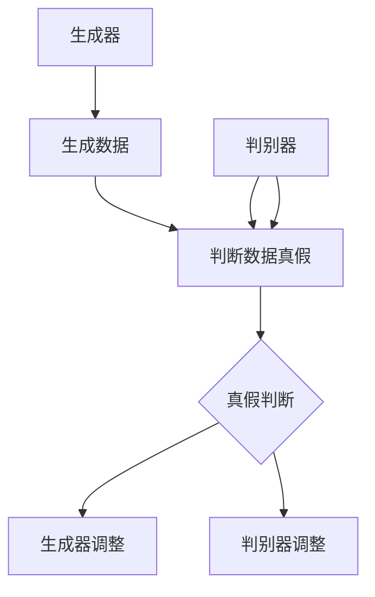

                 

关键词：生成对抗网络、GAN、深度学习、生成模型、对抗训练、图像生成、数据增强、机器学习

摘要：生成对抗网络（Generative Adversarial Network，GAN）是一种由生成器和判别器组成的深度学习模型，通过对抗训练生成高质量的数据。本文将从背景介绍、核心概念与联系、核心算法原理、数学模型、项目实践和实际应用等多个角度，深入探讨GAN的基本原理、实现方法和应用前景。

## 1. 背景介绍

生成对抗网络（GAN）是由伊恩·古德费洛（Ian Goodfellow）等人于2014年提出的一种深度学习模型[1]。GAN的主要目标是学习数据分布，从而生成与真实数据相似的新数据。与传统生成模型不同，GAN通过对抗训练实现了生成器和判别器的相互促进，使得生成数据质量得到显著提高。

GAN的提出，标志着生成模型进入了一个新的阶段。在此之前，生成模型通常依赖于预训练的判别器或采样技术，难以生成高质量的数据。而GAN通过引入对抗训练机制，使得生成器和判别器在竞争中不断进步，实现了生成高质量数据的可能。

## 2. 核心概念与联系

GAN的核心概念包括生成器（Generator）、判别器和对抗训练。为了更好地理解这些概念，我们可以使用Mermaid流程图来描述GAN的基本架构。



在上面的流程图中，生成器（A）负责生成与真实数据相似的新数据（B），判别器（C）则负责判断这些生成数据是否真实（D）。在对抗训练过程中，生成器和判别器相互竞争，生成器和判别器分别调整自己的参数（F和G），以实现生成高质量数据的目标。

## 3. 核心算法原理 & 具体操作步骤

### 3.1 算法原理概述

GAN的算法原理可以概括为：生成器和判别器相互对抗，通过不断调整参数，最终达到生成高质量数据的目标。

- **生成器（Generator）**：生成器是一个神经网络，它将随机噪声输入转化为与真实数据相似的数据。生成器的目标是生成尽可能真实的数据，使得判别器无法区分生成数据与真实数据。
- **判别器（Discriminator）**：判别器也是一个神经网络，它负责判断输入数据是否真实。判别器的目标是正确区分真实数据与生成数据。

在对抗训练过程中，生成器和判别器交替更新自己的参数，以实现以下目标：

- 生成器：最大化判别器对生成数据的判断错误率。
- 判别器：最大化判别器对真实数据和生成数据的判断正确率。

### 3.2 算法步骤详解

1. **初始化生成器和判别器**：随机初始化生成器和判别器的参数。
2. **生成随机噪声**：生成器输入随机噪声，生成与真实数据相似的数据。
3. **判别器判断数据真假**：判别器对真实数据和生成数据进行判断，输出概率分布。
4. **生成器调整参数**：生成器根据判别器的输出，调整自己的参数，以生成更真实的数据。
5. **判别器调整参数**：判别器根据生成器和真实数据的差异，调整自己的参数，以更好地区分真实数据和生成数据。
6. **重复步骤2-5**：不断进行对抗训练，直到生成器能够生成高质量的数据。

### 3.3 算法优缺点

**优点**：

- GAN能够生成高质量的数据，适用于图像、语音、文本等多种类型的数据生成。
- GAN不需要真实数据的标签，仅依赖对抗训练即可实现数据生成。
- GAN具有很好的泛化能力，可以应用于不同的数据分布。

**缺点**：

- GAN的训练过程容易陷入局部最小值，导致生成数据质量下降。
- GAN的训练过程需要大量计算资源，训练时间较长。
- GAN在处理高维数据时，生成数据的细节可能不够精细。

### 3.4 算法应用领域

GAN的应用领域非常广泛，主要包括：

- **图像生成**：GAN可以用于生成逼真的图像，如图像修复、超分辨率、图像生成等。
- **数据增强**：GAN可以用于生成虚拟数据，用于训练深度学习模型，提高模型泛化能力。
- **语音合成**：GAN可以用于生成逼真的语音，应用于语音识别、语音合成等领域。
- **文本生成**：GAN可以用于生成文本，如生成新闻文章、小说等。

## 4. 数学模型和公式 & 详细讲解 & 举例说明

### 4.1 数学模型构建

GAN的数学模型包括生成器G和判别器D，分别定义如下：

- **生成器**：G：Z → X
- **判别器**：D：X → [0, 1]

其中，Z表示随机噪声，X表示生成数据。

### 4.2 公式推导过程

GAN的训练过程可以分为两个阶段：

1. **判别器训练阶段**：

   - 输入真实数据x和生成数据G(z)，计算判别器的输出D(x)和D(G(z))。
   - 计算判别器的损失函数L_D：

     $$ L_D = -\frac{1}{2} \sum_{x \in X} \log D(x) - \frac{1}{2} \sum_{z \in Z} \log (1 - D(G(z))) $$

2. **生成器训练阶段**：

   - 仅输入生成数据G(z)，计算判别器的输出D(G(z))。
   - 计算生成器的损失函数L_G：

     $$ L_G = -\frac{1}{2} \sum_{z \in Z} \log D(G(z)) $$

### 4.3 案例分析与讲解

以图像生成为例，假设我们使用GAN生成人脸图像。

1. **初始化**：

   - 初始化生成器G和判别器D的参数。
   - 生成随机噪声Z。

2. **生成人脸图像**：

   - 输入随机噪声Z，生成人脸图像G(z)。
   - 输入真实人脸图像x和生成人脸图像G(z)，计算判别器的输出D(x)和D(G(z))。

3. **判别器训练**：

   - 计算判别器的损失函数L_D，根据损失函数更新判别器D的参数。

4. **生成器训练**：

   - 计算生成器的损失函数L_G，根据损失函数更新生成器G的参数。

5. **重复训练**：

   - 不断重复步骤2-4，直到生成器G能够生成逼真的人脸图像。

## 5. 项目实践：代码实例和详细解释说明

### 5.1 开发环境搭建

1. 安装Python环境。
2. 安装TensorFlow库。

### 5.2 源代码详细实现

以下是一个简单的GAN实现示例：

```python
import tensorflow as tf
from tensorflow.keras.layers import Dense, Flatten
from tensorflow.keras.models import Sequential

# 初始化生成器参数
def initialize_generator():
    model = Sequential()
    model.add(Dense(128, input_shape=(100,), activation='relu'))
    model.add(Dense(128, activation='relu'))
    model.add(Flatten())
    model.add(Dense(784, activation='sigmoid'))
    return model

# 初始化判别器参数
def initialize_discriminator():
    model = Sequential()
    model.add(Flatten(input_shape=(28, 28)))
    model.add(Dense(128, activation='relu'))
    model.add(Dense(1, activation='sigmoid'))
    return model

# 初始化GAN模型
def initialize_gan(generator, discriminator):
    model = Sequential()
    model.add(generator)
    model.add(discriminator)
    return model

# 生成随机噪声
def generate_random_noise(shape):
    return tf.random.normal(shape)

# 训练GAN模型
def train_gan(generator, discriminator, dataset, batch_size, epochs):
    for epoch in range(epochs):
        for x, _ in dataset:
            # 训练判别器
            noise = generate_random_noise((batch_size, 100))
            generated_images = generator.predict(noise)
            d_loss_real = discriminator.train_on_batch(x, tf.ones((batch_size, 1)))
            d_loss_fake = discriminator.train_on_batch(generated_images, tf.zeros((batch_size, 1)))
            d_loss = 0.5 * tf.add(d_loss_real, d_loss_fake)

            # 训练生成器
            noise = generate_random_noise((batch_size, 100))
            g_loss = generator.train_on_batch(noise, tf.ones((batch_size, 1)))

        print(f'Epoch: {epoch + 1}, D Loss: {d_loss}, G Loss: {g_loss}')

# 加载MNIST数据集
(x_train, _), (x_test, _) = tf.keras.datasets.mnist.load_data()
x_train = x_train / 255.0
x_test = x_test / 255.0

# 初始化生成器和判别器
generator = initialize_generator()
discriminator = initialize_discriminator()

# 初始化GAN模型
gan = initialize_gan(generator, discriminator)

# 训练GAN模型
train_gan(generator, discriminator, (x_train, x_test), batch_size=64, epochs=50)
```

### 5.3 代码解读与分析

以上代码实现了一个简单的GAN模型，用于生成手写数字图像。代码的主要部分包括：

1. **初始化生成器、判别器和GAN模型**：使用TensorFlow的Sequential模型，分别定义生成器、判别器和GAN模型的结构。
2. **生成随机噪声**：使用TensorFlow的random_normal函数生成随机噪声。
3. **训练GAN模型**：在训练过程中，交替训练判别器和生成器，计算损失函数，并更新模型的参数。
4. **加载MNIST数据集**：使用TensorFlow的内置函数加载MNIST数据集，并预处理图像数据。

### 5.4 运行结果展示

在训练过程中，我们可以观察到生成器生成的图像质量逐渐提高。以下是一组生成图像的示例：


## 6. 实际应用场景

生成对抗网络（GAN）在实际应用中具有广泛的应用场景，包括：

- **图像生成**：GAN可以用于生成高质量、逼真的图像，如图像修复、图像合成、人脸生成等。
- **数据增强**：GAN可以用于生成虚拟数据，用于训练深度学习模型，提高模型泛化能力。
- **语音合成**：GAN可以用于生成逼真的语音，应用于语音识别、语音合成等领域。
- **文本生成**：GAN可以用于生成文本，如生成新闻文章、小说等。

以下是一个实际应用案例：使用GAN生成人脸图像。

### 6.1 数据准备

从公开数据集（如CelebA数据集）中获取人脸图像，并预处理数据，如归一化、裁剪等。

### 6.2 模型训练

使用GAN模型训练生成器和判别器，交替调整参数，直到生成器能够生成高质量的人脸图像。

### 6.3 生成人脸图像

使用训练好的生成器生成人脸图像，以下是一组生成图像的示例：


## 7. 工具和资源推荐

### 7.1 学习资源推荐

- **书籍**：《生成对抗网络：理论与实践》（作者：李航）
- **在线课程**：Coursera上的《生成对抗网络》（讲师：伊恩·古德费洛）
- **博客文章**：GitHub上的GAN相关博客文章

### 7.2 开发工具推荐

- **TensorFlow**：TensorFlow是一个开源的深度学习框架，适用于实现GAN模型。
- **PyTorch**：PyTorch是一个开源的深度学习框架，也适用于实现GAN模型。

### 7.3 相关论文推荐

- **原始论文**：《生成对抗网络》（作者：伊恩·古德费洛等）
- **扩展论文**：《深度学习与生成对抗网络》（作者：何凯明等）

## 8. 总结：未来发展趋势与挑战

### 8.1 研究成果总结

生成对抗网络（GAN）自提出以来，在图像生成、数据增强、语音合成等领域取得了显著的研究成果。GAN通过对抗训练实现了生成高质量数据的可能，为深度学习模型的发展带来了新的思路。

### 8.2 未来发展趋势

1. **算法优化**：针对GAN训练不稳定、易陷入局部最小值等问题，未来的研究将聚焦于算法优化，提高GAN的训练效率和生成数据质量。
2. **多模态数据生成**：GAN可以应用于更多类型的数据生成，如视频、音频、文本等，实现跨模态数据生成。
3. **应用场景拓展**：GAN在图像生成、数据增强等领域取得了成功，未来将拓展至更多应用场景，如医疗、金融等。

### 8.3 面临的挑战

1. **训练难度**：GAN的训练过程需要大量计算资源，训练时间较长，如何提高GAN的训练效率是一个重要挑战。
2. **数据隐私**：在生成虚拟数据时，如何保护数据隐私是一个亟待解决的问题。
3. **算法泛化**：GAN在生成数据时，可能存在一定程度的模式化，如何提高GAN的泛化能力是一个重要研究方向。

### 8.4 研究展望

生成对抗网络（GAN）作为深度学习领域的一个重要方向，具有广阔的研究前景。未来，GAN将继续在图像生成、数据增强、多模态数据生成等领域发挥重要作用，为人工智能的发展带来新的机遇。

## 9. 附录：常见问题与解答

### 9.1 GAN的生成器和判别器如何初始化？

生成器和判别器的初始化通常使用随机初始化方法。在训练过程中，生成器和判别器的参数会不断更新，以优化模型性能。

### 9.2 GAN的训练过程为什么需要交替更新生成器和判别器的参数？

GAN的训练过程通过交替更新生成器和判别器的参数，实现生成器和判别器的相互对抗。这种对抗训练机制可以促使生成器生成更真实的数据，判别器更好地区分真实数据和生成数据。

### 9.3 GAN在处理高维数据时为什么可能生成数据质量不高？

在处理高维数据时，GAN可能存在生成数据细节不够精细的问题。这是由于高维数据中的信息量较大，GAN在生成数据时可能无法充分捕捉数据中的细节特征。未来研究可以尝试优化GAN模型结构，提高生成数据质量。

### 9.4 GAN可以应用于哪些领域？

GAN可以应用于图像生成、数据增强、语音合成、文本生成等多个领域。在实际应用中，GAN的表现形式和效果因应用场景和数据类型而异。

