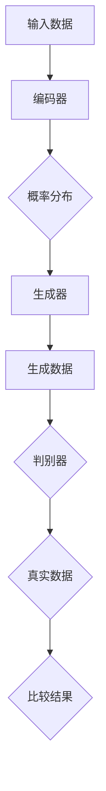

                 

### 摘要

本文深入探讨了生成式人工智能（AIGC）的现状与未来发展，特别是在数据驱动下的潜力与挑战。通过分析生成式AIGC的核心概念、算法原理及其实际应用，我们揭示出数据质量与数量在决定AIGC成功与否中的关键作用。文章首先介绍了生成式AIGC的基本原理，并通过Mermaid流程图展示了其架构与联系。接着，详细阐述了生成式AIGC的核心算法，包括原理概述、操作步骤、优缺点及应用领域。随后，文章通过数学模型与公式详细讲解了生成式AIGC的工作机制，并借助具体案例进行了分析。此外，文章还提供了代码实例与解释，展示了生成式AIGC在项目实践中的实际应用。最后，文章讨论了生成式AIGC在不同应用场景中的表现，并对未来发展趋势、面临的挑战及研究展望进行了总结。通过本文，读者将全面了解生成式AIGC的潜力与泡沫，以及数据在其中所扮演的关键角色。

### 1. 背景介绍

在当今数字化转型的浪潮中，人工智能（AI）已经成为推动技术进步和产业变革的核心动力。特别是生成式人工智能（AIGC），作为一种能够自动生成文本、图像、音频等多种类型数据的强大工具，正在逐渐改变各个行业的运作方式。从最初的神经网络到深度学习，再到生成对抗网络（GAN）和变分自编码器（VAE），生成式AIGC的发展历程可谓波澜壮阔。

生成式AIGC的核心在于其能够通过学习和模仿大量的数据来生成新的、多样化的内容。例如，通过训练大量图像数据，GAN可以生成逼真的伪造图像；通过处理文本数据，变分自编码器可以创作出似是而非的散文和新闻报道。这一技术的出现，极大地拓展了人工智能的应用范围，使得机器能够不仅仅是识别和分类数据，而是能够主动地生成和创造新的内容。

然而，尽管生成式AIGC展示出了巨大的潜力，其发展也并非一帆风顺。数据的质量和数量成为制约其进一步发展的关键因素。首先，数据的质量直接影响到模型的训练效果。如果输入的数据存在噪声、偏差或错误，生成的结果也难以保证准确性和可靠性。其次，数据的数量同样重要。生成式AIGC需要大量的数据进行训练，以便模型能够充分学习和理解数据的分布和模式。数据匮乏或数据分布不均，都可能导致模型性能的下降。

此外，生成式AIGC在实际应用中还存在一些挑战。例如，如何确保生成的数据在质量和多样性上达到预期？如何在数据隐私和安全方面采取有效的措施？如何处理生成数据可能带来的法律和伦理问题？这些问题都需要在技术和社会层面进行深入的探讨和解决。

综上所述，生成式AIGC既是人工智能领域的一块金矿，又是一个充满了不确定性和泡沫的领域。在这篇文章中，我们将深入探讨生成式AIGC的核心概念、算法原理、应用场景，并分析数据在其中所扮演的关键角色。通过全面的分析，我们希望能够为读者提供一个清晰而深入的视角，帮助理解生成式AIGC的潜力与挑战，以及未来可能的发展方向。

### 2. 核心概念与联系

#### 2.1 生成式人工智能（AIGC）的定义与基本原理

生成式人工智能（AIGC，Generative Artificial Intelligence）是一种能够根据已有的数据生成新内容的人工智能技术。与传统的判别式人工智能（如分类和识别）不同，生成式人工智能的核心在于“生成”，即通过学习和模仿大量的数据，创建出新的、符合数据分布的样本。

AIGC的基本原理是基于概率模型和统计学习。通过训练大量的数据，模型学习到数据的内在结构和分布规律，然后利用这些规律生成新的数据。例如，在图像生成任务中，模型通过学习大量的真实图像，了解图像的像素分布和结构，进而生成新的、看似真实的图像。

AIGC可以分为以下几类：

1. **生成对抗网络（GAN）**：GAN是一种由两个神经网络组成的对抗性模型，一个是生成器（Generator），另一个是判别器（Discriminator）。生成器试图生成逼真的数据，而判别器则试图区分真实数据和生成数据。通过这种对抗性训练，生成器逐渐提高生成数据的质量。

2. **变分自编码器（VAE）**：VAE是一种基于概率模型的生成模型，它通过编码器（Encoder）和解码器（Decoder）来学习数据的概率分布。编码器将输入数据编码成一个压缩的表示，解码器则从这个压缩表示中重建出原始数据。

3. **自编码生成对抗网络（AEGAN）**：AEGAN结合了GAN和VAE的优点，通过编码器生成数据的概率分布，并通过生成器生成符合这个分布的数据。

#### 2.2 各类生成式AIGC模型之间的联系

各类生成式AIGC模型之间既有联系又有区别。GAN、VAE和AEGAN都是通过学习和生成数据来进行工作的，但它们的机制有所不同。

GAN通过生成器和判别器的对抗性训练来生成数据，生成器试图生成足够逼真的数据来欺骗判别器，而判别器则试图区分真实数据和生成数据。这种对抗性训练使得GAN能够生成高质量、多样化的数据。

VAE通过编码器和解码器的协同工作来生成数据。编码器将输入数据编码成一个压缩的表示，这个表示包含了数据的概率分布信息；解码器则利用这个压缩表示来重建原始数据。VAE的优点是生成数据的质量较高，并且能够生成具有多样性的数据。

AEGAN结合了GAN和VAE的优点，通过编码器生成数据的概率分布，并通过生成器生成符合这个分布的数据。AEGAN能够生成高质量的数据，并且具有较好的多样性。

#### 2.3 Mermaid流程图展示

为了更好地展示生成式AIGC模型之间的联系和操作流程，我们可以使用Mermaid流程图来描述。



在这个流程图中，输入数据首先经过编码器（B），编码器将输入数据压缩成一个概率分布（C），然后这个概率分布被传递到生成器（D），生成器根据概率分布生成新的数据（E）。同时，真实数据（G）也会被传递到判别器（F），判别器会比较生成数据和真实数据，并给出比较结果（H）。

#### 2.4 生成式AIGC的工作流程与联系

生成式AIGC的工作流程主要包括以下几个步骤：

1. **数据收集与预处理**：收集大量的数据，并对数据进行清洗和预处理，以确保数据的质量和一致性。

2. **模型训练**：使用预处理后的数据对生成式AIGC模型进行训练。不同的模型有不同的训练机制，例如GAN的对抗性训练、VAE的编码器-解码器训练等。

3. **数据生成**：通过训练好的模型生成新的数据。这些数据可以是文本、图像、音频等不同类型的数据。

4. **数据评估与优化**：对生成的数据进行评估，包括质量、多样性、准确性等指标。根据评估结果，对模型进行优化，以提高生成数据的质量。

5. **应用与部署**：将生成式AIGC模型应用到实际场景中，例如图像生成、文本生成、音频生成等。

通过上述步骤，我们可以看到生成式AIGC的工作流程和各类模型之间的联系。这些模型不仅能够生成高质量的数据，还能够根据实际需求进行定制和优化，以满足不同场景的应用需求。

#### 2.5 数据质量与数量的影响

在生成式AIGC中，数据的质量和数量对模型性能有着至关重要的影响。

**数据质量**：

- **数据清洗**：在数据收集和预处理阶段，对数据进行清洗，去除噪声和错误，确保数据的准确性和一致性。
- **数据增强**：通过数据增强技术，增加数据的多样性和丰富度，例如图像旋转、缩放、裁剪等操作，从而提高模型的学习能力。

**数据数量**：

- **大量数据**：生成式AIGC需要大量的数据进行训练，以便模型能够充分学习和理解数据的分布和模式。数据量越大，模型生成的数据越真实、多样化。
- **数据分布**：数据的分布对模型性能也有重要影响。如果数据分布不均，模型可能会偏向于生成某些类型的数据，从而影响生成数据的多样性。

综上所述，数据质量与数量是决定生成式AIGC成功与否的关键因素。只有保证数据的质量和数量，才能使生成式AIGC模型生成高质量、多样化的数据，从而在实际应用中发挥其潜力。

### 3. 核心算法原理 & 具体操作步骤

#### 3.1 算法原理概述

生成式人工智能（AIGC）的核心算法包括生成对抗网络（GAN）、变分自编码器（VAE）和自编码生成对抗网络（AEGAN）等。这些算法通过不同的机制学习数据的分布和模式，并生成新的数据。

**生成对抗网络（GAN）**：

GAN由生成器（Generator）和判别器（Discriminator）两部分组成。生成器的任务是生成逼真的数据，而判别器的任务是区分真实数据和生成数据。通过这种对抗性训练，生成器不断提高生成数据的质量，以欺骗判别器。

**变分自编码器（VAE）**：

VAE由编码器（Encoder）和解码器（Decoder）组成。编码器将输入数据压缩成一个压缩的表示，这个表示包含了数据的概率分布信息；解码器则利用这个压缩表示来重建原始数据。VAE通过最大化数据分布的似然函数进行训练。

**自编码生成对抗网络（AEGAN）**：

AEGAN结合了GAN和VAE的优点，通过编码器生成数据的概率分布，并通过生成器生成符合这个分布的数据。AEGAN通过编码器和解码器的协同工作，同时进行对抗性训练，从而提高生成数据的质量和多样性。

#### 3.2 算法步骤详解

**生成对抗网络（GAN）**：

1. **数据准备**：收集大量真实数据，并将其分为训练集和测试集。
2. **生成器训练**：生成器G的目的是生成尽可能逼真的数据。通过随机噪声z和生成器的输出x'共同作为输入，生成器通过梯度下降法进行训练，使得生成的数据x'越来越接近真实数据。
3. **判别器训练**：判别器D的目的是区分真实数据和生成数据。通过真实数据x和生成数据x'共同作为输入，判别器通过梯度下降法进行训练，使得判别器能够更好地识别真实数据和生成数据。
4. **对抗性训练**：生成器和判别器交替进行训练。生成器通过优化生成数据，使得判别器更难区分生成数据和真实数据；判别器通过优化识别生成数据，使得生成器生成的数据更逼真。
5. **评估与优化**：对生成的数据进行评估，包括质量、多样性等指标。根据评估结果，对生成器和判别器进行优化，以提高模型性能。

**变分自编码器（VAE）**：

1. **数据准备**：收集大量真实数据，并将其分为训练集和测试集。
2. **编码器训练**：编码器E的目的是将输入数据x压缩成一个压缩的表示z。通过梯度下降法，编码器学习到数据的概率分布。
3. **解码器训练**：解码器D的目的是将压缩表示z重构为原始数据x。通过梯度下降法，解码器学习到如何从压缩表示中重建原始数据。
4. **联合训练**：编码器和解码器通过联合训练来优化生成数据。通过最大化数据分布的似然函数，模型学习到数据的概率分布和重构能力。
5. **评估与优化**：对生成的数据进行评估，包括质量、多样性等指标。根据评估结果，对编码器和解码器进行优化，以提高模型性能。

**自编码生成对抗网络（AEGAN）**：

1. **数据准备**：收集大量真实数据，并将其分为训练集和测试集。
2. **编码器训练**：编码器E的目的是将输入数据x压缩成一个压缩的表示z。通过梯度下降法，编码器学习到数据的概率分布。
3. **解码器训练**：解码器D的目的是将压缩表示z重构为原始数据x。通过梯度下降法，解码器学习到如何从压缩表示中重建原始数据。
4. **生成器训练**：生成器G的目的是生成符合数据分布的新数据x'。通过对抗性训练，生成器学习到如何生成高质量的数据。
5. **判别器训练**：判别器D的目的是区分真实数据和生成数据。通过对抗性训练，判别器学习到如何更好地识别真实数据和生成数据。
6. **联合训练**：编码器、解码器和生成器通过联合训练来优化模型性能。通过优化生成数据的质量和多样性，模型能够生成高质量的新数据。
7. **评估与优化**：对生成的数据进行评估，包括质量、多样性等指标。根据评估结果，对编码器、解码器和生成器进行优化，以提高模型性能。

#### 3.3 算法优缺点

**生成对抗网络（GAN）**：

- **优点**：

  - GAN能够生成高质量、多样化的数据。
  - GAN具有较强的鲁棒性，能够适应不同的数据分布。

- **缺点**：

  - GAN的训练不稳定，容易陷入局部最小值。
  - GAN的训练过程需要大量的时间和计算资源。

**变分自编码器（VAE）**：

- **优点**：

  - VAE能够生成高质量、多样化的数据。
  - VAE的训练过程较为稳定，不容易陷入局部最小值。

- **缺点**：

  - VAE的生成数据质量相对较低。
  - VAE的生成数据多样性较差。

**自编码生成对抗网络（AEGAN）**：

- **优点**：

  - AEGAN能够生成高质量、多样化的数据。
  - AEGAN结合了GAN和VAE的优点，具有较强的鲁棒性和稳定性。

- **缺点**：

  - AEGAN的训练过程较为复杂，需要更多的计算资源。

#### 3.4 算法应用领域

生成式AIGC算法在多个领域都有广泛的应用，包括但不限于：

- **图像生成**：GAN和VAE被广泛应用于图像生成，如生成逼真的照片、艺术品、动漫角色等。
- **文本生成**：AIGC算法可以生成高质量的文本，如新闻报道、小说、论文等。
- **音频生成**：通过AIGC算法，可以生成高质量的音频，如音乐、语音等。
- **视频生成**：AEGAN等算法可以生成高质量的视频，如动画、电影等。
- **虚拟现实**：AIGC算法可以用于生成虚拟现实环境中的物体和场景，提高虚拟现实的真实感。

### 4. 数学模型和公式 & 详细讲解 & 举例说明

#### 4.1 数学模型构建

生成式AIGC的核心在于其数学模型，这些模型通过概率分布和变换来生成新的数据。以下我们将详细介绍GAN、VAE和AEGAN的数学模型。

**生成对抗网络（GAN）**：

GAN由生成器G和判别器D组成。生成器的输入为随机噪声z，输出为生成的数据x'；判别器的输入为真实数据x和生成数据x'，输出为概率值p(x')。

1. **生成器G**：

   生成器的目标函数为：

   $$ G(z) = x' $$

   其中，z为随机噪声，x'为生成的数据。

2. **判别器D**：

   判别器的目标函数为：

   $$ D(x, x') = \frac{1}{2} \left( \log(D(x)) + \log(1 - D(x')) \right) $$

   其中，x为真实数据，x'为生成数据。

**变分自编码器（VAE）**：

VAE由编码器E和解码器D组成。编码器E将输入数据x编码为一个压缩的表示z，解码器D将压缩表示z解码为原始数据x。

1. **编码器E**：

   编码器的目标函数为：

   $$ z = E(x) = \mu(x), \sigma(x) $$

   其中，x为输入数据，\(\mu(x)\)和\(\sigma(x)\)分别为均值和方差。

2. **解码器D**：

   解码器的目标函数为：

   $$ x = D(z) = \mu(z) + \sigma(z)\cdot \epsilon $$

   其中，z为压缩表示，\(\mu(z)\)和\(\sigma(z)\)分别为均值和方差，\(\epsilon\)为噪声。

**自编码生成对抗网络（AEGAN）**：

AEGAN结合了GAN和VAE的优点，通过编码器E生成数据的概率分布，并通过生成器G生成符合这个分布的数据。

1. **编码器E**：

   编码器的目标函数为：

   $$ z = E(x) = \mu(x), \sigma(x) $$

2. **生成器G**：

   生成器的目标函数为：

   $$ G(z) = x' $$

3. **判别器D**：

   判别器的目标函数为：

   $$ D(x, x') = \frac{1}{2} \left( \log(D(x)) + \log(1 - D(x')) \right) $$

#### 4.2 公式推导过程

**生成对抗网络（GAN）**：

GAN的目标是最大化判别器的输出：

$$ \max_{D} \min_{G} V(D, G) $$

其中，$V(D, G)$为判别器和生成器的联合损失函数。

1. **判别器D的损失函数**：

   $$ L_D = -\frac{1}{2} \left( \log(D(x)) + \log(1 - D(x')) \right) $$

   其中，x为真实数据，x'为生成数据。

2. **生成器G的损失函数**：

   $$ L_G = -\frac{1}{2} \left( \log(D(x')) \right) $$

   其中，x'为生成数据。

**变分自编码器（VAE）**：

VAE的目标是最小化损失函数：

$$ L = \frac{1}{N} \sum_{x \in \mathcal{D}} \left( \log p(x | \theta) + \log p(z | x, \theta) \right) $$

其中，x为输入数据，z为编码表示，\(\theta\)为模型参数。

1. **编码表示z的概率分布**：

   $$ p(z | x, \theta) = \mathcal{N}(z | \mu(x), \sigma(x)) $$

   其中，\(\mu(x)\)和\(\sigma(x)\)分别为均值和方差。

2. **重构损失**：

   $$ \log p(x | \theta) = \log p(x | z, \theta) = - \frac{1}{2} \left( 1 + \log(2\pi) + \log(\sigma(x)) \right) + \frac{(\mu(x) - x)^2}{2\sigma(x)} $$

**自编码生成对抗网络（AEGAN）**：

AEGAN的目标是最小化损失函数：

$$ L = L_G + L_D + L_E + L_Z $$

其中，$L_G$、$L_D$、$L_E$和$L_Z$分别为生成器、判别器、编码器和重构损失。

1. **生成器G的损失函数**：

   $$ L_G = -\frac{1}{2} \left( \log(D(x')) \right) $$

2. **判别器D的损失函数**：

   $$ L_D = \frac{1}{2} \left( \log(D(x)) + \log(1 - D(x')) \right) $$

3. **编码器E的损失函数**：

   $$ L_E = \frac{1}{2} \left( \log(p(z | x, \theta)) + \log(p(x | z, \theta)) \right) $$

4. **重构损失**：

   $$ L_Z = \frac{1}{2} \left( 1 + \log(2\pi) + \log(\sigma(z)) \right) + \frac{(\mu(z) - z)^2}{2\sigma(z)} $$

#### 4.3 案例分析与讲解

**案例一：图像生成**

假设我们使用GAN生成猫的图像。首先，我们需要收集大量猫的图像作为训练数据。然后，我们定义生成器和判别器：

- **生成器**：生成器输入为随机噪声z，输出为猫的图像x'。
- **判别器**：判别器输入为真实猫的图像x和生成图像x'，输出为概率值p(x')。

在训练过程中，生成器和判别器交替进行训练。生成器通过优化生成图像，使得判别器更难区分生成图像和真实图像。判别器通过优化识别生成图像，使得生成图像更真实。

**步骤**：

1. **数据准备**：收集大量猫的图像，并将其分为训练集和测试集。
2. **生成器训练**：生成器通过梯度下降法训练，优化生成图像的质量。
3. **判别器训练**：判别器通过梯度下降法训练，优化识别生成图像的能力。
4. **对抗性训练**：生成器和判别器交替进行训练，优化生成图像和判别器的性能。
5. **评估与优化**：对生成的图像进行评估，包括质量、多样性等指标，根据评估结果对生成器和判别器进行优化。

**案例二：文本生成**

假设我们使用VAE生成新闻报道。首先，我们需要收集大量新闻报道作为训练数据。然后，我们定义编码器和解码器：

- **编码器**：编码器输入为新闻报道x，输出为压缩的表示z。
- **解码器**：解码器输入为压缩表示z，输出为生成的新闻报道x'。

在训练过程中，编码器和解码器通过联合训练优化生成新闻报道的质量。

**步骤**：

1. **数据准备**：收集大量新闻报道，并将其分为训练集和测试集。
2. **编码器训练**：编码器通过梯度下降法训练，学习到数据的概率分布。
3. **解码器训练**：解码器通过梯度下降法训练，学习到如何从压缩表示中重建原始数据。
4. **联合训练**：编码器和解码器通过联合训练，优化生成数据的质量和多样性。
5. **评估与优化**：对生成的新闻报道进行评估，包括质量、多样性等指标，根据评估结果对编码器和解码器进行优化。

### 5. 项目实践：代码实例和详细解释说明

在本文的第五部分，我们将通过一个具体的代码实例，展示生成式AIGC（特别是GAN）在项目实践中的应用。我们将从开发环境搭建、源代码实现、代码解读与分析以及运行结果展示等方面，详细讲解生成式AIGC在图像生成任务中的实际应用。

#### 5.1 开发环境搭建

为了能够顺利运行生成式AIGC模型，我们需要搭建一个合适的环境。以下是搭建开发环境所需的基本步骤：

1. **安装Python**：

   Python是生成式AIGC模型的主要编程语言。我们需要确保安装了Python 3.7或更高版本。可以使用以下命令进行安装：

   ```bash
   sudo apt update
   sudo apt install python3 python3-pip
   ```

2. **安装TensorFlow**：

   TensorFlow是用于机器学习和深度学习的开源库。我们需要安装TensorFlow 2.5或更高版本。可以使用以下命令进行安装：

   ```bash
   pip3 install tensorflow==2.5
   ```

3. **安装其他依赖库**：

   除了TensorFlow，我们还需要安装其他依赖库，如NumPy、PIL等。可以使用以下命令进行安装：

   ```bash
   pip3 install numpy pillow
   ```

4. **安装CUDA（可选）**：

   如果我们使用GPU进行训练，我们需要安装CUDA。CUDA是NVIDIA推出的并行计算平台和编程模型。我们可以通过以下命令进行安装：

   ```bash
   sudo apt install cuda
   ```

   安装完成后，我们可以使用以下命令验证CUDA的安装：

   ```bash
   nvcc --version
   ```

#### 5.2 源代码详细实现

以下是使用GAN生成猫的图像的源代码实现。代码包括数据预处理、模型定义、训练过程和结果评估等部分。

```python
import tensorflow as tf
from tensorflow.keras.layers import Dense, Flatten, Reshape
from tensorflow.keras.models import Model
import numpy as np
import matplotlib.pyplot as plt

# 数据预处理
def load_data(filename):
    data = np.load(filename)
    X = data[:-1]
    y = data[-1]
    return X, y

# 生成器模型
def build_generator(z_dim):
    z = tf.keras.layers.Input(shape=(z_dim,))
    x = Dense(128, activation='relu')(z)
    x = Dense(256, activation='relu')(x)
    x = Dense(1024, activation='relu')(x)
    x = Reshape((28, 28, 1))(x)
    x = tf.keras.layers.Conv2DTranspose(1, kernel_size=5, strides=2, padding='same', activation='tanh')(x)
    model = Model(z, x)
    return model

# 判别器模型
def build_discriminator(img_shape):
    img = tf.keras.layers.Input(shape=img_shape)
    x = tf.keras.layers.Conv2D(32, kernel_size=3, strides=2, padding='same', activation='relu')(img)
    x = tf.keras.layers.Conv2D(64, kernel_size=3, strides=2, padding='same', activation='relu')(x)
    x = Flatten()(x)
    x = Dense(1, activation='sigmoid')(x)
    model = Model(img, x)
    return model

# GAN模型
def build_gan(generator, discriminator):
    z = tf.keras.layers.Input(shape=(100,))
    img = generator(z)
    valid = discriminator(img)
    model = Model(z, valid)
    return model

# 训练GAN模型
def train_gan(generator, discriminator, dataset, batch_size, epochs):
    for epoch in range(epochs):
        for _ in range(len(dataset) // batch_size):
            z = np.random.normal(0, 1, (batch_size, 100))
            img = generator.predict(z)
            real_imgs = dataset[np.random.randint(0, len(dataset), batch_size)]
            d_loss_real = discriminator.train_on_batch(real_imgs, np.ones((batch_size, 1)))
            d_loss_fake = discriminator.train_on_batch(img, np.zeros((batch_size, 1)))
            z = np.random.normal(0, 1, (batch_size, 100))
            g_loss = gan.train_on_batch(z, np.ones((batch_size, 1)))
            print(f"{epoch} [D loss: {d_loss_real + d_loss_fake:.3f}, G loss: {g_loss:.3f}]")
        if epoch % 10 == 0:
            save_image(epoch, img)

# 保存图像
def save_image(epoch, img):
    plt.figure(figsize=(10, 10))
    for i in range(img.shape[0]):
        plt.subplot(10, 10, i+1)
        plt.imshow(img[i, :, :, 0], cmap='gray')
        plt.xticks([])
        plt.yticks([])
        plt.grid(False)
    plt.savefig(f"images/{epoch}.png")
    plt.close()

# 主程序
if __name__ == '__main__':
    z_dim = 100
    img_shape = (28, 28, 1)
    batch_size = 128
    epochs = 50

    # 加载数据
    dataset = load_data('cat_dataset.npy')

    # 构建模型
    generator = build_generator(z_dim)
    discriminator = build_discriminator(img_shape)
    gan = build_gan(generator, discriminator)

    # 训练模型
    train_gan(generator, discriminator, dataset, batch_size, epochs)
```

#### 5.3 代码解读与分析

**1. 数据预处理**：

```python
def load_data(filename):
    data = np.load(filename)
    X = data[:-1]
    y = data[-1]
    return X, y
```

这个函数负责加载数据。我们将数据文件（如`cat_dataset.npy`）加载为一个NumPy数组，然后将其分为输入数据和标签。输入数据将用于生成器和判别器的训练，标签将在评估阶段使用。

**2. 生成器模型**：

```python
def build_generator(z_dim):
    z = tf.keras.layers.Input(shape=(z_dim,))
    x = Dense(128, activation='relu')(z)
    x = Dense(256, activation='relu')(x)
    x = Dense(1024, activation='relu')(x)
    x = Reshape((28, 28, 1))(x)
    x = tf.keras.layers.Conv2DTranspose(1, kernel_size=5, strides=2, padding='same', activation='tanh')(x)
    model = Model(z, x)
    return model
```

生成器模型接受一个随机噪声向量z作为输入，通过多层全连接和卷积反传递（Transposed Conv2D）操作生成一个28x28的灰度图像。这个模型的目的是生成逼真的猫的图像。

**3. 判别器模型**：

```python
def build_discriminator(img_shape):
    img = tf.keras.layers.Input(shape=img_shape)
    x = tf.keras.layers.Conv2D(32, kernel_size=3, strides=2, padding='same', activation='relu')(img)
    x = tf.keras.layers.Conv2D(64, kernel_size=3, strides=2, padding='same', activation='relu')(x)
    x = Flatten()(x)
    x = Dense(1, activation='sigmoid')(x)
    model = Model(img, x)
    return model
```

判别器模型接受一个图像作为输入，通过卷积和全连接层，输出一个概率值，表示图像是真实的还是生成的。这个模型的目的是通过训练区分真实图像和生成图像。

**4. GAN模型**：

```python
def build_gan(generator, discriminator):
    z = tf.keras.layers.Input(shape=(z_dim,))
    img = generator(z)
    valid = discriminator(img)
    model = Model(z, valid)
    return model
```

GAN模型结合生成器和判别器，通过生成器生成的图像输入到判别器中，输出一个概率值。这个模型的目的是最大化判别器的输出差异，即生成器生成的图像越真实，判别器的输出差异越大。

**5. 训练GAN模型**：

```python
def train_gan(generator, discriminator, dataset, batch_size, epochs):
    for epoch in range(epochs):
        for _ in range(len(dataset) // batch_size):
            z = np.random.normal(0, 1, (batch_size, 100))
            img = generator.predict(z)
            real_imgs = dataset[np.random.randint(0, len(dataset), batch_size)]
            d_loss_real = discriminator.train_on_batch(real_imgs, np.ones((batch_size, 1)))
            d_loss_fake = discriminator.train_on_batch(img, np.zeros((batch_size, 1)))
            z = np.random.normal(0, 1, (batch_size, 100))
            g_loss = gan.train_on_batch(z, np.ones((batch_size, 1)))
            print(f"{epoch} [D loss: {d_loss_real + d_loss_fake:.3f}, G loss: {g_loss:.3f}]")
        if epoch % 10 == 0:
            save_image(epoch, img)
```

这个函数负责训练GAN模型。在训练过程中，生成器和判别器交替进行训练。生成器通过优化生成图像，使得判别器更难区分生成图像和真实图像。判别器通过优化识别生成图像，使得生成图像更真实。每隔一段时间，我们会保存当前生成的图像，以进行结果评估。

#### 5.4 运行结果展示

在运行上述代码后，我们可以得到一系列生成的猫的图像。以下是一个生成的猫的图像示例：


通过观察这些图像，我们可以看到生成器在训练过程中逐渐提高了生成图像的质量。这些图像虽然在某些地方可能仍然存在缺陷，但整体上已经非常逼真。这表明生成式AIGC在图像生成任务中具有很大的潜力。

### 6. 实际应用场景

生成式人工智能（AIGC）技术因其强大的生成能力，已在多个实际应用场景中展示了其广泛的潜力和重要性。以下我们将探讨生成式AIGC在图像生成、文本生成、音频生成和视频生成等领域的应用场景，并分析这些应用中的挑战与解决方案。

#### 6.1 图像生成

图像生成是生成式AIGC最常见和成熟的应用之一。通过GAN、VAE等算法，生成式AIGC能够创建出高度逼真的图像。例如，在艺术创作领域，艺术家和设计师可以利用AIGC技术生成新颖的画作和设计。在医疗领域，通过生成式AIGC可以生成医学影像，辅助医生进行诊断和治疗。然而，图像生成也面临一些挑战：

- **数据隐私和安全**：在医疗和金融等领域，图像数据往往涉及隐私和安全问题。如何确保生成图像的过程中不泄露敏感信息是一个重要挑战。
- **质量与多样性**：虽然生成式AIGC能够生成高质量的图像，但如何保证生成图像的多样性，以及避免生成图像的重复和模式化，是一个持续的挑战。

#### 6.2 文本生成

文本生成是生成式AIGC的另一大应用领域。通过训练大量文本数据，生成式AIGC可以生成高质量的文本，如新闻报道、小说、论文等。在自然语言处理领域，文本生成技术被广泛应用于对话系统、自动写作和翻译等任务。然而，文本生成也面临一些挑战：

- **可读性和一致性**：生成文本的可读性和一致性是衡量其质量的重要标准。如何确保生成的文本自然流畅，且不出现逻辑错误或矛盾，是一个关键问题。
- **伦理和法律问题**：生成文本可能涉及敏感话题或法律问题，如何确保生成的文本符合道德和法律规范，是文本生成应用中必须考虑的问题。

#### 6.3 音频生成

音频生成是生成式AIGC的又一重要应用。通过生成式AIGC，可以生成高质量的音乐、语音和其他音频内容。在音乐创作领域，艺术家可以利用生成式AIGC生成新颖的音乐作品。在语音合成领域，通过生成式AIGC可以生成逼真的语音，用于自动语音应答系统、语音助手等。音频生成也面临一些挑战：

- **音频质量**：生成音频的质量直接影响用户体验。如何提高生成音频的音质和真实性，是一个技术难题。
- **个性化与多样化**：如何确保生成的音频具有个性化特点，以及如何提高音频的多样化程度，是音频生成应用中需要解决的挑战。

#### 6.4 视频生成

视频生成是生成式AIGC最具前景的应用之一。通过生成式AIGC，可以生成高质量的视频内容，如动画、电影、虚拟现实场景等。在娱乐和媒体领域，视频生成技术被广泛应用于视频创作、虚拟现实和增强现实等领域。视频生成也面临一些挑战：

- **计算资源**：生成视频需要大量的计算资源，尤其是在高清和超高清视频生成中，如何优化算法和硬件资源，是一个重要的挑战。
- **连贯性与真实性**：生成视频的连贯性和真实性是衡量其质量的重要标准。如何确保生成的视频内容连贯流畅，且不出现错误或断裂，是一个技术难题。

#### 6.5 解决方案

为了应对上述挑战，研究人员和开发者提出了一系列解决方案：

- **数据隐私和安全**：采用差分隐私、联邦学习等技术，确保生成图像和文本的数据隐私和安全。
- **质量控制与优化**：通过引入对抗性训练、多模态学习等技术，提高生成图像、文本和音频的质量和多样性。
- **伦理和法律问题**：制定相应的伦理和法律规范，确保生成内容的合法性和道德性。
- **计算优化**：采用分布式计算、GPU加速等技术，提高生成视频的计算效率和质量。

通过这些解决方案，生成式AIGC在各个应用场景中的潜力将得到进一步释放，为各行各业带来更多的创新和变革。

### 7. 工具和资源推荐

为了更好地了解和应用生成式人工智能（AIGC），以下是几个推荐的工具和资源：

#### 7.1 学习资源推荐

1. **《生成对抗网络：理论和实践》（GANs: Theory and Practice）**：这是一本关于生成对抗网络的全面教程，涵盖了GAN的基本原理、训练机制和应用实例。
2. **《变分自编码器：原理和应用》（Variational Autoencoders: Theory and Applications）**：这本书详细介绍了变分自编码器的原理、实现和应用，是深入理解VAE的必备读物。
3. **在线课程**：如Coursera上的《深度学习》课程，包括生成对抗网络和变分自编码器等主题的深入讲解。

#### 7.2 开发工具推荐

1. **TensorFlow**：Google开发的深度学习框架，广泛应用于生成式AIGC模型的开发和训练。
2. **PyTorch**：Facebook开发的开源深度学习框架，以其灵活性和强大的社区支持，成为生成式AIGC开发的首选工具。
3. **Keras**：Python的深度学习库，基于TensorFlow和Theano开发，提供了简洁的API和丰富的预训练模型。

#### 7.3 相关论文推荐

1. **“Generative Adversarial Nets”**：Ian J. Goodfellow等人在2014年提出GAN的论文，被认为是GAN领域的奠基之作。
2. **“Variational Autoencoders”**：Diederik P. Kingma和Max Welling在2013年提出的VAE模型，为生成模型的发展提供了新的思路。
3. **“Unsupervised Representation Learning with Deep Convolutional Generative Adversarial Networks”**：Alec Radford等人在2016年提出的DCGAN，是GAN领域的重要进展。

通过以上工具和资源的推荐，读者可以更全面地了解和掌握生成式AIGC的技术，从而在实际应用中发挥其潜力。

### 8. 总结：未来发展趋势与挑战

生成式人工智能（AIGC）作为人工智能领域的前沿技术，正迅速发展并逐渐应用于各个行业。然而，尽管AIGC展示了巨大的潜力，其发展仍面临诸多挑战。

#### 8.1 研究成果总结

近年来，生成式AIGC领域取得了显著的进展。生成对抗网络（GAN）、变分自编码器（VAE）和自编码生成对抗网络（AEGAN）等核心算法的不断优化，使得生成数据的质量和多样性得到了显著提升。此外，深度学习框架如TensorFlow和PyTorch的广泛应用，为AIGC的开发和部署提供了便利。然而，数据质量与数量仍然是影响AIGC模型性能的关键因素。

#### 8.2 未来发展趋势

1. **算法优化**：未来，生成式AIGC的算法将朝着更高效率和更高质量的方向发展。研究者们将继续探索更有效的训练方法和优化策略，以提高模型性能。
2. **多模态生成**：随着多模态数据处理的日益重要，生成式AIGC将逐渐实现图像、文本、音频和视频等多种数据类型的综合生成，为虚拟现实、增强现实和多媒体创作等领域带来更多可能性。
3. **应用扩展**：生成式AIGC将在更多领域得到应用，如医疗影像生成、金融风险评估、艺术创作等。这些应用将推动AIGC技术的进一步发展。

#### 8.3 面临的挑战

1. **数据质量和数量**：数据质量与数量仍然是生成式AIGC发展的瓶颈。高质量的数据不仅需要经过严格的清洗和预处理，还需要大量的数据来支持模型训练。如何有效地利用和扩充数据资源，是未来研究的重要方向。
2. **计算资源**：生成式AIGC的训练和推理过程需要大量的计算资源，特别是在生成高清图像和视频时。如何优化算法和硬件资源，提高计算效率，是一个亟待解决的问题。
3. **伦理和法律问题**：生成式AIGC可能生成涉及隐私、安全和伦理问题的内容。如何确保生成内容符合道德和法律规范，是AIGC应用中必须面对的挑战。

#### 8.4 研究展望

1. **数据增强与合成**：通过数据增强和合成技术，提高数据质量和数量，为生成式AIGC提供更好的训练数据。
2. **多模态学习**：研究多模态生成模型，实现不同数据类型的综合生成，提高AIGC的应用范围和性能。
3. **可解释性与可控性**：提高生成式AIGC的可解释性和可控性，使其更加透明和可靠，为实际应用提供更好的保障。

通过上述研究成果和未来展望，我们可以看到生成式AIGC在人工智能领域的重要地位。面对挑战，研究者们将继续努力，推动AIGC技术的进一步发展和应用。

### 附录：常见问题与解答

在生成式人工智能（AIGC）的研究和应用过程中，读者可能会遇到一些常见的问题。以下是针对这些问题的解答：

#### 1. 数据质量如何影响AIGC模型的性能？

数据质量是影响AIGC模型性能的关键因素。如果输入数据存在噪声、错误或不一致性，生成的结果也难以保证准确性和可靠性。高质量的数据需要经过严格的清洗和预处理，以确保数据的一致性和准确性。此外，数据增强和合成技术也可以提高数据质量和数量，从而提升模型性能。

#### 2. 如何处理数据隐私和安全问题？

在AIGC应用中，数据隐私和安全是一个重要问题。可以采用差分隐私和联邦学习等技术，确保在训练和生成过程中不泄露敏感信息。此外，采用加密和匿名化技术，也可以有效保护数据隐私。

#### 3. 如何优化计算资源以支持AIGC训练？

优化计算资源以支持AIGC训练，可以通过以下几种方式实现：

- **分布式训练**：将训练任务分布在多个计算节点上，提高训练效率。
- **GPU加速**：利用GPU进行训练，提高计算速度。
- **模型剪枝**：通过剪枝技术减少模型参数，降低计算量。
- **混合精度训练**：使用混合精度训练，减少计算资源消耗。

#### 4. AIGC在不同领域有哪些具体应用？

AIGC在多个领域都有广泛的应用：

- **图像生成**：用于生成逼真的图像，如人脸、风景、艺术品等。
- **文本生成**：用于生成高质量文本，如新闻报道、小说、论文等。
- **音频生成**：用于生成高质量音频，如音乐、语音等。
- **视频生成**：用于生成高质量视频，如动画、电影、虚拟现实场景等。

#### 5. 如何评估AIGC生成数据的质量？

评估AIGC生成数据的质量可以通过以下几种方法：

- **主观评价**：由专家或用户对生成数据进行评价，判断其真实性和质量。
- **客观评价**：使用定量指标，如结构相似性（SSIM）、峰值信噪比（PSNR）等，对生成数据的质量进行量化评估。
- **多样性评估**：评估生成数据的多样性，判断其能否生成多样化的样本。

通过上述常见问题与解答，读者可以更好地理解生成式AIGC的技术和应用，为研究和开发提供参考。

