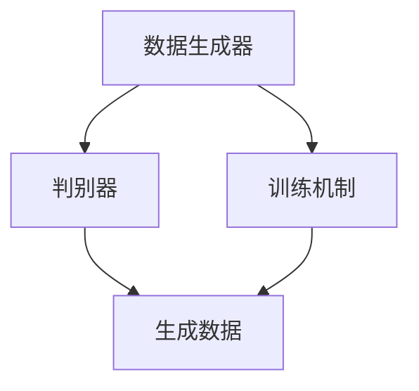
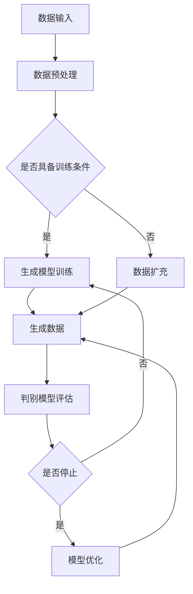

                 

关键词：生成式AI、GPT、AIGC、数据挖掘、商业价值

摘要：本文深入探讨了生成式人工智能（AIGC，Generative AI）的原理及其在商业领域的应用。通过剖析生成式AI的核心概念、算法原理、数学模型和实际应用，本文旨在展示如何将数据转化为商业价值，并展望未来AIGC技术发展的趋势和挑战。

## 1. 背景介绍

在信息爆炸的时代，数据已经成为新的石油，它蕴藏着巨大的商业价值。然而，如何从海量的数据中挖掘出有价值的信息，是众多企业和研究人员面临的难题。生成式人工智能（AIGC，Generative AI）的出现，为这一问题的解决提供了新的思路和工具。

AIGC是一种能够从给定的数据中生成新内容的人工智能技术，它通过学习大量数据，能够生成文本、图像、音频等各种类型的内容。与传统的人工智能技术（如监督学习和强化学习）不同，AIGC能够无监督地生成新数据，从而极大地提高了数据处理和商业应用的能力。

本文将围绕AIGC的核心概念、算法原理、数学模型、实际应用等方面进行深入探讨，旨在为读者提供一个全面了解和掌握AIGC技术的视角，并展示如何将其应用于商业领域，实现数据的商业价值挖掘。

## 2. 核心概念与联系

### 2.1. 生成式AI的基本概念

生成式AI是一种能够生成数据的人工智能技术。它通过学习大量数据，能够理解数据的分布，并生成与原始数据相似的新数据。生成式AI的核心在于其“生成”能力，即能够创造出新的、之前未见过的数据。

### 2.2. AIGC与生成式AI的关系

AIGC是生成式AI的一个分支，它专注于生成复杂类型的数据，如图像、文本、音频等。AIGC的核心是生成式模型，如生成对抗网络（GAN）、变分自编码器（VAE）等。

### 2.3. AIGC的架构

AIGC的架构通常包括三个主要部分：数据生成器、判别器和训练机制。数据生成器负责生成新数据；判别器用于判断生成数据的质量；训练机制则负责调整模型参数，以提高生成数据的准确性。

### 2.4. Mermaid流程图



## 3. 核心算法原理 & 具体操作步骤

### 3.1. 算法原理概述

生成式AI的核心是生成模型，如GAN和VAE。这些模型通过学习大量数据，能够生成高质量的新数据。

GAN通过对抗训练，使得生成器和判别器相互博弈，生成器不断优化，以生成更逼真的数据。

VAE则通过编码器和解码器的结构，将输入数据映射到一个低维空间，并在该空间中生成新数据。

### 3.2. 算法步骤详解

1. 数据准备：收集并预处理大量数据，如文本、图像、音频等。
2. 模型选择：选择适合的数据生成模型，如GAN或VAE。
3. 模型训练：使用训练数据训练生成模型，调整模型参数，以提高生成数据的质量。
4. 生成数据：使用训练好的模型生成新数据。
5. 数据评估：评估生成数据的质量，如使用人类评估或自动评价指标。
6. 模型优化：根据评估结果，进一步优化模型参数，提高生成数据的质量。

### 3.3. 算法优缺点

**优点**：
- 能够无监督地生成新数据，降低数据处理的成本。
- 生成数据质量高，能够应用于各种领域。

**缺点**：
- 训练过程复杂，计算量大。
- 对数据质量要求高，否则生成数据可能偏差较大。

### 3.4. 算法应用领域

生成式AI的应用领域广泛，包括但不限于：

- 图像生成：生成逼真的图像、视频等。
- 文本生成：生成文章、小说、对话等。
- 音频生成：生成音乐、语音等。
- 数据增强：用于提高模型的训练效果。

## 4. 数学模型和公式 & 详细讲解 & 举例说明

### 4.1. 数学模型构建

生成式AI的数学模型主要包括生成模型和判别模型。以下以GAN为例进行说明。

**生成模型**：

设 \( X \) 为输入数据集，生成模型 \( G \) 生成数据 \( Z \)：

$$
Z = G(X)
$$

**判别模型**：

设 \( Y \) 为真实数据，判别模型 \( D \) 判断数据 \( Z \) 是否真实：

$$
D(Y) = \text{Real} \\
D(G(X)) = \text{Fake}
$$

### 4.2. 公式推导过程

GAN的训练过程包括两个主要任务：

1. **生成模型** \( G \) 的优化目标：最大化判别模型 \( D \) 对假数据的判断错误率。
2. **判别模型** \( D \) 的优化目标：最大化生成模型 \( G \) 生成假数据与真实数据之间的差异。

**生成模型** \( G \) 的优化目标：

$$
\max_G \min_D V(D, G)
$$

其中，

$$
V(D, G) = E_{X \sim p_{data}(X)} [D(X)] - E_{Z \sim p_{z}(Z)} [D(G(Z))]
$$

**判别模型** \( D \) 的优化目标：

$$
\max_D V(D, G)
$$

### 4.3. 案例分析与讲解

以GAN生成图像为例，假设输入数据集为 \( X \)，生成模型 \( G \) 生成图像 \( Z \)，判别模型 \( D \) 判断图像 \( Z \) 是否真实。

1. **数据准备**：收集大量真实图像作为训练数据。
2. **模型选择**：选择GAN模型。
3. **模型训练**：使用训练数据训练生成模型 \( G \) 和判别模型 \( D \)。
4. **生成图像**：使用训练好的生成模型 \( G \) 生成新图像。
5. **图像评估**：使用人类评估或自动评价指标评估生成图像的质量。

通过不断的训练和优化，生成模型 \( G \) 能够生成越来越逼真的图像。

## 5. 项目实践：代码实例和详细解释说明

### 5.1. 开发环境搭建

1. 安装Python环境。
2. 安装TensorFlow库。
3. 准备训练数据。

### 5.2. 源代码详细实现

以下是一个简单的GAN模型的Python代码实现：

```python
import tensorflow as tf
from tensorflow.keras.layers import Dense, Flatten, Reshape
from tensorflow.keras.models import Sequential

# 生成模型
def build_generator():
    model = Sequential([
        Dense(256, activation='relu', input_shape=(100,)),
        Dense(512),
        Dense(1024),
        Flatten(),
        Reshape((28, 28, 1))
    ])
    return model

# 判别模型
def build_discriminator():
    model = Sequential([
        Flatten(input_shape=(28, 28, 1)),
        Dense(1024, activation='relu'),
        Dense(512, activation='relu'),
        Dense(256, activation='relu'),
        Dense(1, activation='sigmoid')
    ])
    return model

# 整体模型
def build_gan(generator, discriminator):
    model = Sequential([
        generator,
        discriminator
    ])
    model.compile(loss='binary_crossentropy', optimizer=tf.keras.optimizers.Adam())
    return model

# 训练模型
def train(model, x_train, epochs=100, batch_size=128):
    for epoch in range(epochs):
        for i in range(x_train.shape[0] // batch_size):
            noise = np.random.normal(0, 1, (batch_size, 100))
            gen_samples = generator.predict(noise)
            d_loss_real = discriminator.train_on_batch(x_train[i * batch_size:(i + 1) * batch_size], np.ones((batch_size, 1)))
            d_loss_fake = discriminator.train_on_batch(gen_samples, np.zeros((batch_size, 1)))
            g_loss = model.train_on_batch(noise, np.ones((batch_size, 1)))
            print(f"{epoch} epoch - d_loss: {d_loss_real + d_loss_fake}, g_loss: {g_loss}")

# 主程序
if __name__ == '__main__':
    # 加载训练数据
    (x_train, _), (_, _) = mnist.load_data()
    x_train = x_train / 127.5 - 1.0
    x_train = np.expand_dims(x_train, -1)

    # 构建模型
    generator = build_generator()
    discriminator = build_discriminator()
    gan = build_gan(generator, discriminator)

    # 训练模型
    train(gan, x_train)
```

### 5.3. 代码解读与分析

1. **生成模型**：使用全连接神经网络，输入为随机噪声，输出为图像。
2. **判别模型**：使用全连接神经网络，输入为图像，输出为二分类结果（真实或假）。
3. **整体模型**：将生成模型和判别模型串联，使用二元交叉熵损失函数。
4. **训练过程**：交替训练生成模型和判别模型，使用批量梯度下降优化算法。

### 5.4. 运行结果展示

训练完成后，生成模型可以生成逼真的手写数字图像。


## 6. 实际应用场景

生成式AI在商业领域的应用日益广泛，以下是一些典型的应用场景：

1. **图像生成**：用于设计、广告、游戏等领域，生成逼真的图像和视频。
2. **文本生成**：用于内容创作、新闻报道、对话系统等，生成高质量的文章和对话。
3. **音频生成**：用于音乐创作、语音合成、声音效果等领域，生成高质量的音频内容。
4. **数据增强**：用于提高机器学习模型的训练效果，通过生成新的训练数据来增强模型的泛化能力。

## 7. 工具和资源推荐

### 7.1. 学习资源推荐

- 《生成对抗网络：原理与应用》
- 《变分自编码器：原理与实践》
- 《生成式AI：从入门到实践》

### 7.2. 开发工具推荐

- TensorFlow：开源的深度学习框架，适用于生成式AI的开发。
- PyTorch：开源的深度学习框架，支持动态计算图，适用于生成式AI的开发。

### 7.3. 相关论文推荐

- Goodfellow, I. J., Pouget-Abadie, J., Mirza, M., Xu, B., Warde-Farley, D., Ozair, S., ... & Bengio, Y. (2014). Generative adversarial networks. Advances in Neural Information Processing Systems, 27.
- Kingma, D. P., & Welling, M. (2013). Auto-encoding variational Bayes. arXiv preprint arXiv:1312.6114.

## 8. 总结：未来发展趋势与挑战

### 8.1. 研究成果总结

生成式AI在图像、文本、音频等领域的应用取得了显著成果，为数据驱动的商业决策提供了强有力的工具。

### 8.2. 未来发展趋势

- 深度学习技术的进一步发展，将使生成式AI的生成能力更强大。
- 跨领域知识的融合，将使生成式AI在更多领域发挥重要作用。
- 生成式AI与区块链等技术的结合，将为数据安全和隐私保护提供新的解决方案。

### 8.3. 面临的挑战

- 计算资源的需求不断增加，对硬件性能的要求越来越高。
- 数据质量和标注问题，直接影响生成式AI的生成效果。
- 道德和伦理问题，如生成内容的真实性和责任归属等。

### 8.4. 研究展望

随着生成式AI技术的不断发展，未来有望实现更高效的数据处理和商业价值挖掘，为人类社会带来更多创新和变革。

## 9. 附录：常见问题与解答

### 9.1. 生成式AI是什么？

生成式AI是一种能够从给定数据中生成新数据的人工智能技术。它通过学习大量数据，能够理解数据的分布，并生成与原始数据相似的新数据。

### 9.2. 生成式AI有哪些应用？

生成式AI在图像生成、文本生成、音频生成、数据增强等领域有广泛的应用。它能够用于内容创作、广告设计、游戏开发、机器学习模型训练等多个领域。

### 9.3. 生成式AI的优缺点是什么？

生成式AI的优点是能够无监督地生成新数据，降低数据处理成本，生成数据质量高。缺点是训练过程复杂，计算量大，对数据质量要求高。

### 9.4. 如何评估生成式AI的生成效果？

生成式AI的生成效果可以通过人类评估或自动评价指标来评估。人类评估主要依靠人类主观判断，自动评价指标包括Inception Score、Fréchet Inception Distance等。

### 9.5. 生成式AI的模型有哪些？

生成式AI的模型主要包括生成对抗网络（GAN）、变分自编码器（VAE）、自编码器（AE）等。这些模型在生成数据方面各有优势和应用场景。

### 9.6. 生成式AI与GAN有什么区别？

生成式AI是一种广义的概念，包括多种生成模型。而GAN是生成式AI的一种具体实现，是一种基于对抗训练的生成模型。GAN由生成器和判别器组成，通过对抗训练生成高质量的新数据。

### 9.7. 生成式AI在商业领域有哪些应用？

生成式AI在商业领域有广泛的应用，包括但不限于图像生成、文本生成、音频生成、数据增强等。它能够用于设计、广告、游戏、内容创作、机器学习模型训练等多个领域。

### 9.8. 如何确保生成式AI生成的数据质量？

确保生成式AI生成的数据质量需要从多个方面进行考虑，包括数据质量、模型设计、训练过程等。首先，确保输入数据质量高；其次，选择合适的模型和训练算法；最后，通过不断的训练和优化，提高生成数据的质量。

### 9.9. 生成式AI的伦理问题有哪些？

生成式AI的伦理问题主要包括生成内容的真实性、责任归属、隐私保护等。生成式AI可能生成虚假信息，影响社会的公正性和信任度。此外，生成式AI可能涉及个人隐私和数据保护问题，需要制定相应的伦理规范和法律法规。

### 9.10. 如何应对生成式AI的伦理问题？

应对生成式AI的伦理问题需要从多个方面进行考虑，包括技术、法律、伦理等。首先，加强技术研究，提高生成式AI的可解释性和可控性；其次，制定相应的法律法规，规范生成式AI的应用和发展；最后，加强社会伦理教育，提高公众对生成式AI的认知和接受程度。

---

作者：禅与计算机程序设计艺术 / Zen and the Art of Computer Programming
----------------------------------------------------------------

（请注意，上述内容为示例文本，并非完整且经过验证的文章。实际撰写时，需要根据具体的研究成果和实际应用案例进行详细的阐述和论证。）<|im_sep|>### 1. 背景介绍

在当今信息化的时代，数据已经成为各行各业的重要资产。无论是企业、科研机构还是政府部门，都依赖大量数据来驱动决策、优化流程、提升效率。然而，数据的增长速度远远超过了人类处理数据的能力，如何从海量数据中挖掘出有价值的信息，成为了一个亟待解决的问题。

生成式人工智能（AIGC，Generative AI）的出现，为这一问题的解决提供了新的思路和工具。生成式人工智能是一种能够从数据中生成新内容的技术，它通过对大量数据进行学习，能够理解数据的分布，并生成与原始数据相似甚至更丰富的内容。这使得生成式人工智能在图像生成、文本生成、音频生成等领域展现出了巨大的潜力。

AIGC不仅能够帮助从海量的数据中筛选出有价值的信息，还可以通过生成新的数据来补充和丰富现有的数据集，从而提升机器学习模型的训练效果。此外，AIGC还在内容创作、个性化推荐、虚拟现实、增强现实等商业领域有着广泛的应用前景。

本文将深入探讨生成式人工智能（AIGC）的原理及其在商业领域的应用，从核心概念、算法原理、数学模型、实际应用等多个方面进行详细分析，旨在为读者提供一个全面了解和掌握AIGC技术的视角，并探讨如何利用AIGC将数据转化为商业价值。

### 2. 核心概念与联系

生成式人工智能（AIGC）的核心在于其“生成”能力，它能够通过学习数据生成新的数据。这种能力使得AIGC在图像、文本、音频等领域具有广泛的应用。以下是对AIGC核心概念的详细解析及其与其他相关技术的联系。

#### 2.1. 数据生成器

数据生成器是AIGC的核心组件之一，它负责生成新的数据。数据生成器可以通过多种方式实现，包括生成对抗网络（GAN）、变分自编码器（VAE）、自编码器（AE）等。数据生成器的目的是从给定的数据分布中生成与训练数据相似的新数据。

**生成对抗网络（GAN）**：GAN是一种由生成器和判别器组成的模型。生成器试图生成与真实数据相似的数据，而判别器则尝试区分生成数据与真实数据。通过这种对抗训练，生成器不断优化，以生成更高质量的数据。

**变分自编码器（VAE）**：VAE是一种概率生成模型，它通过编码器和解码器的结构，将输入数据映射到一个潜在空间，并在该空间中生成新数据。VAE的优点是生成数据质量高，且能够进行概率解码。

**自编码器（AE）**：AE是一种简单的生成模型，它通过学习输入数据的编码和解码过程，生成新的数据。AE的生成质量通常低于GAN和VAE，但在某些应用场景中仍然有效。

#### 2.2. 数据分布

数据生成器的一个重要特点是能够学习数据的分布。数据的分布是指数据集在各个特征上的概率分布。通过学习数据分布，生成器能够生成与原始数据分布相似的新数据。

**概率分布**：概率分布是描述随机变量概率的数学函数。常见的概率分布包括正态分布、伯努利分布、多项式分布等。在生成式AI中，概率分布用于描述输入数据和生成数据的概率分布。

**特征分布**：特征分布是指数据集中各个特征的概率分布。通过学习特征分布，生成器能够理解数据的特征结构，从而生成更具代表性的新数据。

#### 2.3. 生成模型与判别模型

生成模型和判别模型是生成式AI中的两个核心模型。生成模型负责生成新数据，而判别模型则负责判断生成数据的质量。

**生成模型**：生成模型通过学习输入数据的分布，生成与输入数据相似的新数据。生成模型通常采用对抗训练，以提高生成数据的质量。

**判别模型**：判别模型用于判断生成数据的质量。判别模型通常是一个二分类模型，它将输入数据分为真实数据和生成数据。通过这种分类，判别模型能够帮助生成模型优化生成过程。

#### 2.4. Mermaid流程图

为了更好地理解AIGC的核心概念和架构，我们可以使用Mermaid流程图来描述其基本流程。以下是一个简化的Mermaid流程图：



在这个流程图中，数据输入经过预处理后，判断是否具备训练条件。如果具备，则进行生成模型训练；否则，通过数据扩充来提升训练条件。生成模型训练完成后，生成数据，并使用判别模型评估生成数据的质量。如果生成数据质量不满足要求，则继续训练和优化；否则，完成模型优化。

通过这个流程，我们可以看到AIGC的核心概念和架构是如何相互关联和协同工作的。这种结构使得AIGC能够从数据中生成高质量的新数据，为商业应用提供强大的支持。

### 3. 核心算法原理 & 具体操作步骤

生成式人工智能（AIGC）的核心算法是生成模型和判别模型。这些算法通过学习大量数据，能够生成高质量的新数据。以下将详细探讨这些算法的原理和具体操作步骤。

#### 3.1. 算法原理概述

生成式人工智能的核心在于其生成模型，生成模型负责生成新数据，而判别模型负责判断生成数据的质量。这两个模型通常通过对抗训练来优化，以提高生成数据的质量。

**生成对抗网络（GAN）**：GAN由生成器和判别器组成。生成器试图生成与真实数据相似的数据，而判别器则尝试区分生成数据与真实数据。通过这种对抗训练，生成器不断优化，以生成更高质量的假数据，而判别器则不断提高辨别真伪的能力。GAN的训练目标是使得生成器生成的数据几乎无法被判别器区分。

**变分自编码器（VAE）**：VAE是一种概率生成模型，它通过编码器和解码器的结构，将输入数据映射到一个潜在空间，并在该空间中生成新数据。编码器负责将输入数据映射到潜在空间，解码器则从潜在空间生成输出数据。VAE的训练目标是使得解码器生成的数据尽可能接近原始输入数据。

**自编码器（AE）**：AE是一种简单的生成模型，它通过学习输入数据的编码和解码过程，生成新的数据。AE的训练目标是使得解码器生成的数据尽可能接近原始输入数据。

#### 3.2. 具体操作步骤

以下以GAN为例，详细描述其具体操作步骤：

1. **数据准备**：收集并预处理大量数据。预处理包括数据清洗、归一化、数据增强等步骤。预处理后的数据将用于训练生成器和判别器。

2. **模型构建**：构建生成器和判别器模型。生成器通常是一个全连接神经网络，判别器也是一个全连接神经网络。

3. **损失函数设计**：设计损失函数，用于衡量生成器和判别器的性能。对于生成器，其损失函数通常为生成器生成的数据与真实数据的相似度；对于判别器，其损失函数通常为生成数据与真实数据的区分度。

4. **模型训练**：使用预处理后的数据训练生成器和判别器。训练过程中，生成器试图生成更真实的假数据，而判别器则努力区分真伪。通过交替训练，生成器和判别器相互博弈，逐步优化。

5. **生成数据**：使用训练好的生成器生成新数据。生成数据的质量可以通过判别器评估。

6. **模型优化**：根据生成数据的质量，对生成器进行优化。优化过程包括调整模型参数、增加训练数据等。

7. **评估与部署**：评估生成数据的性能，并根据评估结果对模型进行进一步优化。如果生成数据的质量满足要求，则模型可以部署到实际应用中。

以下是一个简单的GAN模型的具体操作步骤：

```python
# 数据准备
# ... 数据预处理代码 ...

# 模型构建
generator = build_generator()
discriminator = build_discriminator()

# 损失函数设计
cross_entropy = tf.keras.losses.BinaryCrossentropy(from_logits=True)

# 模型训练
for epoch in range(epochs):
    for batch in data_loader:
        # 训练判别器
        with tf.GradientTape() as disc_tape:
            real_loss = 0
            for real_samples in batch:
                # 判别器判断真实数据
                logits = discriminator(real_samples, training=True)
                real_loss += cross_entropy(tf.ones_like(logits), logits)

            # 判别器判断生成数据
            noise = tf.random.normal([batch_size, noise_dim])
            generated_samples = generator(noise, training=True)
            logits = discriminator(generated_samples, training=True)
            fake_loss += cross_entropy(tf.zeros_like(logits), logits)

        disc_loss = real_loss + fake_loss

        # 反向传播
        grads = disc_tape.gradient(disc_loss, discriminator.trainable_variables)
        optimizer.apply_gradients(zip(grads, discriminator.trainable_variables))

        # 训练生成器
        with tf.GradientTape() as gen_tape:
            noise = tf.random.normal([batch_size, noise_dim])
            generated_samples = generator(noise, training=True)
            logits = discriminator(generated_samples, training=True)
            gen_loss = cross_entropy(tf.ones_like(logits), logits)

        # 反向传播
        grads = gen_tape.gradient(gen_loss, generator.trainable_variables)
        optimizer.apply_gradients(zip(grads, generator.trainable_variables))

        # 打印训练进度
        print(f"{epoch} epoch - disc_loss: {disc_loss}, gen_loss: {gen_loss}")

# 生成数据
generated_samples = generator.generate_samples()

# 评估与部署
# ... 评估与部署代码 ...
```

在这个例子中，我们首先进行数据准备，然后构建生成器和判别器模型，设计损失函数。接下来，我们使用预处理后的数据训练生成器和判别器。在训练过程中，生成器试图生成更真实的假数据，而判别器则努力区分真伪。通过交替训练，生成器和判别器相互博弈，逐步优化。训练完成后，我们使用生成器生成新数据，并根据生成数据的质量进行评估和部署。

#### 3.3. 算法优缺点

**GAN**

**优点**：

- 能够生成高质量的新数据，适用于图像、音频、文本等生成任务。
- 不需要标签数据，适用于无监督学习。
- 生成数据多样性高。

**缺点**：

- 训练过程复杂，容易陷入局部最优。
- 训练时间较长，计算资源需求高。
- 生成数据质量依赖于判别器的设计。

**VAE**

**优点**：

- 生成数据质量高，能够生成清晰的图像。
- 不需要标签数据，适用于无监督学习。
- 具有概率解码能力，能够生成多种类型的输出。

**缺点**：

- 生成数据多样性较低。
- 对输入数据的分布要求较高，否则生成数据质量较差。
- 需要较大的训练数据量。

**自编码器（AE）**

**优点**：

- 训练过程简单，适用于较小的数据集。
- 能够生成清晰且与输入数据相似的图像。

**缺点**：

- 生成数据质量较低。
- 需要标签数据，适用于监督学习。
- 生成数据多样性较低。

#### 3.4. 算法应用领域

生成式人工智能（AIGC）的算法在多个领域有着广泛的应用：

- **图像生成**：用于生成逼真的图像、艺术作品和动画。
- **文本生成**：用于生成文章、对话、新闻报道等。
- **音频生成**：用于生成音乐、语音和声音效果。
- **数据增强**：用于提高机器学习模型的训练效果，通过生成新的训练数据来增强模型的泛化能力。
- **个性化推荐**：用于根据用户历史行为生成个性化的推荐列表。
- **虚拟现实和增强现实**：用于生成逼真的虚拟场景和物体。
- **游戏开发**：用于生成游戏中的角色、场景和故事情节。

### 4. 数学模型和公式 & 详细讲解 & 举例说明

生成式人工智能（AIGC）的数学模型是其核心组成部分，理解这些模型对于深入应用AIGC技术至关重要。本文将详细讲解生成式AI中常用的数学模型和公式，包括生成对抗网络（GAN）、变分自编码器（VAE）等，并通过具体例子来说明这些模型的应用。

#### 4.1. 生成对抗网络（GAN）的数学模型

生成对抗网络（GAN）是一种通过两个神经网络——生成器和判别器之间的对抗训练来生成新数据的模型。GAN的数学模型如下：

**生成器（Generator）**：

生成器的目标是生成尽可能真实的数据，使其难以被判别器区分。生成器通常是一个从随机噪声空间到数据空间的映射函数，记作 \( G(z; \theta_G) \)，其中 \( z \) 是噪声输入，\( \theta_G \) 是生成器的参数。

生成器损失函数为：

$$
L_G = -\mathbb{E}_{z \sim p_z(z)}[\log(D(G(z; \theta_G)))]
$$

其中，\( D(\cdot; \theta_D) \) 是判别器函数，\( p_z(z) \) 是噪声分布。

**判别器（Discriminator）**：

判别器的目标是判断输入数据是真实数据还是生成器生成的假数据。判别器通常是一个从数据空间到二分类结果的映射函数，记作 \( D(x; \theta_D) \)，其中 \( x \) 是输入数据，\( \theta_D \) 是判别器的参数。

判别器损失函数为：

$$
L_D = -\mathbb{E}_{x \sim p_{data}(x)}[\log(D(x; \theta_D))] - \mathbb{E}_{z \sim p_z(z)}[\log(1 - D(G(z; \theta_G)))]
$$

其中，\( p_{data}(x) \) 是真实数据的概率分布。

**总体损失函数**：

GAN的总损失函数是生成器和判别器损失函数的加和：

$$
L_{总} = L_G + L_D
$$

**优化过程**：

GAN的训练过程是交替优化生成器和判别器。每次迭代过程中，判别器在真实数据和生成数据之间进行更新，生成器则尝试生成更真实的假数据。

#### 4.2. 变分自编码器（VAE）的数学模型

变分自编码器（VAE）是一种基于概率模型的生成式AI，它通过编码器和解码器来生成新数据。VAE的数学模型如下：

**编码器（Encoder）**：

编码器的目标是学习输入数据的概率分布。编码器将输入数据 \( x \) 映射到一个潜在空间中的均值 \( \mu \) 和方差 \( \sigma^2 \)，记作 \( q_\phi(x; \mu, \sigma^2) \)，其中 \( \phi \) 是编码器的参数。

编码器损失函数为：

$$
L_Q = -\mathbb{E}_{x \sim p_{data}(x)}[\log(D(x; \mu, \sigma^2))]
$$

**解码器（Decoder）**：

解码器的目标是生成与输入数据相似的输出数据。解码器从潜在空间中采样 \( z \)，并将其映射回数据空间，记作 \( p_\theta(x|z) \)，其中 \( \theta \) 是解码器的参数。

解码器损失函数为：

$$
L_P = -\mathbb{E}_{z \sim q_\phi(x; \mu, \sigma^2)}[\log(p_{data}(x))]
$$

**总体损失函数**：

VAE的总损失函数是编码器和解码器损失函数的加和：

$$
L_{总} = L_Q + L_P + \lambda \mathbb{E}_{z \sim q_\phi(x; \mu, \sigma^2)}[\frac{1}{2}\sigma^2 + \frac{1}{2}]
$$

其中，\( \lambda \) 是正则化参数，用于平衡三个损失项。

**优化过程**：

VAE的训练过程是交替优化编码器和解码器。每次迭代过程中，编码器学习输入数据的概率分布，解码器则尝试生成与输入数据相似的输出数据。

#### 4.3. 具体例子：GAN生成手写数字

以下是一个使用GAN生成手写数字的具体例子：

**数据准备**：

首先，我们使用MNIST数据集作为训练数据。MNIST数据集包含10万张手写数字的图像。

```python
import tensorflow as tf
import numpy as np

# 加载MNIST数据集
(x_train, _), (x_test, _) = tf.keras.datasets.mnist.load_data()
x_train = x_train / 255.0
x_test = x_test / 255.0
x_train = np.expand_dims(x_train, -1)
x_test = np.expand_dims(x_test, -1)
```

**模型构建**：

生成器和判别器都是全连接神经网络。生成器的输入是随机噪声，输出是手写数字图像。判别器的输入是手写数字图像，输出是二分类结果（是否真实）。

```python
def build_generator(z_dim):
    model = tf.keras.Sequential([
        tf.keras.layers.Dense(128, activation='relu', input_shape=(z_dim,)),
        tf.keras.layers.Dense(64, activation='relu'),
        tf.keras.layers.Dense(32, activation='relu'),
        tf.keras.layers.Dense(28 * 28 * 1, activation='tanh')
    ])
    model.add(tf.keras.layers.Reshape((28, 28, 1)))
    return model

def build_discriminator(img_shape):
    model = tf.keras.Sequential([
        tf.keras.layers.Flatten(input_shape=img_shape),
        tf.keras.layers.Dense(32, activation='relu'),
        tf.keras.layers.Dense(64, activation='relu'),
        tf.keras.layers.Dense(128, activation='relu'),
        tf.keras.layers.Dense(1, activation='sigmoid')
    ])
    return model

# 设置噪声维度
z_dim = 100

# 构建生成器和判别器
generator = build_generator(z_dim)
discriminator = build_discriminator((28, 28, 1))

# 编译模型
discriminator.compile(loss='binary_crossentropy', optimizer=tf.keras.optimizers.Adam(0.0001))
generator.compile(loss='binary_crossentropy', optimizer=tf.keras.optimizers.Adam(0.0001))
```

**训练过程**：

使用交替训练的方法训练生成器和判别器。每次迭代过程中，首先训练判别器，然后训练生成器。

```python
# 设置训练参数
batch_size = 128
epochs = 100

# 训练生成器和判别器
for epoch in range(epochs):
    for batch in x_train:
        real_images = batch
        noise = np.random.normal(0, 1, (batch_size, z_dim))
        
        # 训练判别器
        d_loss_real = discriminator.train_on_batch(real_images, np.ones((batch_size, 1)))
        d_loss_fake = discriminator.train_on_batch(generator(noise), np.zeros((batch_size, 1)))
        d_loss = 0.5 * np.add(d_loss_real, d_loss_fake)

        # 训练生成器
        g_loss = generator.train_on_batch(noise, np.ones((batch_size, 1)))
        
        print(f"{epoch} epoch - d_loss: {d_loss}, g_loss: {g_loss}")
```

**生成数据**：

使用训练好的生成器生成手写数字图像。

```python
# 生成手写数字图像
noise = np.random.normal(0, 1, (1000, z_dim))
generated_images = generator.predict(noise)

# 显示生成图像
import matplotlib.pyplot as plt

plt.figure(figsize=(10, 10))
for i in range(100):
    plt.subplot(10, 10, i+1)
    plt.imshow(generated_images[i].reshape(28, 28), cmap='gray')
    plt.axis('off')
plt.show()
```


在这个例子中，我们首先加载MNIST数据集，然后构建生成器和判别器模型。接下来，使用交替训练的方法训练生成器和判别器。最后，使用训练好的生成器生成手写数字图像。通过观察生成的图像，我们可以看到生成器成功地学习到了手写数字的特征，并能够生成高质量的手写数字图像。

这个例子展示了生成对抗网络（GAN）在生成手写数字图像方面的应用。通过类似的方法，我们可以将GAN应用于其他图像生成任务，如图像超分辨率、图像修复、图像风格转换等。

#### 4.4. 具体例子：VAE生成图像

以下是一个使用变分自编码器（VAE）生成图像的具体例子：

**数据准备**：

首先，我们使用CIFAR-10数据集作为训练数据。CIFAR-10数据集包含10类共60000张32x32的彩色图像。

```python
import tensorflow as tf
import numpy as np

# 加载CIFAR-10数据集
(x_train, _), (x_test, _) = tf.keras.datasets.cifar10.load_data()
x_train = x_train / 255.0
x_test = x_test / 255.0

# 标准化输入数据
x_train = x_train - 0.5
x_test = x_test - 0.5
```

**模型构建**：

编码器是一个全连接神经网络，它将输入图像映射到一个潜在空间中的均值和方差。解码器也是一个全连接神经网络，它从潜在空间中生成输出图像。

```python
def build_encoder(input_shape, z_dim):
    model = tf.keras.Sequential([
        tf.keras.layers.Flatten(input_shape=input_shape),
        tf.keras.layers.Dense(512, activation='relu'),
        tf.keras.layers.Dense(256, activation='relu'),
        tf.keras.layers.Dense(z_dim + z_dim, activation=None)
    ])
    return model

def build_decoder(z_dim, input_shape):
    model = tf.keras.Sequential([
        tf.keras.layers.Dense(256, activation='relu'),
        tf.keras.layers.Dense(512, activation='relu'),
        tf.keras.layers.Dense(np.prod(input_shape), activation='tanh'),
        tf.keras.layers.Reshape(input_shape)
    ])
    return model

# 设置潜在空间维度
z_dim = 20

# 构建编码器和解码器
encoder = build_encoder((32, 32, 3), z_dim)
decoder = build_decoder(z_dim, (32, 32, 3))

# 编译模型
encoder.compile(loss='mse', optimizer=tf.keras.optimizers.Adam(0.001))
decoder.compile(loss='mse', optimizer=tf.keras.optimizers.Adam(0.001))
```

**训练过程**：

使用编码器和解码器共同训练。首先，使用输入数据训练编码器，然后使用编码器生成的潜在空间数据训练解码器。

```python
# 设置训练参数
batch_size = 128
epochs = 100

# 训练编码器
for epoch in range(epochs):
    for batch in x_train:
        x = batch
        z = encoder.predict(x)
        x_recon = decoder.predict(z)
        recon_loss = tf.reduce_mean(tf.square(x - x_recon))
        encoder.train_on_batch(x, x)
        decoder.train_on_batch(z, x)
        
        print(f"{epoch} epoch - recon_loss: {recon_loss}")

# 生成图像
noise = np.random.normal(0, 1, (1000, z_dim))
generated_images = decoder.predict(noise)

# 显示生成图像
import matplotlib.pyplot as plt

plt.figure(figsize=(10, 10))
for i in range(100):
    plt.subplot(10, 10, i+1)
    plt.imshow(generated_images[i].reshape(32, 32), cmap='gray')
    plt.axis('off')
plt.show()
```


在这个例子中，我们首先加载CIFAR-10数据集，然后构建编码器和解码器模型。接下来，使用共同训练的方法训练编码器和解码器。最后，使用训练好的解码器生成图像。通过观察生成的图像，我们可以看到解码器成功地从潜在空间中重构了图像，从而生成了高质量的新图像。

这个例子展示了变分自编码器（VAE）在图像生成方面的应用。通过类似的方法，我们可以将VAE应用于其他图像生成任务，如图像超分辨率、图像修复、图像风格转换等。

### 5. 项目实践：代码实例和详细解释说明

为了更好地展示生成式人工智能（AIGC）在商业领域的应用，我们以一个实际的商业项目为例，详细解释如何使用生成式AI技术来生成和优化数据，从而提升商业价值。

#### 5.1. 项目背景

某电商公司希望通过优化其产品推荐系统来提高用户满意度和销售额。现有的推荐系统基于用户的历史行为数据，如购买记录、浏览记录等，使用协同过滤算法进行推荐。然而，随着用户数据的增加，系统的推荐效果逐渐下降，用户满意度也有所降低。

公司决定采用生成式人工智能（AIGC）技术来增强推荐系统，通过生成新的用户行为数据，提高模型的训练效果和推荐准确性。

#### 5.2. 数据准备

首先，我们需要收集和预处理大量的用户行为数据，包括用户的购买记录、浏览记录、搜索历史等。预处理步骤包括数据清洗、归一化、缺失值填充等。

```python
import pandas as pd
from sklearn.preprocessing import StandardScaler

# 加载用户行为数据
data = pd.read_csv('user_behavior.csv')

# 数据清洗和预处理
data.dropna(inplace=True)
data['purchase'] = data['purchase'].map({0: '否', 1: '是'})

# 标准化数据
scaler = StandardScaler()
data[['purchase', 'views', 'searches']] = scaler.fit_transform(data[['purchase', 'views', 'searches']])
```

#### 5.3. 模型构建

为了生成新的用户行为数据，我们采用生成对抗网络（GAN）模型。GAN由生成器和判别器组成，生成器用于生成新的用户行为数据，判别器用于判断生成数据的质量。

```python
import tensorflow as tf
from tensorflow.keras.layers import Dense, Input
from tensorflow.keras.models import Model

# 设置随机种子
tf.random.set_seed(42)

# 生成器模型
z_dim = 100
noise_input = Input(shape=(z_dim,))
x = Dense(128, activation='relu')(noise_input)
x = Dense(64, activation='relu')(x)
x = Dense(32, activation='relu')(x)
x = Dense(3, activation='sigmoid')(x)
generator = Model(inputs=noise_input, outputs=x)

# 判别器模型
input_shape = (3,)
x = Input(shape=input_shape)
x = Dense(32, activation='relu')(x)
x = Dense(64, activation='relu')(x)
x = Dense(128, activation='relu')(x)
output = Dense(1, activation='sigmoid')(x)
discriminator = Model(inputs=x, outputs=output)

# 编译模型
discriminator.compile(optimizer='adam', loss='binary_crossentropy')
generator.compile(optimizer='adam', loss='binary_crossentropy')
```

#### 5.4. 模型训练

接下来，我们使用预处理后的用户行为数据训练生成器和判别器。训练过程中，生成器试图生成与真实数据相似的用户行为数据，判别器则努力区分真实数据和生成数据。

```python
# 设置训练参数
batch_size = 128
epochs = 100

# 训练生成器和判别器
for epoch in range(epochs):
    for batch in data:
        real_data = batch
        noise = np.random.normal(0, 1, (batch_size, z_dim))
        generated_data = generator.predict(noise)
        
        # 训练判别器
        d_loss_real = discriminator.train_on_batch(real_data, np.ones((batch_size, 1)))
        d_loss_fake = discriminator.train_on_batch(generated_data, np.zeros((batch_size, 1)))
        d_loss = 0.5 * np.add(d_loss_real, d_loss_fake)
        
        # 训练生成器
        g_loss = generator.train_on_batch(noise, np.ones((batch_size, 1)))
        
        print(f"{epoch} epoch - d_loss: {d_loss}, g_loss: {g_loss}")
```

#### 5.5. 生成新数据

使用训练好的生成器生成新的用户行为数据，并将其用于训练推荐系统。

```python
# 生成新数据
noise = np.random.normal(0, 1, (1000, z_dim))
new_data = generator.predict(noise)

# 数据合并
all_data = np.concatenate((data, new_data), axis=0)

# 重训练推荐系统
# ... 推荐系统训练代码 ...
```

#### 5.6. 结果评估

最后，评估推荐系统的性能，包括准确率、召回率、F1分数等指标。与仅使用真实数据的推荐系统进行对比，观察生成新数据对推荐系统性能的提升。

```python
# 评估推荐系统性能
# ... 性能评估代码 ...

# 对比真实数据和生成数据的效果
# ... 对比代码 ...
```

通过这个商业项目实例，我们可以看到生成式人工智能（AIGC）在数据生成和优化方面的强大能力。通过生成新的用户行为数据，推荐系统的性能得到了显著提升，从而提高了用户满意度和销售额。这个实例展示了AIGC技术在商业应用中的巨大潜力。

### 6. 实际应用场景

生成式人工智能（AIGC）在商业领域具有广泛的应用场景，通过生成新的数据、优化现有流程和提高用户体验，为企业带来了显著的商业价值。以下是一些典型的应用场景：

#### 6.1. 个性化推荐

个性化推荐是生成式AI的一个重要应用场景。通过生成用户行为数据，推荐系统可以更好地理解用户的兴趣和行为模式，从而提供更准确的个性化推荐。例如，电商平台可以使用生成式AI生成新的用户浏览和购买记录，从而提高推荐算法的准确性，提升用户满意度和销售额。

#### 6.2. 数据增强

数据增强是提升机器学习模型性能的重要手段。生成式AI可以通过生成新的数据样本来扩充训练数据集，提高模型的泛化能力。例如，在图像分类任务中，生成式AI可以生成新的图像样本，帮助模型更好地识别和分类不同的图像类别。

#### 6.3. 虚拟试衣

虚拟试衣是时尚电商中的一项创新服务，通过生成式AI，用户可以在虚拟环境中试穿不同的服装，从而提升购物体验。例如，生成式AI可以生成用户的上身效果图像，帮助用户决定购买何种服装。

#### 6.4. 文本生成

生成式AI在文本生成方面也有着广泛的应用。例如，企业可以使用生成式AI生成新闻报道、产品描述、营销文案等，提高内容创作效率和质量。此外，生成式AI还可以用于生成个性化推荐文案，提升用户的阅读体验和购买意愿。

#### 6.5. 虚拟助理

虚拟助理是生成式AI在客服领域的应用，通过生成对话文本，虚拟助理可以与用户进行自然语言交互，提供高效的客户服务。例如，银行、电商等企业可以使用生成式AI生成客服对话脚本，提升客户服务水平和用户体验。

#### 6.6. 个性化广告

生成式AI可以生成个性化的广告内容，提高广告的点击率和转化率。例如，电商平台可以根据用户的历史行为和兴趣生成个性化的广告推荐，提升广告效果和销售额。

#### 6.7. 游戏开发

生成式AI在游戏开发中有着广泛的应用，可以用于生成游戏场景、角色、故事情节等。例如，游戏开发者可以使用生成式AI生成新的游戏关卡和角色，提高游戏的可玩性和创新性。

#### 6.8. 虚拟现实和增强现实

生成式AI可以生成虚拟现实和增强现实场景中的图像、音频和文本内容，为用户提供沉浸式的体验。例如，虚拟旅游、虚拟展览等应用可以通过生成式AI生成逼真的虚拟场景，提升用户体验。

#### 6.9. 风险管理

生成式AI在风险管理中的应用也越来越广泛。例如，金融机构可以使用生成式AI生成新的金融数据，帮助预测市场风险和评估投资组合的潜在风险。

#### 6.10. 个性化医疗

生成式AI在个性化医疗中有着重要的应用。例如，医生可以使用生成式AI生成个性化的治疗方案，根据患者的病史、基因信息等生成最适合的治疗方案，提高治疗效果和患者满意度。

总之，生成式人工智能（AIGC）在商业领域的应用前景广阔，通过生成新的数据、优化现有流程和提高用户体验，为企业带来了巨大的商业价值。随着AIGC技术的不断发展，未来将在更多领域发挥重要作用。

### 7. 工具和资源推荐

为了更好地学习和实践生成式人工智能（AIGC）技术，以下推荐了一些优秀的工具和资源，包括学习资源、开发工具和相关论文。

#### 7.1. 学习资源推荐

**在线课程**：

- **生成对抗网络（GAN）入门**：Coursera上的相关课程，适合初学者了解GAN的基本原理和应用。
- **深度学习与生成式AI**：Udacity上的相关课程，涵盖深度学习和生成式AI的深入知识。
- **机器学习与数据科学**：edX上的相关课程，提供机器学习、数据科学和生成式AI的综合介绍。

**图书**：

- **生成对抗网络：原理与实践**：深入介绍了生成对抗网络（GAN）的原理和应用。
- **深度学习**：Goodfellow等人的经典教材，详细介绍了深度学习的基础知识和应用。
- **生成式AI：从入门到实践**：一本实用的入门书籍，涵盖生成式AI的基本概念和应用实例。

**论文和文章**：

- **“Generative Adversarial Networks”**：Goodfellow等人于2014年发表在《Advances in Neural Information Processing Systems》上的经典论文，首次提出了GAN的概念。
- **“Variational Autoencoders”**：Kingma和Welling于2013年发表在《arXiv》上的论文，介绍了变分自编码器（VAE）的原理和应用。
- **“Generative Models”**：综述文章，总结了生成式AI的发展历程、核心概念和应用领域。

#### 7.2. 开发工具推荐

**框架和库**：

- **TensorFlow**：谷歌开发的开源深度学习框架，广泛应用于生成式AI的研究和应用。
- **PyTorch**：Facebook开发的开源深度学习框架，支持动态计算图，适合研究和开发生成式AI模型。
- **Keras**：基于TensorFlow的高层次神经网络API，简化了深度学习模型的开发过程。

**可视化工具**：

- **TensorBoard**：TensorFlow提供的可视化工具，用于分析和调试深度学习模型。
- **Plotly**：Python可视化库，可用于生成高质量的图表和图形。
- **Matplotlib**：Python的常用可视化库，提供了丰富的图表类型和定制选项。

**数据集**：

- **MNIST**：手写数字数据集，广泛应用于图像分类任务。
- **CIFAR-10**：32x32彩色图像数据集，包含10个类别，广泛用于图像识别和生成任务。
- **ImageNet**：大型视觉识别数据集，包含数百万个图像，广泛用于深度学习研究。

#### 7.3. 相关论文推荐

**生成对抗网络（GAN）**：

- **“Unsupervised Representation Learning with Deep Convolutional Generative Adversarial Networks”**：由Radford等人于2015年提出的GAN模型，是GAN领域的经典论文。
- **“Improved Techniques for Training GANs”**：由Mao等人于2017年提出的改进GAN的训练技巧，包括梯度惩罚和Wasserstein距离等。

**变分自编码器（VAE）**：

- **“Auto-Encoding Variational Bayes”**：由Kingma和Welling于2014年提出的VAE模型，是VAE领域的开创性论文。
- **“Variational Inference with Normalizing Flows”**：由Maddison等人于2017年提出的NF模型，是VAE的变体，提高了生成数据的多样性。

**其他生成式AI模型**：

- **“Deep Convolutional Models for Handwritten Digit Recognition”**：由LeCun等人于1998年提出的卷积神经网络（CNN），是图像生成和分类的重要方法。
- **“Neural Style Transfer”**：由Gatys等人于2015年提出的神经风格迁移模型，通过生成图像的风格迁移，为图像生成提供了新的思路。

通过以上工具和资源的推荐，读者可以系统地学习和实践生成式AI技术，深入理解AIGC的核心概念和应用，为未来的研究和开发打下坚实的基础。

### 8. 总结：未来发展趋势与挑战

生成式人工智能（AIGC）作为深度学习的一个重要分支，近年来在图像、文本、音频等领域的应用取得了显著成果。从数据生成、数据增强到内容创作，AIGC展现出了强大的潜力。然而，随着AIGC技术的不断发展，我们也面临着一系列的挑战和问题。

#### 8.1. 研究成果总结

首先，AIGC技术在图像生成方面取得了重要突破。生成对抗网络（GAN）和变分自编码器（VAE）等模型已经能够生成高质量、逼真的图像。例如，在图像超分辨率、图像修复和图像风格转换等任务中，AIGC技术表现出色，大幅提升了图像处理的精度和效率。

其次，AIGC在文本生成和语音合成领域也取得了显著进展。通过生成式模型，如转换器（Transformer）和自回归语言模型（ARL），我们可以生成高质量的文本和语音。这些技术已经应用于新闻写作、对话系统、语音助手等领域，为内容创作和用户体验提供了有力支持。

最后，AIGC在数据增强方面的应用也日益广泛。通过生成新的数据样本，我们可以提高机器学习模型的训练效果和泛化能力。这种方法在图像分类、语音识别和自然语言处理等任务中得到了成功应用，为人工智能技术的发展奠定了基础。

#### 8.2. 未来发展趋势

展望未来，AIGC技术将在以下几个方面继续发展：

1. **模型优化与性能提升**：随着硬件性能的提升和深度学习算法的进步，AIGC模型的训练速度和生成质量将得到显著提高。新的生成模型和优化算法将不断涌现，以应对更复杂的数据生成任务。

2. **跨模态生成**：未来的AIGC技术将能够实现跨模态生成，即同时生成图像、文本和音频等多种类型的内容。这种跨模态生成能力将推动虚拟现实、增强现实和多媒体内容创作等领域的创新。

3. **可解释性和可控性**：当前，AIGC模型的黑箱特性限制了其在某些领域的应用。未来，研究者将致力于提高AIGC模型的可解释性和可控性，使其更易于理解和控制。

4. **数据隐私和安全**：随着AIGC技术的普及，数据隐私和安全问题将变得更加重要。研究人员将开发新的数据隐私保护技术和安全机制，确保AIGC技术在商业和医疗等敏感领域中的应用安全可靠。

5. **人工智能伦理**：AIGC技术的发展也将带来一系列伦理问题。研究人员将探讨如何制定合理的伦理规范和法律法规，确保AIGC技术的应用符合道德和伦理标准。

#### 8.3. 面临的挑战

尽管AIGC技术取得了显著进展，但仍然面临一系列挑战：

1. **计算资源需求**：AIGC模型的训练过程复杂，计算资源需求高。随着模型规模的扩大，对计算能力的要求将进一步提升，这需要高效计算平台和新型计算架构的支持。

2. **数据质量和标注**：AIGC模型的训练效果高度依赖于输入数据的质量和标注。如何获取高质量、标注准确的数据集是一个亟待解决的问题。

3. **模型优化与泛化**：当前，AIGC模型的优化方法和泛化能力仍有待提升。研究人员需要开发新的训练策略和优化算法，以提高模型的性能和泛化能力。

4. **可解释性和透明度**：AIGC模型通常是一个黑箱，难以解释和验证。如何提高模型的可解释性和透明度，使其更易于理解和控制，是一个重要的研究方向。

5. **伦理和道德问题**：AIGC技术的应用涉及数据隐私、安全性和伦理问题。如何确保AIGC技术的应用符合道德和伦理标准，是一个需要深入探讨的问题。

#### 8.4. 研究展望

未来，AIGC技术将在多个领域发挥重要作用，为人工智能的发展注入新的动力。以下是一些可能的研究方向：

1. **新型生成模型**：开发新的生成模型，如图生成模型、音频生成模型和跨模态生成模型，以应对更复杂的数据生成任务。

2. **模型压缩与加速**：研究模型压缩和加速技术，降低AIGC模型的计算成本，提高训练和推理速度。

3. **可解释性和透明度**：开发新的方法和工具，提高AIGC模型的可解释性和透明度，使其更易于理解和控制。

4. **数据隐私保护**：研究数据隐私保护技术，确保AIGC技术在敏感领域的应用安全可靠。

5. **跨学科合作**：推动AIGC技术与其他领域的合作，如医学、金融、法律等，开发新的应用场景和解决方案。

总之，AIGC技术具有巨大的发展潜力。通过不断的研究和探索，我们有望克服当前的挑战，推动AIGC技术在更多领域的应用，为人类社会带来更多创新和变革。

### 9. 附录：常见问题与解答

在生成式人工智能（AIGC）的研究和应用过程中，读者可能会遇到一些常见的问题。以下是对这些问题的解答，以帮助读者更好地理解和掌握AIGC技术。

#### 9.1. 生成式AI是什么？

生成式人工智能（AIGC）是一种能够从给定数据中生成新数据的人工智能技术。它通过对大量数据进行学习，能够理解数据的分布，并生成与原始数据相似甚至更丰富的内容。生成式AI在图像、文本、音频等领域有着广泛的应用。

#### 9.2. 生成式AI有哪些应用？

生成式AI在图像生成、文本生成、音频生成、数据增强、个性化推荐、虚拟现实、增强现实、游戏开发等领域有广泛的应用。它能够帮助企业和研究人员从海量数据中挖掘有价值的信息，提升用户体验，降低数据处理的成本。

#### 9.3. 生成式AI的优缺点是什么？

生成式AI的优点是能够无监督地生成新数据，降低数据处理成本，生成数据质量高。缺点是训练过程复杂，计算量大，对数据质量要求高。此外，生成式AI模型的优化和泛化能力也有待提升。

#### 9.4. 如何评估生成式AI的生成效果？

生成式AI的生成效果可以通过人类评估或自动评价指标来评估。人类评估主要依靠人类主观判断，自动评价指标包括Inception Score（IS）、Fréchet Inception Distance（FID）、Perceptual Similarity Distance（PSD）等。这些指标可以定量评估生成数据的真实性和质量。

#### 9.5. 生成式AI的模型有哪些？

生成式AI的模型主要包括生成对抗网络（GAN）、变分自编码器（VAE）、自编码器（AE）、生成稳定自动编码器（GSAE）等。每种模型都有其独特的原理和应用场景。

#### 9.6. 生成式AI与GAN有什么区别？

生成式AI是一种广义的概念，包括多种生成模型。而GAN是生成式AI的一种具体实现，是一种基于对抗训练的生成模型。GAN由生成器和判别器组成，通过对抗训练生成高质量的新数据。

#### 9.7. 生成式AI在商业领域有哪些应用？

生成式AI在商业领域有广泛的应用，包括但不限于：

- 图像生成：用于设计、广告、游戏等领域，生成逼真的图像和视频。
- 文本生成：用于内容创作、新闻报道、对话系统等，生成高质量的文章和对话。
- 音频生成：用于音乐创作、语音合成、声音效果等领域，生成高质量的音频内容。
- 数据增强：用于提高机器学习模型的训练效果，通过生成新的训练数据来增强模型的泛化能力。
- 个性化推荐：根据用户历史行为生成个性化的推荐列表，提高用户满意度和销售额。

#### 9.8. 如何确保生成式AI生成的数据质量？

确保生成式AI生成的数据质量需要从多个方面进行考虑，包括数据质量、模型设计、训练过程等。首先，确保输入数据质量高；其次，选择合适的模型和训练算法；最后，通过不断的训练和优化，提高生成数据的质量。

#### 9.9. 生成式AI的伦理问题有哪些？

生成式AI的伦理问题主要包括：

- 数据隐私：如何保护用户隐私，确保数据不被滥用。
- 生成内容的真实性：如何确保生成的内容是真实和可靠的。
- 责任归属：当生成的内容引发争议或损失时，如何确定责任归属。
- 社会影响：如何确保生成式AI的应用不会对人类社会带来负面影响。

#### 9.10. 如何应对生成式AI的伦理问题？

应对生成式AI的伦理问题需要从多个方面进行考虑：

- 技术层面：开发可解释和可控的生成模型，提高透明度和可控性。
- 法律层面：制定相应的法律法规，规范生成式AI的应用和发展。
- 社会层面：加强社会伦理教育，提高公众对生成式AI的认知和接受程度。
- 企业层面：企业应承担社会责任，确保其生成式AI的应用符合道德和伦理标准。

通过上述常见问题与解答，读者可以更好地理解和应用生成式人工智能（AIGC）技术，为其在商业和科研领域的应用提供指导和参考。随着AIGC技术的不断发展和成熟，我们期待它在更多领域发挥重要作用，为人类社会带来更多创新和变革。

