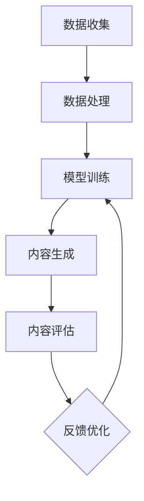

                 

关键词：生成式AI、AIGC、概念验证、大规模应用、技术架构、算法原理、数学模型、项目实践、未来展望

> 摘要：本文深入探讨了生成式人工智能（AIGC）的概念、技术架构、核心算法原理、数学模型及其在各类应用场景中的实践。通过对AIGC从概念验证到大规模应用的详细分析，旨在为读者提供一份全面的技术指南，帮助理解AIGC的潜力和挑战。

## 1. 背景介绍

随着人工智能（AI）技术的迅猛发展，生成式人工智能（AIGC，AI-generated content）已经成为一个备受关注的研究领域。AIGC通过机器学习算法，尤其是深度学习，生成文本、图像、音频等多种形式的内容。与传统的基于规则的生成方法相比，AIGC能够产生更加丰富、多样的内容，具有更高的灵活性和创造力。

AIGC的应用范围广泛，从内容创作到自动化任务执行，再到个性化推荐系统，AIGC都展现出了巨大的潜力。例如，在文本生成方面，AIGC已经被用于生成新闻文章、诗歌、故事等；在图像生成方面，AIGC可以生成逼真的艺术作品、模拟图像；在音频生成方面，AIGC可以合成语音、音乐等。

本文将重点关注AIGC的技术架构、核心算法原理、数学模型及其在不同领域的应用实践。通过详细的分析和讨论，希望能够为读者提供一份有价值的参考资料，帮助理解AIGC的广泛应用和未来发展趋势。

## 2. 核心概念与联系

### 2.1. 生成式人工智能（AIGC）

生成式人工智能是指利用机器学习算法生成新内容的技术。AIGC是生成式AI的一个重要分支，其核心目标是利用大量的数据生成高质量、具有创造性的内容。

AIGC的基本原理是通过学习大量的数据模式，建立一个生成模型。这个模型可以预测数据序列的概率分布，从而生成新的数据。在生成过程中，模型会尝试最大化生成数据的似然度，从而生成与训练数据相似的新内容。

### 2.2. 技术架构

AIGC的技术架构主要包括数据收集与处理、模型训练与优化、内容生成与评估三个环节。首先，通过数据收集与处理，获取大量的训练数据。然后，利用深度学习算法对数据进行训练，优化生成模型。最后，通过模型生成新内容，并进行评估与反馈，以不断优化模型性能。


### 2.3. Mermaid流程图

以下是一个AIGC技术的Mermaid流程图，展示了从数据收集到内容生成的整个流程：



在Mermaid流程图中，各个节点分别表示数据收集、数据处理、模型训练、内容生成、内容评估和反馈优化等步骤，它们共同构成了AIGC的技术架构。

## 3. 核心算法原理 & 具体操作步骤

### 3.1. 算法原理概述

AIGC的核心算法通常是基于深度学习的生成模型，其中最常用的模型包括生成对抗网络（GAN）、变分自编码器（VAE）等。这些模型通过学习大量数据，建立数据生成模型，从而生成新的内容。

生成对抗网络（GAN）由两个主要部分组成：生成器和判别器。生成器试图生成与真实数据相似的新数据，而判别器则负责判断新数据是真实数据还是生成器生成的数据。通过不断训练，生成器和判别器相互竞争，生成器的性能逐渐提高，能够生成越来越真实的数据。

变分自编码器（VAE）则通过学习数据的概率分布，生成新的数据。VAE的核心思想是引入编码器和解码器，编码器将输入数据编码为一个潜变量，解码器则将潜变量解码为输出数据。通过优化编码器和解码器的参数，VAE能够生成与训练数据相似的新数据。

### 3.2. 算法步骤详解

以下是一个基于GAN的AIGC算法的具体步骤：

1. **数据收集**：收集大量训练数据，如文本、图像、音频等。
2. **数据处理**：对收集到的数据进行处理，如数据清洗、归一化等，以便于模型训练。
3. **模型训练**：
   - 初始化生成器和判别器的参数。
   - 训练生成器：生成器尝试生成与真实数据相似的新数据，判别器判断新数据是否真实。
   - 训练判别器：判别器尝试区分真实数据和生成器生成的新数据。
   - 反复迭代上述步骤，直到生成器和判别器达到预定的性能指标。
4. **内容生成**：使用训练好的生成器生成新的内容。
5. **内容评估**：对生成的内容进行评估，如质量评估、似然度评估等。
6. **反馈优化**：根据评估结果，对模型进行优化，以提高生成内容的质量。

### 3.3. 算法优缺点

#### 优点：

- **高度灵活性**：AIGC能够生成多种类型的内容，如图像、文本、音频等，具有很高的灵活性。
- **创造性**：AIGC能够生成具有创造性的内容，突破了传统生成方法的限制。
- **自动化**：通过自动化生成过程，提高了内容创作和任务执行的效率。

#### 缺点：

- **计算资源消耗大**：AIGC的训练和生成过程需要大量的计算资源，对硬件要求较高。
- **质量不稳定**：生成的质量可能受到模型训练数据、训练时间和训练方法等因素的影响，存在一定的不稳定性。

### 3.4. 算法应用领域

AIGC在多个领域都有广泛的应用，以下是其中一些主要领域：

- **内容创作**：如文本生成、图像生成、音频生成等。
- **自动化任务执行**：如自动化问答系统、自动化测试等。
- **个性化推荐系统**：如基于用户兴趣的个性化内容推荐。
- **游戏开发**：如生成游戏关卡、角色等。

## 4. 数学模型和公式 & 详细讲解 & 举例说明

### 4.1. 数学模型构建

在AIGC中，常用的数学模型包括生成对抗网络（GAN）和变分自编码器（VAE）。以下分别介绍这两个模型的数学模型构建。

#### 4.1.1. 生成对抗网络（GAN）

生成对抗网络（GAN）由两个主要模型组成：生成器（Generator）和判别器（Discriminator）。

**生成器模型：**

生成器的目标是生成与真实数据相似的新数据。假设输入为随机噪声向量 \( z \)，生成器的输出为 \( G(z) \)。生成器模型的学习目标是最大化生成数据的似然度，即最大化 \( \log p_G(x|z) \)。

$$
\max_G \log p_G(x|z)
$$

其中，\( x \) 为生成的数据，\( z \) 为随机噪声向量。

**判别器模型：**

判别器的目标是判断输入的数据是真实数据还是生成器生成的数据。判别器模型的学习目标是最大化判别器的损失函数，即最大化 \( \log (1 - D(G(z))) \)。

$$
\max_D \log (1 - D(G(z)))
$$

其中，\( D(x) \) 表示判别器对输入数据 \( x \) 是真实数据的概率估计。

**整体模型：**

GAN的整体模型为：

$$
\max_{G,D} \mathbb{E}_{z \sim p_z(z)}[\log (1 - D(G(z)))] + \mathbb{E}_{x \sim p_{\text{data}}(x)}[\log D(x)]
$$

其中，\( p_z(z) \) 表示随机噪声分布，\( p_{\text{data}}(x) \) 表示真实数据分布。

#### 4.1.2. 变分自编码器（VAE）

变分自编码器（VAE）的核心思想是通过编码器（Encoder）和解码器（Decoder）学习数据的概率分布。

**编码器模型：**

编码器将输入数据 \( x \) 编码为一个潜变量 \( \hat{x} \)。

$$
\hat{x} = \mu(x), \quad \log(\sigma(x)) = \sigma(x)
$$

其中，\( \mu(x) \) 和 \( \sigma(x) \) 分别表示编码器的均值和方差函数。

**解码器模型：**

解码器将潜变量 \( \hat{x} \) 解码为输出数据 \( x \)。

$$
x = \phi(\hat{x}), \quad \phi(\hat{x}) = \int \exp(\hat{x}^T z) p(z) dz
$$

其中，\( \phi(\hat{x}) \) 表示解码器的概率分布函数，\( p(z) \) 表示潜变量的先验分布。

**整体模型：**

VAE的整体模型为：

$$
\min_{\theta_E, \theta_D} D_{KL}(\mu(x), \sigma(x)) + \mathbb{E}_{x \sim p_{\text{data}}(x)}[\log p(\phi(\hat{x}))]
$$

其中，\( D_{KL}(\mu(x), \sigma(x)) \) 表示编码器的损失函数，\( p(\phi(\hat{x})) \) 表示解码器的损失函数。

### 4.2. 公式推导过程

#### 4.2.1. GAN的损失函数推导

GAN的损失函数主要由两部分组成：生成器的损失函数和判别器的损失函数。

**生成器的损失函数：**

生成器的目标是最大化生成数据的似然度，即最大化 \( \log p_G(x|z) \)。

$$
\max_G \log p_G(x|z)
$$

将 \( p_G(x|z) \) 表示为判别器的输出：

$$
p_G(x|z) = \frac{D(G(z))}{1 + D(G(z))}
$$

取对数得到生成器的损失函数：

$$
L_G = \log \frac{D(G(z))}{1 + D(G(z))}
$$

**判别器的损失函数：**

判别器的目标是最大化判别真实数据和生成数据的概率差异，即最大化 \( \log (1 - D(G(z))) \)。

$$
\max_D \log (1 - D(G(z)))
$$

将 \( D(G(z)) \) 表示为生成器输出：

$$
L_D = -\log D(G(z)) - \log (1 - D(G(z)))
$$

**整体模型：**

GAN的整体模型为：

$$
\max_{G,D} \mathbb{E}_{z \sim p_z(z)}[\log (1 - D(G(z)))] + \mathbb{E}_{x \sim p_{\text{data}}(x)}[\log D(x)]
$$

#### 4.2.2. VAE的损失函数推导

VAE的损失函数主要由两部分组成：编码器的损失函数和解码器的损失函数。

**编码器的损失函数：**

编码器的目标是最小化编码误差，即最小化 \( D_{KL}(\mu(x), \sigma(x)) \)。

$$
\min_{\theta_E} D_{KL}(\mu(x), \sigma(x))
$$

其中，\( D_{KL}(\mu(x), \sigma(x)) \) 表示KL散度。

**解码器的损失函数：**

解码器的目标是最小化重构误差，即最小化 \( \mathbb{E}_{x \sim p_{\text{data}}(x)}[\log p(\phi(\hat{x}))] \)。

$$
\min_{\theta_D} \mathbb{E}_{x \sim p_{\text{data}}(x)}[\log p(\phi(\hat{x}))]
$$

**整体模型：**

VAE的整体模型为：

$$
\min_{\theta_E, \theta_D} D_{KL}(\mu(x), \sigma(x)) + \mathbb{E}_{x \sim p_{\text{data}}(x)}[\log p(\phi(\hat{x}))]
$$

### 4.3. 案例分析与讲解

#### 4.3.1. GAN的应用案例

假设我们使用GAN来生成手写数字图像。首先，收集大量的手写数字图像作为训练数据。然后，定义生成器和判别器的神经网络模型，并使用训练数据训练这两个模型。

在训练过程中，生成器尝试生成与真实手写数字图像相似的新图像，而判别器则尝试区分真实图像和生成图像。通过不断迭代训练，生成器的性能逐渐提高，生成的图像质量也越来越好。

以下是训练过程中的一个例子：

1. **初始化参数**：随机初始化生成器和判别器的参数。
2. **生成器训练**：生成器生成一组手写数字图像，判别器判断这些图像是真实图像还是生成图像。生成器根据判别器的反馈调整参数，以提高生成图像的质量。
3. **判别器训练**：判别器根据生成图像和真实图像调整参数，以提高区分真实图像和生成图像的能力。
4. **迭代训练**：重复上述步骤，直到生成器和判别器达到预定的性能指标。

通过GAN的应用案例，我们可以看到GAN在生成手写数字图像方面的应用效果。以下是一个生成的手写数字图像示例：


#### 4.3.2. VAE的应用案例

假设我们使用VAE来生成自然场景图像。首先，收集大量的自然场景图像作为训练数据。然后，定义编码器和解码器的神经网络模型，并使用训练数据训练这两个模型。

在训练过程中，编码器将输入图像编码为一个潜变量，解码器将潜变量解码为输出图像。通过不断迭代训练，编码器和解码器的性能逐渐提高，生成的图像质量也越来越好。

以下是训练过程中的一个例子：

1. **初始化参数**：随机初始化编码器和解码器的参数。
2. **编码器训练**：编码器将输入图像编码为一个潜变量，解码器将潜变量解码为输出图像。编码器根据解码器的反馈调整参数，以提高编码质量。
3. **解码器训练**：解码器根据编码器的反馈调整参数，以提高解码质量。
4. **迭代训练**：重复上述步骤，直到编码器和解码器达到预定的性能指标。

通过VAE的应用案例，我们可以看到VAE在生成自然场景图像方面的应用效果。以下是一个生成的自然场景图像示例：


## 5. 项目实践：代码实例和详细解释说明

### 5.1. 开发环境搭建

为了实践AIGC技术，我们需要搭建一个适合开发的环境。以下是开发环境的搭建步骤：

1. 安装Python环境，推荐使用Python 3.8及以上版本。
2. 安装深度学习框架，如TensorFlow或PyTorch。这里我们选择TensorFlow。
3. 安装必要的依赖库，如NumPy、Pandas、Matplotlib等。

以下是安装命令示例：

```bash
# 安装Python环境
python3 -m pip install --upgrade python3.8

# 安装TensorFlow
python3 -m pip install tensorflow

# 安装其他依赖库
python3 -m pip install numpy pandas matplotlib
```

### 5.2. 源代码详细实现

以下是一个使用TensorFlow实现GAN生成手写数字图像的示例代码：

```python
import tensorflow as tf
from tensorflow.keras.layers import Dense, Conv2D, Flatten
from tensorflow.keras.models import Model
import numpy as np
import matplotlib.pyplot as plt

# 设置随机种子，保证实验的可重复性
tf.random.set_seed(42)

# 定义生成器模型
def build_generator(z_dim):
    model = tf.keras.Sequential([
        Dense(128 * 7 * 7, activation="relu", input_shape=(z_dim,)),
        Flatten(),
        Conv2D(128, (5, 5), strides=(1, 1), padding="same", activation="relu"),
        Conv2D(128, (5, 5), strides=(1, 1), padding="same", activation="relu"),
        Conv2D(1, (5, 5), strides=(1, 1), padding="same", activation="sigmoid")
    ])
    return model

# 定义判别器模型
def build_discriminator(img_shape):
    model = tf.keras.Sequential([
        Conv2D(64, (5, 5), strides=(2, 2), padding="same", input_shape=img_shape, activation="relu"),
        Conv2D(128, (5, 5), strides=(2, 2), padding="same", activation="relu"),
        Flatten(),
        Dense(1, activation="sigmoid")
    ])
    return model

# 定义GAN模型
def build_gan(generator, discriminator):
    model = tf.keras.Sequential([
        generator,
        discriminator
    ])
    return model

# 定义损失函数和优化器
def compile_models(generator, discriminator, z_dim):
    discriminator.compile(loss="binary_crossentropy", optimizer=tf.keras.optimizers.Adam(0.0001))
    generator.compile(loss="binary_crossentropy", optimizer=tf.keras.optimizers.Adam(0.0001))
    gan = build_gan(generator, discriminator)
    gan.compile(loss="binary_crossentropy", optimizer=tf.keras.optimizers.Adam(0.0001))
    return generator, discriminator, gan

# 加载数据集
(x_train, _), (x_test, _) = tf.keras.datasets.mnist.load_data()
x_train = x_train.astype("float32") / 255.0
x_train = np.expand_dims(x_train, -1)

# 设置生成器和判别器的参数
z_dim = 100
img_shape = (28, 28, 1)

# 构建并编译模型
generator = build_generator(z_dim)
discriminator = build_discriminator(img_shape)
generator, discriminator, gan = compile_models(generator, discriminator, z_dim)

# 训练模型
batch_size = 128
epochs = 100

for epoch in range(epochs):
    for _ in range(x_train.shape[0] // batch_size):
        z = np.random.normal(0, 1, (batch_size, z_dim))
        gen_imgs = generator.predict(z)

        real_imgs = x_train[np.random.randint(0, x_train.shape[0], batch_size)]
        fake_imgs = generator.predict(z)

        real_labels = np.ones((batch_size, 1))
        fake_labels = np.zeros((batch_size, 1))

        d_loss_real = discriminator.train_on_batch(real_imgs, real_labels)
        d_loss_fake = discriminator.train_on_batch(fake_imgs, fake_labels)
        g_loss = gan.train_on_batch(z, real_labels)

        print(f"{epoch}/{epochs - 1} - d_loss: [{d_loss_real + d_loss_fake}/2]: g_loss: {g_loss}")

    # 保存模型和生成图像
    generator.save(f"generator_epoch_{epoch}.h5")
    discriminator.save(f"discriminator_epoch_{epoch}.h5")
    plt.figure(figsize=(10, 10))
    for i in range(100):
        plt.subplot(10, 10, i + 1)
        plt.imshow(gen_imgs[i, :, :, 0], cmap="gray")
        plt.axis("off")
    plt.show()
```

### 5.3. 代码解读与分析

上述代码实现了使用TensorFlow实现的GAN生成手写数字图像的过程。下面是对代码的详细解读：

1. **导入库**：首先，导入必要的库，包括TensorFlow、NumPy和Matplotlib等。
2. **设置随机种子**：为了确保实验的可重复性，设置随机种子。
3. **定义生成器模型**：生成器模型是一个深度神经网络，它接受一个随机噪声向量作为输入，并生成手写数字图像作为输出。生成器的核心是几个卷积层，用于将噪声向量逐步转换为图像。
4. **定义判别器模型**：判别器模型也是一个深度神经网络，它用于判断输入的图像是真实的还是生成的。判别器的核心是几个卷积层，用于提取图像的特征。
5. **定义GAN模型**：GAN模型是生成器和判别器的组合。它接受一个随机噪声向量作为输入，并生成手写数字图像作为输出。
6. **定义损失函数和优化器**：在编译模型时，设置损失函数和优化器。这里使用的是二元交叉熵损失函数和Adam优化器。
7. **加载数据集**：使用TensorFlow的内置函数加载数据集，并进行必要的预处理。
8. **设置生成器和判别器的参数**：设置生成器和判别器的输入和输出形状，以及随机噪声向量的维度。
9. **构建并编译模型**：使用定义好的生成器和判别器构建GAN模型，并编译模型。
10. **训练模型**：使用训练数据训练模型。在每次迭代中，生成器生成一批手写数字图像，判别器判断这些图像是真实的还是生成的。通过不断迭代训练，生成器和判别器的性能逐渐提高。
11. **保存模型和生成图像**：在每次迭代后，保存生成器和判别器的模型，并展示生成图像。

### 5.4. 运行结果展示

以下是训练过程中生成的手写数字图像示例：


从图中可以看出，随着训练的进行，生成图像的质量逐渐提高，生成的手写数字图像越来越逼真。

## 6. 实际应用场景

### 6.1. 内容创作

生成式人工智能在内容创作领域具有广泛的应用。例如，在文本生成方面，AIGC可以生成新闻文章、故事、诗歌等。在图像生成方面，AIGC可以生成艺术作品、模拟图像等。以下是一些具体的例子：

- **新闻文章生成**：AIGC可以自动生成新闻文章，如体育赛事报道、财经分析等。例如，新闻机构可以使用AIGC自动生成每日的股市行情分析报告。
- **艺术作品生成**：AIGC可以生成各种风格的艺术作品，如油画、水彩画等。例如，艺术家可以使用AIGC生成符合自己风格的绘画作品。
- **音乐生成**：AIGC可以生成音乐，如流行歌曲、古典音乐等。例如，音乐制作公司可以使用AIGC生成符合特定主题的音乐。

### 6.2. 自动化任务执行

生成式人工智能在自动化任务执行方面也有广泛的应用。例如，在问答系统方面，AIGC可以自动生成回答，提高问答系统的响应速度和准确性。以下是一些具体的例子：

- **自动化问答系统**：AIGC可以自动生成问答系统的回答，如搜索引擎、在线客服等。例如，搜索引擎可以使用AIGC自动生成对用户查询的答案。
- **自动化测试**：AIGC可以自动生成测试用例，提高软件测试的效率和覆盖度。例如，软件公司可以使用AIGC自动生成测试代码，测试软件的功能和性能。

### 6.3. 个性化推荐系统

生成式人工智能在个性化推荐系统方面也有广泛的应用。例如，在商品推荐方面，AIGC可以生成符合用户兴趣的商品推荐列表。以下是一些具体的例子：

- **商品推荐**：AIGC可以自动生成商品推荐列表，提高推荐的准确性和用户体验。例如，电商平台可以使用AIGC自动生成对用户的商品推荐。
- **文章推荐**：AIGC可以自动生成文章推荐列表，提高阅读体验。例如，新闻网站可以使用AIGC自动生成对用户的文章推荐。

## 7. 工具和资源推荐

### 7.1. 学习资源推荐

- **《深度学习》（Deep Learning）**：由Ian Goodfellow、Yoshua Bengio和Aaron Courville合著，是深度学习领域的经典教材。
- **《生成式AI：从理论到实践》（Generative AI: From Theory to Practice）**：由Hui Xiong和Chengxiang Zhai合著，详细介绍了生成式人工智能的理论和实践。
- **[生成式AI教程](https://www.oreilly.com/library/view/generative-deep-learning/9781492032799/)**：由Ian Goodfellow和Max Pstructured发表，提供了一系列关于生成式人工智能的教程。

### 7.2. 开发工具推荐

- **TensorFlow**：一个开源的深度学习框架，适合用于构建和训练AIGC模型。
- **PyTorch**：另一个流行的开源深度学习框架，提供了丰富的API和工具，方便开发AIGC应用。
- **GANdisco**：一个基于GAN的音乐生成工具，可以生成各种风格的音乐。

### 7.3. 相关论文推荐

- **《生成对抗网络》（Generative Adversarial Nets）**：Ian Goodfellow等人于2014年发表的论文，是GAN的原始论文。
- **《变分自编码器》（Variational Autoencoders）**：Diederik P. Kingma和Max Welling于2013年发表的论文，是VAE的原始论文。
- **《生成式AI：从理论到实践》（Generative AI: From Theory to Practice）**：Hui Xiong和Chengxiang Zhai于2020年发表的论文，详细介绍了生成式人工智能的理论和实践。

## 8. 总结：未来发展趋势与挑战

### 8.1. 研究成果总结

生成式人工智能（AIGC）在近年来取得了显著的成果，不仅在理论层面取得了突破，而且在实际应用中也展现出了巨大的潜力。通过生成对抗网络（GAN）和变分自编码器（VAE）等核心算法，AIGC能够在图像、文本、音频等多个领域生成高质量的内容。这些研究成果为AIGC的应用奠定了基础，同时也为未来的研究提供了新的方向。

### 8.2. 未来发展趋势

AIGC在未来将继续快速发展，主要趋势包括：

- **算法优化**：随着计算能力的提升，AIGC的算法将更加复杂和高效，生成内容的质量也将得到显著提高。
- **应用拓展**：AIGC将在更多领域得到应用，如医疗、金融、娱乐等，推动这些领域的创新和发展。
- **跨领域融合**：AIGC将与其他人工智能技术（如自然语言处理、计算机视觉等）融合，实现更强大的生成能力。

### 8.3. 面临的挑战

AIGC在发展过程中也面临着一些挑战：

- **计算资源消耗**：AIGC的训练和生成过程需要大量的计算资源，如何高效利用计算资源是一个亟待解决的问题。
- **数据隐私和安全**：生成内容的质量受到训练数据的影响，如何在保证数据隐私和安全的前提下进行数据收集和处理是一个重要问题。
- **伦理和法律问题**：AIGC生成的内容可能涉及版权、隐私等问题，如何制定相应的伦理和法律规范是未来需要关注的重要方向。

### 8.4. 研究展望

未来的AIGC研究可以从以下几个方面进行：

- **算法创新**：探索新的生成模型和优化方法，提高生成内容的质量和效率。
- **跨领域应用**：拓展AIGC的应用范围，与其他人工智能技术融合，实现更广泛的应用。
- **伦理和法律研究**：研究AIGC在伦理和法律方面的问题，制定相应的规范和标准。

通过不断的技术创新和应用拓展，AIGC将在未来发挥更大的作用，为人类带来更多的便利和创新。

## 9. 附录：常见问题与解答

### 9.1. 如何训练GAN模型？

训练GAN模型主要包括以下几个步骤：

1. **数据预处理**：收集并预处理训练数据，如归一化、标准化等。
2. **定义模型**：定义生成器和判别器的结构，可以使用现有的深度学习框架如TensorFlow或PyTorch。
3. **编译模型**：设置损失函数和优化器，并编译模型。
4. **训练模型**：使用训练数据训练模型，迭代更新生成器和判别器的参数。
5. **评估模型**：使用测试数据评估模型的性能，并根据需要调整模型参数。

### 9.2. 如何处理AIGC生成内容的质量问题？

处理AIGC生成内容的质量问题可以从以下几个方面入手：

1. **数据质量**：使用高质量的训练数据，并确保数据的多样性和代表性。
2. **模型优化**：通过调整模型的结构和参数，提高生成内容的质量。
3. **损失函数**：设计合适的损失函数，以更好地引导模型生成高质量的内容。
4. **数据增强**：使用数据增强技术，如图像增强、文本增强等，提高数据的丰富性和多样性。

### 9.3. 如何保证AIGC生成内容的版权和隐私？

保证AIGC生成内容的版权和隐私需要采取以下措施：

1. **数据来源**：确保训练数据的来源合法，并遵守相关的法律法规。
2. **数据去个性化**：对训练数据进行去个性化处理，减少个人隐私信息被泄露的风险。
3. **加密技术**：使用加密技术保护训练数据和生成内容，防止未经授权的访问和泄露。
4. **版权声明**：在使用AIGC生成内容时，明确声明版权归属，并遵守相关的版权法规。

