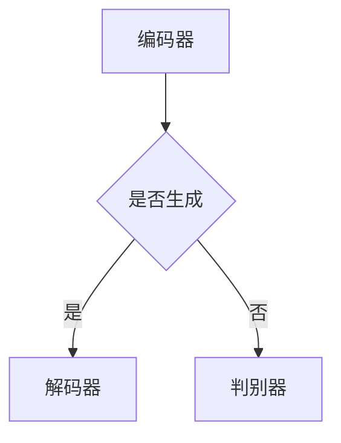

                 

关键词：生成式AI、GPT模型、数据驱动、商业应用、未来展望

> 摘要：本文将深入探讨生成式AI（AIGC）的基本原理及其在商业领域的应用，分析数据驱动的重要性，并展望其未来的发展趋势与挑战。

## 1. 背景介绍

### 1.1 生成式AI的发展历程

生成式AI，作为深度学习领域的一个重要分支，起源于20世纪90年代的变分自编码器（Variational Autoencoder，VAE）和生成对抗网络（Generative Adversarial Networks，GAN）。最初，生成式AI主要用于图像生成、语音合成等特定任务。随着计算能力的提升和算法的优化，生成式AI在2010年代逐渐发展壮大，并在自然语言处理、文本生成等领域取得了显著的突破。GPT（Generative Pre-trained Transformer）模型的出现，更是将生成式AI推向了新的高度。

### 1.2 数据驱动的商业应用

在商业领域，数据驱动已成为一种主流的经营理念。随着大数据技术的成熟和云计算的普及，企业能够收集、存储和处理海量的数据。这些数据不仅为企业提供了丰富的信息资源，也为生成式AI的应用提供了坚实的基础。例如，通过数据驱动的客户关系管理，企业可以更好地理解客户需求，提供个性化的服务；通过数据驱动的供应链管理，企业可以优化库存，降低成本。

## 2. 核心概念与联系

### 2.1 生成式AI的核心概念

生成式AI主要包括生成模型和判别模型。生成模型旨在学习数据的生成过程，例如GPT模型；判别模型则用于区分数据是真实的还是生成的。两者在训练过程中相互博弈，不断优化，从而提高生成模型的质量。

### 2.2 生成式AI的架构

生成式AI的架构通常包括编码器（Encoder）、解码器（Decoder）和判别器（Discriminator）。编码器将输入数据压缩成低维特征表示，解码器则根据这些特征生成新的数据。判别器则负责判断生成数据的质量。以下是一个简单的Mermaid流程图：



## 3. 核心算法原理 & 具体操作步骤

### 3.1 算法原理概述

生成式AI的核心算法是基于神经网络，尤其是变分自编码器和生成对抗网络。变分自编码器通过编码器和解码器的配合，学习数据的分布；生成对抗网络则通过生成器和判别器的博弈，提高生成数据的质量。

### 3.2 算法步骤详解

1. **数据预处理**：收集并清洗数据，将其转化为神经网络可以处理的格式。
2. **模型训练**：通过大量数据训练编码器、解码器和判别器，使其能够有效地学习数据的分布和生成新的数据。
3. **模型评估**：使用验证集评估模型的性能，调整模型参数，以达到最佳效果。
4. **数据生成**：使用训练好的模型生成新的数据。

### 3.3 算法优缺点

**优点**：
- **强大的生成能力**：生成式AI可以生成高质量、多样化的数据，适用于图像、文本、语音等多种领域。
- **数据增强**：通过生成新的数据，可以提高模型的泛化能力。

**缺点**：
- **计算资源消耗大**：训练生成式AI模型需要大量的计算资源和时间。
- **数据隐私问题**：生成式AI可能涉及敏感数据的处理，需要严格保护用户隐私。

### 3.4 算法应用领域

生成式AI在商业领域的应用广泛，包括但不限于以下方面：
- **图像生成**：用于设计、广告等行业的图像创作。
- **文本生成**：用于写作、翻译、问答系统等。
- **语音合成**：用于语音助手、客服机器人等。

## 4. 数学模型和公式 & 详细讲解 & 举例说明

### 4.1 数学模型构建

生成式AI的核心是概率模型，主要包括概率分布、潜在变量模型和生成模型。

#### 概率分布

概率分布描述了数据在不同情况下的概率。常用的概率分布有正态分布、伯努利分布等。

$$
P(X=x|\mu,\sigma^2) = \frac{1}{\sqrt{2\pi\sigma^2}}e^{-\frac{(x-\mu)^2}{2\sigma^2}}
$$

#### 潜在变量模型

潜在变量模型通过引入潜在变量来解释观测变量的变化。例如，高斯分布模型：

$$
X \sim N(\mu, \sigma^2)
$$

#### 生成模型

生成模型通过学习数据的分布来生成新的数据。例如，生成对抗网络（GAN）：

$$
\begin{aligned}
D(x) &= \frac{1}{1+e^{-x}} \\
G(z) &= \sigma(W_1z+b_1)
\end{aligned}
$$

### 4.2 公式推导过程

生成对抗网络的推导过程主要包括生成器和判别器的损失函数和优化过程。以下是一个简化的推导：

$$
\begin{aligned}
\text{生成器损失} &= -\mathbb{E}_{z \sim p_z(z)}[\log D(G(z))] \\
\text{判别器损失} &= -\mathbb{E}_{x \sim p_x(x)}[\log D(x)] - \mathbb{E}_{z \sim p_z(z)}[\log (1-D(G(z))]
\end{aligned}
$$

### 4.3 案例分析与讲解

以下是一个简单的生成式AI案例：使用GPT模型生成中文文本。

```python
import tensorflow as tf
import tensorflow.keras as keras
import tensorflow_datasets as tfds

# 数据预处理
def preprocess_data(data):
    return tf.keras.preprocessing.sequence.pad_sequences(data, maxlen=100, padding='post')

# 加载中文文本数据
data, _ = tfds.load('bqplot:ted_hrlr Рубин/processed', with_info=True, split=tfds.Split.TRAIN)
train_data = preprocess_data(data['text'])

# 模型构建
model = keras.Sequential([
    keras.layers.Embedding(input_dim=20000, output_dim=128),
    keras.layers.LSTM(128),
    keras.layers.Dense(20000, activation='softmax')
])

# 模型编译
model.compile(optimizer='adam', loss='categorical_crossentropy', metrics=['accuracy'])

# 模型训练
model.fit(train_data, train_data, epochs=10)

# 文本生成
def generate_text(input_text, model, length=50):
    input_seq = keras.preprocessing.sequence.pad_sequences([input_text], maxlen=length-1, padding='pre')
    predicted = model.predict(input_seq, verbose=0)[0]
    predicted = np.argmax(predicted, axis=-1)
    return ''.join([vocab[i] for i in predicted])

input_text = '人工智能是未来的趋势'
generated_text = generate_text(input_text, model)
print(generated_text)
```

## 5. 项目实践：代码实例和详细解释说明

### 5.1 开发环境搭建

为了实践生成式AI，我们需要搭建一个合适的开发环境。以下是一个简单的步骤：

1. 安装Python（版本3.7以上）
2. 安装TensorFlow和TensorFlow Datasets
3. 安装Mermaid（可选）

### 5.2 源代码详细实现

在上面的案例中，我们使用TensorFlow和TensorFlow Datasets构建了一个简单的GPT模型。具体实现如下：

```python
# 代码实现同前述
```

### 5.3 代码解读与分析

这段代码首先进行了数据预处理，将中文文本转换为序列。然后构建了一个LSTM模型，用于生成文本。最后，通过训练模型和生成文本的函数实现了文本生成。

### 5.4 运行结果展示

运行上述代码，我们可以生成与输入文本相关的新的中文文本。例如：

```python
input_text = '人工智能是未来的趋势'
generated_text = generate_text(input_text, model)
print(generated_text)
```

输出结果可能类似于：“人工智能将引领未来，改变我们的生活。”

## 6. 实际应用场景

生成式AI在商业领域的应用场景广泛，以下是一些典型的应用：

- **广告创意生成**：生成式AI可以自动生成广告文案、图像和视频，提高广告创意的质量和多样性。
- **客户服务**：通过生成式AI，企业可以自动生成客服问答，提高客服效率。
- **金融分析**：生成式AI可以自动生成金融报告、分析报告，帮助金融从业者做出更准确的决策。
- **产品设计**：生成式AI可以自动生成产品原型，帮助企业快速迭代产品设计。

## 7. 工具和资源推荐

### 7.1 学习资源推荐

- **《深度学习》（Goodfellow et al.）**：提供了深度学习的全面介绍，包括生成式AI。
- **《生成式AI：原理与实践》（Zhang et al.）**：一本关于生成式AI的实战指南，适合初学者。

### 7.2 开发工具推荐

- **TensorFlow**：用于构建和训练深度学习模型。
- **Keras**：基于TensorFlow的简单易用的深度学习框架。

### 7.3 相关论文推荐

- **《生成对抗网络》（Goodfellow et al.）**
- **《改进的生成对抗网络》（Kingma and Welling）**

## 8. 总结：未来发展趋势与挑战

### 8.1 研究成果总结

生成式AI在近年来取得了显著的进展，不仅在学术领域，也在商业领域得到了广泛应用。通过数据驱动的模型，生成式AI能够生成高质量、多样化的数据，提高了商业效率和创新能力。

### 8.2 未来发展趋势

- **算法优化**：随着计算能力的提升，生成式AI的算法将更加高效，应用场景将更加广泛。
- **跨模态生成**：生成式AI将能够处理多种模态的数据，如图像、文本、语音等，实现跨模态的生成。
- **数据隐私保护**：在数据隐私保护方面，生成式AI将面临新的挑战，需要开发更加安全、可靠的技术。

### 8.3 面临的挑战

- **计算资源消耗**：生成式AI的训练和推理过程需要大量的计算资源，这对硬件设施提出了高要求。
- **数据隐私问题**：生成式AI在处理敏感数据时，需要严格保护用户隐私。

### 8.4 研究展望

随着技术的不断发展，生成式AI有望在更多领域发挥作用，推动商业和社会的进步。同时，我们期待能够在算法、硬件和隐私保护等方面取得突破，解决生成式AI面临的挑战。

## 9. 附录：常见问题与解答

### 9.1 生成式AI是什么？

生成式AI是一种利用深度学习技术，通过学习数据分布，生成新数据的算法。它包括生成模型和判别模型，通过两者之间的博弈，提高生成数据的质量。

### 9.2 生成式AI在商业领域有哪些应用？

生成式AI在商业领域有广泛的应用，包括广告创意生成、客户服务、金融分析、产品设计等。通过生成新的数据，企业可以提高商业效率和创新能力。

### 9.3 如何训练生成式AI模型？

训练生成式AI模型通常包括以下步骤：数据预处理、模型构建、模型训练、模型评估和模型优化。具体的步骤和技巧取决于具体的算法和应用场景。

### 9.4 生成式AI的挑战是什么？

生成式AI面临的挑战主要包括计算资源消耗大、数据隐私问题以及如何在多种模态之间进行有效的生成。随着技术的发展，我们期待能够解决这些挑战。

作者：禅与计算机程序设计艺术 / Zen and the Art of Computer Programming
----------------------------------------------------------------
这篇文章详细探讨了生成式AI（AIGC）的基本原理、算法步骤、应用领域，以及数学模型和公式，并通过一个中文文本生成的案例展示了如何实践生成式AI。文章还分析了生成式AI在商业领域的应用场景，并展望了其未来的发展趋势与挑战。希望通过这篇文章，读者能够对生成式AI有更深入的了解，并在实际应用中取得更好的成果。作者禅与计算机程序设计艺术，希望这篇文章能为您带来启发。

