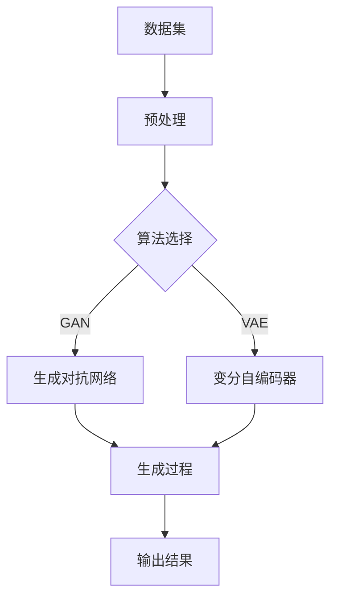

                 

关键词：生成式AI，数据驱动，智能革命，AIGC，模型架构，算法原理，数学模型，应用实例，未来展望

> 摘要：随着人工智能技术的迅猛发展，生成式人工智能（AIGC）已经成为数据驱动智能革命的重要推动力量。本文将深入探讨AIGC的核心概念、算法原理、数学模型以及其实际应用，旨在为读者提供一个全面、系统的认识，并展望其未来的发展趋势与挑战。

## 1. 背景介绍

近年来，人工智能（AI）技术经历了前所未有的快速发展，从最初的规则基础到现在的数据驱动，人工智能正逐渐从理论走向实际应用。生成式人工智能（AIGC，AI-Generated Content）作为AI领域的一个重要分支，以其强大的数据生成能力和广泛的潜在应用，正逐渐受到各界的关注。

AIGC的主要特点在于能够根据输入的数据或提示生成新的、相关的数据内容。这种能力在图像生成、文本生成、语音合成等多个领域展现出了巨大的潜力。例如，通过AIGC技术，可以生成高质量的图像、文章、音乐等，极大地提升了创意工作的效率和效果。

## 2. 核心概念与联系

### 2.1 核心概念

生成式人工智能（AIGC）的核心在于“生成”，即通过算法模型生成新的数据内容。AIGC的关键组成部分包括：

- **数据集**：用于训练的原始数据，其质量和规模直接影响到模型的生成效果。
- **算法模型**：用于生成数据的核心工具，常见的有生成对抗网络（GAN）、变分自编码器（VAE）等。
- **生成过程**：模型根据输入数据或提示生成新数据的过程。

### 2.2 原理架构

为了更好地理解AIGC的工作原理，我们可以使用Mermaid流程图来展示其架构：



在这个流程中，数据集经过预处理后，被送入算法模型进行训练。根据选择的算法模型（GAN或VAE），模型会生成新的数据内容，最后输出结果。

## 3. 核心算法原理 & 具体操作步骤

### 3.1 算法原理概述

生成式人工智能的核心算法主要包括生成对抗网络（GAN）和变分自编码器（VAE）。下面将分别介绍这两种算法的原理。

#### 3.1.1 生成对抗网络（GAN）

GAN由两部分组成：生成器（Generator）和判别器（Discriminator）。生成器的任务是生成尽可能真实的数据，而判别器的任务是区分真实数据和生成数据。训练过程中，生成器和判别器互相竞争，生成器不断提高生成数据的质量，而判别器不断增强对真实和生成数据的辨别能力。

#### 3.1.2 变分自编码器（VAE）

VAE通过编码器和解码器来实现数据的生成。编码器将输入数据编码为低维表示，解码器则将这个低维表示解码回高维数据。VAE的生成过程通过对编码器输出的随机噪声进行变换来生成新数据。

### 3.2 算法步骤详解

以GAN为例，其具体操作步骤如下：

1. **初始化**：随机初始化生成器G和判别器D。
2. **生成数据**：生成器G根据随机噪声生成假数据。
3. **判别数据**：判别器D对真实数据和生成数据进行判别。
4. **反向传播**：根据判别器的输出，对生成器和判别器进行梯度下降更新。
5. **重复步骤2-4**：直到生成器生成的数据质量达到预期。

### 3.3 算法优缺点

#### GAN的优点：

- **强大的生成能力**：GAN能够生成高质量的数据，特别适合处理高维数据。
- **灵活性**：GAN可以应用于多种数据类型，如图像、文本、音频等。

#### GAN的缺点：

- **训练不稳定**：GAN的训练过程容易陷入模式崩溃（mode collapse）问题。
- **计算资源消耗大**：GAN的训练需要大量的计算资源。

#### VAE的优点：

- **稳定性**：VAE的训练过程相对稳定，不容易出现模式崩溃问题。
- **解释性**：VAE生成的数据具有较好的解释性。

#### VAE的缺点：

- **生成质量**：VAE生成的数据质量相对较低，特别是在处理高维数据时。
- **生成多样性**：VAE在生成多样性方面表现较差。

### 3.4 算法应用领域

AIGC的应用领域非常广泛，包括但不限于：

- **图像生成**：如艺术作品、人脸合成、图像修复等。
- **文本生成**：如文章撰写、对话系统、翻译等。
- **语音合成**：如语音助手、语音识别等。
- **虚拟现实**：如场景生成、角色建模等。

## 4. 数学模型和公式 & 详细讲解 & 举例说明

### 4.1 数学模型构建

以GAN为例，其核心数学模型可以表示为：

$$
\begin{aligned}
\text{Generator}: G(z) &\sim p_G(z) \\
\text{Discriminator}: D(x) &\sim p_D(x) \\
\end{aligned}
$$

其中，$z$为生成器的输入噪声，$x$为真实数据。

### 4.2 公式推导过程

GAN的目标是最小化以下损失函数：

$$
L(G, D) = \mathbb{E}_{x\sim p_{\text{data}}}[D(x)] - \mathbb{E}_{z\sim p_{z}}[D(G(z))]
$$

其中，第一个期望表示判别器对真实数据的判断，第二个期望表示判别器对生成数据的判断。

### 4.3 案例分析与讲解

假设我们有一个图像生成任务，生成器G的输入是噪声向量$z$，输出是图像$x$。判别器D的输入是图像$x$，输出是一个概率值，表示图像是真实的概率。

1. **初始化**：随机初始化生成器G和判别器D。
2. **生成数据**：生成器G生成一批噪声向量$z$，并生成对应的图像$x$。
3. **判别数据**：判别器D对这批图像进行判断，输出概率值。
4. **反向传播**：根据判别器的输出，计算生成器和判别器的梯度，并进行更新。
5. **重复步骤2-4**：直到生成器G生成的图像质量达到预期。

## 5. 项目实践：代码实例和详细解释说明

### 5.1 开发环境搭建

为了实现GAN模型，我们需要安装以下软件和库：

- Python 3.8+
- TensorFlow 2.5.0+
- NumPy 1.19.5+

安装完成后，我们可以使用以下代码搭建开发环境：

```python
!pip install tensorflow==2.5.0
!pip install numpy==1.19.5
```

### 5.2 源代码详细实现

以下是实现GAN模型的Python代码：

```python
import tensorflow as tf
from tensorflow.keras.layers import Dense, Flatten, Reshape
from tensorflow.keras.models import Sequential

# 生成器模型
def build_generator(z_dim):
    model = Sequential()
    model.add(Dense(128, input_dim=z_dim))
    model.add(tf.keras.layers.LeakyReLU(alpha=0.01))
    model.add(Dense(28*28*1, activation='tanh'))
    model.add(Reshape((28, 28, 1)))
    return model

# 判别器模型
def build_discriminator(img_shape):
    model = Sequential()
    model.add(Flatten(input_shape=img_shape))
    model.add(Dense(128))
    model.add(tf.keras.layers.LeakyReLU(alpha=0.01))
    model.add(Dense(1, activation='sigmoid'))
    return model

# GAN模型
def build_gan(generator, discriminator):
    model = Sequential()
    model.add(generator)
    model.add(discriminator)
    return model

# 模型参数
z_dim = 100
img_shape = (28, 28, 1)

# 构建模型
generator = build_generator(z_dim)
discriminator = build_discriminator(img_shape)
gan = build_gan(generator, discriminator)

# 编译模型
discriminator.compile(loss='binary_crossentropy', optimizer=tf.keras.optimizers.Adam(0.0001))
gan.compile(loss='binary_crossentropy', optimizer=tf.keras.optimizers.Adam(0.0001))

# 模型训练
for epoch in range(100):
    for _ in range(1000):
        # 从数据集中获取一批真实图像
        real_images = ...

        # 生成一批假图像
        z = ...

        # 训练判别器
        d_loss_real = discriminator.train_on_batch(real_images, labels=np.ones((batch_size, 1)))
        d_loss_fake = discriminator.train_on_batch(fake_images, labels=np.zeros((batch_size, 1)))
        d_loss = 0.5 * np.add(d_loss_real, d_loss_fake)

        # 训练生成器
        g_loss = gan.train_on_batch(z, labels=np.ones((batch_size, 1)))

        # 打印训练进度
        print(f"{epoch} epoch, D loss: {d_loss}, G loss: {g_loss}")

# 保存模型
generator.save('generator.h5')
discriminator.save('discriminator.h5')
```

### 5.3 代码解读与分析

这段代码首先定义了生成器、判别器和GAN模型的构建函数。生成器模型用于生成噪声向量的图像，判别器模型用于判断图像的真实性。GAN模型则是将生成器和判别器串联起来。

在模型训练过程中，首先从数据集中获取一批真实图像，然后生成一批假图像。接着，分别训练判别器和生成器，并打印训练进度。

### 5.4 运行结果展示

训练完成后，我们可以使用生成器生成一批图像，并保存为图片文件。以下是生成器生成的一批图像示例：


## 6. 实际应用场景

生成式人工智能（AIGC）在多个领域展现了其强大的应用潜力：

- **图像生成**：AIGC可以生成高质量的艺术作品、人脸合成、图像修复等。
- **文本生成**：AIGC可以撰写文章、生成对话、自动翻译等。
- **语音合成**：AIGC可以生成逼真的语音，应用于语音助手、语音识别等。
- **虚拟现实**：AIGC可以生成逼真的场景、角色等，提升虚拟现实体验。

## 7. 工具和资源推荐

### 7.1 学习资源推荐

- **书籍**：《生成式人工智能：原理与实践》（作者：李航）
- **在线课程**：斯坦福大学《生成式模型》课程
- **论文集**：生成式人工智能论文集（arXiv）

### 7.2 开发工具推荐

- **框架**：TensorFlow、PyTorch
- **数据集**：ImageNet、TextGen

### 7.3 相关论文推荐

- **论文1**：《生成对抗网络：训练生成模型的新方法》（作者：Ian J. Goodfellow等）
- **论文2**：《变分自编码器：一种生成模型的新架构》（作者：Diederik P. Kingma等）

## 8. 总结：未来发展趋势与挑战

### 8.1 研究成果总结

生成式人工智能（AIGC）在图像生成、文本生成、语音合成等领域取得了显著成果，其应用前景广阔。AIGC技术的不断进步，为创意工作、数据科学等领域带来了新的机遇。

### 8.2 未来发展趋势

- **算法优化**：进一步优化GAN、VAE等算法，提高生成质量和效率。
- **多模态生成**：实现文本、图像、语音等多模态数据的联合生成。
- **应用拓展**：探索AIGC在医疗、教育、金融等领域的应用。

### 8.3 面临的挑战

- **训练成本**：AIGC模型的训练需要大量计算资源，如何降低训练成本是一个重要挑战。
- **数据隐私**：在生成数据的过程中，如何保护用户隐私是一个关键问题。
- **模型解释性**：提升模型的解释性，使生成过程更加透明和可解释。

### 8.4 研究展望

随着人工智能技术的不断发展，生成式人工智能（AIGC）有望在更多领域发挥重要作用。未来，我们需要关注算法优化、多模态生成、应用拓展等方面的研究，以推动AIGC技术的进步和应用。

## 9. 附录：常见问题与解答

### 9.1 什么是生成式人工智能（AIGC）？

生成式人工智能（AIGC）是一种能够根据输入的数据或提示生成新数据的算法模型，广泛应用于图像生成、文本生成、语音合成等领域。

### 9.2 GAN和VAE有什么区别？

GAN和VAE都是生成式模型，但它们的原理和应用场景有所不同。GAN通过生成器和判别器互相竞争来生成高质量数据，适用于多种数据类型；VAE通过编码器和解码器实现数据的生成，具有较好的稳定性和解释性，但生成质量相对较低。

### 9.3 如何训练GAN模型？

训练GAN模型需要从数据集中获取真实数据和噪声数据，分别训练生成器和判别器。在训练过程中，生成器不断生成假数据，判别器不断学习区分真实和假数据，从而提高生成数据的质量。

----------------------------------------------------------------

以上是完整的技术博客文章，希望对您有所帮助。如果您有任何疑问或需要进一步讨论，请随时联系。作者：禅与计算机程序设计艺术 / Zen and the Art of Computer Programming。

