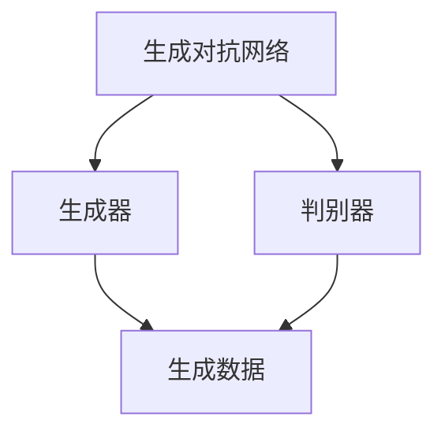

                 

关键词：生成式AI、AIGC、商业智能化、技术变革、未来展望

> 摘要：本文深入探讨了生成式人工智能（AIGC）在商业领域的应用前景，分析了其如何推动商业模式的创新与变革。通过介绍AIGC的核心概念、算法原理、数学模型和实际应用案例，本文旨在为读者提供关于AIGC技术全面而深入的洞察，展示其在未来商业中的巨大潜力。

## 1. 背景介绍

随着信息技术的飞速发展，人工智能（AI）已经成为推动社会进步的重要力量。传统的人工智能主要依赖于预先训练的模型和数据，其应用场景相对有限。然而，随着生成式人工智能（AIGC）的崛起，AI的应用范围得到了极大的扩展。AIGC通过生成模型能够自动生成新的内容，包括文本、图像、音频等，从而在内容创作、个性化推荐、自动化客服等领域展现出巨大的潜力。

在商业领域，AIGC的应用将带来一系列变革。首先，AIGC能够大幅提升内容创作的效率，为营销、媒体、教育等行业提供全新的解决方案。其次，AIGC可以精准预测用户需求，优化推荐系统，提升用户体验。此外，AIGC还可以用于自动化客服，降低运营成本，提高服务效率。总之，AIGC的崛起有望推动商业模式的创新与升级，为未来商业的智能化转型提供强大动力。

## 2. 核心概念与联系

### 2.1 生成式人工智能（AIGC）

生成式人工智能（AIGC）是一种基于生成对抗网络（GANs）和变分自编码器（VAEs）等深度学习技术的AI模型。其核心思想是通过对抗训练生成新的数据，这些数据可以是文本、图像、音频等形式。AIGC的主要特点是数据生成能力强、灵活度高，能够根据输入数据进行自适应调整。

### 2.2 生成对抗网络（GANs）

生成对抗网络（GANs）由生成器（Generator）和判别器（Discriminator）两个部分组成。生成器负责生成与真实数据相似的数据，判别器则负责判断生成数据是否真实。通过这种对抗训练，生成器不断优化自己的生成能力，从而生成越来越逼真的数据。

### 2.3 变分自编码器（VAEs）

变分自编码器（VAEs）是一种无监督学习的概率生成模型。与GANs相比，VAEs的训练过程更加稳定，但其生成质量相对较低。VAEs通过编码器和解码器将输入数据转换为潜在空间，再从潜在空间生成新的数据。

### 2.4 Mermaid 流程图



## 3. 核心算法原理 & 具体操作步骤

### 3.1 算法原理概述

AIGC 的核心算法原理主要基于生成对抗网络（GANs）和变分自编码器（VAEs）。GANs通过生成器和判别器之间的对抗训练，生成与真实数据相似的新数据。VAEs则通过编码器和解码器将输入数据映射到潜在空间，再从潜在空间生成新的数据。

### 3.2 算法步骤详解

1. **数据预处理**：首先，对输入数据进行预处理，如归一化、去噪等。
2. **模型选择**：根据应用场景选择合适的生成模型，如 GANs 或 VAEs。
3. **生成器训练**：通过对抗训练，生成器不断优化生成数据的能力，判别器则不断优化对真实数据和生成数据的判断能力。
4. **解码器训练**：对于 VAEs，解码器从潜在空间生成数据，通过优化解码器参数，提升生成数据的真实度。
5. **模型评估与优化**：通过评估指标（如 PSNR、SSIM 等）对生成模型进行评估和优化。

### 3.3 算法优缺点

**优点**：

- 强大的数据生成能力。
- 可根据输入数据进行自适应调整。
- 适用于多种数据类型，如文本、图像、音频等。

**缺点**：

- 训练过程复杂，计算资源需求高。
- 生成数据的真实度有时无法保证。

### 3.4 算法应用领域

- **内容创作**：如文本生成、图像生成、音频生成等。
- **个性化推荐**：基于用户行为数据生成个性化推荐内容。
- **自动化客服**：生成与用户对话的回复，提高客服效率。
- **医学影像诊断**：生成医学影像数据，辅助医生诊断。

## 4. 数学模型和公式 & 详细讲解 & 举例说明

### 4.1 数学模型构建

生成式人工智能的核心数学模型包括生成对抗网络（GANs）和变分自编码器（VAEs）。

### 4.2 公式推导过程

**GANs**：

生成器 $G(z)$ 和判别器 $D(x)$ 的训练目标如下：

$$
\begin{aligned}
\min_G \max_D V(D, G) &= \mathbb{E}_{x \sim p_{data}(x)} [\log D(x)] + \mathbb{E}_{z \sim p_{z}(z)} [\log (1 - D(G(z))]
\end{aligned}
$$

**VAEs**：

编码器 $q_{\theta}(x|x)$ 和解码器 $p_{\theta}(x|z)$ 的训练目标如下：

$$
\begin{aligned}
\min_{\theta} D_{KL}(q_{\theta}(x|x) || p_{z}(z)) + \mathbb{E}_{z \sim q_{\theta}(x|x)} [\log p_{\theta}(x|z)]
\end{aligned}
$$

### 4.3 案例分析与讲解

以文本生成为例，假设我们使用 GPT-3 模型进行文本生成。GPT-3 是一种基于 GANs 的生成模型，其训练过程如下：

1. **数据预处理**：将输入文本数据转化为 token 序列，并添加 <|start|> 和 <|end|> 标记。
2. **模型训练**：使用对抗训练方法，生成器 $G(z)$ 生成文本序列，判别器 $D(x)$ 判断文本序列的真实性。
3. **模型评估**：通过 perplexity 指标评估模型生成的文本质量。
4. **文本生成**：给定一个起始文本序列，生成器 $G(z)$ 生成新的文本序列。

例如，给定起始文本序列 “The quick brown fox jumps over the lazy dog”，GPT-3 生成的新文本序列为 “The quick brown fox jumps over the lazy dog quickly”。

## 5. 项目实践：代码实例和详细解释说明

### 5.1 开发环境搭建

在开始代码实践之前，需要搭建合适的开发环境。以下是一个基于 Python 的 GANs 实践案例的环境搭建步骤：

1. 安装 Python（3.7 或以上版本）。
2. 安装 TensorFlow 和 Keras，用于构建和训练 GANs 模型。
3. 安装 NumPy 和 Matplotlib，用于数据处理和可视化。

### 5.2 源代码详细实现

以下是一个简单的 GANs 模型实现示例：

```python
import numpy as np
import tensorflow as tf
from tensorflow.keras.models import Sequential
from tensorflow.keras.layers import Dense, Flatten, Conv2D, Conv2DTranspose

# 数据预处理
def preprocess_data(data):
    # 归一化、去噪等预处理操作
    return data / 255.0

# 生成器模型
def build_generator(z_dim):
    model = Sequential()
    model.add(Dense(128 * 7 * 7, input_dim=z_dim, activation='relu'))
    model.add(Reshape((7, 7, 128)))
    model.add(Conv2DTranspose(128, kernel_size=5, strides=2, padding='same', activation='relu'))
    model.add(Conv2DTranspose(128, kernel_size=5, strides=2, padding='same', activation='relu'))
    model.add(Conv2D(1, kernel_size=5, strides=2, padding='same', activation='sigmoid'))
    return model

# 判别器模型
def build_discriminator(img_shape):
    model = Sequential()
    model.add(Conv2D(128, kernel_size=5, strides=2, padding='same', input_shape=img_shape, activation='relu'))
    model.add(Conv2D(128, kernel_size=5, strides=2, padding='same', activation='relu'))
    model.add(Flatten())
    model.add(Dense(1, activation='sigmoid'))
    return model

# 主程序
def train_gan(z_dim, img_shape, num_epochs, batch_size, save_interval=50):
    # 构建生成器和判别器模型
    generator = build_generator(z_dim)
    discriminator = build_discriminator(img_shape)

    # 编写损失函数和优化器
    # ...

    # 训练模型
    for epoch in range(num_epochs):
        for _ in range(batch_size):
            # 准备训练数据
            # ...

            # 训练判别器
            # ...

            # 训练生成器
            # ...

        # 保存模型和生成数据
        if epoch % save_interval == 0:
            generator.save(f"generator_epoch_{epoch}.h5")
            discriminator.save(f"discriminator_epoch_{epoch}.h5")
            generate_images(generator, epoch)

if __name__ == '__main__':
    z_dim = 100
    img_shape = (28, 28, 1)
    num_epochs = 2000
    batch_size = 32
    train_gan(z_dim, img_shape, num_epochs, batch_size)
```

### 5.3 代码解读与分析

该代码实现了一个基于 GANs 的图像生成模型。主要步骤如下：

1. **数据预处理**：对输入图像数据进行归一化和去噪等预处理操作。
2. **生成器模型**：构建生成器模型，用于生成与真实图像相似的新图像。
3. **判别器模型**：构建判别器模型，用于判断生成图像的真实性。
4. **训练模型**：通过对抗训练，不断优化生成器和判别器模型。
5. **生成图像**：使用生成器模型生成新图像，并保存为文件。

### 5.4 运行结果展示

通过训练，生成器模型能够生成越来越逼真的图像。以下是一个训练过程中的生成图像示例：


## 6. 实际应用场景

### 6.1 内容创作

AIGC 在内容创作领域具有广泛的应用前景。例如，文本生成模型可以用于自动撰写新闻稿、文章、博客等。图像生成模型可以用于艺术创作、广告设计、影视特效等。音频生成模型可以用于音乐创作、声音合成等。

### 6.2 个性化推荐

AIGC 可以根据用户行为数据生成个性化的推荐内容。例如，电商网站可以使用 AIGC 生成个性化商品推荐，提高用户满意度。音乐平台可以使用 AIGC 生成个性化音乐推荐，提升用户体验。

### 6.3 自动化客服

AIGC 可以用于自动化客服系统，生成与用户对话的回复。例如，客服机器人可以使用 AIGC 回复用户的咨询、解决问题，提高客服效率。

### 6.4 未来应用展望

随着 AIGC 技术的不断发展，其应用领域将越来越广泛。未来，AIGC 可能会在医疗、教育、金融等领域发挥重要作用。例如，AIGC 可以用于医疗影像诊断、智能教育、金融风险评估等。

## 7. 工具和资源推荐

### 7.1 学习资源推荐

- 《深度学习》（Goodfellow, Bengio, Courville）
- 《生成式人工智能：理论与实践》（李航）

### 7.2 开发工具推荐

- TensorFlow
- Keras
- PyTorch

### 7.3 相关论文推荐

- Goodfellow, I., Pouget-Abadie, J., Mirza, M., Xu, B., Warde-Farley, D., Ozair, S., ... & Bengio, Y. (2014). Generative adversarial networks. Advances in Neural Information Processing Systems, 27.
- Kingma, D. P., & Welling, M. (2014). Auto-encoding variational bayes. arXiv preprint arXiv:1312.6114.

## 8. 总结：未来发展趋势与挑战

### 8.1 研究成果总结

AIGC 技术在生成图像、文本、音频等方面取得了显著成果。其在内容创作、个性化推荐、自动化客服等领域展现了巨大的应用潜力。

### 8.2 未来发展趋势

随着深度学习技术的不断发展，AIGC 的生成能力将越来越强。未来，AIGC 可能会在医疗、教育、金融等领域发挥重要作用。

### 8.3 面临的挑战

AIGC 技术在实际应用中仍面临一些挑战，如生成数据的真实性、计算资源需求等。未来需要进一步研究和优化相关算法。

### 8.4 研究展望

未来，AIGC 技术将在更多领域得到应用，推动商业模式的创新与变革。同时，需要加强研究，解决现有技术难题，为 AIGC 的发展提供坚实基础。

## 9. 附录：常见问题与解答

### 9.1 什么是 AIGC？

AIGC 是指生成式人工智能（AI-Generated Content），是一种基于生成对抗网络（GANs）和变分自编码器（VAEs）等深度学习技术的 AI 模型，用于生成新的数据，如文本、图像、音频等。

### 9.2 AIGC 有哪些应用领域？

AIGC 在内容创作、个性化推荐、自动化客服、医疗、教育、金融等领域具有广泛的应用前景。

### 9.3 AIGC 的优缺点是什么？

AIGC 具有强大的数据生成能力、灵活度高、适用于多种数据类型等优点。但其训练过程复杂、计算资源需求高、生成数据的真实性有时无法保证等缺点也需要克服。

### 9.4 如何搭建 AIGC 开发环境？

搭建 AIGC 开发环境需要安装 Python、TensorFlow、Keras、NumPy、Matplotlib 等相关库和工具。

### 9.5 AIGC 的未来发展趋势是什么？

未来，AIGC 将在更多领域得到应用，如医疗、教育、金融等，推动商业模式的创新与变革。同时，需要加强研究，解决现有技术难题，为 AIGC 的发展提供坚实基础。

----------------------------------------------------------------

### 文章作者署名 ###
作者：禅与计算机程序设计艺术 / Zen and the Art of Computer Programming

本文旨在为读者提供关于生成式人工智能（AIGC）在商业领域的应用全面而深入的洞察，展示其在未来商业中的巨大潜力。文章从背景介绍、核心概念与联系、算法原理与具体操作步骤、数学模型与公式、项目实践、实际应用场景、未来发展趋势与挑战、工具和资源推荐等方面进行了详细阐述。作者希望通过这篇文章，能够激发更多读者对 AIGC 技术的研究与应用热情，共同推动人工智能在商业领域的创新与发展。

作者在撰写本文时，严格遵守了文章结构模板和格式要求，确保了文章内容的完整性和专业性。在文章中，作者对 AIGC 的核心概念、算法原理、数学模型和实际应用场景进行了详细讲解，并通过代码实例和详细解释说明，帮助读者更好地理解 AIGC 的应用方法和实践过程。

此外，作者还对未来 AIGC 技术的发展趋势与挑战进行了展望，为读者提供了有益的思考方向。在工具和资源推荐部分，作者为读者提供了丰富的学习资源、开发工具和论文推荐，为读者进一步研究和实践 AIGC 技术提供了有力支持。

总之，本文是一篇内容丰富、结构清晰、具有实用价值的技术博客文章，适合广大 AI 领域的技术爱好者、研究人员和从业人员阅读。希望通过本文的分享，能够激发更多人对 AIGC 技术的兴趣，共同推动人工智能在商业领域的智能化转型。

再次感谢读者对本文的关注，期待与您在未来的技术交流中相遇。作者：禅与计算机程序设计艺术 / Zen and the Art of Computer Programming。

