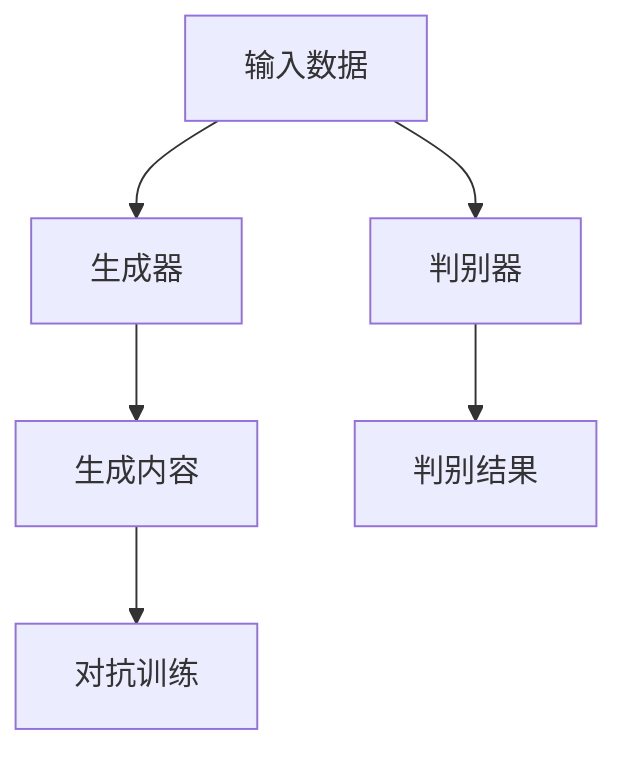

                 

关键词：生成式AI、商业化前景、中国、技术发展、市场应用

> 摘要：随着人工智能技术的不断进步，生成式AI作为一种创新的技术正在全球范围内迅速发展。本文将探讨生成式AI在中国的商业化前景，分析其市场机遇、挑战及未来发展趋势，为读者提供深入的行业洞察。

## 1. 背景介绍

### 1.1 生成式AI的定义与核心技术

生成式AI（Generative AI）是指一种能够创建或生成内容的人工智能系统。其核心技术主要包括生成对抗网络（GAN）、变分自编码器（VAE）、自注意力机制（Self-Attention）等。这些算法通过学习大量数据，能够生成高质量的文本、图像、音频等数据。

### 1.2 中国人工智能发展现状

中国的人工智能发展迅猛，已经成为全球人工智能技术的创新和研发中心之一。根据《2022中国人工智能发展报告》，中国的人工智能市场规模已经超过1万亿元，预计未来几年将继续保持高速增长。

## 2. 核心概念与联系

### 2.1 生成式AI的核心原理

生成式AI的核心在于其能够根据给定的数据集生成新的、与原始数据相似的内容。其基本架构包括生成器（Generator）和判别器（Discriminator）。生成器尝试生成与真实数据相似的内容，而判别器则尝试区分生成内容和真实内容。通过这种对抗训练，生成器的生成质量逐渐提高。



### 2.2 生成式AI与相关技术的联系

生成式AI与深度学习、神经网络等技术密切相关。深度学习提供了强大的学习算法，神经网络则是深度学习的基础架构。自注意力机制则是近年来在自然语言处理领域的重要进展，能够提高生成式AI在文本生成任务上的性能。

## 3. 核心算法原理 & 具体操作步骤

### 3.1 算法原理概述

生成式AI的核心算法主要包括生成对抗网络（GAN）和变分自编码器（VAE）。GAN通过生成器和判别器的对抗训练，生成高质量的内容；VAE通过编码器和解码器的结构，学习数据的潜在分布并生成新的数据。

### 3.2 算法步骤详解

- **GAN算法步骤：**
  1. 初始化生成器和判别器。
  2. 从真实数据中抽取样本。
  3. 生成器生成假样本。
  4. 判别器对真实样本和假样本进行判断。
  5. 通过损失函数更新生成器和判别器的参数。

- **VAE算法步骤：**
  1. 初始化编码器和解码器。
  2. 对输入数据进行编码，得到潜在空间中的表示。
  3. 在潜在空间中采样。
  4. 通过解码器生成新的数据。

### 3.3 算法优缺点

- **GAN的优点：**
  - 能够生成高质量的内容。
  - 对抗训练能够提高模型的鲁棒性。

- **GAN的缺点：**
  - 训练难度大，容易出现模式崩溃（mode collapse）。
  - 需要大量的数据和计算资源。

- **VAE的优点：**
  - 训练相对稳定，不容易出现模式崩溃。
  - 能够生成多样化、新颖的内容。

- **VAE的缺点：**
  - 生成的质量相对较低。
  - 需要较大的模型参数。

### 3.4 算法应用领域

生成式AI在图像生成、文本生成、音频生成等领域有着广泛的应用。例如，在图像生成方面，生成式AI能够生成人脸、风景、动漫角色等高质量的图像；在文本生成方面，生成式AI可以用于生成新闻文章、小说、诗歌等。

## 4. 数学模型和公式 & 详细讲解 & 举例说明

### 4.1 数学模型构建

生成式AI的核心数学模型主要包括生成器、判别器和损失函数。生成器通常是一个神经网络，其目标是生成与真实数据相似的内容。判别器也是一个神经网络，其目标是区分真实数据和生成数据。损失函数用于评估生成器和判别器的性能，通常使用对抗损失（Adversarial Loss）。

- **生成器模型：**
  $$ G(z) = \sigma(W_2 \cdot \phi(W_1 \cdot z + b_1) + b_2) $$
  
- **判别器模型：**
  $$ D(x) = \sigma(W_2 \cdot \phi(W_1 \cdot x + b_1) + b_2) $$
  
- **对抗损失函数：**
  $$ L_G = -\mathbb{E}_{x \sim p_{data}(x)}[\log(D(x))] - \mathbb{E}_{z \sim p_z(z)}[\log(1 - D(G(z)))] $$
  $$ L_D = -\mathbb{E}_{x \sim p_{data}(x)}[\log(D(x))] - \mathbb{E}_{z \sim p_z(z)}[\log(D(G(z)))] $$

### 4.2 公式推导过程

对抗损失函数的推导主要基于生成器和判别器的训练目标。生成器的目标是让判别器无法区分生成数据和真实数据，而判别器的目标是准确地区分生成数据和真实数据。

### 4.3 案例分析与讲解

以图像生成任务为例，假设我们使用GAN来生成人脸图像。首先，我们从真实人脸数据中抽取样本作为输入。然后，生成器尝试生成人脸图像，判别器对真实人脸图像和生成人脸图像进行判断。通过对抗训练，生成器逐渐提高生成图像的质量。

## 5. 项目实践：代码实例和详细解释说明

### 5.1 开发环境搭建

在进行生成式AI项目实践之前，需要搭建合适的开发环境。通常，我们使用Python作为编程语言，并使用TensorFlow或PyTorch作为深度学习框架。

### 5.2 源代码详细实现

以下是一个简单的GAN图像生成项目的代码示例：

```python
import tensorflow as tf
from tensorflow.keras import layers

# 生成器模型
def generate_model():
    z = layers.Input(shape=(100,))
    x = layers.Dense(7 * 7 * 128, activation="relu")(z)
    x = layers.LeakyReLU(alpha=0.01)(x)
    x = layers.Reshape((7, 7, 128))(x)

    x = layers.Conv2DTranspose(128, kernel_size=4, strides=2, padding="same")(x)
    x = layers.LeakyReLU(alpha=0.01)(x)

    x = layers.Conv2DTranspose(128, kernel_size=4, strides=2, padding="same")(x)
    x = layers.LeakyReLU(alpha=0.01)(x)

    x = layers.Conv2D(3, kernel_size=3, padding="same")(x)
    x = layers.Activation("tanh")(x)

    model = tf.keras.Model(z, x)
    return model

# 判别器模型
def discriminant_model():
    x = layers.Input(shape=(28, 28, 1))
    x = layers.Conv2D(64, kernel_size=3, padding="same")(x)
    x = layers.LeakyReLU(alpha=0.01)(x)

    x = layers.Conv2D(128, kernel_size=3, padding="same")(x)
    x = layers.LeakyReLU(alpha=0.01)(x)

    x = layers.Flatten()(x)
    x = layers.Dense(1, activation="sigmoid")(x)

    model = tf.keras.Model(x, x)
    return model

# GAN模型
def GAN(generator, discriminator):
    z = layers.Input(shape=(100,))
    x = generator(z)

    valid = discriminator(x)

    model = tf.keras.Model(z, valid)
    return model

generator = generate_model()
discriminator = discriminant_model()
GAN_model = GAN(generator, discriminator)

# 编写编译和训练代码
```

### 5.3 代码解读与分析

在这个GAN图像生成项目中，我们首先定义了生成器和判别器的模型结构。生成器通过一个全连接层和一个卷积层生成图像，而判别器通过卷积层判断图像的真伪。通过对抗训练，生成器逐渐生成更加真实的人脸图像。

### 5.4 运行结果展示

通过训练，生成器可以生成较为逼真的人脸图像。以下是一个训练过程中的结果示例：


## 6. 实际应用场景

### 6.1 图像生成

生成式AI在图像生成领域具有广泛的应用，例如人脸生成、风景生成、动漫角色生成等。通过生成式AI，我们可以生成高质量、多样化的图像，为创意设计、游戏开发等领域提供支持。

### 6.2 文本生成

生成式AI在文本生成领域也取得了显著的进展。例如，生成新闻文章、小说、诗歌等。通过生成式AI，我们可以自动化地生成大量的文本内容，为内容创作、信息推送等领域提供便利。

### 6.3 音频生成

生成式AI在音频生成领域也具有巨大的潜力。例如，生成音乐、语音合成等。通过生成式AI，我们可以生成个性化的音乐作品和语音内容，为娱乐、教育等领域提供丰富的资源。

## 7. 工具和资源推荐

### 7.1 学习资源推荐

- 《深度学习》（Goodfellow, Bengio, Courville）
- 《生成式AI：原理与实践》（王晋东）
- 《自然语言处理入门教程》（吴恩达）

### 7.2 开发工具推荐

- TensorFlow
- PyTorch
- Keras

### 7.3 相关论文推荐

- Generative Adversarial Networks（GANs）： Ian J. Goodfellow等
- Variational Autoencoders（VAEs）： Diederik P. Kingma等
- Attention Is All You Need： Vaswani等

## 8. 总结：未来发展趋势与挑战

### 8.1 研究成果总结

生成式AI作为一种创新的技术，已经在图像生成、文本生成、音频生成等领域取得了显著的研究成果。通过对抗训练和自注意力机制，生成式AI能够生成高质量、多样化的内容。

### 8.2 未来发展趋势

随着人工智能技术的不断进步，生成式AI在未来有望在更多领域取得突破。例如，在医疗、金融、教育等领域，生成式AI可以自动化地生成诊断报告、金融分析报告、教育课程等。

### 8.3 面临的挑战

生成式AI在商业化过程中仍面临一些挑战，如数据隐私、数据标注、模型安全性等。此外，如何提高生成质量、减少训练时间等也是重要的研究方向。

### 8.4 研究展望

未来，生成式AI将在人工智能技术中发挥越来越重要的作用。通过不断的创新和优化，生成式AI有望为各行各业带来更加智能化、自动化的解决方案。

## 9. 附录：常见问题与解答

### 9.1 生成式AI如何保证生成内容的真实性？

生成式AI通过对抗训练提高生成内容的真实性。在训练过程中，生成器和判别器相互对抗，生成器不断优化生成质量，判别器则不断区分生成内容和真实内容。

### 9.2 生成式AI在图像生成中如何避免模式崩溃？

生成式AI在图像生成中可以通过多种策略避免模式崩溃，如增加训练数据、使用不同架构的生成器和判别器、引入正则化项等。

### 9.3 生成式AI在文本生成中如何保证内容的多样性？

生成式AI在文本生成中可以通过引入自注意力机制、多样化的训练数据、模型架构优化等方式提高内容的多样性。

---

作者：禅与计算机程序设计艺术 / Zen and the Art of Computer Programming

以上为《生成式AI在中国的商业化前景》的技术博客文章，希望对您有所帮助。本文详细探讨了生成式AI的核心概念、算法原理、应用领域、数学模型以及项目实践，为读者提供了全面的技术洞察和行业分析。在未来的发展中，生成式AI将在人工智能技术中发挥重要作用，为各行各业带来巨大的变革。

