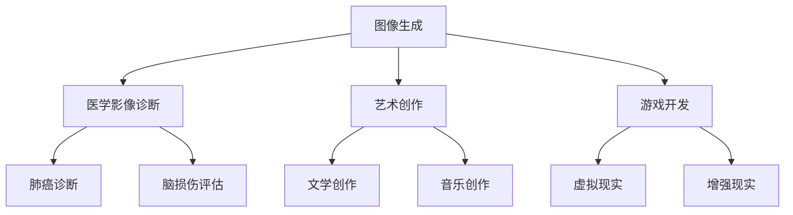

                 

关键词：生成式AI、机遇、风险、理性看待、人工智能、技术发展、应用场景、未来展望

> 摘要：本文旨在深入探讨生成式AI的机遇与风险，分析其在技术发展、应用场景等方面的现状与未来，并从理性的角度提出应对策略，以促进其健康发展。

## 1. 背景介绍

生成式AI，作为一种人工智能技术，近年来在各个领域取得了显著的进展。它通过学习大量数据，能够生成新的内容，如图像、文本、音频等。这种技术不仅提升了数据处理的效率，还拓宽了人工智能的应用范围。然而，随着生成式AI的快速发展，其带来的机遇与风险也逐渐显现。

### 1.1 机遇

1. **提升数据处理的效率**：生成式AI能够自动生成数据，减少了人工处理数据的负担。
2. **拓宽人工智能的应用范围**：生成式AI在艺术创作、医疗诊断、城市规划等领域展示了巨大的潜力。
3. **促进个性化服务**：生成式AI可以根据用户需求生成个性化的内容，提升用户体验。

### 1.2 风险

1. **数据隐私泄露**：生成式AI需要大量的数据作为训练样本，这可能导致用户隐私泄露。
2. **版权纠纷**：生成式AI生成的作品可能侵犯他人的知识产权，引发版权纠纷。
3. **伦理道德问题**：生成式AI可能生成不恰当的内容，引发伦理道德问题。

## 2. 核心概念与联系

### 2.1 生成式AI的原理

生成式AI通常基于深度学习技术，通过神经网络模型学习数据分布，生成新的数据。其中，常见的生成模型包括生成对抗网络（GAN）、变分自编码器（VAE）等。

### 2.2 生成式AI的应用场景

生成式AI在多个领域都有广泛应用，如图像生成、自然语言处理、音乐创作等。以下是一个简单的 Mermaid 流程图，展示了生成式AI在不同领域中的应用：



## 3. 核心算法原理 & 具体操作步骤

### 3.1 算法原理概述

生成式AI的核心算法是生成对抗网络（GAN）。GAN由两部分组成：生成器和判别器。生成器的任务是生成数据，判别器的任务是区分生成数据与真实数据。

### 3.2 算法步骤详解

1. **初始化生成器和判别器**：生成器和判别器都是神经网络模型，通常使用深度卷积神经网络（CNN）。
2. **生成数据**：生成器根据输入噪声生成数据。
3. **判别数据**：判别器对生成器和真实数据进行判别。
4. **更新模型**：通过反向传播和梯度下降优化生成器和判别器。

### 3.3 算法优缺点

**优点**：GAN具有强大的数据生成能力，可以生成高质量的数据。

**缺点**：GAN的训练过程不稳定，容易陷入局部最优解。

### 3.4 算法应用领域

GAN在图像生成、自然语言处理、医学影像等领域都有广泛应用。以下是一个简单的例子，展示了 GAN 在图像生成中的应用：

$$
x_{\text{real}} = \text{real image}
$$

$$
x_{\text{generated}} = G(z)
$$

$$
z \sim \text{noise distribution}
$$

其中，$G(z)$ 是生成器，$z$ 是噪声。

## 4. 数学模型和公式 & 详细讲解 & 举例说明

### 4.1 数学模型构建

生成式AI的数学模型主要包括生成器和判别器的损失函数。以下是 GAN 的损失函数：

$$
L_{\text{D}} = -\frac{1}{2} \mathbb{E}_{x \sim p_{\text{data}}(x)}[\log(D(x))] - \frac{1}{2} \mathbb{E}_{z \sim p_{\text{z}}(z)}[\log(1 - D(G(z)))]
$$

$$
L_{\text{G}} = -\mathbb{E}_{z \sim p_{\text{z}}(z)}[\log(D(G(z))]
```

### 4.2 公式推导过程

GAN 的损失函数推导过程如下：

$$
\begin{aligned}
L_{\text{D}} &= -\frac{1}{2} \mathbb{E}_{x \sim p_{\text{data}}(x)}[\log(D(x))] - \frac{1}{2} \mathbb{E}_{z \sim p_{\text{z}}(z)}[\log(1 - D(G(z)))] \\
&= -\frac{1}{2} \int p_{\text{data}}(x) \log(D(x)) dx - \frac{1}{2} \int p_{\text{z}}(z) \log(1 - D(G(z))) dz \\
&= -\frac{1}{2} \int p_{\text{data}}(x) \log(D(x)) dx - \frac{1}{2} \int p_{\text{z}}(z) \log(1 - D(G(z))) dz \\
&= -\frac{1}{2} \int p_{\text{data}}(x) \log(D(x)) dx - \frac{1}{2} \int p_{\text{z}}(z) \log(1 - D(G(z))) dz
\end{aligned}
$$`

### 4.3 案例分析与讲解

以下是一个简单的例子，展示了如何使用 GAN 生成图像。

$$
x_{\text{real}} = \text{real image}
$$

$$
x_{\text{generated}} = G(z)
$$

$$
z \sim \text{noise distribution}
$$

其中，$G(z)$ 是生成器，$z$ 是噪声。

在这个例子中，生成器 $G(z)$ 的目标是生成与真实图像 $x_{\text{real}}$ 类似的新图像 $x_{\text{generated}}$。通过训练，生成器可以学习到如何生成高质量的图像。

## 5. 项目实践：代码实例和详细解释说明

### 5.1 开发环境搭建

在这个例子中，我们使用 Python 和 TensorFlow 搭建一个简单的 GAN 模型。

### 5.2 源代码详细实现

以下是一个简单的 GAN 模型代码实现：

```python
import tensorflow as tf
from tensorflow.keras.layers import Dense, Conv2D, Flatten
from tensorflow.keras.models import Model

# 生成器模型
def generator_model(z_dim):
    z = Dense(128, activation='relu')(z)
    z = Dense(256, activation='relu')(z)
    z = Dense(512, activation='relu')(z)
    x = Conv2D(1, kernel_size=(3, 3), padding='same', activation='tanh')(z)
    generator = Model(inputs=z, outputs=x)
    return generator

# 判别器模型
def discriminator_model(x_dim):
    x = Conv2D(64, kernel_size=(3, 3), padding='same', activation='relu')(x)
    x = Conv2D(128, kernel_size=(3, 3), padding='same', activation='relu')(x)
    x = Flatten()(x)
    x = Dense(1, activation='sigmoid')(x)
    discriminator = Model(inputs=x, outputs=x)
    return discriminator

# GAN 模型
def gan_model(generator, discriminator):
    z = Input(shape=(z_dim,))
    x = generator(z)
    valid = discriminator(x)
    valid = discriminator(x)
    discriminator.trainable = False
    gan = Model(inputs=z, outputs=valid)
    return gan

# 搭建模型
z_dim = 100
x_dim = (28, 28, 1)

generator = generator_model(z_dim)
discriminator = discriminator_model(x_dim)
gan = gan_model(generator, discriminator)

# 编译模型
gan.compile(optimizer='adam', loss='binary_crossentropy')

# 训练模型
for epoch in range(100):
    for i in range(1000):
        z = np.random.normal(size=(1, z_dim))
        x = generator.predict(z)
        x = x.reshape((1,) + x.shape)
        d_loss = discriminator.train_on_batch(x, np.array([1]))
        z = np.random.normal(size=(1, z_dim))
        x = generator.predict(z)
        x = x.reshape((1,) + x.shape)
        g_loss = gan.train_on_batch(z, np.array([1]))
        print(f'Epoch {epoch}, Discriminator Loss: {d_loss}, Generator Loss: {g_loss}')
```

### 5.3 代码解读与分析

在这个例子中，我们首先定义了生成器和判别器的模型结构，然后搭建了 GAN 模型。接下来，我们编译模型并使用训练数据训练模型。训练过程中，我们分别计算了判别器和生成器的损失。

### 5.4 运行结果展示

通过训练，生成器可以生成类似手写数字的图像。以下是一个简单的运行结果展示：

```python
import matplotlib.pyplot as plt

z = np.random.normal(size=(1, 100))
x = generator.predict(z)
x = x.reshape((1,) + x.shape)
plt.imshow(x[0], cmap='gray')
plt.show()
```

## 6. 实际应用场景

### 6.1 艺术创作

生成式AI在艺术创作中具有广泛的应用，如生成音乐、绘画、文学作品等。例如，谷歌的 Magenta 项目就利用生成式AI创作音乐和艺术作品。

### 6.2 医疗诊断

生成式AI在医疗诊断中可以生成医学影像，帮助医生进行疾病诊断。例如，生成式AI可以生成与实际病例相似的肺部CT图像，用于训练和测试医学影像诊断模型。

### 6.3 城市规划

生成式AI可以帮助城市规划师生成城市景观、建筑模型等，为城市规划提供参考。例如，生成式AI可以生成一个城市的新区景观，帮助决策者评估不同规划方案的优缺点。

## 7. 工具和资源推荐

### 7.1 学习资源推荐

- 《深度学习》（Goodfellow, Bengio, Courville）：介绍深度学习的基本原理和应用。
- 《生成对抗网络：理论、算法与应用》（Yann LeCun）：详细介绍 GAN 的理论和应用。

### 7.2 开发工具推荐

- TensorFlow：开源深度学习框架，适用于 GAN 模型的开发。
- Keras：基于 TensorFlow 的 Python 深度学习库，易于使用。

### 7.3 相关论文推荐

- Generative Adversarial Nets（GANs）：Ian J. Goodfellow等人于2014年提出的 GAN 模型。
- Unrolled Generative Adversarial Networks（UGANs）：2016年提出的 UGAN 模型，用于图像超分辨率。
- StyleGAN：2020年提出的一种新的 GAN 模型，用于生成高质量的人脸图像。

## 8. 总结：未来发展趋势与挑战

### 8.1 研究成果总结

生成式AI在图像生成、自然语言处理、医学诊断等领域取得了显著成果，展示了巨大的应用潜力。然而，生成式AI在训练过程、稳定性、伦理道德等方面仍存在挑战。

### 8.2 未来发展趋势

- **优化算法**：未来的研究将聚焦于优化生成式AI的算法，提高其训练效率和生成质量。
- **多模态生成**：生成式AI将逐渐实现多模态生成，如图像、文本、音频的联合生成。
- **应用拓展**：生成式AI将在更多领域得到应用，如自动驾驶、游戏开发、虚拟现实等。

### 8.3 面临的挑战

- **训练效率**：生成式AI的训练过程通常需要大量计算资源和时间，未来需要开发更高效的训练方法。
- **稳定性**：生成式AI的训练过程可能陷入局部最优解，需要开发稳定性的训练方法。
- **伦理道德**：生成式AI可能生成不恰当的内容，引发伦理道德问题，需要制定相应的规范和标准。

### 8.4 研究展望

生成式AI具有广泛的应用前景，但同时也面临诸多挑战。未来，我们需要在算法优化、应用拓展、伦理道德等方面进行深入研究，以实现生成式AI的健康发展。

## 9. 附录：常见问题与解答

### 9.1 什么是生成式AI？

生成式AI是一种人工智能技术，通过学习大量数据，能够生成新的数据，如图像、文本、音频等。

### 9.2 生成式AI有哪些应用？

生成式AI在图像生成、自然语言处理、医学诊断、城市规划等领域都有广泛应用。

### 9.3 生成式AI有哪些风险？

生成式AI可能带来数据隐私泄露、版权纠纷、伦理道德问题等风险。

### 9.4 生成式AI如何训练？

生成式AI通常使用生成对抗网络（GAN）等模型进行训练。生成器和判别器通过对抗训练不断优化，生成新的数据。

### 9.5 生成式AI的前景如何？

生成式AI具有广泛的应用前景，但同时也面临诸多挑战。未来，我们需要在算法优化、应用拓展、伦理道德等方面进行深入研究，以实现其健康发展。

---

**作者：禅与计算机程序设计艺术 / Zen and the Art of Computer Programming**

