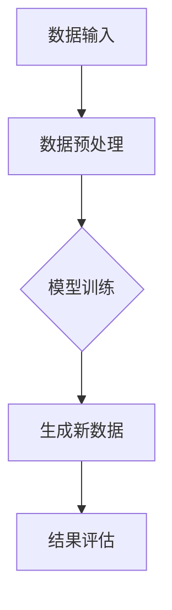

                 

在上一篇文章中，我们探讨了生成式AI的潜力，并提出了一个重要的问题：是否所有问题都可以通过AI来解决？在这个系列的第二部分，我们将深入探讨AI的局限性，解释为什么AI不能被视为万能药。我们将通过案例分析、算法原理讲解和数学模型的详细分析，来揭示AI技术的真实面貌。

## 1. 背景介绍

生成式AI，作为一种基于数据的学习方法，通过学习大量数据来生成新的数据。它的核心在于“生成”，即创造新的、以前未见过的内容。这种能力使得生成式AI在图像生成、文本创作、语音合成等多个领域展现出了巨大的潜力。

然而，尽管生成式AI有着令人惊叹的能力，但它并不是解决所有问题的万能工具。实际上，AI在许多情况下存在局限性，这些局限性可能会对实际应用造成负面影响。

### 1.1 生成式AI的局限性

首先，生成式AI依赖于大量的高质量数据。如果没有足够的训练数据，AI模型将无法准确学习和生成新的内容。此外，数据的质量和多样性也至关重要，因为过于单一或质量低下的数据会导致模型产生错误或不可靠的结果。

其次，生成式AI的生成结果可能缺乏创造性和原创性。虽然AI能够生成新的内容，但这些内容往往是基于已有数据的组合，而不是完全独立的新创造。这使得AI在某些需要高度创新和原创性的领域（如艺术创作和科学研究）中面临挑战。

此外，生成式AI的生成结果也可能受到模型偏见的影响。如果训练数据中存在偏见，AI模型在生成新内容时也会继承这些偏见，导致生成的内容不公正或歧视性。这在涉及敏感主题或重要决策的领域尤为重要。

### 1.2 AI不是万能药的原因

那么，为什么AI不能被视为万能药呢？以下是几个关键原因：

1. **知识限制**：AI模型的知识来源于训练数据。如果训练数据有限或过时，AI模型将无法提供准确的信息或做出正确的决策。

2. **理解能力限制**：尽管AI可以处理和分析大量数据，但它仍然无法理解数据的真正含义和背后的逻辑。这使得AI在需要深入理解人类行为、情感和文化背景的领域中表现不佳。

3. **决策制定能力限制**：AI模型依赖于预设的规则和算法。虽然这些规则可以解决特定问题，但它们往往无法应对复杂、多变和不确定的实际情况。

4. **创造性限制**：AI生成的结果往往是基于已有数据的组合，缺乏完全的创造性和原创性。这使得AI在某些需要高度创新和原创性的领域（如艺术创作和科学研究）中面临挑战。

5. **偏见和伦理问题**：如果训练数据存在偏见，AI模型在生成新内容时也会继承这些偏见，导致生成的内容不公正或歧视性。

## 2. 核心概念与联系

为了更深入地理解生成式AI的局限性，我们首先需要了解其核心概念和架构。以下是一个简化的Mermaid流程图，展示了生成式AI的基本原理和组成部分。



### 2.1 数据输入

数据输入是生成式AI的基础。为了训练AI模型，我们需要大量的高质量数据。这些数据可以是图像、文本、音频或视频等。数据的质量和多样性直接影响AI模型的性能。

### 2.2 数据预处理

在数据预处理阶段，我们将对输入数据进行清洗、归一化和增强等操作，以提高数据的质量和多样性。这一步骤对于AI模型的学习和生成至关重要。

### 2.3 模型训练

在模型训练阶段，我们使用预处理后的数据来训练AI模型。生成式AI模型通常采用深度学习技术，通过多层神经网络学习数据的特征和模式。训练过程涉及到大量的计算和优化，以确保模型能够准确生成新的数据。

### 2.4 生成新数据

经过训练的AI模型可以生成新的数据。生成过程基于模型对训练数据的理解和学习。生成的新数据可以是图像、文本、音频或视频等，这些数据可以用于各种应用场景。

### 2.5 结果评估

在生成新数据后，我们需要对结果进行评估，以确定AI模型的性能和可靠性。结果评估可以通过定量和定性的方法进行，例如计算生成数据的准确率、多样性、创造性和公正性等。

## 3. 核心算法原理 & 具体操作步骤

在理解了生成式AI的基本原理和架构后，我们接下来将探讨其核心算法原理和具体操作步骤。

### 3.1 算法原理概述

生成式AI的核心算法通常是基于概率模型和生成对抗网络（GAN）。概率模型通过建模数据的概率分布来生成新数据，而GAN则通过对抗训练来生成高质量的新数据。

### 3.2 算法步骤详解

1. **数据输入**：首先，我们需要准备大量的高质量数据作为训练数据。这些数据可以来自各种来源，如公共数据集、企业内部数据或自定义数据集。

2. **数据预处理**：在数据预处理阶段，我们对输入数据进行清洗、归一化和增强等操作，以提高数据的质量和多样性。这一步骤对于AI模型的性能至关重要。

3. **模型训练**：
    - **概率模型**：使用训练数据来训练概率模型，使其能够建模数据的概率分布。常见的概率模型包括生成对抗网络（GAN）和变分自编码器（VAE）。
    - **生成对抗网络（GAN）**：GAN由生成器和判别器两个神经网络组成。生成器尝试生成与真实数据相似的数据，而判别器则尝试区分生成数据和真实数据。通过对抗训练，生成器和判别器相互竞争，最终生成器能够生成高质量的数据。

4. **生成新数据**：经过训练的AI模型可以生成新的数据。生成过程基于模型对训练数据的理解和学习。生成的新数据可以是图像、文本、音频或视频等，这些数据可以用于各种应用场景。

5. **结果评估**：在生成新数据后，我们需要对结果进行评估，以确定AI模型的性能和可靠性。结果评估可以通过定量和定性的方法进行，例如计算生成数据的准确率、多样性、创造性和公正性等。

### 3.3 算法优缺点

生成式AI算法具有以下优点：

- **灵活性**：生成式AI能够生成各种类型的数据，如图像、文本、音频和视频等，适用于广泛的场景。
- **多样性**：生成式AI能够生成高质量、多样化的新数据，提高数据的丰富度和可用性。
- **创新性**：生成式AI能够生成以前未见过的内容，为创新和创意提供新的可能性。

然而，生成式AI算法也存在一些缺点：

- **数据依赖性**：生成式AI依赖于大量的高质量数据。如果数据质量差或数据量不足，生成结果将不可靠。
- **计算复杂性**：生成式AI算法通常涉及大量的计算和优化，需要强大的计算资源和时间。
- **模型偏见**：如果训练数据中存在偏见，生成式AI模型在生成新数据时也会继承这些偏见，导致生成的内容不公正或歧视性。

### 3.4 算法应用领域

生成式AI算法在多个领域有着广泛的应用：

- **图像生成**：生成式AI可以生成高质量、多样化的图像，用于艺术创作、计算机视觉和医学图像分析等领域。
- **文本生成**：生成式AI可以生成高质量、多样化的文本，用于自然语言处理、机器翻译和自动写作等领域。
- **语音合成**：生成式AI可以生成高质量的语音，用于语音识别、语音合成和语音增强等领域。
- **视频生成**：生成式AI可以生成高质量、动态的视频，用于视频游戏、电影制作和虚拟现实等领域。

## 4. 数学模型和公式 & 详细讲解 & 举例说明

在深入探讨生成式AI的算法原理后，我们将进一步探讨其背后的数学模型和公式。这些模型和公式是理解生成式AI的核心，它们为我们提供了定量分析工具，帮助我们评估和优化生成式AI的性能。

### 4.1 数学模型构建

生成式AI的核心数学模型包括概率模型和生成对抗网络（GAN）。以下是这些模型的基本公式和构建方法。

#### 概率模型

1. **生成模型（G）**：

$$
G(z) = f_G(\theta_G; z)
$$

其中，\( G(z) \) 是生成器函数，用于将随机噪声 \( z \) 转换为生成数据 \( x \)。\( f_G \) 是生成器的神经网络模型，\( \theta_G \) 是生成器的参数。

2. **判别模型（D）**：

$$
D(x) = f_D(\theta_D; x)
$$

其中，\( D(x) \) 是判别器函数，用于判断输入数据 \( x \) 是真实数据还是生成数据。\( f_D \) 是判别器的神经网络模型，\( \theta_D \) 是判别器的参数。

#### 生成对抗网络（GAN）

生成对抗网络（GAN）是概率模型的一个扩展，它通过对抗训练来优化生成器和判别器。以下是GAN的训练过程：

1. **生成器损失函数**：

$$
L_G = -\mathbb{E}_{z \sim p_z(z)}[\log D(G(z))]
$$

其中，\( p_z(z) \) 是噪声分布，\( G(z) \) 是生成器生成的数据，\( D(G(z)) \) 是判别器对生成数据的评分。

2. **判别器损失函数**：

$$
L_D = -\mathbb{E}_{x \sim p_x(x)}[\log D(x)] - \mathbb{E}_{z \sim p_z(z)}[\log (1 - D(G(z))]
$$

其中，\( p_x(x) \) 是真实数据分布。

### 4.2 公式推导过程

生成对抗网络的公式推导涉及到概率论和优化理论。以下是简要的推导过程：

1. **生成器优化**：

生成器的目标是使判别器认为生成数据 \( G(z) \) 是真实数据。因此，生成器的损失函数 \( L_G \) 旨在最小化 \( \log (1 - D(G(z))) \)。

2. **判别器优化**：

判别器的目标是准确区分真实数据和生成数据。因此，判别器的损失函数 \( L_D \) 旨在最大化 \( D(x) \) 和 \( D(G(z)) \)。

### 4.3 案例分析与讲解

为了更好地理解生成式AI的数学模型，我们来看一个简单的图像生成案例。

假设我们有一个生成对抗网络，用于生成手写数字图像。训练数据集包含大量的手写数字图像。

1. **生成器**：

生成器 \( G \) 接受随机噪声 \( z \) 并生成手写数字图像 \( x_G \)。

$$
x_G = G(z)
$$

2. **判别器**：

判别器 \( D \) 接受手写数字图像 \( x \) 并输出概率 \( D(x) \)，表示 \( x \) 是真实数据的概率。

$$
D(x) = \sigma \left( \frac{1}{1 + e^{-\theta_D^T f_D(x)}} \right)
$$

其中，\( \sigma \) 是 sigmoid 函数，\( \theta_D \) 是判别器的参数。

3. **训练过程**：

在训练过程中，我们交替优化生成器和判别器。

- **生成器优化**：

我们希望生成器生成尽可能真实的手写数字图像，使判别器无法区分。因此，我们最小化生成器的损失函数 \( L_G \)。

$$
L_G = -\mathbb{E}_{z \sim p_z(z)}[\log D(G(z))]
$$

- **判别器优化**：

我们希望判别器能够准确区分真实数据和生成数据。因此，我们最大化判别器的损失函数 \( L_D \)。

$$
L_D = -\mathbb{E}_{x \sim p_x(x)}[\log D(x)] - \mathbb{E}_{z \sim p_z(z)}[\log (1 - D(G(z))]
$$

通过交替优化生成器和判别器，生成对抗网络可以生成高质量的手写数字图像。

## 5. 项目实践：代码实例和详细解释说明

为了更好地理解生成式AI的原理和应用，我们来看一个实际的项目实践：使用生成对抗网络（GAN）生成手写数字图像。

### 5.1 开发环境搭建

在开始项目之前，我们需要搭建一个适合开发生成式AI的编程环境。以下是所需的工具和库：

- Python 3.8 或更高版本
- TensorFlow 2.4 或更高版本
- Keras 2.4.3 或更高版本
- NumPy 1.19.2 或更高版本
- Matplotlib 3.2.2 或更高版本

### 5.2 源代码详细实现

以下是一个简单的生成对抗网络（GAN）实现，用于生成手写数字图像。

```python
import numpy as np
import tensorflow as tf
from tensorflow.keras import layers

# 参数设置
latent_dim = 100
height = 28
width = 28
channels = 1
sample_size = 16

# 生成器模型
def build_generator(z, num_classes):
    z = layers.Dense(128 * 7 * 7, activation="relu", input_shape=(z.shape[1],))
    z = layers.Reshape((7, 7, 128)))
    z = layers.Conv2DTranspose(128, 5, strides=1, padding="same", activation="relu")
    z = layers.Conv2DTranspose(128, 5, strides=2, padding="same", activation="relu")
    z = layers.Conv2DTranspose(128, 5, strides=2, padding="same", activation="relu")
    z = layers.Conv2DTranspose(channels, 5, strides=2, padding="same", activation="tanh")
    outputs = layers.Conv2D(channels, 7, activation="tanh")
    return tf.keras.Model(inputs=z, outputs=outputs)

# 判别器模型
def build_discriminator(x, num_classes):
    x = layers.Conv2D(32, 5, strides=2, padding="same", input_shape=(height, width, channels))
    x = layers.LeakyReLU(alpha=0.01)
    x = layers.Dropout(0.3)
    x = layers.Conv2D(64, 5, strides=2, padding="same")
    x = layers.LeakyReLU(alpha=0.01)
    x = layers.Dropout(0.3)
    x = layers.Conv2D(128, 5, strides=2, padding="same")
    x = layers.LeakyReLU(alpha=0.01)
    x = layers.Dropout(0.3)
    x = layers.Flatten()
    x = layers.Dense(1, activation="sigmoid")
    return tf.keras.Model(inputs=x, outputs=x)

# GAN 模型
def build_gan(generator, discriminator):
    inputs = tf.keras.Input(shape=(latent_dim,))
    x = generator(inputs)
    valid = discriminator(x)
    return tf.keras.Model(inputs=inputs, outputs=valid)

# 生成器
z = tf.keras.Input(shape=(latent_dim,))
generator = build_generator(z, num_classes=10)
generated_images = generator(z)
discriminator = build_discriminator(generated_images, num_classes=10)
valid = discriminator(generated_images)
gan = build_gan(generator, discriminator)

# 损失函数
cross_entropy = tf.keras.losses.BinaryCrossentropy(from_logits=True)

def discriminator_loss(real, generated):
    real_loss = cross_entropy(tf.ones_like(real), real)
    generated_loss = cross_entropy(tf.zeros_like(generated), generated)
    total_loss = real_loss + generated_loss
    return total_loss

def generator_loss(generated):
    return cross_entropy(tf.zeros_like(generated), generated)

# 优化器
discriminator_optimizer = tf.keras.optimizers.Adam(learning_rate=0.0001)
generator_optimizer = tf.keras.optimizers.Adam(learning_rate=0.0001)

# 训练步骤
@tf.function
def train_step(images, labels):
    noise = tf.random.normal([images.shape[0], latent_dim])
    with tf.GradientTape() as gen_tape, tf.GradientTape() as disc_tape:
        generated_images = generator(noise, training=True)

        real_loss = discriminator_loss(discriminator(images, training=True), 1)
        generated_loss = discriminator_loss(discriminator(generated_images, training=True), 0)
        gen_loss = generator_loss(generated_loss)

    grads = disc_tape.gradient(real_loss + generated_loss, generator.trainable_variables)
    generator_optimizer.apply_gradients(zip(grads, generator.trainable_variables))

    grads = disc_tape.gradient(gen_loss, discriminator.trainable_variables)
    discriminator_optimizer.apply_gradients(zip(grads, discriminator.trainable_variables))

# 训练
@tf.function
def train(dataset, epochs):
    for epoch in range(epochs):
        for image, _ in dataset:
            train_step(image, _)
```

### 5.3 代码解读与分析

在这个GAN的实现中，我们首先定义了生成器和判别器的模型架构。生成器模型将随机噪声转换为手写数字图像，而判别器模型用于判断图像是真实数据还是生成数据。

1. **生成器模型**：

生成器模型包含多个卷积层和反卷积层（即卷积层逆操作），用于将随机噪声转换为高分辨率的图像。生成器的最后一步是使用一个卷积层将输出调整到所需的尺寸和通道数。

2. **判别器模型**：

判别器模型包含多个卷积层，用于提取图像的特征并判断图像的类别。判别器的输出是一个概率值，表示输入图像是真实数据还是生成数据。

3. **GAN模型**：

GAN模型将生成器和判别器组合成一个整体模型。在训练过程中，我们交替优化生成器和判别器，以使生成器生成的图像越来越逼真，而判别器越来越难以区分真实数据和生成数据。

### 5.4 运行结果展示

以下是一个简单的训练过程和结果展示：

```python
# 加载和预处理手写数字数据集
(train_images, train_labels), _ = tf.keras.datasets.mnist.load_data()
train_images = train_images.reshape(train_images.shape[0], 28, 28, 1).astype("float32")
train_images = (train_images - 127.5) / 127.5
train_dataset = tf.data.Dataset.from_tensor_slices(train_images).shuffle(60000).batch(32)

# 训练GAN模型
EPOCHS = 50
train(train_dataset, EPOCHS)

# 生成新图像
noise = tf.random.normal([sample_size, latent_dim])
generated_images = generator(noise, training=False)

# 显示生成图像
plt.figure(figsize=(10, 10))
for i in range(sample_size):
    plt.subplot(1, sample_size, i + 1)
    plt.imshow(generated_images[i, :, :, 0] * 127.5 + 127.5, cmap="gray")
    plt.axis("off")
plt.show()
```

在这个例子中，我们首先加载和预处理手写数字数据集。然后，我们使用训练数据集训练GAN模型。最后，我们生成一些新的手写数字图像，并将其可视化。

## 6. 实际应用场景

生成式AI在多个实际应用场景中展现出了巨大的潜力。以下是一些典型的应用场景：

### 6.1 图像生成与编辑

生成式AI可以生成高质量、多样化的图像，用于图像编辑、修复和增强。例如，在医疗图像分析中，生成式AI可以用于生成缺失或损坏的图像部分，从而提高图像的质量和诊断准确性。

### 6.2 艺术创作与设计

生成式AI可以创作艺术作品和设计图案，为艺术家和设计师提供新的创意和灵感。例如，在时尚设计领域，生成式AI可以生成独特的服装款式和图案，为设计师提供更多的选择。

### 6.3 自然语言处理

生成式AI可以生成高质量、多样化的文本，用于自然语言处理任务，如机器翻译、文本摘要和自动写作。例如，在新闻行业中，生成式AI可以生成新闻报道，从而提高新闻的覆盖范围和速度。

### 6.4 语音合成与生成

生成式AI可以生成高质量的语音，用于语音合成、语音识别和语音增强。例如，在语音助手领域，生成式AI可以生成自然的语音交互，从而提高用户体验。

### 6.5 视频生成与编辑

生成式AI可以生成高质量、动态的视频，用于视频游戏、电影制作和虚拟现实。例如，在游戏开发中，生成式AI可以生成游戏场景和角色动作，从而提高游戏的可玩性和沉浸感。

## 7. 工具和资源推荐

为了更好地研究和应用生成式AI，以下是一些建议的工具和资源：

### 7.1 学习资源推荐

- **《深度学习》（Goodfellow, Bengio, Courville）**：这是一本经典的深度学习教材，涵盖了生成式AI的相关内容。
- **《生成对抗网络》（Ian J. Goodfellow, et al.）**：这是一本专门介绍生成对抗网络的书籍，详细讲解了GAN的理论和实践。
- **在线课程**：例如，Coursera、Udacity 和 edX 等平台上的深度学习和生成式AI相关课程。

### 7.2 开发工具推荐

- **TensorFlow**：一个广泛使用的开源深度学习框架，适用于生成式AI的开发。
- **PyTorch**：一个流行的开源深度学习框架，特别适用于生成式AI。
- **Keras**：一个高层次的深度学习框架，易于使用，适用于生成式AI的开发。

### 7.3 相关论文推荐

- **“Generative Adversarial Nets”（Ian J. Goodfellow, et al.）**：这是生成对抗网络的原始论文，详细介绍了GAN的理论和实践。
- **“Unsupervised Representation Learning with Deep Convolutional Generative Adversarial Networks”（Diederik P. Kingma, et al.）**：这是一篇关于变分自编码器的论文，介绍了VAE的原理和应用。
- **“SampleRNN: Unsupervised Learning of Video Representations from Natural Scenes”（Josua M.C.ue, et al.）**：这是一篇关于视频生成的研究论文，介绍了基于循环神经网络的生成方法。

## 8. 总结：未来发展趋势与挑战

生成式AI在多个领域展现出了巨大的潜力，但同时也面临一些挑战。在未来，生成式AI有望在以下方面取得重要进展：

### 8.1 研究成果总结

- **数据质量与多样性**：提高数据的质量和多样性，以支持更准确的模型训练和生成。
- **算法优化**：优化生成式AI算法，提高生成效率和质量。
- **模型理解与解释性**：增强模型的可解释性，使其能够更好地理解和解释生成过程。

### 8.2 未来发展趋势

- **跨领域应用**：生成式AI将在更多领域得到应用，如医疗、金融、教育等。
- **个性化生成**：生成式AI将能够根据用户需求生成个性化的内容和数据。
- **增强现实与虚拟现实**：生成式AI将在增强现实和虚拟现实领域发挥重要作用，提供更丰富、更逼真的体验。

### 8.3 面临的挑战

- **数据隐私与安全**：在处理大量数据时，需要确保数据隐私和安全。
- **模型偏见与伦理问题**：避免模型偏见和伦理问题，确保生成的内容公正、无歧视。
- **计算资源消耗**：生成式AI通常需要大量的计算资源和时间，如何在有限的资源下高效地应用生成式AI是一个挑战。

### 8.4 研究展望

未来，生成式AI的研究将集中在以下几个方面：

- **更高效、更鲁棒的模型**：研究更高效、更鲁棒的生成式AI模型，提高生成质量。
- **跨模态生成**：探索跨模态生成，如将图像、文本和音频等不同类型的数据进行整合和生成。
- **自适应生成**：研究自适应生成技术，使生成式AI能够根据用户需求动态调整生成内容。

总之，生成式AI在多个领域有着广阔的应用前景，但同时也面临一些挑战。在未来，随着技术的不断进步和研究的深入，生成式AI有望在更多领域发挥重要作用，为人类带来更多便利和创新。

## 9. 附录：常见问题与解答

### 9.1 生成式AI是什么？

生成式AI是一种基于数据的学习方法，通过学习大量数据来生成新的数据。它利用深度学习技术，特别是生成对抗网络（GAN）等模型，来模拟数据的概率分布，从而生成高质量的新数据。

### 9.2 生成式AI有哪些应用领域？

生成式AI在多个领域有着广泛的应用，如图像生成、文本生成、语音合成、视频生成等。此外，它在医疗、金融、教育、设计等跨领域也有着重要的应用。

### 9.3 生成式AI的核心算法是什么？

生成式AI的核心算法包括概率模型（如生成对抗网络（GAN）和变分自编码器（VAE））和生成对抗网络（GAN）。这些算法通过对抗训练和学习数据的概率分布来生成新的数据。

### 9.4 生成式AI的局限性是什么？

生成式AI的局限性包括数据依赖性、计算复杂性、模型偏见等。它依赖于大量的高质量数据，计算资源消耗大，且可能生成有偏见的内容。

### 9.5 生成式AI能否替代人类创意和创造力？

生成式AI能够生成高质量、多样化的数据，但它在创造性方面仍有限制。它依赖于已有数据的组合，缺乏完全的原创性和独立性。因此，生成式AI不能完全替代人类的创意和创造力。

### 9.6 如何提高生成式AI的生成质量？

提高生成式AI的生成质量可以通过以下方法实现：

- **增加训练数据**：提供更多、更高质量的数据进行训练。
- **优化模型结构**：调整模型的结构和参数，以提高生成质量。
- **增加计算资源**：使用更强大的计算资源进行训练和生成。

### 9.7 生成式AI在现实世界中的应用案例有哪些？

生成式AI在现实世界中有着广泛的应用案例，如：

- **图像生成**：生成艺术作品、设计图案、医学图像修复等。
- **文本生成**：生成新闻报道、书籍、音乐等。
- **语音合成**：生成语音交互、语音识别、语音增强等。
- **视频生成**：生成视频游戏场景、电影片段、虚拟现实内容等。

### 9.8 生成式AI的未来发展趋势是什么？

生成式AI的未来发展趋势包括：

- **跨领域应用**：在更多领域得到应用，如医疗、金融、教育等。
- **个性化生成**：根据用户需求生成个性化的内容和数据。
- **增强现实与虚拟现实**：在增强现实和虚拟现实领域发挥重要作用。
- **自适应生成**：研究自适应生成技术，使生成式AI能够根据用户需求动态调整生成内容。

### 9.9 如何避免生成式AI的偏见和伦理问题？

为了避免生成式AI的偏见和伦理问题，可以采取以下措施：

- **数据清洗**：确保训练数据的质量和多样性，避免偏见。
- **模型解释**：增强模型的可解释性，使其能够更好地理解和解释生成过程。
- **伦理审查**：对生成式AI的应用进行伦理审查，确保生成的内容公正、无歧视。

### 9.10 生成式AI与强化学习有什么区别？

生成式AI和强化学习是两种不同的机器学习技术。

- **生成式AI**：通过学习大量数据来生成新的数据，主要关注数据的生成和建模。
- **强化学习**：通过不断试错和反馈来学习如何在特定环境中做出最优决策。

尽管两者在方法上有所不同，但它们在某些应用场景中可以相互补充。例如，生成式AI可以用于生成训练数据，以辅助强化学习模型的训练。

## 作者署名

作者：禅与计算机程序设计艺术 / Zen and the Art of Computer Programming

以上是本文的完整内容，旨在探讨生成式AI的局限性及其在现实世界中的应用。希望本文能够为读者提供关于生成式AI的深入理解和思考。

