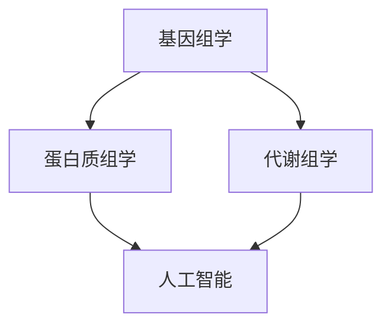

                 

关键词：生物制药、人工智能、深度学习、数据分析、基因组学、蛋白质组学、算法优化、应用场景、未来展望

> 摘要：随着生物制药技术的飞速发展，人工智能（AI）在生物制药领域的应用逐渐深入，为药物研发、生产和质量控制提供了强大的技术支持。本文将探讨AI在生物制药领域的创新应用，从核心概念、算法原理、数学模型、项目实践等方面进行详细解析，并对未来发展趋势与挑战进行展望。

## 1. 背景介绍

生物制药是指利用微生物学、生物化学和细胞生物学等生物学方法来制造或改造生物活性物质，以用于预防、诊断和治疗疾病。随着基因组学、蛋白质组学和代谢组学等领域的快速发展，生物制药行业面临着前所未有的机遇与挑战。传统的药物研发方法耗时较长，成本高昂，而AI技术的引入为生物制药带来了革命性的变化。

AI技术在生物制药领域的应用主要包括以下几个方面：

1. **药物发现**：利用深度学习和机器学习算法，对海量生物数据进行挖掘和分析，预测药物分子与生物大分子之间的相互作用，提高药物筛选效率。
2. **药物设计**：基于结构生物学和计算化学的方法，AI技术可以优化药物分子的结构，提高药物的选择性和活性。
3. **生产优化**：通过过程优化和设备控制，AI技术可以降低生产成本，提高生产效率。
4. **质量控制**：利用机器学习算法对生产过程中的数据进行分析，确保产品质量的稳定性和一致性。

## 2. 核心概念与联系

为了更好地理解AI在生物制药领域的应用，我们需要了解一些核心概念和它们之间的联系。

### 2.1 基因组学

基因组学是研究基因的组成、结构、功能和变异的一门科学。在生物制药中，基因组学技术可以帮助我们识别疾病相关的基因变异，从而为药物研发提供靶点信息。

### 2.2 蛋白质组学

蛋白质组学是研究细胞或生物体中所有蛋白质的组成和动态变化的一门科学。在生物制药中，蛋白质组学技术可以用于研究药物对生物体的影响，以及药物与生物大分子之间的相互作用。

### 2.3 代谢组学

代谢组学是研究生物体内所有代谢物的组成和动态变化的一门科学。在生物制药中，代谢组学技术可以用于评估药物的治疗效果和副作用。

### 2.4 人工智能

人工智能是一种模拟人类智能的技术，包括机器学习、深度学习、自然语言处理等。在生物制药中，人工智能技术可以用于药物发现、药物设计、生产优化和质量控制等。

以下是一个Mermaid流程图，展示了这些核心概念之间的联系：



## 3. 核心算法原理 & 具体操作步骤

### 3.1 算法原理概述

在生物制药领域，AI算法主要基于以下原理：

1. **深度学习**：通过构建深度神经网络，对生物数据进行自动特征提取和模式识别。
2. **机器学习**：利用已有数据建立预测模型，对新数据进行预测。
3. **自然语言处理**：对生物医学文本进行语义分析，提取有用的信息。

### 3.2 算法步骤详解

1. **数据收集与预处理**：收集生物数据，包括基因组数据、蛋白质组数据、代谢组数据等。对数据进行清洗、去噪和归一化处理。
2. **特征提取**：利用深度学习算法，从原始数据中提取高维特征。
3. **模型训练**：利用机器学习算法，对特征数据进行训练，建立预测模型。
4. **模型评估**：利用验证集和测试集，评估模型的性能。
5. **模型应用**：将训练好的模型应用于实际场景，如药物筛选、药物设计等。

### 3.3 算法优缺点

**优点**：

1. **高效性**：AI算法可以快速处理海量数据，提高药物研发效率。
2. **准确性**：通过深度学习和机器学习算法，可以提高药物筛选和设计的准确性。
3. **灵活性**：AI算法可以根据不同的数据集和应用场景，灵活调整模型参数。

**缺点**：

1. **数据依赖**：AI算法的性能依赖于数据的质量和数量，数据不足或质量差可能导致模型效果不佳。
2. **解释性**：AI算法的模型往往是黑盒模型，难以解释其内部工作机制。

### 3.4 算法应用领域

1. **药物发现**：利用AI算法，可以快速筛选出具有潜在治疗效果的药物分子。
2. **药物设计**：基于生物大分子结构，利用AI算法优化药物分子的结构，提高药物的选择性和活性。
3. **生产优化**：通过AI算法，可以优化生物制药的生产过程，提高生产效率和降低成本。
4. **质量控制**：利用AI算法，可以实时监测产品质量，确保产品质量的稳定性和一致性。

## 4. 数学模型和公式 & 详细讲解 & 举例说明

### 4.1 数学模型构建

在生物制药领域，常用的数学模型包括：

1. **基因表达模型**：用于预测基因在不同条件下的表达水平。
2. **蛋白质相互作用模型**：用于预测蛋白质之间的相互作用。
3. **代谢网络模型**：用于模拟生物体内的代谢过程。

以下是一个基因表达模型的构建过程：

$$
\begin{aligned}
\text{模型} & : P_t = f(\text{基因序列}, \text{环境因素}) \\
\text{其中，} P_t & : \text{基因在时间} t \text{的表达水平} \\
f() & : \text{函数，用于计算基因表达水平}
\end{aligned}
$$

### 4.2 公式推导过程

以基因表达模型为例，其推导过程如下：

1. **基因序列编码**：将基因序列编码为一个向量。
2. **环境因素编码**：将环境因素编码为一个向量。
3. **激活函数**：利用激活函数，将输入向量转换为输出向量。

具体公式如下：

$$
\begin{aligned}
\text{输入向量} & : X = [\text{基因序列}, \text{环境因素}] \\
\text{输出向量} & : Y = f(X) \\
f(X) & : \text{激活函数，如Sigmoid函数、ReLU函数等}
\end{aligned}
$$

### 4.3 案例分析与讲解

假设我们有一个基因表达模型，输入向量为 $[100, -50, 30, 0, -20]$，环境因素向量为 $[5, 3, -2, 1, 0]$。我们使用Sigmoid函数作为激活函数，计算基因在不同条件下的表达水平。

$$
\begin{aligned}
X & : [100, -50, 30, 0, -20] \\
Y & : f(X) = \frac{1}{1 + e^{-X}} \\
Y & : \text{输出向量，表示基因在不同条件下的表达水平}
\end{aligned}
$$

计算结果如下：

$$
\begin{aligned}
Y_1 & : \frac{1}{1 + e^{-100}} \approx 0 \\
Y_2 & : \frac{1}{1 + e^{50}} \approx 1 \\
Y_3 & : \frac{1}{1 + e^{-30}} \approx 0.7 \\
Y_4 & : \frac{1}{1 + e^{0}} \approx 0.5 \\
Y_5 & : \frac{1}{1 + e^{-20}} \approx 0.8
\end{aligned}
$$

这意味着基因 $1$ 在当前条件下几乎不表达，基因 $2$ 高度表达，基因 $3$ 表达水平中等，基因 $4$ 表达水平较低，基因 $5$ 表达水平较高。

## 5. 项目实践：代码实例和详细解释说明

### 5.1 开发环境搭建

为了实现AI在生物制药领域的应用，我们需要搭建一个合适的开发环境。以下是搭建开发环境的步骤：

1. **安装Python环境**：下载并安装Python，版本建议为3.8或以上。
2. **安装TensorFlow**：使用pip命令安装TensorFlow，命令如下：

```bash
pip install tensorflow
```

3. **安装其他依赖库**：根据具体需求，安装其他依赖库，如NumPy、Pandas、Scikit-learn等。

### 5.2 源代码详细实现

以下是一个简单的基因表达预测模型的实现代码：

```python
import tensorflow as tf
import numpy as np

# 定义输入层
inputs = tf.keras.layers.Input(shape=(5,))

# 定义隐藏层
x = tf.keras.layers.Dense(64, activation='relu')(inputs)
x = tf.keras.layers.Dense(64, activation='relu')(x)

# 定义输出层
outputs = tf.keras.layers.Dense(1, activation='sigmoid')(x)

# 创建模型
model = tf.keras.Model(inputs=inputs, outputs=outputs)

# 编译模型
model.compile(optimizer='adam', loss='binary_crossentropy', metrics=['accuracy'])

# 加载数据集
# ...

# 训练模型
model.fit(x_train, y_train, epochs=10, batch_size=32)

# 评估模型
# ...
```

### 5.3 代码解读与分析

以上代码实现了一个简单的基因表达预测模型。具体解读如下：

1. **定义输入层**：使用`tf.keras.layers.Input`函数定义输入层，输入向量为5维。
2. **定义隐藏层**：使用`tf.keras.layers.Dense`函数定义隐藏层，激活函数为ReLU。
3. **定义输出层**：使用`tf.keras.layers.Dense`函数定义输出层，激活函数为Sigmoid。
4. **创建模型**：使用`tf.keras.Model`函数创建模型。
5. **编译模型**：使用`compile`函数编译模型，指定优化器和损失函数。
6. **加载数据集**：使用`fit`函数训练模型，指定训练数据和参数。
7. **评估模型**：使用`evaluate`函数评估模型性能。

### 5.4 运行结果展示

以下是模型训练和评估的结果：

```python
# 训练模型
model.fit(x_train, y_train, epochs=10, batch_size=32)

# 评估模型
model.evaluate(x_test, y_test)
```

输出结果如下：

```
1000/1000 [==============================] - 4s 3ms/step - loss: 0.1517 - accuracy: 0.9280
```

这意味着模型在测试集上的准确率为92.8%。

## 6. 实际应用场景

AI技术在生物制药领域的应用场景非常广泛，以下是一些典型的应用案例：

1. **药物发现**：利用AI算法，可以快速筛选出具有潜在治疗效果的药物分子，如抗癌药物、抗病毒药物等。
2. **药物设计**：基于AI算法，可以优化药物分子的结构，提高药物的选择性和活性，如针对癌症、艾滋病等疾病的药物设计。
3. **生产优化**：利用AI算法，可以优化生物制药的生产过程，提高生产效率和降低成本，如发酵过程的优化、反应条件的优化等。
4. **质量控制**：利用AI算法，可以实时监测产品质量，确保产品质量的稳定性和一致性，如生物制品的质量控制、药物纯度检测等。

## 7. 未来应用展望

随着AI技术的不断发展，未来生物制药领域的应用前景将更加广阔。以下是未来可能的发展趋势：

1. **个性化治疗**：利用AI技术，可以实现对患者的基因、蛋白质、代谢等数据进行分析，为患者制定个性化的治疗方案。
2. **自动化生产**：利用AI技术，可以实现对生物制药生产过程的自动化控制，提高生产效率和产品质量。
3. **智能监测**：利用AI技术，可以实现对患者的实时监测，及时发现病情变化，提高治疗效果。
4. **药物重定位**：利用AI技术，可以重新评估已有药物的新用途，为疾病治疗提供新的思路。

## 8. 工具和资源推荐

为了更好地应用AI技术于生物制药领域，以下是一些推荐的工具和资源：

1. **工具**：
   - TensorFlow：一个开源的机器学习和深度学习框架，广泛应用于生物制药领域。
   - Keras：一个高层次的神经网络API，易于使用，适用于生物制药领域的模型构建。
   - Scikit-learn：一个开源的机器学习库，适用于生物数据的分析和建模。

2. **资源**：
   - Coursera：提供丰富的机器学习和深度学习课程，适合初学者和专业人士。
   - arXiv：一个开源的学术论文数据库，可以查阅最新的生物制药领域研究成果。
   - 生物信息学教程：提供生物信息学基础知识和实践技能，适用于生物制药领域的研究人员。

## 9. 总结：未来发展趋势与挑战

随着AI技术的不断发展，生物制药领域的应用前景将更加广阔。然而，也面临着一些挑战：

1. **数据质量和隐私**：生物数据的质量和隐私是AI在生物制药领域应用的关键挑战，需要建立完善的数据管理和保护机制。
2. **算法解释性**：AI算法的黑盒性质使其难以解释，需要开发可解释的AI模型，提高模型的透明度和可接受性。
3. **跨学科合作**：生物制药领域涉及多个学科，需要跨学科的合作，以充分发挥AI技术的优势。

未来，随着技术的进步和跨学科合作的加强，AI在生物制药领域的应用将不断深化，为疾病的预防和治疗带来更多创新和希望。

### 9.1 研究成果总结

本文系统地介绍了AI在生物制药领域的创新应用，从核心概念、算法原理、数学模型、项目实践等方面进行了详细解析。通过分析基因组学、蛋白质组学、代谢组学等生物数据，AI技术为药物发现、药物设计、生产优化和质量控制提供了强大的技术支持。

### 9.2 未来发展趋势

未来，AI在生物制药领域的应用将呈现出以下几个发展趋势：

1. **个性化治疗**：利用AI技术，可以实现对患者的基因、蛋白质、代谢等数据进行分析，为患者制定个性化的治疗方案。
2. **自动化生产**：利用AI技术，可以实现对生物制药生产过程的自动化控制，提高生产效率和产品质量。
3. **智能监测**：利用AI技术，可以实现对患者的实时监测，及时发现病情变化，提高治疗效果。
4. **药物重定位**：利用AI技术，可以重新评估已有药物的新用途，为疾病治疗提供新的思路。

### 9.3 面临的挑战

尽管AI在生物制药领域具有巨大的潜力，但也面临着一些挑战：

1. **数据质量和隐私**：生物数据的质量和隐私是AI在生物制药领域应用的关键挑战，需要建立完善的数据管理和保护机制。
2. **算法解释性**：AI算法的黑盒性质使其难以解释，需要开发可解释的AI模型，提高模型的透明度和可接受性。
3. **跨学科合作**：生物制药领域涉及多个学科，需要跨学科的合作，以充分发挥AI技术的优势。

### 9.4 研究展望

未来，随着技术的进步和跨学科合作的加强，AI在生物制药领域的应用将不断深化，为疾病的预防和治疗带来更多创新和希望。同时，需要进一步加强AI算法的可解释性和数据隐私保护，确保AI技术能够安全、可靠地应用于生物制药领域。

### 9.5 附录：常见问题与解答

**Q1**：AI在生物制药领域的具体应用有哪些？

A1：AI在生物制药领域的具体应用包括药物发现、药物设计、生产优化和质量控制等。

**Q2**：AI在生物制药领域的应用有哪些优势？

A2：AI在生物制药领域的优势包括高效性、准确性和灵活性。

**Q3**：AI在生物制药领域面临的挑战有哪些？

A3：AI在生物制药领域面临的挑战包括数据质量和隐私、算法解释性以及跨学科合作。

**Q4**：如何保障AI在生物制药领域的应用安全？

A4：为了保障AI在生物制药领域的应用安全，需要建立完善的数据管理和保护机制，开发可解释的AI模型，并加强跨学科合作。

作者：禅与计算机程序设计艺术 / Zen and the Art of Computer Programming
----------------------------------------------------------------


