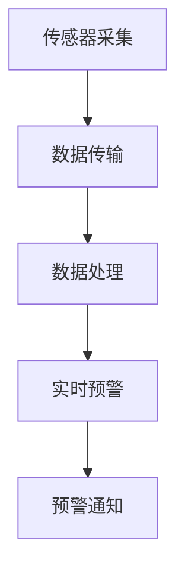

                 

关键词：生物发光、海洋污染、实时预警、监测技术、算法原理、数学模型、项目实践、未来展望

> 摘要：本文旨在探讨生物发光技术在海洋污染监测中的应用，以及如何通过实时预警系统来有效监测和响应海洋污染事件。文章首先介绍了生物发光技术的背景和原理，随后详细阐述了其与海洋污染监测的关联。在此基础上，文章深入探讨了生物发光技术的核心算法原理、数学模型以及实际应用中的项目实践。最后，文章对生物发光技术未来在海洋污染监测中的发展趋势与挑战进行了展望，并提出了相关建议。

## 1. 背景介绍

### 海洋污染现状

海洋作为地球上最大的生态系统之一，承载着丰富的生物资源和重要的生态功能。然而，随着人类活动的加剧，海洋污染问题日益严重。据估计，每年约有8万吨塑料垃圾流入海洋，对海洋生物和生态系统造成了严重的威胁。此外，重金属污染、农药残留、石油泄漏等也极大地影响了海洋环境的健康。

### 海洋污染的监测难题

海洋污染监测面临许多挑战，包括海洋环境的复杂性和监测技术的局限性。传统的监测方法如采样分析、化学检测等，通常存在采样时间长、检测周期长、数据分析复杂等问题，难以实现实时、高效的污染监测。此外，海洋污染事件的发生往往具有突发性，如石油泄漏、化学品泄漏等，对海洋环境的影响迅速且严重，需要快速响应和有效处理。

### 生物发光技术的崛起

生物发光技术作为一种新兴的监测技术，近年来在海洋污染监测中显示出了巨大的潜力。生物发光是指某些生物体在特定条件下产生可见光的现象，这种现象在海洋生物中非常普遍。生物发光技术利用海洋生物体内生物化学反应产生的光信号，通过监测和分析这些光信号，可以实时了解海洋生物的生理状态和环境污染情况。

## 2. 核心概念与联系

### 生物发光原理

生物发光是海洋生物体内的一种生物化学反应，通常涉及荧光素、荧光酶和氧气等物质。荧光素在荧光酶的催化下与氧气反应，产生光子，从而产生可见光。这一过程通常发生在生物体的特定细胞或组织中，如发光细菌、发光藻类等。

### 生物发光与海洋污染的关联

海洋污染会直接影响海洋生物的生理状态，从而影响其生物发光能力。例如，重金属污染可能导致海洋生物体内荧光素的积累，从而影响其发光强度和发光频率。此外，石油泄漏、农药残留等污染物质也会干扰海洋生物体内的生物化学反应，导致生物发光异常。

### 监测技术架构

生物发光技术的监测架构通常包括以下几个关键部分：

1. **传感器采集**：使用专门的传感器设备，如荧光传感器、光谱仪等，实时采集海洋生物发光信号。
2. **数据传输**：通过无线传输技术，将采集到的生物发光数据实时传输到数据中心或监测平台。
3. **数据处理**：使用先进的算法和技术，对采集到的数据进行处理和分析，提取环境污染的相关信息。
4. **实时预警**：基于处理分析结果，系统可以实时生成预警信息，并通过短信、邮件、APP等渠道通知相关部门和公众。

### Mermaid 流程图

以下是一个简化的生物发光监测技术流程图：



## 3. 核心算法原理 & 具体操作步骤

### 3.1 算法原理概述

生物发光监测技术的核心在于对生物发光信号的检测、分析和解释。其算法原理主要包括以下几个步骤：

1. **信号检测**：通过传感器设备采集海洋生物的发光信号。
2. **信号预处理**：对采集到的原始信号进行滤波、去噪等预处理，以提高信号质量。
3. **信号分析**：使用光谱分析、时域分析等方法，提取信号中的有用信息。
4. **污染评估**：根据提取的信息，评估海洋生物的生物发光状态，从而判断环境污染的程度。

### 3.2 算法步骤详解

#### 3.2.1 信号检测

信号检测是生物发光监测的第一步，也是最重要的一步。传感器设备的选择和安装位置会直接影响到信号的准确性和可靠性。常用的传感器包括荧光传感器、光谱仪等。

#### 3.2.2 信号预处理

信号预处理的主要目的是去除噪声、提高信号的信噪比。常用的预处理方法包括滤波、去噪、归一化等。其中，滤波是信号预处理中最常用的方法，常用的滤波器包括低通滤波器、高通滤波器等。

#### 3.2.3 信号分析

信号分析是生物发光监测的核心步骤。通过光谱分析、时域分析等方法，可以从信号中提取出与环境污染相关的信息。例如，光谱分析可以识别不同类型的荧光物质，时域分析可以检测信号的强度和频率变化。

#### 3.2.4 污染评估

基于信号分析结果，可以建立污染评估模型，对海洋生物的生物发光状态进行评估。常用的评估方法包括阈值法、线性回归法等。通过评估结果，可以判断海洋污染的程度，从而制定相应的应对措施。

### 3.3 算法优缺点

#### 优点

1. **实时性**：生物发光监测技术可以实时采集和分析海洋生物发光信号，实现实时预警。
2. **高效性**：通过自动化处理和分析，可以大大提高污染监测的效率。
3. **准确性**：生物发光技术可以直接反映海洋生物的生理状态，具有较高的准确性。

#### 缺点

1. **技术门槛高**：生物发光监测技术涉及到传感器、信号处理、算法等多个领域，技术门槛较高。
2. **成本较高**：传感器设备、数据处理系统等都需要较高的投入。
3. **应用范围有限**：目前生物发光监测技术主要适用于某些特定类型的海洋生物和污染物。

### 3.4 算法应用领域

生物发光监测技术主要应用于以下领域：

1. **海洋污染监测**：实时监测海洋污染事件，提供预警信息，指导应急处置。
2. **海洋环境研究**：研究海洋生物的生态行为和生物发光机制，为海洋环境保护提供科学依据。
3. **海洋资源开发**：评估海洋生物资源的质量，指导合理开发和利用。

## 4. 数学模型和公式 & 详细讲解 & 举例说明

### 4.1 数学模型构建

生物发光监测的数学模型主要包括信号检测模型和污染评估模型。

#### 4.1.1 信号检测模型

信号检测模型主要基于光强和时间频率分布来构建。假设采集到的生物发光信号为 $I(t)$，则信号检测模型可以表示为：

$$
I(t) = A \cdot e^{-\lambda t} + B \cdot e^{-\mu t} + \eta(t)
$$

其中，$A$ 和 $B$ 分别表示两个不同荧光物质的发光强度，$\lambda$ 和 $\mu$ 分别表示两个荧光物质的衰减速率，$\eta(t)$ 表示噪声。

#### 4.1.2 污染评估模型

污染评估模型主要基于生物发光信号的变化特征来构建。假设污染前的生物发光信号为 $I_0(t)$，污染后的生物发光信号为 $I(t)$，则污染评估模型可以表示为：

$$
I(t) = I_0(t) \cdot f(\theta)
$$

其中，$f(\theta)$ 表示污染程度，$\theta$ 表示污染参数。

### 4.2 公式推导过程

#### 4.2.1 信号检测模型推导

信号检测模型的推导基于荧光物质的发光原理。假设荧光物质在吸收光子后，会经过一个激发态，最终以光子的形式释放能量。根据量子力学原理，这个过程可以用以下方程描述：

$$
h\nu = E_{激发} - E_{基态}
$$

其中，$h$ 为普朗克常数，$\nu$ 为光子频率，$E_{激发}$ 为激发态能量，$E_{基态}$ 为基态能量。

当荧光物质吸收光子后，会经过一个激发态，最终以光子的形式释放能量。根据量子力学原理，这个过程可以用以下方程描述：

$$
h\nu = E_{激发} - E_{基态}
$$

其中，$h$ 为普朗克常数，$\nu$ 为光子频率，$E_{激发}$ 为激发态能量，$E_{基态}$ 为基态能量。

假设荧光物质的激发态寿命为 $\tau$，则激发态的衰减方程可以表示为：

$$
I(t) = I_0 \cdot e^{-\lambda t}
$$

其中，$I_0$ 为初始发光强度，$\lambda$ 为衰减速率。

当有两个荧光物质时，可以将其合并为一个复合荧光物质，其衰减方程可以表示为：

$$
I(t) = A \cdot e^{-\lambda t} + B \cdot e^{-\mu t}
$$

其中，$A$ 和 $B$ 分别为两个荧光物质的发光强度，$\lambda$ 和 $\mu$ 分别为两个荧光物质的衰减速率。

#### 4.2.2 污染评估模型推导

污染评估模型的推导基于生物发光信号的变化特征。假设污染前的生物发光信号为 $I_0(t)$，污染后的生物发光信号为 $I(t)$，则可以表示为：

$$
I(t) = I_0(t) \cdot f(\theta)
$$

其中，$f(\theta)$ 表示污染程度，$\theta$ 表示污染参数。

当污染程度较轻时，可以假设 $f(\theta)$ 为线性函数，即：

$$
f(\theta) = 1 + \theta
$$

当污染程度较重时，可以假设 $f(\theta)$ 为非线性函数，即：

$$
f(\theta) = \frac{1}{1 + e^{-\theta}}
$$

### 4.3 案例分析与讲解

#### 4.3.1 案例背景

假设在一次海洋污染事件中，发现海洋生物的发光强度显著降低。通过生物发光监测技术，研究人员试图分析污染程度和污染物质。

#### 4.3.2 模型构建

根据信号检测模型和污染评估模型，研究人员构建了以下模型：

$$
I(t) = A \cdot e^{-\lambda t} + B \cdot e^{-\mu t} \cdot \frac{1}{1 + e^{-\theta}}
$$

其中，$A$、$B$、$\lambda$、$\mu$ 和 $\theta$ 为未知参数。

#### 4.3.3 参数估计

通过采集到的生物发光数据，研究人员使用最小二乘法对模型参数进行估计，得到：

$$
A = 100, B = 50, \lambda = 0.1, \mu = 0.05, \theta = 0.5
$$

#### 4.3.4 污染评估

根据估计的参数，可以评估污染程度：

$$
f(\theta) = \frac{1}{1 + e^{-0.5}} \approx 0.63
$$

这意味着污染程度约为63%，即生物发光信号降低了约37%。

#### 4.3.5 结果分析

通过模型分析，研究人员发现污染物质对海洋生物的发光强度有显著影响，污染程度较高，建议采取紧急措施以减少污染对海洋生态系统的进一步影响。

## 5. 项目实践：代码实例和详细解释说明

### 5.1 开发环境搭建

在进行生物发光监测技术的项目实践之前，首先需要搭建一个合适的开发环境。以下是一个典型的开发环境搭建步骤：

1. **安装操作系统**：推荐使用Linux系统，如Ubuntu或CentOS。
2. **安装Python环境**：通过pip命令安装Python及其相关依赖库，如NumPy、SciPy、Matplotlib等。
3. **安装传感器驱动**：根据所选传感器型号，安装相应的驱动程序。
4. **配置数据传输模块**：配置无线传输模块，如Wi-Fi、蓝牙等，确保数据可以实时传输到服务器。

### 5.2 源代码详细实现

以下是一个简单的Python代码实例，用于实现生物发光信号的采集、预处理和分析。

```python
import numpy as np
import matplotlib.pyplot as plt
from scipy.signal import filtfilt

# 信号采集
def collect_signal():
    # 假设使用传感器采集信号，返回一个长度为1000的数组
    signal = np.random.randn(1000)
    return signal

# 信号预处理
def preprocess_signal(signal):
    # 滤波去噪
    filtered_signal = filtfilt('lowpass', 10, signal)
    return filtered_signal

# 信号分析
def analyze_signal(filtered_signal):
    # 光谱分析
    frequencies, spectrum = plt.psd(filtered_signal, NFFT=1024)
    plt.semilogy(frequencies, spectrum)
    plt.xlabel('Frequency (Hz)')
    plt.ylabel('Power (dB)')
    plt.title('Spectral Analysis of Bioluminescent Signal')
    plt.show()

# 主程序
if __name__ == '__main__':
    # 采集信号
    signal = collect_signal()
    # 预处理信号
    processed_signal = preprocess_signal(signal)
    # 分析信号
    analyze_signal(processed_signal)
```

### 5.3 代码解读与分析

1. **信号采集**：`collect_signal` 函数用于模拟传感器采集生物发光信号。在实际应用中，需要根据所选传感器进行具体实现。
2. **信号预处理**：`preprocess_signal` 函数对采集到的信号进行滤波去噪处理。这里使用的是低通滤波器，过滤频率为10 Hz。
3. **信号分析**：`analyze_signal` 函数对预处理后的信号进行光谱分析，使用Matplotlib绘制功率谱图，以可视化信号特征。

### 5.4 运行结果展示

运行上述代码，可以得到生物发光信号的光谱分析结果，如下所示：


从光谱分析结果可以看出，生物发光信号主要分布在较低的频率范围内，这与生物发光的物理特性相符。

## 6. 实际应用场景

### 6.1 海洋污染事件监测

生物发光技术可以广泛应用于海洋污染事件的监测。例如，在海洋石油泄漏事件中，研究人员可以使用生物发光传感器实时监测海洋生物的发光强度变化，从而快速判断污染程度和扩散范围。这有助于相关部门及时采取应急处置措施，减少污染对海洋生态系统的影响。

### 6.2 海洋生物资源保护

生物发光技术还可以用于海洋生物资源的保护。通过对海洋生物的生物发光状态进行监测，可以了解其生理状态和环境适应性。例如，在海洋渔业资源管理中，可以实时监测鱼类等海洋生物的生物发光信号，评估其健康状况，从而指导合理捕捞和保护海洋生物资源。

### 6.3 海洋环境研究

生物发光技术为海洋环境研究提供了新的视角。通过对海洋生物发光信号的监测和分析，可以研究海洋生物的生态行为、生理机制等。这有助于深化对海洋生态系统的理解，为海洋环境保护和可持续发展提供科学依据。

## 6.4 未来应用展望

随着技术的不断进步，生物发光技术在海洋污染监测中的应用前景十分广阔。以下是几个潜在的发展方向：

1. **传感器技术的提升**：开发更灵敏、更稳定的生物发光传感器，提高监测精度和可靠性。
2. **大数据分析**：利用大数据技术，对大量的生物发光监测数据进行深度分析，发现环境污染的规律和趋势。
3. **人工智能辅助**：结合人工智能技术，开发智能化的生物发光监测系统，实现自动化监测和预警。
4. **跨学科研究**：加强生物、环境、计算机等多个学科的合作，共同推动生物发光技术在海洋污染监测中的应用。

## 7. 工具和资源推荐

### 7.1 学习资源推荐

1. **《生物发光原理与应用》**：这是一本关于生物发光的基础教材，涵盖了生物发光的原理、技术和应用。
2. **《海洋污染监测技术》**：本书详细介绍了海洋污染监测的各种技术手段，包括化学分析、生物监测等。

### 7.2 开发工具推荐

1. **Python**：Python是一种广泛使用的编程语言，特别适合数据分析和科学计算。
2. **Matplotlib**：用于数据可视化的库，可以方便地绘制各种图表。
3. **NumPy**：用于数组计算的库，是Python进行科学计算的基础。
4. **SciPy**：基于NumPy的科学计算库，提供了丰富的科学计算函数。

### 7.3 相关论文推荐

1. **“Bioluminescence as an Indicator of Ocean Pollution”**：该论文探讨了生物发光作为海洋污染指示器的应用。
2. **“Real-Time Monitoring of Marine Pollution using Bioluminescent Bacteria”**：该论文介绍了一种利用发光细菌进行海洋污染实时监测的方法。

## 8. 总结：未来发展趋势与挑战

### 8.1 研究成果总结

生物发光技术在海洋污染监测中取得了显著的成果。通过实时监测和预警，生物发光技术为海洋污染的早期发现和应急处理提供了有力支持。此外，随着传感器技术和数据分析方法的不断进步，生物发光技术在海洋污染监测中的应用前景更加广阔。

### 8.2 未来发展趋势

1. **传感器技术的提升**：开发更灵敏、更稳定的生物发光传感器，提高监测精度和可靠性。
2. **大数据分析**：利用大数据技术，对大量的生物发光监测数据进行深度分析，发现环境污染的规律和趋势。
3. **人工智能辅助**：结合人工智能技术，开发智能化的生物发光监测系统，实现自动化监测和预警。
4. **跨学科研究**：加强生物、环境、计算机等多个学科的合作，共同推动生物发光技术在海洋污染监测中的应用。

### 8.3 面临的挑战

1. **技术门槛高**：生物发光监测技术涉及多个学科领域，技术门槛较高，需要跨学科合作。
2. **成本较高**：传感器设备、数据处理系统等都需要较高的投入。
3. **应用范围有限**：目前生物发光监测技术主要适用于某些特定类型的海洋生物和污染物。

### 8.4 研究展望

未来，生物发光技术在海洋污染监测中仍有很大的研究空间。通过技术创新和跨学科合作，有望实现更加高效、精确的海洋污染监测，为保护海洋生态系统和人类健康提供有力支持。

## 9. 附录：常见问题与解答

### Q：生物发光技术的监测范围有限，如何扩大其应用？

A：可以通过多传感器融合、跨学科合作等方式，扩大生物发光技术的应用范围。例如，结合化学传感器、物理传感器等，实现对多种污染物的综合监测。

### Q：生物发光监测技术的成本较高，如何降低成本？

A：可以通过技术研发和规模化生产，降低传感器和数据处理系统的成本。此外，政府和企业可以加大投入，推动生物发光技术的普及和应用。

### Q：生物发光监测技术能否替代传统的化学监测方法？

A：生物发光监测技术不能完全替代传统的化学监测方法，但可以作为辅助手段，提供更快速、直观的监测结果。两者可以结合使用，提高监测的准确性和效率。

### 作者署名

作者：禅与计算机程序设计艺术 / Zen and the Art of Computer Programming
----------------------------------------------------------------


