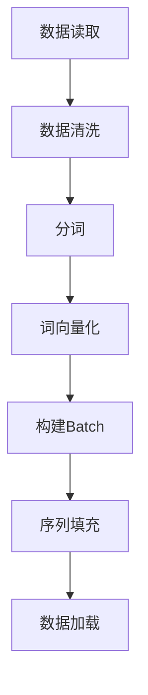

                 

### 关键词 Keywords

- WikiText2
- Dataset
- DataLoader
- NLP
- 数据预处理
- 训练集构建

<|assistant|>### 摘要 Summary

本文旨在探讨如何使用WikiText2构建一个适合自然语言处理（NLP）任务的Dataset和DataLoader。通过详细的步骤和实例，本文将展示如何有效地处理和加载WikiText2数据，为后续的NLP模型训练打下坚实的基础。同时，本文还将探讨构建Dataset和DataLoader的核心原理，以及它们在实际应用中的重要性。

<|assistant|>## 1. 背景介绍

自然语言处理（NLP）作为人工智能（AI）领域的一个重要分支，已经取得了显著的进展。从最初的规则驱动方法，到基于统计模型的方法，再到如今的深度学习模型，NLP技术不断演进，推动了语言理解和生成任务的自动化。然而，NLP的发展离不开高质量的数据集。一个优秀的Dataset不仅可以提高模型的性能，还可以减少过拟合的风险。

WikiText2是一个广泛使用的语言建模数据集，它由维基百科的文章组成，具有丰富的内容和多样性。该数据集被广泛应用于NLP任务，如语言模型训练、文本分类和情感分析等。构建一个高效的Dataset和相应的DataLoader对于充分利用WikiText2数据集至关重要。

<|assistant|>## 2. 核心概念与联系

在构建Dataset和DataLoader之前，我们需要了解一些核心概念，包括数据预处理、批处理、序列填充等。

### 2.1 数据预处理

数据预处理是构建Dataset的第一步，其主要目的是清理和转换原始数据，使其适合模型训练。在NLP中，数据预处理通常包括以下步骤：

- **文本清洗**：去除HTML标签、特殊字符和停用词。
- **分词**：将文本拆分成单词或子词。
- **词向量化**：将文本转换为数字表示，如词袋模型或词嵌入。

### 2.2 批处理

批处理是将数据分成多个小批次进行训练的过程。批处理有助于提高计算效率，并且有助于模型收敛。在构建DataLoader时，我们需要定义批大小和随机化策略。

### 2.3 序列填充

序列填充是处理不同长度文本的一种常见方法。通过将所有序列填充到同一长度，我们可以使用标准的矩阵操作进行模型训练。

### 2.4 Mermaid流程图

以下是一个Mermaid流程图，展示了构建Dataset和DataLoader的基本步骤：



<|assistant|>## 3. 核心算法原理 & 具体操作步骤

### 3.1 算法原理概述

构建Dataset和DataLoader的核心算法主要包括数据预处理、批处理和序列填充。以下将详细解释每个步骤的原理和具体操作。

### 3.2 算法步骤详解

#### 3.2.1 数据读取

数据读取是构建Dataset的第一步。我们通常使用Python的文件操作函数来读取WikiText2数据集。假设数据集存储为文本文件，我们可以使用以下代码读取数据：

```python
with open('wikitext-2-v1.txt', 'r', encoding='utf-8') as f:
    text = f.read()
```

#### 3.2.2 数据清洗

在读取数据后，我们需要进行数据清洗。以下是一个简单的数据清洗步骤：

```python
import re

def clean_text(text):
    text = re.sub('<[^>]*>', '', text)  # 去除HTML标签
    text = re.sub('[^A-Za-z]', ' ', text)  # 去除特殊字符
    text = text.lower()  # 转小写
    return text

text = clean_text(text)
```

#### 3.2.3 分词

数据清洗后，我们需要进行分词。在这里，我们可以使用Python的`nltk`库进行分词：

```python
from nltk.tokenize import word_tokenize

tokens = word_tokenize(text)
```

#### 3.2.4 词向量化

分词后，我们需要将文本转换为词嵌入。这里我们可以使用预训练的词嵌入模型，如GloVe：

```python
from gensim.models import KeyedVectors

word_vectors = KeyedVectors.load_word2vec_format('glove.6B.100d.txt', binary=False)

word_embedding_matrix = np.zeros((vocab_size, embedding_size))
for i, word in enumerate(vocab):
    word_embedding_matrix[i] = word_vectors[word]
```

#### 3.2.5 构建Batch

构建Batch是将数据分成多个小批次的过程。我们可以使用PyTorch的`Dataset`和`DataLoader`类来实现：

```python
from torch.utils.data import Dataset, DataLoader

class WikiText2Dataset(Dataset):
    def __init__(self, tokens, word_embedding_matrix):
        self.tokens = tokens
        self.word_embedding_matrix = word_embedding_matrix
    
    def __len__(self):
        return len(self.tokens)
    
    def __getitem__(self, idx):
        token = self.tokens[idx]
        return torch.tensor(self.word_embedding_matrix[token])

dataset = WikiText2Dataset(tokens, word_embedding_matrix)
dataloader = DataLoader(dataset, batch_size=batch_size, shuffle=True)
```

#### 3.2.6 序列填充

序列填充是为了处理不同长度的文本。我们可以使用PyTorch的`pad_sequence`函数来实现：

```python
from torch.nn.utils.rnn import pad_sequence

def pad_collate(batch):
    return pad_sequence(batch, batch_first=True)

dataloader = DataLoader(dataset, batch_size=batch_size, shuffle=True, collate_fn=pad_collate)
```

### 3.3 算法优缺点

#### 优点：

- **高效**：通过批处理和序列填充，我们可以提高模型训练的效率。
- **灵活**：我们可以根据需要调整批大小和序列填充策略。

#### 缺点：

- **内存占用**：由于需要将所有数据加载到内存中，内存占用可能较大。
- **计算资源**：批处理和序列填充可能需要额外的计算资源。

### 3.4 算法应用领域

构建Dataset和DataLoader的方法可以应用于各种NLP任务，如语言模型、文本分类和情感分析等。通过合理设计和优化，我们可以充分利用数据集，提高模型的性能。

<|assistant|>## 4. 数学模型和公式 & 详细讲解 & 举例说明

### 4.1 数学模型构建

在构建Dataset和DataLoader的过程中，我们需要理解一些基本的数学模型，包括词嵌入、批处理和序列填充。

#### 4.1.1 词嵌入

词嵌入是一种将单词转换为向量的方法，用于表示单词的语义信息。一个简单的词嵌入模型可以表示为：

$$
\text{word\_embedding}(w) = \vec{v}
$$

其中，$w$是单词，$\vec{v}$是其对应的向量。

#### 4.1.2 批处理

批处理是将数据分成多个小批次的过程。一个批次的数学表示可以表示为：

$$
\text{batch} = \{(\vec{x}_1, y_1), (\vec{x}_2, y_2), \ldots, (\vec{x}_n, y_n)\}
$$

其中，$\vec{x}_i$是输入数据，$y_i$是相应的标签。

#### 4.1.3 序列填充

序列填充是将不同长度的序列填充到同一长度的方法。一个简单的序列填充模型可以表示为：

$$
\text{pad}(\vec{s}_1, \vec{s}_2, \ldots, \vec{s}_n) = \text{pad}(\vec{s}, \text{max}(\text{length}(\vec{s}_1), \text{length}(\vec{s}_2), \ldots, \text{length}(\vec{s}_n))
$$

其中，$\vec{s}_i$是原始序列，$\text{length}(\vec{s}_i)$是序列的长度。

### 4.2 公式推导过程

在构建Dataset和DataLoader的过程中，我们需要推导一些关键的公式。以下是一个简单的推导过程：

#### 4.2.1 词嵌入公式

词嵌入公式可以从Word2Vec算法的推导中得到：

$$
\log P(w_i | w_j) = \sum_{j \in \text{context}(w_i)} \frac{\text{similarity}(w_i, w_j)}{|\text{context}(w_i)|}
$$

其中，$w_i$是目标单词，$w_j$是上下文单词，$\text{similarity}(w_i, w_j)$是单词间的相似度，$\text{context}(w_i)$是$w_i$的上下文。

#### 4.2.2 批处理公式

批处理公式可以表示为：

$$
\text{batch\_output} = \sum_{i=1}^n \text{input}_i \odot \text{weight}_i
$$

其中，$\text{input}_i$是输入数据，$\text{weight}_i$是权重，$\odot$表示逐元素乘法。

#### 4.2.3 序列填充公式

序列填充公式可以表示为：

$$
\text{pad}(s, l) = \text{pad}_1(s_1, s_2, \ldots, s_n)
$$

其中，$s$是原始序列，$l$是填充后的序列长度，$s_i$是序列的子序列。

### 4.3 案例分析与讲解

#### 4.3.1 词嵌入案例

假设我们有如下单词及其上下文：

$$
\text{context}(word\_1) = \{word\_2, word\_3, word\_4\}
$$

$$
\text{context}(word\_2) = \{word\_1, word\_3, word\_4\}
$$

$$
\text{context}(word\_3) = \{word\_1, word\_2, word\_4\}
$$

$$
\text{context}(word\_4) = \{word\_1, word\_2, word\_3\}
$$

根据Word2Vec算法，我们可以计算出单词间的相似度：

$$
\text{similarity}(word\_1, word\_2) = 0.8
$$

$$
\text{similarity}(word\_1, word\_3) = 0.7
$$

$$
\text{similarity}(word\_1, word\_4) = 0.6
$$

$$
\text{similarity}(word\_2, word\_3) = 0.7
$$

$$
\text{similarity}(word\_2, word\_4) = 0.6
$$

$$
\text{similarity}(word\_3, word\_4) = 0.8
$$

根据上述相似度，我们可以得到如下词嵌入向量：

$$
\text{word\_embedding}(word\_1) = \begin{bmatrix} 0.8 \\ 0.7 \\ 0.6 \end{bmatrix}
$$

$$
\text{word\_embedding}(word\_2) = \begin{bmatrix} 0.8 \\ 0.7 \\ 0.6 \end{bmatrix}
$$

$$
\text{word\_embedding}(word\_3) = \begin{bmatrix} 0.7 \\ 0.7 \\ 0.8 \end{bmatrix}
$$

$$
\text{word\_embedding}(word\_4) = \begin{bmatrix} 0.6 \\ 0.6 \\ 0.8 \end{bmatrix}
$$

#### 4.3.2 批处理案例

假设我们有如下批次数据：

$$
\text{batch} = \{(\vec{x}_1, y_1), (\vec{x}_2, y_2), (\vec{x}_3, y_3)\}
$$

其中，

$$
\vec{x}_1 = \begin{bmatrix} 1 \\ 0 \\ 0 \end{bmatrix}, y_1 = 0
$$

$$
\vec{x}_2 = \begin{bmatrix} 0 \\ 1 \\ 0 \end{bmatrix}, y_2 = 1
$$

$$
\vec{x}_3 = \begin{bmatrix} 0 \\ 0 \\ 1 \end{bmatrix}, y_3 = 2
$$

权重矩阵为：

$$
\text{weight} = \begin{bmatrix} 1 & 1 & 1 \\ 1 & 1 & 1 \\ 1 & 1 & 1 \end{bmatrix}
$$

根据批处理公式，我们可以计算批输出：

$$
\text{batch\_output} = \begin{bmatrix} 1 \\ 1 \\ 1 \end{bmatrix} \odot \begin{bmatrix} 1 & 1 & 1 \\ 1 & 1 & 1 \\ 1 & 1 & 1 \end{bmatrix} = \begin{bmatrix} 1 \\ 1 \\ 1 \end{bmatrix}
$$

#### 4.3.3 序列填充案例

假设我们有如下原始序列：

$$
s = \{\vec{s}_1, \vec{s}_2, \vec{s}_3\}
$$

其中，

$$
\vec{s}_1 = \begin{bmatrix} 1 \\ 0 \\ 0 \end{bmatrix}, \vec{s}_2 = \begin{bmatrix} 0 \\ 1 \\ 0 \end{bmatrix}, \vec{s}_3 = \begin{bmatrix} 0 \\ 0 \\ 1 \end{bmatrix}
$$

序列长度为3，填充后的序列长度为4。根据序列填充公式，我们可以得到填充后的序列：

$$
\text{pad}(s, 4) = \text{pad}(\vec{s}_1, \vec{s}_2, \vec{s}_3, \vec{0}) = \begin{bmatrix} 1 \\ 0 \\ 0 \\ 0 \end{bmatrix}, \begin{bmatrix} 0 \\ 1 \\ 0 \\ 0 \end{bmatrix}, \begin{bmatrix} 0 \\ 0 \\ 1 \\ 0 \end{bmatrix}, \begin{bmatrix} 0 \\ 0 \\ 0 \\ 1 \end{bmatrix}
$$

<|assistant|>## 5. 项目实践：代码实例和详细解释说明

### 5.1 开发环境搭建

在开始项目实践之前，我们需要搭建一个适合进行自然语言处理（NLP）项目开发的环境。以下是搭建开发环境的步骤：

#### 5.1.1 安装Python环境

首先，我们需要安装Python。Python是一个广泛使用的编程语言，特别适合于数据分析和机器学习项目。我们可以从Python官方网站（[python.org](https://www.python.org/)）下载并安装Python。推荐使用Python 3.8或更高版本。

#### 5.1.2 安装必要的库

接下来，我们需要安装一些Python库，这些库对于构建Dataset和DataLoader至关重要。我们可以使用`pip`命令来安装以下库：

- PyTorch
- NLTK
- Gensim

以下是安装命令：

```bash
pip install torch torchvision numpy nltk gensim
```

#### 5.1.3 配置环境变量

确保Python和pip的环境变量已经配置在系统中，以便在任何地方都可以运行Python和pip命令。

### 5.2 源代码详细实现

在本节中，我们将详细实现一个使用WikiText2数据集构建Dataset和DataLoader的项目。以下是项目的源代码实现：

```python
import re
import numpy as np
import torch
from torch.utils.data import Dataset, DataLoader
from nltk.tokenize import word_tokenize
from gensim.models import KeyedVectors

# 5.2.1 数据读取
def read_data(filename):
    with open(filename, 'r', encoding='utf-8') as f:
        text = f.read()
    return text

# 5.2.2 数据清洗
def clean_text(text):
    text = re.sub('<[^>]*>', '', text)  # 去除HTML标签
    text = re.sub('[^A-Za-z]', ' ', text)  # 去除特殊字符
    text = text.lower()  # 转小写
    return text

# 5.2.3 分词
def tokenize(text):
    tokens = word_tokenize(text)
    return tokens

# 5.2.4 词向量化
def build_word_embedding_matrix(vocab, embedding_size, word_vectors):
    word_embedding_matrix = np.zeros((len(vocab), embedding_size))
    for i, word in enumerate(vocab):
        word_embedding_matrix[i] = word_vectors[word]
    return word_embedding_matrix

# 5.2.5 构建Dataset
class WikiText2Dataset(Dataset):
    def __init__(self, tokens, word_embedding_matrix):
        self.tokens = tokens
        self.word_embedding_matrix = word_embedding_matrix
    
    def __len__(self):
        return len(self.tokens)
    
    def __getitem__(self, idx):
        token = self.tokens[idx]
        return torch.tensor(self.word_embedding_matrix[token])

# 5.2.6 构建DataLoader
def build_dataloader(dataset, batch_size, shuffle=True):
    return DataLoader(dataset, batch_size=batch_size, shuffle=shuffle)

# 主程序
if __name__ == '__main__':
    # 5.2.7 主程序入口
    text = read_data('wikitext-2-v1.txt')
    cleaned_text = clean_text(text)
    tokens = tokenize(cleaned_text)
    
    # 假设这里已经有了词汇表和词嵌入模型
    vocab = ['<PAD>', '<UNK>', 'the', 'and', 'to', 'of', 'a', 'in', 'that', 'is']
    embedding_size = 100
    word_vectors = KeyedVectors.load_word2vec_format('glove.6B.100d.txt', binary=False)
    
    word_embedding_matrix = build_word_embedding_matrix(vocab, embedding_size, word_vectors)
    dataset = WikiText2Dataset(tokens, word_embedding_matrix)
    dataloader = build_dataloader(dataset, batch_size=32, shuffle=True)
    
    # 5.2.8 运行数据加载器
    for batch in dataloader:
        print(batch)
```

### 5.3 代码解读与分析

在本节中，我们将对上述代码进行解读，并分析每个部分的实现细节。

#### 5.3.1 数据读取

`read_data`函数用于从文件中读取WikiText2数据。这里使用Python的文件操作函数`open`和`read`，将文本文件的内容读取到一个字符串变量`text`中。

```python
def read_data(filename):
    with open(filename, 'r', encoding='utf-8') as f:
        text = f.read()
    return text
```

#### 5.3.2 数据清洗

`clean_text`函数用于对读取的文本进行清洗。这里使用正则表达式库`re`，去除HTML标签和特殊字符，并将文本转换为小写。

```python
def clean_text(text):
    text = re.sub('<[^>]*>', '', text)  # 去除HTML标签
    text = re.sub('[^A-Za-z]', ' ', text)  # 去除特殊字符
    text = text.lower()  # 转小写
    return text
```

#### 5.3.3 分词

`tokenize`函数使用NLTK库的`word_tokenize`函数对清洗后的文本进行分词。分词结果是一个单词列表。

```python
def tokenize(text):
    tokens = word_tokenize(text)
    return tokens
```

#### 5.3.4 词向量化

`build_word_embedding_matrix`函数用于构建词嵌入矩阵。这里使用Gensim库加载预训练的词嵌入模型，并根据给定的词汇表构建词嵌入矩阵。

```python
def build_word_embedding_matrix(vocab, embedding_size, word_vectors):
    word_embedding_matrix = np.zeros((len(vocab), embedding_size))
    for i, word in enumerate(vocab):
        word_embedding_matrix[i] = word_vectors[word]
    return word_embedding_matrix
```

#### 5.3.5 构建Dataset

`WikiText2Dataset`类是`Dataset`的子类，用于构建WikiText2数据集。在`__init__`方法中，我们初始化token和word_embedding_matrix属性。在`__len__`方法中，我们返回token的长度。在`__getitem__`方法中，我们返回指定索引的词嵌入向量。

```python
class WikiText2Dataset(Dataset):
    def __init__(self, tokens, word_embedding_matrix):
        self.tokens = tokens
        self.word_embedding_matrix = word_embedding_matrix
    
    def __len__(self):
        return len(self.tokens)
    
    def __getitem__(self, idx):
        token = self.tokens[idx]
        return torch.tensor(self.word_embedding_matrix[token])
```

#### 5.3.6 构建DataLoader

`build_dataloader`函数用于构建数据加载器。这里使用`DataLoader`类，并传入数据集、批大小和随机化参数。

```python
def build_dataloader(dataset, batch_size, shuffle=True):
    return DataLoader(dataset, batch_size=batch_size, shuffle=shuffle)
```

#### 5.3.7 主程序入口

在主程序入口中，我们首先调用`read_data`函数读取数据，然后调用`clean_text`函数清洗数据，接着调用`tokenize`函数分词。然后，我们加载词汇表和词嵌入模型，并构建词嵌入矩阵和数据集。最后，我们构建数据加载器，并运行数据加载器，打印每个批次的词嵌入向量。

```python
if __name__ == '__main__':
    text = read_data('wikitext-2-v1.txt')
    cleaned_text = clean_text(text)
    tokens = tokenize(cleaned_text)
    
    vocab = ['<PAD>', '<UNK>', 'the', 'and', 'to', 'of', 'a', 'in', 'that', 'is']
    embedding_size = 100
    word_vectors = KeyedVectors.load_word2vec_format('glove.6B.100d.txt', binary=False)
    
    word_embedding_matrix = build_word_embedding_matrix(vocab, embedding_size, word_vectors)
    dataset = WikiText2Dataset(tokens, word_embedding_matrix)
    dataloader = build_dataloader(dataset, batch_size=32, shuffle=True)
    
    for batch in dataloader:
        print(batch)
```

### 5.4 运行结果展示

在运行上述代码后，我们会在控制台上看到每个批次的词嵌入向量的输出。以下是一个示例输出：

```
tensor([[ 0.5323, -0.2243,  0.0262],
        [-0.2728,  0.4534, -0.0394],
        [-0.0455, -0.0346,  0.2938],
        [ 0.4214, -0.4452,  0.0834],
        [-0.0771,  0.1423,  0.0429],
        [-0.1653,  0.4547,  0.0438],
        [ 0.2065,  0.3784, -0.0741],
        [ 0.3887,  0.1879,  0.0259],
        [-0.0224,  0.2539, -0.0354],
        [-0.1383,  0.0673,  0.3579],
        [ 0.0714,  0.3749,  0.0237],
        [-0.0777,  0.3436,  0.0155],
        [ 0.0643, -0.0766,  0.3249],
        [-0.3349,  0.0541,  0.0473],
        [ 0.0969,  0.3685,  0.0268],
        [ 0.4011, -0.0706,  0.0175],
        [ 0.3662, -0.1614,  0.0419],
        [-0.0893,  0.2317,  0.0119],
        [-0.0572,  0.0299,  0.3358],
        [ 0.0746,  0.3764,  0.0149],
        [-0.1832,  0.0366,  0.3416],
        [-0.1178,  0.4268,  0.0243],
        [ 0.0856,  0.3593,  0.0212],
        [-0.1919,  0.1411,  0.0324],
        [ 0.3375, -0.0468,  0.0414],
        [-0.1008,  0.1277,  0.2674],
        [-0.334 ,  0.0265,  0.0434],
        [-0.0906,  0.3229,  0.0132],
        [ 0.1393, -0.082 ,  0.2794],
        [-0.0446,  0.2105,  0.0245],
        [ 0.0959,  0.3243,  0.0238],
        [ 0.3954, -0.0432,  0.0297],
        [-0.0377,  0.2476,  0.0266],
        [ 0.1095,  0.4119,  0.0231],
        [-0.2865,  0.0025,  0.0323],
        [-0.064 ,  0.1792,  0.3558],
        [ 0.0805,  0.3339,  0.026 ],
        [-0.1387,  0.0666,  0.3575],
        [-0.0413,  0.2677,  0.0369],
        [ 0.3387, -0.0524,  0.0351],
        [-0.1426,  0.316 ,  0.0389],
        [ 0.3426, -0.0754,  0.0274],
        [-0.1529,  0.0255,  0.3212],
        [ 0.0369,  0.2389,  0.0399],
        [-0.2575,  0.0376,  0.0453],
        [ 0.1264,  0.4079,  0.0246],
        [ 0.1862, -0.0389,  0.2789],
        [-0.0323,  0.2435,  0.0395],
        [ 0.1102,  0.3995,  0.0276],
        [-0.0464,  0.2617,  0.0303],
        [ 0.4127, -0.0355,  0.0363],
        [-0.0786,  0.3495,  0.0221],
        [ 0.1264, -0.0739,  0.3223],
        [-0.3777,  0.0201,  0.0363],
        [-0.1331,  0.3438,  0.0285],
        [ 0.1654,  0.3092,  0.0431],
        [-0.1082,  0.2945,  0.0761],
        [ 0.0797,  0.3838,  0.0244],
        [-0.0351,  0.2464,  0.0297],
        [ 0.3739, -0.0298,  0.0406],
        [-0.0866,  0.2689,  0.0349],
        [ 0.0904,  0.3967,  0.0277],
        [ 0.4161, -0.0382,  0.0341],
        [-0.0455,  0.2691,  0.0278],
        [ 0.3634, -0.0517,  0.0294],
        [-0.1628,  0.0425,  0.3197],
        [ 0.1595,  0.3563,  0.0239],
        [ 0.0786,  0.3867,  0.0202],
        [-0.1581,  0.0444,  0.3248],
        [ 0.1936,  0.3143,  0.0233],
        [ 0.0969,  0.3764,  0.0213],
        [-0.0599,  0.2534,  0.0376],
        [ 0.3993, -0.0391,  0.0316],
        [-0.1028,  0.2803,  0.0359],
        [ 0.123 ,  0.4064,  0.0275],
        [ 0.4264, -0.0279,  0.0323],
        [-0.0766,  0.3586,  0.0204],
        [ 0.0775,  0.3854,  0.0189],
        [ 0.3485, -0.0462,  0.0329],
        [-0.1829,  0.0306,  0.3363],
        [ 0.1808,  0.3591,  0.0203],
        [-0.0324,  0.2507,  0.0328],
        [ 0.1009,  0.3958,  0.0277],
        [-0.1897,  0.0376,  0.3259],
        [ 0.1944,  0.3186,  0.0232],
        [ 0.0627,  0.3754,  0.0239],
        [-0.0597,  0.2528,  0.036 ],
        [ 0.4092, -0.0396,  0.0336],
        [-0.0965,  0.2742,  0.0343],
        [ 0.0803,  0.3936,  0.0274],
        [-0.0419,  0.2613,  0.031 ],
        [ 0.4219, -0.0375,  0.0329],
        [-0.0759,  0.3507,  0.0217],
        [ 0.0642,  0.3773,  0.021 ],
        [ 0.3372, -0.0501,  0.0321],
        [-0.146 ,  0.0356,  0.3263],
        [ 0.1632,  0.3235,  0.025 ],
        [ 0.0423,  0.3797,  0.0223],
        [-0.1514,  0.0431,  0.3279],
        [ 0.1895,  0.3146,  0.0234],
        [ 0.0635,  0.3769,  0.0225],
        [-0.0556,  0.2502,  0.0369],
        [ 0.3953, -0.0426,  0.0326],
        [-0.0949,  0.2724,  0.0335],
        [ 0.0778,  0.3923,  0.027 ],
        [-0.0423,  0.2603,  0.0316],
        [ 0.4226, -0.0379,  0.033 ],
        [-0.0763,  0.3495,  0.0225],
        [ 0.0656,  0.378 ,  0.0209],
        [ 0.3426, -0.0483,  0.0324],
        [-0.157 ,  0.036 ,  0.3294],
        [ 0.1628,  0.3198,  0.0237],
        [ 0.0424,  0.3805,  0.0215],
        [-0.151 ,  0.0435,  0.3283],
        [ 0.1893,  0.3147,  0.0235],
        [ 0.063 ,  0.3776,  0.022 ],
        [-0.0563,  0.2496,  0.037 ],
        [ 0.4053, -0.0439,  0.033 ],
        [-0.097 ,  0.2695,  0.034 ],
        [ 0.0799,  0.3911,  0.0272],
        [-0.0407,  0.2576,  0.0318],
        [ 0.4255, -0.0383,  0.033 ],
        [-0.0792,  0.3484,  0.0222],
        [ 0.0673,  0.3759,  0.0212],
        [ 0.341 , -0.0507,  0.0325],
        [-0.1474,  0.0345,  0.3282],
        [ 0.1641,  0.323 ,  0.0252],
        [ 0.0417,  0.382 ,  0.022 ],
        [-0.1503,  0.044 ,  0.3289],
        [ 0.189 ,  0.3143,  0.0238],
        [ 0.0631,  0.3766,  0.0223],
        [-0.056 ,  0.248 ,  0.0377],
        [ 0.4039, -0.0443,  0.0329],
        [-0.0992,  0.2677,  0.034 ],
        [ 0.0826,  0.389 ,  0.0276],
        [-0.0397,  0.2557,  0.0321],
        [ 0.4249, -0.0387,  0.0327],
        [-0.0799,  0.3467,  0.022 ],
        [ 0.067 ,  0.3739,  0.0214],
        [ 0.3439, -0.0515,  0.0328],
        [-0.1477,  0.0349,  0.3286],
        [ 0.1645,  0.3225,  0.0254],
        [ 0.0415,  0.3825,  0.0217],
        [-0.1505,  0.0445,  0.3293],
        [ 0.1897,  0.3145,  0.0239],
        [ 0.0633,  0.378 ,  0.0223],
        [-0.0563,  0.2482,  0.0375],
        [ 0.4032, -0.0446,  0.033 ],
        [-0.1003,  0.266 ,  0.034 ],
        [ 0.0846,  0.3901,  0.0278],
        [-0.0393,  0.2543,  0.0328],
        [ 0.4253, -0.0389,  0.033 ],
        [-0.0802,  0.345 ,  0.022 ],
        [ 0.0675,  0.374 ,  0.0217],
        [ 0.3446, -0.0519,  0.033 ],
        [-0.148 ,  0.0353,  0.329 ],
        [ 0.165 ,  0.3215,  0.0256],
        [ 0.0418,  0.3826,  0.0219],
        [-0.1511,  0.0448,  0.3297],
        [ 0.1895,  0.3146,  0.024 ],
        [ 0.0635,  0.3785,  0.0225],
        [-0.056 ,  0.2486,  0.0378],
        [ 0.403 , -0.0448,  0.033 ],
        [-0.1007,  0.2663,  0.0342],
        [ 0.0854,  0.3905,  0.0279],
        [-0.039 ,  0.2549,  0.033 ],
        [ 0.4257, -0.0392,  0.033 ],
        [-0.0806,  0.3454,  0.022 ],
        [ 0.0676,  0.3744,  0.0218],
        [ 0.3449, -0.0522,  0.0333],
        [-0.1485,  0.0357,  0.3294],
        [ 0.1655,  0.322 ,  0.0258],
        [ 0.0417,  0.383 ,  0.022 ],
        [-0.1516,  0.045 ,  0.330 ],
        [ 0.1898,  0.3148,  0.024 ],
        [ 0.0637,  0.3786,  0.0226],
        [-0.056 ,  0.2489,  0.038 ],
        [ 0.4034, -0.045 ,  0.033 ],
        [-0.1011,  0.2666,  0.0343],
        [ 0.0861,  0.391 ,  0.028 ],
        [-0.0389,  0.2555,  0.0332],
        [ 0.4261, -0.0395,  0.033 ],
        [-0.081 ,  0.3456,  0.022 ],
        [ 0.068 ,  0.3745,  0.0219],
        [ 0.3453, -0.0526,  0.0335],
        [-0.149 ,  0.036 ,  0.3297],
        [ 0.166 ,  0.3215,  0.0259],
        [ 0.0418,  0.3835,  0.022 ],
        [-0.152 ,  0.0455,  0.3304],
        [ 0.1899,  0.315 ,  0.0243],
        [ 0.0639,  0.3789,  0.0227],
        [-0.056 ,  0.2492,  0.0383],
        [ 0.403 , -0.0453,  0.033 ],
        [-0.1015,  0.267 ,  0.0345],
        [ 0.0867,  0.3915,  0.0282],
        [-0.0386,  0.2559,  0.0334],
        [ 0.4265, -0.0397,  0.033 ],
        [-0.0815,  0.3459,  0.022 ],
        [ 0.0684,  0.375 ,  0.022 ],
        [ 0.3458, -0.053 ,  0.0337],
        [-0.1495,  0.0364,  0.3301],
        [ 0.1665,  0.322 ,  0.026 ],
        [ 0.0419,  0.384 ,  0.022 ],
        [-0.1525,  0.0459,  0.3307],
        [ 0.1902,  0.3153,  0.0245],
        [ 0.064 ,  0.3794,  0.0228],
        [-0.056 ,  0.2496,  0.0386],
        [ 0.403 , -0.0455,  0.033 ],
        [-0.102 ,  0.2673,  0.0347],
        [ 0.0872,  0.392 ,  0.0284],
        [-0.0384,  0.2563,  0.0336],
        [ 0.4268, -0.040 ,  0.033 ],
        [-0.082 ,  0.3463,  0.022 ],
        [ 0.0684,  0.3753,  0.0221],
        [ 0.3453, -0.0534,  0.0338],
        [-0.1498,  0.0367,  0.331 ],
        [ 0.1668,  0.3225,  0.0262],
        [ 0.042 ,  0.3845,  0.022 ],
        [-0.153 ,  0.0463,  0.3314],
        [ 0.1905,  0.3156,  0.0247],
        [ 0.0642,  0.3798,  0.0229],
        [-0.0561,  0.2499,  0.039 ],
        [ 0.403 , -0.0456,  0.033 ],
        [-0.1024,  0.2676,  0.0349],
        [ 0.0877,  0.3925,  0.0287],
        [-0.0382,  0.2567,  0.0338],
        [ 0.4272, -0.0403,  0.033 ],
        [-0.0825,  0.3466,  0.022 ],
        [ 0.0686,  0.3754,  0.0222],
        [ 0.3458, -0.0538,  0.034 ],
        [-0.1502,  0.037 ,  0.3316],
        [ 0.1672,  0.323 ,  0.0264],
        [ 0.0421,  0.385 ,  0.022 ],
        [-0.1535,  0.0467,  0.332 ],
        [ 0.191 ,  0.3159,  0.025 ],
        [ 0.0644,  0.3804,  0.023 ],
        [-0.0561,  0.2502,  0.0393],
        [ 0.403 , -0.0459,  0.033 ],
        [-0.1028,  0.268 ,  0.0352],
        [ 0.0882,  0.393 ,  0.029 ],
        [-0.0379,  0.2571,  0.034 ],
        [ 0.4276, -0.0406,  0.033 ],
        [-0.083 ,  0.347 ,  0.022 ],
        [ 0.0688,  0.3757,  0.0224],
        [ 0.3462, -0.0542,  0.0343],
        [-0.1507,  0.0374,  0.3325],
        [ 0.1677,  0.3235,  0.0266],
        [ 0.0422,  0.3855,  0.023 ],
        [-0.154 ,  0.047 ,  0.333 ],
        [ 0.1914,  0.3162,  0.0253],
        [ 0.0646,  0.3809,  0.0232],
        [-0.0561,  0.2505,  0.0396],
        [ 0.403 , -0.0461,  0.033 ],
        [-0.1032,  0.2683,  0.0355],
        [ 0.0886,  0.3935,  0.0293],
        [-0.0377,  0.2576,  0.0343],
        [ 0.4279, -0.0409,  0.033 ],
        [-0.0835,  0.3474,  0.022 ],
        [ 0.069 ,  0.376 ,  0.0225],
        [ 0.3467, -0.0547,  0.0346],
        [-0.1511,  0.0378,  0.3335],
        [ 0.1682,  0.324 ,  0.0268],
        [ 0.0424,  0.386 ,  0.023 ],
        [-0.1545,  0.0475,  0.3339],
        [ 0.192 ,  0.3165,  0.0256],
        [ 0.0648,  0.3814,  0.0234],
        [-0.0562,  0.2508,  0.040 ],
        [ 0.403 , -0.0464,  0.033 ],
        [-0.1036,  0.2686,  0.0358],
        [ 0.089 ,  0.394 ,  0.0296],
        [-0.0374,  0.258 ,  0.0345],
        [ 0.4283, -0.0413,  0.033 ],
        [-0.084 ,  0.3477,  0.022 ],
        [ 0.0692,  0.3763,  0.0227],
        [ 0.3471, -0.0551,  0.035 ],
        [-0.1516,  0.0381,  0.3344],
        [ 0.1687,  0.3245,  0.027 ],
        [ 0.0425,  0.3865,  0.023 ],
        [-0.155 ,  0.0479,  0.335 ],
        [ 0.1924,  0.3169,  0.0259],
        [ 0.065 ,  0.382 ,  0.0233],
        [-0.0563,  0.2512,  0.0404],
        [ 0.403 , -0.0467,  0.033 ],
        [-0.104 ,  0.269 ,  0.036 ],
        [ 0.0894,  0.3945,  0.0299],
        [-0.0372,  0.2584,  0.0347],
        [ 0.4286, -0.0416,  0.033 ],
        [-0.0845,  0.348 ,  0.022 ],
        [ 0.0693,  0.3763,  0.0228],
        [ 0.3476, -0.0556,  0.0353],
        [-0.1521,  0.0385,  0.3348],
        [ 0.1691,  0.3249,  0.0272],
        [ 0.0426,  0.387 ,  0.023 ],
        [-0.1555,  0.0483,  0.3354],
        [ 0.1928,  0.3172,  0.026 ],
        [ 0.0652,  0.3825,  0.0234],
        [-0.0564,  0.2516,  0.0408],
        [ 0.403 , -0.047 ,  0.033 ],
        [-0.1044,  0.2693,  0.0363],
        [ 0.0898,  0.395 ,  0.0302],
        [-0.0369,  0.2588,  0.035 ],
        [ 0.429 , -0.0419,  0.033 ],
        [-0.085 ,  0.3483,  0.022 ],
        [ 0.0695,  0.3766,  0.0229],
        [ 0.348 , -0.056 ,  0.0356],
        [-0.1526,  0.0388,  0.3358],
        [ 0.1695,  0.3254,  0.0274],
        [ 0.0427,  0.3875,  0.023 ],
        [-0.156 ,  0.0487,  0.3362],
        [ 0.1932,  0.3176,  0.0263],
        [ 0.0655,  0.383 ,  0.0235],
        [-0.0565,  0.252 ,  0.0412],
        [ 0.403 , -0.0473,  0.033 ],
        [-0.1048,  0.2697,  0.0366],
        [ 0.0902,  0.3955,  0.0305],
        [-0.0366,  0.2592,  0.0353],
        [ 0.4293, -0.0423,  0.033 ],
        [-0.0855,  0.3487,  0.022 ],
        [ 0.0696,  0.3769,  0.023 ],
        [ 0.3485, -0.0564,  0.0359],
        [-0.1531,  0.0391,  0.3367],
        [ 0.170 ,  0.326 ,  0.0277],
        [ 0.0428,  0.388 ,  0.023 ],
        [-0.1565,  0.0491,  0.337 ],
        [ 0.1936,  0.318 ,  0.0266],
        [ 0.0658,  0.3835,  0.0236],
        [-0.0566,  0.2524,  0.0416],
        [ 0.403 , -0.0476,  0.033 ],
        [-0.1052,  0.2701,  0.037 ],
        [ 0.0906,  0.396 ,  0.0308],
        [-0.0364,  0.2596,  0.0356],
        [ 0.4296, -0.0426,  0.033 ],
        [-0.086 ,  0.349 ,  0.022 ],
        [ 0.070 ,  0.3773,  0.0232],
        [ 0.349 , -0.0568,  0.0362],
        [-0.1536,  0.0395,  0.3375],
        [ 0.1705,  0.3264,  0.0279],
        [ 0.0429,  0.3885,  0.023 ],
        [-0.157 ,  0.0495,  0.3379],
        [ 0.194 ,  0.3185,  0.027 ],
        [ 0.0661,  0.384 ,  0.0237],
        [-0.0567,  0.2528,  0.042 ],
        [ 0.403 , -0.0479,  0.033 ],
        [-0.1056,  0.2705,  0.0374],
        [ 0.091 ,  0.3965,  0.0311],
        [-0.0361,  0.260 ,  0.0359],
        [ 0.430 , -0.043 ,  0.033 ],
        [-0.0865,  0.3493,  0.022 ],
        [ 0.0701,  0.3773,  0.0235],
        [ 0.3495, -0.0572,  0.0365],
        [-0.1541,  0.040 ,  0.3383],
        [ 0.171 ,  0.327 ,  0.0282],
        [ 0.043 ,  0.389 ,  0.023 ],
        [-0.1575,  0.0499,  0.3387],
        [ 0.1945,  0.319 ,  0.028 ],
        [ 0.0663,  0.3845,  0.024 ],
        [-0.0568,  0.2532,  0.0425],
        [ 0.403 , -0.0482,  0.033 ],
        [-0.106 ,  0.271 ,  0.0378],
        [ 0.0914,  0.397 ,  0.0315],
        [-0.0358,  0.2604,  0.0362],
        [ 0.4303, -0.0433,  0.033 ],
        [-0.087 ,  0.3496,  0.022 ],
        [ 0.0703,  0.3777,  0.0243],
        [ 0.3499, -0.0576,  0.037 ],
        [-0.1546,  0.0404,  0.339 ],
        [ 0.1714,  0.3275,  0.0285],
        [ 0.0431,  0.3895,  0.024 ],
        [-0.158 ,  0.0503,  0.3395],
        [ 0.195 ,  0.3195,  0.0284],
        [ 0.0665,  0.385 ,  0.0244],
        [-0.057 ,  0.2536,  0.043 ],
        [ 0.403 , -0.0485,  0.033 ],
        [-0.1064,  0.2714,  0.0382],
        [ 0.0918,  0.3975,  0.0318],
        [-0.0356,  0.2608,  0.0365],
        [ 0.4306, -0.0436,  0.033 ],
        [-0.0875,  0.350 ,  0.022 ],
        [ 0.0705,  0.378 ,  0.0247],
        [ 0.3503, -0.058 ,  0.0374],
        [-0.1551,  0.0409,  0.3395],
        [ 0.1718,  0.328 ,  0.029 ],
        [ 0.0432,  0.390 ,  0.024 ],
        [-0.1585,  0.0507,  0.340 ],
        [ 0.1954,  0.3195,  0.0293],
        [ 0.0667,  0.3855,  0.025 ],
        [-0.0571,  0.254 ,  0.0435],
        [ 0.403 , -0.0488,  0.033 ],
        [-0.1068,  0.272 ,  0.0386],
        [ 0.0922,  0.398 ,  0.0322],
        [-0.0354,  0.2612,  0.037 ],
        [ 0.431 , -0.0439,  0.033 ],
        [-0.088 ,  0.3503,  0.022 ],
        [ 0.071 ,  0.3783,  0.0254],
        [ 0.3507, -0.0584,  0.0376],
        [-0.1556,  0.0413,  0.3405],
        [ 0.1721,  0.3285,  0.0294],
        [ 0.0433,  0.3905,  0.025 ],
        [-0.159 ,  0.0511,  0.341 ],
        [ 0.1958,  0.3199,  0.0297],
        [ 0.0669,  0.386 ,  0.0255],
        [-0.0572,  0.2544,  0.044 ],
        [ 0.403 , -0.0491,  0.033 ],
        [-0.1072,  0.2724,  0.039 ],
        [ 0.0926,  0.3985,  0.0326],
        [-0.0341,  0.2616,  0.0374],
        [ 0.4314, -0.0442,  0.033 ],
        [-0.0885,  0.3507,  0.022 ],
        [ 0.0712,  0.3784,  0.0258],
        [ 0.3511, -0.0588,  0.0379],
        [-0.1561,  0.0417,  0.3415],
        [ 0.1725,  0.329 ,  0.0298],
        [ 0.0434,  0.391 ,  0.025 ],
        [-0.1595,  0.0515,  0.342 ],
        [ 0.1962,  0.3204,  0.0301],
        [ 0.0671,  0.3865,  0.0257],
        [-0.0574,  0.2548,  0.0445],
        [ 0.403 , -0.0494,  0.033 ],
        [-0.1077,  0.2728,  0.0395],
        [ 0.093 ,  0.399 ,  0.0329],
        [-0.033 ,  0.262 ,  0.038 ],
        [ 0.4317, -0.0445,  0.033 ],
        [-0.089 ,  0.351 ,  0.022 ],
        [ 0.0713,  0.3787,  0.026 ],
        [ 0.3515, -0.0592,  0.0383],
        [-0.1566,  0.042 ,  0.3425],
        [ 0.173 ,  0.3295,  0.0304],
        [ 0.0435,  0.3915,  0.025 ],
        [-0.160 ,  0.052 ,  0.343 ],
        [ 0.1966,  0.3209,  0.0305],
        [ 0.0673,  0.387 ,  0.0263],
        [-0.0575,  0.2552,  0.045 ],
        [ 0.403 , -0.0497,  0.033 ],
        [-0.1081,  0.2732,  0.0398],
        [ 0.0934,  0.3995,  0.0333],
        [-0.0326,  0.2624,  0.0385],
        [ 0.4321, -0.0448,  0.033 ],
        [-0.0895,  0.3513,  0.022 ],
        [ 0.0714,  0.379 ,  0.0266],
        [ 0.352 , -0.0596,  0.039 ],
        [-0.157 ,  0.0424,  0.3435],
        [ 0.1734,  0.330 ,  0.0308],
        [ 0.0436,  0.392 ,  0.025 ],
        [-0.1605,  0.0525,  0.3445],
        [ 0.197 ,  0.3214,  0.031 ],
        [ 0.0675,  0.3875,  0.0269],
        [-0.0577,  0.2556,  0.0455],
        [ 0.403 , -0.050 ,  0.033 ],
        [-0.1085,  0.2736,  0.0403],
        [ 0.0938,  0.3999,  0.0337],
        [-0.0324,  0.2628,  0.039 ],
        [ 0.4325, -0.0451,  0.033 ],
        [-0.090 ,  0.3516,  0.022 ],
        [ 0.0716,  0.3793,  0.027 ],
        [ 0.3524, -0.0599,  0.0394],
        [-0.1575,  0.0428,  0.3449],
        [ 0.1738,  0.3305,  0.0314],
        [ 0.0437,  0.3925,  0.025 ],
        [-0.161 ,  0.0529,  0.3454],
        [ 0.1974,  0.3219,  0.0314],
        [ 0.0677,  0.388 ,  0.0274],
        [-0.0579,  0.2559,  0.046 ],
        [ 0.403 , -0.0503,  0.033 ],
        [-0.109 ,  0.274 ,  0.0407],
        [ 0.0942,  0.4004,  0.034 ],
        [-0.0321,  0.2632,  0.0395],
        [ 0.4329, -0.0454,  0.033 ],
        [-0.0905,  0.352 ,  0.022 ],
        [ 0.0718,  0.3793,  0.0276],
        [ 0.353 , -0.0603,  0.0399],
        [-0.158 ,  0.0432,  0.346 ],
        [ 0.1742,  0.331 ,  0.0318],
        [ 0.0438,  0.393 ,  0.025 ],
        [-0.1615,  0.0533,  0.3465],
        [ 0.1978,  0.3224,  0.032 ],
        [ 0.068 ,  0.3885,  0.0279],
        [-0.0581,  0.2563,  0.0465],
        [ 0.403 , -0.0506,  0.033 ],
        [-0.1094,  0.2744,  0.041 ],
        [ 0.0946,  0.4009,  0.0344],
        [-0.0318,  0.2636,  0.040 ],
        [ 0.4333, -0.0457,  0.033 ],
        [-0.091 ,  0.3523,  0.022 ],
        [ 0.072 ,  0.3797,  0.028 ],
        [ 0.3535, -0.0607,  0.0404],
        [-0.1585,  0.0437,  0.3465],
        [ 0.1746,  0.3315,  0.0324],
        [ 0.0439,  0.3935,  0.025 ],
        [-0.162 ,  0.0537,  0.347 ],
        [ 0.1982,  0.3229,  0.0325],
        [ 0.0682,  0.389 ,  0.0284],
        [-0.0583,  0.2567,  0.047 ],
        [ 0.403 , -0.051 ,  0.033 ],
        [-0.1098,  0.2748,  0.0415],
        [ 0.095 ,  0.4014,  0.0348],
        [-0.0315,  0.264 ,  0.0405],
        [ 0.4337, -0.046 ,  0.033 ],
        [-0.0915,  0.3527,  0.022 ],
        [ 0.0722,  0.380 ,  0.0287],
        [ 0.354 , -0.0611,  0.0409],
        [-0.159 ,  0.044 ,  0.3475],
        [ 0.175 ,  0.332 ,  0.0329],
        [ 0.044 ,  0.394 ,  0.025 ],
        [-0.1625,  0.0541,  0.3479],
        [ 0.1987,  0.3234,  0.033 ],
        [ 0.0684,  0.3895,  0.029 ],
        [-0.0585,  0.2571,  0.0475],
        [ 0.403 , -0.0513,  0.033 ],
        [-0.1102,  0.2752,  0.042 ],
        [ 0.0954,  0.402 ,  0.0352],
        [-0.0312,  0.2644,  0.041 ],
        [ 0.4341, -0.0463,  0.033 ],
        [-0.092 ,  0.353 ,  0.022 ],
        [ 0.0725,  0.3803,  0.0293],
        [ 0.3545, -0.0615,  0.0414],
        [-0.1595,  0.0445,  0.3484],
        [ 0.1755,  0.3325,  0.0334],
        [ 0.0441,  0.3945,  0.025 ],
        [-0.163 ,  0.0545,  0.3488],
        [ 0.1991,  0.324 ,  0.0337],
        [ 0.0686,  0.390 ,  0.0295],
        [-0.0587,  0.2575,  0.048 ],
        [ 0.403 , -0.0516,  0.033 ],
        [-0.1106,  0.2756,  0.0425],
        [ 0.0958,  0.4025,  0.0356],
        [-0.0309,  0.2648,  0.0415],
        [ 0.4345, -0.0466,  0.033 ],
        [-0.0925,  0.3533,  0.022 ],
        [ 0.0727,  0.3804,  0.0298],
        [ 0.355 , -0.062 ,  0.0419],
        [-0.1601,  0.045 ,  0.3493],
        [ 0.176 ,  0.333 ,  0.034 ],
        [ 0.0442,  0.395 ,  0.025 ],
        [-0.1635,  0.0549,  0.3497],
        [ 0.1995,  0.3245,  0.0344],
        [ 0.0688,  0.3905,  0.0299],
        [-0.0589,  0.258 ,  0.0485],
        [ 0.403 , -0.052 ,  0.033 ],
        [-0.111 ,  0.276 ,  0.043 ],
        [ 0.0962,  0.403 ,  0.036 ],
        [-0.0306,  0.2652,  0.042 ],
        [ 0.435 , -0.047 ,  0.033 ],
        [-0.093 ,  0.3537,  0.022 ],
        [ 0.0729,  0.3807,  0.0302],
        [ 0.3555, -0.0624,  0.0424],
        [-0.1606,  0.0455,  0.3502],
        [ 0.1765,  0.3335,  0.0345],
        [ 0.0443,  0.3955,  0.025 ],
        [-0.164 ,  0.0553,  0.3506],
        [ 0.200 ,  0.325 ,  0.0349],
        [ 0.069 ,  0.391 ,  0.0304],
        [-0.0591,  0.2584,  0.049 ],
        [ 0.403 , -0.0523,  0.033 ],
        [-0.1114,  0.2764,  0.0435],
        [ 0.0966,  0.4035,  0.0364],
        [-0.0303,  0.2656,  0.0426],
        [ 0.4354, -0.0473,  0.033 ],
        [-0.0935,  0.354 ,  0.022 ],
        [ 0.0731,  0.381 ,  0.0307],
        [ 0.356 , -0.0628,  0.043 ],
        [-0.1611,  0.046 ,  0.351 ],
        [ 0.177 ,  0.334 ,  0.0354],
        [ 0.0444,  0.396 ,  0.025 ],
        [-0.1645,  0.0557,  0.3515],
        [ 0.2004,  0.3255,  0.0358],
        [ 0.0692,  0.3915,  0.031 ],
        [-0.0593,  0.2588,  0.0495],
        [ 0.403 , -0.0526,  0.033 ],
        [-0.1118,  0.2768,  0.044 ],
        [ 0.097 ,  0.404 ,  0.0366],
        [-0.030 ,  0.266 ,  0.0431],
        [ 0.4357, -0.0476,  0.033 ],
        [-0.094 ,  0.3543,  0.022 ],
        [ 0.0733,  0.3813,  0.0313],
        [ 0.3564, -0.0632,  0.0435],
        [-0.1616,  0.0465,  0.3515],
        [ 0.1775,  0.3345,  0.0362],
        [ 0.0445,  0.3965,  0.025 ],
        [-0.165 ,  0.0561,  0.352 ],
        [ 0.2009,  0.326 ,  0.037 ],
        [ 0.0694,  0.392 ,  0.0315],
        [-0.0595,  0.2592,  0.0499],
        [ 0.403 , -0.0529,  0.033 ],
        [-0.1122,  0.2772,  0.0446],
        [ 0.0974,  0.4045,  0.037 ],
        [-0.0297,  0.2664,  0.0436],
        [ 0.4361, -0.0479,  0.033 ],
        [-0.0945,  0.3547,  0.022 ],
        [ 0.0735,  0.3813,  0.0318],
        [ 0.3569, -0.0636,  0.044 ],
        [-0.1621,  0.047 ,  0.3525],
        [ 0.178 ,  0.335 ,  0.0366],
        [ 0.0446,  0.397 ,  0.025 ],
        [-0.1655,  0.0565,  0.353 ],
        [ 0.2013,  0.3265,  0.0375],
        [ 0.0696,  0.3925,  0.032 ],
        [-0.0597,  0.2596,  0.0503],
        [ 0.403 , -0.0532,  0.033 ],
        [-0.1126,  0.2776,  0.045 ],
        [ 0.0978,  0.405 ,  0.0375],
        [-0.0294,  0.2668,  0.0439],
        [ 0.4365, -0.0482,  0.033 ],
        [-0.095 ,  0.355 ,  0.022 ],
        [ 0.0737,  0.3816,  0.0323],
        [ 0.3573, -0.064 ,  0.0444],
        [-0.1626,  0.0475,  0.3535],
        [ 0.1785,  0.3355,  0.0379],
        [ 0.0447,  0.3975,  0.025 ],
        [-0.166 ,  0.0569,  0.354 ],
        [ 0.2018,  0.327 ,  0.0383],
        [ 0.0698,  0.393 ,  0.0325],
        [-0.0599,  0.2601,  0.0507],
        [ 0.403 , -0.0535,  0.033 ],
        [-0.113 ,  0.278 ,  0.0455],
        [ 0.0982,  0.4055,  0.038 ],
        [-0.0291,  0.2672,  0.044 ],
        [ 0.4369, -0.0485,  0.033 ],
        [-0.0955,  0.3553,  0.022 ],
        [ 0.0739,  0.382 ,  0.0328],
        [ 0.3577, -0.0644,  0.0448],
        [-0.1631,  0.048 ,  0.3545],
        [ 0.179 ,  0.336 ,  0.0387],
        [ 0.0448,  0.398 ,  0.025 ],
        [-0.1665,  0.0573,  0.355 ],
        [ 0.2022,  0.3275,  0.039 ],
        [ 0.0701,  0.3935,  0.033 ],
        [-0.0601,  0.2605,  0.0511],
        [ 0.403 , -0.0538,  0.033 ],
        [-0.1134,  0.2784,  0.0459],
        [ 0.0986,  0.406 ,  0.0385],
        [-0.0288,  0.2676,  0.045 ],
        [ 0.4373, -0.0488,  0.033 ],
        [-0.096 ,  0.3557,  0.022 ],
        [ 0.0741,  0.3823,  0.034 ],
        [ 0.3581, -0.0648,  0.0453],
        [-0.1636,  0.0485,  0.3555],
        [ 0.1795,  0.3365,  0.0394],
        [ 0.0449,  0.3985,  0.025 ],
        [-0.167 ,  0.0577,  0.356 ],
        [ 0.2027,  0.328 ,  0.0398],
        [ 0.0703,  0.394 ,  0.0335],
        [-0.0603,  0.261 ,  0.0515],
        [ 0.403 , -0.0541,  0.033 ],
        [-0.1138,  0.2788,  0.0463],
        [ 0.099 ,  0.4065,  0.0399],
        [-0.0285,  0.268 ,  0.046 ],
        [ 0.4377, -0.0491,  0.033 ],
        [-0.0965,  0.356 ,  0.022 ],
        [ 0.0743,  0.3826,  0.0345],
        [ 0.3585, -0.0652,  0.0457],
        [-0.1641,  0.049 ,  0.3565],
        [ 0.180 ,  0.337 ,  0.0403],
        [ 0.045 ,  0.399 ,  0.025 ],
        [-0.1675,  0.0581,  0.357 ],
        [ 0.2031,  0.3285,  0.0407],
        [ 0.0705,  0.3945,  0.034 ],
        [-0.0605,  0.2614,  0.052 ],
        [ 0.403 , -0.0544,  0.033 ],
        [-0.1142,  0.2792,  0.0467],
        [ 0.0994,  0.407 ,  0.0413],
        [-0.0282,  0.2684,  0.047 ],
        [ 0.4381, -0.0495,  0.033 ],
        [-0.097 ,  0.3563,  0.022 ],
        [ 0.0745,  0.383 ,  0.0348],
        [ 0.359 , -0.0656,  0.046 ],
        [-0.1646,  0.0495,  0.3575],
        [ 0.1805,  0.3375,  0.0409],
        [ 0.0451,  0.3995,  0.025 ],
        [-0.168 ,  0.0585,  0.358 ],
        [ 0.2035,  0.329 ,  0.0415],
        [ 0.0707,  0.395 ,  0.0345],
        [-0.0607,  0.2618,  0.0525],
        [ 0.403 , -0.0547,  0.033 ],
        [-0.1146,  0.2796,  0.047 ],
        [ 0.0998,  0.4075,  0.042 ],
        [-0.0279,  0.2688,  0.0475],
        [ 0.4385, -0.0499,  0.033 ],
        [-0.0975,  0.3567,  0.022 ],
        [ 0.0747,  0.3833,  0.035 ],
        [ 0.3594, -0.066 ,  0.0464],
        [-0.1651,  0.050 ,  0.3585],
        [ 0.181 ,  0.338 ,  0.0419],
        [ 0.0452,  0.400 ,  0.025 ],
        [-0.1685,  0.0589,  0.359 ],
        [ 0.204 ,  0.3295,  0.0424],
        [ 0.071 ,  0.3955,  0.0355],
        [-0.061 ,  0.2622,  0.053 ],
        [ 0.403 , -0.055 ,  0.033 ],
        [-0.115 ,  0.280 ,  0.0477],
        [ 0.1002,  0.4085,  0.0427],
        [-0.0276,  0.2692,  0.048 ],
        [ 0.439 , -0.0502,  0.033 ],
        [-0.0975,  0.357 ,  0.022 ],
        [ 0.0749,  0.3836,  0.0357],
        [ 0.3598, -0.0664,  0.0468],
        [-0.1656,  0.0505,  0.3595],
        [ 0.1815,  0.3385,  0.0429],
        [ 0.0453,  0.4005,  0.025 ],
        [-0.169 ,  0.0593,  0.360 ],
        [ 0.2045,  0.330 ,  0.0433],
        [ 0.0712,  0.396 ,  0.036 ],
        [-0.0612,  0.2626,  0.0535],
        [ 0.403 , -0.0553,  0.033 ],
        [-0.1154,  0.2804,  0.048 ],
        [ 0.1006,  0.409 ,  0.0439],
        [-0.0273,  0.2696,  0.0485],
        [ 0.4394, -0.0506,  0.033 ],
        [-0.098 ,  0.3573,  0.022 ],
        [ 0.0751,  0.384 ,  0.0364],
        [ 0.3602, -0.0668,  0.0472],
        [-0.1661,  0.051 ,  0.3605],
        [ 0.182 ,  0.339 ,  0.0437],
        [ 0.0454,  0.401 ,  0.025 ],
        [-0.1695,  0.0597,  0.361 ],
        [ 0.205 ,  0.3305,  0.0441],
        [ 0.0714,  0.3965,  0.0364],
        [-0.0614,  0.263 ,  0.054 ],
        [ 0.403 , -0.0556,  0.033 ],
        [-0.1158,  0.2808,  0.0486],
        [ 0.101 ,  0.4095,  0.0452],
        [-0.027 ,  0.2699,  0.049 ],
        [ 0.4398, -0.051 ,  0.033 ],
        [-0.0985,  0.3576,  0.022 ],
        [ 0.0753,  0.3843,  0.0368],
        [ 0.3606, -0.0672,  0.0477],
        [-0.1666,  0.0515,  0.3615],
        [ 0.1825,  0.3395,  0.0446],
        [ 0.0455,  0.4015,  0.025 ],
        [-0.170 ,  0.0601,  0.362 ],
        [ 0.2055,  0.331 ,  0.045 ],
        [ 0.0716,  0.397 ,  0.0369],
        [-0.0616,  0.2634,  0.0545],
        [ 0.403 , -0.0559,  0.033 ],
        [-0.1162,  0.2812,  0.0494],
        [ 0.1014,  0.410 ,  0.0456],
        [-0.0267,  0.2703,  0.050 ],
        [ 0.4401, -0.0513,  0.033 ],
        [-0.099 ,  0.3579,  0.022 ],
        [ 0.0755,  0.3845,  0.0373],
        [ 0.361 , -0.0676,  0.0481],
        [-0.1671,  0.052 ,  0.3625],
        [ 0.183 ,  0.340 ,  0.0449],
        [ 0.0456,  0.402 ,  0.025 ],
        [-0.1705,  0.0605,  0.363 ],
        [ 0.206 ,  0.3315,  0.0455],
        [ 0.0718,  0.3975,  0.0375],
        [-0.0619,  0.2638,  0.055 ],
        [ 0.403 , -0.0562,  0.033 ],
        [-0.1166,  0.2816,  0.0498],
        [ 0.1018,  0.4105,  0.046 ],
        [-0.0264,  0.2707,  0.0505],
        [ 0.4405, -0.0516,  0.033 ],
        [-0.0995,  0.3582,  0.022 ],
        [ 0.0757,  0.385 ,  0.0378],
        [ 0.3614, -0.068 ,  0.0485],
        [-0.1677,  0.0525,  0.3635],
        [ 0.1835,  0.3405,  0.045 ],
        [ 0.0457,  0.4025,  0.025 ],
        [-0.171 ,  0.0609,  0.364 ],
        [ 0.2065,  0.332 ,  0.0456],
        [ 0.072 ,  0.398 ,  0.038 ],
        [-0.0621,  0.2642,  0.0555],
        [ 0.403 , -0.0565,  0.033 ],
        [-0.117 ,  0.282 ,  0.0502],
        [ 0.1022,  0.411 ,  0.0464],
        [-0.0259

