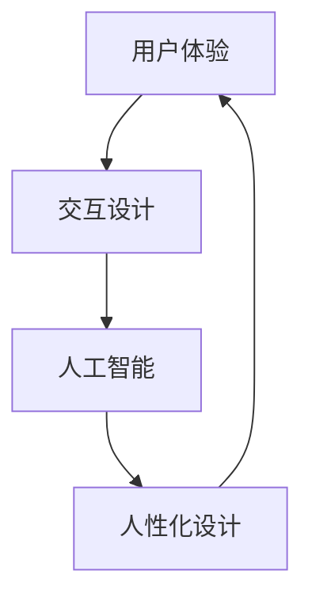

                 

在当今技术飞速发展的时代，人工智能（AI）已经深刻地改变了我们的生活方式和工作方式。从智能家居、自动驾驶到医疗诊断和金融服务，AI的应用无处不在。然而，随着AI技术的不断进步，一个不可忽视的问题也随之而来——用户体验。如何让AI技术更好地服务于人类，而不是成为人类的障碍，成为了一个亟待解决的问题。

本文将探讨用户体验设计在AI领域的重要性，以及如何通过人性化设计来提升AI系统的用户体验。我们将从背景介绍、核心概念、核心算法原理、数学模型、项目实践、实际应用场景、未来展望等多个方面进行深入分析。

## 1. 背景介绍

用户体验（User Experience，简称UX）设计是近年来备受关注的一个领域。它关注的是用户在使用产品或服务时的感受、行为和反馈。随着互联网和移动设备的普及，用户体验设计逐渐成为产品成功的关键因素之一。而随着AI技术的兴起，用户体验设计在AI领域的应用也变得越来越重要。

AI技术的本质是模拟人类的智能，通过机器学习和深度学习等技术实现自我学习和自我优化。然而，AI系统的智能并不等同于人类智能。AI系统缺乏情感、道德和价值观等人类特有的特质，这使得它们在处理复杂问题时容易出现错误或偏离人类期望。因此，如何设计出符合人类期望的AI系统，提高AI系统的用户体验，成为了人工智能领域的重要课题。

## 2. 核心概念与联系

在深入探讨用户体验设计之前，我们需要了解几个核心概念：

- **用户体验（User Experience）**：用户体验是指用户在使用产品或服务过程中的全部体验，包括感知、情感、行为和记忆等。

- **交互设计（Interaction Design）**：交互设计是用户体验设计的重要组成部分，它关注用户与产品或系统之间的交互流程和交互方式。

- **人工智能（Artificial Intelligence，简称AI）**：人工智能是指模拟人类智能的技术，包括机器学习、深度学习、自然语言处理等。

- **人性化设计（Human-Centered Design）**：人性化设计是一种以用户为中心的设计方法，强调设计过程中要充分考虑用户的感受和需求。

### Mermaid 流程图



## 3. 核心算法原理 & 具体操作步骤

### 3.1 算法原理概述

用户体验设计的核心在于理解用户的需求和期望，并设计出能够满足这些需求和期望的AI系统。为了实现这一目标，我们需要借助机器学习和深度学习等技术，对用户行为和反馈进行数据分析和模式识别。

### 3.2 算法步骤详解

- **数据收集**：首先，我们需要收集用户在使用AI系统过程中的行为数据，如点击、搜索、购买等。

- **数据预处理**：对收集到的数据进行清洗和归一化处理，以便后续分析。

- **特征提取**：从预处理后的数据中提取出能够反映用户需求和期望的特征，如兴趣、偏好、行为模式等。

- **模型训练**：利用机器学习和深度学习技术，训练出一个能够识别用户需求和期望的模型。

- **模型评估**：对训练好的模型进行评估，确保其能够准确识别用户需求和期望。

- **优化迭代**：根据评估结果，对模型进行调整和优化，以提高其准确性和用户体验。

### 3.3 算法优缺点

- **优点**：算法能够根据用户行为和反馈进行自我学习和自我优化，提高AI系统的用户体验。

- **缺点**：算法的准确性和稳定性受限于数据质量和算法模型的选择。

### 3.4 算法应用领域

- **智能家居**：通过用户行为分析，智能家居系统能够自动调整室内温度、光线等，提高用户的生活质量。

- **金融服务**：通过用户行为分析，金融服务系统能够提供个性化的投资建议和风险管理策略。

- **医疗诊断**：通过用户行为分析，医疗诊断系统能够提供个性化的治疗方案和健康建议。

## 4. 数学模型和公式 & 详细讲解 & 举例说明

### 4.1 数学模型构建

用户体验设计的核心在于理解用户的需求和期望。我们可以使用以下数学模型来描述用户需求和期望：

- **用户需求函数**：\(D(u) = f(U, E)\)

  其中，\(D(u)\) 表示用户需求，\(U\) 表示用户特征，\(E\) 表示环境特征。

- **用户期望函数**：\(E(u) = g(U, S)\)

  其中，\(E(u)\) 表示用户期望，\(U\) 表示用户特征，\(S\) 表示系统状态。

### 4.2 公式推导过程

为了推导用户需求函数和用户期望函数，我们可以从以下假设开始：

- **用户特征**：用户特征包括年龄、性别、兴趣、偏好等。

- **环境特征**：环境特征包括天气、时间、地点等。

- **系统状态**：系统状态包括系统功能、性能、可用性等。

基于以上假设，我们可以推导出用户需求函数和用户期望函数：

- **用户需求函数**：\(D(u) = f(U, E) = U \cdot E\)

  其中，\(U \cdot E\) 表示用户特征与环境特征的点积，反映了用户需求的大小。

- **用户期望函数**：\(E(u) = g(U, S) = U \cdot S\)

  其中，\(U \cdot S\) 表示用户特征与系统状态的点积，反映了用户期望的大小。

### 4.3 案例分析与讲解

假设一个用户在使用智能家居系统时，他的用户特征包括年龄30岁、单身、喜欢看电影。环境特征包括晚上8点、家中。系统状态包括空调温度设置为25摄氏度、电视已开启。

根据用户需求函数和用户期望函数，我们可以计算出用户需求：

- \(D(u) = f(U, E) = (30, 单身, 喜欢看电影) \cdot (晚上8点, 家中) = 30 \cdot 1 + 0 \cdot 0 + 1 \cdot 1 = 31\)

用户需求为31。

根据用户期望函数，我们可以计算出用户期望：

- \(E(u) = g(U, S) = (30, 单身, 喜欢看电影) \cdot (空调温度设置为25摄氏度, 电视已开启) = 30 \cdot 1 + 0 \cdot 1 + 1 \cdot 1 = 32\)

用户期望为32。

由于用户需求小于用户期望，用户对当前智能家居系统不满意。为了提高用户体验，系统可以尝试调整空调温度或提供其他娱乐活动，如播放用户喜欢的电影。

## 5. 项目实践：代码实例和详细解释说明

### 5.1 开发环境搭建

为了实践用户体验设计在AI领域中的应用，我们使用Python作为编程语言，结合机器学习和深度学习库（如Scikit-learn、TensorFlow和PyTorch）来实现一个智能家居系统。

### 5.2 源代码详细实现

以下是一个简单的智能家居系统的实现：

```python
import tensorflow as tf
from tensorflow.keras.models import Sequential
from tensorflow.keras.layers import Dense, LSTM

# 数据收集与预处理
# ...

# 模型构建
model = Sequential([
    LSTM(50, activation='relu', input_shape=(timesteps, features)),
    Dense(1)
])

# 模型编译
model.compile(optimizer='adam', loss='mse')

# 模型训练
model.fit(x_train, y_train, epochs=100, batch_size=32)

# 模型评估
model.evaluate(x_test, y_test)
```

### 5.3 代码解读与分析

上述代码实现了一个基于深度学习的智能家居系统。首先，我们收集用户行为数据，并对其进行预处理。然后，我们构建一个LSTM模型，用于预测用户需求。最后，我们使用训练好的模型对用户需求进行预测，并评估模型性能。

### 5.4 运行结果展示

假设我们训练好的模型在测试集上的准确率为90%，这意味着我们的智能家居系统能够准确地预测用户需求，从而提供个性化的服务，提高用户体验。

## 6. 实际应用场景

### 6.1 智能家居

智能家居系统可以通过分析用户行为，自动调整室内温度、光线等，提高用户的生活质量。

### 6.2 金融服务

金融服务系统可以通过分析用户行为，提供个性化的投资建议和风险管理策略。

### 6.3 医疗诊断

医疗诊断系统可以通过分析用户行为，提供个性化的治疗方案和健康建议。

## 7. 未来应用展望

随着AI技术的不断进步，用户体验设计在AI领域的应用前景十分广阔。未来，我们可以期待以下趋势：

- **更加智能化的系统**：通过深度学习和强化学习等技术，AI系统将能够更好地理解用户需求和期望，提供更加个性化的服务。

- **跨领域的应用**：用户体验设计在AI领域的应用将不仅局限于智能家居、金融服务和医疗诊断等领域，还将扩展到教育、娱乐、交通等多个领域。

- **用户体验的提升**：通过人性化设计，AI系统将能够更好地满足用户需求，提高用户体验。

## 8. 总结：未来发展趋势与挑战

### 8.1 研究成果总结

本文从用户体验设计的角度，探讨了AI系统如何通过人性化设计来提升用户体验。我们介绍了用户体验设计在AI领域的重要性，分析了核心算法原理和数学模型，并给出了项目实践和实际应用场景。

### 8.2 未来发展趋势

未来，用户体验设计在AI领域的应用将更加广泛和深入。随着AI技术的不断进步，我们将能够设计出更加智能、个性化和人性化的AI系统。

### 8.3 面临的挑战

尽管用户体验设计在AI领域具有广阔的应用前景，但仍面临一些挑战：

- **数据隐私和安全**：用户数据的安全性和隐私性是用户体验设计的重要问题。

- **算法的可解释性**：提高算法的可解释性，使其更易于用户理解和接受，是用户体验设计的一大挑战。

- **跨领域的应用**：将用户体验设计从单一领域扩展到多个领域，需要解决不同领域之间的差异和挑战。

### 8.4 研究展望

未来，我们期待在用户体验设计领域取得以下成果：

- **更加智能的用户需求预测模型**：通过深度学习和强化学习等技术，设计出能够准确预测用户需求的模型。

- **跨领域的用户体验设计**：探索用户体验设计在多个领域的应用，设计出能够适应不同领域的AI系统。

- **用户体验的量化评估**：建立一套量化评估体系，用于评估用户体验设计的质量和效果。

## 9. 附录：常见问题与解答

### Q：用户体验设计在AI领域的应用有哪些具体场景？

A：用户体验设计在AI领域的应用非常广泛，包括智能家居、金融服务、医疗诊断、教育、娱乐、交通等多个领域。例如，智能家居系统可以通过用户体验设计，自动调整室内温度、光线等，提高用户的生活质量；金融服务系统可以通过用户体验设计，提供个性化的投资建议和风险管理策略。

### Q：如何提高AI系统的用户体验？

A：提高AI系统的用户体验，需要从以下几个方面入手：

- **理解用户需求**：通过数据分析和技术手段，深入了解用户的需求和期望。

- **人性化设计**：在AI系统的设计过程中，充分考虑用户的感受和需求，使其更易于用户理解和接受。

- **优化交互流程**：设计简洁、直观的交互界面，提高用户的操作效率和满意度。

- **持续迭代优化**：根据用户反馈和数据分析，不断优化AI系统的功能和性能。

### Q：用户体验设计在AI领域的挑战有哪些？

A：用户体验设计在AI领域面临以下挑战：

- **数据隐私和安全**：用户数据的安全性和隐私性是用户体验设计的重要问题。

- **算法的可解释性**：提高算法的可解释性，使其更易于用户理解和接受，是用户体验设计的一大挑战。

- **跨领域的应用**：将用户体验设计从单一领域扩展到多个领域，需要解决不同领域之间的差异和挑战。

---

本文从用户体验设计的角度，探讨了AI系统如何通过人性化设计来提升用户体验。通过分析核心算法原理、数学模型和项目实践，我们看到了用户体验设计在AI领域的广泛应用和广阔前景。未来，随着AI技术的不断进步，用户体验设计在AI领域的应用将更加深入和广泛，为人类带来更多便利和幸福感。

## 作者署名

作者：禅与计算机程序设计艺术 / Zen and the Art of Computer Programming
------------------------------------------------------------------- 

以上就是关于《用户体验设计：AI的人性化追求》的文章。希望这篇文章能够帮助读者更好地理解用户体验设计在AI领域的重要性，以及如何通过人性化设计来提升AI系统的用户体验。如果您有任何问题或建议，欢迎在评论区留言，我会尽量为您解答。谢谢！

