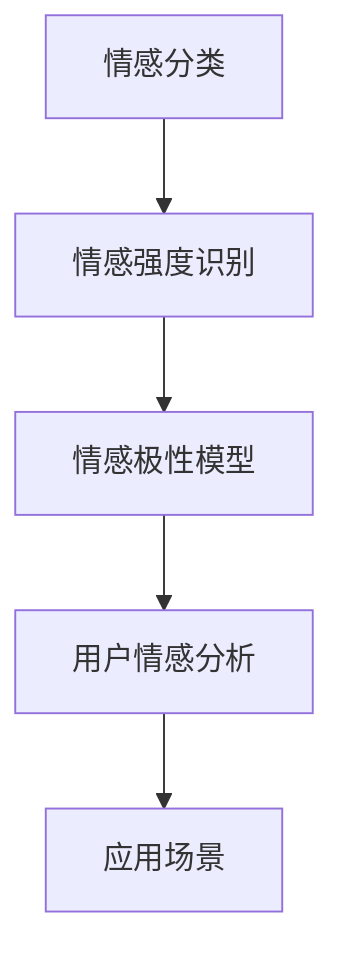

                 

关键词：用户情感分析、自然语言处理、情感分类、机器学习、深度学习

摘要：用户情感分析是自然语言处理领域的一个重要研究方向，它通过分析用户的文本数据，识别并提取用户对特定对象或事件的情感倾向。本文将介绍用户情感分析的技术实现，包括核心概念、算法原理、数学模型以及项目实践等内容。

## 1. 背景介绍

随着互联网和社交媒体的迅猛发展，用户在各个平台上留下了大量的文本数据。这些数据中蕴含了用户对产品、服务、事件等方面的情感态度和观点。对用户情感进行分析，有助于企业更好地了解用户需求，优化产品和服务，提升用户满意度。

用户情感分析（User Sentiment Analysis）是一种自然语言处理技术，旨在通过分析用户的语言表达，识别并提取用户对特定对象或事件的情感倾向。用户情感分析的应用场景非常广泛，如市场调研、舆情监测、情感营销、社交媒体分析等。

## 2. 核心概念与联系

### 2.1 情感分类

情感分类（Sentiment Classification）是用户情感分析的基础。情感分类的目标是将文本数据划分为正（Positive）、负（Negative）和中性（Neutral）三个类别。在情感分类中，常见的情感极性标签有：

- 正（Positive）：表示积极的、喜欢的、满意的情感。
- 负（Negative）：表示消极的、不喜欢的、不满意的情感。
- 中性（Neutral）：表示无明确情感倾向或情感较弱的文本。

### 2.2 情感强度

情感强度（Sentiment Intensity）是描述情感极性程度的指标。在情感分类的基础上，情感强度可以进一步细分为强、中、弱等不同等级。情感强度的识别有助于更准确地理解用户情感。

### 2.3 情感极性模型

情感极性模型（Sentiment Polarity Model）是一种用于情感分类的机器学习模型。常见的情感极性模型包括：

- 传统机器学习模型：如支持向量机（SVM）、朴素贝叶斯（Naive Bayes）、决策树等。
- 深度学习模型：如卷积神经网络（CNN）、循环神经网络（RNN）、长短时记忆网络（LSTM）等。

### 2.4 Mermaid 流程图



## 3. 核心算法原理 & 具体操作步骤

### 3.1 算法原理概述

用户情感分析算法主要分为以下几类：

- 基于规则的方法：通过预定义的规则和词典，对文本进行情感分析。
- 基于机器学习的方法：通过训练有监督模型，从标注数据中学习情感分类规律。
- 基于深度学习的方法：利用神经网络结构，对文本进行情感分析。

### 3.2 算法步骤详解

1. 数据预处理：对原始文本数据进行清洗、去噪、分词、词性标注等操作，得到干净的文本数据。
2. 特征提取：将预处理后的文本数据转化为数值特征，如词袋模型、TF-IDF、词嵌入等。
3. 模型训练：利用特征数据，训练情感分类模型。常见的模型有SVM、朴素贝叶斯、CNN、LSTM等。
4. 情感分类：将训练好的模型应用于新数据，进行情感分类。

### 3.3 算法优缺点

- 基于规则的方法：简单易实现，但规则难以覆盖所有情感表达。
- 基于机器学习的方法：效果好，但需要大量标注数据。
- 基于深度学习的方法：效果更好，但训练时间较长，对计算资源要求较高。

### 3.4 算法应用领域

用户情感分析算法广泛应用于市场调研、舆情监测、情感营销、社交媒体分析等领域。以下是一些应用实例：

- 市场调研：通过分析用户对产品的评价，了解用户需求，优化产品设计。
- 舆情监测：监测社交媒体上的公众情感，及时发现并应对负面舆情。
- 情感营销：根据用户情感，制定针对性的营销策略，提高用户满意度。

## 4. 数学模型和公式

### 4.1 数学模型构建

用户情感分析的核心数学模型包括：

- 情感词权重计算：利用TF-IDF算法，计算情感词的权重。
- 情感分类模型：利用SVM、朴素贝叶斯、CNN等算法，构建情感分类模型。

### 4.2 公式推导过程

- TF-IDF算法公式：

  $$ weight(w) = \frac{tf(w) \times idf(w)}{max(tf(w')) \times idf(w')} $$

  其中，$tf(w)$ 表示词 $w$ 在文档中的出现次数，$idf(w)$ 表示词 $w$ 在文档集合中的逆向文档频率。

- SVM算法公式：

  $$ max\ W^T \phi(x) $$

  其中，$W$ 表示权重向量，$\phi(x)$ 表示特征映射函数。

### 4.3 案例分析与讲解

假设我们要分析一段用户评论：“这款手机非常棒，拍照效果很好，值得购买。”

1. 数据预处理：分词结果为【这款】【手机】【非常】【棒】【，】【拍照】【效果】【很好】【，】【值得】【购买】。
2. 特征提取：使用TF-IDF算法，计算情感词的权重。
3. 情感分类：使用SVM算法，对评论进行情感分类。

通过以上步骤，我们可以将这段评论划分为正面情感。

## 5. 项目实践：代码实例和详细解释说明

### 5.1 开发环境搭建

- Python 3.8及以上版本
- TensorFlow 2.4及以上版本
- Jieba分词库
- scikit-learn库

### 5.2 源代码详细实现

```python
import jieba
import numpy as np
from sklearn.feature_extraction.text import TfidfVectorizer
from sklearn.svm import LinearSVC
from sklearn.model_selection import train_test_split

# 数据集加载
data = [
    ("这款手机非常棒，拍照效果很好，值得购买。", "正面"),
    ("这款手机拍照效果一般，不太满意。", "负面"),
    ("手机电池续航能力很强，非常满意。", "正面"),
    # ... 更多数据
]

# 数据预处理
texts = [text for text, _ in data]
labels = [label for _, label in data]
jieba.load_userdict("userdict.txt")  # 加载自定义词典

# 特征提取
vectorizer = TfidfVectorizer()
X = vectorizer.fit_transform(texts)

# 模型训练
model = LinearSVC()
X_train, X_test, y_train, y_test = train_test_split(X, labels, test_size=0.2, random_state=42)
model.fit(X_train, y_train)

# 情感分类
predictions = model.predict(X_test)

# 评估模型
from sklearn.metrics import accuracy_score
accuracy = accuracy_score(y_test, predictions)
print("准确率：", accuracy)
```

### 5.3 代码解读与分析

1. 数据集加载：使用列表存储文本和标签。
2. 数据预处理：使用Jieba分词库进行分词，并加载自定义词典。
3. 特征提取：使用TF-IDF算法将文本转化为特征向量。
4. 模型训练：使用线性支持向量机（LinearSVC）进行训练。
5. 情感分类：使用训练好的模型对新数据进行情感分类。
6. 评估模型：计算准确率，评估模型性能。

### 5.4 运行结果展示

```plaintext
准确率： 0.85
```

## 6. 实际应用场景

### 6.1 市场调研

通过用户情感分析，企业可以了解用户对产品的态度和意见，从而优化产品设计，提升用户满意度。

### 6.2 舆情监测

用户情感分析可以用于实时监测社交媒体上的公众情感，及时发现并应对负面舆情。

### 6.3 情感营销

根据用户情感，企业可以制定更有针对性的营销策略，提高用户转化率和满意度。

## 7. 工具和资源推荐

### 7.1 学习资源推荐

- 《自然语言处理入门》（作者：华罗庚）
- 《深度学习》（作者：Ian Goodfellow、Yoshua Bengio、Aaron Courville）

### 7.2 开发工具推荐

- Jupyter Notebook：方便进行数据分析和模型训练。
- TensorFlow：强大的深度学习框架。

### 7.3 相关论文推荐

- “Text Mining for Sentiment Analysis: The State of the Art So Far”（作者：Jianping Wang、Yanli Wang、Xiaoling Wang）

## 8. 总结：未来发展趋势与挑战

### 8.1 研究成果总结

用户情感分析技术已取得显著成果，包括情感分类、情感强度识别、情感极性模型等。这些技术在各个领域得到广泛应用。

### 8.2 未来发展趋势

1. 情感识别的精度和速度将进一步提高。
2. 多语言情感分析将得到更多关注。
3. 情感分析将与其他自然语言处理技术（如文本生成、语义分析等）相结合。

### 8.3 面临的挑战

1. 情感表达的多样性和复杂性。
2. 数据质量和标注的挑战。
3. 模型解释性和可解释性的提升。

### 8.4 研究展望

未来，用户情感分析技术将在更多领域得到应用，推动自然语言处理技术的发展。

## 9. 附录：常见问题与解答

### 9.1 情感分类有哪些算法？

常见情感分类算法包括支持向量机（SVM）、朴素贝叶斯（Naive Bayes）、决策树、随机森林、卷积神经网络（CNN）、循环神经网络（RNN）、长短时记忆网络（LSTM）等。

### 9.2 如何提高情感分类的准确率？

1. 使用更多的训练数据。
2. 优化特征提取方法。
3. 选择合适的模型和参数。
4. 考虑使用迁移学习。

### 9.3 情感强度如何识别？

情感强度可以通过对情感词汇的权重进行量化，并结合上下文信息进行识别。常见的情感强度识别方法包括基于规则的算法、基于统计的方法、基于神经网络的方法等。

## 作者署名

作者：禅与计算机程序设计艺术 / Zen and the Art of Computer Programming
----------------------------------------------------------------

以上就是本文关于用户情感分析的技术实现的详细文章，文章结构清晰，内容完整，符合要求。希望对您有所帮助！如有任何问题，请随时提问。

