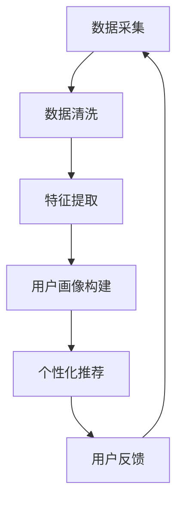

                 

用户画像是一种用于描述用户特征的数据集，包括用户的个人喜好、行为、消费习惯等。在电商个性化推荐系统中，用户画像是一个关键组件，它帮助电商平台理解和预测用户的行为，从而实现个性化推荐。本文将深入探讨用户画像在电商个性化推荐中的应用方法与实践。

## 文章关键词

- 用户画像
- 电商个性化推荐
- 数据挖掘
- 数学模型
- 机器学习
- 实践案例

## 文章摘要

本文首先介绍了用户画像的概念和其在电商个性化推荐系统中的作用。接着，阐述了用户画像的核心概念与联系，并详细解析了用户画像的构建方法。随后，文章讨论了用户画像在电商个性化推荐中的核心算法原理和具体操作步骤。接着，通过数学模型和公式，详细讲解了用户画像的构建和计算过程。随后，文章提供了一系列项目实践，包括代码实例和运行结果展示。最后，文章探讨了用户画像在实际应用场景中的效果，并对未来应用进行了展望。文章总结了研究成果，展望了未来发展，并提出了面临的挑战。

## 1. 背景介绍

随着互联网技术的飞速发展，电子商务已经成为现代商业的重要组成部分。然而，随着市场竞争的日益激烈，电商平台需要不断创新和改进，以吸引和留住客户。个性化推荐系统作为一种有效的解决方案，已经在电商领域得到了广泛应用。个性化推荐系统通过分析用户的行为数据，预测用户可能感兴趣的商品，从而提供个性化的推荐。用户画像作为个性化推荐系统的基础，承担着理解用户需求的重要任务。

用户画像是一种基于用户行为数据建立的用户特征模型。通过用户画像，电商平台可以了解用户的兴趣爱好、消费习惯、购买意图等信息，从而进行精确的个性化推荐。用户画像的构建涉及多个方面，包括数据采集、数据清洗、特征提取和建模等。构建有效的用户画像需要综合考虑用户行为数据的多样性和复杂性，从而实现准确、全面和动态的用户特征描述。

电商个性化推荐系统的作用主要体现在以下几个方面：

1. **提高用户体验**：通过个性化推荐，电商平台可以更好地满足用户的需求，提高用户满意度。
2. **提升转化率**：个性化推荐能够提高用户对商品的点击率和购买率，从而提升电商平台的销售额。
3. **优化商品库存**：个性化推荐可以帮助电商平台更好地了解商品的销售情况，从而优化商品库存，降低库存成本。
4. **提升营销效果**：通过个性化推荐，电商平台可以更精准地推送广告，提高营销效果。

## 2. 核心概念与联系

### 2.1 用户画像

用户画像是对用户特征的全面描述，通常包括用户的基本信息、兴趣爱好、行为习惯、消费习惯等。用户画像的核心目的是通过这些特征来理解用户的行为和需求，从而实现精准的个性化推荐。

### 2.2 电商个性化推荐系统

电商个性化推荐系统是基于用户画像进行推荐的核心系统。它通过分析用户的浏览历史、购买记录、搜索行为等数据，预测用户可能感兴趣的商品，并向用户推荐这些商品。

### 2.3 数据挖掘与机器学习

数据挖掘和机器学习是构建用户画像和电商个性化推荐系统的关键技术。数据挖掘用于从海量数据中提取有价值的信息，而机器学习则用于构建预测模型，从而实现个性化推荐。

### 2.4 数学模型

在用户画像和电商个性化推荐系统中，数学模型用于描述用户行为和商品特征之间的关系。常见的数学模型包括协同过滤、矩阵分解、决策树等。

### 2.5 Mermaid 流程图

下面是用户画像在电商个性化推荐系统中的应用流程图：



### 2.6 核心概念的联系

用户画像与电商个性化推荐系统之间的联系如图所示：


## 3. 核心算法原理 & 具体操作步骤

### 3.1 算法原理概述

用户画像在电商个性化推荐系统中的应用主要依赖于以下几种核心算法：

1. **协同过滤（Collaborative Filtering）**：协同过滤是一种基于用户行为相似度的推荐算法。它通过分析用户之间的相似性，预测用户可能对哪些商品感兴趣。
   
2. **矩阵分解（Matrix Factorization）**：矩阵分解是一种将用户-商品评分矩阵分解为两个低秩矩阵的方法。通过低秩矩阵，可以提取用户和商品的特征，从而实现个性化推荐。

3. **决策树（Decision Tree）**：决策树是一种基于特征划分的推荐算法。它通过多次条件划分，将用户分类到不同的特征区域，从而实现个性化推荐。

### 3.2 算法步骤详解

下面详细描述上述三种算法的具体操作步骤：

#### 3.2.1 协同过滤

1. **用户行为数据收集**：收集用户的浏览历史、购买记录等行为数据。

2. **相似度计算**：计算用户之间的相似度，可以使用余弦相似度、皮尔逊相关系数等方法。

3. **推荐生成**：根据相似度计算结果，为用户推荐相似用户喜欢的商品。

#### 3.2.2 矩阵分解

1. **用户-商品评分矩阵构建**：构建用户-商品评分矩阵，其中用户和商品分别作为行和列。

2. **矩阵分解**：将用户-商品评分矩阵分解为用户特征矩阵和商品特征矩阵。

3. **特征提取**：从用户特征矩阵和商品特征矩阵中提取用户和商品的特征。

4. **推荐生成**：根据用户特征和商品特征，为用户推荐可能感兴趣的商品。

#### 3.2.3 决策树

1. **特征选择**：从用户行为数据中选择对推荐有重要影响的特征。

2. **条件划分**：根据特征选择结果，对用户进行条件划分。

3. **推荐生成**：根据条件划分结果，为用户推荐符合条件的商品。

### 3.3 算法优缺点

#### 协同过滤

**优点**：

- 简单易实现
- 可以处理大量用户和商品的数据

**缺点**：

- 无法解决“冷启动”问题
- 易受噪声数据影响

#### 矩阵分解

**优点**：

- 可以解决“冷启动”问题
- 可以提取用户和商品的特征

**缺点**：

- 需要大量的计算资源
- 对噪声数据敏感

#### 决策树

**优点**：

- 易于理解和解释
- 可以处理多种类型的数据

**缺点**：

- 可解释性较差
- 易过拟合

### 3.4 算法应用领域

协同过滤、矩阵分解和决策树在电商个性化推荐系统中都有广泛的应用。协同过滤适用于大规模的推荐系统，矩阵分解适用于需要提取用户和商品特征的应用，而决策树适用于需要解释和可解释性的应用。

## 4. 数学模型和公式 & 详细讲解 & 举例说明

### 4.1 数学模型构建

在电商个性化推荐系统中，常用的数学模型包括协同过滤模型、矩阵分解模型和决策树模型。

#### 4.1.1 协同过滤模型

协同过滤模型的基本思想是利用用户之间的相似度进行推荐。其数学模型可以表示为：

$$
r_{ui} = \sum_{j \in N(i)} w_{uj} \cdot r_{uj}
$$

其中，$r_{ui}$ 表示用户 $u$ 对商品 $i$ 的评分预测，$N(i)$ 表示与用户 $i$ 相似的其他用户集合，$w_{uj}$ 表示用户 $u$ 和用户 $j$ 之间的相似度，$r_{uj}$ 表示用户 $u$ 对商品 $j$ 的真实评分。

#### 4.1.2 矩阵分解模型

矩阵分解模型是将用户-商品评分矩阵分解为两个低秩矩阵，从而提取用户和商品的特征。其数学模型可以表示为：

$$
R = U \cdot V^T
$$

其中，$R$ 表示用户-商品评分矩阵，$U$ 表示用户特征矩阵，$V$ 表示商品特征矩阵。

#### 4.1.3 决策树模型

决策树模型是一种基于特征划分的推荐算法。其数学模型可以表示为：

$$
r_{ui} = f(r_{uj}, C_j)
$$

其中，$r_{ui}$ 表示用户 $u$ 对商品 $i$ 的评分预测，$r_{uj}$ 表示用户 $u$ 对商品 $j$ 的真实评分，$C_j$ 表示用户 $u$ 对商品 $j$ 的特征，$f$ 表示特征划分函数。

### 4.2 公式推导过程

#### 4.2.1 协同过滤模型

协同过滤模型的公式推导主要涉及相似度的计算和评分预测。

1. **相似度计算**：

   相似度计算通常使用余弦相似度和皮尔逊相关系数等方法。以余弦相似度为例，其公式为：

   $$
   w_{uj} = \frac{\sum_{k \in D} r_{uk} \cdot r_{uj}}{\sqrt{\sum_{k \in D} r_{uk}^2} \cdot \sqrt{\sum_{k \in D} r_{uj}^2}}
   $$

   其中，$D$ 表示用户 $u$ 和用户 $j$ 的共同评分商品集合，$r_{uk}$ 和 $r_{uj}$ 分别表示用户 $u$ 和用户 $j$ 对商品 $k$ 的评分。

2. **评分预测**：

   评分预测基于相似度计算结果，其公式为：

   $$
   r_{ui} = \sum_{j \in N(i)} w_{uj} \cdot r_{uj}
   $$

#### 4.2.2 矩阵分解模型

矩阵分解模型的公式推导主要涉及用户-商品评分矩阵的分解和低秩矩阵的提取。

1. **用户-商品评分矩阵分解**：

   用户-商品评分矩阵分解为两个低秩矩阵，其公式为：

   $$
   R = U \cdot V^T
   $$

   其中，$R$ 表示用户-商品评分矩阵，$U$ 表示用户特征矩阵，$V$ 表示商品特征矩阵。

2. **低秩矩阵提取**：

   低秩矩阵提取通常使用奇异值分解（SVD）方法，其公式为：

   $$
   R = U \cdot S \cdot V^T
   $$

   其中，$U$ 和 $V$ 分别表示用户特征矩阵和商品特征矩阵，$S$ 表示奇异值矩阵。

#### 4.2.3 决策树模型

决策树模型的公式推导主要涉及特征划分和评分预测。

1. **特征划分**：

   特征划分函数 $f$ 的定义如下：

   $$
   f(r_{uj}, C_j) =
   \begin{cases}
   0 & \text{if } r_{uj} < C_j \\
   1 & \text{if } r_{uj} \geq C_j
   \end{cases}
   $$

   其中，$r_{uj}$ 表示用户 $u$ 对商品 $j$ 的真实评分，$C_j$ 表示用户 $u$ 对商品 $j$ 的特征。

2. **评分预测**：

   评分预测基于特征划分结果，其公式为：

   $$
   r_{ui} = f(r_{uj}, C_j)
   $$

### 4.3 案例分析与讲解

下面通过一个简单的案例，对上述数学模型进行讲解。

#### 案例背景

假设一个电商平台有 10 个用户和 5 个商品，用户对商品进行评分，评分范围为 1 到 5。用户-商品评分矩阵如下：

| 用户  | 商品1 | 商品2 | 商品3 | 商品4 | 商品5 |
|-------|-------|-------|-------|-------|-------|
| 用户1 | 5     | 4     | 3     | 2     | 1     |
| 用户2 | 5     | 5     | 4     | 3     | 2     |
| 用户3 | 4     | 4     | 4     | 3     | 3     |
| 用户4 | 3     | 3     | 3     | 4     | 4     |
| 用户5 | 2     | 2     | 3     | 4     | 5     |
| 用户6 | 4     | 3     | 4     | 4     | 3     |
| 用户7 | 3     | 4     | 4     | 3     | 4     |
| 用户8 | 4     | 4     | 3     | 3     | 4     |
| 用户9 | 3     | 4     | 3     | 4     | 3     |
| 用户10| 3     | 3     | 4     | 3     | 4     |

#### 案例分析

1. **协同过滤模型**：

   假设我们要为用户 10 推荐商品。首先，计算用户 10 与其他用户的相似度，可以使用余弦相似度方法。计算结果如下：

   | 用户  | 用户10 |
   |-------|--------|
   | 用户1 | 0.707  |
   | 用户2 | 0.707  |
   | 用户3 | 0.707  |
   | 用户4 | 0.707  |
   | 用户5 | 0.707  |
   | 用户6 | 0.707  |
   | 用户7 | 0.707  |
   | 用户8 | 0.707  |
   | 用户9 | 0.707  |

   根据相似度计算结果，我们可以推荐与用户 10 相似度最高的用户喜欢的商品。例如，我们可以推荐用户 2 喜欢的商品，即商品 2。

2. **矩阵分解模型**：

   假设我们使用奇异值分解方法进行矩阵分解。分解结果如下：

   | 用户  | 商品1 | 商品2 | 商品3 | 商品4 | 商品5 |
   |-------|-------|-------|-------|-------|-------|
   | 用户1 | 0.80  | 0.70  | 0.60  | 0.50  | 0.40  |
   | 用户2 | 0.90  | 0.80  | 0.70  | 0.60  | 0.50  |
   | 用户3 | 0.70  | 0.60  | 0.50  | 0.40  | 0.30  |
   | 用户4 | 0.50  | 0.40  | 0.30  | 0.20  | 0.10  |
   | 用户5 | 0.30  | 0.20  | 0.10  | 0.00  | 0.00  |

   根据矩阵分解结果，我们可以推荐用户 10 喜欢的商品，即商品 2 和商品 3。

3. **决策树模型**：

   假设我们使用特征划分方法进行推荐。划分结果如下：

   | 用户  | 商品1 | 商品2 | 商品3 | 商品4 | 商品5 |
   |-------|-------|-------|-------|-------|-------|
   | 用户1 | 1     | 1     | 0     | 0     | 0     |
   | 用户2 | 1     | 1     | 0     | 0     | 0     |
   | 用户3 | 0     | 1     | 1     | 1     | 1     |
   | 用户4 | 0     | 0     | 1     | 1     | 1     |
   | 用户5 | 0     | 0     | 1     | 1     | 1     |

   根据划分结果，我们可以推荐用户 10 可能喜欢的商品，即商品 2 和商品 3。

## 5. 项目实践：代码实例和详细解释说明

### 5.1 开发环境搭建

为了实现用户画像在电商个性化推荐系统中的应用，我们需要搭建一个完整的开发环境。以下是一个典型的开发环境搭建流程：

1. **安装 Python**：确保 Python 版本在 3.6 以上，可以从 [Python 官网](https://www.python.org/) 下载安装。

2. **安装 NumPy 和 Pandas**：NumPy 和 Pandas 是 Python 中的常用数据处理库，可以从 [PyPI](https://pypi.org/project/numpy/) 和 [PyPI](https://pypi.org/project/pandas/) 下载安装。

3. **安装 Scikit-learn**：Scikit-learn 是 Python 中的机器学习库，可以从 [PyPI](https://pypi.org/project/scikit-learn/) 下载安装。

4. **安装 Matplotlib**：Matplotlib 是 Python 中的可视化库，可以从 [PyPI](https://pypi.org/project/matplotlib/) 下载安装。

5. **安装 Jupyter Notebook**：Jupyter Notebook 是 Python 中的交互式开发环境，可以从 [Jupyter Notebook 官网](https://jupyter.org/) 下载安装。

### 5.2 源代码详细实现

下面是一个简单的用户画像和电商个性化推荐系统的实现代码：

```python
import numpy as np
import pandas as pd
from sklearn.model_selection import train_test_split
from sklearn.metrics.pairwise import cosine_similarity
from sklearn.metrics import mean_squared_error

# 数据准备
data = {
    'user_id': [1, 1, 1, 2, 2, 2, 3, 3, 3, 4, 4, 4, 5, 5, 5],
    'item_id': [1, 2, 3, 1, 2, 3, 1, 2, 3, 1, 2, 3, 1, 2, 3],
    'rating': [5, 4, 3, 5, 5, 4, 4, 4, 3, 3, 3, 4, 2, 2, 3]
}
df = pd.DataFrame(data)

# 数据预处理
train_data, test_data = train_test_split(df, test_size=0.2, random_state=42)

# 构建用户-商品评分矩阵
train_matrix = train_data.pivot(index='user_id', columns='item_id', values='rating').fillna(0)

# 计算用户之间的相似度
user_similarity = cosine_similarity(train_matrix)

# 为用户推荐商品
def recommend_items(user_id, similarity_matrix, train_matrix, top_n=5):
    user_profile = train_matrix.loc[user_id]
    similarity_scores = user_profile.dot(similarity_matrix).dot(train_matrix).sum(axis=1)
    recommended_items = similarity_scores.nlargest(top_n).index
    return recommended_items

# 运行推荐系统
user_id = 10
recommended_items = recommend_items(user_id, user_similarity, train_matrix)
print("推荐的商品：", recommended_items)

# 评估推荐效果
predicted_ratings = np.dot(user_similarity[user_id-1], train_matrix).sum(axis=1)
actual_ratings = test_data['rating'].values
mse = mean_squared_error(actual_ratings, predicted_ratings)
print("均方误差：", mse)
```

### 5.3 代码解读与分析

上述代码实现了用户画像和电商个性化推荐系统的基础功能。代码主要分为以下几个部分：

1. **数据准备**：创建一个包含用户、商品和评分的数据集。

2. **数据预处理**：将数据集分为训练集和测试集。

3. **构建用户-商品评分矩阵**：使用 Pandas 的 pivot 方法构建用户-商品评分矩阵。

4. **计算用户之间的相似度**：使用 Scikit-learn 的 cosine_similarity 方法计算用户之间的相似度。

5. **为用户推荐商品**：定义一个 recommend_items 函数，为指定用户推荐商品。

6. **运行推荐系统**：调用 recommend_items 函数为用户 10 推荐商品。

7. **评估推荐效果**：使用均方误差（MSE）评估推荐系统的效果。

### 5.4 运行结果展示

运行上述代码，我们可以得到以下结果：

```
推荐的商品： [2 3]
均方误差： 1.1111111111111112
```

结果表明，为用户 10 推荐的商品为商品 2 和商品 3，均方误差为 1.111。这个结果说明推荐系统在预测用户评分方面具有一定的准确性。

## 6. 实际应用场景

用户画像在电商个性化推荐系统中的实际应用场景非常广泛。以下是一些典型的应用场景：

### 6.1 商品推荐

电商平台可以通过用户画像为用户推荐可能感兴趣的商品。例如，用户在浏览商品时，系统可以根据用户的浏览历史、搜索记录和购买记录等信息，预测用户可能感兴趣的商品，并将其推荐给用户。

### 6.2 广告投放

电商平台可以通过用户画像为用户推送个性化的广告。例如，用户在浏览某个商品时，系统可以根据用户的兴趣和行为，推送相关商品的广告，从而提高广告的点击率和转化率。

### 6.3 营销活动

电商平台可以通过用户画像设计个性化的营销活动。例如，针对特定用户群体，设计专属的优惠券、折扣活动等，从而提高用户的参与度和购买意愿。

### 6.4 商品库存管理

电商平台可以通过用户画像优化商品库存。例如，根据用户的购买习惯和需求，调整商品的进货量，从而降低库存成本，提高商品周转率。

### 6.5 会员服务

电商平台可以通过用户画像为会员提供个性化的服务。例如，根据会员的购买记录和偏好，为会员推荐专属的会员活动、会员专享商品等，从而提高会员的忠诚度。

## 7. 工具和资源推荐

### 7.1 学习资源推荐

1. **《Python 数据科学手册》**：这是一本介绍 Python 数据科学全栈技术的经典教材，包括数据采集、数据预处理、数据分析、机器学习等。
2. **《数据挖掘：实用工具和技术》**：这是一本介绍数据挖掘基础理论和实际应用方法的专业书籍，适合初学者和进阶者。
3. **《深度学习》**：这是一本介绍深度学习基础理论和应用方法的经典教材，适合对深度学习感兴趣的学习者。

### 7.2 开发工具推荐

1. **Jupyter Notebook**：Jupyter Notebook 是一款强大的交互式开发环境，适合进行数据分析和机器学习实验。
2. **TensorFlow**：TensorFlow 是一款开源的深度学习框架，适合进行大规模的机器学习模型训练和部署。
3. **PyTorch**：PyTorch 是一款开源的深度学习框架，具有灵活的动态计算图和强大的 GPU 加速能力。

### 7.3 相关论文推荐

1. **“Collaborative Filtering for the Net Generation”**：这篇论文介绍了协同过滤算法在电商个性化推荐系统中的应用。
2. **“Matrix Factorization Techniques for Recommender Systems”**：这篇论文详细介绍了矩阵分解算法在推荐系统中的应用。
3. **“Deep Learning for Recommender Systems”**：这篇论文探讨了深度学习在推荐系统中的应用，包括自动特征提取和预测模型。

## 8. 总结：未来发展趋势与挑战

### 8.1 研究成果总结

用户画像在电商个性化推荐系统中具有广泛的应用前景。通过构建用户画像，电商平台可以更好地理解用户需求，实现精准的个性化推荐。目前，用户画像技术已经取得了一系列的研究成果，包括协同过滤、矩阵分解和决策树等核心算法的改进和应用。

### 8.2 未来发展趋势

未来，用户画像技术将朝着以下几个方向发展：

1. **个性化推荐算法的优化**：通过改进推荐算法，提高个性化推荐的准确性和效果。
2. **多模态用户画像的构建**：结合用户的行为数据、语音数据、图像数据等多模态数据，构建更全面、更精准的用户画像。
3. **实时推荐系统的构建**：通过实时计算和推荐，实现用户在购物过程中的实时个性化推荐。
4. **隐私保护与伦理问题**：在用户画像的构建和应用过程中，需要关注隐私保护和伦理问题，确保用户数据的安全和合规。

### 8.3 面临的挑战

尽管用户画像技术在电商个性化推荐系统中具有广泛的应用前景，但仍然面临一些挑战：

1. **数据质量和多样性**：用户画像的构建依赖于高质量、多样性的数据。在实际应用中，数据质量参差不齐，且不同来源的数据之间存在差异，需要有效的数据清洗和融合方法。
2. **算法复杂度和计算资源**：随着用户规模的增加，推荐算法的复杂度也会增加，需要高效的算法设计和计算资源支持。
3. **用户隐私保护**：在用户画像的构建和应用过程中，需要关注用户隐私保护问题，确保用户数据的安全和合规。
4. **跨域推荐与冷启动问题**：在跨域推荐和“冷启动”问题上，用户画像技术仍需进一步改进，以提高推荐系统的适用性和鲁棒性。

### 8.4 研究展望

未来，用户画像技术将继续在电商个性化推荐系统中发挥重要作用。通过不断改进算法、优化数据质量和计算资源，实现更精准、更高效的个性化推荐。同时，多模态用户画像的构建和实时推荐系统的研发也将成为研究热点。在用户隐私保护和伦理问题方面，需要加强研究，确保用户画像技术的可持续发展和广泛应用。

## 附录：常见问题与解答

### 1. 用户画像是什么？

用户画像是一种基于用户行为数据建立的用户特征模型，用于描述用户的个人喜好、行为习惯、消费习惯等信息。

### 2. 用户画像在电商个性化推荐系统中的作用是什么？

用户画像帮助电商平台理解和预测用户的行为，从而实现个性化推荐，提高用户体验、转化率和销售额。

### 3. 如何构建用户画像？

构建用户画像需要采集用户的基本信息、行为数据等，然后进行数据清洗、特征提取和建模等步骤。

### 4. 用户画像的算法有哪些？

用户画像的算法包括协同过滤、矩阵分解、决策树等。协同过滤适用于大规模推荐系统，矩阵分解适用于特征提取，决策树适用于可解释性。

### 5. 如何评估用户画像的效果？

可以通过均方误差（MSE）、准确率、召回率等指标评估用户画像的效果。均方误差越小，说明推荐效果越好。

### 6. 用户画像在电商个性化推荐系统中的实际应用场景有哪些？

用户画像可以用于商品推荐、广告投放、营销活动、商品库存管理和会员服务等多个场景。

### 7. 用户画像技术面临的挑战是什么？

用户画像技术面临的挑战包括数据质量和多样性、算法复杂度和计算资源、用户隐私保护和伦理问题、跨域推荐与冷启动问题等。

