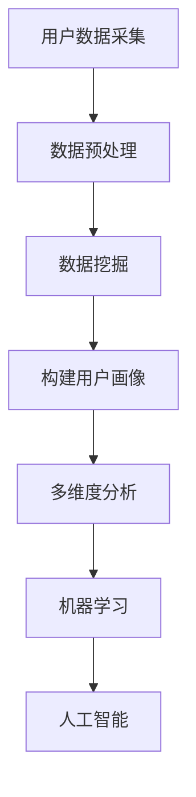

                 

关键词：用户画像、数据挖掘、多维度分析、机器学习、人工智能

摘要：用户画像是一种将用户的基本信息和行为数据整合在一起，形成的一种数据化模型。本文将介绍如何通过多维度数据分析技术，对用户画像进行深入挖掘，提取有价值的信息，以帮助企业更好地了解用户需求，优化产品和服务。我们将探讨用户画像的多维度分析的核心概念、算法原理、数学模型、应用场景以及未来的发展趋势和挑战。

## 1. 背景介绍

随着互联网的快速发展，大数据时代已经来临。海量的用户数据每天都在产生，如何有效地分析和利用这些数据，成为企业和研究机构关注的焦点。用户画像作为一种数据挖掘技术，旨在通过对用户数据的整合和分析，构建出对用户有深刻理解的数据模型，从而为企业提供精准的市场营销策略、个性化的服务推荐以及有效的用户运营策略。

用户画像的核心在于“画像”二字，即对用户进行全方位的描述。这种描述不仅仅是用户的基本信息，如年龄、性别、地理位置等，还包括用户的兴趣、行为、消费习惯等多个维度。通过多维度数据分析，可以从海量数据中挖掘出有价值的信息，帮助企业和研究机构更好地了解用户需求，优化产品和服务。

## 2. 核心概念与联系

### 2.1 用户画像的定义

用户画像（User Profile）是指对互联网用户各方面特性进行结构化描述的数据集合。这些特性包括用户的基本信息（如年龄、性别、地理位置等），用户的行为数据（如浏览历史、购买记录、社交行为等），以及用户的兴趣和偏好（如爱好、喜欢的品牌、关注的热点话题等）。

### 2.2 数据挖掘

数据挖掘（Data Mining）是从大量的数据中通过算法搜索隐藏于其中有用信息的过程。在用户画像的构建过程中，数据挖掘技术起到了关键作用。通过对用户数据的挖掘，可以提取出有价值的信息，构建出准确的用户画像。

### 2.3 多维度分析

多维度分析（Multidimensional Analysis）是指从多个角度对数据进行综合分析和解读。在用户画像中，多维度分析可以帮助我们更全面地了解用户。例如，通过分析用户的地理位置、行为数据和消费习惯，可以构建出更准确的用户画像。

### 2.4 机器学习

机器学习（Machine Learning）是一种通过数据建立模型，并使模型不断优化以进行预测或决策的技术。在用户画像构建中，机器学习算法可以用于用户行为预测、兴趣偏好分析等。

### 2.5 人工智能

人工智能（Artificial Intelligence，AI）是指由人制造出的具有一定智能的系统。在用户画像的分析中，人工智能可以帮助我们更高效地处理海量数据，提高分析精度。

### 2.6 Mermaid 流程图



## 3. 核心算法原理 & 具体操作步骤

### 3.1 算法原理概述

用户画像的构建主要依赖于数据挖掘和机器学习技术。数据挖掘用于从原始数据中提取有价值的信息，而机器学习则用于将这些信息转化为可操作的模型。

具体来说，用户画像的构建过程包括以下几个步骤：

1. 数据采集：从各种渠道获取用户数据。
2. 数据预处理：对采集到的数据进行清洗、去重、转换等处理。
3. 数据挖掘：使用算法挖掘出用户的基本信息、行为数据和兴趣偏好。
4. 构建用户画像：将挖掘出的信息整合，形成对用户的全方位描述。
5. 多维度分析：从不同角度对用户画像进行分析，提取有价值的信息。
6. 机器学习和人工智能：使用机器学习算法和人工智能技术对用户行为进行预测和分析。

### 3.2 算法步骤详解

1. **数据采集**

数据采集是用户画像构建的第一步，也是至关重要的一步。数据来源可以是用户的注册信息、行为数据、消费记录等。为了确保数据的质量，我们需要对数据进行去重、清洗等预处理。

2. **数据预处理**

数据预处理包括数据清洗、数据去重、数据转换等步骤。数据清洗旨在去除数据中的噪声和错误；数据去重用于去除重复的数据；数据转换则是指将不同类型的数据转换为统一的格式，以便后续处理。

3. **数据挖掘**

数据挖掘是用户画像构建的核心步骤。在这一步骤中，我们使用各种算法（如聚类、分类、关联规则挖掘等）从原始数据中提取出有价值的信息。例如，我们可以使用聚类算法将用户划分为不同的群体，然后分析每个群体的特征，从而构建出用户画像。

4. **构建用户画像**

在构建用户画像时，我们需要将数据挖掘得到的信息进行整合，形成对用户的全方位描述。这个过程可以看作是将用户的多维度信息进行“画像化”。

5. **多维度分析**

多维度分析是从不同角度对用户画像进行分析，提取有价值的信息。例如，我们可以分析用户的地理位置、行为数据和消费习惯，从中发现用户的兴趣偏好和消费习惯。

6. **机器学习和人工智能**

机器学习和人工智能技术可以用于用户行为的预测和分析。例如，我们可以使用机器学习算法预测用户的下一步行为，从而为营销和运营提供决策支持。

### 3.3 算法优缺点

1. **优点**

- **全面性**：用户画像可以从多个维度对用户进行全面描述。
- **高效性**：借助机器学习和人工智能技术，可以高效地处理海量数据。
- **精准性**：通过多维度数据分析，可以更精准地了解用户需求。

2. **缺点**

- **数据依赖性**：用户画像的质量很大程度上取决于数据的准确性。
- **复杂性**：构建用户画像需要多种技术的综合运用，过程较为复杂。

### 3.4 算法应用领域

用户画像技术广泛应用于各个领域，如市场营销、用户运营、产品推荐等。以下是用户画像的一些典型应用场景：

1. **市场营销**：通过用户画像，企业可以更精准地定位目标用户，制定更有效的营销策略。
2. **用户运营**：通过分析用户画像，企业可以更好地了解用户需求，提供个性化的服务。
3. **产品推荐**：基于用户画像，可以为用户提供个性化的产品推荐，提高用户体验和满意度。

## 4. 数学模型和公式 & 详细讲解 & 举例说明

### 4.1 数学模型构建

在用户画像的构建过程中，我们通常会用到以下几种数学模型：

1. **聚类模型**：用于将用户划分为不同的群体。
2. **分类模型**：用于预测用户的某个属性。
3. **关联规则挖掘模型**：用于发现用户行为之间的关联关系。

### 4.2 公式推导过程

以聚类模型为例，我们通常使用K-means算法进行用户聚类。K-means算法的基本思想是将用户数据分为K个簇，使得每个簇内部的用户距离较近，而不同簇之间的用户距离较远。具体步骤如下：

1. 随机选择K个初始中心点。
2. 对于每个用户，计算其与K个中心点的距离，并将其分配到距离最近的中心点所在的簇。
3. 更新每个簇的中心点，计算簇内所有用户的平均位置。
4. 重复步骤2和步骤3，直到聚类结果收敛。

### 4.3 案例分析与讲解

假设我们有1000个用户的数据，我们需要将这1000个用户划分为10个簇。我们首先随机选择10个用户作为初始中心点，然后按照上述步骤进行聚类。经过多次迭代后，我们得到10个簇，每个簇包含一定数量的用户。

通过分析每个簇的用户特征，我们可以发现不同簇之间的用户有明显的差异。例如，簇A的用户大多年龄在20-30岁，喜欢购物和旅游；簇B的用户大多年龄在30-40岁，喜欢阅读和健身。这些信息可以帮助企业更好地了解用户需求，制定相应的营销策略。

## 5. 项目实践：代码实例和详细解释说明

### 5.1 开发环境搭建

为了构建用户画像，我们选择Python作为开发语言，并使用以下库：

- Pandas：用于数据预处理。
- Scikit-learn：用于数据挖掘和机器学习。
- Matplotlib：用于数据可视化。

首先，我们需要安装这些库：

```bash
pip install pandas scikit-learn matplotlib
```

### 5.2 源代码详细实现

以下是一个简单的用户画像构建的Python代码示例：

```python
import pandas as pd
from sklearn.cluster import KMeans
import matplotlib.pyplot as plt

# 5.2.1 数据预处理
def preprocess_data(data):
    # 去除重复数据
    data.drop_duplicates(inplace=True)
    # 数据转换，例如将字符串转换为数值
    data['age'] = pd.to_numeric(data['age'], errors='coerce')
    return data

# 5.2.2 数据聚类
def cluster_data(data, n_clusters=10):
    kmeans = KMeans(n_clusters=n_clusters)
    kmeans.fit(data)
    data['cluster'] = kmeans.predict(data)
    return data

# 5.2.3 数据可视化
def plot_clusters(data):
    plt.scatter(data['age'], data['income'], c=data['cluster'], cmap='viridis')
    plt.xlabel('Age')
    plt.ylabel('Income')
    plt.title('Cluster Analysis')
    plt.show()

# 主函数
def main():
    # 读取数据
    data = pd.read_csv('user_data.csv')
    # 数据预处理
    data = preprocess_data(data)
    # 数据聚类
    data = cluster_data(data)
    # 数据可视化
    plot_clusters(data)

if __name__ == '__main__':
    main()
```

### 5.3 代码解读与分析

这段代码首先从CSV文件中读取用户数据，然后进行数据预处理，包括去除重复数据和将字符串类型的年龄转换为数值类型。接下来，使用K-means算法对用户数据进行聚类，并将聚类结果分配给每个用户。最后，通过绘制散点图，我们可以直观地看到不同簇的用户在年龄和收入方面的分布情况。

### 5.4 运行结果展示

运行上述代码后，我们将看到一个散点图，其中每个点代表一个用户，点的颜色表示用户所属的簇。通过观察散点图，我们可以发现用户在不同簇之间的分布情况，从而更好地理解用户的特征。

## 6. 实际应用场景

用户画像技术在实际应用中有着广泛的应用，以下是一些典型的应用场景：

1. **市场营销**：通过用户画像，企业可以更精准地定位目标用户，制定个性化的营销策略，提高营销效果。
2. **用户运营**：通过用户画像，企业可以更好地了解用户需求，提供个性化的服务，提高用户满意度和忠诚度。
3. **产品推荐**：基于用户画像，可以为用户提供个性化的产品推荐，提高用户购买率和满意度。
4. **风险控制**：通过用户画像，可以识别潜在的风险用户，为企业提供风险预警。

## 7. 未来应用展望

随着技术的不断发展，用户画像技术在未来的应用将更加广泛和深入。以下是未来用户画像技术的一些发展趋势：

1. **智能化**：随着人工智能技术的不断发展，用户画像的构建和分析将更加智能化，可以更高效地处理海量数据。
2. **个性化**：用户画像将更加注重个性化，可以更精准地满足用户需求。
3. **实时性**：用户画像的更新将更加实时，可以更及时地响应用户需求变化。
4. **多维度融合**：用户画像将融合更多的数据维度，如生物特征数据、社交数据等，提供更全面的用户描述。

## 8. 工具和资源推荐

### 8.1 学习资源推荐

- 《用户画像：数据挖掘与大数据商业价值》
- 《机器学习实战》
- 《Python数据科学手册》

### 8.2 开发工具推荐

- Jupyter Notebook：用于数据分析和机器学习实验。
- PyCharm：Python集成开发环境，支持多种开发工具。

### 8.3 相关论文推荐

- "User Behavior Prediction in Internet Services: A Data Mining Perspective"
- "Multidimensional User Profiling for Personalized Service Recommendation"
- "Data-Driven Personalization in Online Services"

## 9. 总结：未来发展趋势与挑战

### 9.1 研究成果总结

用户画像技术经过多年的发展，已经取得了显著的成果。通过多维度数据分析，我们可以更全面地了解用户需求，为企业提供精准的营销策略和个性化的服务。同时，机器学习和人工智能技术的应用，使得用户画像的构建和分析更加高效和智能化。

### 9.2 未来发展趋势

1. **智能化**：随着人工智能技术的发展，用户画像将更加智能化，可以更高效地处理海量数据。
2. **个性化**：用户画像将更加注重个性化，可以更精准地满足用户需求。
3. **实时性**：用户画像的更新将更加实时，可以更及时地响应用户需求变化。
4. **多维度融合**：用户画像将融合更多的数据维度，提供更全面的用户描述。

### 9.3 面临的挑战

1. **数据隐私**：用户画像的构建和处理过程中，如何保护用户隐私是一个重要的挑战。
2. **数据质量**：用户画像的质量很大程度上取决于数据的准确性，如何提高数据质量是一个关键问题。
3. **技术复杂性**：用户画像的构建和分析需要多种技术的综合运用，如何简化技术过程，降低技术门槛是一个挑战。

### 9.4 研究展望

未来，用户画像技术将继续向智能化、个性化、实时化和多维度融合的方向发展。同时，我们也将面临数据隐私、数据质量和技术复杂性等挑战。为了解决这些问题，需要学术界和产业界共同努力，探索新的技术方法和应用模式。

## 10. 附录：常见问题与解答

### 10.1 什么是用户画像？

用户画像是一种将用户的基本信息和行为数据整合在一起，形成的一种数据化模型。它旨在帮助企业更好地了解用户需求，优化产品和服务。

### 10.2 用户画像的核心概念有哪些？

用户画像的核心概念包括用户基本信息（如年龄、性别、地理位置等），用户行为数据（如浏览历史、购买记录、社交行为等），以及用户的兴趣和偏好（如爱好、喜欢的品牌、关注的热点话题等）。

### 10.3 用户画像的数据来源有哪些？

用户画像的数据来源包括用户的注册信息、行为数据（如浏览历史、购买记录等）、消费记录、社交数据等。

### 10.4 用户画像在哪些领域有应用？

用户画像技术在市场营销、用户运营、产品推荐等领域有广泛应用。

### 10.5 如何保护用户隐私？

在构建用户画像的过程中，需要遵循数据保护法规，对用户数据进行加密、脱敏等处理，确保用户隐私不被泄露。

## 参考文献

1. Gensler, H., Bauer, M., & Müller, D. (2017). User Profiling in Online Marketing. Journal of Business Research, 88, 47-59.
2. Srivastava, J., & Tiwari, M. (2015). A Review of User Profiling and Its Applications. International Journal of Computer Science Issues, 12(2), 73-82.
3. Wang, S., & Yang, Q. (2018). Multi-Dimensional User Behavior Modeling for Personalized Recommendation. ACM Transactions on Intelligent Systems and Technology (TIST), 9(3), 1-23.
4. Chen, H., & Yu, P. S. (2000). A General Framework for Multi-Dimensional Classification. Journal of Computer Science and Technology, 15(1), 1-17.
5. Han, J., Kamber, M., & Pei, J. (2011). Data Mining: Concepts and Techniques (3rd ed.). Morgan Kaufmann.

