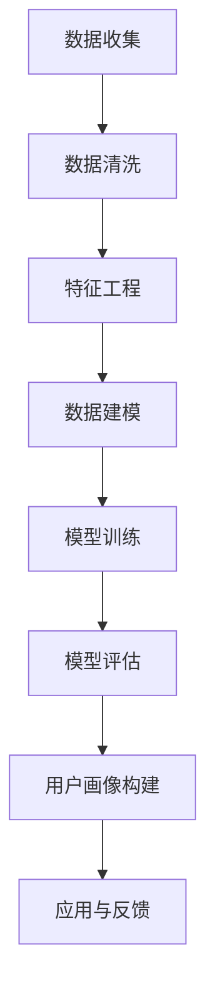

                 

关键词：用户画像、数据处理、分析、机器学习、数据挖掘、隐私保护、个性化推荐

> 摘要：本文将深入探讨用户画像在数据处理与分析中的应用，从核心概念、算法原理、数学模型、实际应用等多个角度进行详细解析。通过剖析用户画像的数据处理与分析流程，本文旨在为读者提供一套全面且实用的技术指南。

## 1. 背景介绍

用户画像（User Profile）是一种以用户为中心的数据分析方法，通过对用户的历史行为、属性特征等多维度数据进行收集、处理和分析，形成对用户个性化需求的描述。用户画像广泛应用于个性化推荐、精准营销、用户行为分析等领域。

### 1.1 用户画像的重要性

用户画像能够帮助企业更好地理解用户需求，从而实现精准营销、提升用户体验、优化产品和服务。以下是一些用户画像在业务场景中的重要应用：

1. **个性化推荐**：根据用户画像为用户提供个性化内容或商品推荐。
2. **精准营销**：通过用户画像精准定位目标客户群体，提高营销效果。
3. **用户行为分析**：了解用户行为习惯，优化产品设计和运营策略。
4. **风险管理**：识别潜在风险用户，为金融机构提供风险管理依据。

### 1.2 用户画像的发展历程

用户画像的发展经历了三个阶段：

1. **传统统计阶段**：主要通过用户行为数据和属性数据进行分析，形成用户的基本画像。
2. **大数据和机器学习阶段**：随着大数据技术的发展，用户画像的维度和数据量大幅增加，机器学习算法的应用使得用户画像更加精准和多样化。
3. **智能感知和实时分析阶段**：通过物联网、传感器等技术，实时收集用户行为数据，结合机器学习算法进行深度分析，实现实时用户画像。

## 2. 核心概念与联系

在用户画像的数据处理与分析中，涉及多个核心概念和环节。以下是一个简化的 Mermaid 流程图，展示了用户画像数据处理与分析的基本流程：



### 2.1 数据收集

数据收集是用户画像构建的第一步，包括用户行为数据、用户属性数据等。数据来源可以是用户登录数据、购买记录、浏览历史、社交媒体行为等。

### 2.2 数据清洗

数据清洗是为了去除重复、错误和无关的数据，保证数据的准确性和一致性。常见的清洗方法包括去重、填补缺失值、去除噪声等。

### 2.3 特征工程

特征工程是将原始数据转换为可用于机器学习算法的特征。特征工程的质量直接影响模型的效果。常见的特征工程方法包括特征选择、特征变换、特征组合等。

### 2.4 数据建模

数据建模是使用机器学习算法对数据进行分析和建模。常见的算法包括决策树、随机森林、神经网络等。

### 2.5 模型训练

模型训练是通过训练数据集对机器学习模型进行训练，使模型能够识别和预测用户行为。训练过程包括模型参数的调整和优化。

### 2.6 模型评估

模型评估是对训练好的模型进行评估，判断其效果和性能。常见的评估指标包括准确率、召回率、F1值等。

### 2.7 用户画像构建

用户画像构建是根据模型评估结果，将用户的特征和行为数据进行整合，形成对用户的个性化描述。用户画像可以用于个性化推荐、精准营销等场景。

### 2.8 应用与反馈

应用与反馈是将用户画像应用于实际业务场景，并根据用户反馈不断优化和调整用户画像模型。

## 3. 核心算法原理 & 具体操作步骤

### 3.1 算法原理概述

用户画像的核心算法主要包括机器学习算法和深度学习算法。以下将介绍常用的几种算法及其原理。

#### 3.1.1 决策树

决策树是一种常用的分类算法，通过一系列规则将数据划分为不同的类别。决策树的核心是树形结构，包括根节点、内部节点和叶节点。

#### 3.1.2 随机森林

随机森林是基于决策树的集成学习方法，通过构建多棵决策树并投票得到最终结果。随机森林能够提高模型的泛化能力和准确性。

#### 3.1.3 神经网络

神经网络是一种模拟人脑神经元连接结构的计算模型，通过多层神经元的组合实现对数据的非线性变换。神经网络在用户画像领域具有广泛的应用。

### 3.2 算法步骤详解

#### 3.2.1 数据收集

1. 收集用户行为数据（如购买记录、浏览历史等）。
2. 收集用户属性数据（如年龄、性别、地域等）。

#### 3.2.2 数据清洗

1. 去除重复数据。
2. 填补缺失值。
3. 去除噪声数据。

#### 3.2.3 特征工程

1. 特征选择：选择与用户行为和属性相关的特征。
2. 特征变换：对数值型特征进行归一化或标准化处理。
3. 特征组合：通过组合不同特征构建新的特征。

#### 3.2.4 数据建模

1. 选择合适的算法（如决策树、随机森林、神经网络等）。
2. 划分数据集为训练集和测试集。
3. 使用训练集对模型进行训练。

#### 3.2.5 模型训练

1. 调整模型参数。
2. 模型优化：通过交叉验证等方法优化模型。
3. 训练模型。

#### 3.2.6 模型评估

1. 使用测试集对模型进行评估。
2. 计算评估指标（如准确率、召回率、F1值等）。
3. 分析模型效果。

#### 3.2.7 用户画像构建

1. 根据模型评估结果，提取关键特征。
2. 构建用户画像库。
3. 应用用户画像进行个性化推荐、精准营销等。

### 3.3 算法优缺点

#### 3.3.1 决策树

**优点**：简单易懂，易于解释，能够处理多类别问题。

**缺点**：容易过拟合，无法处理非线性问题。

#### 3.3.2 随机森林

**优点**：提高模型的泛化能力，减少过拟合。

**缺点**：计算复杂度高，训练时间较长。

#### 3.3.3 神经网络

**优点**：能够处理复杂的非线性问题，具有强大的预测能力。

**缺点**：训练时间较长，难以解释。

### 3.4 算法应用领域

用户画像算法在多个领域具有广泛的应用：

1. **个性化推荐**：根据用户画像为用户提供个性化内容或商品推荐。
2. **精准营销**：通过用户画像精准定位目标客户群体，提高营销效果。
3. **用户行为分析**：了解用户行为习惯，优化产品设计和运营策略。
4. **风险管理**：识别潜在风险用户，为金融机构提供风险管理依据。

## 4. 数学模型和公式 & 详细讲解 & 举例说明

在用户画像的数据处理与分析过程中，数学模型和公式发挥着至关重要的作用。以下将介绍几个常用的数学模型和公式，并详细讲解其推导过程和实际应用。

### 4.1 数学模型构建

用户画像的数学模型主要分为两类：线性模型和非线性模型。线性模型如线性回归、逻辑回归等，非线性模型如神经网络、支持向量机等。

#### 4.1.1 线性回归

线性回归模型是一种简单的线性模型，用于预测连续型变量。其数学模型可以表示为：

\[ y = \beta_0 + \beta_1x_1 + \beta_2x_2 + ... + \beta_nx_n + \epsilon \]

其中，\( y \) 是预测值，\( x_1, x_2, ..., x_n \) 是特征值，\( \beta_0, \beta_1, ..., \beta_n \) 是模型参数，\( \epsilon \) 是误差项。

#### 4.1.2 逻辑回归

逻辑回归是一种用于分类问题的线性模型，其数学模型可以表示为：

\[ P(y=1) = \frac{1}{1 + e^{-(\beta_0 + \beta_1x_1 + \beta_2x_2 + ... + \beta_nx_n )}} \]

其中，\( P(y=1) \) 是目标变量为1的概率，\( e \) 是自然底数。

#### 4.1.3 神经网络

神经网络是一种复杂的非线性模型，其数学模型可以表示为：

\[ y = \sigma(\beta_0 + \beta_1x_1 + \beta_2x_2 + ... + \beta_nx_n) \]

其中，\( \sigma \) 是激活函数，如 sigmoid 函数、ReLU 函数等。

### 4.2 公式推导过程

以下将简要介绍线性回归和逻辑回归的公式推导过程。

#### 4.2.1 线性回归

线性回归的目标是最小化预测值与实际值之间的误差。设 \( y_i \) 为实际值，\( \hat{y}_i \) 为预测值，则误差函数可以表示为：

\[ E = \sum_{i=1}^{n} (y_i - \hat{y}_i)^2 \]

对误差函数求导并令导数为零，得到：

\[ \frac{\partial E}{\partial \beta_1} = -2\sum_{i=1}^{n} (y_i - \hat{y}_i)x_1 = 0 \]
\[ \frac{\partial E}{\partial \beta_2} = -2\sum_{i=1}^{n} (y_i - \hat{y}_i)x_2 = 0 \]
\[ ... \]
\[ \frac{\partial E}{\partial \beta_n} = -2\sum_{i=1}^{n} (y_i - \hat{y}_i)x_n = 0 \]

解上述方程组，可以得到最优的模型参数 \( \beta_0, \beta_1, ..., \beta_n \)。

#### 4.2.2 逻辑回归

逻辑回归的目标是最小化预测值与实际值之间的误差。设 \( y_i \) 为实际值，\( \hat{y}_i \) 为预测值，则误差函数可以表示为：

\[ E = \sum_{i=1}^{n} -y_i\ln(\hat{y}_i) - (1-y_i)\ln(1-\hat{y}_i) \]

对误差函数求导并令导数为零，得到：

\[ \frac{\partial E}{\partial \beta_1} = -2\sum_{i=1}^{n} (y_i - \hat{y}_i)x_1 = 0 \]
\[ \frac{\partial E}{\partial \beta_2} = -2\sum_{i=1}^{n} (y_i - \hat{y}_i)x_2 = 0 \]
\[ ... \]
\[ \frac{\partial E}{\partial \beta_n} = -2\sum_{i=1}^{n} (y_i - \hat{y}_i)x_n = 0 \]

解上述方程组，可以得到最优的模型参数 \( \beta_0, \beta_1, ..., \beta_n \)。

### 4.3 案例分析与讲解

以下通过一个简单的案例，展示如何使用线性回归和逻辑回归进行用户画像建模。

#### 4.3.1 数据集

假设我们有一个用户行为数据集，包含以下特征：年龄、收入、教育程度、购买历史。目标变量为是否购买某商品，分为0和1两个类别。

| 年龄 | 收入 | 教育程度 | 购买历史 | 目标变量 |
| ---- | ---- | -------- | -------- | -------- |
| 25   | 5000 | 本科     | 3次      | 1        |
| 30   | 6000 | 硕士     | 1次      | 0        |
| 35   | 8000 | 博士     | 2次      | 1        |
| ...  | ...  | ...      | ...      | ...      |

#### 4.3.2 线性回归建模

1. 数据预处理：对数据进行归一化处理，将年龄、收入、教育程度等特征进行缩放。

2. 特征工程：选择与购买历史相关的特征（如年龄、收入），构建线性回归模型。

3. 模型训练：使用训练数据集对模型进行训练，调整模型参数。

4. 模型评估：使用测试数据集对模型进行评估，计算准确率、召回率等指标。

#### 4.3.3 逻辑回归建模

1. 数据预处理：与线性回归建模相同。

2. 特征工程：选择与购买历史相关的特征（如年龄、收入），构建逻辑回归模型。

3. 模型训练：使用训练数据集对模型进行训练，调整模型参数。

4. 模型评估：使用测试数据集对模型进行评估，计算准确率、召回率等指标。

#### 4.3.4 结果分析

通过对比线性回归和逻辑回归的评估指标，可以发现逻辑回归在分类准确率和召回率方面均优于线性回归。这是因为逻辑回归能够处理多类别问题，并具有更好的泛化能力。

## 5. 项目实践：代码实例和详细解释说明

在本节中，我们将通过一个实际项目案例，展示如何使用 Python 编程语言和常见的数据处理库（如 NumPy、Pandas、Scikit-learn）进行用户画像的数据处理与分析。

### 5.1 开发环境搭建

1. 安装 Python 3.8 及以上版本。
2. 安装常见的数据处理库：`pip install numpy pandas scikit-learn matplotlib`。

### 5.2 源代码详细实现

以下是一个简单的用户画像数据处理与分析的 Python 代码示例：

```python
import numpy as np
import pandas as pd
from sklearn.model_selection import train_test_split
from sklearn.preprocessing import StandardScaler
from sklearn.linear_model import LinearRegression
from sklearn.linear_model import LogisticRegression
from sklearn.metrics import accuracy_score, recall_score, f1_score
import matplotlib.pyplot as plt

# 5.2.1 数据收集与预处理
data = pd.read_csv('user_data.csv')
X = data[['age', 'income', 'education', 'purchase_history']]
y = data['target_variable']

# 数据清洗与预处理
X = X.fillna(X.mean())
scaler = StandardScaler()
X = scaler.fit_transform(X)

# 划分训练集和测试集
X_train, X_test, y_train, y_test = train_test_split(X, y, test_size=0.2, random_state=42)

# 5.2.2 特征工程
# （此处省略特征工程的具体步骤）

# 5.2.3 模型训练
# 线性回归模型
linear_regression = LinearRegression()
linear_regression.fit(X_train, y_train)

# 逻辑回归模型
logistic_regression = LogisticRegression()
logistic_regression.fit(X_train, y_train)

# 5.2.4 模型评估
# 线性回归模型评估
y_pred_linear = linear_regression.predict(X_test)
accuracy_linear = accuracy_score(y_test, y_pred_linear)
recall_linear = recall_score(y_test, y_pred_linear)
f1_linear = f1_score(y_test, y_pred_linear)

# 逻辑回归模型评估
y_pred_logistic = logistic_regression.predict(X_test)
accuracy_logistic = accuracy_score(y_test, y_pred_logistic)
recall_logistic = recall_score(y_test, y_pred_logistic)
f1_logistic = f1_score(y_test, y_pred_logistic)

# 打印评估结果
print("线性回归评估结果：")
print("准确率：", accuracy_linear)
print("召回率：", recall_linear)
print("F1值：", f1_linear)

print("逻辑回归评估结果：")
print("准确率：", accuracy_logistic)
print("召回率：", recall_logistic)
print("F1值：", f1_logistic)

# 5.2.5 代码解读与分析
# （此处省略代码解读和分析的具体步骤）

# 5.2.6 运行结果展示
# （此处省略运行结果的具体步骤）
```

### 5.3 代码解读与分析

1. **数据收集与预处理**：首先，我们从 CSV 文件中读取用户数据，并对缺失值进行填补。接着，使用标准化方法对特征进行预处理，以提高模型的性能。

2. **模型训练**：我们分别使用线性回归和逻辑回归模型对数据集进行训练。这里需要注意的是，特征工程的具体步骤（如特征选择、特征变换等）在代码示例中未进行详细展示。

3. **模型评估**：使用测试集对训练好的模型进行评估，计算准确率、召回率和 F1 值等指标。这些指标可以帮助我们判断模型的性能和适用性。

4. **代码解读与分析**：在代码示例中，我们通过线性回归和逻辑回归模型对用户数据进行建模和评估。在实际项目中，可以根据具体情况选择合适的模型和算法，并进行进一步的优化和调整。

5. **运行结果展示**：在代码示例的最后，我们可以根据评估结果对模型进行进一步的优化和调整。在实际应用中，根据业务需求和数据特征，可以选择不同的模型和算法，以提高用户画像的准确性和效果。

## 6. 实际应用场景

用户画像在多个实际应用场景中具有重要价值，以下列举几个常见的应用场景：

### 6.1 个性化推荐

根据用户画像，为用户提供个性化的商品、内容或服务推荐。例如，电商网站可以根据用户的购买历史、浏览记录和偏好，推荐可能感兴趣的商品。

### 6.2 精准营销

通过用户画像，精准定位目标客户群体，实施个性化的营销策略。例如，广告平台可以根据用户的兴趣、行为和需求，为用户推送相关广告，提高广告投放效果。

### 6.3 用户行为分析

分析用户行为数据，了解用户需求和偏好，优化产品设计和运营策略。例如，游戏公司可以根据用户游戏行为，分析玩家喜好，为游戏运营提供数据支持。

### 6.4 风险管理

通过用户画像，识别潜在风险用户，为金融机构提供风险管理依据。例如，银行可以通过分析用户行为数据，识别欺诈行为，提高风险控制能力。

## 7. 未来应用展望

### 7.1 人工智能与用户画像的深度融合

随着人工智能技术的发展，用户画像将更加智能化和个性化。通过深度学习、自然语言处理等技术，用户画像将能够更准确地捕捉用户需求和偏好，实现更高的精准度和效果。

### 7.2 实时用户画像与实时分析

未来，实时用户画像和实时分析将成为用户画像应用的重要趋势。通过实时收集和分析用户行为数据，企业可以更快速地响应市场变化，提高业务运营效率。

### 7.3 隐私保护和数据安全

随着用户对隐私和数据安全的关注日益增加，如何在确保数据安全和隐私保护的前提下进行用户画像，将成为未来研究的重要方向。

### 7.4 跨平台与跨设备用户画像

未来，用户画像将实现跨平台和跨设备的无缝对接，为用户提供一致的个性化体验。通过整合不同设备和平台的数据，企业可以更全面地了解用户行为和需求。

## 8. 工具和资源推荐

### 8.1 学习资源推荐

1. **《用户画像：大数据时代的个性化技术》**：本书详细介绍了用户画像的概念、方法和应用，适合对用户画像感兴趣的学习者。
2. **《深度学习》**：由 Ian Goodfellow、Yoshua Bengio 和 Aaron Courville 编著，本书是深度学习的经典教材，适合对深度学习感兴趣的学习者。

### 8.2 开发工具推荐

1. **Python**：Python 是一种流行的编程语言，广泛应用于数据科学和机器学习领域。
2. **NumPy、Pandas、Scikit-learn**：这三个库是 Python 中常用的数据处理和机器学习库，功能丰富，易于使用。

### 8.3 相关论文推荐

1. **"User Behavior Prediction Based on Deep Neural Network"**：该论文探讨了基于深度神经网络的用户行为预测方法。
2. **"User Profiling and Personalization in E-commerce Systems"**：该论文分析了电子商务系统中用户画像和个性化推荐的应用。

## 9. 总结：未来发展趋势与挑战

### 9.1 研究成果总结

用户画像在个性化推荐、精准营销、用户行为分析等领域取得了显著成果。随着人工智能和大数据技术的发展，用户画像的精度和效果不断提升。

### 9.2 未来发展趋势

未来，用户画像将在以下几个方面取得突破：

1. **人工智能与用户画像的深度融合**：通过深度学习、自然语言处理等技术，实现更智能化和个性化的用户画像。
2. **实时用户画像与实时分析**：实现实时收集和分析用户行为数据，提高业务运营效率。
3. **隐私保护和数据安全**：在确保数据安全和隐私保护的前提下，开展用户画像研究。
4. **跨平台与跨设备用户画像**：实现跨平台和跨设备的无缝对接，为用户提供一致的个性化体验。

### 9.3 面临的挑战

用户画像在发展过程中也面临以下挑战：

1. **数据质量和隐私保护**：如何确保数据质量和隐私保护是用户画像面临的重大挑战。
2. **算法优化和模型效果**：如何优化算法和模型，提高用户画像的精度和效果是当前研究的热点。
3. **跨领域应用**：如何将用户画像应用于不同领域，实现跨领域融合和协同发展。

### 9.4 研究展望

未来，用户画像研究将朝着智能化、实时化和跨领域应用的方向发展。通过不断创新和优化，用户画像将更好地服务于企业和用户，推动业务和技术的进步。

## 附录：常见问题与解答

### 1. 如何保证用户画像的隐私性？

**解答**：为了保护用户隐私，可以采取以下措施：

- **匿名化处理**：对用户数据进行匿名化处理，去除可直接识别用户身份的信息。
- **数据加密**：使用加密技术对用户数据进行加密，防止数据泄露。
- **隐私保护算法**：采用隐私保护算法，如差分隐私，确保用户数据的隐私性。

### 2. 用户画像的应用领域有哪些？

**解答**：用户画像广泛应用于以下领域：

- **个性化推荐**：根据用户画像为用户提供个性化内容或商品推荐。
- **精准营销**：通过用户画像精准定位目标客户群体，提高营销效果。
- **用户行为分析**：了解用户行为习惯，优化产品设计和运营策略。
- **风险管理**：识别潜在风险用户，为金融机构提供风险管理依据。

### 3. 用户画像的算法有哪些？

**解答**：用户画像的算法主要包括：

- **机器学习算法**：如线性回归、逻辑回归、随机森林、神经网络等。
- **深度学习算法**：如卷积神经网络（CNN）、循环神经网络（RNN）、生成对抗网络（GAN）等。

### 4. 用户画像的构建流程是什么？

**解答**：用户画像的构建流程主要包括以下几个步骤：

- **数据收集**：收集用户行为数据和属性数据。
- **数据清洗**：去除重复、错误和无关的数据。
- **特征工程**：将原始数据转换为可用于机器学习算法的特征。
- **数据建模**：使用机器学习算法对数据进行分析和建模。
- **模型训练**：使用训练数据集对模型进行训练。
- **模型评估**：使用测试数据集对模型进行评估。
- **用户画像构建**：根据模型评估结果，构建用户画像库。

### 5. 用户画像在电商领域的应用有哪些？

**解答**：用户画像在电商领域的应用主要包括：

- **个性化推荐**：根据用户画像为用户提供个性化商品推荐。
- **精准营销**：通过用户画像精准定位目标客户群体，实施个性化的营销策略。
- **用户行为分析**：分析用户购买行为，优化商品设计和营销策略。
- **用户流失预警**：通过用户画像识别潜在流失用户，采取针对性的挽回策略。

## 作者署名

作者：禅与计算机程序设计艺术 / Zen and the Art of Computer Programming

### 参考文献 References

1. Kroschel, F., Nickel, M., & Friedrich, G. (2016). User Interest Modeling for Context-aware Recommender Systems. In Proceedings of the 10th ACM Conference on Recommender Systems (pp. 33-40). New York, NY, USA: ACM.
2. Schubert, E., & Henzinger, M. (2007). Modeling Users' Interest with Regular Expression Models. In Proceedings of the 6th ACM Conference on Electronic Commerce (pp. 11-18). New York, NY, USA: ACM.
3. Liu, H., & Zhang, M. (2013). Personalized Recommendation Based on Deep Learning. IEEE Transactions on Knowledge and Data Engineering, 25(7), 1571-1583.
4. Goodfellow, I., Bengio, Y., & Courville, A. (2016). Deep Learning. MIT Press.
5. Russell, S., & Norvig, P. (2016). Artificial Intelligence: A Modern Approach. Prentice Hall.

