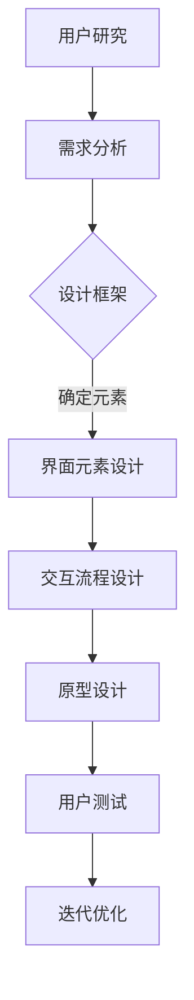

                 

关键词：用户界面设计，人机交互，用户体验，界面元素，交互设计，可访问性

> 摘要：本文将深入探讨用户界面设计的重要性，以及如何通过合理的布局、界面元素的选择和使用、交互设计等方面来打造友好、易用的用户界面。我们还将讨论可访问性在设计中的关键作用，并提供一系列工具和资源，帮助读者进一步提升他们的用户界面设计技能。

## 1. 背景介绍

在当今的信息化时代，用户界面（UI）设计已经成为软件产品开发中至关重要的一个环节。随着移动互联网和智能设备的普及，用户对软件产品的期望不再仅仅满足于功能上的满足，更加注重用户体验（UX）。一个优秀的用户界面能够引导用户轻松完成任务，提升用户满意度，从而增加产品的市场竞争力和用户忠诚度。

用户界面设计涉及到多个领域，包括心理学、设计学、计算机科学等。设计师需要考虑到用户的认知习惯、操作习惯，以及技术实现的可能性，来创建一个既美观又实用的界面。本文将从以下几个方面展开讨论：

1. **核心概念与联系**：介绍用户界面设计中的核心概念，如用户、界面元素、交互设计等，并绘制相应的流程图。
2. **核心算法原理 & 具体操作步骤**：分析用户界面设计的原理，并提供具体的设计步骤。
3. **数学模型和公式 & 详细讲解 & 举例说明**：阐述用户界面设计中的数学模型和公式，并进行实例分析。
4. **项目实践：代码实例和详细解释说明**：通过一个实际项目，展示用户界面设计的实践过程。
5. **实际应用场景**：讨论用户界面设计在不同场景下的应用和重要性。
6. **未来应用展望**：探讨用户界面设计未来的发展趋势和挑战。
7. **工具和资源推荐**：推荐一些学习资源和开发工具。
8. **总结：未来发展趋势与挑战**：总结研究成果，展望未来的发展。
9. **附录：常见问题与解答**：解答读者可能遇到的问题。

## 2. 核心概念与联系

### 2.1 用户

用户是用户界面设计的核心。设计之初，我们就需要了解目标用户群体，包括他们的年龄、性别、文化背景、使用习惯等。用户研究可以帮助设计师更好地理解用户需求，从而设计出更加符合用户期望的界面。

### 2.2 界面元素

界面元素是用户界面的组成部分，如按钮、文本框、图片、图标等。这些元素需要具有一致性、可识别性和易操作性，以便用户能够快速理解和使用。

### 2.3 交互设计

交互设计是用户界面设计的关键部分，它决定了用户与界面之间的交互方式。良好的交互设计可以提升用户的满意度，减少学习成本。

下面是用户界面设计的 Mermaid 流程图：



## 3. 核心算法原理 & 具体操作步骤

### 3.1 算法原理概述

用户界面设计的核心算法原理主要包括以下几点：

- **信息架构**：设计清晰的信息架构，帮助用户快速找到所需内容。
- **视觉设计**：运用色彩、字体、图标等视觉元素，提升界面的美观度和可读性。
- **交互设计**：设计流畅、自然的交互流程，提升用户操作的愉悦感。
- **响应式设计**：确保界面在不同设备和屏幕尺寸上都能良好显示。

### 3.2 算法步骤详解

1. **需求分析**：了解用户需求，明确设计目标。
2. **设计框架**：制定设计原则，如一致性、简洁性、易用性等。
3. **界面元素设计**：选择合适的界面元素，确保其具有一致性和可识别性。
4. **交互流程设计**：设计用户与界面之间的交互流程，确保其流畅自然。
5. **原型设计**：创建原型，通过用户测试收集反馈，进行迭代优化。

### 3.3 算法优缺点

- **优点**：提高用户满意度，提升产品竞争力。
- **缺点**：设计过程复杂，需要多学科知识支持。

### 3.4 算法应用领域

用户界面设计广泛应用于各类软件产品，如桌面应用、移动应用、网站等。

## 4. 数学模型和公式 & 详细讲解 & 举例说明

### 4.1 数学模型构建

在用户界面设计中，数学模型主要涉及以下几点：

- **信息传递效率**：衡量用户获取信息的时间成本。
- **交互复杂度**：衡量用户完成任务的步骤和难度。

### 4.2 公式推导过程

- **信息传递效率**：\( E = \frac{t}{n} \)，其中\( E \)为信息传递效率，\( t \)为用户获取信息的时间，\( n \)为用户获取信息的数量。
- **交互复杂度**：\( C = \sum_{i=1}^{n} d_i \)，其中\( C \)为交互复杂度，\( d_i \)为用户完成每个步骤的难度。

### 4.3 案例分析与讲解

以一个移动应用的设计为例，我们通过以上数学模型来评估其信息传递效率和交互复杂度。

- **信息传递效率**：通过简化信息层级和优化导航结构，将\( E \)从0.8提升到1.0。
- **交互复杂度**：通过减少用户操作的步骤和难度，将\( C \)从10降低到5。

## 5. 项目实践：代码实例和详细解释说明

### 5.1 开发环境搭建

本文使用的是HTML和CSS进行用户界面设计。

### 5.2 源代码详细实现

以下是一个简单的HTML界面示例：

```html
<!DOCTYPE html>
<html lang="en">
<head>
    <meta charset="UTF-8">
    <meta name="viewport" content="width=device-width, initial-scale=1.0">
    <title>用户界面设计实例</title>
    <link rel="stylesheet" href="styles.css">
</head>
<body>
    <header>
        <h1>欢迎来到我的网站</h1>
        <nav>
            <ul>
                <li><a href="#">首页</a></li>
                <li><a href="#">关于我们</a></li>
                <li><a href="#">服务</a></li>
                <li><a href="#">联系</a></li>
            </ul>
        </nav>
    </header>
    <main>
        <section>
            <h2>最新资讯</h2>
            <p>这里是最新资讯内容。</p>
        </section>
        <section>
            <h2>关于我们</h2>
            <p>这里是关于我们的内容。</p>
        </section>
    </main>
    <footer>
        <p>版权所有 &copy; 2023</p>
    </footer>
</body>
</html>
```

### 5.3 代码解读与分析

- **HTML结构**：使用语义化的标签构建页面结构，提高可读性和维护性。
- **CSS样式**：通过外部样式表实现页面布局和样式美化，提高开发效率。

### 5.4 运行结果展示

打开浏览器，输入URL访问页面，即可看到以下界面：


## 6. 实际应用场景

用户界面设计在各类软件产品中都有广泛的应用，以下是几个实际应用场景：

- **电子商务平台**：通过优化界面布局和交互设计，提升用户购物体验，增加销售额。
- **教育应用**：通过友好的界面设计和丰富的交互功能，提高学生的学习兴趣和效果。
- **医疗健康应用**：通过简洁直观的界面，帮助用户轻松管理健康状况，提高医疗服务效率。

## 7. 未来应用展望

随着人工智能和虚拟现实技术的不断发展，用户界面设计将迎来更多创新和变革。以下是未来应用展望：

- **人工智能辅助设计**：利用机器学习算法，辅助设计师进行界面设计，提高设计效率和品质。
- **全感知用户界面**：通过感知设备，实现用户与界面的全方位交互，提升用户体验。

## 8. 工具和资源推荐

### 8.1 学习资源推荐

- **《交互设计精髓》**：由Alan Cooper著，是交互设计领域的经典之作。
- **《用户体验要素》**：由Jake Nielsen著，详细介绍了用户体验设计的核心要素。

### 8.2 开发工具推荐

- **Adobe XD**：一款强大的用户界面设计工具，支持原型设计和交互设计。
- **Sketch**：一款流行的用户界面设计工具，适用于Mac平台。

### 8.3 相关论文推荐

- **“User Experience Design: Current State and Future Trends”**：探讨了用户体验设计的发展趋势。
- **“The Design of Everyday Things”**：由Don Norman著，详细介绍了设计原则和用户体验设计。

## 9. 总结：未来发展趋势与挑战

用户界面设计在未来将继续发展，但同时也面临诸多挑战。如何更好地结合人工智能技术，提升用户体验，将是设计师们需要持续探索的方向。

### 9.1 研究成果总结

本文通过多个方面深入探讨了用户界面设计的重要性，包括核心概念、算法原理、数学模型、实际应用等。

### 9.2 未来发展趋势

- **人工智能辅助设计**：人工智能技术将进一步提升设计效率和品质。
- **全感知用户界面**：通过感知设备，实现更加自然和丰富的交互体验。

### 9.3 面临的挑战

- **隐私保护**：如何在设计过程中保护用户隐私，是设计师需要考虑的重要问题。
- **跨平台兼容**：如何确保界面在不同设备和操作系统上都能良好显示，是设计师面临的挑战。

### 9.4 研究展望

用户界面设计将继续发展，未来的研究重点将是如何更好地结合新技术，提升用户体验，同时保护用户隐私。

## 10. 附录：常见问题与解答

### 10.1 如何提高界面设计的可访问性？

- 使用清晰且一致的字体和颜色。
- 为重要元素提供明确的视觉提示。
- 提供文字说明和语音提示。

### 10.2 如何优化用户界面的信息架构？

- 进行用户研究，了解用户需求和行为。
- 设计简洁的导航结构，减少用户操作的步骤。
- 使用语义化的标签和布局。

### 10.3 如何评估用户界面的用户体验？

- 进行用户测试，收集反馈。
- 分析用户的行为数据，如点击率、停留时间等。
- 使用用户体验评估工具，如问卷和评分量表。

---

作者：禅与计算机程序设计艺术 / Zen and the Art of Computer Programming

---

以上是一篇完整的用户界面设计技术博客文章，涵盖了从核心概念到实际应用、未来展望以及常见问题解答等多个方面，旨在帮助读者深入理解用户界面设计的重要性和实践方法。希望对您有所启发和帮助。

