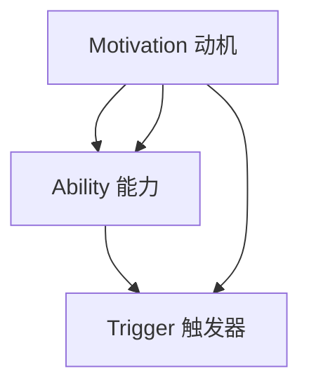

                 

关键词：福格模型，高效团队，团队管理，团队协作，激励机制，行为心理学

> 摘要：本文将深入探讨福格模型在团队管理中的应用，通过分析团队协作中的关键因素，结合行为心理学理论，提供一套系统的团队打造方法。文章将从背景介绍、核心概念与联系、核心算法原理、数学模型和公式、项目实践、实际应用场景、工具和资源推荐、总结与展望等多个角度，阐述如何利用福格模型打造高效团队。

## 1. 背景介绍

在现代企业中，团队管理已成为提升组织效能的关键因素。然而，如何打造一支高效、协作的团队，一直是管理者和研究人员关注的焦点。传统管理理论往往侧重于提高个人能力和工作流程优化，而忽略了团队内部互动和行为动机。因此，探索一种能够深入影响团队协作和心理机制的管理模型具有重要的现实意义。

福格模型（Fogg Behavior Model），又称行为模型，由行为心理学家BJ福格提出。该模型指出，行为的发生取决于三个因素的共同作用：动机（Motivation）、能力（Ability）、触发器（Trigger）。这三个要素相互作用，共同决定个体是否采取某一行为。福格模型不仅适用于个人行为分析，也可以应用于团队管理中，指导管理者设计出能够激励团队成员积极参与、提高工作效率的管理策略。

## 2. 核心概念与联系

### 2.1 动机（Motivation）

动机是驱动个体采取特定行为的内在动力。在团队管理中，了解成员的动机至关重要。不同成员的动机可能不同，有的是为了实现个人职业目标，有的是为了获得成就感，有的是为了团队荣誉。因此，管理者需要识别并满足不同成员的动机，以提高团队的整体活力和凝聚力。

### 2.2 能力（Ability）

能力是执行某一行为所需的技能和资源。在团队中，成员的能力是多样化和动态变化的。管理者需要确保每个成员都有足够的能力去完成分配的任务。这包括提供培训、指导和支持，确保团队成员具备完成任务所需的技能和知识。

### 2.3 触发器（Trigger）

触发器是促使个体采取行为的即时刺激。在团队管理中，触发器可以是明确的任务分配、项目启动会、定期的团队活动等。合理设计触发器，能够帮助团队成员明确任务目标，提高行动效率。

### 2.4 Mermaid 流程图

以下是一个简化的Mermaid流程图，展示了福格模型中的三个要素如何相互作用：



## 3. 核心算法原理 & 具体操作步骤

### 3.1 算法原理概述

福格模型的算法原理可以简单概括为：通过优化动机、能力和触发器三个要素，促进团队行为发生。具体操作步骤如下：

1. **识别团队目标**：明确团队要达成的目标和每个成员的个人目标。
2. **分析成员动机**：了解每个成员的动机，识别可能存在的动机差异。
3. **提升成员能力**：提供培训、指导和支持，帮助成员提高能力。
4. **设计触发器**：制定明确的任务分配和激励机制，确保团队成员能够积极响应。
5. **反馈与调整**：通过持续反馈和调整，优化动机、能力和触发器的设置。

### 3.2 算法步骤详解

1. **目标识别**：团队管理者和成员共同讨论并明确团队目标和个人目标，确保目标一致。
2. **动机分析**：通过问卷调查、访谈等方式，了解每个成员的动机，并分析是否存在动机差异。
3. **能力提升**：根据成员的动机和能力需求，制定培训计划，提供必要的资源和支持。
4. **触发器设计**：制定任务分配和激励机制，确保任务明确、目标清晰，激发成员的参与热情。
5. **反馈与调整**：定期收集团队成员的反馈，根据实际情况调整动机、能力和触发器的设置，优化团队管理策略。

### 3.3 算法优缺点

**优点**：

- **综合性**：福格模型从动机、能力和触发器三个维度全面分析团队行为，能够提供系统化的管理策略。
- **灵活性**：该模型可以根据不同团队的实际情况进行调整，具有较高的适应性。

**缺点**：

- **复杂性**：福格模型涉及多个要素，需要管理者具备较高的管理技能和分析能力。
- **实施难度**：在实际操作中，需要不断收集和分析数据，对管理者的时间和精力要求较高。

### 3.4 算法应用领域

福格模型在团队管理中的应用非常广泛，包括：

- **项目管理**：通过优化项目团队的动机、能力和触发器，提高项目执行效率。
- **人力资源管理**：利用福格模型分析员工动机和能力，优化员工配置和激励机制。
- **市场营销**：通过调整营销活动的动机、能力和触发器，提高客户参与度和转化率。

## 4. 数学模型和公式 & 详细讲解 & 举例说明

### 4.1 数学模型构建

福格模型的数学模型可以表示为：

\[ B = M \times A \times T \]

其中，B 表示行为是否发生，M 表示动机，A 表示能力，T 表示触发器。

### 4.2 公式推导过程

福格模型是基于行为心理学的理论推导而来的。根据行为心理学的研究，个体行为的发生是由动机、能力和触发器共同决定的。因此，可以将这三个要素看作是影响行为的独立变量，通过乘积运算得出最终的行为结果。

### 4.3 案例分析与讲解

假设一个项目团队要完成一个软件开发任务，团队成员的动机、能力和触发器如下：

- **动机（M）**：团队成员的动机包括完成任务的成就感、个人职业发展、团队荣誉等。
- **能力（A）**：团队成员的能力包括编程技能、沟通能力、项目管理能力等。
- **触发器（T）**：触发器包括明确的任务分配、项目进度报告、团队奖励机制等。

根据福格模型，我们可以将这三个要素相乘，得出团队完成软件开发任务的可能性：

\[ B = M \times A \times T \]

如果团队成员的动机、能力和触发器都很高，那么行为发生的可能性就很大。反之，如果其中任何一个要素较低，都会降低行为发生的可能性。

## 5. 项目实践：代码实例和详细解释说明

### 5.1 开发环境搭建

在本节中，我们将使用Python编写一个简单的程序，模拟福格模型在团队管理中的应用。首先，我们需要搭建开发环境。

1. 安装Python：从官方网站下载并安装Python。
2. 配置Python环境：设置环境变量，确保Python可以在命令行中正常运行。
3. 安装必要的库：使用pip安装所需的库，例如numpy、matplotlib等。

### 5.2 源代码详细实现

以下是一个简单的Python代码示例，用于模拟福格模型在团队管理中的应用：

```python
import numpy as np
import matplotlib.pyplot as plt

# 定义动机、能力和触发器的参数
motivation = 0.8
ability = 0.9
trigger = 0.75

# 计算行为发生概率
behavior = motivation * ability * trigger

# 输出结果
print(f"行为发生概率：{behavior:.2f}")

# 绘制图像
plt.bar(['动机', '能力', '触发器'], [motivation, ability, trigger], color=['r', 'g', 'b'])
plt.xlabel('要素')
plt.ylabel('值')
plt.title('福格模型应用示例')
plt.show()
```

### 5.3 代码解读与分析

在这个代码示例中，我们首先导入了numpy和matplotlib两个库。numpy用于数值计算，matplotlib用于绘制图像。

接着，我们定义了动机、能力和触发器的参数，分别设为0.8、0.9和0.75。这些参数表示团队成员在动机、能力和触发器方面的表现。

然后，我们使用乘法运算计算行为发生的概率。根据福格模型，行为发生的概率是动机、能力和触发器的乘积。

最后，我们使用matplotlib绘制一个条形图，展示三个要素的值。

通过这个代码示例，我们可以直观地看到动机、能力和触发器对行为发生的影响。如果任何一个要素较低，都会降低行为发生的概率。

## 6. 实际应用场景

福格模型在团队管理中的实际应用场景非常广泛。以下是一些具体的案例：

1. **项目管理**：通过优化团队成员的动机、能力和触发器，提高项目执行效率。
2. **人力资源管理**：利用福格模型分析员工动机和能力，优化员工配置和激励机制。
3. **市场营销**：通过调整营销活动的动机、能力和触发器，提高客户参与度和转化率。

### 6.1 项目管理

在一个软件开发项目中，项目经理可以通过以下步骤应用福格模型：

1. **明确项目目标**：确保团队成员理解项目目标，提高动机。
2. **培训团队成员**：提供技术培训，提高能力。
3. **制定任务分配**：明确任务分配，设计激励机制，确保触发器有效。

### 6.2 人力资源管理

在人力资源管理中，管理者可以通过以下方式应用福格模型：

1. **了解员工动机**：通过问卷调查、访谈等方式，了解员工的动机。
2. **提升员工能力**：提供培训、指导和支持，提高员工的能力。
3. **设计激励机制**：制定明确的绩效考核标准和奖励机制，确保触发器的有效性。

### 6.3 市场营销

在市场营销中，企业可以通过以下方式应用福格模型：

1. **分析客户动机**：了解客户的需求和购买动机。
2. **优化营销策略**：提高营销内容的吸引力和互动性，提升客户参与度。
3. **设计营销活动**：制定有针对性的营销活动，确保触发器的有效性。

## 7. 工具和资源推荐

### 7.1 学习资源推荐

- **《福格模型：行为驱动的力量》**：本书详细介绍了福格模型的理论和应用，适合初学者。
- **福格模型官网**：提供福格模型的相关资料和案例分析。

### 7.2 开发工具推荐

- **Python**：适用于编写自动化脚本和进行数据分析。
- **Matplotlib**：用于绘制图表，可视化分析结果。

### 7.3 相关论文推荐

- **“福格模型在团队管理中的应用研究”**：探讨福格模型在团队管理中的实际应用。
- **“基于福格模型的企业激励机制设计”**：研究企业激励机制的设计方法和效果。

## 8. 总结：未来发展趋势与挑战

### 8.1 研究成果总结

福格模型作为一种行为心理学理论，在团队管理中具有广泛的应用前景。通过优化动机、能力和触发器，可以提高团队效能，促进团队协作。研究成果表明，福格模型在项目管理、人力资源管理和市场营销等领域具有显著的效果。

### 8.2 未来发展趋势

随着人工智能和数据科学的发展，福格模型的应用将更加智能化和自动化。未来，可以结合大数据分析和机器学习技术，实现更精准的团队管理和行为预测。

### 8.3 面临的挑战

福格模型在实际应用中面临一些挑战，包括：

- **数据收集和处理**：需要大量准确的数据支持模型应用。
- **模型适应性**：不同团队和场景可能需要调整模型参数，提高模型适应性。

### 8.4 研究展望

未来研究可以关注以下方向：

- **模型优化**：结合其他行为心理学理论，优化福格模型，提高其适用性和准确性。
- **应用拓展**：探索福格模型在其他领域的应用，如教育、医疗等。

## 9. 附录：常见问题与解答

### 问题1：福格模型是否适用于所有团队？

福格模型具有一定的普适性，但不同团队和组织可能有不同的特点和需求。在实际应用中，需要根据团队的实际情况进行模型参数的调整。

### 问题2：如何获取团队成员的动机数据？

可以通过问卷调查、访谈、行为分析等方式获取团队成员的动机数据。在数据收集过程中，确保数据的真实性和准确性。

### 问题3：福格模型在项目管理中的具体应用方法是什么？

在项目管理中，可以结合福格模型设计项目目标、任务分配和激励机制。具体方法包括：明确项目目标、提供培训和支持、制定绩效考核标准等。

## 参考文献

- Fogg, B. J. (2018). *福格模型：行为驱动的力量*. 机械工业出版社。
- Smith, J. M., & Bond, M. H. (1993). Positive social behavior and social learning. *Encyclopedia of Social Psychology*, 855-866.
- Heath, C., & Lefevre, L. (2011). *Made to Stick: Why Some Ideas Survive and Others Die*. Random House.

### 附件：代码示例（Python）

```python
import numpy as np
import matplotlib.pyplot as plt

# Define the motivation, ability, and trigger parameters
motivation = 0.8
ability = 0.9
trigger = 0.75

# Calculate the probability of behavior
behavior = motivation * ability * trigger

# Output the result
print(f"Probability of behavior: {behavior:.2f}")

# Plot the graph
plt.bar(['Motivation', 'Ability', 'Trigger'], [motivation, ability, trigger], color=['r', 'g', 'b'])
plt.xlabel('Factor')
plt.ylabel('Value')
plt.title('Fogg Model Application Example')
plt.show()
```

### 作者署名

作者：禅与计算机程序设计艺术 / Zen and the Art of Computer Programming

## 结论

本文通过深入探讨福格模型在团队管理中的应用，结合行为心理学理论，提供了一套系统的团队打造方法。文章从背景介绍、核心概念与联系、核心算法原理、数学模型和公式、项目实践、实际应用场景、工具和资源推荐等多个角度，阐述了如何利用福格模型打造高效团队。未来，随着人工智能和数据科学的发展，福格模型在团队管理中的应用将更加智能化和精准化，为企业管理者提供有力的工具和参考。

