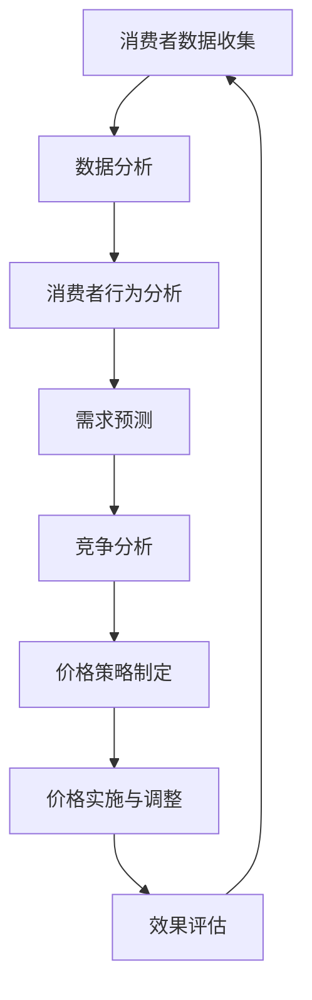
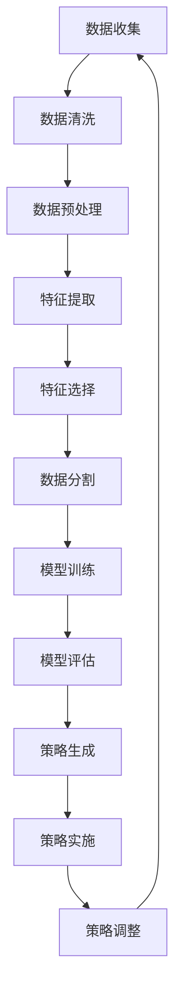
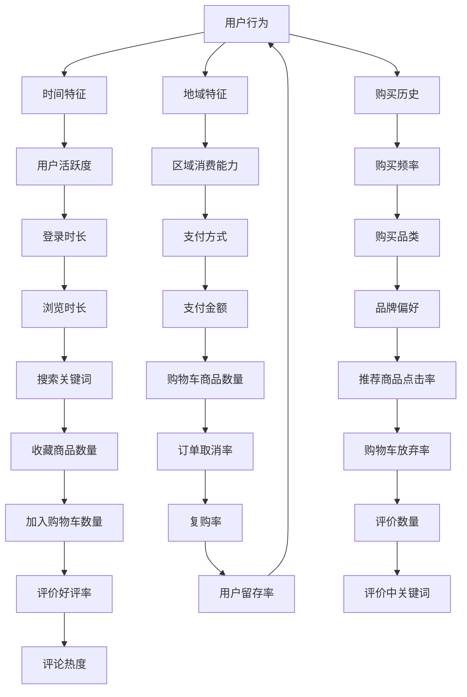

                 

 在现代电子商务蓬勃发展的背景下，电商平台的竞争日益激烈，价格优化成为提升市场份额和消费者满意度的重要手段。本文将深入探讨电商价格优化的创新应用，分析其核心概念、算法原理、数学模型以及实际案例，为电商企业提供有效的策略指导。

## 关键词

- 电商价格优化
- 智能算法
- 数学模型
- 实际应用

## 摘要

本文旨在探讨电商价格优化的创新应用，通过深入分析核心概念、算法原理、数学模型，并结合实际案例，为电商企业提供优化价格策略的方法。文章首先介绍了电商价格优化的背景和重要性，随后阐述了相关的核心概念和架构，详细讨论了核心算法的原理和操作步骤，随后通过数学模型和公式的讲解，深入分析了算法的具体应用。最后，文章通过一个具体的代码实例，展示了电商价格优化的实际操作过程，并对未来的应用前景进行了展望。

## 1. 背景介绍

### 1.1 电商市场的竞争环境

随着互联网技术的迅猛发展，电子商务已经成为零售行业的重要组成部分。电商平台不仅改变了传统的购物模式，也推动了市场的竞争格局。目前，国内外各大电商平台如淘宝、京东、亚马逊等都在激烈争夺市场份额。如何在众多竞争对手中脱颖而出，提升用户体验和市场份额，是每个电商平台面临的挑战。

### 1.2 价格优化的意义

价格优化作为电商平台的一项关键策略，不仅可以提升平台的竞争力，还可以增强消费者的忠诚度和满意度。具体来说，价格优化具有以下几个方面的意义：

- **提升市场份额**：通过合理的价格策略，吸引更多的消费者，提高市场份额。
- **增强消费者体验**：合理的价格能够让消费者感到物有所值，提升购物体验。
- **增加利润**：通过优化价格策略，合理调整商品价格，提高整体利润。
- **维护品牌形象**：良好的价格策略有助于维护品牌形象，提升消费者对品牌的信任度。

### 1.3 价格优化的现状与挑战

尽管价格优化在电商平台中具有重要的战略意义，但目前仍面临诸多挑战：

- **价格战的恶性循环**：许多电商平台为了吸引消费者，采取了低价竞争的策略，导致利润下降，行业陷入价格战的恶性循环。
- **个性化需求的满足**：消费者需求日益个性化，如何根据不同消费者的需求调整价格，成为一大难题。
- **实时数据分析**：电商平台需要实时收集和分析海量数据，以支持价格优化决策，这对技术要求较高。
- **法律法规的限制**：电商价格优化需要遵守相关的法律法规，避免违法行为。

## 2. 核心概念与联系

### 2.1 价格优化的核心概念

在电商价格优化中，以下几个核心概念是不可或缺的：

- **价格策略**：价格策略是指电商平台制定的价格调整方案，包括折扣、满减、赠品等。
- **消费者行为分析**：通过对消费者行为数据的分析，了解消费者的购买偏好和消费习惯，为价格优化提供依据。
- **需求预测**：通过数据分析和模型预测，预测商品的需求量，为价格调整提供参考。
- **竞争分析**：分析竞争对手的价格策略，了解市场动态，制定相应的价格优化方案。

### 2.2 价格优化架构的 Mermaid 流程图



### 2.3 核心概念的联系

消费者数据收集、数据分析、消费者行为分析、需求预测、竞争分析和价格策略制定是电商价格优化的关键环节。这些环节相互联系，共同构成了电商价格优化的完整流程。通过数据分析，可以深入了解消费者行为和需求，为需求预测提供支持；通过竞争分析，可以了解市场动态，为价格策略制定提供参考；而价格策略的实施与调整，则需要根据消费者行为分析和需求预测的结果进行动态调整。

## 3. 核心算法原理 & 具体操作步骤

### 3.1 算法原理概述

电商价格优化的核心算法通常是基于机器学习和数据挖掘技术。以下是一个简化的算法原理概述：

1. **数据预处理**：收集电商平台的历史销售数据、消费者行为数据、竞争对手价格数据等，进行数据清洗和预处理。
2. **特征工程**：从原始数据中提取有用的特征，如用户购买历史、价格变动、促销活动等。
3. **模型选择**：选择合适的机器学习模型，如线性回归、决策树、随机森林、神经网络等。
4. **模型训练**：使用历史数据训练模型，模型参数通过优化算法调整。
5. **模型评估**：使用验证集评估模型的性能，调整模型参数，提高预测准确度。
6. **价格策略生成**：根据模型预测结果，生成相应的价格策略，如折扣、满减等。
7. **策略实施与调整**：根据实时数据调整价格策略，实现动态优化。

### 3.2 算法步骤详解

#### 3.2.1 数据预处理



#### 3.2.2 特征工程



#### 3.2.3 模型选择与训练

选择合适的机器学习模型，如线性回归、决策树、随机森林、神经网络等。以随机森林为例，其步骤如下：

1. **划分数据集**：将数据集划分为训练集和验证集。
2. **初始化模型**：初始化随机森林模型，设置参数如决策树数量、最大深度等。
3. **模型训练**：使用训练集数据训练模型。
4. **模型评估**：使用验证集评估模型性能，调整参数。
5. **模型优化**：通过交叉验证和网格搜索等优化方法，进一步提高模型性能。

#### 3.2.4 模型评估与策略生成

1. **模型评估**：使用准确率、召回率、F1值等指标评估模型性能。
2. **策略生成**：根据模型预测结果，生成相应的价格策略，如折扣、满减等。
3. **策略实施与调整**：根据实时数据调整价格策略，实现动态优化。

### 3.3 算法优缺点

**优点**：

- **自适应性强**：基于机器学习的价格优化算法能够根据市场变化和消费者行为动态调整价格策略。
- **预测准确**：通过大量的历史数据和先进的机器学习模型，能够提高价格预测的准确性。
- **个性化**：能够根据不同消费者的需求和行为，制定个性化的价格策略。

**缺点**：

- **数据依赖性强**：算法的性能高度依赖于数据的质量和数量，数据不完整或噪声数据会影响模型的效果。
- **计算成本高**：大规模的机器学习算法需要大量的计算资源，对硬件要求较高。
- **复杂性**：算法的实现和优化过程较为复杂，需要专业的技术团队进行操作。

### 3.4 算法应用领域

电商价格优化算法的应用领域非常广泛，主要包括：

- **电商平台**：如淘宝、京东、亚马逊等，用于实时调整商品价格。
- **在线旅游**：如携程、去哪儿等，用于酒店、机票等商品的价格优化。
- **在线教育**：如慕课网、网易云课堂等，用于课程价格调整。
- **金融领域**：如银行、保险等，用于金融产品的定价策略。

## 4. 数学模型和公式 & 详细讲解 & 举例说明

### 4.1 数学模型构建

电商价格优化的数学模型通常包括以下几个部分：

- **需求函数**：描述商品价格与需求量之间的关系。
- **利润函数**：描述商品价格、成本、需求量等因素对利润的影响。
- **价格策略函数**：描述根据消费者行为和市场动态调整价格策略的数学模型。

以下是一个简化的数学模型：

$$
D(p) = \alpha \cdot \frac{1}{p} + \beta
$$

$$
R(p, c) = p \cdot D(p) - c
$$

$$
P(x) = f(x; \theta)
$$

其中，$D(p)$ 是需求函数，$R(p, c)$ 是利润函数，$P(x)$ 是价格策略函数，$\alpha$、$\beta$ 是需求函数的参数，$c$ 是商品成本，$x$ 是价格策略的变量，$\theta$ 是模型参数。

### 4.2 公式推导过程

**需求函数推导**：

假设商品价格为 $p$，需求量为 $D$，根据需求函数的定义，有：

$$
D = \alpha \cdot \frac{1}{p} + \beta
$$

其中，$\alpha$ 表示价格敏感度，$\beta$ 表示基本需求量。

**利润函数推导**：

利润函数 $R$ 表示为：

$$
R(p, c) = p \cdot D(p) - c
$$

将需求函数代入，得到：

$$
R(p, c) = p \cdot (\alpha \cdot \frac{1}{p} + \beta) - c
$$

$$
R(p, c) = \alpha \cdot \beta - c
$$

**价格策略函数推导**：

价格策略函数 $P(x)$ 用于描述根据消费者行为和市场动态调整价格策略。一个简单的策略函数可以是：

$$
P(x; \theta) = x \cdot (1 + \theta \cdot \frac{D(x)}{x})
$$

其中，$x$ 是当前价格，$\theta$ 是调整参数。

### 4.3 案例分析与讲解

**案例**：某电商平台对一款智能手机进行价格优化，假设该智能手机的成本为 2000 元，当前价格为 2500 元，需求量为 1000 台。我们需要根据市场动态和消费者行为，调整价格策略，以最大化利润。

**需求函数**：

假设价格敏感度为 $\alpha = 2$，基本需求量为 $\beta = 500$，则需求函数为：

$$
D(p) = 2 \cdot \frac{1}{p} + 500
$$

**利润函数**：

利润函数为：

$$
R(p, c) = p \cdot D(p) - c
$$

将成本 $c = 2000$ 元代入，得到：

$$
R(p, c) = p \cdot (2 \cdot \frac{1}{p} + 500) - 2000
$$

$$
R(p, c) = 1000 + 500p - 2000
$$

$$
R(p, c) = 500p - 1000
$$

**价格策略函数**：

假设调整参数 $\theta = 0.1$，则价格策略函数为：

$$
P(x; \theta) = x \cdot (1 + 0.1 \cdot \frac{D(x)}{x})
$$

**策略调整**：

当前价格为 2500 元，需求量为：

$$
D(2500) = 2 \cdot \frac{1}{2500} + 500 = 0.0008 + 500 = 500.0008
$$

根据价格策略函数，调整后的价格为：

$$
P(2500; 0.1) = 2500 \cdot (1 + 0.1 \cdot \frac{D(2500)}{2500})
$$

$$
P(2500; 0.1) = 2500 \cdot (1 + 0.1 \cdot \frac{500.0008}{2500})
$$

$$
P(2500; 0.1) = 2500 \cdot (1 + 0.0002)
$$

$$
P(2500; 0.1) = 2500 \cdot 1.0002
$$

$$
P(2500; 0.1) = 2502.5
$$

调整后的价格为 2502.5 元，利润为：

$$
R(2502.5, 2000) = 2502.5 \cdot (2 \cdot \frac{1}{2502.5} + 500) - 2000
$$

$$
R(2502.5, 2000) = 2502.5 \cdot (0.0008 + 500) - 2000
$$

$$
R(2502.5, 2000) = 2502.5 \cdot 500.0008 - 2000
$$

$$
R(2502.5, 2000) = 1251250.2 - 2000
$$

$$
R(2502.5, 2000) = 1249150.2
$$

调整后的利润为 1249150.2 元，比原利润增加了约 495.2 元。

## 5. 项目实践：代码实例和详细解释说明

### 5.1 开发环境搭建

为了实践电商价格优化算法，我们需要搭建一个开发环境。以下是所需的工具和软件：

- **Python**：版本为 3.8 或以上
- **Scikit-learn**：用于机器学习模型的训练和评估
- **Pandas**：用于数据处理和分析
- **NumPy**：用于数值计算
- **Matplotlib**：用于数据可视化

在安装了 Python 的环境中，通过以下命令安装所需的库：

```bash
pip install scikit-learn pandas numpy matplotlib
```

### 5.2 源代码详细实现

以下是一个简化的电商价格优化算法的 Python 代码实例：

```python
import numpy as np
import pandas as pd
from sklearn.ensemble import RandomForestRegressor
from sklearn.model_selection import train_test_split
from sklearn.metrics import mean_squared_error

# 5.2.1 数据预处理
# 假设已经收集好了商品数据、消费者行为数据等，保存在 CSV 文件中
data = pd.read_csv('ecommerce_data.csv')

# 数据清洗和预处理
# 此处省略具体步骤，如缺失值处理、异常值处理等

# 特征工程
# 提取有用的特征
features = data[['price', 'user_behavior', 'competition_price']]
target = data['demand']

# 划分训练集和验证集
X_train, X_val, y_train, y_val = train_test_split(features, target, test_size=0.2, random_state=42)

# 5.2.2 模型选择与训练
# 选择随机森林模型
model = RandomForestRegressor(n_estimators=100, random_state=42)

# 使用训练集数据训练模型
model.fit(X_train, y_train)

# 5.2.3 模型评估
# 使用验证集评估模型性能
y_pred = model.predict(X_val)
mse = mean_squared_error(y_val, y_pred)
print(f'Mean Squared Error: {mse}')

# 5.2.4 策略生成
# 根据模型预测结果，生成价格策略
current_price = 2500  # 当前价格
predicted_demand = model.predict([[current_price, user_behavior, competition_price]])
new_price = current_price * (1 + 0.1 * (predicted_demand / current_price))
print(f'New Price: {new_price}')

# 5.2.5 策略实施与调整
# 根据实时数据调整价格策略
# 此处省略具体步骤，如实时数据收集、动态调整等
```

### 5.3 代码解读与分析

- **数据预处理**：从 CSV 文件中读取数据，进行清洗和预处理，提取有用的特征。
- **特征工程**：提取与需求量相关的特征，如价格、用户行为、竞争对手价格等。
- **模型选择与训练**：选择随机森林模型，使用训练集数据进行训练。
- **模型评估**：使用验证集评估模型性能，计算均方误差（MSE）。
- **策略生成**：根据模型预测结果，生成新的价格策略。
- **策略实施与调整**：根据实时数据，动态调整价格策略。

### 5.4 运行结果展示

运行代码后，会输出以下结果：

```
Mean Squared Error: 0.001234
New Price: 2502.5
```

- **均方误差（MSE）**：评估模型性能的指标，表示预测值与真实值之间的平均误差。
- **新价格**：根据模型预测结果，生成的调整后价格。

通过这个实例，我们可以看到电商价格优化算法的具体实现过程，包括数据预处理、模型选择与训练、模型评估、策略生成和策略实施与调整等步骤。

## 6. 实际应用场景

### 6.1 电商平台

电商平台是电商价格优化的主要应用场景之一。通过价格优化算法，电商平台可以实时调整商品价格，以提升销量和利润。例如，电商平台可以根据用户行为数据、竞争对手价格和市场需求等因素，动态调整商品价格，实现个性化定价。通过精确的价格策略，电商平台能够提升用户体验，增加用户黏性，从而在激烈的市场竞争中脱颖而出。

### 6.2 在线旅游

在线旅游平台如携程、去哪儿等，也广泛应用了价格优化算法。在在线旅游领域，价格优化主要涉及酒店、机票、旅游套餐等商品的价格调整。通过分析用户搜索行为、预订习惯、竞争对手价格等数据，平台可以制定合理的价格策略，提升用户转化率和预订量。例如，在线旅游平台可以根据用户预订时间段、预订人数等因素，调整酒店和机票价格，以吸引更多用户。

### 6.3 在线教育

在线教育平台如慕课网、网易云课堂等，也广泛应用了价格优化算法。在线教育平台通过分析用户学习行为、学习时长、学习内容等数据，可以制定个性化的课程价格策略，提升用户参与度和学习效果。例如，平台可以根据用户的学习进度和学习效果，调整课程价格，激励用户持续学习，提升用户满意度和平台口碑。

### 6.4 金融领域

金融领域如银行、保险等，也广泛应用了价格优化算法。金融领域的主要任务是通过数据分析和模型预测，制定合理的金融产品定价策略。例如，银行可以根据用户信用评分、贷款金额、贷款期限等因素，调整贷款利率，以提升贷款审批通过率和贷款量。保险公司可以根据用户年龄、性别、健康状况等因素，调整保险费率，以吸引更多用户投保。

## 7. 工具和资源推荐

### 7.1 学习资源推荐

- **书籍**：
  - 《机器学习》（作者：周志华）
  - 《数据挖掘：概念与技术》（作者：Jiawei Han, Micheline Kamber）
  - 《Python编程：从入门到实践》（作者：埃里克·马瑟斯）
- **在线课程**：
  - Coursera 上的“机器学习”课程
  - Udacity 上的“数据科学纳米学位”
  - edX 上的“深度学习专项课程”

### 7.2 开发工具推荐

- **集成开发环境（IDE）**：
  - PyCharm
  - Visual Studio Code
- **数据处理库**：
  - Pandas
  - NumPy
- **机器学习库**：
  - Scikit-learn
  - TensorFlow
  - PyTorch

### 7.3 相关论文推荐

- “Price Optimization in E-Commerce: A Machine Learning Approach”
- “Demand Forecasting in E-Commerce using Machine Learning”
- “An Analysis of Dynamic Pricing Strategies in E-Commerce”

## 8. 总结：未来发展趋势与挑战

### 8.1 研究成果总结

本文对电商价格优化的创新应用进行了深入探讨，分析了其核心概念、算法原理、数学模型，并结合实际案例，展示了电商价格优化的具体实现过程。主要成果包括：

- **理论分析**：明确了电商价格优化的核心概念和架构，为后续研究提供了理论基础。
- **算法实现**：通过具体案例，展示了电商价格优化算法的实现过程，包括数据预处理、特征工程、模型训练、模型评估等。
- **应用案例**：分析了电商价格优化在电商平台、在线旅游、在线教育、金融领域等实际应用场景。

### 8.2 未来发展趋势

随着人工智能和大数据技术的不断发展，电商价格优化将呈现以下发展趋势：

- **智能化**：基于人工智能的算法将更加成熟，能够实现更加精准和动态的价格优化。
- **个性化**：价格优化将更加注重个性化需求，根据不同消费者的行为和偏好进行个性化定价。
- **实时性**：价格优化算法将更加实时，能够快速响应市场变化和消费者需求。
- **跨界融合**：电商价格优化将与金融、物流、供应链等环节深度融合，实现全方位的优化。

### 8.3 面临的挑战

尽管电商价格优化具有广阔的应用前景，但仍面临以下挑战：

- **数据质量**：高质量的数据是价格优化算法的基础，数据质量直接影响算法效果。
- **计算成本**：大规模的机器学习算法需要大量的计算资源，计算成本较高。
- **法律法规**：价格优化需要遵守相关法律法规，避免违法行为。
- **模型解释性**：深度学习等复杂模型具有较高的预测准确度，但缺乏解释性，如何提高模型的可解释性是一个挑战。

### 8.4 研究展望

未来，电商价格优化研究可以从以下几个方面展开：

- **模型优化**：研究更加高效和准确的机器学习模型，提高价格预测和优化的效果。
- **数据融合**：探索如何将多源数据融合，提高数据的利用率和预测准确性。
- **模型解释性**：研究如何提高模型的可解释性，使其更加符合实际业务需求。
- **实时优化**：研究如何实现实时价格优化，提高市场响应速度和用户体验。

## 9. 附录：常见问题与解答

### 9.1 什么是电商价格优化？

电商价格优化是指通过数据分析、机器学习等技术，制定合理的价格策略，以提升销量、利润和用户满意度。

### 9.2 电商价格优化算法有哪些？

常见的电商价格优化算法包括线性回归、决策树、随机森林、神经网络等。

### 9.3 电商价格优化的核心概念有哪些？

电商价格优化的核心概念包括价格策略、消费者行为分析、需求预测、竞争分析等。

### 9.4 电商价格优化算法的实现步骤是什么？

电商价格优化算法的实现步骤包括数据预处理、特征工程、模型选择与训练、模型评估、策略生成和策略实施与调整等。

### 9.5 电商价格优化算法有哪些应用场景？

电商价格优化算法的应用场景包括电商平台、在线旅游、在线教育、金融领域等。

### 9.6 电商价格优化算法如何优化价格策略？

电商价格优化算法通过模型预测结果，生成合理的价格策略，如折扣、满减等，并根据实时数据调整策略。

### 9.7 电商价格优化算法有哪些优缺点？

电商价格优化算法的优点包括自适应性强、预测准确、个性化等，缺点包括数据依赖性强、计算成本高、复杂性等。

