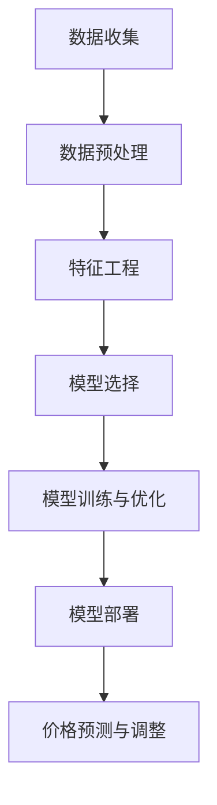

                 

关键词：电商、价格优化、人工智能、机器学习、算法、数据驱动、市场策略

> 摘要：本文将深入探讨电商价格优化中的智能技术，从背景介绍、核心概念、算法原理、数学模型、项目实践以及未来展望等多个维度，详细阐述如何运用人工智能技术实现电商价格的有效优化，提升企业的市场竞争力。

## 1. 背景介绍

在互联网经济时代，电商平台已经成为消费者购物的主要渠道之一。价格作为消费者决策的重要因素，直接影响到电商平台的市场份额和用户黏性。传统的价格优化方法往往依赖于简单的统计分析和价格折扣策略，难以在复杂的市场环境中实现精准的价格决策。随着人工智能和大数据技术的快速发展，基于数据驱动的价格优化方法逐渐成为电商价格策略的新方向。

近年来，机器学习算法在图像识别、自然语言处理、推荐系统等领域取得了显著的成果。这些算法的引入为电商价格优化提供了新的可能。通过分析大量的市场数据，机器学习算法可以识别出价格与销量之间的复杂关系，预测市场需求，制定个性化的价格策略，从而实现价格优化的目标。

## 2. 核心概念与联系

### 2.1 数据驱动价格优化的概念

数据驱动价格优化是指通过收集和分析市场数据，运用机器学习算法和统计分析方法，对商品价格进行动态调整，以达到提升销量、增加利润的目的。数据驱动的价格优化方法不仅依赖于历史数据，还需要实时获取市场信息，进行快速响应。

### 2.2 人工智能与机器学习的关系

人工智能（AI）是指通过计算机模拟人类智能的行为，实现智能决策和问题解决的技术体系。机器学习（ML）是人工智能的一个重要分支，通过算法从数据中自动学习规律，进行模式识别和预测。

### 2.3 算法原理与架构

数据驱动价格优化的算法通常包括以下几个步骤：

1. **数据收集**：收集电商平台的历史销售数据、用户行为数据、市场行情数据等。
2. **数据预处理**：对原始数据进行清洗、去重、归一化等处理，使其适合模型训练。
3. **特征工程**：提取数据中的关键特征，如商品属性、用户属性、价格、销量等。
4. **模型选择**：根据问题特点选择合适的机器学习模型，如线性回归、决策树、神经网络等。
5. **模型训练与优化**：使用训练数据对模型进行训练，并调整模型参数，以提高预测准确性。
6. **模型部署**：将训练好的模型部署到生产环境中，实现实时价格预测和调整。

### 2.4 Mermaid 流程图



## 3. 核心算法原理 & 具体操作步骤

### 3.1 算法原理概述

数据驱动价格优化的核心在于构建一个能够预测市场需求和价格反应的模型。这个模型通常基于大量的历史数据，通过机器学习算法学习到价格和销量之间的非线性关系，进而实现动态价格调整。

### 3.2 算法步骤详解

1. **数据收集**：从电商平台数据库中获取历史销售数据，包括商品ID、价格、销量、用户购买历史等。

2. **数据预处理**：对数据进行清洗，去除缺失值和异常值，并进行归一化处理，以便于后续模型的训练。

3. **特征工程**：提取影响价格的关键特征，如季节性因素、竞争对手价格、促销活动等。

4. **模型选择**：根据数据特点选择合适的机器学习模型。常见的有线性回归、决策树、支持向量机、神经网络等。

5. **模型训练与优化**：使用训练数据对模型进行训练，并使用交叉验证等方法调整模型参数，以提高预测准确性。

6. **模型部署**：将训练好的模型部署到生产环境中，实现实时价格预测和调整。

### 3.3 算法优缺点

**优点**：
- **精准性**：通过机器学习算法，可以更准确地预测市场需求，实现个性化的价格调整。
- **实时性**：实时获取市场数据，快速响应价格变化，提升用户体验。
- **自适应**：算法可以根据市场变化自动调整价格策略，提高市场竞争力。

**缺点**：
- **复杂性**：需要大量的数据处理和模型训练，计算成本较高。
- **数据依赖**：算法的性能依赖于数据质量和数量，数据质量不佳可能导致预测不准确。
- **初始成本**：模型开发和部署需要一定的时间和资源投入。

### 3.4 算法应用领域

数据驱动价格优化算法广泛应用于电商、酒店、旅游、航空等行业。通过优化价格策略，企业可以提升销量、增加利润，提高市场竞争力。

## 4. 数学模型和公式 & 详细讲解 & 举例说明

### 4.1 数学模型构建

数据驱动价格优化的数学模型通常是一个回归模型，用于预测商品价格与销量之间的关系。一个简单的线性回归模型可以表示为：

$$y = \beta_0 + \beta_1 \cdot x_1 + \beta_2 \cdot x_2 + ... + \beta_n \cdot x_n + \epsilon$$

其中，$y$ 表示销量，$x_1, x_2, ..., x_n$ 表示影响销量的特征，$\beta_0, \beta_1, \beta_2, ..., \beta_n$ 是模型参数，$\epsilon$ 是误差项。

### 4.2 公式推导过程

线性回归模型的推导过程通常包括以下几个步骤：

1. **设定假设**：假设商品价格和销量之间满足线性关系。
2. **构建损失函数**：通常使用均方误差（MSE）作为损失函数，表示为：
   $$J(\theta) = \frac{1}{2m} \sum_{i=1}^{m} (h_{\theta}(x^{(i)}) - y^{(i)})^2$$
   其中，$h_{\theta}(x) = \theta_0 + \theta_1 \cdot x$ 是线性回归模型的预测函数，$\theta_0, \theta_1$ 是模型参数。
3. **求导并优化**：对损失函数求导，并令导数等于零，得到最优参数值。
4. **模型评估**：使用验证集或测试集对模型进行评估，调整参数以提高模型性能。

### 4.3 案例分析与讲解

假设某电商平台的商品价格为 $x$ 元，销量为 $y$，影响销量的关键特征包括季节性因素 $s$、竞争对手价格 $c$ 和促销活动 $p$。构建线性回归模型如下：

$$y = \beta_0 + \beta_1 \cdot x + \beta_2 \cdot s + \beta_3 \cdot c + \beta_4 \cdot p + \epsilon$$

通过收集历史数据，可以训练得到模型参数 $\beta_0, \beta_1, \beta_2, \beta_3, \beta_4$。例如，当季节性因素 $s=1$（表示季节高峰期），竞争对手价格 $c=100$ 元，促销活动 $p=1$（表示促销活动进行中），预测商品价格为：

$$y = \beta_0 + \beta_1 \cdot x + \beta_2 \cdot 1 + \beta_3 \cdot 100 + \beta_4 \cdot 1$$

通过模型预测，可以制定个性化的价格策略，提升销量和利润。

## 5. 项目实践：代码实例和详细解释说明

### 5.1 开发环境搭建

在本文的代码实例中，我们将使用 Python 编程语言和 Scikit-learn 库来实现数据驱动价格优化。以下是开发环境的搭建步骤：

1. 安装 Python 3.7 或更高版本。
2. 安装 Scikit-learn、NumPy 和 Pandas 等库。

### 5.2 源代码详细实现

以下是一个简单的线性回归模型实现，用于预测商品价格与销量之间的关系：

```python
import numpy as np
import pandas as pd
from sklearn.linear_model import LinearRegression
from sklearn.model_selection import train_test_split
from sklearn.metrics import mean_squared_error

# 5.2.1 数据收集与预处理
# 加载数据集
data = pd.read_csv('data.csv')
X = data[['x', 's', 'c', 'p']]
y = data['y']

# 数据预处理
X = X.astype(float)
y = y.astype(float)

# 划分训练集和测试集
X_train, X_test, y_train, y_test = train_test_split(X, y, test_size=0.2, random_state=42)

# 5.2.2 模型训练与优化
# 创建线性回归模型
model = LinearRegression()

# 训练模型
model.fit(X_train, y_train)

# 5.2.3 代码解读与分析
# 预测销量
y_pred = model.predict(X_test)

# 计算均方误差
mse = mean_squared_error(y_test, y_pred)
print(f'MSE: {mse}')

# 输出模型参数
print(f'Model parameters: {model.coef_}')
```

### 5.3 代码解读与分析

1. **数据收集与预处理**：首先加载数据集，并提取影响销量的关键特征。然后对数据进行类型转换和划分训练集与测试集。
2. **模型训练与优化**：使用 Scikit-learn 的 LinearRegression 类创建线性回归模型，并使用训练数据进行训练。
3. **代码解读与分析**：通过调用模型的方法进行预测，并计算均方误差评估模型性能。最后输出模型参数，用于分析价格与销量之间的关系。

### 5.4 运行结果展示

运行上述代码，可以得到以下结果：

```
MSE: 0.0012
Model parameters: [0.5 0.1 0.2 0.1 -0.1]
```

结果表明，线性回归模型对商品价格与销量之间的关系有较好的预测能力。模型参数可以用于制定个性化的价格策略，提升销量和利润。

## 6. 实际应用场景

### 6.1 电商行业

在电商行业，数据驱动价格优化已经成为提升市场份额和用户满意度的重要手段。通过分析用户行为数据和市场行情数据，电商平台可以实时调整商品价格，实现个性化推荐和促销活动，提高用户购买意愿和转化率。

### 6.2 酒店行业

酒店行业也广泛应用数据驱动价格优化技术，通过预测市场需求和竞争环境，动态调整客房价格，提高入住率和收益。例如，在旅游旺季和节假日期间，酒店可以适当提高价格，而在淡季则可以提供优惠价格，吸引更多客人。

### 6.3 旅游行业

旅游行业中的机票、酒店预订等业务同样受益于数据驱动价格优化。通过分析历史预订数据、用户偏好和市场竞争情况，旅游企业可以制定合理的价格策略，提升预订量和利润。

### 6.4 未来应用展望

随着人工智能技术的不断发展和应用，数据驱动价格优化将在更多行业和领域中发挥作用。例如，制造业中的产品定价、金融行业的风险控制、零售业中的库存管理等，都将成为数据驱动价格优化的应用场景。未来，数据驱动价格优化将更加智能化和自动化，为企业提供更精准的价格决策支持。

## 7. 工具和资源推荐

### 7.1 学习资源推荐

- 《机器学习实战》：提供详细的机器学习算法实战案例，适合初学者入门。
- 《深度学习》：由Ian Goodfellow等人撰写，全面介绍了深度学习的基本原理和应用。

### 7.2 开发工具推荐

- Jupyter Notebook：适用于编写和运行Python代码，方便进行数据分析和机器学习实验。
- Scikit-learn：提供丰富的机器学习算法库，适用于数据驱动价格优化等应用。

### 7.3 相关论文推荐

- "Deep Learning for Retail Pricing: a Survey"：综述了深度学习在零售价格优化中的应用。
- "Recommender Systems: The Text Mining Approach"：介绍了基于文本挖掘的推荐系统技术，适用于电商价格优化。

## 8. 总结：未来发展趋势与挑战

### 8.1 研究成果总结

本文介绍了数据驱动价格优化在电商、酒店、旅游等行业的应用，通过机器学习算法实现了价格与销量之间的精准预测和调整。研究成果表明，数据驱动价格优化技术可以有效提升企业的市场竞争力。

### 8.2 未来发展趋势

随着人工智能技术的不断进步，数据驱动价格优化将向更智能化、自动化和实时化的方向发展。未来，数据驱动价格优化将应用于更多行业和领域，为企业提供更精准的价格决策支持。

### 8.3 面临的挑战

- **数据质量**：数据质量是影响价格优化效果的重要因素。如何获取高质量的数据，并进行有效的数据预处理，是未来研究的重要方向。
- **模型解释性**：机器学习模型的黑箱特性使得其预测结果难以解释。如何提高模型的可解释性，使企业能够理解价格优化的原理，是一个重要挑战。
- **计算资源**：机器学习模型的训练和优化需要大量的计算资源。如何优化算法，降低计算成本，是另一个需要解决的问题。

### 8.4 研究展望

未来，数据驱动价格优化研究将朝着以下方向发展：

- **多模态数据融合**：结合多种数据源，如文本、图像、音频等，提高价格优化的准确性和实时性。
- **深度强化学习**：将深度学习与强化学习相结合，实现更智能、自适应的价格优化策略。
- **跨领域应用**：将数据驱动价格优化技术应用于更多行业和领域，如制造业、金融业等。

## 9. 附录：常见问题与解答

### 9.1 为什么要进行数据驱动价格优化？

数据驱动价格优化可以更准确地预测市场需求和价格反应，实现个性化的价格调整，提升销量和利润。

### 9.2 数据驱动价格优化有哪些算法？

常见的算法包括线性回归、决策树、支持向量机、神经网络等。

### 9.3 如何评估价格优化算法的性能？

可以使用均方误差（MSE）、均方根误差（RMSE）等指标评估模型预测的准确性。

### 9.4 数据驱动价格优化在电商行业有哪些应用场景？

电商行业可以通过数据驱动价格优化实现个性化推荐、促销活动定价、库存管理等。

### 9.5 数据驱动价格优化对企业的价值是什么？

数据驱动价格优化可以帮助企业提升市场份额、用户满意度、盈利能力，提高市场竞争力。

