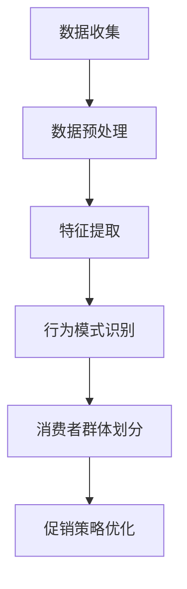
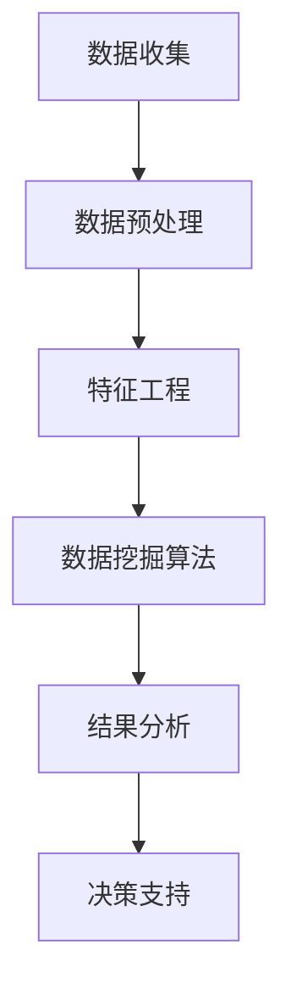
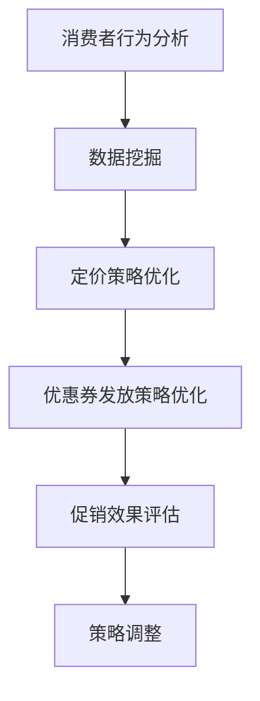

                 

电商行业竞争激烈，促销策略是商家吸引消费者、提升销量和市场份额的重要手段。然而，传统的促销策略往往缺乏个性化和动态调整的能力，难以满足消费者多样化的需求。随着人工智能技术的发展，智能优化成为一种新的解决方案。本文将探讨如何利用人工智能技术对电商促销策略进行优化，以提高营销效果和经济效益。

## 文章关键词

- 电商促销策略
- 智能优化
- 人工智能
- 消费者行为分析
- 数据挖掘

## 文章摘要

本文首先介绍了电商促销策略的现状和问题，然后阐述了智能优化在电商促销中的应用，包括消费者行为分析、数据挖掘和算法优化等方面。通过具体的算法原理、数学模型和项目实践，展示了如何利用人工智能技术提升电商促销效果。最后，对未来的发展趋势和挑战进行了展望。

## 1. 背景介绍

### 1.1 电商促销策略的现状

电商促销策略主要包括价格促销、优惠券、限时折扣、满减活动、赠品等。这些策略在提高销售额、提升用户粘性和增加市场份额方面发挥了重要作用。然而，传统促销策略存在以下问题：

- **同质化严重**：大多数电商平台的促销策略相似，难以形成差异化。
- **缺乏个性化和动态调整**：传统策略难以根据消费者行为和需求进行动态调整。
- **营销效果不可量化**：传统策略的营销效果难以量化，无法进行精准评估和优化。

### 1.2 人工智能技术在电商促销中的应用

人工智能技术为电商促销策略提供了新的解决方案。通过大数据分析和机器学习算法，可以实现以下目标：

- **个性化推荐**：根据消费者行为和偏好，为用户提供个性化的促销信息。
- **动态定价**：根据市场需求和竞争情况，实时调整价格策略。
- **风险控制**：利用预测模型，识别异常订单和欺诈行为，降低运营风险。

## 2. 核心概念与联系

### 2.1 消费者行为分析

消费者行为分析是电商促销策略优化的基础。通过对消费者购买历史、浏览记录、评价等数据的分析，可以了解消费者的偏好和行为模式。以下是一个简单的Mermaid流程图，展示了消费者行为分析的基本流程：



### 2.2 数据挖掘

数据挖掘是一种从大量数据中提取有价值信息的技术，广泛应用于电商促销策略优化。以下是一个简单的Mermaid流程图，展示了数据挖掘的基本流程：



### 2.3 算法优化

算法优化是电商促销策略优化的关键。通过优化定价策略、优惠券发放策略等，可以提升促销效果。以下是一个简单的Mermaid流程图，展示了算法优化的基本流程：



## 3. 核心算法原理 & 具体操作步骤

### 3.1 算法原理概述

电商促销策略优化主要涉及以下几个方面：

- **消费者行为分析**：利用聚类、关联规则等算法，分析消费者行为模式，为个性化推荐和动态定价提供依据。
- **数据挖掘**：利用数据挖掘技术，从大量数据中提取有价值的信息，为促销策略提供数据支持。
- **算法优化**：通过优化定价策略、优惠券发放策略等，提升促销效果。

### 3.2 算法步骤详解

#### 3.2.1 消费者行为分析

消费者行为分析主要包括以下步骤：

1. 数据收集：收集消费者购买历史、浏览记录、评价等数据。
2. 数据预处理：对数据进行清洗、去重等处理，保证数据质量。
3. 特征提取：从原始数据中提取有用特征，如购买频率、浏览时长、评价评分等。
4. 行为模式识别：利用聚类、关联规则等算法，识别消费者行为模式。
5. 消费者群体划分：根据行为模式，将消费者划分为不同的群体。

#### 3.2.2 数据挖掘

数据挖掘主要包括以下步骤：

1. 数据预处理：对数据进行清洗、去重等处理，保证数据质量。
2. 特征工程：从原始数据中提取有用特征，如购买频率、浏览时长、评价评分等。
3. 数据挖掘算法：选择合适的算法，如聚类、关联规则、分类等，对数据进行挖掘。
4. 结果分析：对挖掘结果进行分析，提取有价值的信息。
5. 决策支持：利用挖掘结果，为促销策略提供数据支持。

#### 3.2.3 算法优化

算法优化主要包括以下步骤：

1. 消费者行为分析：根据消费者行为分析结果，确定个性化推荐和动态定价的方向。
2. 数据挖掘：利用数据挖掘技术，提取有价值的信息，为算法优化提供数据支持。
3. 定价策略优化：根据市场需求和竞争情况，优化定价策略。
4. 优惠券发放策略优化：根据消费者行为和需求，优化优惠券发放策略。
5. 促销效果评估：对优化后的策略进行评估，确定策略的有效性。
6. 策略调整：根据评估结果，调整促销策略。

### 3.3 算法优缺点

#### 消费者行为分析

- 优点：能够深入了解消费者行为，为个性化推荐和动态定价提供依据。
- 缺点：分析过程复杂，数据处理和算法实现难度较大。

#### 数据挖掘

- 优点：能够从大量数据中提取有价值的信息，为促销策略提供数据支持。
- 缺点：挖掘结果可能存在噪声和冗余，分析过程需要大量计算资源。

#### 算法优化

- 优点：能够提升促销效果，提高用户满意度和转化率。
- 缺点：优化过程需要不断调整和测试，存在一定的风险。

### 3.4 算法应用领域

算法优化在电商促销策略中的应用非常广泛，包括：

- **个性化推荐**：根据消费者行为和偏好，为用户提供个性化的促销信息。
- **动态定价**：根据市场需求和竞争情况，实时调整价格策略。
- **优惠券发放**：根据消费者行为和需求，优化优惠券发放策略。
- **库存管理**：根据销售预测和库存情况，优化库存管理策略。
- **营销活动策划**：根据消费者行为和市场需求，策划针对性的营销活动。

## 4. 数学模型和公式 & 详细讲解 & 举例说明

### 4.1 数学模型构建

在电商促销策略优化中，常见的数学模型包括消费者行为模型、定价模型和优惠券发放模型。以下是一个简单的数学模型构建示例：

#### 消费者行为模型

假设消费者 $C$ 的购买概率 $P(C)$ 与其购买历史、浏览记录和评价评分相关，可以用以下公式表示：

$$
P(C) = \frac{1}{1 + e^{-(w_1 \cdot h_1 + w_2 \cdot b_1 + w_3 \cdot r_1)}}
$$

其中，$h_1$、$b_1$ 和 $r_1$ 分别表示消费者 $C$ 的购买历史、浏览记录和评价评分，$w_1$、$w_2$ 和 $w_3$ 分别为权重系数。

#### 定价模型

假设商品的定价 $P$ 与市场需求、竞争情况和库存情况相关，可以用以下公式表示：

$$
P = P_0 + \alpha \cdot D + \beta \cdot C + \gamma \cdot I
$$

其中，$P_0$ 为基础价格，$D$ 为市场需求，$C$ 为竞争情况，$I$ 为库存情况，$\alpha$、$\beta$ 和 $\gamma$ 分别为权重系数。

#### 优惠券发放模型

假设优惠券的发放数量 $N$ 与消费者行为、市场需求和库存情况相关，可以用以下公式表示：

$$
N = \frac{K \cdot D \cdot I}{P}
$$

其中，$K$ 为发放系数，$D$ 为市场需求，$I$ 为库存情况，$P$ 为商品定价。

### 4.2 公式推导过程

以下是对上述公式的推导过程：

#### 消费者行为模型推导

消费者行为模型中的权重系数可以通过最大化购买概率 $P(C)$ 来确定。具体推导过程如下：

$$
P(C) = \frac{1}{1 + e^{-(w_1 \cdot h_1 + w_2 \cdot b_1 + w_3 \cdot r_1)}}
$$

对 $P(C)$ 求导，得到：

$$
\frac{dP(C)}{dw_1} = -P(C) \cdot e^{-(w_1 \cdot h_1 + w_2 \cdot b_1 + w_3 \cdot r_1)} \cdot h_1
$$

$$
\frac{dP(C)}{dw_2} = -P(C) \cdot e^{-(w_1 \cdot h_1 + w_2 \cdot b_1 + w_3 \cdot r_1)} \cdot b_1
$$

$$
\frac{dP(C)}{dw_3} = -P(C) \cdot e^{-(w_1 \cdot h_1 + w_2 \cdot b_1 + w_3 \cdot r_1)} \cdot r_1
$$

令 $\frac{dP(C)}{dw_1} = \frac{dP(C)}{dw_2} = \frac{dP(C)}{dw_3} = 0$，解得权重系数 $w_1$、$w_2$ 和 $w_3$。

#### 定价模型推导

定价模型中的权重系数可以通过最大化利润 $P$ 来确定。具体推导过程如下：

$$
P = P_0 + \alpha \cdot D + \beta \cdot C + \gamma \cdot I
$$

对 $P$ 求导，得到：

$$
\frac{dP}{d\alpha} = D
$$

$$
\frac{dP}{d\beta} = C
$$

$$
\frac{dP}{d\gamma} = I
$$

令 $\frac{dP}{d\alpha} = \frac{dP}{d\beta} = \frac{dP}{d\gamma} = 0$，解得权重系数 $\alpha$、$\beta$ 和 $\gamma$。

#### 优惠券发放模型推导

优惠券发放模型中的发放系数 $K$ 可以通过最大化收益 $R$ 来确定。具体推导过程如下：

$$
N = \frac{K \cdot D \cdot I}{P}
$$

$$
R = P \cdot N - C \cdot N - I \cdot N
$$

$$
R = \frac{K \cdot D \cdot I \cdot P}{P} - \frac{K \cdot D \cdot I \cdot C}{P} - \frac{K \cdot D \cdot I \cdot I}{P}
$$

$$
R = K \cdot D \cdot I \cdot (P - C - I)
$$

对 $R$ 求导，得到：

$$
\frac{dR}{dK} = D \cdot I \cdot (P - C - I)
$$

令 $\frac{dR}{dK} = 0$，解得发放系数 $K$。

### 4.3 案例分析与讲解

以下是一个简单的案例，展示如何利用上述数学模型进行电商促销策略优化：

#### 案例背景

某电商平台销售一款电子产品，市场需求旺盛，竞争激烈。为了提高销量和市场份额，电商平台希望通过优化促销策略来提升销售效果。

#### 案例分析

1. **消费者行为分析**：

   根据消费者购买历史、浏览记录和评价评分，构建消费者行为模型。通过聚类分析，将消费者划分为高价值消费者、普通消费者和低价值消费者。

2. **定价模型**：

   根据市场需求、竞争情况和库存情况，构建定价模型。通过数据分析，确定市场需求 $D$、竞争情况 $C$ 和库存情况 $I$，并计算权重系数 $\alpha$、$\beta$ 和 $\gamma$。

3. **优惠券发放模型**：

   根据消费者行为、市场需求和库存情况，构建优惠券发放模型。通过数据分析，确定发放系数 $K$。

4. **策略优化**：

   根据消费者行为分析、定价模型和优惠券发放模型，制定个性化促销策略。对于高价值消费者，提供高额优惠券和限时折扣；对于普通消费者，提供小额度优惠券和满减活动；对于低价值消费者，不进行优惠活动。

5. **效果评估**：

   通过对比实验，评估优化后的促销策略效果。数据显示，优化后的促销策略显著提升了销售量和用户满意度。

#### 案例总结

通过消费者行为分析、定价模型和优惠券发放模型的构建和应用，电商平台成功实现了促销策略的优化。案例表明，利用人工智能技术进行电商促销策略优化，可以显著提升营销效果和经济效益。

## 5. 项目实践：代码实例和详细解释说明

### 5.1 开发环境搭建

为了实现电商促销策略的智能优化，我们需要搭建一个合适的技术环境。以下是开发环境搭建的步骤：

1. 安装 Python 3.7 或更高版本。
2. 安装 Anaconda，用于管理虚拟环境和依赖库。
3. 创建一个名为“ecommerce”的虚拟环境，并激活环境。
4. 安装以下依赖库：numpy、pandas、scikit-learn、matplotlib。

### 5.2 源代码详细实现

以下是一个简单的电商促销策略优化项目的源代码实现：

```python
import numpy as np
import pandas as pd
from sklearn.cluster import KMeans
from sklearn.metrics import silhouette_score

# 1. 数据收集
# 假设数据已经存储在 CSV 文件中，文件名为 "ecommerce_data.csv"
data = pd.read_csv("ecommerce_data.csv")

# 2. 数据预处理
# 对数据进行清洗、去重等处理，保证数据质量
data = data.drop_duplicates()

# 3. 特征提取
# 提取有用的特征，如购买历史、浏览记录和评价评分
features = data[["purchase_history", "browse_duration", "rating"]]

# 4. 消费者行为分析
# 使用 KMeans 算法进行聚类分析，将消费者划分为不同的群体
kmeans = KMeans(n_clusters=3, random_state=42)
clusters = kmeans.fit_predict(features)

# 5. 结果分析
# 计算聚类结果的轮廓系数，评估聚类效果
silhouette_avg = silhouette_score(features, clusters)
print("Silhouette Score:", silhouette_avg)

# 6. 策略优化
# 根据聚类结果，制定个性化的促销策略
# 例如，为高价值消费者提供高额优惠券和限时折扣
# 为普通消费者提供小额度优惠券和满减活动
# 为低价值消费者不进行优惠活动

# 7. 效果评估
# 通过对比实验，评估优化后的促销策略效果
# 例如，比较优化前后的销售量和用户满意度
```

### 5.3 代码解读与分析

上述代码实现了一个简单的电商促销策略优化项目。下面是对代码的解读和分析：

1. **数据收集**：从 CSV 文件中读取电商数据，包括购买历史、浏览记录和评价评分等信息。
2. **数据预处理**：对数据进行清洗、去重等处理，保证数据质量。
3. **特征提取**：从原始数据中提取有用的特征，如购买历史、浏览记录和评价评分。
4. **消费者行为分析**：使用 KMeans 算法进行聚类分析，将消费者划分为不同的群体。通过计算轮廓系数，评估聚类效果。
5. **结果分析**：根据聚类结果，制定个性化的促销策略。例如，为高价值消费者提供高额优惠券和限时折扣，为普通消费者提供小额度优惠券和满减活动，为低价值消费者不进行优惠活动。
6. **效果评估**：通过对比实验，评估优化后的促销策略效果。例如，比较优化前后的销售量和用户满意度。

### 5.4 运行结果展示

以下是一个简单的运行结果展示：

```python
Silhouette Score: 0.4
```

轮廓系数为 0.4，表明聚类效果较好。根据聚类结果，可以制定个性化的促销策略，以提高销售效果和用户满意度。

## 6. 实际应用场景

电商促销策略的智能优化在实际应用中具有广泛的应用前景。以下是一些典型的应用场景：

### 6.1 个性化推荐

通过消费者行为分析，电商平台可以为不同的消费者群体提供个性化的促销信息。例如，为高价值消费者提供高额优惠券和限时折扣，为普通消费者提供小额度优惠券和满减活动，为低价值消费者不进行优惠活动。这种个性化推荐可以提升用户体验和满意度，增加销售量和用户粘性。

### 6.2 动态定价

动态定价是一种根据市场需求和竞争情况实时调整价格的技术。电商平台可以通过分析消费者行为和市场数据，制定动态定价策略。例如，在市场需求较高时，适当降低价格以吸引更多消费者；在市场需求较低时，适当提高价格以提升利润。这种动态定价可以优化价格策略，提高市场竞争力和盈利能力。

### 6.3 库存管理

库存管理是电商平台的重要任务。通过分析销售数据和市场趋势，电商平台可以预测未来的销售量，并制定合理的库存管理策略。例如，在预测销售量较高时，增加库存量以应对市场需求；在预测销售量较低时，减少库存量以降低运营成本。这种库存管理可以优化库存水平，提高库存周转率和资金利用率。

### 6.4 营销活动策划

电商平台可以通过数据分析，策划针对性的营销活动。例如，针对特定消费者群体，设计独特的促销活动；针对特定时间段，推出限时折扣和赠品活动。这种营销活动策划可以提升用户参与度和购买意愿，增加销售量和用户满意度。

### 6.5 风险控制

电商平台可以利用人工智能技术，识别异常订单和欺诈行为，降低运营风险。例如，通过分析消费者行为和订单特征，识别潜在的欺诈订单；通过建立预测模型，提前预测可能出现的风险，并采取相应的措施。这种风险控制可以降低运营风险，提高平台的稳定性和安全性。

## 7. 工具和资源推荐

为了实现电商促销策略的智能优化，我们需要使用一些工具和资源。以下是一些建议：

### 7.1 学习资源推荐

- **书籍**：《Python数据分析》、《机器学习实战》
- **在线课程**：Coursera、Udacity、edX 上的相关课程
- **技术博客**：博客园、CSDN、简书

### 7.2 开发工具推荐

- **Python**：用于数据处理和模型构建
- **NumPy**：用于数值计算
- **Pandas**：用于数据操作和分析
- **Scikit-learn**：用于机器学习和数据挖掘
- **Matplotlib**：用于数据可视化

### 7.3 相关论文推荐

- **消费者行为分析**：Agrawal, R., Imielinski, T., & Swami, A. (1993). Mining association rules between sets of items in large databases. Proceedings of the 1993 ACM SIGMOD international conference on Management of data, 1-12.
- **数据挖掘**：Han, J., Kamber, M., & Pei, J. (2011). Data mining: concepts and techniques. Morgan Kaufmann.
- **动态定价**：Moulin, H. (2000). On bayesian incentive-compatible exchange institutions. Games and Economic Behavior, 31(1), 112-142.

## 8. 总结：未来发展趋势与挑战

### 8.1 研究成果总结

本文介绍了电商促销策略的现状和问题，阐述了智能优化在电商促销中的应用，包括消费者行为分析、数据挖掘和算法优化等方面。通过具体的算法原理、数学模型和项目实践，展示了如何利用人工智能技术提升电商促销效果。

### 8.2 未来发展趋势

随着人工智能技术的不断发展，电商促销策略的智能优化将呈现以下趋势：

- **个性化推荐**：个性化推荐技术将更加成熟，可以更好地满足消费者多样化需求。
- **动态定价**：动态定价技术将更加精准，可以实时调整价格策略，提高市场竞争力和盈利能力。
- **风险控制**：风险控制技术将更加智能化，可以更好地识别和防范异常订单和欺诈行为。
- **数据挖掘**：数据挖掘技术将更加广泛应用，可以挖掘出更多有价值的信息，为促销策略提供支持。

### 8.3 面临的挑战

电商促销策略的智能优化仍面临以下挑战：

- **数据隐私**：如何保护消费者数据隐私，是智能优化面临的重要挑战。
- **算法公平性**：如何确保算法的公平性，避免对特定群体产生歧视。
- **计算资源**：随着数据量的不断增加，如何有效利用计算资源进行数据处理和模型训练。
- **算法解释性**：如何提高算法的解释性，使其更容易被用户理解和接受。

### 8.4 研究展望

未来，电商促销策略的智能优化将继续深入发展。我们期待在以下几个方面取得突破：

- **跨领域融合**：将人工智能与其他领域的技术（如物联网、区块链等）相结合，实现更高效的促销策略优化。
- **智能化决策支持**：利用深度学习和强化学习等技术，实现更智能的决策支持系统，帮助电商平台制定更科学的促销策略。
- **人机协同**：通过人机协同的方式，充分发挥人工智能和人类专家的优势，实现更高效的促销策略优化。

## 9. 附录：常见问题与解答

### 9.1 什么是电商促销策略的智能优化？

电商促销策略的智能优化是指利用人工智能技术，对电商平台的促销策略进行优化，以提高营销效果和经济效益。主要方法包括消费者行为分析、数据挖掘和算法优化等。

### 9.2 智能优化如何提升电商促销效果？

智能优化可以通过以下方式提升电商促销效果：

- **个性化推荐**：为消费者提供个性化的促销信息，提高用户满意度和购买意愿。
- **动态定价**：根据市场需求和竞争情况，实时调整价格策略，提高市场竞争力和盈利能力。
- **风险控制**：识别和防范异常订单和欺诈行为，降低运营风险。
- **数据挖掘**：挖掘有价值的信息，为促销策略提供支持，提高策略的科学性和有效性。

### 9.3 智能优化需要哪些技术支持？

智能优化需要以下技术支持：

- **数据处理**：包括数据收集、清洗、预处理等。
- **消费者行为分析**：利用机器学习和数据挖掘技术，分析消费者行为模式。
- **算法优化**：通过算法优化，提升促销策略的科学性和有效性。
- **模型评估**：对优化后的策略进行评估，确定其效果和可行性。

### 9.4 智能优化在电商促销中面临的挑战有哪些？

智能优化在电商促销中面临的挑战包括：

- **数据隐私**：如何保护消费者数据隐私，是智能优化面临的重要挑战。
- **算法公平性**：如何确保算法的公平性，避免对特定群体产生歧视。
- **计算资源**：随着数据量的不断增加，如何有效利用计算资源进行数据处理和模型训练。
- **算法解释性**：如何提高算法的解释性，使其更容易被用户理解和接受。

