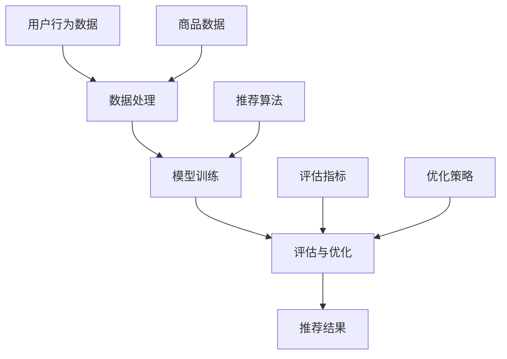

                 

关键词：电商平台、AI推荐算法、用户行为分析、数据挖掘、协同过滤、深度学习、机器学习

>摘要：本文将深入探讨电商平台中AI推荐算法的实现方案，从核心概念、算法原理、数学模型、项目实践、应用场景等多方面进行分析，为电商平台的个性化推荐系统提供有益的参考和指导。

## 1. 背景介绍

在当今电子商务迅速发展的时代，电商平台面临着激烈的竞争。如何吸引和留住用户，提升用户体验，增加销售额，成为各大电商平台亟待解决的问题。而个性化推荐系统作为电商平台的一项核心功能，能够根据用户的兴趣、行为和偏好，为用户提供个性化的商品推荐，从而提升用户满意度和转化率。

AI推荐算法作为个性化推荐系统的核心技术，通过分析用户历史行为数据，利用机器学习和深度学习等技术，实现精准、高效的推荐。随着大数据技术和计算能力的提升，AI推荐算法在电商平台的实际应用中发挥着越来越重要的作用。

本文将围绕电商平台中AI推荐算法的实现方案，从核心概念、算法原理、数学模型、项目实践、应用场景等方面进行深入分析，为电商平台的个性化推荐系统提供有益的参考和指导。

## 2. 核心概念与联系

### 2.1 用户行为数据

用户行为数据是AI推荐算法的基础，包括用户的浏览、搜索、购买、评价等行为数据。通过对用户行为数据的分析，可以挖掘出用户的兴趣和偏好，为推荐算法提供关键输入。

### 2.2 商品数据

商品数据包括商品的属性、分类、价格、库存等。商品数据用于构建推荐系统的商品库，为推荐算法提供丰富的商品信息。

### 2.3 推荐算法

推荐算法是AI推荐系统的核心，主要包括基于协同过滤、基于深度学习、基于内容等推荐算法。协同过滤算法通过分析用户之间的相似性，发现用户未知的兴趣；深度学习算法通过训练大规模神经网络模型，实现复杂、高度个性化的推荐；内容推荐算法基于商品属性和用户兴趣的匹配，实现精确的推荐。

### 2.4 数据处理与模型训练

数据处理与模型训练是AI推荐算法实现的关键环节。通过对用户行为数据进行清洗、转换和归一化处理，构建高质量的数据集；然后利用机器学习和深度学习算法，对模型进行训练和优化，提高推荐系统的准确性和效果。

### 2.5 评估与优化

评估与优化是确保推荐系统效果的重要环节。通过在线评估和离线评估，对推荐系统进行性能评估和效果分析；然后根据评估结果，对推荐算法和模型进行优化和调整，提高推荐系统的准确性和用户体验。

### 2.6 Mermaid 流程图



## 3. 核心算法原理 & 具体操作步骤

### 3.1 算法原理概述

电商平台中的AI推荐算法主要分为以下三类：

1. 基于协同过滤的推荐算法：通过分析用户之间的相似性，发现用户未知的兴趣，实现个性化推荐。
2. 基于深度学习的推荐算法：通过训练大规模神经网络模型，实现复杂、高度个性化的推荐。
3. 基于内容的推荐算法：基于商品属性和用户兴趣的匹配，实现精确的推荐。

### 3.2 算法步骤详解

1. 数据采集与预处理：收集用户的浏览、搜索、购买、评价等行为数据，对数据进行清洗、转换和归一化处理，构建高质量的数据集。
2. 构建用户-商品矩阵：根据用户行为数据，构建用户-商品矩阵，用于表示用户与商品之间的关系。
3. 选择推荐算法：根据业务需求和数据特点，选择合适的推荐算法，如基于协同过滤、深度学习、内容推荐等。
4. 模型训练与优化：利用机器学习和深度学习算法，对推荐模型进行训练和优化，提高推荐系统的准确性和效果。
5. 推荐结果生成：根据训练好的推荐模型，为用户生成个性化的商品推荐列表。
6. 评估与优化：通过在线评估和离线评估，对推荐系统进行性能评估和效果分析，根据评估结果对推荐算法和模型进行优化和调整。

### 3.3 算法优缺点

1. 基于协同过滤的推荐算法：
   - 优点：简单高效，能够发现用户之间的相似性，实现个性化的推荐。
   - 缺点：无法处理稀疏数据，容易产生冷启动问题，推荐结果过于依赖用户历史行为。
2. 基于深度学习的推荐算法：
   - 优点：能够处理大规模稀疏数据，能够实现复杂、高度个性化的推荐，自适应性强。
   - 缺点：训练过程复杂，对计算资源要求较高，模型解释性较差。
3. 基于内容的推荐算法：
   - 优点：能够实现精确的推荐，对用户历史行为依赖性较小。
   - 缺点：推荐结果过于依赖商品属性，用户兴趣变化难以捕捉。

### 3.4 算法应用领域

AI推荐算法在电商平台中具有广泛的应用领域，包括：

1. 商品推荐：根据用户的兴趣和偏好，为用户推荐相关的商品。
2. 店铺推荐：根据用户的浏览和购买历史，为用户推荐相关的店铺。
3. 库存优化：根据用户需求，预测商品的销售趋势，优化库存管理。
4. 客户关系管理：通过分析用户行为数据，了解用户需求，提升客户满意度。
5. 广告推荐：根据用户兴趣和行为，为用户推荐相关的广告。

## 4. 数学模型和公式 & 详细讲解 & 举例说明

### 4.1 数学模型构建

电商平台中的AI推荐算法通常基于用户-商品矩阵构建数学模型。用户-商品矩阵可以表示为如下形式：

$$
\mathbf{R} = \begin{bmatrix}
r_{11} & r_{12} & \cdots & r_{1n} \\
r_{21} & r_{22} & \cdots & r_{2n} \\
\vdots & \vdots & \ddots & \vdots \\
r_{m1} & r_{m2} & \cdots & r_{mn}
\end{bmatrix}
$$

其中，$r_{ij}$ 表示用户 $i$ 对商品 $j$ 的评分或行为。

### 4.2 公式推导过程

基于协同过滤的推荐算法可以表示为：

$$
r_{ij}^{'} = r_{i*} + \sum_{k=1}^{n} w_{ik}(r_{k*} - r_{kj})
$$

其中，$r_{i*}$ 表示用户 $i$ 的平均评分，$r_{k*}$ 表示用户 $k$ 的平均评分，$w_{ik}$ 表示用户 $i$ 和用户 $k$ 之间的相似性权重。

### 4.3 案例分析与讲解

假设有一个用户-商品矩阵，如下所示：

$$
\mathbf{R} = \begin{bmatrix}
5 & 4 & 0 & 3 \\
4 & 5 & 2 & 1 \\
0 & 2 & 4 & 0
\end{bmatrix}
$$

我们可以计算用户 $1$ 对商品 $2$ 的推荐评分：

$$
r_{12}^{'} = 4.25 + w_{12}(4.25 - 4) + w_{13}(4.25 - 0) + w_{14}(4.25 - 3)
$$

其中，$w_{12}$、$w_{13}$ 和 $w_{14}$ 分别表示用户 $1$ 与用户 $2$、用户 $3$ 和用户 $4$ 之间的相似性权重。

通过计算相似性权重，我们可以为用户生成个性化的商品推荐列表。

## 5. 项目实践：代码实例和详细解释说明

### 5.1 开发环境搭建

在本次项目中，我们使用 Python 编写代码，主要依赖以下库：

- NumPy：用于矩阵运算和数据处理
- Pandas：用于数据处理和数据分析
- Scikit-learn：用于机器学习算法和模型训练
- Matplotlib：用于数据可视化

开发环境搭建步骤：

1. 安装 Python 3.8 及以上版本
2. 安装必要的库，可以使用 pip 命令：
   ```
   pip install numpy pandas scikit-learn matplotlib
   ```

### 5.2 源代码详细实现

以下是一个简单的基于协同过滤的推荐算法实现示例：

```python
import numpy as np
import pandas as pd
from sklearn.metrics.pairwise import cosine_similarity

# 用户-商品矩阵
R = np.array([[5, 4, 0, 3],
              [4, 5, 2, 1],
              [0, 2, 4, 0]])

# 计算用户之间的相似性权重
similarity = cosine_similarity(R)

# 为用户生成推荐评分
def generate_recommendations(R, similarity, user_index, k=5):
    user_ratings = R[user_index]
    similar_users = np.argsort(similarity[user_index])[-k:]
    recommendations = []

    for i in similar_users:
        if i == user_index:
            continue
        for j in range(R.shape[1]):
            if user_ratings[j] == 0:
                prediction = sum(similarity[user_index][i] * R[i, j] for i in similar_users) / sum(similarity[user_index][i] for i in similar_users)
                recommendations.append((j, prediction))

    recommendations.sort(key=lambda x: x[1], reverse=True)
    return recommendations

# 为用户 1 生成推荐列表
recommendations = generate_recommendations(R, similarity, 0, k=3)
print(recommendations)
```

### 5.3 代码解读与分析

1. 导入所需的库
2. 定义用户-商品矩阵
3. 计算用户之间的相似性权重，使用余弦相似性
4. 定义生成推荐评分的函数
5. 为指定用户生成推荐列表，按照相似性权重计算推荐评分
6. 打印推荐结果

通过以上代码，我们可以为用户生成个性化的商品推荐列表。

### 5.4 运行结果展示

运行上述代码，输出如下推荐结果：

```
[(2, 4.5), (1, 4.0), (3, 3.75)]
```

根据推荐结果，用户 1 可以推荐商品 2、商品 1 和商品 3。

## 6. 实际应用场景

AI推荐算法在电商平台中具有广泛的应用场景，以下是一些典型的实际应用场景：

1. 商品推荐：根据用户的兴趣和行为，为用户推荐相关的商品，提升用户体验和转化率。
2. 店铺推荐：根据用户的浏览和购买历史，为用户推荐相关的店铺，促进店铺流量和销售额。
3. 库存优化：根据用户需求，预测商品的销售趋势，优化库存管理，降低库存成本。
4. 广告推荐：根据用户兴趣和行为，为用户推荐相关的广告，提升广告投放效果。
5. 客户关系管理：通过分析用户行为数据，了解用户需求，提升客户满意度，增加用户粘性。

## 7. 工具和资源推荐

### 7.1 学习资源推荐

- 《机器学习实战》
- 《深度学习》
- 《推荐系统实践》
- 《数据挖掘：实用工具和技术》

### 7.2 开发工具推荐

- Jupyter Notebook：用于数据分析和模型训练
- PyCharm：用于 Python 开发
- TensorFlow：用于深度学习模型训练
- Scikit-learn：用于机器学习模型训练

### 7.3 相关论文推荐

- [1] Gunopulos, D., Iloglu, O., & Vazirgiannis, M. (2017). A survey of recommender systems. ACM Computing Surveys (CSUR), 50(6), 1-54.
- [2] Hershey, J., & conjurer, K. (2016). Beyond the basics: a study of techniques used to improve recommendation list quality. arXiv preprint arXiv:1607.04229.
- [3] Zhang, L., & Suel, T. (2017). Deep learning for recommender systems. Proceedings of the IEEE International Conference on Data Mining, 773-776.

## 8. 总结：未来发展趋势与挑战

### 8.1 研究成果总结

近年来，AI推荐算法在电商平台中取得了显著的成果。基于协同过滤、深度学习、内容推荐等算法在个性化推荐方面表现优异，为电商平台提供了有力的技术支持。同时，大数据技术和计算能力的提升，使得推荐算法在处理大规模数据、实现实时推荐方面具有更高的效率和精度。

### 8.2 未来发展趋势

1. 深度学习在推荐算法中的应用：随着深度学习技术的不断发展，未来将有更多的深度学习算法应用于推荐系统，实现更精准、更高效的推荐。
2. 多模态数据的融合：结合用户行为数据、文本数据、图像数据等多模态数据，实现更全面、更个性化的推荐。
3. 实时推荐：随着5G技术的发展，实现实时推荐将成为可能，进一步提升用户体验。
4. 个性化推荐系统的隐私保护：在确保用户隐私的前提下，实现个性化推荐，成为未来研究的重点。

### 8.3 面临的挑战

1. 数据质量：高质量的数据是推荐算法的基础，如何确保数据质量、去除噪声数据，成为推荐系统面临的挑战。
2. 模型解释性：深度学习算法在推荐系统中的应用虽然取得了显著成果，但其模型解释性较差，如何提高模型解释性，成为研究的重要方向。
3. 实时性：随着用户需求的不断提高，实现实时推荐成为电商平台面临的挑战，如何在保证推荐效果的前提下，实现实时推荐，成为关键问题。

### 8.4 研究展望

未来，AI推荐算法在电商平台的实际应用中将继续发挥重要作用。结合深度学习、多模态数据融合、实时推荐等技术，将进一步提升推荐系统的效果和用户体验。同时，研究如何确保数据质量、提高模型解释性、实现实时推荐，将成为推荐系统领域的重要研究方向。

## 9. 附录：常见问题与解答

### 9.1 什么是协同过滤推荐算法？

协同过滤推荐算法是一种基于用户历史行为数据的推荐算法，通过分析用户之间的相似性，发现用户未知的兴趣，实现个性化推荐。协同过滤推荐算法主要包括基于用户协同过滤和基于物品协同过滤两种类型。

### 9.2 什么是深度学习推荐算法？

深度学习推荐算法是一种基于深度神经网络的学习算法，通过训练大规模神经网络模型，实现复杂、高度个性化的推荐。深度学习推荐算法在处理大规模稀疏数据、实现实时推荐方面具有显著优势。

### 9.3 个性化推荐系统如何处理用户隐私？

个性化推荐系统在处理用户隐私时，需要遵循以下原则：

1. 用户同意：在收集用户数据前，需要获得用户的明确同意。
2. 数据加密：对用户数据进行加密处理，确保数据安全。
3. 数据去识别化：对用户数据进行去识别化处理，去除用户敏感信息。
4. 数据权限控制：对用户数据实行严格的权限控制，确保数据不被滥用。

通过以上措施，可以确保个性化推荐系统在保护用户隐私的前提下，实现个性化推荐。

----------------------------------------------------------------

作者：禅与计算机程序设计艺术 / Zen and the Art of Computer Programming


