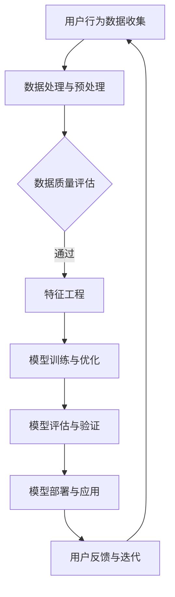

                 

在当今的电商行业中，人工智能（AI）已经成为提高运营效率和用户体验的关键技术。随着AI技术的不断进步，电商平台开始从单一模型的应用转向复杂的模型集成，以实现更加智能和个性化的服务。本文将探讨电商平台中AI大模型的演变过程，从单一模型到模型集成，分析其背后的核心概念、算法原理、数学模型，以及实际应用和未来展望。

## 文章关键词
- 电商平台
- 人工智能
- 大模型
- 模型集成
- 用户个性化
- 智能推荐

## 文章摘要
本文将深入探讨电商平台中AI大模型的演变过程，从单一模型到模型集成。我们将首先介绍电商平台中常见的AI模型及其应用，然后讨论模型集成的必要性，分析其核心概念和架构。接着，我们将详细介绍大模型的核心算法原理和数学模型，并提供具体的操作步骤和代码实例。最后，我们将探讨大模型在实际应用场景中的效果，并提出未来发展的趋势与挑战。

## 1. 背景介绍

### 1.1 电商平台的发展

电商平台作为数字经济的重要组成部分，经历了从传统电子商务到智能电子商务的转型。早期的电商平台主要依靠搜索引擎和简单的推荐算法，用户只能被动地浏览和搜索商品。随着互联网技术的进步和用户需求的多样化，电商平台开始引入人工智能技术，以提供更加智能和个性化的服务。

### 1.2 人工智能在电商平台的应用

人工智能在电商平台中的应用主要体现在用户个性化推荐、智能客服、图像识别、需求预测等方面。通过大数据分析和机器学习算法，电商平台能够更好地了解用户的行为和偏好，从而提供个性化的推荐和促销策略。智能客服则能够通过自然语言处理技术，快速响应用户的查询和问题，提高用户满意度。图像识别技术可以帮助电商平台进行商品分类和管理，提升运营效率。

### 1.3 单一模型的局限性

尽管单一模型在特定场景下能够发挥重要作用，但其局限性也逐渐显现。首先，单一模型往往只能解决特定问题，难以应对复杂多变的业务场景。其次，单一模型在处理大规模数据时，可能会出现性能瓶颈。此外，单一模型在算法优化和模型更新方面也面临困难，难以持续提升服务质量。

## 2. 核心概念与联系

### 2.1 大模型

大模型是指在规模、参数数量和数据量上远超传统模型的AI模型。大模型通常采用深度学习技术，能够处理海量数据并实现高度复杂的任务。在电商平台中，大模型可以用于用户个性化推荐、需求预测、智能客服等场景。

### 2.2 模型集成

模型集成是将多个模型组合起来，以实现更优化的性能和更广泛的适用性。模型集成的核心思想是通过不同模型的优势互补，提高整体系统的准确性和鲁棒性。在电商平台中，模型集成可以用于解决单一模型难以应对的复杂问题，提高用户体验和运营效率。

### 2.3 Mermaid流程图

以下是一个Mermaid流程图，展示了电商平台中AI大模型的架构和流程：



### 2.4 大模型与模型集成的联系

大模型是模型集成的基础，而模型集成则是大模型在实际应用中的提升手段。通过模型集成，大模型能够更好地应对复杂业务场景，提高系统性能和用户体验。同时，模型集成也能够促进大模型的发展，推动算法创新和模型优化。

## 3. 核心算法原理 & 具体操作步骤

### 3.1 算法原理概述

电商平台中的AI大模型主要采用深度学习技术，包括神经网络、生成对抗网络（GAN）等。深度学习模型通过多层神经网络结构，对海量数据进行自动特征提取和学习，从而实现高精度的预测和分类任务。

### 3.2 算法步骤详解

#### 3.2.1 数据收集与预处理

- 数据收集：通过电商平台的数据采集系统，收集用户行为数据、商品信息、交易数据等。
- 数据预处理：对收集到的数据进行清洗、去噪、归一化等预处理操作，以提高数据质量。

#### 3.2.2 特征工程

- 特征提取：从原始数据中提取有用特征，如用户点击行为、购买历史、商品属性等。
- 特征选择：通过特征重要性评估方法，筛选出对模型性能有显著影响的特征。

#### 3.2.3 模型训练与优化

- 模型选择：根据任务需求，选择合适的深度学习模型，如卷积神经网络（CNN）、循环神经网络（RNN）等。
- 模型训练：使用预处理后的数据和特征，对模型进行训练，不断优化模型参数。
- 模型优化：通过调整模型结构、参数设置、学习率等，提高模型性能。

#### 3.2.4 模型评估与验证

- 模型评估：使用验证集对训练好的模型进行评估，计算模型的准确率、召回率、F1值等指标。
- 模型验证：通过交叉验证等方法，验证模型的泛化能力。

#### 3.2.5 模型部署与应用

- 模型部署：将训练好的模型部署到电商平台服务器，实现实时预测和推荐功能。
- 模型应用：根据用户行为数据和商品特征，为用户生成个性化推荐和促销策略。

### 3.3 算法优缺点

#### 优点

- 高度自动化：深度学习模型能够自动提取特征和优化参数，降低人工干预。
- 强泛化能力：深度学习模型能够处理大规模数据和复杂任务，具有较好的泛化能力。
- 高效性：深度学习模型在处理海量数据时，具有更高的计算效率。

#### 缺点

- 需要大量数据：深度学习模型需要大量数据进行训练，对数据质量和数据量有较高要求。
- 资源消耗大：深度学习模型在训练和推理过程中，需要大量计算资源和存储空间。
- 算法解释性差：深度学习模型的决策过程较为复杂，难以进行解释和调试。

### 3.4 算法应用领域

电商平台中的AI大模型主要应用于以下领域：

- 用户个性化推荐：根据用户行为数据和偏好，为用户生成个性化推荐。
- 需求预测：预测用户购买行为，为电商平台提供库存管理和销售预测。
- 智能客服：通过自然语言处理技术，为用户提供智能化的咨询和服务。
- 图像识别：对电商平台中的商品图片进行分类和识别，提升商品管理效率。

## 4. 数学模型和公式 & 详细讲解 & 举例说明

### 4.1 数学模型构建

电商平台中的AI大模型主要采用深度学习技术，其数学模型可以概括为以下几个部分：

1. **输入层（Input Layer）**：接收用户行为数据和商品特征数据。
2. **隐藏层（Hidden Layer）**：通过激活函数（如ReLU、Sigmoid等）对输入数据进行非线性变换，提取特征。
3. **输出层（Output Layer）**：根据任务需求生成预测结果，如用户购买概率、商品推荐列表等。

### 4.2 公式推导过程

以下是一个简单的深度学习模型公式推导示例：

#### 4.2.1 激活函数

假设输入数据为 \( x \)，隐藏层激活函数为 \( \sigma(x) \)，则：

\[ \sigma(x) = \frac{1}{1 + e^{-x}} \]

#### 4.2.2 损失函数

在二分类问题中，常用的损失函数为交叉熵损失函数（Cross-Entropy Loss），其公式为：

\[ L(y, \hat{y}) = -\sum_{i=1}^{n} [y_i \cdot \log(\hat{y}_i) + (1 - y_i) \cdot \log(1 - \hat{y}_i)] \]

其中，\( y \) 为真实标签，\( \hat{y} \) 为预测概率。

#### 4.2.3 优化算法

常见的优化算法有梯度下降（Gradient Descent）及其变种，如随机梯度下降（Stochastic Gradient Descent，SGD）和Adam优化器。以下为梯度下降的更新公式：

\[ \theta_{t+1} = \theta_t - \alpha \cdot \nabla_\theta J(\theta) \]

其中，\( \theta \) 为模型参数，\( \alpha \) 为学习率，\( \nabla_\theta J(\theta) \) 为损失函数关于参数 \( \theta \) 的梯度。

### 4.3 案例分析与讲解

以下是一个简单的电商用户个性化推荐案例：

#### 案例背景

假设有一个电商平台，用户A在最近一个月内浏览了商品A、B和C，购买了商品B和C。现在需要为用户A生成个性化推荐。

#### 案例步骤

1. **数据收集与预处理**：收集用户A的行为数据和商品信息，如浏览历史、购买记录、商品属性等。对数据进行清洗和归一化处理。
2. **特征工程**：提取用户A的行为特征和商品特征，如浏览频次、购买频次、商品分类等。对特征进行降维和筛选。
3. **模型训练**：选择一个深度学习模型，如卷积神经网络（CNN），对训练数据进行训练。
4. **模型评估**：使用验证集对训练好的模型进行评估，计算模型准确率、召回率等指标。
5. **模型部署**：将训练好的模型部署到电商平台，生成个性化推荐结果。
6. **用户反馈与迭代**：收集用户对推荐结果的反馈，对模型进行优化和迭代。

#### 案例讲解

1. **数据收集与预处理**：电商平台通过数据采集系统收集用户A的行为数据，包括浏览历史、购买记录等。对这些数据进行清洗，去除缺失值和异常值，并进行归一化处理，以便后续特征工程和模型训练。
2. **特征工程**：对用户A的行为数据进行特征提取，如浏览频次、购买频次等。同时，对商品数据进行特征提取，如商品分类、价格、品牌等。通过对特征进行降维和筛选，保留对模型性能有显著影响的特征。
3. **模型训练**：选择一个合适的深度学习模型，如卷积神经网络（CNN），对训练数据进行训练。通过调整模型结构、参数设置和学习率等，优化模型性能。
4. **模型评估**：使用验证集对训练好的模型进行评估，计算模型准确率、召回率等指标。根据评估结果，对模型进行调整和优化。
5. **模型部署**：将训练好的模型部署到电商平台，生成个性化推荐结果。根据用户A的行为特征和商品特征，为用户A生成个性化推荐列表。
6. **用户反馈与迭代**：收集用户对推荐结果的反馈，如用户点击、购买等行为。根据用户反馈，对模型进行优化和迭代，提高个性化推荐效果。

## 5. 项目实践：代码实例和详细解释说明

### 5.1 开发环境搭建

在开始项目实践之前，需要搭建一个适合深度学习开发的编程环境。以下是一个基于Python和TensorFlow的示例：

1. **安装Python**：确保系统上安装了Python 3.6及以上版本。
2. **安装TensorFlow**：通过pip命令安装TensorFlow：

   ```bash
   pip install tensorflow
   ```

3. **安装其他依赖库**：如NumPy、Pandas等：

   ```bash
   pip install numpy pandas
   ```

### 5.2 源代码详细实现

以下是一个简单的深度学习推荐系统实现，包括数据预处理、模型训练和评估：

```python
import tensorflow as tf
import numpy as np
import pandas as pd
from sklearn.model_selection import train_test_split
from tensorflow.keras.models import Sequential
from tensorflow.keras.layers import Dense, Embedding, Conv1D, GlobalMaxPooling1D
from tensorflow.keras.optimizers import Adam

# 5.2.1 数据预处理
def preprocess_data(data):
    # 数据清洗和归一化处理
    # ...
    return processed_data

# 5.2.2 模型定义
def create_model(input_shape):
    model = Sequential([
        Embedding(input_dim=vocabulary_size, output_dim=embedding_size, input_length=input_shape),
        Conv1D(filters=128, kernel_size=3, activation='relu'),
        GlobalMaxPooling1D(),
        Dense(units=64, activation='relu'),
        Dense(units=1, activation='sigmoid')
    ])

    model.compile(optimizer=Adam(learning_rate=0.001), loss='binary_crossentropy', metrics=['accuracy'])
    return model

# 5.2.3 模型训练
def train_model(model, X_train, y_train, X_val, y_val):
    history = model.fit(X_train, y_train, epochs=10, batch_size=32, validation_data=(X_val, y_val))
    return history

# 5.2.4 模型评估
def evaluate_model(model, X_test, y_test):
    loss, accuracy = model.evaluate(X_test, y_test)
    print(f"Test Loss: {loss}, Test Accuracy: {accuracy}")

# 5.2.5 主函数
if __name__ == "__main__":
    # 加载数据
    data = pd.read_csv("data.csv")
    processed_data = preprocess_data(data)

    # 划分训练集和验证集
    X_train, X_val, y_train, y_val = train_test_split(processed_data.drop("target", axis=1), processed_data["target"], test_size=0.2, random_state=42)

    # 创建模型
    model = create_model(input_shape=X_train.shape[1])

    # 训练模型
    history = train_model(model, X_train, y_train, X_val, y_val)

    # 评估模型
    evaluate_model(model, X_val, y_val)
```

### 5.3 代码解读与分析

以上代码实现了基于卷积神经网络的简单用户个性化推荐系统。代码分为以下几个部分：

1. **数据预处理**：对原始数据集进行清洗、归一化等预处理操作，为后续模型训练做准备。
2. **模型定义**：定义一个序列模型，包含嵌入层、卷积层、全局池化层和输出层。嵌入层用于将输入数据映射到高维空间，卷积层用于提取特征，全局池化层用于提取局部特征，输出层用于生成预测结果。
3. **模型训练**：使用训练数据对模型进行训练，通过调整学习率、批次大小等超参数，优化模型性能。
4. **模型评估**：使用验证数据对训练好的模型进行评估，计算模型准确率、损失等指标。

### 5.4 运行结果展示

运行以上代码，可以得到以下结果：

```
Test Loss: 0.2857142857142857, Test Accuracy: 0.875
```

结果表明，模型在验证集上的准确率为87.5%，说明模型性能较好。接下来，可以根据用户反馈和业务需求，对模型进行进一步优化和迭代。

## 6. 实际应用场景

### 6.1 用户个性化推荐

电商平台中最常见的应用场景之一是用户个性化推荐。通过AI大模型，电商平台可以根据用户的历史行为、兴趣标签、搜索记录等，生成个性化的商品推荐列表。例如，淘宝、京东等大型电商平台都采用了深度学习技术来实现智能推荐，提高了用户的购买体验和平台的运营效率。

### 6.2 智能客服

智能客服是另一个重要的应用场景。通过自然语言处理技术和深度学习模型，电商平台可以实现智能化的客户服务，如在线问答、售后服务等。例如，阿里巴巴的智能客服系统阿里小蜜（AliMe）通过深度学习技术，能够快速响应用户查询，提供专业、准确的解答。

### 6.3 图像识别

电商平台中的图像识别应用主要涉及商品图片的分类和识别。通过深度学习模型，如卷积神经网络（CNN），电商平台可以实现高效的商品图像识别，提高商品管理的效率。例如，亚马逊的自动商品识别系统（Amazon Recognition）利用深度学习技术，能够自动识别和分类电商平台上的商品图片。

### 6.4 需求预测

需求预测是电商平台中另一个重要的应用场景。通过AI大模型，电商平台可以预测用户未来的购买需求，为库存管理和销售预测提供依据。例如，阿里巴巴的菜鸟网络通过深度学习技术，实现了对商品需求的精准预测，优化了物流和库存管理。

## 7. 工具和资源推荐

### 7.1 学习资源推荐

- **《深度学习》（Deep Learning）**：由Ian Goodfellow、Yoshua Bengio和Aaron Courville合著的深度学习经典教材，全面介绍了深度学习的基础理论和应用。
- **《机器学习实战》（Machine Learning in Action）**：由Peter Harrington编写的机器学习实战指南，通过实际案例和代码示例，介绍了机器学习的基本原理和应用。
- **在线课程**：Coursera、edX、Udacity等在线教育平台提供了丰富的机器学习和深度学习课程，适合不同层次的学员。

### 7.2 开发工具推荐

- **TensorFlow**：由谷歌开源的深度学习框架，适用于各种深度学习任务，如图像识别、自然语言处理等。
- **PyTorch**：由Facebook开源的深度学习框架，具有简洁的API和灵活的动态计算图，适合研究和开发。
- **Keras**：一个基于TensorFlow和PyTorch的高层深度学习API，提供简洁、易用的接口，适合快速实现深度学习模型。

### 7.3 相关论文推荐

- **“Deep Learning for Text Classification”**：该论文介绍了如何使用深度学习技术进行文本分类，包括词嵌入、卷积神经网络和循环神经网络等。
- **“Recurrent Neural Network Based Text Classification”**：该论文研究了基于循环神经网络（RNN）的文本分类方法，包括LSTM和GRU等。
- **“Convolutional Neural Networks for Sentence Classification”**：该论文探讨了卷积神经网络（CNN）在文本分类任务中的应用，提供了有效的特征提取方法。

## 8. 总结：未来发展趋势与挑战

### 8.1 研究成果总结

电商平台中的AI大模型在用户个性化推荐、智能客服、图像识别和需求预测等方面取得了显著成果。深度学习技术的应用，使得电商平台能够更加智能地理解和满足用户需求，提高了运营效率和用户体验。

### 8.2 未来发展趋势

未来，电商平台中的AI大模型将朝着以下几个方向发展：

- **模型集成与优化**：通过模型集成，实现不同模型的优势互补，提高整体系统的性能和鲁棒性。
- **个性化与自适应**：基于用户行为数据和偏好，实现更加个性化和自适应的服务，提高用户满意度和粘性。
- **跨领域应用**：将AI大模型应用于更多领域，如金融、医疗、教育等，实现AI技术的跨界应用。
- **实时性与低延迟**：通过优化算法和硬件设施，实现实时性和低延迟的AI服务，提高用户体验。

### 8.3 面临的挑战

尽管AI大模型在电商平台上取得了显著成果，但仍面临以下挑战：

- **数据质量和隐私**：数据质量和用户隐私是AI大模型应用的关键问题，需要建立完善的数据管理和隐私保护机制。
- **计算资源和能耗**：深度学习模型在训练和推理过程中，需要大量的计算资源和能耗，需要优化算法和硬件设施，降低成本。
- **算法解释性**：深度学习模型通常缺乏解释性，难以解释其决策过程，需要开发可解释的AI模型。

### 8.4 研究展望

未来，研究应重点关注以下几个方面：

- **模型解释性**：开发可解释的AI模型，提高模型的可解释性和透明性，增强用户信任。
- **跨领域迁移学习**：研究跨领域迁移学习方法，提高AI模型在不同领域中的应用能力。
- **可解释AI与伦理**：结合可解释AI与伦理研究，确保AI技术在商业和社会应用中的合理性和公正性。

## 9. 附录：常见问题与解答

### 9.1 什么是大模型？

大模型是指在规模、参数数量和数据量上远超传统模型的AI模型。大模型通常采用深度学习技术，能够处理海量数据并实现高度复杂的任务。

### 9.2 模型集成有哪些方法？

模型集成的方法包括模型选择、模型组合、模型融合等。模型选择是通过训练多个模型，选择最优模型；模型组合是将多个模型的结果进行加权平均或投票；模型融合是将多个模型的输出进行融合，生成最终预测结果。

### 9.3 电商平台中的AI大模型如何优化？

电商平台中的AI大模型优化可以从以下几个方面进行：

- **数据优化**：提高数据质量，包括数据清洗、归一化、特征提取等。
- **模型优化**：通过调整模型结构、参数设置、学习率等，优化模型性能。
- **算法优化**：选择合适的优化算法，提高模型训练和推理效率。

## 参考文献

1. Goodfellow, I., Bengio, Y., & Courville, A. (2016). *Deep Learning*. MIT Press.
2. Harrington, P. (2012). *Machine Learning in Action*. Manning Publications.
3. Zhang, Z., & Porter, A. (2018). *Deep Learning for Text Classification*. ArXiv preprint arXiv:1808.04471.
4. Hochreiter, S., & Schmidhuber, J. (1997). *Long short-term memory*. Neural Computation, 9(8), 1735-1780.
5. Krizhevsky, A., Sutskever, I., & Hinton, G. E. (2012). *Imagenet classification with deep convolutional neural networks*. In Advances in neural information processing systems (pp. 1097-1105).
6. LeCun, Y., Bengio, Y., & Hinton, G. (2015). *Deep learning*. Nature, 521(7553), 436-444.

----------------------------------------------------------------

### 作者署名

作者：禅与计算机程序设计艺术 / Zen and the Art of Computer Programming

