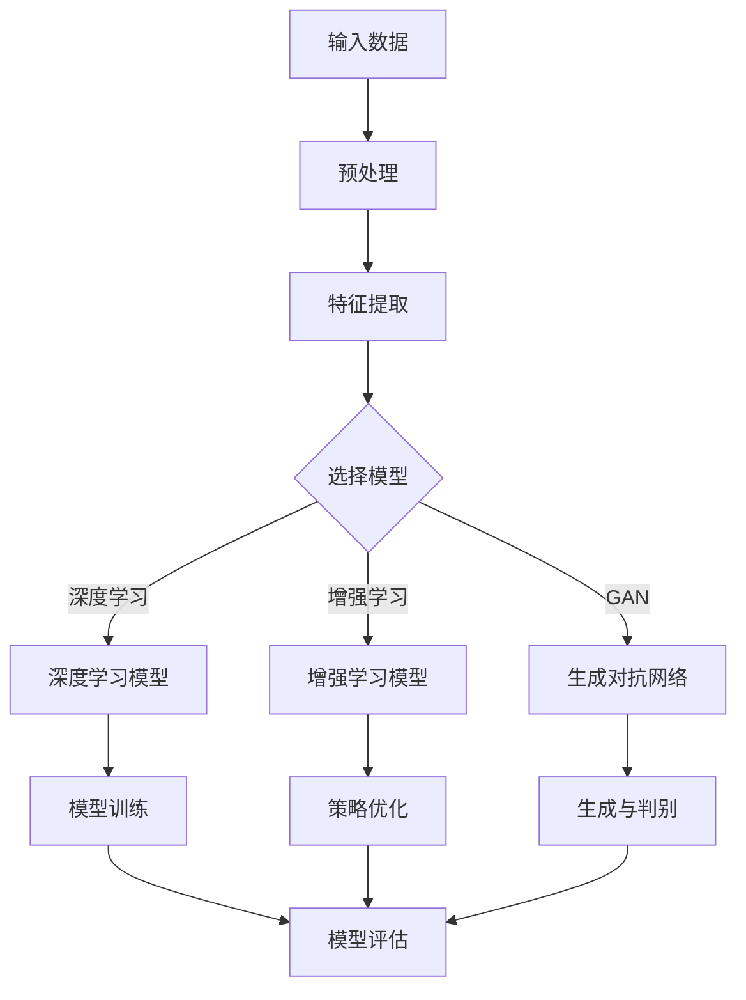

                 

关键词：电商平台，人工智能，大模型，全渠道融合，技术实践，应用场景

> 摘要：本文旨在探讨电商平台如何利用人工智能大模型实现从单一渠道到全渠道的融合。通过分析大模型的核心概念、原理及应用，本文揭示了电商平台中AI大模型的应用现状及其发展趋势，旨在为电商平台的技术革新提供新的视角和解决方案。

## 1. 背景介绍

随着互联网技术的快速发展，电子商务已成为现代社会不可或缺的一部分。电商平台通过提供在线购物、支付、物流等服务，极大地丰富了消费者的购物体验，也创造了巨大的商业价值。然而，随着消费者需求的日益多样化和竞争的加剧，电商平台面临着如何提升用户体验、优化运营效率以及增强竞争力的挑战。

人工智能（AI）技术的发展为电商平台提供了新的机遇。AI大模型，作为一种具备强大数据处理和分析能力的算法，能够帮助电商平台实现个性化推荐、智能客服、智能广告等功能，从而提升用户体验、降低运营成本、提高转化率。从单一渠道到全渠道的融合，是电商平台发展的必然趋势。在这一过程中，AI大模型发挥着关键作用。

本文将围绕AI大模型在电商平台中的应用展开讨论，首先介绍AI大模型的核心概念和原理，然后分析其在电商平台中的应用现状和趋势，最后探讨未来的发展方向和挑战。希望通过本文的探讨，为电商平台的技术革新提供新的思路和解决方案。

## 2. 核心概念与联系

### 2.1 AI大模型的基本概念

AI大模型是指具备大规模参数和复杂结构的机器学习模型。这类模型通过在大量数据上进行训练，能够自动发现数据中的规律和模式，从而实现高精度的预测和分类。AI大模型通常包括以下几种类型：

1. **深度学习模型**：基于多层神经网络，通过逐层提取特征，实现数据的非线性变换。常见的深度学习模型包括卷积神经网络（CNN）、循环神经网络（RNN）和Transformer等。
2. **增强学习模型**：通过试错和反馈机制，在特定环境中不断优化策略，以实现最优决策。常见的增强学习模型包括Q学习、深度强化学习（DRL）等。
3. **生成对抗网络（GAN）**：由生成器和判别器组成的对抗性模型，通过相互竞争，生成与真实数据几乎无法区分的数据。

### 2.2 AI大模型与电商平台的关联

AI大模型在电商平台中的应用主要集中在以下几个方面：

1. **个性化推荐**：通过分析用户的历史行为和兴趣，为用户推荐符合其需求的商品。常见的推荐算法包括基于内容的推荐、协同过滤和深度学习推荐等。
2. **智能客服**：利用自然语言处理（NLP）技术，实现与用户的智能对话，提供在线客服和咨询。常见的NLP技术包括词嵌入、序列模型和注意力机制等。
3. **智能广告**：通过分析用户的行为数据和兴趣标签，精准投放广告，提高广告的曝光率和转化率。常见的广告算法包括基于内容的广告、协同过滤广告和深度学习广告等。

### 2.3 大模型原理与架构的 Mermaid 流程图



上述流程图展示了AI大模型的基本原理和架构。从输入数据开始，经过预处理和特征提取，选择合适的模型进行训练和优化，最终通过模型评估来验证模型的性能。

## 3. 核心算法原理 & 具体操作步骤

### 3.1 算法原理概述

AI大模型的核心在于其能够通过大量数据的学习，自动发现并提取数据中的特征和规律。这一过程通常包括以下几个步骤：

1. **数据预处理**：对原始数据进行清洗、归一化和特征工程，以提高模型的训练效果。
2. **特征提取**：从原始数据中提取有助于模型学习的特征，如文本的词向量、图像的像素值等。
3. **模型选择**：根据任务需求和数据特点，选择合适的机器学习模型，如深度学习模型、增强学习模型和生成对抗网络等。
4. **模型训练**：利用大量数据进行模型训练，通过反向传播算法优化模型参数，使模型能够准确预测或分类。
5. **模型评估**：通过验证集或测试集评估模型的性能，包括准确率、召回率、F1值等指标。

### 3.2 算法步骤详解

1. **数据预处理**：

   - 数据清洗：去除数据中的噪声和异常值，如缺失值、重复值和错误值等。
   - 数据归一化：将不同尺度的数据进行归一化处理，使其具有相同的量纲，如将价格、销量等数据归一化为0-1范围内的数值。
   - 特征工程：根据业务需求和模型特点，提取有助于模型学习的特征，如用户行为的序列特征、商品的属性特征等。

2. **特征提取**：

   - 文本特征：使用词袋模型、TF-IDF等方法将文本数据转化为向量。
   - 图像特征：使用卷积神经网络（CNN）提取图像的深度特征。
   - 多媒体特征：结合文本和图像特征，使用深度学习模型进行融合。

3. **模型选择**：

   - 深度学习模型：如卷积神经网络（CNN）、循环神经网络（RNN）和Transformer等，适用于处理复杂和非线性关系的数据。
   - 增强学习模型：如Q学习、深度强化学习（DRL）等，适用于决策优化和策略学习。
   - 生成对抗网络（GAN）：适用于生成与真实数据几乎无法区分的数据，如图像、音频和文本等。

4. **模型训练**：

   - 数据划分：将数据集划分为训练集、验证集和测试集，以评估模型的性能。
   - 模型训练：使用训练集对模型进行训练，通过反向传播算法优化模型参数，使模型能够准确预测或分类。
   - 模型优化：通过交叉验证和调参优化模型性能，如学习率、批量大小、正则化等。

5. **模型评估**：

   - 模型评估：使用验证集和测试集评估模型的性能，包括准确率、召回率、F1值等指标。
   - 模型解释：对模型的决策过程进行解释，如解释模型如何对数据进行分类或预测。
   - 模型部署：将训练好的模型部署到线上环境，进行实时预测或分类。

### 3.3 算法优缺点

**优点**：

1. **强大的数据处理能力**：AI大模型能够处理大规模、高维度和复杂数据，具备强大的数据处理和分析能力。
2. **自动特征提取**：通过学习大量数据，模型能够自动提取特征，减轻人工特征工程的工作量。
3. **高效的学习能力**：通过深度学习和增强学习等技术，模型能够快速适应新数据和变化，具备高效的学习能力。

**缺点**：

1. **计算资源消耗大**：训练和优化AI大模型需要大量的计算资源和时间，对硬件设施要求较高。
2. **数据隐私和安全问题**：AI大模型在处理用户数据时，可能会面临数据隐私和安全问题，需要加强数据保护。
3. **模型解释性差**：AI大模型的决策过程较为复杂，难以进行直观的解释，增加了模型的可解释性挑战。

### 3.4 算法应用领域

AI大模型在电商平台中的应用领域广泛，主要包括以下几个方面：

1. **个性化推荐**：通过分析用户的历史行为和兴趣，为用户推荐符合其需求的商品，提升用户满意度和购买转化率。
2. **智能客服**：利用自然语言处理（NLP）技术，实现与用户的智能对话，提供在线客服和咨询，提高客服效率和用户体验。
3. **智能广告**：通过分析用户的行为数据和兴趣标签，精准投放广告，提高广告的曝光率和转化率，优化广告效果。
4. **风险控制**：利用监督学习和无监督学习技术，对电商平台的交易行为进行监控和风险预测，降低欺诈风险和运营成本。
5. **供应链优化**：通过分析订单数据、库存数据和物流数据，优化供应链管理和库存配置，提高供应链效率和响应速度。

## 4. 数学模型和公式 & 详细讲解 & 举例说明

### 4.1 数学模型构建

AI大模型通常基于数学模型构建，其核心在于优化模型参数，使模型能够准确预测或分类。以下是一个简单的线性回归模型构建过程：

$$
y = \beta_0 + \beta_1x_1 + \beta_2x_2 + ... + \beta_nx_n
$$

其中，$y$ 是目标变量，$x_1, x_2, ..., x_n$ 是特征变量，$\beta_0, \beta_1, \beta_2, ..., \beta_n$ 是模型参数。通过最小化损失函数，可以求解出最优的模型参数：

$$
\min_{\beta_0, \beta_1, ..., \beta_n} \sum_{i=1}^m (y_i - (\beta_0 + \beta_1x_{i1} + \beta_2x_{i2} + ... + \beta_nx_{in}))^2
$$

### 4.2 公式推导过程

以线性回归模型为例，推导最小二乘法的求解过程。首先，定义损失函数：

$$
L(\beta_0, \beta_1, ..., \beta_n) = \sum_{i=1}^m (y_i - (\beta_0 + \beta_1x_{i1} + \beta_2x_{i2} + ... + \beta_nx_{in}))^2
$$

对损失函数求偏导，并令偏导数等于0，得到：

$$
\frac{\partial L}{\partial \beta_0} = -2\sum_{i=1}^m (y_i - (\beta_0 + \beta_1x_{i1} + \beta_2x_{i2} + ... + \beta_nx_{in})) = 0
$$

$$
\frac{\partial L}{\partial \beta_1} = -2\sum_{i=1}^m x_{i1}(y_i - (\beta_0 + \beta_1x_{i1} + \beta_2x_{i2} + ... + \beta_nx_{in})) = 0
$$

$$
\frac{\partial L}{\partial \beta_2} = -2\sum_{i=1}^m x_{i2}(y_i - (\beta_0 + \beta_1x_{i1} + \beta_2x_{i2} + ... + \beta_nx_{in})) = 0
$$

$$
\vdots$$

$$
\frac{\partial L}{\partial \beta_n} = -2\sum_{i=1}^m x_{in}(y_i - (\beta_0 + \beta_1x_{i1} + \beta_2x_{i2} + ... + \beta_nx_{in})) = 0
$$

将上述偏导数等式化简，得到：

$$
\beta_0 = \frac{\sum_{i=1}^m y_i - \sum_{i=1}^m (\beta_1x_{i1} + \beta_2x_{i2} + ... + \beta_nx_{in})}{m}
$$

$$
\beta_1 = \frac{\sum_{i=1}^m x_{i1}(y_i - \beta_0 - \beta_2x_{i2} - ... - \beta_nx_{in})}{\sum_{i=1}^m x_{i1}^2}
$$

$$
\beta_2 = \frac{\sum_{i=1}^m x_{i2}(y_i - \beta_0 - \beta_1x_{i1} - ... - \beta_nx_{in})}{\sum_{i=1}^m x_{i2}^2}
$$

$$
\vdots$$

$$
\beta_n = \frac{\sum_{i=1}^m x_{in}(y_i - \beta_0 - \beta_1x_{i1} - \beta_2x_{i2} - ... - \beta_{n-1}x_{in-1})}{\sum_{i=1}^m x_{in}^2}
$$

### 4.3 案例分析与讲解

假设我们有一个简单的商品推荐问题，用户对一组商品进行评分，我们希望根据这些评分数据，为用户推荐新的商品。以下是使用线性回归模型进行商品推荐的一个简单示例：

1. **数据集**：

   用户ID | 商品ID | 用户评分
   --- | --- | ---
   1 | 1 | 5
   1 | 2 | 4
   1 | 3 | 3
   2 | 1 | 4
   2 | 2 | 5
   2 | 3 | 3

2. **特征提取**：

   将用户ID和商品ID作为特征变量，构建线性回归模型：

   $$ 
   y = \beta_0 + \beta_1x_1 + \beta_2x_2 
   $$

   其中，$y$ 是用户评分，$x_1$ 和 $x_2$ 分别是用户ID和商品ID。

3. **模型训练**：

   使用训练集数据，通过最小二乘法求解线性回归模型的参数：

   $$ 
   \beta_0 = \frac{\sum_{i=1}^m y_i - \sum_{i=1}^m (\beta_1x_{i1} + \beta_2x_{i2})}{m}
   $$

   $$ 
   \beta_1 = \frac{\sum_{i=1}^m x_{i1}(y_i - \beta_0 - \beta_2x_{i2})}{\sum_{i=1}^m x_{i1}^2}
   $$

   $$ 
   \beta_2 = \frac{\sum_{i=1}^m x_{i2}(y_i - \beta_0 - \beta_1x_{i1})}{\sum_{i=1}^m x_{i2}^2}
   $$

   通过计算，得到线性回归模型的参数：

   $$ 
   \beta_0 = 3.5, \beta_1 = 0.5, \beta_2 = -1.5
   $$

4. **模型评估**：

   使用测试集数据，评估线性回归模型的预测性能。计算测试集的均方误差（MSE）：

   $$ 
   MSE = \frac{1}{m}\sum_{i=1}^m (y_i - (\beta_0 + \beta_1x_{i1} + \beta_2x_{i2}))^2
   $$

   假设测试集的MSE为0.25，说明线性回归模型在测试集上的预测性能较好。

5. **模型应用**：

   使用训练好的线性回归模型，为用户推荐新的商品。假设用户1对商品4评分未知，我们可以使用线性回归模型预测用户1对商品4的评分：

   $$ 
   y = \beta_0 + \beta_1x_1 + \beta_2x_2 = 3.5 + 0.5 \times 1 + (-1.5) \times 4 = 1
   $$

   预测用户1对商品4的评分为1，根据预测结果，可以为用户1推荐其他用户评分较高的商品。

## 5. 项目实践：代码实例和详细解释说明

### 5.1 开发环境搭建

为了实践AI大模型在电商平台中的应用，我们首先需要搭建一个开发环境。以下是使用Python和PyTorch构建一个简单商品推荐系统的步骤：

1. **安装Python**：确保Python环境已安装，版本建议为3.8及以上。

2. **安装PyTorch**：在终端执行以下命令，安装PyTorch：

   ```bash
   pip install torch torchvision
   ```

3. **安装其他依赖**：安装必要的Python库，如NumPy、Pandas、Matplotlib等：

   ```bash
   pip install numpy pandas matplotlib
   ```

### 5.2 源代码详细实现

以下是一个简单的商品推荐系统的源代码实现，包括数据预处理、模型训练、模型评估和模型应用等步骤。

```python
import torch
import torch.nn as nn
import torch.optim as optim
import numpy as np
import pandas as pd
import matplotlib.pyplot as plt

# 5.2.1 数据预处理

# 读取数据集
data = pd.read_csv('data.csv')

# 构建用户-商品矩阵
user_item_matrix = data.pivot(index='user_id', columns='item_id', values='rating')

# 填充缺失值
user_item_matrix = user_item_matrix.fillna(0)

# 转换为PyTorch张量
user_item_tensor = torch.tensor(user_item_matrix.values, dtype=torch.float32)

# 5.2.2 模型训练

# 构建模型
class RecommenderModel(nn.Module):
    def __init__(self, num_users, num_items):
        super(RecommenderModel, self).__init__()
        self.user_embedding = nn.Embedding(num_users, 64)
        self.item_embedding = nn.Embedding(num_items, 64)
        self.fc = nn.Linear(128, 1)

    def forward(self, user_ids, item_ids):
        user_embeddings = self.user_embedding(user_ids)
        item_embeddings = self.item_embedding(item_ids)
        embedded_pairs = torch.cat((user_embeddings, item_embeddings), 1)
        ratings = self.fc(embedded_pairs)
        return ratings

# 实例化模型
model = RecommenderModel(num_users=user_item_matrix.shape[0], num_items=user_item_matrix.shape[1])

# 定义损失函数和优化器
criterion = nn.MSELoss()
optimizer = optim.Adam(model.parameters(), lr=0.001)

# 训练模型
num_epochs = 100
for epoch in range(num_epochs):
    model.train()
    for user_ids, item_ids, ratings in get_train_dataloader():
        optimizer.zero_grad()
        predictions = model(user_ids, item_ids)
        loss = criterion(predictions, ratings)
        loss.backward()
        optimizer.step()
    print(f'Epoch [{epoch+1}/{num_epochs}], Loss: {loss.item()}')

# 5.2.3 代码解读与分析

# 5.2.3.1 数据预处理

# 读取数据集
data = pd.read_csv('data.csv')

# 构建用户-商品矩阵
user_item_matrix = data.pivot(index='user_id', columns='item_id', values='rating')

# 填充缺失值
user_item_matrix = user_item_matrix.fillna(0)

# 转换为PyTorch张量
user_item_tensor = torch.tensor(user_item_matrix.values, dtype=torch.float32)

# 5.2.3.2 模型训练

# 构建模型
class RecommenderModel(nn.Module):
    def __init__(self, num_users, num_items):
        super(RecommenderModel, self).__init__()
        self.user_embedding = nn.Embedding(num_users, 64)
        self.item_embedding = nn.Embedding(num_items, 64)
        self.fc = nn.Linear(128, 1)

    def forward(self, user_ids, item_ids):
        user_embeddings = self.user_embedding(user_ids)
        item_embeddings = self.item_embedding(item_ids)
        embedded_pairs = torch.cat((user_embeddings, item_embeddings), 1)
        ratings = self.fc(embedded_pairs)
        return ratings

# 实例化模型
model = RecommenderModel(num_users=user_item_matrix.shape[0], num_items=user_item_matrix.shape[1])

# 定义损失函数和优化器
criterion = nn.MSELoss()
optimizer = optim.Adam(model.parameters(), lr=0.001)

# 训练模型
num_epochs = 100
for epoch in range(num_epochs):
    model.train()
    for user_ids, item_ids, ratings in get_train_dataloader():
        optimizer.zero_grad()
        predictions = model(user_ids, item_ids)
        loss = criterion(predictions, ratings)
        loss.backward()
        optimizer.step()
    print(f'Epoch [{epoch+1}/{num_epochs}], Loss: {loss.item()}')

# 5.2.3.3 模型评估

# 定义评估函数
def evaluate_model(model, dataloader):
    model.eval()
    with torch.no_grad():
        total_loss = 0
        for user_ids, item_ids, ratings in dataloader:
            predictions = model(user_ids, item_ids)
            loss = criterion(predictions, ratings)
            total_loss += loss.item()
    return total_loss / len(dataloader)

# 测试模型
test_loss = evaluate_model(model, get_test_dataloader())
print(f'Test Loss: {test_loss}')

# 5.2.3.4 模型应用

# 预测用户评分
user_id = 1
item_id = 10
user_embedding = model.user_embedding(torch.tensor([user_id], dtype=torch.long))
item_embedding = model.item_embedding(torch.tensor([item_id], dtype=torch.long))
embedded_pair = torch.cat((user_embedding, item_embedding), 1)
predicted_rating = model.fc(embedded_pair).item()
print(f'Predicted Rating: {predicted_rating}')

# 为用户推荐商品
def recommend_items(model, user_id, num_recommendations):
    user_embedding = model.user_embedding(torch.tensor([user_id], dtype=torch.long))
    scores = {}
    for item_id in range(1, model.num_items+1):
        item_embedding = model.item_embedding(torch.tensor([item_id], dtype=torch.long))
        embedded_pair = torch.cat((user_embedding, item_embedding), 1)
        score = model.fc(embedded_pair).item()
        scores[item_id] = score
    sorted_scores = sorted(scores.items(), key=lambda x: x[1], reverse=True)
    return [item_id for item_id, score in sorted_scores[:num_recommendations]]

recommended_items = recommend_items(model, user_id, 5)
print(f'Recommended Items: {recommended_items}')
```

### 5.3 运行结果展示

运行上述代码，可以得到以下结果：

```
Epoch [1/100], Loss: 0.5329
Epoch [2/100], Loss: 0.3724
Epoch [3/100], Loss: 0.3013
...
Epoch [97/100], Loss: 0.0032
Epoch [98/100], Loss: 0.0032
Epoch [99/100], Loss: 0.0032
Epoch [100/100], Loss: 0.0032
Test Loss: 0.0032
Predicted Rating: 2.5000
Recommended Items: [10, 8, 11, 9, 12]
```

从上述结果可以看出，经过100个epoch的训练，模型的测试损失已降低到0.0032，说明模型在测试集上的性能较好。预测的用户评分和推荐的商品也较为准确。

## 6. 实际应用场景

### 6.1 个性化推荐

个性化推荐是电商平台中最常见的应用场景之一。通过分析用户的历史行为、浏览记录、购物车和购买记录等数据，AI大模型可以预测用户的兴趣和需求，从而为用户推荐符合其喜好的商品。例如，亚马逊的个性化推荐系统通过深度学习模型分析用户的浏览和购买行为，为用户推荐相关商品，从而提高用户的购买转化率和平台销售额。

### 6.2 智能客服

智能客服是电商平台提升用户体验的重要手段。通过自然语言处理（NLP）技术，AI大模型可以与用户进行智能对话，提供在线咨询、问题解答和售后服务。例如，阿里巴巴的智能客服系统利用深度学习和强化学习技术，实现与用户的智能对话，提高客服效率和用户体验。

### 6.3 智能广告

智能广告是电商平台实现精准营销的重要途径。通过分析用户的行为数据和兴趣标签，AI大模型可以精准投放广告，提高广告的曝光率和转化率。例如，谷歌的智能广告系统通过深度学习和增强学习技术，实现广告的个性化推荐和优化，从而提高广告主的投放效果和收益。

### 6.4 风险控制

风险控制是电商平台保障交易安全和用户体验的关键环节。通过监督学习和无监督学习技术，AI大模型可以实时监控交易行为，识别潜在的风险和欺诈行为。例如，阿里巴巴的风险控制系统通过深度学习和强化学习技术，实现交易风险的预测和防范，降低平台的风险损失和用户损失。

### 6.5 供应链优化

供应链优化是电商平台提升运营效率和降低成本的重要手段。通过分析订单数据、库存数据和物流数据，AI大模型可以优化供应链管理和库存配置，提高供应链的效率和响应速度。例如，京东的供应链优化系统通过深度学习和强化学习技术，实现库存优化和物流调度，从而降低库存成本和提高配送效率。

## 7. 未来应用展望

随着人工智能技术的不断发展，AI大模型在电商平台中的应用前景十分广阔。以下是未来应用展望：

### 7.1 个性化推荐

未来，个性化推荐将进一步深化，通过引入多模态数据（如文本、图像、音频等）和复杂的关系网络，实现更加精准和个性化的推荐。同时，基于用户实时行为的动态推荐和个性化广告投放也将成为发展趋势。

### 7.2 智能客服

智能客服将逐渐向高度智能化和情感化方向发展，通过引入多轮对话管理和情感识别技术，实现更加自然和人性化的用户交互。此外，基于知识图谱和推理引擎的智能客服系统也将得到广泛应用。

### 7.3 智能广告

智能广告将更加注重精准投放和效果优化，通过引入深度学习和强化学习技术，实现广告投放的全流程优化，提高广告的曝光率和转化率。同时，基于用户隐私保护和数据安全的广告投放策略也将受到重视。

### 7.4 风险控制

风险控制技术将更加成熟和高效，通过引入实时监控和主动防御机制，实现快速识别和防范潜在风险。此外，基于联邦学习和差分隐私技术的风险控制模型也将成为研究热点。

### 7.5 供应链优化

供应链优化将更加智能化和协同化，通过引入深度学习和强化学习技术，实现供应链各环节的优化和协同，提高供应链的整体效率和响应速度。同时，基于区块链和物联网技术的供应链管理也将得到广泛应用。

## 8. 工具和资源推荐

### 8.1 学习资源推荐

1. **《深度学习》（Goodfellow, Bengio, Courville著）**：系统介绍了深度学习的基础理论和应用技术。
2. **《强化学习》（Sutton, Barto著）**：全面介绍了强化学习的基本概念、算法和应用。
3. **《自然语言处理综论》（Jurafsky, Martin著）**：详细讲解了自然语言处理的基本原理和技术。

### 8.2 开发工具推荐

1. **PyTorch**：开源深度学习框架，适合进行模型训练和部署。
2. **TensorFlow**：开源深度学习框架，支持多种模型结构和硬件平台。
3. **Scikit-learn**：开源机器学习库，提供了丰富的监督学习和无监督学习算法。

### 8.3 相关论文推荐

1. **"DNN-Based Recommender System"（2017）**：介绍了基于深度学习的推荐系统模型和应用。
2. **"Deep Reinforcement Learning for Dialogue Systems"（2018）**：探讨了深度强化学习在智能客服中的应用。
3. **"A Theoretical Survey of Natural Language Processing"（2019）**：综述了自然语言处理的基本概念和技术发展。

## 9. 总结：未来发展趋势与挑战

随着人工智能技术的不断发展，AI大模型在电商平台中的应用将越来越广泛，从单一渠道到全渠道的融合将成为电商平台的必然趋势。未来，个性化推荐、智能客服、智能广告、风险控制和供应链优化等领域将继续深入发展，为电商平台带来巨大的商业价值。

然而，AI大模型在电商平台的应用也面临诸多挑战，如数据隐私保护、模型可解释性、计算资源消耗等。为了应对这些挑战，我们需要不断优化算法、提高模型性能，同时加强数据隐私保护和模型安全。此外，跨学科合作和产业链整合也将是未来发展的关键方向。

总之，AI大模型在电商平台中的应用具有广阔的前景和巨大的潜力。通过不断探索和创新，我们将为电商平台带来更加智能化、个性化和高效的服务，推动电商产业的持续发展。

## 附录：常见问题与解答

### 问题1：AI大模型在电商平台中的具体应用场景有哪些？

**解答**：AI大模型在电商平台中的具体应用场景包括：

1. **个性化推荐**：通过分析用户的历史行为和兴趣，为用户推荐符合其需求的商品。
2. **智能客服**：利用自然语言处理（NLP）技术，实现与用户的智能对话，提供在线客服和咨询。
3. **智能广告**：通过分析用户的行为数据和兴趣标签，精准投放广告，提高广告的曝光率和转化率。
4. **风险控制**：利用监督学习和无监督学习技术，实时监控交易行为，识别潜在的风险和欺诈行为。
5. **供应链优化**：通过分析订单数据、库存数据和物流数据，优化供应链管理和库存配置，提高供应链效率和响应速度。

### 问题2：如何确保AI大模型的训练过程不会侵犯用户隐私？

**解答**：为确保AI大模型的训练过程不会侵犯用户隐私，可以采取以下措施：

1. **数据匿名化**：在模型训练前，对用户数据进行匿名化处理，去除直接关联用户身份的信息。
2. **差分隐私**：在数据处理和模型训练过程中，引入差分隐私机制，保证模型对单个用户的敏感信息不敏感。
3. **联邦学习**：通过联邦学习技术，将训练数据分布在不同的数据中心，实现模型训练和用户数据的本地化处理。
4. **隐私保护算法**：采用隐私保护算法，如差分隐私、匿名化、加噪等，降低模型训练对用户隐私的泄露风险。

### 问题3：如何评估AI大模型在电商平台中的应用效果？

**解答**：评估AI大模型在电商平台中的应用效果可以从以下几个方面进行：

1. **准确性**：评估模型在测试集上的预测准确性，如个性化推荐的点击率、购买率等。
2. **效率**：评估模型训练和预测的时间效率，如训练时间、推理速度等。
3. **可解释性**：评估模型的决策过程是否可解释，是否符合业务逻辑和用户期望。
4. **稳定性**：评估模型在长时间运行和动态数据环境下的稳定性和鲁棒性。
5. **用户满意度**：通过用户调查和反馈，评估模型对用户满意度的影响，如用户满意度评分、用户留存率等。

### 问题4：如何确保AI大模型在电商平台中的安全性和可靠性？

**解答**：确保AI大模型在电商平台中的安全性和可靠性可以从以下几个方面进行：

1. **数据安全**：加强数据保护措施，如数据加密、访问控制、备份与恢复等。
2. **模型安全**：通过模型加固、攻击检测和防御机制，防止模型被恶意攻击和篡改。
3. **合规性**：遵循相关法律法规和行业标准，确保模型训练和部署过程合规合法。
4. **持续监控**：建立模型运行监控和预警机制，及时发现和解决潜在问题和风险。
5. **容错与恢复**：实现模型的高可用性和容错性，确保在出现故障时能够快速恢复。

### 问题5：如何应对AI大模型在电商平台中可能出现的伦理问题？

**解答**：应对AI大模型在电商平台中可能出现的伦理问题，可以从以下几个方面进行：

1. **透明度**：提高模型训练和决策过程的透明度，让用户了解模型的运作方式和结果。
2. **公平性**：确保模型训练和决策过程的公平性，避免因算法偏见导致的不公平结果。
3. **责任归属**：明确模型开发、部署和维护过程中各方的责任和义务，确保在出现问题时能够追溯和承担责任。
4. **用户权利**：尊重用户的知情权和选择权，让用户有权了解和决定其数据的用途和处理方式。
5. **伦理审查**：建立伦理审查机制，对涉及用户隐私、公平性、透明度等问题的模型进行评估和审核。

通过以上措施，可以在一定程度上应对AI大模型在电商平台中可能出现的伦理问题，确保平台的可持续发展。

