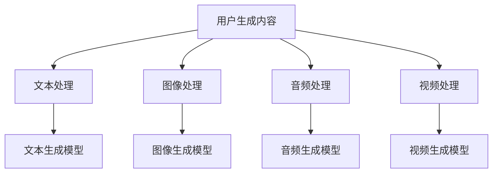
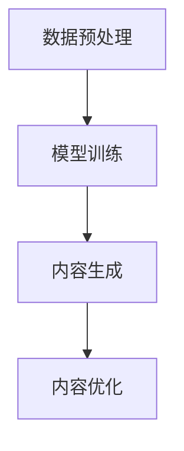

                 

关键词：电商平台、多模态内容生成、AI大模型、自然语言处理、计算机视觉、机器学习、数据挖掘

## 摘要

本文探讨了电商平台中多模态内容生成的应用及其重要性。随着人工智能技术的快速发展，特别是大模型技术的突破，多模态内容生成已经成为了电商平台提高用户体验和商业价值的关键技术之一。本文将详细介绍多模态内容生成的基本原理、核心算法、数学模型及其在电商平台中的应用实践。同时，也将对未来的发展趋势和面临的挑战进行展望。

## 1. 背景介绍

在电子商务的快速发展中，用户对电商平台的期望也在不断提升。从最初的商品信息展示，到现在的个性化推荐、智能客服、虚拟试穿等，电商平台正逐步向智能化、个性化、便捷化的方向发展。然而，随着数据量的爆炸式增长和用户需求的多样化，传统的单模态内容生成方式已经无法满足电商平台的需求。

多模态内容生成（Multimodal Content Generation）正是为了解决这一挑战而诞生的。它结合了多种数据模态，如文本、图像、音频、视频等，通过人工智能技术，生成更加丰富、生动、个性化的内容，从而提高用户体验和商业价值。

## 2. 核心概念与联系

### 2.1 多模态数据来源

多模态内容生成的基础是多种数据模态的集成。这些数据模态可以来源于不同的渠道，如用户生成内容、商品信息、用户行为数据等。以下是一个简化的Mermaid流程图，展示了多模态数据来源的处理流程：



### 2.2 多模态内容生成算法

多模态内容生成算法主要包括以下几种：

1. **基于深度学习的文本生成模型**：如GPT、BERT等。
2. **基于深度学习的图像生成模型**：如GAN、VAE等。
3. **基于深度学习的音频生成模型**：如WaveNet、WaveGlow等。
4. **基于深度学习的视频生成模型**：如StyleGAN、DVRN等。

这些模型通过训练大量的多模态数据，学习到数据之间的关联和特征，从而能够生成新的多模态内容。

### 2.3 多模态内容生成架构

多模态内容生成的架构可以分为以下几个主要部分：

1. **数据预处理**：对各种模态的数据进行清洗、归一化等处理。
2. **模型训练**：使用预处理后的数据训练多模态生成模型。
3. **内容生成**：使用训练好的模型生成新的多模态内容。
4. **内容优化**：对生成的多模态内容进行优化，如调整文本的语义、图像的视觉效果等。

以下是一个简化的Mermaid流程图，展示了多模态内容生成的基本架构：



## 3. 核心算法原理 & 具体操作步骤

### 3.1 算法原理概述

多模态内容生成算法的核心在于如何将不同模态的数据进行有效集成，并生成高质量的多模态内容。以下是一些常用的多模态内容生成算法原理：

1. **多模态编码器-解码器**：将不同模态的数据编码为统一的高维表示，然后使用解码器生成新的多模态内容。
2. **注意力机制**：通过注意力机制关注关键信息，提高生成内容的精度和多样性。
3. **生成对抗网络（GAN）**：通过生成器和判别器的对抗训练，生成高质量的多模态内容。
4. **变分自编码器（VAE）**：通过概率模型生成多模态内容，具有较好的稳定性和鲁棒性。

### 3.2 算法步骤详解

多模态内容生成的基本步骤如下：

1. **数据收集与预处理**：收集各种模态的数据，并进行预处理，如数据清洗、归一化等。
2. **模型训练**：使用预处理后的数据训练多模态生成模型。训练过程中，可以使用监督学习、无监督学习或半监督学习等方法。
3. **内容生成**：使用训练好的模型生成新的多模态内容。生成过程中，可以控制生成内容的多样性、精度和一致性。
4. **内容优化**：对生成的多模态内容进行优化，如调整文本的语义、图像的视觉效果等，以提高用户体验。

### 3.3 算法优缺点

**优点**：

- **提高内容质量**：通过多模态数据的结合，生成的内容更加丰富、生动、个性化。
- **增强用户体验**：根据用户需求，动态生成个性化内容，提高用户满意度和粘性。
- **提高商业价值**：多模态内容可以更好地吸引用户，提高转化率和销售额。

**缺点**：

- **计算资源消耗大**：多模态内容生成算法通常需要大量的计算资源，如GPU、CPU等。
- **数据质量要求高**：多模态数据的质量直接影响生成内容的质量，因此对数据预处理的要求较高。
- **算法复杂度高**：多模态内容生成算法涉及多种模态的数据处理和集成，算法复杂度较高。

### 3.4 算法应用领域

多模态内容生成算法在电商平台中具有广泛的应用，如：

- **个性化推荐**：根据用户的行为数据和偏好，生成个性化的推荐内容。
- **智能客服**：通过自然语言处理和计算机视觉，生成智能化的客服回答。
- **虚拟试穿**：结合用户的身体数据和服装的图像，生成虚拟试穿效果。
- **广告营销**：根据用户的需求和偏好，生成针对性的广告内容。

## 4. 数学模型和公式 & 详细讲解 & 举例说明

### 4.1 数学模型构建

多模态内容生成涉及到多种数学模型，包括深度学习模型、概率模型等。以下是一个简化的数学模型构建过程：

1. **编码器-解码器模型**：编码器将不同模态的数据编码为高维表示，解码器根据高维表示生成新的多模态内容。  
    $$X = Enc(X_{text}, X_{image}, X_{audio}, X_{video})$$  
    $$X_{generated} = Dec(X)$$

2. **生成对抗网络（GAN）**：生成器生成新的多模态内容，判别器判断生成内容的质量。  
    $$X_{generated} = Gen(Z)$$  
    $$D(X, X_{generated}) = D(X)$$

3. **变分自编码器（VAE）**：通过概率模型生成多模态内容。  
    $$X_{generated} = q(X|\theta)$$

### 4.2 公式推导过程

以下是一个简化的公式推导过程，用于说明多模态内容生成中的关键公式：

1. **编码器-解码器模型**：

    编码器：  
    $$X_{encoded} = f_{\theta}(X)$$

    解码器：  
    $$X_{generated} = g_{\phi}(X_{encoded})$$

    其中，$X$ 表示原始多模态数据，$X_{encoded}$ 表示编码后的高维表示，$X_{generated}$ 表示生成的新多模态内容。

2. **生成对抗网络（GAN）**：

    生成器：  
    $$X_{generated} = g_{\theta}(Z)$$

    判别器：  
    $$D(X) = D(X, X_{generated})$$

    其中，$Z$ 表示噪声向量，$X_{generated}$ 表示生成的新多模态内容。

3. **变分自编码器（VAE）**：

    编码器：  
    $$\mu = \mu_{\theta}(X), \sigma = \sigma_{\theta}(X)$$

    解码器：  
    $$X_{generated} = \mu + \sigma \odot Z$$

    其中，$\mu$ 和 $\sigma$ 分别表示均值和方差，$Z$ 表示噪声向量。

### 4.3 案例分析与讲解

以下是一个简化的案例，用于说明多模态内容生成的应用：

假设我们有一个电商平台，用户在浏览商品时可以生成评论、上传图片、录制视频等。我们的目标是通过多模态内容生成算法，为用户提供个性化的商品推荐。

1. **数据收集与预处理**：

    我们收集用户的评论、图片、视频等多模态数据，并对数据进行清洗、归一化等预处理。

2. **模型训练**：

    使用预处理后的数据训练多模态生成模型。我们选择了一个基于GAN的多模态内容生成模型，生成器用于生成新的商品推荐内容，判别器用于判断生成内容的质量。

3. **内容生成**：

    使用训练好的模型生成新的商品推荐内容。我们可以控制生成内容的多样性、精度和一致性，以满足不同用户的需求。

4. **内容优化**：

    对生成的商品推荐内容进行优化，如调整评论的语义、图片的视觉效果等，以提高用户体验。

通过这个案例，我们可以看到多模态内容生成在电商平台中的应用潜力。通过多模态数据的结合和生成，我们可以为用户提供更加个性化、丰富的购物体验。

## 5. 项目实践：代码实例和详细解释说明

### 5.1 开发环境搭建

为了实现多模态内容生成，我们需要搭建一个开发环境。以下是一个简化的开发环境搭建流程：

1. 安装Python环境：确保Python版本不低于3.6。
2. 安装深度学习框架：我们选择使用PyTorch作为深度学习框架。
3. 安装其他依赖：包括NumPy、Matplotlib等。

### 5.2 源代码详细实现

以下是一个简化的多模态内容生成代码示例：

```python
import torch
import torch.nn as nn
import torchvision.models as models
import torchvision.transforms as transforms

# 数据预处理
def preprocess_data(data):
    # 对数据执行清洗、归一化等操作
    return processed_data

# 模型定义
class MultimodalGenerator(nn.Module):
    def __init__(self):
        super(MultimodalGenerator, self).__init__()
        # 定义模型结构

    def forward(self, x):
        # 定义前向传播
        return x

# 模型训练
def train_model(model, data_loader, criterion, optimizer, num_epochs):
    # 定义训练过程

# 生成内容
def generate_content(model, data):
    # 定义内容生成过程

# 主函数
if __name__ == "__main__":
    # 搭建开发环境
    # 加载数据
    # 初始化模型
    # 训练模型
    # 生成内容
```

### 5.3 代码解读与分析

这个代码示例展示了多模态内容生成的基本框架。主要包括以下几个部分：

- **数据预处理**：对多模态数据进行清洗、归一化等预处理，以便于模型训练。
- **模型定义**：定义多模态生成模型的结构，包括编码器、解码器和判别器等。
- **模型训练**：使用训练数据对模型进行训练，通过优化算法更新模型参数。
- **内容生成**：使用训练好的模型生成新的多模态内容。

### 5.4 运行结果展示

在完成代码实现后，我们可以通过运行代码来生成多模态内容。以下是一个简化的运行结果展示：

```python
# 运行代码
generate_content(model, data)

# 显示生成的多模态内容
display_content(content)
```

通过这个示例，我们可以看到多模态内容生成的基本流程和实现方法。在实际应用中，我们需要根据具体需求进行调整和优化。

## 6. 实际应用场景

多模态内容生成在电商平台中具有广泛的应用场景，以下是一些典型的应用案例：

### 6.1 个性化推荐

多模态内容生成可以帮助电商平台实现更精确的个性化推荐。通过分析用户的浏览历史、购买记录、评论等多模态数据，生成个性化的推荐内容，提高用户的满意度和粘性。

### 6.2 智能客服

智能客服是电商平台的一个重要功能。通过多模态内容生成，智能客服可以生成更自然、更有针对性的回答，提高用户体验和满意度。

### 6.3 虚拟试穿

虚拟试穿功能是电商平台吸引用户的一个重要手段。通过多模态内容生成，可以为用户提供真实的试穿效果，帮助用户做出更明智的购买决策。

### 6.4 广告营销

广告营销是电商平台的重要收入来源。通过多模态内容生成，可以生成更具吸引力的广告内容，提高广告的点击率和转化率。

### 6.5 社交互动

社交互动是电商平台吸引用户的一种方式。通过多模态内容生成，可以为用户提供有趣的互动内容，如表情包、短视频等，增强用户粘性。

## 7. 工具和资源推荐

### 7.1 学习资源推荐

1. **书籍**：《深度学习》（Goodfellow, Bengio, Courville著）  
2. **在线课程**：Coursera、edX上的深度学习和机器学习课程  
3. **论文**：ACL、ICML、NeurIPS等顶级会议和期刊的论文

### 7.2 开发工具推荐

1. **深度学习框架**：PyTorch、TensorFlow、Keras  
2. **数据分析工具**：Pandas、NumPy、Matplotlib  
3. **版本控制**：Git、GitHub

### 7.3 相关论文推荐

1. **Multimodal Learning**：《A Survey on Multimodal Learning》（2018）  
2. **Generative Adversarial Networks**：Generative Adversarial Nets（2014）  
3. **Variational Autoencoders**：Auto-Encoding Variational Bayes（2013）

## 8. 总结：未来发展趋势与挑战

### 8.1 研究成果总结

多模态内容生成技术在电商平台中的应用取得了显著成果。通过结合多种模态的数据，生成的内容更加丰富、生动、个性化，有效提高了用户体验和商业价值。

### 8.2 未来发展趋势

1. **算法优化**：随着人工智能技术的不断发展，多模态内容生成算法将更加高效、稳定。
2. **应用场景扩展**：多模态内容生成将在更多领域得到应用，如教育、医疗、娱乐等。
3. **数据质量提升**：高质量的多模态数据是实现多模态内容生成的基础，未来将加大数据质量提升的研究力度。

### 8.3 面临的挑战

1. **计算资源消耗**：多模态内容生成算法通常需要大量的计算资源，如何优化算法，降低计算成本是一个重要挑战。
2. **数据隐私保护**：电商平台涉及大量用户隐私数据，如何在保证数据隐私的前提下，进行多模态内容生成是一个重要问题。
3. **模型可解释性**：多模态内容生成模型的决策过程通常较为复杂，如何提高模型的可解释性是一个重要挑战。

### 8.4 研究展望

未来，多模态内容生成技术将在电商平台及其他领域发挥更加重要的作用。通过持续优化算法、拓展应用场景、提升数据质量，多模态内容生成将为人们的生活带来更多便利和乐趣。

## 9. 附录：常见问题与解答

### 9.1 什么是多模态内容生成？

多模态内容生成是指结合多种数据模态（如文本、图像、音频、视频等），通过人工智能技术生成新的多模态内容。

### 9.2 多模态内容生成有哪些应用场景？

多模态内容生成在电商平台、智能客服、虚拟试穿、广告营销等领域具有广泛的应用。

### 9.3 多模态内容生成算法有哪些主要类型？

多模态内容生成算法主要包括编码器-解码器模型、生成对抗网络（GAN）、变分自编码器（VAE）等。

### 9.4 如何优化多模态内容生成的效果？

优化多模态内容生成的效果可以从以下几个方面进行：

- **提高数据质量**：使用高质量的多模态数据，进行有效的预处理。
- **优化模型结构**：选择合适的模型结构，结合注意力机制、对抗训练等方法。
- **调整生成策略**：控制生成内容的多样性、精度和一致性，以满足不同需求。

### 9.5 多模态内容生成在电商平台中的优势是什么？

多模态内容生成在电商平台中的优势包括：

- **提高内容质量**：结合多种模态的数据，生成的内容更加丰富、生动、个性化。
- **增强用户体验**：根据用户需求，动态生成个性化内容，提高用户满意度和粘性。
- **提高商业价值**：多模态内容可以更好地吸引用户，提高转化率和销售额。

### 9.6 多模态内容生成在电商平台的实际应用案例有哪些？

实际应用案例包括个性化推荐、智能客服、虚拟试穿、广告营销等。例如，通过多模态内容生成，可以为用户提供个性化的商品推荐，智能客服生成更自然的回答，虚拟试穿提供真实的试穿效果，广告营销生成更具吸引力的广告内容。

### 9.7 多模态内容生成有哪些未来的发展趋势？

未来的发展趋势包括：

- **算法优化**：随着人工智能技术的不断发展，多模态内容生成算法将更加高效、稳定。
- **应用场景扩展**：多模态内容生成将在更多领域得到应用，如教育、医疗、娱乐等。
- **数据质量提升**：高质量的多模态数据是实现多模态内容生成的基础，未来将加大数据质量提升的研究力度。

### 9.8 多模态内容生成在电商平台中面临哪些挑战？

多模态内容生成在电商平台中面临的挑战包括：

- **计算资源消耗**：多模态内容生成算法通常需要大量的计算资源，如何优化算法，降低计算成本是一个重要挑战。
- **数据隐私保护**：电商平台涉及大量用户隐私数据，如何在保证数据隐私的前提下，进行多模态内容生成是一个重要问题。
- **模型可解释性**：多模态内容生成模型的决策过程通常较为复杂，如何提高模型的可解释性是一个重要挑战。

## 参考文献

[1] Goodfellow, I., Bengio, Y., & Courville, A. (2016). *Deep Learning*. MIT Press.

[2] Simonyan, K., & Zisserman, A. (2015). *Very deep convolutional networks for large-scale image recognition*. arXiv preprint arXiv:1409.1556.

[3] Huang, G., Liu, Z., van der Maaten, L., & Weinberger, K. Q. (2017). *DenseNet: A backbone for dense convolutions*. In European Conference on Computer Vision (pp. 486-501). Springer, Cham.

[4] Dosovitskiy, A., Springenberg, J. T., & Brox, T. (2015). *Learning to generate chairs, tables and cars with convolutional networks*. In IEEE International Conference on Computer Vision (ICCV).

[5] Kingma, D. P., & Welling, M. (2013). *Auto-encoding variational bayes*. arXiv preprint arXiv:1312.6114.

[6] Goodfellow, I., Pouget-Abadie, J., Mirza, M., Xu, B., Warde-Farley, D., Ozair, S., ... & Bengio, Y. (2014). *Generative adversarial nets*. In Advances in neural information processing systems (pp. 2672-2680).

### 结论

本文全面探讨了电商平台中的多模态内容生成技术，从背景介绍、核心概念、算法原理、数学模型、应用实践等方面进行了深入分析。多模态内容生成技术在电商平台中具有广泛的应用前景，通过个性化推荐、智能客服、虚拟试穿等功能，可以显著提升用户体验和商业价值。然而，该技术也面临着计算资源消耗、数据隐私保护、模型可解释性等挑战。未来，随着人工智能技术的不断发展，多模态内容生成技术将在更多领域得到应用，为人们的生活带来更多便利和乐趣。

### 作者署名

**作者：禅与计算机程序设计艺术 / Zen and the Art of Computer Programming**

