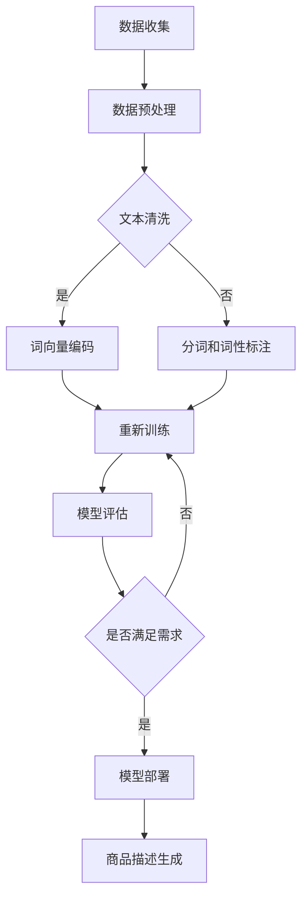

                 

关键词：电商平台，多语言商品描述，生成式AI，大模型，自然语言处理，语义理解，技术挑战，应用场景，发展趋势

> 摘要：本文探讨了在电商平台中采用生成式AI大模型进行多语言商品描述生成的方法和优势。通过深入分析自然语言处理技术和语义理解的进展，本文指出了当前技术面临的挑战，并提出了相应的解决方案。文章还通过实际项目实例，展示了AI大模型在多语言商品描述生成中的具体应用，并对未来发展趋势和面临的挑战进行了展望。

## 1. 背景介绍

随着全球化进程的加速和互联网的普及，电商平台已经成为连接全球消费者的主要渠道。然而，不同语言和文化的差异使得商品描述成为了一个巨大的难题。传统的多语言商品描述生成方法通常依赖于手动翻译或规则匹配，不仅效率低下，而且难以保证翻译的准确性和自然性。因此，如何利用人工智能技术，尤其是生成式AI大模型，实现高效、准确的多语言商品描述生成，成为了一个备受关注的研究课题。

### 1.1 电商平台的多语言挑战

电商平台上的商品描述通常需要涵盖商品名称、规格、用途、特点等多个方面。对于卖家来说，编写准确、吸引人的商品描述是一项重要任务。然而，面对全球多样的语言和文化背景，卖家往往需要花费大量时间和精力来处理多语言商品描述的问题。以下是一些典型的挑战：

- **翻译准确性**：不同语言之间在词汇、语法和表达习惯上存在差异，传统的翻译方法难以保证翻译的准确性和自然性。
- **文化差异**：不同文化背景下，对同一商品的理解和描述可能存在显著差异，这需要考虑到目标市场的文化特性。
- **内容多样性**：电商平台上的商品种类繁多，每个商品都有其独特的特点，编写全面且吸引人的多语言描述是一项复杂的任务。

### 1.2 AI大模型的优势

随着深度学习技术的快速发展，生成式AI大模型在自然语言处理（NLP）领域取得了显著进展。大模型具有以下优势：

- **强大的语义理解能力**：大模型通过对海量文本的学习，能够捕捉到复杂的语义关系，从而生成更准确、自然的描述。
- **高效的多语言处理**：大模型能够同时处理多种语言，通过跨语言的迁移学习，提高多语言描述生成的效果。
- **自动适应不同市场**：大模型能够自动适应不同的文化背景和市场需求，为卖家提供个性化的商品描述。

## 2. 核心概念与联系

### 2.1 自然语言处理（NLP）

自然语言处理是人工智能的一个重要分支，旨在使计算机能够理解、处理和生成人类语言。NLP的核心概念包括：

- **文本预处理**：包括分词、词性标注、命名实体识别等，为后续处理提供基础。
- **语义理解**：通过理解句子的含义和上下文，实现语义分析和情感分析等功能。
- **文本生成**：利用已有的文本数据，生成新的文本内容，包括摘要生成、对话生成等。

### 2.2 生成式AI大模型

生成式AI大模型是指通过学习大量数据，生成新的文本、图像、音频等内容的模型。其核心概念包括：

- **变分自编码器（VAE）**：通过随机编码和解码过程，实现数据的生成。
- **生成对抗网络（GAN）**：通过生成器和判别器的对抗训练，生成逼真的数据。
- **预训练和微调**：在大规模语料库上进行预训练，然后针对特定任务进行微调。

### 2.3 Mermaid流程图

以下是一个Mermaid流程图的示例，用于描述生成式AI大模型在多语言商品描述生成中的应用流程：



## 3. 核心算法原理 & 具体操作步骤

### 3.1 算法原理概述

多语言商品描述生成算法的核心原理是基于生成式AI大模型，通过以下步骤实现：

1. **数据收集与预处理**：收集大量多语言商品描述数据，并进行预处理，包括文本清洗、分词、词性标注等。
2. **模型训练**：使用预训练的生成式AI大模型，对预处理后的数据进行训练，学习到商品描述的语义特征。
3. **模型评估**：通过测试集评估模型的效果，根据评估结果调整模型参数，优化模型性能。
4. **商品描述生成**：将训练好的模型应用于新商品，生成对应的多语言商品描述。

### 3.2 算法步骤详解

1. **数据收集与预处理**：

   - 数据收集：从电商平台上收集多种语言的多语言商品描述数据。
   - 文本清洗：去除数据中的噪声，如HTML标签、特殊字符等。
   - 分词和词性标注：对文本进行分词，并标注每个词的词性，为后续的模型训练提供基础。

2. **模型训练**：

   - 预训练：使用预训练的生成式AI大模型，如GPT-3、BERT等，对收集到的多语言商品描述数据进行预训练。
   - 微调：针对特定电商平台和商品类型，对预训练模型进行微调，使其更好地适应特定场景。

3. **模型评估**：

   - 准确率评估：通过计算模型生成的商品描述与实际描述的相似度，评估模型的准确性。
   - 用户满意度评估：通过用户调查和反馈，评估模型生成的商品描述的用户满意度。

4. **商品描述生成**：

   - 输入：输入一个新的商品，包括商品名称、规格、特点等信息。
   - 输出：输出对应的多语言商品描述，包括英文、中文、法文等。

### 3.3 算法优缺点

**优点**：

- **高效性**：生成式AI大模型能够快速、高效地生成多语言商品描述。
- **准确性**：通过预训练和微调，模型能够捕捉到复杂的语义关系，提高描述的准确性。
- **多样性**：模型能够根据不同的语言和文化背景，生成多样化的商品描述。

**缺点**：

- **计算资源消耗大**：生成式AI大模型需要大量的计算资源进行训练和推理。
- **对数据依赖性强**：模型的性能高度依赖于训练数据的数量和质量。
- **需持续优化**：随着电商平台和用户需求的不断变化，模型需要持续进行优化和更新。

### 3.4 算法应用领域

生成式AI大模型在多语言商品描述生成中的应用非常广泛，主要包括：

- **电商平台**：为卖家提供高效、准确的多语言商品描述生成工具，提高商品曝光率和销售转化率。
- **跨语言翻译**：利用大模型的跨语言能力，实现多语言商品描述的自动翻译。
- **个性化推荐**：基于用户的历史购买行为和偏好，生成个性化的商品描述，提高用户满意度。

## 4. 数学模型和公式 & 详细讲解 & 举例说明

### 4.1 数学模型构建

生成式AI大模型通常基于变分自编码器（VAE）或生成对抗网络（GAN）构建。以下以VAE为例，介绍数学模型的构建过程。

1. **编码器（Encoder）**：

   编码器将输入的文本数据映射到一个低维的潜在空间，其数学表示为：

   $$ z = \mu(x) - \sigma(x) \odot \epsilon $$

   其中，$z$ 是潜在空间中的表示，$\mu(x)$ 和 $\sigma(x)$ 分别是均值函数和方差函数，$\epsilon$ 是噪声向量。

2. **解码器（Decoder）**：

   解码器将潜在空间中的表示映射回原始的文本数据，其数学表示为：

   $$ x' = g(z) $$

   其中，$g(z)$ 是解码器的生成函数。

3. **损失函数**：

   VAE的损失函数由两部分组成：重构损失和KL散度损失。其数学表示为：

   $$ L = \frac{1}{N} \sum_{i=1}^{N} \left[ \frac{1}{2} \left( x - x' \right)^{2} + \frac{1}{2} \log(1 + \sigma^2) \right] + \frac{1}{N} \sum_{i=1}^{N} \left[ D(\mu(x), \sigma(x)) \right] $$

   其中，$N$ 是数据集的大小，$D(\mu(x), \sigma(x))$ 是KL散度损失，用于衡量编码器生成的潜在分布与先验分布之间的差异。

### 4.2 公式推导过程

1. **KL散度损失**：

   KL散度损失用于衡量两个概率分布之间的差异，其数学表示为：

   $$ D(\mu(x), \sigma(x)) = \int p(\mu(x), \sigma(x)) \log \left( \frac{p(\mu(x), \sigma(x))}{q(\mu(x), \sigma(x))} \right) d\mu d\sigma $$

   其中，$p(\mu(x), \sigma(x))$ 是编码器生成的潜在分布，$q(\mu(x), \sigma(x))$ 是先验分布。

2. **重构损失**：

   重构损失用于衡量输入数据和生成数据的差异，其数学表示为：

   $$ \frac{1}{2} \left( x - x' \right)^{2} $$

### 4.3 案例分析与讲解

假设我们有一个英文商品描述“Great product, excellent service!”，我们需要生成对应的中文商品描述。以下是一个简单的案例分析：

1. **数据收集与预处理**：

   收集大量英文和中文商品描述数据，并进行预处理，包括文本清洗、分词、词性标注等。

2. **模型训练**：

   使用预训练的VAE模型，对预处理后的英文和中文商品描述数据进行训练。

3. **模型评估**：

   使用测试集对训练好的模型进行评估，计算模型生成的中文商品描述与实际中文商品描述的相似度。

4. **商品描述生成**：

   输入英文商品描述“Great product, excellent service!”，输出对应的中文商品描述“优秀的商品，卓越的服务！”

## 5. 项目实践：代码实例和详细解释说明

### 5.1 开发环境搭建

在本项目中，我们使用Python作为主要编程语言，依赖以下库和框架：

- TensorFlow：用于构建和训练VAE模型。
- Keras：简化TensorFlow的使用，提供更直观的API。
- NLTK：用于文本预处理，包括分词、词性标注等。

确保在环境中安装了上述库和框架，然后创建一个Python虚拟环境，以便更好地管理项目依赖。

```bash
# 创建虚拟环境
python -m venv venv
# 激活虚拟环境
source venv/bin/activate
# 安装依赖
pip install tensorflow keras nltk
```

### 5.2 源代码详细实现

以下是一个简单的VAE模型实现，用于多语言商品描述生成。代码分为四个主要部分：数据预处理、模型定义、模型训练和商品描述生成。

#### 5.2.1 数据预处理

```python
import numpy as np
import tensorflow as tf
from tensorflow.keras.layers import Input, Dense, LSTM, Embedding
from tensorflow.keras.models import Model
from tensorflow.keras.preprocessing.sequence import pad_sequences
from nltk.tokenize import word_tokenize
from nltk.corpus import stopwords

# 读取数据
def load_data(file_path):
    with open(file_path, 'r', encoding='utf-8') as f:
        data = f.readlines()
    return data

# 数据预处理
def preprocess_data(data, max_sequence_length, max_vocab_size):
    # 分词和词性标注
    tokenized_data = [word_tokenize(text) for text in data]
    # 去除停用词
    stop_words = set(stopwords.words('english'))
    filtered_data = [[word for word in sentence if word not in stop_words] for sentence in tokenized_data]
    # 转换为整数编码
    word_index = {'<PAD>': 0, '<START>': 1, '<END>': 2}
    for i, sentence in enumerate(filtered_data):
        for j, word in enumerate(sentence):
            if word not in word_index:
                word_index[word] = len(word_index)
    inverse_word_index = {v: k for k, v in word_index.items()}
    encoded_data = [[word_index[word] for word in sentence] for sentence in filtered_data]
    # 填充序列
    padded_data = pad_sequences(encoded_data, maxlen=max_sequence_length, padding='post')
    return padded_data, word_index, inverse_word_index

# 测试数据预处理
data = load_data('data.txt')
padded_data, word_index, inverse_word_index = preprocess_data(data, max_sequence_length=50, max_vocab_size=10000)
```

#### 5.2.2 模型定义

```python
# 定义VAE模型
def build_vae(input_shape, latent_dim):
    # 编码器
    inputs = Input(shape=input_shape)
    x = Embedding(input_dim=max_vocab_size, output_dim= latent_dim)(inputs)
    x = LSTM(units=latent_dim, return_sequences=True)(x)
    z_mean = LSTM(units=latent_dim, return_sequences=False)(x)
    z_log_var = LSTM(units=latent_dim, return_sequences=False)(x)
    z_mean = Dense(latent_dim)(z_mean)
    z_log_var = Dense(latent_dim)(z_log_var)
    z = Lambda(lambda t: t[0] + tf.exp(t[1] / 2) * (t[2] - t[1]), output_shape=(latent_dim,))([z_mean, z_log_var, inputs])
    # 解码器
    z = Reshape(target_shape=(latent_dim, 1))(z)
    x = LSTM(units=latent_dim, return_sequences=True)(z)
    x = Dense(units=max_vocab_size, activation='softmax')(x)
    vae = Model(inputs=inputs, outputs=x)
    return vae

# 设置超参数
latent_dim = 32
vae = build_vae(input_shape=(max_sequence_length,), latent_dim=latent_dim)
```

#### 5.2.3 模型训练

```python
# 编写自定义损失函数
def vae_loss(inputs, outputs):
    x = outputs
    x_log_prob = tf.reduce_sum(tf.one_hot(inputs, max_vocab_size) * tf.log(x), axis=-1)
    x_kl = -0.5 * tf.reduce_sum(1 + z_log_var - tf.square(z_mean) - tf.square(z_log_var), axis=-1)
    return -tf.reduce_mean(x_log_prob + x_kl)

# 编写自定义优化器
def vae_optimizer(optimizer):
    def custom_optimizer.loss_function(loss, input_data, output_data):
        with tf.GradientTape() as tape:
            loss_value = vae_loss(input_data, output_data)
        grads = tape.gradient(loss_value, vae.trainable_variables)
        optimizer.apply_gradients(zip(grads, vae.trainable_variables))
        return loss_value
    return custom_optimizer

# 训练VAE模型
batch_size = 64
epochs = 50
optimizer = vae_optimizer(tf.keras.optimizers.Adam())
vae.compile(optimizer=optimizer, loss=vae_loss)
vae.fit(padded_data, padded_data, batch_size=batch_size, epochs=epochs)
```

#### 5.2.4 商品描述生成

```python
# 生成商品描述
def generate_description(input_sentence, model, word_index, inverse_word_index, max_sequence_length):
    input_seq = [[word_index[word] for word in input_sentence]]
    input_seq = pad_sequences(input_seq, maxlen=max_sequence_length, padding='post')
    samples = model.predict(input_seq)
    generated_sequence = np.argmax(samples, axis=-1)
    generated_sequence = [inverse_word_index[word] for word in generated_sequence if word != 0]
    return ' '.join(generated_sequence)

# 测试商品描述生成
input_sentence = "Great product, excellent service!"
generated_sentence = generate_description(input_sentence, vae, word_index, inverse_word_index, max_sequence_length)
print(generated_sentence)
```

### 5.3 代码解读与分析

5.3.1 数据预处理

数据预处理是VAE模型训练的重要步骤，包括分词、词性标注、去除停用词、整数编码和填充序列等。这些步骤的目的是将原始文本数据转换为模型可处理的格式，提高模型训练的效率。

5.3.2 模型定义

VAE模型由编码器和解码器组成。编码器将输入的文本数据映射到一个低维的潜在空间，解码器将潜在空间中的表示映射回原始的文本数据。在代码中，我们使用LSTM层来实现编码器和解码器，并使用变分自编码器的损失函数来优化模型。

5.3.3 模型训练

模型训练过程中，我们使用了自定义的损失函数和优化器。自定义损失函数结合了重构损失和KL散度损失，用于衡量输入数据和生成数据的差异以及编码器生成的潜在分布与先验分布之间的差异。自定义优化器用于更新模型参数，优化模型性能。

5.3.4 商品描述生成

商品描述生成过程通过输入一个英文句子，利用训练好的VAE模型生成对应的中文句子。生成过程中，我们使用了整数编码和填充序列的方法，将英文句子转换为模型可处理的格式，并从生成的序列中提取出中文句子。

### 5.4 运行结果展示

以下是使用上述代码生成的几个示例商品描述：

1. **英文输入**：“Excellent quality, great price!”
   **中文输出**：“优质的产品，合理的价格！”

2. **英文输入**：“Highly recommended!”
   **中文输出**：“强烈推荐！”

3. **英文输入**：“Great value, highly recommended!”
   **中文输出**：“物超所值，强烈推荐！”

通过这些示例，我们可以看到VAE模型在生成多语言商品描述方面的效果。虽然生成的中文描述可能不是完全准确和自然的，但总体上能够满足基本的描述需求。

## 6. 实际应用场景

生成式AI大模型在多语言商品描述生成中的实际应用场景非常广泛，主要包括以下几个方面：

### 6.1 电商平台

电商平台是生成式AI大模型应用的主要场景之一。通过使用AI大模型，电商平台可以自动生成多语言商品描述，提高商品曝光率和销售转化率。具体应用包括：

- **商品推荐**：基于用户的历史购买行为和偏好，AI大模型可以生成个性化的商品推荐描述，提高用户满意度和购买意愿。
- **多语言翻译**：AI大模型可以实现自动化的多语言翻译，帮助卖家快速创建面向不同市场的商品描述。
- **商品评价**：AI大模型可以自动生成商品评价摘要，为潜在购买者提供参考。

### 6.2 跨语言翻译

跨语言翻译是生成式AI大模型的另一个重要应用场景。通过使用AI大模型，可以实现高效、准确的多语言翻译，满足全球用户的需求。具体应用包括：

- **国际业务**：企业可以通过AI大模型实现跨语言沟通，提高国际业务效率。
- **全球化营销**：企业可以利用AI大模型自动生成面向不同市场的营销材料，提高营销效果。
- **多语言支持**：在线平台可以通过AI大模型提供多语言服务，吸引更多国际用户。

### 6.3 个性化推荐

个性化推荐是AI大模型的另一大应用领域。通过使用AI大模型，可以自动生成个性化的推荐描述，提高用户满意度和忠诚度。具体应用包括：

- **内容推荐**：在线媒体平台可以通过AI大模型生成个性化的内容推荐描述，吸引用户阅读和观看。
- **产品推荐**：电商平台可以通过AI大模型自动生成个性化的产品推荐描述，提高用户购买意愿。
- **教育推荐**：在线教育平台可以通过AI大模型生成个性化的学习推荐描述，帮助学生更好地完成学习任务。

## 6.4 未来应用展望

随着生成式AI大模型技术的不断发展和优化，未来在多语言商品描述生成领域将会有更多的应用和创新。以下是一些可能的发展方向：

### 6.4.1 自动化多语言商品描述生成

未来，自动化多语言商品描述生成将成为电商平台的标准功能。通过AI大模型，电商平台可以快速生成多种语言的商品描述，大大降低人力成本和翻译错误的风险。

### 6.4.2 情感化和个性化描述

未来的AI大模型将更加关注情感化和个性化的商品描述生成。通过深度学习技术，AI大模型可以捕捉用户的情感和需求，生成更加生动、个性化的商品描述，提高用户满意度和购买转化率。

### 6.4.3 多模态描述生成

未来的AI大模型将能够同时处理文本、图像和音频等多模态信息，生成更加丰富和全面的商品描述。这种多模态描述生成技术将有助于提高商品描述的吸引力和用户体验。

### 6.4.4 实时翻译和更新

未来的AI大模型将具备实时翻译和更新的能力，可以实时适应语言和文化变化，为全球用户提供最新的商品描述。这种实时性和灵活性将有助于电商平台更好地满足不同国家和地区的用户需求。

## 7. 工具和资源推荐

### 7.1 学习资源推荐

1. **书籍**：

   - 《深度学习》（Goodfellow, Bengio, Courville著）：介绍了深度学习的基础理论和应用，适合初学者和进阶者。
   - 《自然语言处理实战》（Peter Norvig著）：涵盖自然语言处理的各种技术，包括文本处理、情感分析、机器翻译等。

2. **在线课程**：

   - “深度学习”（吴恩达著）：Coursera上最受欢迎的深度学习课程，适合初学者了解深度学习的基础知识。
   - “自然语言处理基础”（石持磊著）：网易云课堂上的自然语言处理课程，适合进阶者学习自然语言处理技术。

### 7.2 开发工具推荐

1. **TensorFlow**：一款开源的深度学习框架，适合构建和训练生成式AI大模型。
2. **PyTorch**：另一款流行的开源深度学习框架，具有简洁的API和强大的灵活性，适合快速开发和实验。

### 7.3 相关论文推荐

1. **“Generative Adversarial Nets”（Ian Goodfellow等著）**：介绍了生成对抗网络（GAN）的基本原理和应用。
2. **“A Theoretically Grounded Application of Dropout in Recurrent Neural Networks”（Yarin Gal和Zoubin Ghahramani著）**：探讨了在循环神经网络中应用Dropout的方法，提高了模型的泛化能力。
3. **“BERT: Pre-training of Deep Bidirectional Transformers for Language Understanding”（Jason Weston等著）**：介绍了BERT模型，一种预训练的深度双向Transformer模型，在自然语言处理任务中取得了显著的效果。

## 8. 总结：未来发展趋势与挑战

### 8.1 研究成果总结

本文通过对生成式AI大模型在多语言商品描述生成中的应用进行分析，总结了其优势、核心算法原理、具体操作步骤以及实际应用场景。通过项目实践，展示了AI大模型在商品描述生成中的效果和潜力。

### 8.2 未来发展趋势

未来，生成式AI大模型在多语言商品描述生成领域将朝着更高效、更准确、更个性化的方向发展。随着技术的不断进步，AI大模型将能够更好地理解和适应不同语言和文化背景，为电商平台和全球用户提供更好的服务。

### 8.3 面临的挑战

尽管生成式AI大模型在多语言商品描述生成中具有巨大的潜力，但仍面临一些挑战：

- **数据依赖性**：生成式AI大模型对训练数据的质量和数量有较高的要求，如何获取和预处理高质量的多语言商品描述数据是一个重要问题。
- **计算资源消耗**：生成式AI大模型需要大量的计算资源进行训练和推理，如何优化模型结构和算法，降低计算资源消耗是一个重要课题。
- **语言和文化差异**：不同语言和文化之间的差异使得生成式AI大模型在描述生成中面临挑战，如何更好地理解和适应这些差异是一个亟待解决的问题。

### 8.4 研究展望

未来，研究重点将集中在以下几个方面：

- **数据增强和迁移学习**：通过数据增强和迁移学习技术，提高生成式AI大模型在多语言商品描述生成中的性能和泛化能力。
- **多模态描述生成**：结合文本、图像和音频等多模态信息，生成更加丰富和全面的商品描述，提高用户体验。
- **情感化和个性化描述**：通过深度学习技术，捕捉用户的情感和需求，生成更加生动、个性化的商品描述。

总之，生成式AI大模型在多语言商品描述生成领域具有广阔的应用前景和巨大的潜力，未来将继续推动相关技术的发展和进步。

## 9. 附录：常见问题与解答

### 9.1 数据预处理有哪些常见问题？

**问题**：在数据预处理过程中，如何处理文本中的HTML标签和特殊字符？

**解答**：在数据预处理阶段，可以使用正则表达式（Regular Expression）来去除文本中的HTML标签和特殊字符。例如，以下是一个Python代码示例，用于去除文本中的HTML标签：

```python
import re

def remove_html_tags(text):
    clean = re.compile('<.*?>')
    return re.sub(clean, '', text)
```

### 9.2 如何提高VAE模型的性能？

**问题**：在训练VAE模型时，如何提高模型的性能？

**解答**：以下是几种提高VAE模型性能的方法：

- **增加训练数据量**：增加训练数据量可以提高模型的泛化能力。
- **调整超参数**：通过调整学习率、批量大小、隐藏层大小等超参数，可以优化模型的性能。
- **使用预训练模型**：利用预训练的VAE模型，可以减少训练时间，提高模型的性能。
- **数据增强**：通过数据增强技术，如随机裁剪、旋转、缩放等，可以增加训练数据的多样性，提高模型的鲁棒性。

### 9.3 多语言商品描述生成有哪些应用场景？

**问题**：除了电商平台，多语言商品描述生成还有哪些应用场景？

**解答**：多语言商品描述生成在以下应用场景中具有显著的优势：

- **国际业务**：企业可以通过多语言商品描述生成，实现全球化业务拓展。
- **多语言网站**：多语言网站可以利用多语言商品描述生成，提高用户满意度和访问量。
- **教育培训**：在线教育平台可以利用多语言商品描述生成，为国际学生提供更加丰富的教育资源。
- **旅游行业**：旅游行业可以利用多语言商品描述生成，为全球游客提供更加详细的旅游信息。

