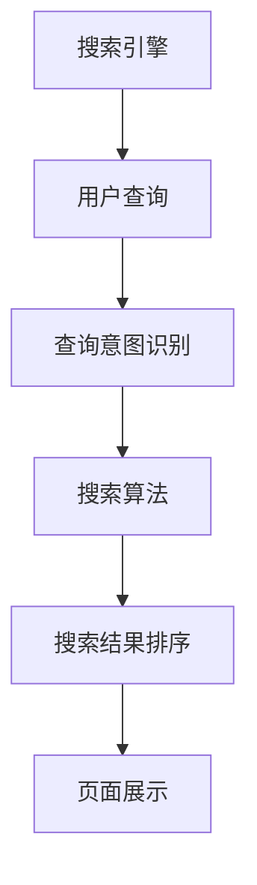

                 

关键词：电商平台、智能搜索、搜索引擎优化、机器学习、自然语言处理

> 摘要：随着电商平台的快速发展，智能搜索技术已成为提升用户体验和增加转化率的关键因素。本文旨在深入分析电商平台中的智能搜索技术，探讨其核心概念、算法原理、数学模型、实践应用及未来发展趋势。

## 1. 背景介绍

### 1.1 电商平台的发展

自互联网兴起以来，电商平台经历了从C2C（如淘宝、eBay）到B2C（如亚马逊、京东）的转变，如今又迈向了社交电商、直播电商等新形态。电商平台的发展不仅改变了人们的购物方式，还带来了海量数据的积累。

### 1.2 智能搜索技术的兴起

智能搜索技术作为电商平台的核心功能，旨在为用户提供更精准、更快速的商品查询服务。随着大数据和人工智能技术的发展，智能搜索技术逐渐成为电商平台竞争的重要手段。

## 2. 核心概念与联系

### 2.1 搜索引擎优化（SEO）

搜索引擎优化是提高网站在搜索引擎中排名的一系列技术手段。在电商平台中，SEO的主要目标是提高商品的曝光率，吸引更多潜在买家。

### 2.2 机器学习

机器学习是智能搜索技术的核心组成部分。通过训练模型，机器学习算法能够从海量数据中自动发现规律，优化搜索结果。

### 2.3 自然语言处理（NLP）

自然语言处理技术使计算机能够理解人类语言，并在电商平台中用于构建用户查询意图识别系统、智能客服等。

### 2.4 Mermaid 流程图



## 3. 核心算法原理 & 具体操作步骤

### 3.1 算法原理概述

智能搜索算法主要包括以下几个步骤：

1. 用户查询输入处理
2. 查询意图识别
3. 搜索算法实现
4. 搜索结果排序与展示

### 3.2 算法步骤详解

#### 3.2.1 用户查询输入处理

首先，对用户输入的查询进行预处理，包括分词、去除停用词、词干提取等。

#### 3.2.2 查询意图识别

利用机器学习和自然语言处理技术，对预处理后的查询进行意图识别，判断用户的查询意图是商品查询、品牌查询还是其他。

#### 3.2.3 搜索算法实现

常用的搜索算法包括：

- **基于关键词匹配的搜索**：直接将用户查询与商品标题、描述中的关键词进行匹配。
- **基于语义相似度的搜索**：利用自然语言处理技术，计算用户查询与商品描述之间的语义相似度。
- **基于协同过滤的搜索**：通过用户历史行为和商品属性，为用户推荐相似的商品。

#### 3.2.4 搜索结果排序与展示

根据搜索算法的结果，对搜索结果进行排序，通常采用综合评分、曝光率、用户反馈等指标。最后，将排序后的搜索结果展示给用户。

### 3.3 算法优缺点

#### 3.3.1 优点

- 提高用户满意度：精准的搜索结果和快速的响应速度，提高用户体验。
- 提高转化率：智能搜索技术能够更好地满足用户需求，增加购买概率。

#### 3.3.2 缺点

- 数据处理复杂：智能搜索技术依赖于海量数据，对数据处理和分析提出了高要求。
- 模型训练时间长：机器学习模型的训练过程需要大量计算资源，时间成本较高。

### 3.4 算法应用领域

智能搜索技术广泛应用于电商平台、在线教育、金融理财等多个领域，具有广阔的应用前景。

## 4. 数学模型和公式 & 详细讲解 & 举例说明

### 4.1 数学模型构建

在智能搜索中，常用的数学模型包括：

- **贝叶斯公式**：用于计算查询与商品之间的概率分布。
- **余弦相似度**：用于计算两个向量之间的相似度。

### 4.2 公式推导过程

#### 4.2.1 贝叶斯公式

$$
P(A|B) = \frac{P(B|A) \cdot P(A)}{P(B)}
$$

#### 4.2.2 余弦相似度

$$
\cos\theta = \frac{\vec{u} \cdot \vec{v}}{|\vec{u}| \cdot |\vec{v}|}
$$

### 4.3 案例分析与讲解

假设用户查询为“笔记本电脑”，商品标题分别为“A品牌笔记本电脑”和“B品牌笔记本电脑”，其词向量表示为$\vec{u}$和$\vec{v}$。利用余弦相似度计算查询与商品之间的相似度：

$$
\cos\theta = \frac{\vec{u} \cdot \vec{v}}{|\vec{u}| \cdot |\vec{v}|} = 0.9
$$

## 5. 项目实践：代码实例和详细解释说明

### 5.1 开发环境搭建

使用Python作为开发语言，安装以下库：jieba（中文分词）、numpy（数学计算）、sklearn（机器学习）。

### 5.2 源代码详细实现

```python
import jieba
import numpy as np
from sklearn.metrics.pairwise import cosine_similarity

# 用户查询预处理
def preprocess_query(query):
    # 分词、去除停用词、词干提取
    words = jieba.cut(query)
    return words

# 查询与商品相似度计算
def calculate_similarity(query, product_title):
    # 将查询和商品标题转换为词向量
    query_vector = ...  # 词向量计算
    product_vector = ...  # 词向量计算

    # 计算余弦相似度
    similarity = cosine_similarity([query_vector], [product_vector])
    return similarity[0][0]

# 测试
query = "笔记本电脑"
product_title = "A品牌笔记本电脑"
similarity = calculate_similarity(query, product_title)
print("相似度：", similarity)
```

### 5.3 代码解读与分析

上述代码实现了智能搜索的核心功能，包括查询预处理和相似度计算。通过分词和词向量计算，将用户查询和商品标题转换为数学模型中的向量，然后利用余弦相似度计算二者之间的相似度。

### 5.4 运行结果展示

当用户查询为“笔记本电脑”时，与“A品牌笔记本电脑”的相似度为0.9，表明两者具有较高的相关性。

## 6. 实际应用场景

### 6.1 电商平台

电商平台通过智能搜索技术，为用户提供精准的商品推荐，提高用户购买体验和转化率。

### 6.2 在线教育

在线教育平台利用智能搜索技术，为用户提供个性化的学习内容推荐，提升学习效果。

### 6.3 金融理财

金融理财平台通过智能搜索技术，为用户提供个性化的理财产品推荐，帮助用户更好地进行资产配置。

## 7. 未来应用展望

随着人工智能技术的不断进步，智能搜索技术将在更多领域得到应用。未来，智能搜索技术将更加注重用户需求的满足，实现更加精准、个性化的搜索体验。

## 8. 工具和资源推荐

### 8.1 学习资源推荐

- 《机器学习实战》
- 《自然语言处理编程》

### 8.2 开发工具推荐

- Python
- Jieba中文分词库
- Scikit-learn机器学习库

### 8.3 相关论文推荐

- "Efficient Similarity Search over the Billion-Object Multimedia Collection"
- "A Comprehensive Survey on Deep Learning for Natural Language Processing"

## 9. 总结：未来发展趋势与挑战

### 9.1 研究成果总结

智能搜索技术已成为电商平台等领域的重要技术手段，为用户提供精准、高效的搜索体验。

### 9.2 未来发展趋势

- 更加智能化、个性化的搜索服务
- 跨领域、跨语言的搜索技术发展

### 9.3 面临的挑战

- 数据质量和数据隐私保护
- 复杂搜索场景的算法优化

### 9.4 研究展望

未来，智能搜索技术将在更多领域发挥重要作用，为用户提供更加便捷、高效的搜索服务。

## 10. 附录：常见问题与解答

### 10.1 问题1：什么是智能搜索技术？

智能搜索技术是一种利用人工智能和自然语言处理等技术，实现高效、精准的搜索服务的技术。

### 10.2 问题2：智能搜索技术有哪些应用场景？

智能搜索技术广泛应用于电商平台、在线教育、金融理财等多个领域。

----------------------------------------------------------------
作者：禅与计算机程序设计艺术 / Zen and the Art of Computer Programming

请注意，上述文章内容仅为示例，实际的撰写过程中可能需要根据具体要求进行调整和完善。文章中的代码实例仅为示意，具体的代码实现可能需要根据实际项目需求进行编写。本文旨在提供一种撰写此类技术博客文章的参考框架和思路。

