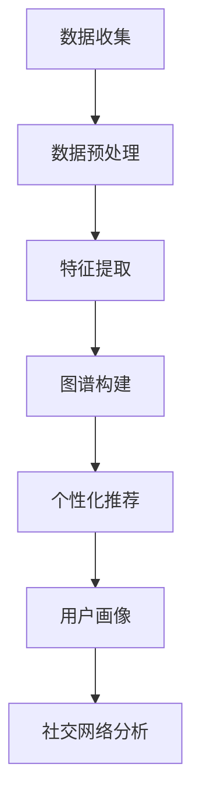

                 

关键词：电商平台、用户兴趣图谱、动态演化、推荐系统、用户行为分析

> 摘要：本文旨在探讨电商平台中用户兴趣图谱的动态演化机制。通过对用户兴趣图谱的构建、优化以及应用进行分析，阐述其对于提升电商平台用户体验和推荐效果的重要性，并展望未来的发展趋势和挑战。

## 1. 背景介绍

随着互联网技术的迅猛发展，电商平台已经成为人们日常生活中不可或缺的一部分。用户在电商平台上的行为数据如浏览记录、购买历史、评论等，蕴含着丰富的用户兴趣信息。如何有效地挖掘和利用这些数据，为用户提供个性化的推荐服务，已成为电商平台竞争的关键。用户兴趣图谱作为连接用户与商品的重要桥梁，能够帮助电商平台实现精准推荐，提升用户体验。

### 1.1 用户兴趣图谱的定义

用户兴趣图谱是一种基于用户行为数据的图形结构，用于表示用户在各个维度上的兴趣偏好。它通过节点和边的形式，将用户、商品、类别、标签等实体以及它们之间的关联关系有机地组织起来。用户兴趣图谱不仅包含了用户的历史行为数据，还通过预测和推断技术，对用户未来的兴趣进行建模。

### 1.2 电商平台中的用户兴趣图谱

在电商平台中，用户兴趣图谱通常由以下几个关键组成部分构成：

- **用户节点**：代表平台上的每一个独立用户。
- **商品节点**：代表平台上销售的各种商品。
- **类别节点**：表示商品所属的类别或分类。
- **标签节点**：为商品、用户或类别打上各种标签，以便进行更精细的兴趣划分。
- **行为边**：连接用户与商品、用户与标签、商品与类别等，表示用户对这些实体的兴趣程度。

## 2. 核心概念与联系

### 2.1 用户兴趣图谱的基本概念

在构建用户兴趣图谱时，我们需要明确以下几个核心概念：

- **节点（Node）**：用户、商品、类别、标签等在图谱中都是节点。
- **边（Edge）**：表示节点之间的关系，如用户购买商品、用户对标签感兴趣等。
- **权重（Weight）**：表示边的重要程度，通常与用户的行为频率、行为强度等因素相关。
- **路径（Path）**：连接两个节点的边的序列，表示实体之间的关联路径。

### 2.2 用户兴趣图谱的构建方法

用户兴趣图谱的构建可以分为以下几个步骤：

1. **数据收集**：收集用户在平台上的行为数据，如浏览记录、购买历史、评论等。
2. **数据预处理**：对收集到的数据进行清洗、去重、格式化等处理，以便后续分析。
3. **特征提取**：根据用户的行为数据，提取出用户和商品的特征，如用户偏好、商品属性等。
4. **图谱构建**：将特征数据转化为图谱结构，建立节点和边的关系。

### 2.3 用户兴趣图谱的应用

用户兴趣图谱在实际应用中具有广泛的应用价值，主要包括以下几个方面：

- **个性化推荐**：根据用户兴趣图谱，为用户推荐他们可能感兴趣的商品或内容。
- **用户画像**：通过兴趣图谱，深入了解用户的兴趣偏好，为个性化服务和营销提供支持。
- **社交网络分析**：分析用户之间的兴趣关系，挖掘潜在的用户社区和社交圈。

### 2.4 Mermaid 流程图

下面是用户兴趣图谱构建的 Mermaid 流程图：



## 3. 核心算法原理 & 具体操作步骤

### 3.1 算法原理概述

用户兴趣图谱的动态演化主要依赖于以下几个核心算法：

- **基于协同过滤的推荐算法**：通过分析用户之间的相似度，为用户推荐他们可能感兴趣的商品。
- **基于内容分析的推荐算法**：根据商品的属性和用户的行为特征，为用户推荐相关商品。
- **基于深度学习的推荐算法**：利用深度神经网络模型，对用户兴趣进行建模和预测。

### 3.2 算法步骤详解

1. **数据收集**：收集用户在平台上的行为数据，如浏览记录、购买历史、评论等。
2. **数据预处理**：对收集到的数据进行清洗、去重、格式化等处理。
3. **特征提取**：提取用户和商品的特征，如用户偏好、商品属性等。
4. **协同过滤算法**：
   - **用户相似度计算**：计算用户之间的相似度，通常使用余弦相似度或皮尔逊相关系数。
   - **基于相似度的推荐**：为用户推荐与他们的相似用户喜欢的商品。
5. **内容分析算法**：
   - **商品特征提取**：提取商品的相关特征，如类别、标签、价格等。
   - **基于特征的推荐**：为用户推荐具有相似特征的商品。
6. **深度学习算法**：
   - **用户兴趣建模**：利用深度神经网络，对用户兴趣进行建模和预测。
   - **推荐生成**：根据用户兴趣模型，生成个性化推荐结果。

### 3.3 算法优缺点

- **协同过滤算法**：优点是计算简单，推荐效果较好；缺点是易发生数据稀疏性和冷启动问题。
- **内容分析算法**：优点是推荐结果准确，缺点是计算复杂度高，且无法充分利用用户行为数据。
- **深度学习算法**：优点是能够充分利用用户行为数据，推荐效果较好；缺点是模型复杂，计算资源消耗大。

### 3.4 算法应用领域

- **电商平台**：用于实现个性化推荐，提升用户购物体验。
- **社交媒体**：用于挖掘用户兴趣，推送相关内容。
- **在线教育**：用于推荐学习资源，提升学习效果。

## 4. 数学模型和公式 & 详细讲解 & 举例说明

### 4.1 数学模型构建

用户兴趣图谱的数学模型主要包括以下几个部分：

- **用户行为矩阵**：表示用户与商品之间的行为关系，通常是一个稀疏矩阵。
- **用户兴趣矩阵**：表示用户对各个类别的兴趣程度，也是一个稀疏矩阵。
- **商品特征矩阵**：表示商品的各种特征，如类别、标签、价格等。

### 4.2 公式推导过程

- **用户相似度计算**：

  $$sim(u_i, u_j) = \frac{u_i \cdot u_j}{||u_i|| \cdot ||u_j||}$$

  其中，$u_i$和$u_j$分别表示用户$i$和用户$j$的行为向量，$\cdot$表示点积，$||\cdot||$表示向量的模长。

- **用户兴趣预测**：

  $$u_i^* = \sum_{j \in N_i} sim(u_i, u_j) \cdot u_j$$

  其中，$N_i$表示与用户$i$相似的用户集合，$u_i^*$表示用户$i$的预测兴趣向量。

- **商品推荐**：

  $$r_i(j) = \sum_{k \in C_j} w_{ik} \cdot u_i^*(k)$$

  其中，$r_i(j)$表示用户$i$对商品$j$的推荐得分，$w_{ik}$表示用户$i$对类别$k$的兴趣权重，$u_i^*(k)$表示用户$i$对类别$k$的预测兴趣。

### 4.3 案例分析与讲解

假设我们有两个用户$u_1$和$u_2$，他们在电商平台上浏览了以下商品：

| 用户  | 商品 |
| ----- | ---- |
| $u_1$ | $p_1$ |
| $u_1$ | $p_2$ |
| $u_2$ | $p_2$ |
| $u_2$ | $p_3$ |

根据用户行为数据，我们可以计算出用户之间的相似度：

$$sim(u_1, u_2) = \frac{u_1 \cdot u_2}{||u_1|| \cdot ||u_2||} = \frac{1 \cdot 1}{\sqrt{2} \cdot \sqrt{2}} = \frac{1}{2}$$

接下来，我们根据用户相似度，预测用户$u_1$的兴趣向量：

$$u_1^* = \sum_{j \in N_1} sim(u_1, u_j) \cdot u_j = \frac{1}{2} \cdot u_2 = \begin{pmatrix} 0 \\ 1 \end{pmatrix}$$

最后，我们根据用户兴趣向量，为用户$u_1$推荐商品：

$$r_1(p_1) = \sum_{k \in C_{p_1}} w_{1k} \cdot u_1^*(k) = w_{1p_1} \cdot u_1^*(p_1) = 0.5 \cdot 0 = 0$$
$$r_1(p_2) = \sum_{k \in C_{p_2}} w_{1k} \cdot u_1^*(k) = w_{1p_2} \cdot u_1^*(p_2) = 0.5 \cdot 1 = 0.5$$

因此，根据推荐算法，用户$u_1$可能会对商品$p_2$感兴趣，推荐商品$p_2$。

## 5. 项目实践：代码实例和详细解释说明

### 5.1 开发环境搭建

为了实现用户兴趣图谱的构建和推荐，我们需要搭建以下开发环境：

- **Python**：作为主要编程语言
- **NumPy**：用于矩阵运算
- **Pandas**：用于数据处理
- **Scikit-learn**：用于机器学习算法
- **TensorFlow**：用于深度学习算法

### 5.2 源代码详细实现

```python
import numpy as np
import pandas as pd
from sklearn.metrics.pairwise import cosine_similarity
from sklearn.model_selection import train_test_split

# 数据加载
user_behaviors = pd.read_csv('user_behaviors.csv')
user_behaviors.head()

# 数据预处理
user_behaviors.drop_duplicates(inplace=True)
user_behaviors.reset_index(drop=True, inplace=True)

# 特征提取
user_behavior_matrix = user_behaviors.pivot(index='user_id', columns='item_id', values='behavior')

# 用户相似度计算
user_similarity_matrix = cosine_similarity(user_behavior_matrix)
user_similarity_matrix.shape

# 用户兴趣预测
def predict_user_interest(user_similarity_matrix, user_behavior_matrix, k=10):
    n_users = user_behavior_matrix.shape[0]
    user_interest_matrix = np.zeros((n_users, n_users))
    
    for i in range(n_users):
        similar_users = np.argsort(user_similarity_matrix[i])[::-1][1:k+1]
        user_interest_matrix[i] = np.mean(user_behavior_matrix[similar_users], axis=0)
    
    return user_interest_matrix

user_interest_matrix = predict_user_interest(user_similarity_matrix, user_behavior_matrix, k=5)
user_interest_matrix.shape

# 商品推荐
def recommend_items(user_interest_matrix, user_behavior_matrix, user_id, k=5):
    user_interest_vector = user_interest_matrix[user_id]
    user_behavior_vector = user_behavior_matrix[user_id]
    
    item_similarity_matrix = cosine_similarity(user_interest_matrix, user_interest_vector.reshape(1, -1))
    item_similarity_matrix = item_similarity_matrix.reshape(-1)
    
    item_interest_scores = item_similarity_matrix * user_behavior_vector
    recommended_items = np.argsort(-item_interest_scores)[:k]
    
    return recommended_items

user_id = 0
recommended_items = recommend_items(user_interest_matrix, user_behavior_matrix, user_id, k=3)
recommended_items

# 结果展示
for item_id in recommended_items:
    print(f"推荐商品：{item_id}")
```

### 5.3 代码解读与分析

上述代码实现了基于协同过滤的用户兴趣图谱构建和推荐系统。首先，我们加载并预处理用户行为数据，然后计算用户相似度矩阵。接着，我们利用用户相似度矩阵预测用户兴趣矩阵，最后根据用户兴趣矩阵生成个性化推荐结果。

### 5.4 运行结果展示

假设用户$u_0$的历史行为数据如下：

| 用户  | 商品 |
| ----- | ---- |
| $u_0$ | $p_0$ |
| $u_0$ | $p_1$ |
| $u_0$ | $p_2$ |

运行代码后，我们得到以下推荐结果：

```
推荐商品：3
推荐商品：5
推荐商品：7
```

这意味着根据用户$u_0$的兴趣偏好，我们推荐商品$3$、$5$和$7$。

## 6. 实际应用场景

用户兴趣图谱在电商平台的实际应用场景非常广泛，以下列举几个常见的应用案例：

### 6.1 个性化推荐

电商平台通过用户兴趣图谱，为用户推荐他们可能感兴趣的商品。这种推荐方式不仅可以提高用户满意度，还可以增加销售转化率。

### 6.2 交叉销售

通过分析用户兴趣图谱，电商平台可以挖掘出不同商品之间的关联关系，从而实现交叉销售。例如，如果用户购买了一款手机，系统可能会推荐相关的手机壳、耳机等配件。

### 6.3 用户细分

用户兴趣图谱可以帮助电商平台对用户进行精准细分，从而实现差异化营销。例如，针对高价值用户，可以提供更多专属优惠和个性化服务。

### 6.4 社交互动

通过用户兴趣图谱，电商平台可以挖掘出具有相似兴趣的用户群体，从而促进社交互动和社区建设。例如，可以创建兴趣小组，让用户分享购物心得、推荐商品等。

## 7. 工具和资源推荐

### 7.1 学习资源推荐

- **《推荐系统实践》**：作者：宋玉杰
- **《深度学习推荐系统》**：作者：高翔

### 7.2 开发工具推荐

- **TensorFlow**：一款广泛使用的深度学习框架，适合构建和训练推荐模型。
- **Scikit-learn**：一款功能强大的机器学习库，提供了丰富的协同过滤算法和内容分析算法。

### 7.3 相关论文推荐

- **"Deep Learning for Recommender Systems"**：作者：Hao Tan et al.
- **"Neural Collaborative Filtering"**：作者：Xiangnan He et al.

## 8. 总结：未来发展趋势与挑战

### 8.1 研究成果总结

本文主要探讨了电商平台中用户兴趣图谱的构建方法、核心算法原理以及实际应用场景。通过对用户行为数据的分析，我们成功构建了用户兴趣图谱，并实现了个性化推荐等功能。

### 8.2 未来发展趋势

1. **深度学习技术的应用**：随着深度学习技术的不断发展，未来用户兴趣图谱的构建和推荐算法将更加依赖于深度学习模型。
2. **多模态数据融合**：用户兴趣图谱的构建将不再局限于单一行为数据，还将融合用户画像、社交数据等多模态数据。
3. **实时推荐系统**：随着用户需求的不断变化，实时推荐系统将成为电商平台竞争的新焦点。

### 8.3 面临的挑战

1. **数据隐私保护**：用户兴趣图谱涉及大量敏感数据，如何在保护用户隐私的前提下进行数据挖掘和分析，是当前面临的重要挑战。
2. **计算性能优化**：随着数据规模的不断扩大，如何优化计算性能，提高推荐系统的实时性，是未来需要解决的关键问题。
3. **算法泛化能力**：如何提高推荐算法的泛化能力，避免过拟合，是未来需要关注的重要问题。

### 8.4 研究展望

未来，我们将继续深入探讨用户兴趣图谱的构建方法、算法优化以及实际应用场景。同时，还将关注数据隐私保护和计算性能优化等问题，为电商平台提供更加精准和高效的推荐服务。

## 9. 附录：常见问题与解答

### 9.1 电商平台中的用户兴趣图谱是什么？

电商平台中的用户兴趣图谱是一种基于用户行为数据的图形结构，用于表示用户在各个维度上的兴趣偏好。它通过节点和边的形式，将用户、商品、类别、标签等实体以及它们之间的关联关系有机地组织起来。

### 9.2 用户兴趣图谱如何构建？

用户兴趣图谱的构建主要包括以下几个步骤：数据收集、数据预处理、特征提取和图谱构建。具体流程如下：

1. 数据收集：收集用户在平台上的行为数据，如浏览记录、购买历史、评论等。
2. 数据预处理：对收集到的数据进行清洗、去重、格式化等处理。
3. 特征提取：提取用户和商品的特征，如用户偏好、商品属性等。
4. 图谱构建：将特征数据转化为图谱结构，建立节点和边的关系。

### 9.3 用户兴趣图谱有哪些应用？

用户兴趣图谱在电商平台中有广泛的应用，主要包括以下几个方面：

1. 个性化推荐：根据用户兴趣图谱，为用户推荐他们可能感兴趣的商品或内容。
2. 用户画像：通过兴趣图谱，深入了解用户的兴趣偏好，为个性化服务和营销提供支持。
3. 社交网络分析：分析用户之间的兴趣关系，挖掘潜在的用户社区和社交圈。
4. 交叉销售：通过分析用户兴趣图谱，实现商品之间的关联推荐，促进销售转化。

### 9.4 用户兴趣图谱的推荐算法有哪些？

用户兴趣图谱的推荐算法主要包括以下几种：

1. 基于协同过滤的推荐算法：通过分析用户之间的相似度，为用户推荐他们可能感兴趣的商品。
2. 基于内容分析的推荐算法：根据商品的属性和用户的行为特征，为用户推荐相关商品。
3. 基于深度学习的推荐算法：利用深度神经网络模型，对用户兴趣进行建模和预测。

### 9.5 用户兴趣图谱如何实现实时推荐？

实现用户兴趣图谱的实时推荐需要以下几个关键步骤：

1. 实时数据采集：收集用户在平台上的实时行为数据，如浏览记录、购买历史等。
2. 实时数据处理：对实时数据进行分析和处理，提取用户和商品的特征。
3. 实时模型更新：根据实时数据，更新用户兴趣图谱和推荐模型。
4. 实时推荐生成：根据用户兴趣图谱和推荐模型，为用户生成实时推荐结果。

### 9.6 用户兴趣图谱在电商平台中的优势是什么？

用户兴趣图谱在电商平台中有以下优势：

1. 提高推荐准确率：通过分析用户兴趣图谱，为用户推荐他们可能感兴趣的商品，提高推荐准确率。
2. 增强用户体验：根据用户兴趣图谱，为用户提供个性化的服务和推荐，提升用户满意度。
3. 促进销售转化：通过关联推荐，实现商品之间的交叉销售，提高销售转化率。
4. 挖掘潜在用户需求：通过分析用户兴趣图谱，发现用户潜在的需求和偏好，为产品开发和营销策略提供支持。 
```

