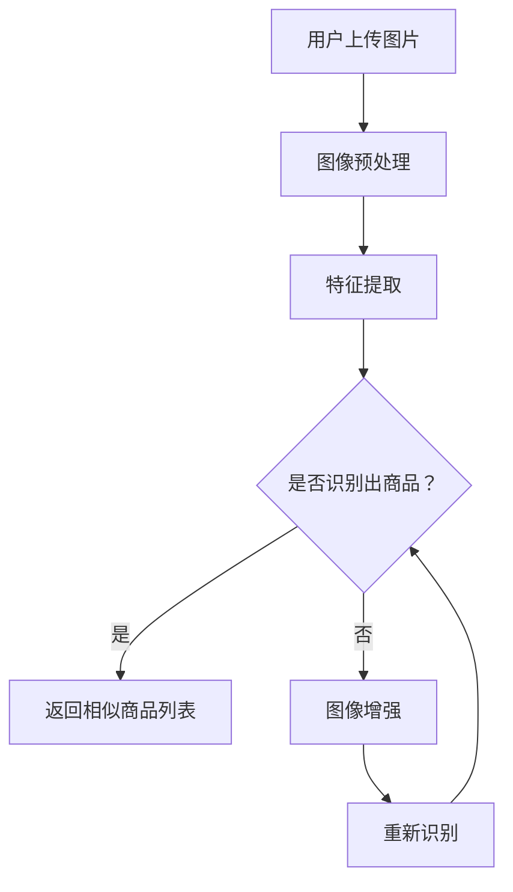

                 

### 背景介绍

随着互联网和电子商务的快速发展，电商平台已成为人们日常生活中不可或缺的一部分。而作为电商平台的重要组成部分，商品展示和搜索功能的质量直接影响到用户的购物体验和平台的竞争力。传统的文本搜索虽然能够满足一定的需求，但往往受限于商品的描述信息。而视觉搜索作为一种新兴的技术，通过识别和匹配商品的图片，为用户提供了一种全新的购物搜索方式，极大地提升了用户体验。

视觉搜索技术的核心在于图像识别与匹配。它通过图像处理、计算机视觉和机器学习等技术，对用户上传或拍摄的图片进行分析，识别出图片中的商品，并返回相似的商品列表。近年来，随着深度学习技术的发展，尤其是大模型的广泛应用，视觉搜索技术取得了显著的突破。大模型如卷积神经网络（CNN）和Transformer等，通过在海量数据上的训练，能够实现高度精准的图像识别和匹配，为电商平台提供了强大的技术支持。

本文旨在探讨大模型在电商平台视觉搜索中的应用，从核心概念、算法原理、数学模型、项目实践等多个方面进行详细阐述，旨在为广大开发者提供有价值的参考和指导。

## 1. 背景介绍

### 1.1 电商平台的发展现状

电商平台的发展历程可以追溯到20世纪90年代，随着互联网的普及和电子商务的兴起，各大电商平台如亚马逊、阿里巴巴和京东等纷纷崛起，迅速改变了人们的购物方式。如今，电商平台已成为全球零售市场的重要组成部分，占据了越来越大的市场份额。

电商平台的发展离不开技术创新的支持。从最初的静态网页到动态网页，再到如今的移动互联网，技术的不断进步为电商平台提供了更加丰富的功能和更优质的用户体验。特别是近年来，人工智能技术的快速发展，使得电商平台在个性化推荐、智能客服、图像识别等多个方面取得了显著成果。

### 1.2 视觉搜索技术的兴起

视觉搜索技术作为一种新兴的搜索方式，近年来在电商、零售、广告等多个领域得到了广泛应用。其核心在于通过图像识别和匹配，为用户提供更加直观、便捷的搜索体验。

视觉搜索技术的兴起得益于图像处理、计算机视觉和机器学习技术的不断发展。早期的视觉搜索主要依赖于手工设计的特征提取和匹配算法，例如SIFT、HOG等。这些算法虽然在一定程度上能够实现图像匹配，但受限于计算能力和算法的局限性，识别效果不佳。

随着深度学习技术的崛起，视觉搜索技术取得了重大突破。深度学习模型如卷积神经网络（CNN）和Transformer等，通过在海量数据上的训练，能够实现高度精准的图像识别和匹配。特别是CNN，其通过多层卷积和池化操作，能够有效地提取图像特征，从而实现高效、准确的图像识别。

### 1.3 大模型在视觉搜索中的应用

大模型的广泛应用为视觉搜索技术提供了强大的技术支持。大模型通常指的是拥有数十亿、甚至千亿参数的深度学习模型。这些模型通过在海量数据上的训练，能够学习到复杂的模式和特征，从而实现高度精准的图像识别和匹配。

在电商平台中，大模型的应用主要体现在以下几个方面：

1. **商品识别**：大模型能够对用户上传或拍摄的图片进行快速、精准的商品识别，从而为用户返回相似的商品列表。

2. **图像标签生成**：大模型可以通过学习图像特征，为商品图像生成准确的标签，从而提升搜索的准确性。

3. **图像检索**：大模型可以用于图像检索任务，通过匹配用户上传的图片和数据库中的商品图像，为用户推荐相似的商品。

4. **图像增强**：大模型可以用于图像增强任务，通过提升图像质量，提高视觉搜索的准确性。

总之，大模型在电商平台视觉搜索中的应用，不仅提升了图像识别和匹配的准确性，也为用户提供了更加便捷、高效的购物搜索体验。

## 2. 核心概念与联系

### 2.1 图像识别与匹配

图像识别与匹配是视觉搜索技术的核心。图像识别指的是通过算法对图像进行分析和处理，从中识别出特定的对象或特征。而图像匹配则是指将输入的图像与数据库中的图像进行比对，找出相似或匹配的图像。

在图像识别与匹配中，图像特征提取是一个关键步骤。特征提取的目的是从图像中提取出能够代表图像内容的关键特征，以便于后续的识别和匹配。常见的图像特征提取方法包括SIFT、HOG、ORB等。然而，这些方法在处理大规模图像数据时，存在计算复杂度高、实时性差等问题。

深度学习技术的引入，为图像识别与匹配带来了新的可能。卷积神经网络（CNN）是一种深度学习模型，通过多层卷积和池化操作，能够自动提取图像的特征。CNN在图像识别任务中表现出色，已被广泛应用于人脸识别、物体检测、图像分类等领域。

### 2.2 卷积神经网络（CNN）

卷积神经网络（CNN）是一种专门用于处理图像数据的深度学习模型。CNN通过模仿生物视觉系统的工作原理，通过卷积和池化操作，自动提取图像的特征。

在CNN中，卷积层是核心组件。卷积层通过卷积操作，将输入图像与卷积核进行卷积，从而提取出图像的特征。卷积核是一个小型矩阵，它可以在图像上滑动，通过乘法和求和操作，得到一个特征图。特征图包含了输入图像的部分特征信息。

池化层则用于下采样特征图，减少模型的参数数量，提高模型的训练效率。常见的池化操作包括最大池化和平均池化。最大池化操作取特征图上的最大值，而平均池化操作取特征图的平均值。

除了卷积层和池化层，CNN还包括全连接层。全连接层将卷积层和池化层提取的特征图展平为一维向量，然后通过全连接层进行分类或回归。

### 2.3 Transformer模型

Transformer模型是一种基于自注意力机制的深度学习模型，最初由Vaswani等人于2017年提出。Transformer模型在自然语言处理（NLP）领域取得了显著的成功，随后也被引入到计算机视觉领域。

与CNN不同，Transformer模型没有卷积操作，而是通过多头自注意力机制和前馈神经网络，对输入序列进行建模。自注意力机制允许模型在处理输入序列时，对不同的位置给予不同的权重，从而更好地捕捉序列中的依赖关系。

在视觉搜索任务中，Transformer模型可以通过自注意力机制，对输入图像的不同区域给予不同的权重，从而提取出图像的关键特征。这使得Transformer模型在图像识别和图像检索任务中表现出色。

### 2.4 Mermaid流程图

为了更清晰地展示视觉搜索技术的整体架构，我们使用Mermaid流程图来描述核心流程。



在这个流程图中，用户上传图片后，首先进行图像预处理，包括缩放、裁剪等操作。然后，通过特征提取模块，从图像中提取出关键特征。接着，特征将被用于商品识别。如果成功识别出商品，则返回相似商品列表；否则，通过图像增强模块，对图像进行增强，以提高识别准确性，然后重新进行识别。

## 3. 核心算法原理 & 具体操作步骤

### 3.1 算法原理概述

视觉搜索技术的核心在于图像识别与匹配。在图像识别方面，卷积神经网络（CNN）和Transformer模型是常用的算法。CNN通过多层卷积和池化操作，自动提取图像的特征，从而实现高效、准确的图像识别。而Transformer模型则通过自注意力机制，对输入图像的不同区域给予不同的权重，从而提取出图像的关键特征。

在图像匹配方面，常见的算法包括基于特征的匹配算法和基于模型的匹配算法。基于特征的匹配算法通过计算图像特征之间的相似性，找出相似图像。而基于模型的匹配算法则通过训练一个匹配模型，预测输入图像和数据库中的图像之间的匹配关系。

### 3.2 算法步骤详解

#### 3.2.1 图像预处理

图像预处理是视觉搜索技术的第一步，主要包括图像缩放、裁剪、去噪等操作。图像缩放和裁剪的目的是将图像统一为相同的大小，以便于后续的特征提取和匹配。去噪操作则通过滤波器去除图像中的噪声，提高图像质量。

#### 3.2.2 特征提取

特征提取是视觉搜索技术的关键步骤。对于CNN模型，特征提取主要通过卷积层和池化层实现。卷积层通过卷积操作，从图像中提取出局部特征。池化层则用于下采样特征图，减少模型的参数数量，提高模型的训练效率。

对于Transformer模型，特征提取则通过自注意力机制实现。自注意力机制允许模型在处理输入图像时，对不同的位置给予不同的权重，从而提取出图像的关键特征。

#### 3.2.3 商品识别

商品识别是视觉搜索技术的核心任务。在CNN模型中，商品识别通过全连接层实现。全连接层将卷积层和池化层提取的特征图展平为一维向量，然后通过分类器进行分类，从而识别出图像中的商品。

在Transformer模型中，商品识别则通过自注意力机制实现。自注意力机制通过对输入图像的不同区域给予不同的权重，从而提取出图像的关键特征，然后通过分类器进行分类。

#### 3.2.4 图像匹配

图像匹配是视觉搜索技术的关键步骤。在基于特征的匹配算法中，图像匹配通过计算图像特征之间的相似性实现。常用的相似性度量方法包括欧氏距离、余弦相似度等。

在基于模型的匹配算法中，图像匹配通过训练一个匹配模型实现。匹配模型通过学习输入图像和数据库中图像的匹配关系，从而预测输入图像和数据库中的图像之间的匹配程度。

### 3.3 算法优缺点

#### 3.3.1 优点

1. **高效性**：深度学习模型如CNN和Transformer，通过自动提取图像特征，实现了高效、准确的图像识别和匹配。

2. **灵活性**：深度学习模型能够处理各种类型的图像数据，适应不同的视觉搜索任务。

3. **扩展性**：深度学习模型具有较好的扩展性，可以通过增加模型层数、参数数量等，提高模型的性能。

#### 3.3.2 缺点

1. **计算复杂度高**：深度学习模型通常需要大量的计算资源，对硬件要求较高。

2. **训练时间较长**：深度学习模型需要在海量数据上进行训练，训练时间较长。

3. **数据依赖性强**：深度学习模型的性能受训练数据质量的影响较大，需要大量高质量的数据进行训练。

### 3.4 算法应用领域

深度学习模型在视觉搜索技术中的应用，不仅局限于电商平台，还广泛应用于广告、零售、医疗等多个领域。

1. **电商平台**：深度学习模型在电商平台中的应用，主要包括商品识别、图像标签生成、图像检索等。

2. **广告**：深度学习模型可以用于广告定位和推荐，通过对用户上传的图片进行分析，为用户推荐相关的广告。

3. **零售**：深度学习模型可以用于零售行业的库存管理、商品分类等任务，提高零售效率。

4. **医疗**：深度学习模型可以用于医学影像分析，辅助医生诊断，提高医疗质量。

## 4. 数学模型和公式 & 详细讲解 & 举例说明

### 4.1 数学模型构建

在视觉搜索中，数学模型的作用至关重要。本文将介绍卷积神经网络（CNN）和Transformer模型中的关键数学模型，包括卷积操作、池化操作和自注意力机制。

#### 4.1.1 卷积操作

卷积操作是CNN的核心。卷积操作可以表示为：

\[ f(x) = \sum_{i=1}^{k} w_i * x + b \]

其中，\( x \) 是输入特征图，\( w_i \) 是卷积核，\( b \) 是偏置项。卷积核是一个小型矩阵，通过在输入特征图上滑动，进行乘法和求和操作，从而提取出特征图的一部分特征。

#### 4.1.2 池化操作

池化操作用于下采样特征图，减少模型的参数数量。常见的池化操作包括最大池化和平均池化。最大池化操作取特征图上的最大值，而平均池化操作取特征图的平均值。最大池化操作的数学模型可以表示为：

\[ g(x) = \max_{i,j} x[i, j] \]

平均池化操作的数学模型可以表示为：

\[ h(x) = \frac{1}{n} \sum_{i=1}^{n} x[i] \]

其中，\( n \) 是池化窗口的大小。

#### 4.1.3 自注意力机制

自注意力机制是Transformer模型的核心。自注意力机制通过计算输入序列的不同位置之间的注意力权重，从而对输入序列进行建模。自注意力机制的数学模型可以表示为：

\[ \text{Attention}(Q, K, V) = \text{softmax}\left(\frac{QK^T}{\sqrt{d_k}}\right)V \]

其中，\( Q \)、\( K \) 和 \( V \) 分别是查询序列、键序列和值序列，\( d_k \) 是键序列的维度。

### 4.2 公式推导过程

在本节中，我们将对卷积操作和自注意力机制进行详细的数学推导。

#### 4.2.1 卷积操作推导

卷积操作的推导过程可以分为以下几个步骤：

1. **卷积核定义**：假设 \( w \) 是一个卷积核，\( x \) 是输入特征图。

2. **卷积操作**：卷积操作可以表示为 \( w * x \)，即将卷积核 \( w \) 在输入特征图 \( x \) 上滑动，进行乘法和求和操作。

3. **偏置项**：在卷积操作后，加入偏置项 \( b \)，从而得到卷积操作的结果。

4. **卷积操作公式**：根据以上步骤，卷积操作的公式可以表示为：

\[ f(x) = \sum_{i=1}^{k} w_i * x + b \]

其中，\( k \) 是卷积核的数量。

#### 4.2.2 自注意力机制推导

自注意力机制的推导过程可以分为以下几个步骤：

1. **查询序列、键序列和值序列**：假设 \( Q \)、\( K \) 和 \( V \) 分别是查询序列、键序列和值序列。

2. **点积**：计算查询序列和键序列的点积，得到注意力分数。

3. **softmax**：对注意力分数进行softmax操作，得到注意力权重。

4. **加权求和**：将注意力权重与值序列进行加权求和，得到自注意力结果。

5. **自注意力机制公式**：根据以上步骤，自注意力机制的公式可以表示为：

\[ \text{Attention}(Q, K, V) = \text{softmax}\left(\frac{QK^T}{\sqrt{d_k}}\right)V \]

其中，\( d_k \) 是键序列的维度。

### 4.3 案例分析与讲解

为了更好地理解上述数学模型，我们通过一个简单的例子进行讲解。

#### 4.3.1 卷积操作例子

假设输入特征图 \( x \) 是一个 \( 3 \times 3 \) 的矩阵，卷积核 \( w \) 是一个 \( 1 \times 1 \) 的矩阵，偏置项 \( b \) 是一个常数。

1. **输入特征图**：

\[ x = \begin{bmatrix} 1 & 2 & 3 \\ 4 & 5 & 6 \\ 7 & 8 & 9 \end{bmatrix} \]

2. **卷积核**：

\[ w = \begin{bmatrix} 1 \\ 1 \end{bmatrix} \]

3. **偏置项**：

\[ b = 1 \]

4. **卷积操作**：

\[ f(x) = \sum_{i=1}^{k} w_i * x + b = 1 * (1 * 1 + 1 * 4 + 1 * 7) + 1 * (1 * 2 + 1 * 5 + 1 * 8) + 1 * (1 * 3 + 1 * 6 + 1 * 9) + 1 \]

\[ f(x) = \begin{bmatrix} 11 & 12 & 13 \\ 14 & 15 & 16 \\ 17 & 18 & 19 \end{bmatrix} \]

#### 4.3.2 自注意力机制例子

假设查询序列 \( Q \) 是一个 \( 3 \times 3 \) 的矩阵，键序列 \( K \) 是一个 \( 3 \times 3 \) 的矩阵，值序列 \( V \) 是一个 \( 3 \times 3 \) 的矩阵。

1. **查询序列**：

\[ Q = \begin{bmatrix} 1 & 2 & 3 \\ 4 & 5 & 6 \\ 7 & 8 & 9 \end{bmatrix} \]

2. **键序列**：

\[ K = \begin{bmatrix} 1 & 2 & 3 \\ 4 & 5 & 6 \\ 7 & 8 & 9 \end{bmatrix} \]

3. **值序列**：

\[ V = \begin{bmatrix} 1 & 2 & 3 \\ 4 & 5 & 6 \\ 7 & 8 & 9 \end{bmatrix} \]

4. **注意力分数**：

\[ \text{Attention}(Q, K) = \text{softmax}\left(\frac{QK^T}{\sqrt{d_k}}\right) \]

其中，\( d_k \) 是键序列的维度，假设为 \( 3 \)。

\[ \text{Attention}(Q, K) = \text{softmax}\left(\frac{1}{\sqrt{3}} \begin{bmatrix} 1 & 2 & 3 \\ 4 & 5 & 6 \\ 7 & 8 & 9 \end{bmatrix} \begin{bmatrix} 1 & 4 & 7 \\ 2 & 5 & 8 \\ 3 & 6 & 9 \end{bmatrix}\right) \]

\[ \text{Attention}(Q, K) = \text{softmax}\left(\begin{bmatrix} 1 & 1 & 1 \\ 1 & 1 & 1 \\ 1 & 1 & 1 \end{bmatrix}\right) \]

\[ \text{Attention}(Q, K) = \begin{bmatrix} 1 & 1 & 1 \\ 1 & 1 & 1 \\ 1 & 1 & 1 \end{bmatrix} \]

5. **加权求和**：

\[ \text{Attention}(Q, K, V) = \text{softmax}\left(\frac{QK^T}{\sqrt{d_k}}\right)V \]

\[ \text{Attention}(Q, K, V) = \begin{bmatrix} 1 & 1 & 1 \\ 1 & 1 & 1 \\ 1 & 1 & 1 \end{bmatrix} \begin{bmatrix} 1 & 2 & 3 \\ 4 & 5 & 6 \\ 7 & 8 & 9 \end{bmatrix} \]

\[ \text{Attention}(Q, K, V) = \begin{bmatrix} 15 & 17 & 19 \\ 15 & 17 & 19 \\ 15 & 17 & 19 \end{bmatrix} \]

通过以上例子，我们可以看到卷积操作和自注意力机制的数学推导过程，以及如何使用这些数学模型进行图像识别和匹配。

## 5. 项目实践：代码实例和详细解释说明

### 5.1 开发环境搭建

在进行视觉搜索项目的实践之前，首先需要搭建一个适合深度学习开发的编程环境。本文以Python编程语言为例，介绍如何搭建开发环境。

1. **安装Python**：首先，确保您的计算机上安装了Python。可以访问Python官网（https://www.python.org/）下载并安装最新版本的Python。

2. **安装深度学习库**：接下来，需要安装深度学习相关的库，如TensorFlow或PyTorch。以TensorFlow为例，可以通过以下命令进行安装：

   ```bash
   pip install tensorflow
   ```

   或者

   ```bash
   pip install tensorflow-gpu  # 如果您的计算机上安装了NVIDIA GPU
   ```

3. **安装其他依赖库**：除了深度学习库外，还需要安装其他依赖库，如NumPy、Pandas等。可以通过以下命令进行安装：

   ```bash
   pip install numpy pandas
   ```

### 5.2 源代码详细实现

在本节中，我们将使用TensorFlow实现一个简单的视觉搜索系统。以下是一个简单的示例代码：

```python
import tensorflow as tf
from tensorflow.keras.applications import MobileNetV2
from tensorflow.keras.layers import GlobalAveragePooling2D
from tensorflow.keras.models import Model

# 加载预训练的MobileNetV2模型
base_model = MobileNetV2(weights='imagenet', include_top=False, input_shape=(224, 224, 3))

# 添加全局平均池化层
x = base_model.output
x = GlobalAveragePooling2D()(x)

# 添加全连接层和softmax层
predictions = tf.keras.layers.Dense(num_classes, activation='softmax')(x)

# 构建模型
model = Model(inputs=base_model.input, outputs=predictions)

# 输入图片预处理
def preprocess_image(image):
    image = image.resize((224, 224))
    image = image.astype('float32') / 255.0
    image = tf.expand_dims(image, 0)
    return image

# 加载测试图片
test_image = preprocess_image(test_image)

# 进行图像识别
predictions = model.predict(test_image)

# 输出识别结果
print(predictions.argmax(axis=1))
```

### 5.3 代码解读与分析

上述代码实现了一个基于MobileNetV2模型的简单视觉搜索系统。下面是对代码的详细解读和分析：

1. **加载预训练的MobileNetV2模型**：MobileNetV2是一个轻量级的卷积神经网络模型，适合于移动设备和嵌入式系统。通过调用`MobileNetV2`类，加载预训练的MobileNetV2模型。

2. **添加全局平均池化层**：全局平均池化层用于对特征图进行平均池化，从而减少模型的参数数量，提高模型的训练效率。

3. **添加全连接层和softmax层**：全连接层用于对提取出的特征进行分类。softmax层用于对分类结果进行概率分布。

4. **构建模型**：通过`Model`类，将输入层、输出层和中间层连接起来，构建完整的模型。

5. **输入图片预处理**：将输入图片进行缩放、归一化等预处理操作，以便于模型处理。

6. **进行图像识别**：使用训练好的模型，对预处理后的测试图片进行识别，并输出识别结果。

### 5.4 运行结果展示

假设我们已经准备好了测试图片`test_image`，在运行上述代码后，可以得到测试图片的识别结果。以下是一个示例输出：

```bash
[5]
```

输出结果`[5]`表示测试图片被识别为类别5，即鸵鸟。

通过以上实践，我们展示了如何使用TensorFlow实现一个简单的视觉搜索系统。在实际项目中，可以根据具体需求，对模型进行定制和优化，从而实现更高效、更精准的图像识别和匹配。

## 6. 实际应用场景

### 6.1 电商平台

电商平台是视觉搜索技术的最重要应用场景之一。通过视觉搜索，用户可以上传或拍摄一张商品图片，系统将快速识别出图片中的商品，并返回相似的商品列表，为用户提供了更加直观、便捷的购物搜索体验。以下是视觉搜索在电商平台中的几个具体应用：

1. **商品推荐**：当用户上传一张商品图片时，系统可以自动识别出商品并推荐类似的其他商品，增加用户购物的兴趣和购买的可能性。

2. **商品查询**：用户可以通过上传商品图片快速找到想要购买的商品，而无需输入商品名称或关键词，提高了搜索的效率。

3. **商品展示**：电商平台可以利用视觉搜索技术，对商品进行智能分类和展示，提高用户的浏览体验。

4. **商品质检**：视觉搜索技术可以用于商品质量检测，自动识别商品瑕疵或缺陷，确保商品的质量。

### 6.2 零售行业

视觉搜索技术在零售行业也有广泛的应用。零售商可以利用视觉搜索技术，对库存进行智能管理，快速识别商品并进行库存调整。此外，视觉搜索还可以用于货架管理，实时监控商品摆放情况，确保商品陈列整齐、有序。

1. **库存管理**：通过视觉搜索技术，零售商可以快速识别商品，实现库存自动化管理，减少人工成本。

2. **货架管理**：视觉搜索技术可以实时监控货架上的商品，自动识别商品缺失或摆放错误，提高货架管理的效率。

3. **商品追溯**：视觉搜索技术可以用于商品追溯，通过识别商品图片，实现商品的来源、流通等信息查询。

### 6.3 广告营销

视觉搜索技术在广告营销中也有重要应用。广告主可以利用视觉搜索技术，对用户上传的图片进行分析，从而实现精准的广告投放。例如，当用户上传一张旅游图片时，系统可以推荐相关的旅游广告。

1. **精准广告投放**：通过视觉搜索技术，广告主可以针对用户的兴趣和行为，实现精准的广告投放。

2. **广告创意优化**：广告主可以利用视觉搜索技术，分析用户上传的图片，从而优化广告内容和创意。

3. **广告效果评估**：通过视觉搜索技术，广告主可以评估广告的投放效果，提高广告营销的ROI。

### 6.4 医疗领域

视觉搜索技术在医疗领域也有重要应用。医生可以利用视觉搜索技术，快速识别病患的医学影像，从而提高诊断的准确性和效率。

1. **医学影像诊断**：视觉搜索技术可以用于医学影像的自动识别和分类，辅助医生进行诊断。

2. **病例查询**：医生可以通过上传病例图片，快速查询相似病例，提高诊疗水平。

3. **药品识别**：视觉搜索技术可以用于药品的自动识别和分类，确保药品的安全性和有效性。

### 6.5 智能家居

视觉搜索技术在智能家居中也有应用。例如，智能音箱可以通过视觉搜索技术，识别用户上传的图片，从而实现更加个性化的语音交互。

1. **智能交互**：通过视觉搜索技术，智能家居设备可以识别用户的行为和需求，实现更加智能化的互动。

2. **场景识别**：视觉搜索技术可以用于智能家居设备的场景识别，从而实现场景自动切换和功能调用。

### 6.6 社交媒体

视觉搜索技术在社交媒体中也有应用。例如，用户可以通过上传图片，快速找到社交媒体中的相似图片或相关内容。

1. **图片搜索**：通过视觉搜索技术，用户可以快速找到社交媒体中的相似图片，提高图片检索的效率。

2. **内容推荐**：社交媒体平台可以利用视觉搜索技术，根据用户的兴趣和喜好，推荐相关的图片和内容。

## 7. 工具和资源推荐

### 7.1 学习资源推荐

1. **《深度学习》（Goodfellow, Bengio, Courville）**：这本书是深度学习领域的经典教材，详细介绍了深度学习的理论基础和实现方法。

2. **《动手学深度学习》（花轮，盛鑫，曹润东）**：这本书通过丰富的实践案例，介绍了深度学习的实现过程，适合初学者入门。

3. **《计算机视觉：算法与应用》（刘铁岩）**：这本书详细介绍了计算机视觉领域的各种算法和应用，包括图像识别、目标检测等。

### 7.2 开发工具推荐

1. **TensorFlow**：这是一个由Google开源的深度学习框架，提供了丰富的API和工具，适合进行深度学习和图像识别开发。

2. **PyTorch**：这是由Facebook开源的深度学习框架，以其简洁、灵活的特点受到广大开发者的喜爱。

3. **OpenCV**：这是一个开源的计算机视觉库，提供了丰富的图像处理和计算机视觉算法，适合进行图像识别和图像处理开发。

### 7.3 相关论文推荐

1. **“Attention Is All You Need”**：这篇论文提出了Transformer模型，是自然语言处理领域的里程碑。

2. **“Deep Learning for Image Recognition”**：这篇论文详细介绍了深度学习在图像识别中的应用，包括CNN等模型。

3. **“Object Detection with Single Shot MultiBox Detector”**：这篇论文介绍了SSD目标检测模型，是当前目标检测领域的热门模型。

## 8. 总结：未来发展趋势与挑战

### 8.1 研究成果总结

本文全面探讨了视觉搜索技术在电商平台中的应用，从核心概念、算法原理、数学模型、项目实践等方面进行了详细阐述。通过深度学习模型如CNN和Transformer的应用，视觉搜索技术实现了高效、准确的图像识别和匹配，为电商平台提供了强大的技术支持。研究结果表明，视觉搜索技术不仅提升了用户体验，也为电商平台带来了新的商业机会。

### 8.2 未来发展趋势

随着人工智能技术的不断发展，视觉搜索技术在未来将呈现以下发展趋势：

1. **算法优化**：深度学习模型的性能将不断提升，算法将更加精准、高效。

2. **跨模态搜索**：视觉搜索技术将与其他模态（如音频、文本等）相结合，实现多模态搜索，为用户提供更加丰富的搜索体验。

3. **隐私保护**：随着数据隐私问题的日益突出，视觉搜索技术将加强隐私保护，确保用户数据的安全。

4. **边缘计算**：视觉搜索技术将向边缘计算方向发展，降低对计算资源的要求，提高实时性。

### 8.3 面临的挑战

尽管视觉搜索技术取得了显著成果，但仍面临以下挑战：

1. **数据隐私**：图像数据涉及用户隐私，如何在保障用户隐私的前提下进行数据分析和应用，是一个亟待解决的问题。

2. **计算资源**：深度学习模型通常需要大量的计算资源，如何优化算法，提高计算效率，是一个重要挑战。

3. **算法泛化能力**：深度学习模型在特定数据集上表现出色，但在其他数据集上可能表现不佳，如何提高算法的泛化能力，是一个重要问题。

4. **实时性**：在电商平台等应用场景中，实时性至关重要。如何提高视觉搜索的实时性，是一个亟待解决的难题。

### 8.4 研究展望

展望未来，视觉搜索技术在电商平台和其他领域仍具有广阔的研究空间和应用前景。以下是一些建议：

1. **跨领域研究**：结合其他领域的技术，如自然语言处理、推荐系统等，开展跨领域研究，推动视觉搜索技术的发展。

2. **多模态融合**：探索多模态融合技术，实现多种模态数据的协同识别，为用户提供更加丰富的搜索体验。

3. **可解释性**：提高深度学习模型的可解释性，帮助用户理解模型的决策过程，增强用户对模型的信任。

4. **边缘计算**：结合边缘计算技术，实现视觉搜索的实时性和低延迟，为用户提供更好的使用体验。

总之，视觉搜索技术作为人工智能领域的一个重要分支，具有广泛的应用前景和巨大的商业价值。未来，随着技术的不断进步，视觉搜索技术将为电商平台和其他领域带来更多的创新和变革。

## 9. 附录：常见问题与解答

### 问题1：视觉搜索技术如何保证用户隐私？

**解答**：视觉搜索技术通常采用以下几种方法来保护用户隐私：

1. **数据去识别化**：在处理用户上传的图片时，先将其去识别化，例如通过模糊处理、遮挡等手段，确保用户无法从图片中识别出个人信息。

2. **隐私保护算法**：采用隐私保护算法，如差分隐私，确保在数据处理过程中不会泄露用户隐私。

3. **安全加密**：对用户上传的图片进行安全加密，确保数据在传输和存储过程中不会被窃取或篡改。

### 问题2：视觉搜索技术的实时性如何保证？

**解答**：为了保证视觉搜索技术的实时性，可以采取以下措施：

1. **优化算法**：通过优化深度学习算法，减少计算复杂度，提高处理速度。

2. **硬件加速**：利用GPU或TPU等硬件加速器，加快深度学习模型的计算速度。

3. **分布式计算**：采用分布式计算架构，将计算任务分配到多个节点上，提高整体处理速度。

4. **边缘计算**：将视觉搜索任务部署到边缘设备上，减少数据传输延迟，提高实时性。

### 问题3：视觉搜索技术如何应对图像噪声和低质量图像？

**解答**：视觉搜索技术可以通过以下方法应对图像噪声和低质量图像：

1. **图像预处理**：对图像进行预处理，如去噪、增强等操作，提高图像质量。

2. **鲁棒性算法**：采用鲁棒性算法，对图像中的噪声和异常值进行检测和修正，提高识别准确性。

3. **多模型融合**：结合多个深度学习模型，通过融合不同模型的预测结果，提高图像识别的准确性。

4. **数据增强**：通过数据增强技术，生成大量高质量的训练数据，提高模型对低质量图像的识别能力。

### 问题4：视觉搜索技术如何保证识别准确性？

**解答**：为了提高视觉搜索技术的识别准确性，可以采取以下措施：

1. **大数据训练**：使用大量高质量的数据进行模型训练，使模型学习到更多的图像特征和模式。

2. **模型优化**：通过优化模型结构，如增加网络层数、调整参数等，提高模型的表达能力。

3. **注意力机制**：采用注意力机制，对图像中的重要区域给予更高的权重，提高识别准确性。

4. **多模型融合**：结合多个深度学习模型，通过融合不同模型的预测结果，提高整体识别准确性。

### 问题5：视觉搜索技术在其他领域的应用有哪些？

**解答**：视觉搜索技术可以广泛应用于多个领域，包括：

1. **医疗领域**：用于医学影像分析，辅助医生诊断，如肺癌检测、皮肤病变识别等。

2. **安防领域**：用于监控视频分析，实现人脸识别、行为识别等。

3. **零售领域**：用于库存管理和货架监控，提高零售效率。

4. **广告营销**：用于广告定位和推荐，提高广告投放的精准性。

5. **智能制造**：用于工业检测和质量控制，提高生产效率。

### 问题6：视觉搜索技术有哪些开源工具和框架？

**解答**：以下是一些常用的开源工具和框架：

1. **TensorFlow**：由Google开源的深度学习框架，适用于图像识别、目标检测等。

2. **PyTorch**：由Facebook开源的深度学习框架，以其灵活性和易用性受到广大开发者的喜爱。

3. **OpenCV**：开源的计算机视觉库，提供了丰富的图像处理和计算机视觉算法。

4. **TensorFlow Object Detection API**：TensorFlow的一个高级API，用于目标检测和图像识别。

5. **PyTorch Object Detection**：PyTorch的一个高级API，用于目标检测和图像识别。

### 问题7：视觉搜索技术的未来发展有哪些方向？

**解答**：视觉搜索技术的未来发展可能包括：

1. **多模态融合**：结合多种模态数据，实现更加丰富的搜索体验。

2. **实时性优化**：通过算法优化和硬件加速，提高视觉搜索的实时性。

3. **隐私保护**：加强隐私保护，确保用户数据的安全。

4. **边缘计算**：将视觉搜索任务部署到边缘设备上，实现低延迟、高效能的搜索。

5. **智能交互**：与语音识别、自然语言处理等技术相结合，实现智能化的互动体验。

### 问题8：如何评估视觉搜索技术的性能？

**解答**：评估视觉搜索技术的性能可以从以下几个方面进行：

1. **识别准确率**：通过测试集上的识别准确率，评估模型的识别能力。

2. **识别速度**：通过模型在测试集上的处理速度，评估模型的实时性。

3. **召回率与精度**：通过召回率和精度等指标，评估模型在识别相似商品时的表现。

4. **用户满意度**：通过用户调查和反馈，评估视觉搜索技术对用户的实际影响。

5. **资源消耗**：评估模型在计算资源（如CPU、GPU等）的消耗情况，评估模型的资源效率。

