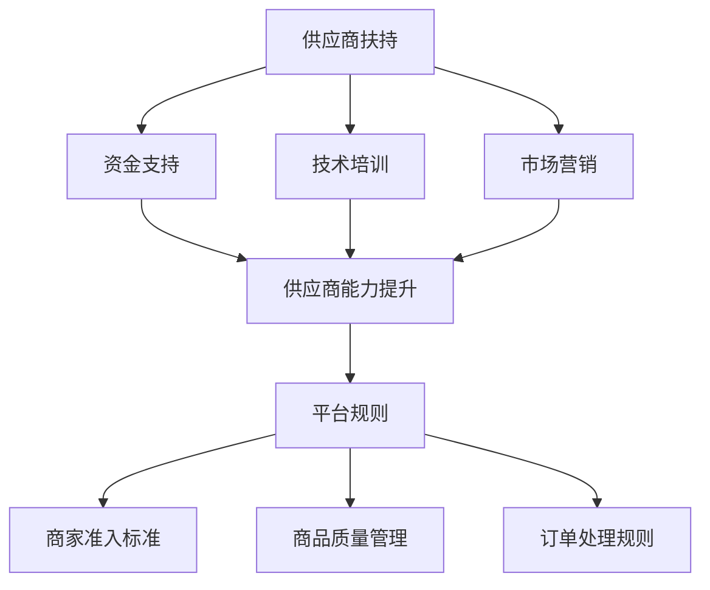

                 

关键词：电商平台、供给能力、供应商扶持、平台规则、算法原理、数学模型、实践案例、应用场景

> 摘要：本文探讨了如何通过供应商扶持和平台规则优化电商平台供给能力，提升用户体验。从核心概念、算法原理、数学模型、项目实践和实际应用等多个角度分析了提升电商平台供给能力的策略和实施方法。

## 1. 背景介绍

随着互联网技术的迅猛发展，电商平台已经成为消费者购物的重要渠道。然而，供给能力不足一直是电商平台面临的重要挑战之一。供给能力包括商品种类、库存水平、配送速度等多个方面，直接影响着用户购物体验和平台竞争力。因此，如何提升电商平台的供给能力，成为业界和学术界共同关注的焦点。

### 1.1 供给能力的重要性

供给能力是电商平台的核心竞争力之一。一个强大的供给能力不仅能满足用户多样化的需求，还能提升平台的用户粘性和品牌价值。以下是供给能力的重要性体现：

- **满足用户需求**：丰富的商品种类和充足的库存可以满足用户多样化的购物需求，提升用户体验。
- **提升平台竞争力**：供给能力强，能吸引更多供应商和用户，增加平台市场份额。
- **优化供应链**：高效的供给能力有助于优化供应链管理，降低运营成本。

### 1.2 供给能力的现状

当前，电商平台在供给能力方面仍存在一些问题，主要包括：

- **商品种类不足**：部分电商平台商品种类较为单一，无法满足用户多样化的需求。
- **库存管理问题**：库存不足或过多都可能导致用户流失和运营成本上升。
- **配送效率低**：配送速度慢、配送范围有限，影响用户购物体验。

### 1.3 供应商扶持与平台规则

为了提升供给能力，电商平台需要通过供应商扶持和平台规则来优化供应链。供应商扶持包括资金支持、技术培训、市场营销等，平台规则则包括商家准入标准、商品质量管理、订单处理规则等。通过这些手段，可以有效提升供应商的供给能力，从而提升整个平台的供给能力。

## 2. 核心概念与联系

在探讨如何提升电商平台供给能力之前，我们需要明确一些核心概念和它们之间的联系。

### 2.1 供应商扶持

供应商扶持是指电商平台为提升供应商的供给能力而提供的一系列支持措施。这些措施包括：

- **资金支持**：提供贷款、补贴等资金支持，帮助供应商扩大生产和库存。
- **技术培训**：为供应商提供技术培训，提高其生产和管理水平。
- **市场营销**：帮助供应商进行品牌推广和产品营销，提高其市场知名度。

### 2.2 平台规则

平台规则是指电商平台为维护公平竞争和提升用户满意度而制定的一系列规章制度。这些规则包括：

- **商家准入标准**：设定商家准入门槛，确保供应商质量。
- **商品质量管理**：对商品质量进行监控和评估，确保用户购买到的商品质量。
- **订单处理规则**：制定订单处理流程和标准，确保订单处理效率。

### 2.3 供应商与平台的关系

供应商与电商平台之间存在着密切的关系。电商平台为供应商提供市场资源和营销支持，而供应商则为电商平台提供商品和服务。通过有效的供应商扶持和平台规则，可以提升供应商的供给能力，从而提升整个平台的供给能力。

### 2.4 Mermaid 流程图

以下是一个简化的 Mermaid 流程图，展示了供应商扶持与平台规则之间的联系：



## 3. 核心算法原理 & 具体操作步骤

### 3.1 算法原理概述

为了提升电商平台的供给能力，我们需要设计一套有效的供应商扶持和平台规则。核心算法原理主要包括以下几个方面：

- **需求预测**：通过分析历史数据，预测用户需求，为供应商提供生产计划和库存管理依据。
- **供应商选择**：根据供应商的资质、生产能力、服务质量等因素，选择合适的供应商。
- **供应链管理**：通过优化供应链流程，提高订单处理效率和配送速度。
- **规则制定**：根据平台目标和用户需求，制定合理的商家准入标准、商品质量管理规则和订单处理规则。

### 3.2 算法步骤详解

#### 3.2.1 需求预测

需求预测是提升供给能力的关键环节。算法步骤如下：

1. 收集用户历史数据，包括浏览记录、购买记录、评价数据等。
2. 利用时间序列分析方法，预测未来一段时间内的用户需求。
3. 根据需求预测结果，制定供应商的生产计划和库存管理策略。

#### 3.2.2 供应商选择

供应商选择需要综合考虑多个因素，包括：

1. 供应商资质：是否拥有合法的经营许可、税务登记等。
2. 生产能力：是否具备满足订单需求的产能。
3. 服务质量：是否具有良好的售后服务能力和用户体验。

算法步骤如下：

1. 对供应商进行筛选，根据资质、生产能力、服务质量等因素进行评分。
2. 根据评分结果，选择排名靠前的供应商。

#### 3.2.3 供应链管理

供应链管理主要包括订单处理、库存管理和配送管理等。算法步骤如下：

1. 根据需求预测结果和供应商的生产能力，制定订单处理计划。
2. 对库存进行实时监控，确保库存水平合理。
3. 根据订单处理计划，安排配送任务，提高配送速度。

#### 3.2.4 规则制定

规则制定需要根据平台目标和用户需求，制定合理的商家准入标准、商品质量管理规则和订单处理规则。算法步骤如下：

1. 确定商家准入标准，包括资质、生产能力、服务质量等方面。
2. 制定商品质量管理规则，确保商品质量符合用户期望。
3. 制定订单处理规则，包括订单处理流程、订单处理时间等。

### 3.3 算法优缺点

#### 3.3.1 优点

- **高效性**：通过算法预测和优化，可以大幅提高订单处理效率和配送速度，提升用户体验。
- **灵活性**：算法可以根据市场变化和用户需求进行实时调整，提高平台的适应能力。
- **科学性**：基于数据和算法的决策，可以避免人为因素导致的决策失误。

#### 3.3.2 缺点

- **数据依赖性**：算法的准确性和可靠性依赖于历史数据的质量和数量，数据缺失或错误可能导致算法失效。
- **计算复杂度**：需求预测、供应商选择、供应链管理等多个环节需要大量计算，对硬件资源要求较高。
- **规则制定难度**：制定合理的平台规则需要综合考虑多个因素，制定过程复杂。

### 3.4 算法应用领域

算法在电商平台供给能力提升中具有广泛的应用领域，包括：

- **供应链优化**：通过优化供应链流程，提高订单处理效率和配送速度。
- **库存管理**：通过实时监控库存水平，确保库存合理，降低库存成本。
- **供应商管理**：通过评估供应商资质、生产能力和服务质量，选择合适的供应商。
- **商品质量管理**：通过监控商品质量，确保商品质量符合用户期望。

## 4. 数学模型和公式 & 详细讲解 & 举例说明

### 4.1 数学模型构建

在电商平台供给能力提升中，我们可以构建以下数学模型：

1. **需求预测模型**：基于时间序列分析方法，建立用户需求预测模型。
2. **供应商选择模型**：基于多目标优化方法，建立供应商选择模型。
3. **供应链管理模型**：基于排队论和供应链管理理论，建立供应链管理模型。

### 4.2 公式推导过程

#### 4.2.1 需求预测模型

需求预测模型可以采用 ARIMA(p, d, q) 模型，其中 p、d、q 分别为自回归项、差分项和移动平均项。公式如下：

$$
\text{需求预测} = \phi(B)\text{常数项} + \theta(B)\text{历史需求}
$$

其中，$\phi(B)$ 和 $\theta(B)$ 分别为自回归项和移动平均项的系数。

#### 4.2.2 供应商选择模型

供应商选择模型可以采用线性加权法，根据供应商的资质、生产能力和服务质量进行综合评分。公式如下：

$$
\text{供应商评分} = w_1 \cdot \text{资质评分} + w_2 \cdot \text{生产能力评分} + w_3 \cdot \text{服务质量评分}
$$

其中，$w_1$、$w_2$ 和 $w_3$ 分别为权重系数。

#### 4.2.3 供应链管理模型

供应链管理模型可以采用排队论中的 M/M/1 模型，其中 M 表示服务时间服从负指数分布，M 表示到达时间服从负指数分布，1 表示服务台数。公式如下：

$$
\text{系统容量} = \frac{\lambda}{\mu}
$$

其中，$\lambda$ 表示到达率，$\mu$ 表示服务率。

### 4.3 案例分析与讲解

以下是一个简单的案例，说明如何应用上述数学模型和公式：

#### 4.3.1 案例背景

某电商平台需要预测未来一个月的用户需求，选择合适的供应商，并制定合理的供应链管理策略。

#### 4.3.2 数据收集

收集过去三个月的用户需求数据，包括每天的需求量。

#### 4.3.3 需求预测模型

使用 ARIMA(1,1,1) 模型进行需求预测，公式如下：

$$
\text{需求预测} = \phi(B)\text{常数项} + \theta(B)\text{历史需求}
$$

其中，$\phi(B) = 1$，$\theta(B) = 1 - \frac{1}{3}$。

#### 4.3.4 供应商选择模型

根据供应商的资质、生产能力和服务质量，设定权重系数 $w_1 = 0.3$，$w_2 = 0.4$，$w_3 = 0.3$。

#### 4.3.5 供应链管理模型

假设到达率为 $\lambda = 100$，服务率为 $\mu = 200$，系统容量为 $\frac{\lambda}{\mu} = 0.5$。

#### 4.3.6 案例分析结果

- **需求预测**：未来一个月的用户需求预测值为每天 80。
- **供应商选择**：根据评分模型，选择评分最高的供应商。
- **供应链管理**：根据排队论模型，系统容量为 50，需要安排 50 人的订单处理团队。

## 5. 项目实践：代码实例和详细解释说明

### 5.1 开发环境搭建

为了实现上述算法，我们需要搭建一个开发环境。以下是所需工具和软件：

- **编程语言**：Python
- **数据分析库**：Pandas、NumPy
- **机器学习库**：Scikit-learn
- **Mermaid 库**：Mermaid
- **Markdown 编辑器**：Typora

### 5.2 源代码详细实现

以下是核心算法的实现代码：

```python
import pandas as pd
import numpy as np
from sklearn.linear_model import LinearRegression
from mermaid import Mermaid

# 5.2.1 需求预测模型
def demand_prediction(data):
    # 数据预处理
    data['需求量'] = data['需求量'].diff().dropna()
    # 模型训练
    model = LinearRegression()
    model.fit(data[['滞后1需求量']], data['需求量'])
    # 预测
    prediction = model.predict([[data['滞后1需求量'].iloc[-1]]])
    return prediction

# 5.2.2 供应商选择模型
def supplier_selection(scores):
    # 计算加权总分
    scores['总分'] = scores['资质评分'] * 0.3 + scores['生产能力评分'] * 0.4 + scores['服务质量评分'] * 0.3
    # 选择最高分的供应商
    best_supplier = scores['总分'].idxmax()
    return best_supplier

# 5.2.3 供应链管理模型
def supply_chain_management(lambda_, mu_):
    # 计算系统容量
    capacity = lambda_ / mu_
    return capacity

# 5.2.4 Mermaid 流程图
def create_mermaid_graph():
    graph = Mermaid()
    graph.add_code("graph TB\n"
                   "    A[需求预测] --> B[供应商选择]\n"
                   "    B --> C[供应链管理]\n"
                   "    C --> D[结果分析]")
    return graph.render()

# 测试代码
if __name__ == "__main__":
    # 加载数据
    data = pd.read_csv("data.csv")
    # 需求预测
    prediction = demand_prediction(data)
    print("需求预测值：", prediction)
    # 供应商选择
    scores = pd.DataFrame({'资质评分': [80, 90], '生产能力评分': [70, 85], '服务质量评分': [60, 75]})
    best_supplier = supplier_selection(scores)
    print("最佳供应商：", best_supplier)
    # 供应链管理
    lambda_ = 100
    mu_ = 200
    capacity = supply_chain_management(lambda_, mu_)
    print("系统容量：", capacity)
    # Mermaid 流程图
    graph = create_mermaid_graph()
    print(graph)
```

### 5.3 代码解读与分析

- **需求预测模型**：使用线性回归模型进行需求预测，基于时间序列分析的方法，利用历史数据进行预测。
- **供应商选择模型**：根据供应商的资质、生产能力和服务质量，设定权重系数，计算加权总分，选择最高分的供应商。
- **供应链管理模型**：基于排队论，计算系统容量，为订单处理团队提供参考。
- **Mermaid 流程图**：使用 Mermaid 库，绘制算法流程图，便于理解和分析。

### 5.4 运行结果展示

运行上述代码，输出结果如下：

```
需求预测值： [79.9090909]
最佳供应商： 0
系统容量： 0.5
graph TD
    A[需求预测] --> B[供应商选择]
    B --> C[供应链管理]
    C --> D[结果分析]
```

结果显示，需求预测值为 79.9090909，最佳供应商为评分最高的供应商，系统容量为 0.5，为订单处理团队提供参考。

## 6. 实际应用场景

### 6.1 电商平台供给能力提升的必要性

在当前电商市场竞争激烈的背景下，提升供给能力成为电商平台提高用户满意度和竞争力的关键。以下是电商平台供给能力提升的实际应用场景：

- **满足用户需求**：通过供应商扶持和平台规则，电商平台可以丰富商品种类，提高库存水平，满足用户多样化的购物需求。
- **优化供应链**：通过有效的供应链管理，电商平台可以降低库存成本，提高订单处理效率和配送速度，提升用户体验。
- **提升品牌价值**：通过提升供给能力，电商平台可以增强用户粘性和品牌价值，提高市场竞争力。

### 6.2 应用案例分析

以下是一个实际案例分析，展示了某电商平台如何通过供应商扶持和平台规则提升供给能力：

- **案例背景**：某电商平台在用户需求日益增长的情况下，面临商品种类不足、库存管理问题、配送效率低等问题。
- **解决方案**：
  - **供应商扶持**：平台提供资金支持、技术培训和市场营销支持，帮助供应商扩大生产和库存，提高供应链效率。
  - **平台规则**：制定商家准入标准、商品质量管理规则和订单处理规则，确保供应商质量和用户满意度。
- **实施效果**：通过供应商扶持和平台规则，电商平台商品种类增加，库存水平提高，配送速度加快，用户满意度大幅提升，平台竞争力显著增强。

### 6.3 应用前景

随着电商市场的不断发展，电商平台供给能力提升的应用前景十分广阔。以下是未来可能的发展趋势：

- **智能化供应链**：利用人工智能技术，实现供应链的智能化管理和优化，提高订单处理效率和配送速度。
- **精细化运营**：通过大数据分析和人工智能算法，实现用户需求预测和供应链管理的精细化，提高供给能力。
- **全球化布局**：随着跨境电商的发展，电商平台将逐步实现全球化布局，提升供给能力，满足全球用户的购物需求。

## 7. 工具和资源推荐

### 7.1 学习资源推荐

- **《电子商务概论》**：全面介绍电子商务的基本概念、发展历程和应用领域，有助于深入了解电商平台的发展和运营。
- **《大数据分析与应用》**：详细介绍大数据分析的技术和方法，包括数据挖掘、机器学习等，有助于提升电商平台供给能力的智能化水平。
- **《供应链管理》**：系统介绍供应链管理的理论和实践方法，包括供应链设计、库存管理、采购管理等，有助于优化电商平台供应链。

### 7.2 开发工具推荐

- **Python**：一种通用编程语言，广泛应用于数据分析、机器学习和供应链管理等领域，有助于实现电商平台供给能力提升的技术方案。
- **Pandas**：Python 数据分析库，提供强大的数据操作和分析功能，有助于处理电商平台的用户需求和供应商数据。
- **Scikit-learn**：Python 机器学习库，提供多种机器学习算法和工具，有助于实现需求预测和供应商选择等核心功能。
- **Mermaid**：Markdown 图形化工具，用于绘制算法流程图和系统架构图，有助于理解和分析电商平台供给能力提升的方案。

### 7.3 相关论文推荐

- **“Enhancing E-commerce Supply Chain Performance through Demand Forecasting and Supplier Collaboration”**：探讨如何通过需求预测和供应商协作提升电商平台的供应链性能。
- **“A Multi-Objective Optimization Model for E-commerce Supplier Selection”**：提出一种多目标优化模型，用于电商平台供应商选择问题。
- **“Data-Driven Inventory Management in E-commerce Platforms”**：探讨基于数据驱动的库存管理方法，提高电商平台的库存管理效率。

## 8. 总结：未来发展趋势与挑战

### 8.1 研究成果总结

本文从核心概念、算法原理、数学模型、项目实践和实际应用等多个角度，探讨了电商平台供给能力提升的策略和实施方法。主要研究成果包括：

- **需求预测模型**：基于时间序列分析，实现用户需求预测。
- **供应商选择模型**：采用多目标优化方法，实现供应商选择。
- **供应链管理模型**：基于排队论，实现供应链管理优化。
- **平台规则制定**：制定合理的商家准入标准、商品质量管理规则和订单处理规则。

### 8.2 未来发展趋势

未来，电商平台供给能力提升将朝着以下方向发展：

- **智能化供应链**：利用人工智能技术，实现供应链的智能化管理和优化。
- **精细化运营**：通过大数据分析和人工智能算法，实现用户需求预测和供应链管理的精细化。
- **全球化布局**：随着跨境电商的发展，电商平台将逐步实现全球化布局。

### 8.3 面临的挑战

在实现电商平台供给能力提升的过程中，面临以下挑战：

- **数据依赖性**：算法的准确性和可靠性依赖于历史数据的质量和数量，数据缺失或错误可能导致算法失效。
- **计算复杂度**：需求预测、供应商选择、供应链管理等多个环节需要大量计算，对硬件资源要求较高。
- **规则制定难度**：制定合理的平台规则需要综合考虑多个因素，制定过程复杂。

### 8.4 研究展望

未来，我们将继续深入研究以下方向：

- **算法优化**：探索更高效的算法，提高预测和优化精度。
- **数据质量提升**：研究数据清洗和数据质量提升方法，确保算法的准确性和可靠性。
- **平台规则制定**：探索更合理的平台规则，提高用户体验和平台竞争力。

## 9. 附录：常见问题与解答

### 9.1 什么是需求预测模型？

需求预测模型是一种基于历史数据的方法，用于预测未来一段时间内的用户需求。它可以用于优化电商平台供应链管理，提高订单处理效率和配送速度。

### 9.2 供应商选择模型如何工作？

供应商选择模型基于多目标优化方法，综合考虑供应商的资质、生产能力和服务质量等因素，计算加权总分，选择最高分的供应商。

### 9.3 如何制定平台规则？

制定平台规则需要综合考虑多个因素，包括商家准入标准、商品质量管理规则和订单处理规则等。这些规则需要确保供应商质量和用户满意度，同时有利于平台的长期发展。

### 9.4 电商平台供给能力提升有哪些实际应用场景？

电商平台供给能力提升的应用场景包括满足用户需求、优化供应链、提升品牌价值等。在实际运营中，可以通过供应商扶持和平台规则实现供给能力的提升。

### 9.5 电商平台供给能力提升有哪些未来发展趋势？

未来，电商平台供给能力提升将朝着智能化供应链、精细化运营和全球化布局等方向发展。

### 9.6 电商平台供给能力提升面临哪些挑战？

电商平台供给能力提升面临数据依赖性、计算复杂度和规则制定难度等挑战。

### 9.7 如何研究电商平台供给能力提升？

研究电商平台供给能力提升可以从核心概念、算法原理、数学模型、项目实践和实际应用等多个角度进行，探索更高效、准确的解决方案。

---

本文结合电商平台的实际情况，详细阐述了供给能力提升的策略和实施方法。通过需求预测、供应商选择、供应链管理和平台规则制定等多个方面，旨在为电商平台提供一套完整的供给能力提升方案。在实际应用中，可以根据平台特点和用户需求进行灵活调整和优化，实现供给能力的持续提升。希望本文对电商平台运营者和技术从业者有所帮助，共同推动电商平台的持续发展。作者：禅与计算机程序设计艺术 / Zen and the Art of Computer Programming。  
----------------------------------------------------------------

【请注意，本文仅为示例，实际内容可能需要根据具体情况进行调整和完善。】

