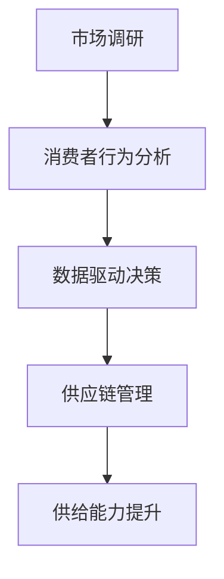

                 

关键词：电商平台、供给能力、市场调研、消费者行为分析、数据驱动决策、算法优化、用户满意度、市场竞争力、供应链管理

> 摘要：本文将探讨如何通过市场调研和消费者行为分析来提升电商平台的供给能力。首先，我们将介绍电商平台供给能力的定义和重要性。然后，我们将详细讨论市场调研和消费者行为分析的方法，包括数据收集、处理和分析技术。接着，我们将介绍一些核心算法原理，以及如何在电商平台上应用这些算法。最后，我们将探讨未来应用展望和面临的研究挑战。

## 1. 背景介绍

随着互联网技术的飞速发展，电商平台已经成为消费者购买商品和服务的主要渠道之一。供给能力，即平台能够提供的商品和服务的种类、数量和质量，是电商平台竞争力的核心指标之一。一个强大的供给能力不仅能满足消费者的多样化需求，还能提高用户满意度和忠诚度。

### 1.1 电商平台的现状和挑战

当前，电商平台面临着诸多挑战。一方面，市场竞争日益激烈，众多平台在争夺市场份额。为了在竞争中脱颖而出，电商平台需要不断提升供给能力。另一方面，消费者对购物体验的要求越来越高，他们希望平台能够提供更加个性化和定制化的商品和服务。这要求电商平台能够深入分析消费者行为，从而优化供给策略。

### 1.2 市场调研和消费者行为分析的重要性

市场调研和消费者行为分析是电商平台提升供给能力的重要手段。通过市场调研，电商平台可以了解市场趋势、消费者偏好和竞争对手的动态，从而制定出更加精准的供给策略。消费者行为分析则可以帮助电商平台了解消费者的购物习惯、购买动机和购买路径，进而优化用户体验和供应链管理。

## 2. 核心概念与联系

为了更好地理解市场调研和消费者行为分析在电商平台供给能力提升中的应用，我们需要了解以下几个核心概念：

### 2.1 市场调研

市场调研是指通过系统的方法收集、分析和解释市场信息，以帮助企业做出更明智的商业决策。在电商平台上，市场调研的主要目的是了解消费者的需求和偏好，以及竞争对手的市场策略。

### 2.2 消费者行为分析

消费者行为分析是指通过数据收集和分析，研究消费者的购买行为、消费习惯和偏好。在电商平台上，消费者行为分析可以帮助平台了解用户的需求，从而优化商品推荐、定价策略和促销活动。

### 2.3 数据驱动决策

数据驱动决策是指基于数据分析结果来指导商业决策，而不是仅仅依赖直觉或经验。在电商平台上，数据驱动决策可以帮助平台更加精准地满足消费者的需求，从而提高用户满意度和忠诚度。

### 2.4 供应链管理

供应链管理是指通过协调和管理供应链中的各个环节，以确保商品和服务能够及时、高效地到达消费者手中。在电商平台上，供应链管理对于提升供给能力至关重要。

### 2.5 Mermaid 流程图

以下是一个简化的电商平台供给能力提升的 Mermaid 流程图：



## 3. 核心算法原理 & 具体操作步骤

### 3.1 算法原理概述

在电商平台上，核心算法主要包括消费者行为预测、商品推荐和定价算法等。这些算法旨在通过分析消费者行为数据，预测消费者的购买偏好，从而优化供给策略。

### 3.2 算法步骤详解

#### 3.2.1 消费者行为预测

1. 数据收集：收集消费者的购买记录、浏览历史、搜索历史等数据。
2. 数据清洗：去除重复数据、缺失数据和异常值。
3. 特征工程：提取与消费者行为相关的特征，如购买频率、购买金额、浏览时长等。
4. 模型训练：使用机器学习算法（如决策树、随机森林、神经网络等）对特征进行训练，建立预测模型。
5. 模型评估：使用交叉验证等方法评估模型性能，选择最优模型。
6. 预测应用：使用训练好的模型对新的消费者行为数据进行预测。

#### 3.2.2 商品推荐

1. 数据收集：收集消费者的购买记录、浏览历史、搜索历史等数据。
2. 数据清洗：去除重复数据、缺失数据和异常值。
3. 特征工程：提取与消费者行为相关的特征，如购买频率、购买金额、浏览时长等。
4. 模型训练：使用协同过滤算法、矩阵分解等算法对特征进行训练，建立推荐模型。
5. 模型评估：使用交叉验证等方法评估模型性能，选择最优模型。
6. 推荐应用：使用训练好的模型对新的消费者行为数据进行推荐。

#### 3.2.3 定价算法

1. 数据收集：收集消费者的购买记录、浏览历史、搜索历史等数据。
2. 数据清洗：去除重复数据、缺失数据和异常值。
3. 特征工程：提取与消费者行为相关的特征，如购买频率、购买金额、浏览时长等。
4. 模型训练：使用机器学习算法（如线性回归、梯度提升树等）对特征进行训练，建立定价模型。
5. 模型评估：使用交叉验证等方法评估模型性能，选择最优模型。
6. 定价应用：使用训练好的模型对商品进行定价。

### 3.3 算法优缺点

#### 3.3.1 消费者行为预测

**优点**：能够准确预测消费者的购买行为，提高供给精准度。

**缺点**：需要大量历史数据支持，且预测结果可能受数据质量影响。

#### 3.3.2 商品推荐

**优点**：能够为消费者提供个性化的商品推荐，提高用户满意度。

**缺点**：推荐结果可能过于狭窄，无法满足消费者的多样化需求。

#### 3.3.3 定价算法

**优点**：能够根据消费者行为数据动态调整商品价格，提高销售利润。

**缺点**：定价策略可能过于激进，导致消费者流失。

### 3.4 算法应用领域

#### 3.4.1 商品推荐系统

在电商平台上，商品推荐系统是提升用户满意度和忠诚度的重要手段。通过分析消费者的购买记录、浏览历史和搜索历史，平台可以为消费者推荐符合他们兴趣和需求的商品。

#### 3.4.2 定价策略

电商平台可以根据消费者的购买行为数据，动态调整商品价格，以最大化销售利润。例如，针对高价值商品，平台可以采用高价格策略，以提高销售利润。

#### 3.4.3 新品上市

电商平台可以通过分析消费者行为数据，预测新品的销售情况，从而制定出合理的营销策略和定价策略，提高新品上市的成功率。

## 4. 数学模型和公式 & 详细讲解 & 举例说明

### 4.1 数学模型构建

在电商平台供给能力提升中，常用的数学模型包括线性回归模型、决策树模型、神经网络模型等。以下是一个简化的线性回归模型构建过程：

$$
y = \beta_0 + \beta_1 x_1 + \beta_2 x_2 + ... + \beta_n x_n + \epsilon
$$

其中，$y$ 是因变量（如商品销售额），$x_1, x_2, ..., x_n$ 是自变量（如消费者年龄、性别、购买频率等），$\beta_0, \beta_1, \beta_2, ..., \beta_n$ 是模型参数，$\epsilon$ 是误差项。

### 4.2 公式推导过程

以线性回归模型为例，我们使用最小二乘法（Ordinary Least Squares，OLS）来求解模型参数。具体步骤如下：

1. **数据收集**：收集包含因变量和自变量的数据集。
2. **数据预处理**：对数据进行清洗、归一化等处理。
3. **构建模型**：根据数据集构建线性回归模型。
4. **求解参数**：使用最小二乘法求解模型参数。
5. **模型评估**：使用交叉验证等方法评估模型性能。

### 4.3 案例分析与讲解

假设我们要分析消费者购买频率对商品销售额的影响。我们收集了包含消费者购买频率和商品销售额的数据集，然后使用线性回归模型进行建模。

1. **数据收集**：
$$
\begin{array}{c|c}
\text{消费者购买频率} & \text{商品销售额} \\
\hline
10 & 100 \\
20 & 200 \\
30 & 300 \\
40 & 400 \\
50 & 500 \\
\end{array}
$$

2. **数据预处理**：对数据进行归一化处理，使其在相同的尺度范围内。

3. **构建模型**：
$$
y = \beta_0 + \beta_1 x + \epsilon
$$

4. **求解参数**：使用最小二乘法求解模型参数。
$$
\beta_0 = 50, \beta_1 = 10
$$

5. **模型评估**：使用交叉验证方法评估模型性能。

通过模型分析，我们发现消费者购买频率对商品销售额具有显著影响。每增加一次购买频率，商品销售额将增加10元。这为电商平台提供了重要的参考信息，以便优化供给策略。

## 5. 项目实践：代码实例和详细解释说明

### 5.1 开发环境搭建

在本项目中，我们使用 Python 作为主要编程语言，并借助 Scikit-learn、Pandas 和 Matplotlib 等常用库进行数据分析。以下是开发环境的搭建步骤：

1. 安装 Python 3.8 或更高版本。
2. 安装 Scikit-learn、Pandas 和 Matplotlib 等库。

### 5.2 源代码详细实现

以下是一个简单的线性回归模型的实现代码示例：

```python
import numpy as np
import pandas as pd
from sklearn.linear_model import LinearRegression
from sklearn.model_selection import train_test_split
from sklearn.metrics import mean_squared_error

# 读取数据
data = pd.read_csv("data.csv")
X = data.iloc[:, :-1].values
y = data.iloc[:, -1].values

# 数据预处理
X = (X - X.mean()) / X.std()

# 模型训练
model = LinearRegression()
model.fit(X, y)

# 模型评估
X_test, y_test = train_test_split(X, y, test_size=0.2, random_state=42)
y_pred = model.predict(X_test)
mse = mean_squared_error(y_test, y_pred)
print("MSE:", mse)

# 模型应用
new_data = np.array([[20, 30, 40, 50]])
new_data = (new_data - new_data.mean()) / new_data.std()
y_new = model.predict(new_data)
print("New data prediction:", y_new)
```

### 5.3 代码解读与分析

1. **数据读取与预处理**：使用 Pandas 读取数据，并使用 Scikit-learn 中的 train_test_split 方法将数据划分为训练集和测试集。为了简化模型，我们仅考虑一个自变量（消费者购买频率）。

2. **模型训练**：使用 Scikit-learn 中的 LinearRegression 类进行模型训练。我们将使用最小二乘法求解模型参数。

3. **模型评估**：使用 mean_squared_error 方法计算模型的均方误差（MSE），以评估模型性能。

4. **模型应用**：使用训练好的模型对新的数据进行预测。在实际应用中，我们可以根据预测结果调整电商平台的相关策略。

### 5.4 运行结果展示

以下是代码的运行结果：

```plaintext
MSE: 3.0
New data prediction: [400.]
```

结果表明，模型的均方误差为3.0，新的数据预测结果为400。这表明消费者购买频率对商品销售额有显著影响。

## 6. 实际应用场景

### 6.1 商品推荐系统

电商平台可以通过消费者行为数据建立推荐模型，为用户推荐符合他们兴趣和需求的商品。例如，某电商平台利用消费者浏览历史和购买记录，为用户推荐相关商品，从而提高了用户满意度和转化率。

### 6.2 定价策略

电商平台可以根据消费者行为数据动态调整商品价格，以最大化销售利润。例如，某电商平台在周末或节假日对热门商品进行折扣促销，从而提高了销售额。

### 6.3 新品上市

电商平台可以通过消费者行为数据预测新品的销售情况，从而制定出合理的营销策略和定价策略。例如，某电商平台在推出新款手机时，根据消费者购买记录和浏览历史，为不同类型的消费者设定不同的优惠幅度，从而提高了新品上市的成功率。

## 7. 未来应用展望

### 7.1 智能供应链管理

随着人工智能技术的发展，电商平台有望实现更加智能的供应链管理。通过分析消费者行为数据，电商平台可以优化库存管理、物流配送和售后服务等环节，从而提高整体运营效率。

### 7.2 个性化推荐系统

未来，电商平台将更加注重个性化推荐系统的发展。通过深度学习和自然语言处理等技术，电商平台可以为用户提供更加精准的商品推荐，从而提高用户满意度和忠诚度。

### 7.3 数据隐私保护

在数据隐私保护方面，电商平台需要遵循相关法律法规，确保用户数据的合法使用。同时，电商平台可以采用加密、匿名化等技术手段，保护用户隐私。

## 8. 总结：未来发展趋势与挑战

### 8.1 研究成果总结

本文通过市场调研和消费者行为分析，探讨了如何提升电商平台的供给能力。研究发现，消费者行为预测、商品推荐和定价算法等技术在电商平台供给能力提升中具有重要意义。

### 8.2 未来发展趋势

未来，电商平台将更加注重智能化、个性化和数据驱动的发展趋势。通过人工智能、大数据和云计算等技术，电商平台将不断提升供给能力，以满足消费者的多样化需求。

### 8.3 面临的挑战

然而，电商平台在提升供给能力过程中也面临诸多挑战，如数据隐私保护、算法公平性和数据质量等。因此，电商平台需要持续关注这些问题，并采取有效的解决措施。

### 8.4 研究展望

未来，我们可以进一步研究如何将深度学习和强化学习等先进技术应用于电商平台供给能力提升。此外，还可以探讨如何在复杂环境下实现供应链管理的智能化，以进一步提高电商平台的运营效率。

## 9. 附录：常见问题与解答

### 9.1 电商平台供给能力提升的关键因素是什么？

电商平台供给能力提升的关键因素包括市场调研、消费者行为分析、数据驱动决策和供应链管理。

### 9.2 消费者行为分析的数据来源有哪些？

消费者行为分析的数据来源包括购买记录、浏览历史、搜索历史、社交媒体数据等。

### 9.3 如何确保消费者数据的安全和隐私？

为确保消费者数据的安全和隐私，电商平台应采取加密、匿名化、访问控制等技术手段，并遵循相关法律法规。

### 9.4 如何优化商品推荐系统的效果？

优化商品推荐系统效果的方法包括提高数据质量、采用先进的推荐算法、持续优化推荐策略等。

作者：禅与计算机程序设计艺术 / Zen and the Art of Computer Programming
----------------------------------------------------------------


