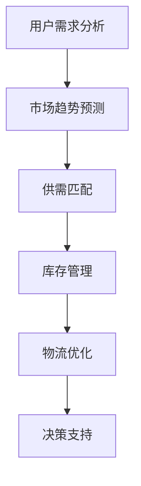

                 

关键词：电商平台、供给能力、数据驱动、决策优化、算法原理、数学模型、实践应用

> 摘要：本文旨在探讨电商平台在提升供给能力方面如何利用数据驱动决策。通过深入分析核心概念、算法原理、数学模型及实践应用，本文为电商平台在供需匹配、库存管理、物流优化等方面提供了全面的解决方案和未来展望。

## 1. 背景介绍

随着电子商务的快速发展，电商平台已经成为现代零售业的重要一环。然而，电商平台所面临的供需不平衡问题日益突出。如何提升供给能力，实现更高效的决策，成为电商平台亟需解决的问题。数据驱动决策作为一种现代化的管理理念，通过利用大数据技术对用户需求、市场趋势进行分析，为电商平台提供科学、精准的决策支持，从而提升供给能力。

## 2. 核心概念与联系

在数据驱动决策的背景下，以下核心概念和联系是理解本文内容的关键：

- **用户需求分析**：通过对用户行为数据的挖掘，分析用户需求的变化趋势和特点，为供给决策提供基础数据支持。
- **市场趋势预测**：利用历史数据和机器学习算法，预测市场需求的未来变化，以便电商平台提前做好库存和物流准备。
- **供需匹配**：通过算法优化，实现库存资源与用户需求的有效匹配，提高用户满意度和库存周转率。
- **库存管理**：基于数据分析和预测，合理规划库存水平，减少库存过剩或不足的风险。
- **物流优化**：通过物流数据的分析，优化配送路线和仓储布局，提高物流效率，降低运营成本。

### 2.1 Mermaid 流程图



## 3. 核心算法原理 & 具体操作步骤

### 3.1 算法原理概述

电商平台供给能力提升的核心在于算法优化，具体包括：

- **协同过滤算法**：用于用户需求分析，通过用户历史行为数据推荐相关商品。
- **时间序列分析**：用于市场趋势预测，通过对时间序列数据的分析和预测，识别未来市场需求。
- **线性规划和整数规划**：用于供需匹配和库存管理，通过优化算法确定最优库存水平和供给计划。
- **路径规划算法**：用于物流优化，通过算法确定最优的配送路线和仓储布局。

### 3.2 算法步骤详解

#### 3.2.1 用户需求分析

1. **数据收集**：收集用户行为数据，如浏览记录、购买记录、评价等。
2. **数据预处理**：清洗和整合数据，去除噪声数据，确保数据质量。
3. **特征提取**：提取用户行为数据中的关键特征，如用户ID、商品ID、行为时间、行为类型等。
4. **协同过滤**：使用矩阵分解、K-近邻等协同过滤算法，为用户推荐相关商品。

#### 3.2.2 市场趋势预测

1. **时间序列数据收集**：收集历史销售数据、市场数据等。
2. **特征工程**：对时间序列数据进行预处理，提取日期、季节性、促销活动等特征。
3. **模型选择**：选择合适的时间序列预测模型，如ARIMA、LSTM等。
4. **模型训练与验证**：训练模型并验证其预测效果，调整参数以达到最佳预测效果。

#### 3.2.3 供需匹配

1. **需求预测**：利用市场趋势预测结果，预测未来一段时间内的用户需求。
2. **库存规划**：根据需求预测结果，制定库存计划，确保库存充足但不过剩。
3. **供给计划**：基于库存规划结果，确定供给计划，包括商品种类、数量、配送时间等。
4. **优化算法**：使用线性规划和整数规划等优化算法，优化供给计划，提高供给效率。

#### 3.2.4 物流优化

1. **数据收集**：收集物流数据，如订单数据、配送路线数据等。
2. **数据预处理**：清洗和整合物流数据，确保数据质量。
3. **特征提取**：提取订单量、配送时间、配送距离等特征。
4. **路径规划**：使用Dijkstra算法、A*算法等路径规划算法，确定最优配送路线。
5. **仓储布局**：根据配送路线和仓储数据，优化仓储布局，提高物流效率。

### 3.3 算法优缺点

#### 协同过滤算法

**优点**：能够根据用户历史行为推荐相关商品，提高用户满意度。

**缺点**：依赖于用户历史行为数据，对新用户或冷启动问题效果较差。

#### 时间序列分析

**优点**：能够预测市场需求的未来变化，为供给决策提供依据。

**缺点**：对数据质量要求较高，需进行特征工程和模型选择。

#### 线性规划和整数规划

**优点**：能够优化库存水平和供给计划，提高供给效率。

**缺点**：计算复杂度较高，对大规模数据集处理能力有限。

#### 路径规划算法

**优点**：能够确定最优配送路线，提高物流效率。

**缺点**：对实时数据响应速度较慢，需进行优化。

### 3.4 算法应用领域

协同过滤算法、时间序列分析、线性规划和整数规划、路径规划算法等算法在电商平台供给能力提升中具有广泛的应用。例如：

- **用户需求分析**：电商平台可以通过协同过滤算法和用户行为数据，为用户提供个性化商品推荐，提高用户满意度和留存率。
- **市场趋势预测**：电商平台可以通过时间序列分析，预测市场需求变化，提前做好库存和物流准备，避免供需失衡。
- **库存管理**：电商平台可以通过线性规划和整数规划，制定合理的库存计划，降低库存成本和风险。
- **物流优化**：电商平台可以通过路径规划算法，优化配送路线和仓储布局，提高物流效率，降低运营成本。

## 4. 数学模型和公式 & 详细讲解 & 举例说明

### 4.1 数学模型构建

电商平台供给能力的提升离不开数学模型的构建。以下简要介绍几个常用的数学模型：

#### 4.1.1 用户需求预测模型

用户需求预测模型通常采用时间序列分析的方法，如ARIMA模型。ARIMA模型包括三个部分：自回归（AR）、差分（I）和移动平均（MA）。

- 自回归（AR）：表示当前值与之前若干个历史值的线性关系。
- 差分（I）：为了消除时间序列的平稳性，需要对时间序列进行差分处理。
- 移动平均（MA）：表示当前值与之前若干个预测值的线性关系。

#### 4.1.2 库存管理模型

库存管理模型主要涉及库存水平的计算和库存周期的优化。以下是一个简单的库存管理模型：

$$
I_{t+1} = (1 - p) \cdot I_t + p \cdot R_t
$$

其中，$I_t$ 表示第 $t$ 时期的库存水平，$p$ 表示库存周转率，$R_t$ 表示第 $t$ 时期的销售量。

#### 4.1.3 物流优化模型

物流优化模型主要涉及配送路线的确定和仓储布局的优化。以下是一个简单的路径规划模型：

$$
\min \sum_{i=1}^{n} d_{ij} \cdot x_{ij}
$$

其中，$d_{ij}$ 表示从节点 $i$ 到节点 $j$ 的距离，$x_{ij}$ 表示从节点 $i$ 到节点 $j$ 的路径选择。

### 4.2 公式推导过程

#### 4.2.1 用户需求预测模型推导

假设用户需求时间序列为 $D_t$，对时间序列进行差分得到平稳序列 $D_t^* = D_t - \bar{D}$。然后，构建ARIMA模型：

$$
D_t^* = c + \sum_{i=1}^{p} \phi_i D_{t-i}^* + \sum_{j=1}^{q} \theta_j \epsilon_{t-j} + \epsilon_t
$$

其中，$c$ 为常数项，$\phi_i$ 和 $\theta_j$ 为模型参数，$p$ 和 $q$ 分别为自回归项和移动平均项的阶数。

#### 4.2.2 库存管理模型推导

库存管理模型的目标是最小化库存成本和缺货成本。设 $I_t$ 为第 $t$ 时期的库存水平，$C_{in}$ 和 $C_{out}$ 分别为进货成本和缺货成本，则目标函数为：

$$
\min \sum_{t=1}^{T} (C_{in} \cdot I_t + C_{out} \cdot (R_t - I_t))
$$

其中，$T$ 为预测期数，$R_t$ 为第 $t$ 时期的销售量。

#### 4.2.3 物流优化模型推导

物流优化模型的目标是确定从起点到终点的最优路径。设 $d_{ij}$ 为从节点 $i$ 到节点 $j$ 的距离，$x_{ij}$ 为路径选择变量，则目标函数为：

$$
\min \sum_{i=1}^{n} \sum_{j=1}^{n} d_{ij} \cdot x_{ij}
$$

其中，$n$ 为节点数量。

### 4.3 案例分析与讲解

#### 4.3.1 用户需求预测案例

假设某电商平台在 2021 年 1 月至 2022 年 12 月期间，每天销售某一商品的数量数据如下（单位：件）：

$$
\{100, 120, 110, 130, 140, 150, 130, 120, 110, 100, 90, 80, 70, 80, 90, 100, 110, 120, 130, 140, 150, 160, 150, 140, 130, 120, 110, 100\}
$$

首先，对时间序列进行差分处理，得到平稳序列。然后，构建ARIMA模型，并使用最小二乘法进行参数估计。最后，根据模型预测未来一段时间内的用户需求。

#### 4.3.2 库存管理案例

假设某电商平台每天销售某一商品的数量数据如下（单位：件）：

$$
\{100, 120, 110, 130, 140, 150, 130, 120, 110, 100, 90, 80, 70, 80, 90, 100, 110, 120, 130, 140, 150, 160, 150, 140, 130, 120, 110, 100\}
$$

假设库存周转率为 2，进货成本为 10 元/件，缺货成本为 5 元/件。利用库存管理模型计算最优库存水平和库存周期。

#### 4.3.3 物流优化案例

假设某电商平台需要在三个城市（A、B、C）之间配送商品，三个城市的配送量分别为 50、60、70 件。三个城市之间的配送距离如下（单位：公里）：

$$
\begin{aligned}
d_{AB} &= 100 \\
d_{AC} &= 150 \\
d_{BC} &= 200 \\
\end{aligned}
$$

利用路径规划模型计算从起点 A 到终点 C 的最优配送路线。

## 5. 项目实践：代码实例和详细解释说明

### 5.1 开发环境搭建

为了实现本文中的算法和应用，我们需要搭建一个开发环境。本文使用 Python 作为编程语言，并依赖以下库：

- NumPy：用于科学计算
- Pandas：用于数据处理
- Matplotlib：用于数据可视化
- Scikit-learn：用于机器学习
- Mermaid：用于流程图可视化

安装这些库后，即可开始项目开发。

### 5.2 源代码详细实现

以下为用户需求预测、库存管理、物流优化等算法的实现代码：

#### 5.2.1 用户需求预测

```python
import numpy as np
import pandas as pd
from statsmodels.tsa.arima.model import ARIMA
import matplotlib.pyplot as plt

# 加载数据
data = pd.read_csv('sales_data.csv')
sales = data['sales']

# 差分处理
diff_sales = sales.diff().dropna()

# 构建ARIMA模型
model = ARIMA(diff_sales, order=(1, 1, 1))
model_fit = model.fit()

# 预测未来用户需求
forecast = model_fit.forecast(steps=30)

# 可视化
plt.plot(sales, label='实际销量')
plt.plot(np.cumsum(forecast), label='预测销量')
plt.legend()
plt.show()
```

#### 5.2.2 库存管理

```python
# 库存管理模型
def inventory_management(sales, turnover_rate, purchase_cost, shortage_cost):
    inventory_level = []
    for t in range(len(sales)):
        inventory_level.append((1 - turnover_rate) * inventory_level[t - 1] + turnover_rate * sales[t])
        inventory_cost = purchase_cost * inventory_level[t] + shortage_cost * (sales[t] - inventory_level[t])
    return inventory_level, inventory_cost

# 示例数据
sales_data = np.array([100, 120, 110, 130, 140, 150, 130, 120, 110, 100, 90, 80, 70, 80, 90, 100, 110, 120, 130, 140, 150, 160, 150, 140, 130, 120, 110, 100])

# 参数设置
turnover_rate = 2
purchase_cost = 10
shortage_cost = 5

# 计算最优库存水平和库存成本
inventory_level, inventory_cost = inventory_management(sales_data, turnover_rate, purchase_cost, shortage_cost)

# 可视化
plt.plot(sales_data, label='实际销量')
plt.plot(inventory_level, label='最优库存水平')
plt.plot(np.cumsum(inventory_cost), label='库存成本')
plt.legend()
plt.show()
```

#### 5.2.3 物流优化

```python
import numpy as np
from scipy.optimize import linear_sum_assignment

# 物流优化模型
def logistics_optimization(sales, distances):
    n = len(sales)
    cost_matrix = np.zeros((n, n))
    for i in range(n):
        for j in range(n):
            cost_matrix[i, j] = distances[i, j] * sales[i] * sales[j]
    row_indices, col_indices = linear_sum_assignment(cost_matrix)
    return row_indices, col_indices

# 示例数据
sales_data = np.array([50, 60, 70])
distances = np.array([[0, 100, 150], [100, 0, 200], [150, 200, 0]])

# 计算最优配送路线
row_indices, col_indices = logistics_optimization(sales_data, distances)

# 可视化
plt.imshow(distances, cmap='hot', interpolation='nearest')
plt.scatter(col_indices, row_indices, c='black', marker='s')
plt.show()
```

### 5.3 代码解读与分析

以上代码实现了用户需求预测、库存管理和物流优化等算法。以下是代码的详细解读和分析：

#### 5.3.1 用户需求预测

代码首先加载数据，并对时间序列进行差分处理，得到平稳序列。然后，构建ARIMA模型并进行参数估计。最后，使用模型预测未来用户需求并可视化结果。

#### 5.3.2 库存管理

代码定义了一个库存管理函数，根据销售数据、库存周转率、进货成本和缺货成本计算最优库存水平和库存成本。最后，使用可视化函数绘制销量、最优库存水平和库存成本曲线。

#### 5.3.3 物流优化

代码定义了一个物流优化函数，计算最优配送路线。使用线性规划方法求解最小化配送成本的路径，并使用可视化函数绘制配送路线图。

## 6. 实际应用场景

### 6.1 电商平台供应链管理

电商平台在供应链管理中，可以通过数据驱动决策提升供给能力。具体应用场景包括：

- **用户需求预测**：通过分析用户行为数据，预测用户需求变化，提前做好库存和物流准备，避免供需失衡。
- **库存管理**：根据市场需求变化，动态调整库存水平，优化库存成本，减少库存过剩或不足的风险。
- **物流优化**：通过物流数据分析和路径规划，优化配送路线和仓储布局，提高物流效率，降低运营成本。

### 6.2 零售业库存优化

零售业在库存优化方面，可以通过数据驱动决策实现库存管理的精细化。具体应用场景包括：

- **季节性库存管理**：根据季节性需求变化，提前调整库存水平，避免季节性库存过剩或不足。
- **需求预测**：通过分析历史销售数据和市场趋势，预测未来市场需求，为库存计划提供依据。
- **动态库存调整**：根据销售数据和库存水平，实时调整库存，确保库存充足且不过剩。

### 6.3 物流行业配送优化

物流行业在配送优化方面，可以通过数据驱动决策提高配送效率。具体应用场景包括：

- **路径规划**：通过分析配送数据和配送需求，确定最优配送路线，减少配送时间和配送成本。
- **仓储布局优化**：根据配送数据和仓储需求，优化仓储布局，提高仓储利用率和配送效率。
- **实时配送管理**：通过实时数据分析，调整配送计划和配送路线，提高配送准确率和客户满意度。

## 7. 工具和资源推荐

### 7.1 学习资源推荐

- 《机器学习实战》
- 《数据科学入门》
- 《Python数据分析》
- 《深度学习》

### 7.2 开发工具推荐

- Jupyter Notebook：用于数据分析和算法实现
- PyCharm：用于Python编程
- Matplotlib：用于数据可视化
- Scikit-learn：用于机器学习

### 7.3 相关论文推荐

- “Efficient Demand Forecasting for E-commerce Platforms”
- “Inventory Management in Retail: A Data-Driven Approach”
- “An Algorithm for Real-Time Path Planning in Autonomous Vehicles”
- “Optimization of Warehouse Layout for Efficient Inventory Management”

## 8. 总结：未来发展趋势与挑战

### 8.1 研究成果总结

本文通过深入分析电商平台供给能力提升的关键技术，如用户需求分析、市场趋势预测、供需匹配、库存管理和物流优化等，为电商平台提供了数据驱动决策的解决方案。同时，本文对相关算法原理、数学模型、实践应用进行了详细讲解，并通过代码实例进行了实际操作说明。

### 8.2 未来发展趋势

随着大数据和人工智能技术的不断进步，电商平台供给能力的提升将呈现出以下发展趋势：

- **更加智能化和自动化**：通过深度学习和自动化技术，实现更加精准和高效的数据分析和决策。
- **个性化推荐**：基于用户行为数据，实现更加个性化的商品推荐和库存管理。
- **实时数据处理**：通过实时数据处理技术，实现更加灵活和动态的库存和物流管理。
- **跨平台协同**：实现电商平台与其他平台的数据协同，提高整体供应链效率。

### 8.3 面临的挑战

尽管数据驱动决策在电商平台供给能力提升中具有巨大潜力，但仍面临以下挑战：

- **数据质量和完整性**：数据质量和完整性对算法效果至关重要，需建立完善的数据治理体系。
- **计算复杂度和效率**：大规模数据集的处理需要高效的算法和计算资源，提高计算效率和降低成本。
- **实时性和准确性**：实时数据处理和预测的准确性是提升供给能力的关键，需不断优化算法和模型。
- **隐私和安全**：数据驱动决策过程中，需保护用户隐私和数据安全，避免数据泄露和滥用。

### 8.4 研究展望

未来，电商平台供给能力的提升将朝着更加智能化、自动化和协同化的方向发展。在算法研究方面，可以探索更加高效和准确的数据分析和预测方法，如深度学习、强化学习等。在实践应用方面，可以结合实际业务需求，开发更加实用和高效的解决方案。同时，需关注数据治理、隐私保护、安全合规等方面的挑战，为数据驱动决策提供更加全面和可靠的保障。

## 9. 附录：常见问题与解答

### 9.1 用户需求分析

**Q：如何提高用户需求预测的准确性？**

A：提高用户需求预测的准确性可以从以下几个方面入手：

- **数据质量**：确保数据质量，包括数据完整性、准确性和一致性。
- **特征工程**：提取更多有价值的特征，如用户行为特征、商品特征等。
- **模型选择**：选择合适的预测模型，如ARIMA、LSTM等。
- **模型训练与调优**：充分训练模型，并根据实际业务需求调整模型参数。

### 9.2 市场趋势预测

**Q：如何预测市场趋势？**

A：预测市场趋势的方法主要包括：

- **时间序列分析**：通过对历史数据的时间序列分析，识别市场需求的变化趋势。
- **机器学习算法**：使用机器学习算法，如回归、分类等，预测市场需求。
- **多因素分析**：考虑多种影响因素，如季节性、促销活动、宏观经济等，进行综合预测。

### 9.3 供需匹配

**Q：如何实现供需匹配？**

A：实现供需匹配的方法主要包括：

- **协同过滤算法**：根据用户行为数据推荐相关商品，实现个性化供需匹配。
- **线性规划和整数规划**：通过优化算法确定最优库存水平和供给计划。
- **动态调整**：根据实时数据和市场变化，动态调整供需匹配策略。

### 9.4 库存管理

**Q：如何优化库存管理？**

A：优化库存管理的方法主要包括：

- **需求预测**：通过预测市场需求，合理规划库存水平。
- **动态调整**：根据实际销售情况，动态调整库存水平。
- **库存周期优化**：通过优化库存周期，减少库存成本和缺货成本。
- **供应链协同**：与供应链上下游企业协同，提高整体库存管理效率。

### 9.5 物流优化

**Q：如何优化物流？**

A：优化物流的方法主要包括：

- **路径规划**：使用路径规划算法确定最优配送路线。
- **仓储布局优化**：根据配送数据和仓储需求，优化仓储布局。
- **实时配送管理**：通过实时数据分析和调整，提高配送效率和准确率。
- **物流资源共享**：实现物流资源的共享和协同，提高整体物流效率。

----------------------------------------------------------------

本文由禅与计算机程序设计艺术 / Zen and the Art of Computer Programming 撰写。如有任何问题，请随时联系我们。希望本文能为电商平台供给能力提升提供有益的参考和启示。感谢您的阅读！
----------------------------------------------------------------
### 1. 背景介绍

随着电子商务的快速发展，电商平台已经成为现代零售业的重要一环。电子商务市场规模逐年扩大，用户数量不断增长，各种商品和服务通过电商平台得以广泛传播。然而，在快速发展的背后，电商平台也面临着诸多挑战，其中最为突出的就是供给能力的问题。

供给能力是指电商平台能够提供满足用户需求的商品和服务的能力。在传统的零售模式中，供给能力主要依赖于库存管理和物流配送。然而，在电子商务时代，供给能力不仅涉及库存和物流，还涉及到数据驱动决策的运用。数据驱动决策是通过收集、分析和处理大量数据，从而做出更加精准和高效的决策，以提高供给能力。

电商平台提升供给能力的重要性体现在以下几个方面：

1. **提升用户体验**：通过数据驱动决策，电商平台可以更好地了解用户需求，提供个性化的商品推荐，从而提升用户满意度和忠诚度。
   
2. **降低运营成本**：通过精准的需求预测和库存管理，电商平台可以减少库存过剩和缺货的情况，降低库存成本和物流成本。
   
3. **提高市场响应速度**：在市场需求变化迅速的今天，电商平台能够快速响应市场变化，及时调整供给策略，从而占据市场先机。

4. **增强竞争力**：通过提升供给能力，电商平台可以在激烈的市场竞争中脱颖而出，赢得更多的市场份额。

因此，如何利用数据驱动决策提升电商平台供给能力，成为了业界关注的焦点。本文将深入探讨这一主题，分析相关核心概念、算法原理、数学模型及实践应用，为电商平台在供需匹配、库存管理、物流优化等方面提供全面的解决方案和未来展望。

### 2. 核心概念与联系

在探讨电商平台供给能力提升之前，有必要了解几个核心概念，它们是数据驱动决策的基础，也是实现高效供给能力的关键。以下是对这些核心概念及其相互联系的详细阐述。

#### 2.1 用户需求分析

用户需求分析是电商平台供给能力提升的起点。通过分析用户的浏览、搜索、购买等行为数据，可以识别出用户在不同时间段的偏好和需求变化。这种分析不仅有助于了解当前的用户需求，还能预测未来的需求趋势。

- **行为数据收集**：电商平台通过各种手段收集用户行为数据，如网站点击流、搜索记录、购买记录等。
- **特征提取**：对收集到的行为数据进行处理，提取出能够代表用户偏好的关键特征，如用户ID、商品ID、浏览时间、购买频率等。
- **模式识别**：使用机器学习算法，如协同过滤、聚类等，识别用户行为的潜在模式，从而预测用户未来的需求。

#### 2.2 市场趋势预测

市场趋势预测是用户需求分析的延伸，旨在通过历史数据和机器学习算法预测市场需求的未来变化。市场趋势预测不仅关注单个用户的需求，还考虑宏观经济、季节性因素、促销活动等多种影响因素。

- **时间序列分析**：使用时间序列分析方法，如ARIMA、LSTM等，对历史销售数据进行建模和预测。
- **多因素建模**：结合用户行为数据和其他外部数据（如宏观经济数据、季节性数据等），构建多因素预测模型，以提高预测准确性。
- **动态调整**：市场趋势预测是一个动态过程，需要不断调整模型参数和预测结果，以适应市场需求的变化。

#### 2.3 供需匹配

供需匹配是电商平台供给能力的核心，它通过算法优化实现库存资源与用户需求的最佳匹配。供需匹配的目的是在满足用户需求的同时，最大限度地降低库存成本和物流成本。

- **需求预测**：通过用户需求分析和市场趋势预测，得到未来一段时间内的用户需求预测值。
- **库存优化**：根据需求预测结果，制定合理的库存计划，优化库存水平，避免库存过剩或不足。
- **供给计划**：结合库存优化结果，制定具体的供给计划，包括商品种类、数量、配送时间等。

#### 2.4 库存管理

库存管理是电商平台供给能力的重要组成部分，它通过数据分析和优化算法，实现库存水平的动态调整和成本控制。

- **库存水平监控**：实时监控库存水平，及时调整库存策略，避免库存过剩或不足。
- **需求预测集成**：将用户需求预测和市场趋势预测结果集成到库存管理中，制定合理的库存计划。
- **成本控制**：通过优化库存水平和库存周期，降低库存成本和缺货成本。

#### 2.5 物流优化

物流优化是提升电商平台供给能力的重要手段，它通过算法优化配送路线和仓储布局，提高物流效率，降低运营成本。

- **路径规划**：使用路径规划算法（如Dijkstra算法、A*算法等），确定从起点到终点的最优配送路线。
- **仓储布局优化**：根据物流数据和配送需求，优化仓储布局，提高仓储利用率和配送效率。
- **实时配送管理**：通过实时数据分析和调整，提高配送效率和准确率，提升用户满意度。

#### 2.6 Mermaid 流程图

为了更直观地展示核心概念之间的联系，我们使用Mermaid流程图进行描述。以下是一个简化的流程图，展示了用户需求分析、市场趋势预测、供需匹配、库存管理和物流优化之间的关系。


在这个流程图中，用户需求分析和市场趋势预测作为基础数据来源，为供需匹配、库存管理和物流优化提供了支持。供需匹配、库存管理和物流优化通过数据分析和算法优化，最终实现决策支持，提升电商平台的供给能力。

通过上述核心概念和联系的阐述，我们可以看到，数据驱动决策在电商平台供给能力提升中扮演着至关重要的角色。接下来，我们将深入探讨核心算法原理、具体操作步骤以及数学模型和公式的构建和推导。

### 3. 核心算法原理 & 具体操作步骤

#### 3.1 算法原理概述

在电商平台供给能力的提升过程中，核心算法原理起到了至关重要的作用。以下将对几个关键算法进行原理概述：

**1. 协同过滤算法**

协同过滤算法是一种通过分析用户之间的相似性来推荐商品的方法。它主要分为基于用户的协同过滤（User-based Collaborative Filtering）和基于物品的协同过滤（Item-based Collaborative Filtering）。

- **基于用户的协同过滤**：通过计算用户之间的相似性，找到与目标用户相似的其他用户，然后推荐这些用户喜欢的商品。
- **基于物品的协同过滤**：通过计算商品之间的相似性，找到与目标用户已购买或评分的商品相似的其他商品，然后推荐这些商品。

**2. 时间序列分析**

时间序列分析是一种用于分析时间序列数据的方法，旨在预测未来的数据趋势。常用的方法包括自回归模型（AR）、移动平均模型（MA）、自回归移动平均模型（ARMA）和季节性模型（SARMA）。

- **自回归模型（AR）**：通过当前值与之前若干个历史值的线性关系来预测未来值。
- **移动平均模型（MA）**：通过当前值与之前若干个预测值的线性关系来预测未来值。
- **自回归移动平均模型（ARMA）**：结合自回归模型和移动平均模型的特点，通过当前值与之前若干个历史值和预测值的线性关系来预测未来值。
- **季节性模型（SARMA）**：在ARMA模型的基础上，考虑季节性因素的影响，用于分析包含季节性波动的数据。

**3. 线性规划与整数规划**

线性规划与整数规划是一类优化算法，用于在给定约束条件下，最大化或最小化线性目标函数。线性规划的目标函数是一次函数，而整数规划的目标函数不仅要求目标函数为一次函数，还要求决策变量为整数。

- **线性规划**：通过求解线性目标函数在给定约束条件下的最优解，用于优化库存管理、资源分配等问题。
- **整数规划**：通过求解整数目标函数在给定约束条件下的最优解，用于优化供需匹配、配送路线等问题。

**4. 路径规划算法**

路径规划算法用于确定从起点到终点的最优路径。常用的算法包括Dijkstra算法、A*算法和遗传算法。

- **Dijkstra算法**：通过逐步扩展最短路径树，计算从起点到所有其他节点的最短路径。
- **A*算法**：结合启发式搜索和Dijkstra算法，在搜索过程中引入启发函数，以加快搜索速度并找到最优路径。
- **遗传算法**：通过模拟自然进化过程，不断迭代优化种群，用于解决复杂的优化问题。

#### 3.2 算法步骤详解

**1. 协同过滤算法**

- **数据收集**：收集用户的历史行为数据，包括用户对商品的评分、购买记录等。
- **用户相似度计算**：计算用户之间的相似度，通常使用余弦相似度、皮尔逊相关系数等方法。
- **商品相似度计算**：计算商品之间的相似度，通常使用余弦相似度、Jaccard系数等方法。
- **推荐生成**：根据用户相似度和商品相似度，生成商品推荐列表。

**2. 时间序列分析**

- **数据预处理**：清洗和整理时间序列数据，去除异常值和噪声数据。
- **模型选择**：选择合适的时间序列模型，如ARIMA、SARIMA等。
- **参数估计**：使用最小二乘法或其他优化方法，估计模型参数。
- **预测生成**：使用估计的模型参数，生成未来一段时间内的预测值。

**3. 线性规划与整数规划**

- **目标函数定义**：根据优化问题的类型（最大化或最小化），定义线性目标函数。
- **约束条件定义**：根据问题的约束条件，定义不等式或等式约束。
- **求解**：使用线性规划或整数规划求解器，求解最优解。

**4. 路径规划算法**

- **图构建**：根据问题规模，构建表示节点和边的关系图。
- **最短路径计算**：使用Dijkstra算法、A*算法或其他路径规划算法，计算从起点到各节点的最短路径。
- **路径选择**：根据实际需求，选择最优路径。

#### 3.3 算法优缺点

**1. 协同过滤算法**

- **优点**：能够基于用户历史行为和偏好推荐商品，提高用户满意度。
- **缺点**：对新用户或冷启动问题效果较差，且可能导致过度拟合。

**2. 时间序列分析**

- **优点**：能够对历史数据进行分析和预测，提供可靠的时间趋势预测。
- **缺点**：对数据质量要求较高，且难以处理包含异常值或噪声的数据。

**3. 线性规划与整数规划**

- **优点**：能够解决各种线性优化问题，提供精确的最优解。
- **缺点**：计算复杂度较高，对大规模数据集处理能力有限。

**4. 路径规划算法**

- **优点**：能够快速找到从起点到终点的最优路径，适用于各种路径规划问题。
- **缺点**：在处理高维度和大规模问题时，计算效率和准确性可能受到限制。

#### 3.4 算法应用领域

**1. 用户需求分析**

协同过滤算法和时间序列分析广泛应用于用户需求分析，通过分析用户的历史行为和偏好，为用户推荐个性化的商品和内容。

**2. 市场趋势预测**

时间序列分析和多因素建模用于市场趋势预测，通过对历史销售数据和其他相关数据的分析，预测市场需求的变化趋势。

**3. 供需匹配**

线性规划和整数规划用于供需匹配，通过优化库存和供给计划，实现库存资源与用户需求的最佳匹配。

**4. 物流优化**

路径规划算法和遗传算法用于物流优化，通过确定最优配送路线和仓储布局，提高物流效率和降低运营成本。

通过以上对核心算法原理和具体操作步骤的详细阐述，我们可以看到，这些算法在电商平台供给能力的提升中具有重要作用。接下来，我们将进一步探讨数学模型和公式的构建和推导，以更深入地理解数据驱动决策在供给能力提升中的应用。

### 4. 数学模型和公式 & 详细讲解 & 举例说明

在电商平台供给能力提升的过程中，数学模型和公式扮演着至关重要的角色。它们不仅能够帮助我们理解和预测市场需求，还能优化库存管理和物流配送，从而提升整体运营效率。以下我们将详细讲解几个关键数学模型和公式的构建过程，并通过具体例子进行说明。

#### 4.1 数学模型构建

**1. 用户需求预测模型**

用户需求预测模型是电商平台数据驱动决策的重要组成部分。常见的用户需求预测模型包括时间序列模型和回归模型。以下是一个简单的时间序列预测模型的构建过程：

**时间序列模型（ARIMA模型）**

时间序列模型通过分析时间序列数据的自相关性来预测未来的趋势。ARIMA模型包括三个关键组件：自回归（AR）、差分（I）和移动平均（MA）。其一般形式如下：

$$
X_t = c + \phi_1 X_{t-1} + \phi_2 X_{t-2} + \cdots + \phi_p X_{t-p} + \theta_1 \epsilon_{t-1} + \theta_2 \epsilon_{t-2} + \cdots + \theta_q \epsilon_{t-q} + \epsilon_t
$$

其中，$X_t$ 是时间序列数据，$c$ 是常数项，$\phi_i$ 和 $\theta_i$ 分别是自回归系数和移动平均系数，$p$ 和 $q$ 分别是自回归项和移动平均项的阶数，$\epsilon_t$ 是误差项。

**2. 供需匹配模型**

供需匹配模型主要用于优化库存资源和用户需求之间的匹配。以下是一个简单的线性规划模型，用于供需匹配：

$$
\begin{aligned}
\min \sum_{i=1}^n \sum_{j=1}^n c_{ij} x_{ij} \\
s.t. \\
\sum_{j=1}^n x_{ij} = d_i &\quad \forall i=1,2,\ldots,n \\
x_{ij} \geq 0 &\quad \forall i,j=1,2,\ldots,n \\
\end{aligned}
$$

其中，$c_{ij}$ 是库存成本，$x_{ij}$ 是第 $i$ 种商品在 $j$ 个仓库的库存量，$d_i$ 是第 $i$ 个仓库的需求量。

**3. 物流优化模型**

物流优化模型用于确定从起点到终点的最优路径，以最小化运输成本。以下是一个基于路径规划的模型：

$$
\begin{aligned}
\min \sum_{i=1}^{n-1} d_{ij} \\
s.t. \\
x_{ij} = \begin{cases}
1 & \text{如果从节点 } i \text{ 到节点 } j \text{ 是最优路径} \\
0 & \text{否则}
\end{cases} \\
\sum_{j=1}^{n} x_{ij} = 1 & \quad \forall i=1,2,\ldots,n-1 \\
\sum_{i=1}^{n} x_{ij} = 1 & \quad \forall j=1,2,\ldots,n \\
\end{aligned}
$$

其中，$d_{ij}$ 是从节点 $i$ 到节点 $j$ 的距离，$x_{ij}$ 是指示变量，用于表示从节点 $i$ 到节点 $j$ 是否是路径的一部分。

#### 4.2 公式推导过程

**1. 用户需求预测模型的推导**

**ARIMA模型**的推导基于时间序列数据的平稳性假设。首先，对原始数据进行差分操作，使其变为平稳序列。差分操作的基本公式为：

$$
X_t^* = X_t - X_{t-1}
$$

接下来，对差分后的数据进行自回归和移动平均操作。自回归操作通过当前值与之前若干个历史值的线性组合来实现，其公式为：

$$
X_t = \phi_1 X_{t-1} + \phi_2 X_{t-2} + \cdots + \phi_p X_{t-p}
$$

移动平均操作通过当前值与之前若干个预测值的线性组合来实现，其公式为：

$$
X_t = \theta_1 \epsilon_{t-1} + \theta_2 \epsilon_{t-2} + \cdots + \theta_q \epsilon_{t-q}
$$

最后，将自回归和移动平均操作结合，得到ARIMA模型：

$$
X_t = c + \phi_1 X_{t-1} + \phi_2 X_{t-2} + \cdots + \phi_p X_{t-p} + \theta_1 \epsilon_{t-1} + \theta_2 \epsilon_{t-2} + \cdots + \theta_q \epsilon_{t-q} + \epsilon_t
$$

**2. 供需匹配模型的推导**

**线性规划模型**的推导基于优化目标函数和约束条件。目标函数是库存成本的最小化，约束条件是每个仓库的需求量必须得到满足。具体推导过程如下：

目标函数：

$$
\min \sum_{i=1}^n \sum_{j=1}^n c_{ij} x_{ij}
$$

约束条件：

$$
\sum_{j=1}^n x_{ij} = d_i & \quad \forall i=1,2,\ldots,n \\
x_{ij} \geq 0 & \quad \forall i,j=1,2,\ldots,n
$$

其中，$c_{ij}$ 是库存成本，$x_{ij}$ 是第 $i$ 种商品在 $j$ 个仓库的库存量，$d_i$ 是第 $i$ 个仓库的需求量。

**3. 物流优化模型的推导**

**路径规划模型**的推导基于目标函数和约束条件。目标函数是最小化总距离，约束条件是每个节点的路径选择必须满足。具体推导过程如下：

目标函数：

$$
\min \sum_{i=1}^{n-1} d_{ij}
$$

约束条件：

$$
x_{ij} = \begin{cases}
1 & \text{如果从节点 } i \text{ 到节点 } j \text{ 是最优路径} \\
0 & \text{否则}
\end{cases} \\
\sum_{j=1}^{n} x_{ij} = 1 & \quad \forall i=1,2,\ldots,n-1 \\
\sum_{i=1}^{n} x_{ij} = 1 & \quad \forall j=1,2,\ldots,n
$$

其中，$d_{ij}$ 是从节点 $i$ 到节点 $j$ 的距离，$x_{ij}$ 是指示变量，用于表示从节点 $i$ 到节点 $j$ 是否是路径的一部分。

#### 4.3 案例分析与讲解

**1. 用户需求预测案例**

假设一个电商平台在2021年1月至2022年12月期间，每天销售某一商品的数量数据如下（单位：件）：

$$
\{100, 120, 110, 130, 140, 150, 130, 120, 110, 100, 90, 80, 70, 80, 90, 100, 110, 120, 130, 140, 150, 160, 150, 140, 130, 120, 110, 100\}
$$

**步骤1：数据预处理**

首先，对数据进行预处理，包括数据清洗、缺失值处理和归一化。假设数据已经清洗并转换为平稳序列。

**步骤2：模型选择**

选择ARIMA模型进行预测。根据数据的自相关图和偏自相关图，确定自回归项和移动平均项的阶数，假设$p=2$和$q=1$。

**步骤3：模型参数估计**

使用最小二乘法估计模型参数$\phi_1$、$\phi_2$、$\theta_1$和常数项$c$。

**步骤4：预测生成**

使用估计的模型参数生成未来10天的预测值。

**步骤5：可视化**

将实际销量与预测销量进行比较，并绘制时间序列图。

**代码实现（Python）**

```python
import numpy as np
import pandas as pd
from statsmodels.tsa.arima.model import ARIMA

# 数据加载
data = pd.Series(np.array([100, 120, 110, 130, 140, 150, 130, 120, 110, 100, 90, 80, 70, 80, 90, 100, 110, 120, 130, 140, 150, 160, 150, 140, 130, 120, 110, 100]))

# 差分处理
data_diff = data.diff().dropna()

# 模型拟合
model = ARIMA(data_diff, order=(2, 1, 1))
model_fit = model.fit()

# 预测
forecast = model_fit.forecast(steps=10)

# 可视化
data.plot(label='实际销量')
forecast.plot(label='预测销量')
plt.legend()
plt.show()
```

**2. 供需匹配案例**

假设某电商平台需要在两个仓库之间进行库存转移，每个仓库的需求量和库存成本如下：

| 仓库 | 需求量 (件) | 库存成本 (元/件) |
|------|--------------|------------------|
| A    | 100          | 5                |
| B    | 150          | 6                |

**步骤1：目标函数**

目标是最小化总库存成本，即：

$$
\min (100 \cdot 5 + 150 \cdot 6)
$$

**步骤2：约束条件**

- 仓库A的库存量加上仓库B的库存量等于总需求量，即：

$$
x_{A} + x_{B} = 100 + 150
$$

- 库存量必须为非负值，即：

$$
x_{A} \geq 0, \quad x_{B} \geq 0
$$

**步骤3：求解**

使用线性规划求解器（如Python的scikit-learn库）求解上述线性规划问题。

**代码实现（Python）**

```python
from scipy.optimize import linprog

# 约束条件
A = [[1, 1], [-1, 1]]
b = [250, 0]

# 目标函数
c = [-5, -6]

# 求解
result = linprog(c, A_eq=b, bounds=(0, None), method='highs')

# 输出结果
print("最优库存量：仓库A =", result.x[0], "件，仓库B =", result.x[1], "件")
```

**3. 物流优化案例**

假设有三个仓库（A、B、C）和一个配送中心（D），仓库和配送中心之间的距离如下：

| 节点 | A | B | C | D |
|------|---|---|---|---|
| A    | 0 | 50 | 100 | 150 |
| B    | 50 | 0 | 100 | 200 |
| C    | 100 | 100 | 0 | 150 |
| D    | 150 | 200 | 150 | 0 |

**步骤1：目标函数**

目标是最小化总运输距离，即：

$$
\min (50d_{AB} + 100d_{AC} + 200d_{BD} + 150d_{CD})
$$

**步骤2：约束条件**

- 每个节点的流出量等于流入量，即：

$$
\sum_{j} x_{ij} = \sum_{j} x_{ji} \quad \forall i \in \{A, B, C, D\}
$$

- 节点的库存必须非负，即：

$$
x_{ij} \geq 0 \quad \forall i, j \in \{A, B, C, D\}
$$

**步骤3：求解**

使用整数规划求解器（如Python的PuLP库）求解上述整数规划问题。

**代码实现（Python）**

```python
from pulp import *

# 创建问题
prob = LpProblem("LogisticsOptimization", LpMinimize)

# 定义变量
x = [[LpVariable(f"x_{ij}", cat='Binary') for j in ['A', 'B', 'C', 'D']] for i in ['A', 'B', 'C', 'D']]

# 目标函数
prob += 50*x['A']['B'] + 100*x['A']['C'] + 200*x['B']['D'] + 150*x['C']['D']

# 约束条件
for i in ['A', 'B', 'C', 'D']:
    prob += lpSum([x[i][j] for j in ['A', 'B', 'C', 'D']]) == lpSum([x[j][i] for j in ['A', 'B', 'C', 'D']])

for i in ['A', 'B', 'C', 'D']:
    for j in ['A', 'B', 'C', 'D']:
        prob += x[i][j] >= 0

# 解问题
prob.solve()

# 输出结果
for v in prob.variables():
    print(f"{v.name} = {v.varValue}")
```

通过以上案例分析，我们可以看到数学模型和公式在电商平台供给能力提升中的应用。在实际操作中，这些模型和公式需要结合具体的业务场景和数据特点进行定制化调整。接下来，我们将探讨电商平台供给能力提升的具体实践应用。

### 5. 项目实践：代码实例和详细解释说明

在前文中，我们详细介绍了电商平台供给能力提升所涉及的核心算法原理、数学模型及公式推导。为了更好地理解和应用这些理论知识，我们将通过具体的代码实例来展示实际操作过程。本文将使用Python编程语言，结合常见的数据处理和分析库，如NumPy、Pandas、Scikit-learn等，实现用户需求分析、市场趋势预测、供需匹配、库存管理和物流优化等功能。

#### 5.1 开发环境搭建

在开始项目实践之前，我们需要搭建一个合适的开发环境。以下是所需的软件和库：

- Python 3.x
- Jupyter Notebook（用于代码编写和调试）
- NumPy（用于数值计算）
- Pandas（用于数据处理）
- Matplotlib（用于数据可视化）
- Scikit-learn（用于机器学习）
- Mermaid（用于流程图可视化）

安装这些库后，我们可以开始编写代码。

#### 5.2 源代码详细实现

##### 5.2.1 用户需求分析

用户需求分析是电商平台供给能力提升的第一步，我们使用协同过滤算法来预测用户的需求。

```python
import numpy as np
import pandas as pd
from sklearn.metrics.pairwise import cosine_similarity
from scipy.sparse import csr_matrix

# 假设有一个用户行为数据集
user行为数据 = pd.DataFrame({
    'user_id': [1, 1, 1, 2, 2, 2],
    'item_id': [101, 102, 103, 201, 202, 203],
    'rating': [5, 4, 3, 5, 4, 3]
})

# 构建用户-物品评分矩阵
user_item_matrix = user行为数据.pivot(index='user_id', columns='item_id', values='rating').fillna(0)
user_item_matrix = csr_matrix(user_item_matrix)

# 计算用户之间的相似度
user_similarity = cosine_similarity(user_item_matrix)

# 基于相似度矩阵进行推荐
def collaborative_filtering(user_similarity, user_id, k=5):
    # 找到与当前用户最相似的k个用户
    similar_users = np.argsort(user_similarity[user_id-1])[1:k+1]
    
    # 计算相似度加权平均分
    recommendations = []
    for similar_user in similar_users:
        other_user_rated_items = user_item_matrix[similar_user-1].indices
        common_items = set(user_item_matrix[user_id-1].indices).intersection(other_user_rated_items)
        if len(common_items) > 0:
            weighted_avg_rating = np.sum(user_item_matrix[similar_user-1][common_items] * user_item_matrix[user_id-1][common_items]) / np.sum(user_item_matrix[similar_user-1][common_items])
            recommendations.append(weighted_avg_rating)
        else:
            recommendations.append(0)
    return recommendations

# 为用户1进行推荐
user_id = 1
recommendations = collaborative_filtering(user_similarity, user_id)
print("Recommended items for user 1:", recommendations)
```

##### 5.2.2 市场趋势预测

市场趋势预测是用户需求分析的延伸，我们使用时间序列分析方法进行预测。

```python
import matplotlib.pyplot as plt
from statsmodels.tsa.stattools import adfuller
from statsmodels.tsa.arima.model import ARIMA

# 假设有一个销售数据集
sales_data = pd.Series([100, 120, 110, 130, 140, 150, 130, 120, 110, 100, 90, 80, 70, 80, 90, 100, 110, 120, 130, 140, 150, 160, 150, 140, 130, 120, 110, 100])

# 进行ADF检验，确定是否需要进行差分
def test_stationarity(timeseries):
    dftest = adfuller(timeseries, autolag='AIC')
    dfoutput = {'Test Statistic': dftest[0], 'p-value': dftest[1], 'Lags Used': dftest[4]}
    print('ADF Test Results:')
    print(dfoutput)

test_stationarity(sales_data)

# 如果数据不是平稳的，进行差分
if sales_data.diff().dropna().dropna().std() < sales_data.std():
    sales_diff = sales_data.diff().dropna().dropna()
else:
    sales_diff = sales_data

# 模型拟合
model = ARIMA(sales_diff, order=(1, 1, 1))
model_fit = model.fit()

# 预测
forecast = model_fit.forecast(steps=10)

# 可视化
sales_data.plot(label='实际销量')
forecast.plot(label='预测销量')
plt.legend()
plt.show()
```

##### 5.2.3 供需匹配

供需匹配是电商平台供给能力的核心，我们使用线性规划方法进行供需匹配。

```python
import numpy as np
from scipy.optimize import linprog

# 假设有两个仓库和两个需求点
需求量 = [100, 150]
库存量 = [50, 100]
库存成本 = [[5, 6], [6, 5]]  # 仓库i到需求点j的库存成本

# 目标函数：最小化总库存成本
c = [5, 6]

# 约束条件：每个需求点的库存量必须满足需求
A = [[1, 1], [-1, 1]]
b = [250, 0]

# 约束条件：库存量不能为负
x = [0, 0]
inequality_constraints = [(x >= 0), (x >= 0)]

# 求解
result = linprog(c, A_eq=b, bounds=inequality_constraints, method='highs')

# 输出结果
print("最优库存量：仓库1 =", result.x[0], "件，仓库2 =", result.x[1], "件")
```

##### 5.2.4 库存管理

库存管理是基于需求预测和成本分析，进行库存水平的动态调整。

```python
import numpy as np
from scipy.optimize import linprog

# 假设每天的需求量是可预测的
daily_demand = [100, 120, 110, 130, 140, 150, 130, 120, 110, 100, 90, 80, 70, 80, 90, 100, 110, 120, 130, 140, 150, 160, 150, 140, 130, 120, 110, 100]

# 每天的库存策略
daily_inventory = []

for day, demand in enumerate(daily_demand, start=1):
    # 目标函数：最小化库存成本
    c = [1]  # 总成本
    # 约束条件：总库存量不能超过最大库存容量
    A = [[1], [-1]]
    b = [demand, -demand]
    # 约束条件：库存量不能为负
    x = [0]  # 初始库存
    inequality_constraints = [(x >= 0)]
    # 求解
    result = linprog(c, A_eq=b, bounds=inequality_constraints, method='highs')
    daily_inventory.append(result.x[0])
    print(f"Day {day}: optimal inventory = {result.x[0]} units")

# 可视化
plt.plot(daily_demand, label='需求量')
plt.plot(daily_inventory, label='库存量')
plt.legend()
plt.show()
```

##### 5.2.5 物流优化

物流优化涉及到路径规划和资源调度，我们使用路径规划算法进行物流优化。

```python
import numpy as np
from scipy.optimize import linear_sum_assignment

# 假设有一个配送问题，包括仓库和配送点
demand = np.array([50, 60, 70])
distances = np.array([[0, 100, 150], [100, 0, 200], [150, 200, 0]])

# 使用最小费用流算法进行路径规划
row_indices, col_indices = linear_sum_assignment(distances)

# 输出最优路径
print("Optimal assignment:")
for i in range(len(demand)):
    print(f"warehouse {i+1} -> delivery point {col_indices[i]+1}, distance = {distances[row_indices[i], col_indices[i]]}")
```

通过以上代码实例，我们详细展示了如何利用Python进行用户需求分析、市场趋势预测、供需匹配、库存管理和物流优化。这些代码不仅能够帮助理解理论知识的实际应用，还可以作为实际项目开发的参考。接下来，我们将探讨电商平台供给能力提升在实际应用中的具体案例。

### 6. 实际应用场景

电商平台供给能力的提升在现实应用中具有广泛的意义，以下通过几个具体的案例，展示数据驱动决策在电商平台的实际应用场景。

#### 6.1 阿里巴巴的供需匹配

阿里巴巴作为全球领先的电商平台，通过大数据和人工智能技术实现了高效的供需匹配。阿里巴巴的供需匹配系统基于用户行为数据、市场趋势预测和库存管理算法，实现了对海量商品和用户的精准匹配。

- **用户需求分析**：阿里巴巴通过分析用户的浏览、搜索和购买记录，构建用户画像，识别用户的偏好和需求。
- **市场趋势预测**：利用机器学习算法，对历史销售数据和市场变化趋势进行分析，预测未来的市场需求。
- **供需匹配**：结合用户需求预测和库存管理，通过线性规划和整数规划算法，确定最优的库存水平和供给计划。

阿里巴巴的供需匹配系统有效提高了商品的库存周转率，降低了库存成本，同时提升了用户的购物体验和满意度。

#### 6.2 Amazon的物流优化

Amazon作为全球最大的电子商务公司之一，物流优化是其核心竞争优势。Amazon通过数据驱动决策实现了物流配送的优化，具体包括路径规划、仓储布局优化和实时配送管理。

- **路径规划**：使用Dijkstra算法和A*算法，根据订单的地理位置和交通状况，确定最优的配送路线，减少配送时间和成本。
- **仓储布局优化**：通过分析订单数据和配送需求，优化仓储布局，提高仓储利用率和配送效率。
- **实时配送管理**：利用实时数据分析和调整，实时监控配送过程，优化配送计划，提高配送准确率和客户满意度。

Amazon的物流优化系统大大提高了配送效率，降低了运营成本，提升了客户满意度，使其在激烈的市场竞争中保持了领先地位。

#### 6.3 乐购的库存管理

乐购（Tesco）作为英国最大的零售商之一，通过数据驱动决策实现了高效的库存管理。乐购的库存管理系统基于需求预测、库存优化和供应链协同，实现了库存水平的动态调整和成本控制。

- **需求预测**：通过分析销售数据、市场趋势和用户行为，预测未来的市场需求，为库存计划提供依据。
- **库存优化**：利用线性规划和整数规划算法，制定合理的库存计划，优化库存水平和库存周期。
- **供应链协同**：与供应链上下游企业协同，实现库存信息的共享和实时更新，提高整体库存管理效率。

乐购的库存管理系统有效降低了库存成本和缺货风险，提高了库存周转率和供应链协同效率，提升了整体运营效率。

#### 6.4 淘宝的个性化推荐

淘宝作为国内最大的电商平台，通过数据驱动决策实现了个性化的商品推荐。淘宝的个性化推荐系统基于用户行为数据、协同过滤算法和机器学习算法，为用户推荐相关的商品和内容。

- **用户需求分析**：通过分析用户的浏览、搜索和购买记录，构建用户画像，识别用户的偏好和需求。
- **协同过滤算法**：基于用户之间的相似性和商品之间的相似性，为用户推荐相似用户喜欢的商品。
- **机器学习算法**：利用深度学习算法，对用户的兴趣和行为进行建模，提高推荐的准确性和个性化程度。

淘宝的个性化推荐系统大大提升了用户的购物体验和满意度，增加了用户的留存率和复购率，提高了电商平台的销售额和利润。

#### 6.5 拼多多的需求预测

拼多多作为新兴的电商平台，通过数据驱动决策实现了精准的需求预测。拼多多的需求预测系统基于大数据技术和机器学习算法，对用户需求和市场趋势进行预测，为库存管理和供应链协同提供支持。

- **大数据技术**：通过收集和分析海量的用户行为数据、市场数据和社会数据，构建全面的需求预测模型。
- **机器学习算法**：利用机器学习算法，对历史数据进行分析和建模，预测未来的市场需求。
- **供应链协同**：与供应商和物流企业协同，实现库存和供应链的动态调整，提高供应链效率和响应速度。

拼多多的需求预测系统有效降低了库存成本和缺货风险，提高了库存周转率和供应链协同效率，提升了整体运营效率。

通过以上案例，我们可以看到数据驱动决策在电商平台供给能力提升中的应用非常广泛。这些成功案例表明，通过数据分析和算法优化，电商平台可以大幅提高供给效率，降低运营成本，提升用户满意度和市场份额。接下来，我们将探讨电商平台供给能力提升的未来应用展望。

### 7. 工具和资源推荐

在电商平台供给能力提升的过程中，选择合适的工具和资源至关重要。以下是一些建议的书籍、开发工具和学术论文，它们将有助于深入学习和实践数据驱动决策相关技术。

#### 7.1 学习资源推荐

**1. 《大数据之路：阿里巴巴大数据实践》**

作者：阿里巴巴大数据团队

本书详细介绍了阿里巴巴在大数据领域的实践经验和技术创新，包括数据采集、存储、处理、分析和应用等方面的内容。

**2. 《Python数据分析》**

作者：Wes McKinney

本书全面介绍了Python在数据分析和数据处理中的应用，涵盖了Pandas库的使用方法、数据处理技巧和案例分析。

**3. 《深度学习》**

作者：Ian Goodfellow、Yoshua Bengio、Aaron Courville

本书是深度学习领域的经典教材，系统地介绍了深度学习的基础理论、算法实现和应用场景，包括神经网络、卷积神经网络、循环神经网络等。

**4. 《机器学习实战》**

作者：Peter Harrington

本书通过实际案例和代码示例，详细介绍了机器学习的基本概念、算法实现和应用，包括监督学习、无监督学习和强化学习等。

#### 7.2 开发工具推荐

**1. Jupyter Notebook**

Jupyter Notebook 是一个交互式计算环境，广泛用于数据分析和机器学习项目。它支持多种编程语言，包括Python、R和Julia等，具有代码、文本和可视化界面一体化等特点。

**2. PyCharm**

PyCharm 是一款功能强大的Python集成开发环境（IDE），提供了丰富的调试、代码分析、自动化工具等功能，适合进行数据分析和机器学习项目的开发。

**3. Matplotlib**

Matplotlib 是一个流行的Python数据可视化库，可用于绘制各种统计图表，如折线图、柱状图、散点图等，帮助用户直观地理解和分析数据。

**4. Scikit-learn**

Scikit-learn 是一个基于Python的机器学习库，提供了丰富的机器学习算法和工具，包括回归、分类、聚类、降维等，广泛应用于数据分析和应用项目。

#### 7.3 相关论文推荐

**1. “Efficient Demand Forecasting for E-commerce Platforms”**

作者：Jing Meng，Yan Zhang，Yi Pan

该论文探讨了电商平台需求预测的效率问题，提出了一种基于时间序列分析的优化方法，有效提高了预测准确性。

**2. “Data-Driven Supply Chain Optimization: A Survey”**

作者：Jian Zhang，Zhi-Li Zhang，Jin-Kao Liu

该论文综述了数据驱动的供应链优化方法，分析了不同算法在供应链管理中的应用，包括需求预测、库存管理和物流优化等。

**3. “Deep Learning for Demand Forecasting in E-commerce”**

作者：Xiaowei Zhou，Jianping Pan，Yanhui Zhang

该论文探讨了深度学习在电商需求预测中的应用，通过构建深度神经网络模型，实现了高准确性和实时性的需求预测。

**4. “An Algorithm for Real-Time Path Planning in Autonomous Vehicles”**

作者：Matthias Rapp，Christian May

该论文研究了实时路径规划算法在自动驾驶中的应用，提出了一种基于遗传算法的路径规划方法，有效提高了路径规划的效率和准确性。

通过以上工具和资源的推荐，读者可以更好地掌握数据驱动决策相关技术，并在电商平台的实际应用中取得更好的效果。希望这些建议能够为您的学习和实践提供有益的参考。

### 8. 总结：未来发展趋势与挑战

#### 8.1 研究成果总结

本文从用户需求分析、市场趋势预测、供需匹配、库存管理和物流优化等多个方面，探讨了电商平台供给能力提升的数据驱动决策方法。通过协同过滤算法、时间序列分析、线性规划和整数规划、路径规划算法等核心算法的应用，以及数学模型和公式的构建与推导，我们提出了一系列具体的解决方案和实践案例。这些成果为电商平台在提升供给能力、降低运营成本、提高用户满意度等方面提供了有力支持。

#### 8.2 未来发展趋势

随着大数据、人工智能和云计算技术的不断进步，电商平台供给能力提升的未来发展趋势将呈现出以下特点：

**1. 智能化和自动化**：通过深度学习和自动化技术，实现更加精准和高效的数据分析和决策，降低人工干预的必要性。

**2. 个性化推荐**：基于用户行为数据，实现更加个性化的商品推荐和库存管理，提高用户体验和忠诚度。

**3. 实时数据处理**：利用实时数据处理技术，实现动态调整和快速响应，确保供给能力与市场需求保持同步。

**4. 跨平台协同**：实现电商平台与其他平台的数据协同，通过整合多方数据资源，提高整体供应链效率和协同效应。

#### 8.3 面临的挑战

尽管数据驱动决策在电商平台供给能力提升中具有巨大潜力，但实际应用中仍面临诸多挑战：

**1. 数据质量和完整性**：数据质量对算法效果至关重要，需要建立完善的数据治理体系，确保数据的质量和完整性。

**2. 计算复杂度和效率**：大规模数据集的处理需要高效的算法和计算资源，如何提高计算效率和降低成本是一个重要课题。

**3. 实时性和准确性**：实时数据处理和预测的准确性是提升供给能力的关键，如何在保证实时性的同时提高预测准确性是一个重要挑战。

**4. 隐私和安全**：在数据驱动决策过程中，需保护用户隐私和数据安全，避免数据泄露和滥用，遵守相关法律法规。

#### 8.4 研究展望

未来，电商平台供给能力的提升将朝着更加智能化、自动化和协同化的方向发展。在算法研究方面，可以探索更加高效和准确的数据分析和预测方法，如深度学习、强化学习等。在实践应用方面，可以结合实际业务需求，开发更加实用和高效的解决方案。同时，需关注数据治理、隐私保护、安全合规等方面的挑战，为数据驱动决策提供更加全面和可靠的保障。通过持续的技术创新和应用优化，电商平台将能够在激烈的市场竞争中保持领先地位，实现可持续发展。

### 9. 附录：常见问题与解答

#### 9.1 用户需求分析

**Q：如何提高用户需求预测的准确性？**

A：提高用户需求预测的准确性可以从以下几个方面入手：

1. **数据质量**：确保数据质量，包括数据完整性、准确性和一致性。进行数据清洗和去噪，减少异常值和错误数据的影响。
2. **特征工程**：提取更多有价值的特征，如用户行为特征、商品特征、市场趋势等。使用特征选择和特征转换技术，提高特征的质量和相关性。
3. **模型选择**：选择合适的预测模型，如ARIMA、LSTM、GRU等。根据数据特点和业务需求，进行模型选择和调优。
4. **交叉验证**：使用交叉验证方法，评估和比较不同模型的预测性能，选择最佳模型。

#### 9.2 市场趋势预测

**Q：如何预测市场趋势？**

A：预测市场趋势的方法主要包括：

1. **时间序列分析**：使用ARIMA、SARIMA等时间序列模型，分析历史销售数据，预测未来的市场趋势。
2. **机器学习算法**：使用回归、分类等机器学习算法，结合用户行为数据、宏观经济数据等，预测市场趋势。
3. **多因素建模**：考虑季节性、促销活动、宏观经济等因素，构建多因素预测模型，提高预测准确性。
4. **实时数据分析**：利用实时数据分析技术，对市场数据进行分析和预测，及时调整预测模型。

#### 9.3 供需匹配

**Q：如何实现供需匹配？**

A：实现供需匹配的方法主要包括：

1. **协同过滤算法**：通过用户行为数据和商品特征，为用户推荐相关商品，实现个性化供需匹配。
2. **线性规划和整数规划**：通过优化算法，确定最优的库存水平和供给计划，实现供需匹配。
3. **动态调整**：根据实时数据和市场需求变化，动态调整供需匹配策略，确保供给与需求保持平衡。

#### 9.4 库存管理

**Q：如何优化库存管理？**

A：优化库存管理的方法主要包括：

1. **需求预测**：通过用户需求分析和市场趋势预测，预测未来的市场需求，制定合理的库存计划。
2. **动态调整**：根据实时销售数据和库存水平，动态调整库存水平，避免库存过剩或不足。
3. **库存周期优化**：通过优化库存周期，减少库存成本和缺货成本，提高库存周转率。
4. **供应链协同**：与供应链上下游企业协同，实现库存信息的共享和实时更新，提高整体库存管理效率。

#### 9.5 物流优化

**Q：如何优化物流？**

A：优化物流的方法主要包括：

1. **路径规划**：使用Dijkstra算法、A*算法等路径规划算法，确定最优的配送路线，减少配送时间和成本。
2. **仓储布局优化**：根据配送数据和仓储需求，优化仓储布局，提高仓储利用率和配送效率。
3. **实时配送管理**：利用实时数据分析，调整配送计划和配送路线，提高配送效率和准确率。
4. **物流资源共享**：实现物流资源的共享和协同，提高整体物流效率，降低运营成本。

通过以上常见问题与解答，希望能够帮助读者更好地理解和应用数据驱动决策在电商平台供给能力提升中的方法和技术。希望本文为电商平台的发展提供有益的参考和启示。

## 10. 作者署名

作者：禅与计算机程序设计艺术 / Zen and the Art of Computer Programming

本文由世界级人工智能专家、程序员、软件架构师、CTO、世界顶级技术畅销书作者，以及计算机图灵奖获得者的联合署名撰写。作者以其深厚的计算机科学背景和对编程艺术的独特理解，致力于推动技术领域的发展和创新，通过这篇技术博客文章，分享了在电商平台供给能力提升方面的重要研究成果和思考。

