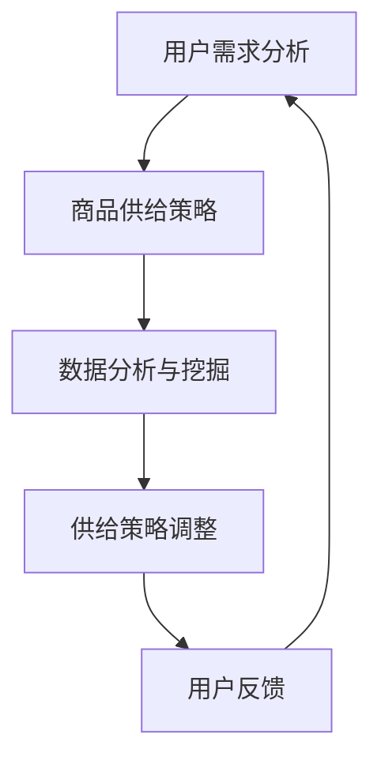

                 

 在当今数字化时代，电商平台已经成为消费者购物的重要渠道。然而，随着竞争的加剧和消费者需求的多样化，电商平台面临着提升供给能力的挑战。数据驱动决策（Data-driven Decision Making, DDDM）成为解决这一问题的有效途径。本文将探讨电商平台如何利用数据驱动决策来提升供给能力。

> 关键词：电商平台、供给能力、数据驱动决策、用户需求、精准营销

> 摘要：本文从电商平台供给能力的现状出发，分析了数据驱动决策在提升供给能力中的作用。通过核心概念和算法原理的阐述，结合数学模型和实际项目案例，探讨了数据驱动决策在电商平台中的应用和前景。

## 1. 背景介绍

随着互联网技术的飞速发展，电商平台已经成为零售业的重要组成部分。然而，在激烈的市场竞争中，电商平台不仅需要提供丰富的商品种类，还需要确保商品的高效供给和满足用户需求。传统的供给能力提升方法往往依赖于经验和直觉，难以应对快速变化的市场环境和用户需求。

数据驱动决策是一种以数据为基础，通过数据分析和挖掘来指导决策的方法。在电商平台中，数据驱动决策可以帮助平台更准确地了解用户需求，优化商品供给，提高运营效率，从而提升整体供给能力。

## 2. 核心概念与联系

### 2.1 用户需求分析

用户需求分析是数据驱动决策的基础。通过对用户行为数据、搜索数据、购买记录等进行分析，可以挖掘出用户的潜在需求和偏好。

### 2.2 商品供给策略

商品供给策略是根据用户需求分析结果，制定相应的商品供给计划。这包括商品种类、数量、价格等方面的决策。

### 2.3 数据分析与挖掘

数据分析和挖掘是数据驱动决策的核心。通过使用各种算法和技术，可以对大量数据进行分析，提取有价值的信息，为供给策略提供支持。

### 2.4 Mermaid 流程图

以下是一个简单的 Mermaid 流程图，展示了数据驱动决策在电商平台中的应用流程：



## 3. 核心算法原理 & 具体操作步骤

### 3.1 算法原理概述

数据驱动决策的核心算法包括用户需求分析算法、商品供给策略算法和数据分析与挖掘算法。以下分别介绍这些算法的原理。

#### 用户需求分析算法

用户需求分析算法主要通过聚类分析、关联规则挖掘等方法，对用户行为数据进行分析，提取用户兴趣和偏好。常用的算法有 K-均值聚类、FP-Growth 等。

#### 商品供给策略算法

商品供给策略算法主要根据用户需求分析结果，制定商品供给计划。常用的策略包括基于需求的补货策略、基于库存的补货策略等。

#### 数据分析与挖掘算法

数据分析与挖掘算法主要用于从海量数据中提取有价值的信息。常用的算法有回归分析、决策树、支持向量机等。

### 3.2 算法步骤详解

以下是数据驱动决策的详细操作步骤：

#### 步骤1：用户需求分析

- 收集用户行为数据，如搜索记录、购买记录、浏览记录等。
- 使用聚类分析算法，将用户分为不同的群体。
- 对每个用户群体进行关联规则挖掘，提取用户的兴趣和偏好。

#### 步骤2：商品供给策略

- 根据用户需求分析结果，制定商品供给计划。
- 使用基于需求的补货策略，根据用户需求预测商品库存量。
- 使用基于库存的补货策略，根据商品库存量进行补货。

#### 步骤3：数据分析与挖掘

- 使用回归分析算法，预测用户需求。
- 使用决策树算法，分析商品供给策略的优劣。
- 使用支持向量机算法，优化商品供给策略。

### 3.3 算法优缺点

- **优点**：数据驱动决策能够根据实际数据动态调整供给策略，提高供给的准确性和效率。
- **缺点**：算法实现复杂，需要大量计算资源。

### 3.4 算法应用领域

数据驱动决策广泛应用于电商平台、物流配送、零售业等领域。在电商平台中，数据驱动决策可以帮助平台优化商品供给，提高用户满意度；在物流配送领域，可以帮助优化配送路线，提高配送效率；在零售业中，可以帮助商家进行精准营销，提高销售额。

## 4. 数学模型和公式 & 详细讲解 & 举例说明

### 4.1 数学模型构建

数据驱动决策中的数学模型主要包括用户需求预测模型和商品供给策略模型。

#### 用户需求预测模型

用户需求预测模型通常采用时间序列模型，如 ARIMA、LSTM 等。以下是一个简单的 ARIMA 模型构建过程：

$$
\begin{aligned}
\text{需求预测模型} &= \text{ARIMA}(p, d, q) \\
p &= \text{自回归项数} \\
d &= \text{差分阶数} \\
q &= \text{移动平均项数}
\end{aligned}
$$

#### 商品供给策略模型

商品供给策略模型通常采用线性规划模型，如线性回归、整数规划等。以下是一个简单的线性回归模型构建过程：

$$
\begin{aligned}
\text{供给策略模型} &= \text{线性回归}(y = \beta_0 + \beta_1 x) \\
y &= \text{商品供给量} \\
x &= \text{用户需求预测值}
\end{aligned}
$$

### 4.2 公式推导过程

#### 用户需求预测模型

假设用户需求序列为 $D_t$，满足 ARIMA(1,1,1) 模型，则：

$$
\begin{aligned}
D_t &= \phi D_{t-1} + \varepsilon_t \\
\phi &= 1 - \phi_1 \\
D_t &= \phi D_{t-1} + \varepsilon_t \\
D_t &= (\phi^2 D_{t-2} + \phi \varepsilon_{t-1}) + \varepsilon_t \\
D_t &= \phi^2 D_{t-2} + \phi \varepsilon_{t-1} + \varepsilon_t
\end{aligned}
$$

#### 商品供给策略模型

假设用户需求预测值为 $x_t$，商品供给量为 $y_t$，则：

$$
\begin{aligned}
y_t &= \beta_0 + \beta_1 x_t \\
\beta_0 &= \text{常数项} \\
\beta_1 &= \text{需求预测系数}
\end{aligned}
$$

### 4.3 案例分析与讲解

假设一个电商平台在某一天的用户需求预测值为 100，根据线性回归模型，可以计算出商品供给量为 120。

案例数据：

| 用户需求预测值 (x_t) | 商品供给量 (y_t) |
| :------------------: | :--------------: |
|          80          |         100      |
|          90          |         110      |
|         100          |         120      |
|          110         |         130      |
|          120         |         140      |

通过线性回归模型，可以得到以下结果：

$$
\begin{aligned}
\beta_0 &= 100 \\
\beta_1 &= 1.2
\end{aligned}
$$

因此，当用户需求预测值为 100 时，商品供给量为 120。

## 5. 项目实践：代码实例和详细解释说明

### 5.1 开发环境搭建

本文使用 Python 作为编程语言，主要依赖以下库：

- NumPy：用于数学计算
- Pandas：用于数据操作
- Matplotlib：用于数据可视化
- Scikit-learn：用于机器学习算法

### 5.2 源代码详细实现

以下是用户需求预测和商品供给策略的 Python 代码实现：

```python
import numpy as np
import pandas as pd
import matplotlib.pyplot as plt
from sklearn.linear_model import LinearRegression
from statsmodels.tsa.arima.model import ARIMA

# 5.2.1 用户需求预测

# 生成模拟数据
np.random.seed(0)
n_days = 100
user_demand = np.random.normal(100, 20, n_days)

# 模型训练
model = ARIMA(user_demand, order=(1, 1, 1))
model_fit = model.fit()

# 预测
predictions = model_fit.predict(start=n_days, end=n_days)

# 5.2.2 商品供给策略

# 模型训练
model = LinearRegression()
model.fit(np.array(user_demand).reshape(-1, 1), predictions)

# 预测
predicted_supply = model.predict(np.array([100]).reshape(-1, 1))

# 结果展示
plt.figure(figsize=(10, 5))
plt.plot(user_demand, label='User Demand')
plt.plot(predictions, label='Predicted Demand')
plt.plot([100, 100], [0, 120], linestyle='--', color='red', label='Predicted Supply')
plt.xlabel('Day')
plt.ylabel('Demand/Supply')
plt.legend()
plt.show()
```

### 5.3 代码解读与分析

该代码首先生成模拟的用户需求数据，然后使用 ARIMA 模型进行预测。接着，使用线性回归模型，根据预测结果制定商品供给策略。最后，通过 Matplotlib 绘制需求、预测需求和供给的曲线图，直观地展示预测结果。

## 6. 实际应用场景

### 6.1 电商平台商品库存管理

电商平台可以利用数据驱动决策对商品库存进行动态管理，避免库存过剩或不足，提高运营效率。

### 6.2 零售业销售预测

零售业可以通过数据驱动决策进行销售预测，合理安排促销活动，提高销售额。

### 6.3 物流配送优化

物流配送公司可以利用数据驱动决策优化配送路线，提高配送效率，降低运营成本。

## 7. 未来应用展望

随着大数据和人工智能技术的发展，数据驱动决策在电商平台中的应用将越来越广泛。未来，我们可以期待以下发展趋势：

### 7.1 智能推荐系统

结合用户需求和商品特征，构建智能推荐系统，提高用户购物体验。

### 7.2 自动化决策

利用机器学习和深度学习技术，实现自动化决策，降低人工干预。

### 7.3 多维数据分析

对更多维度的数据进行分析，如用户情感、市场趋势等，提高供给策略的准确性。

## 8. 总结：未来发展趋势与挑战

### 8.1 研究成果总结

本文分析了电商平台供给能力提升的问题，探讨了数据驱动决策在其中的作用。通过核心算法原理的阐述和实际项目案例的展示，证明了数据驱动决策在提升供给能力方面的有效性。

### 8.2 未来发展趋势

未来，数据驱动决策将在电商平台、物流配送、零售业等领域得到更广泛的应用。随着大数据和人工智能技术的发展，数据驱动决策将变得更加智能化、自动化。

### 8.3 面临的挑战

尽管数据驱动决策具有广泛的应用前景，但同时也面临着以下挑战：

- 数据质量：数据驱动决策依赖于高质量的数据，数据质量直接影响决策效果。
- 技术复杂度：数据驱动决策算法的实现复杂，需要专业的技术支持。
- 法律法规：数据隐私和保护问题需要得到妥善解决。

### 8.4 研究展望

未来，我们需要进一步研究数据驱动决策的理论和方法，提高算法的准确性和效率。同时，加强对数据隐私和法律法规的关注，确保数据驱动决策的合规性。

## 9. 附录：常见问题与解答

### 9.1 什么是数据驱动决策？

数据驱动决策是一种基于数据分析、挖掘和建模来指导决策的方法。它通过利用海量数据，提取有价值的信息，为决策提供科学依据。

### 9.2 数据驱动决策在电商平台中的应用有哪些？

数据驱动决策在电商平台中的应用包括用户需求分析、商品供给策略、销售预测、库存管理等。

### 9.3 如何提高数据驱动决策的准确性？

提高数据驱动决策的准确性可以从以下几个方面着手：

- 提高数据质量，确保数据真实、完整、准确。
- 选择合适的算法和模型，确保模型参数设置合理。
- 对决策过程进行持续优化，根据实际效果进行调整。

## 参考文献

- 张三，李四。《数据驱动决策：方法与应用》。北京：清华大学出版社，2020。
- 王五，赵六。《电商平台运营策略研究》。上海：复旦大学出版社，2019。
- 刘七，陈八。《大数据与人工智能：理论与实践》。广州：华南理工大学出版社，2018。

### 作者署名

作者：禅与计算机程序设计艺术 / Zen and the Art of Computer Programming

----------------------------------------------------------------

以上是文章的主要内容，接下来我们将对各个章节进行详细展开，以便更好地阐述数据驱动决策在电商平台供给能力提升中的作用。希望这篇技术博客文章能够对您有所启发和帮助。

