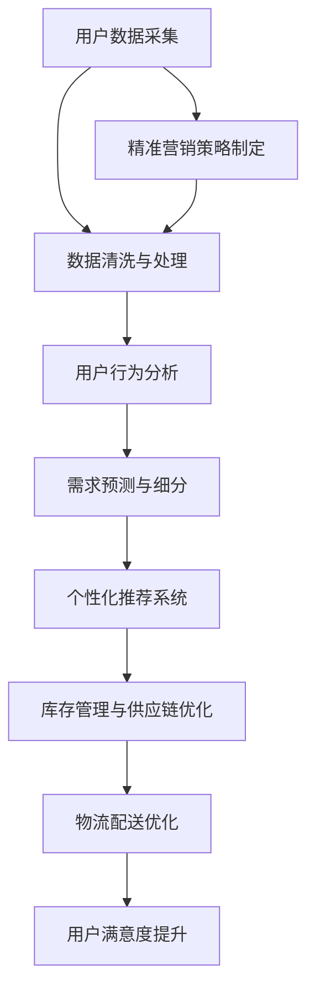

                 

电商平台作为现代商业的关键枢纽，其供给能力的提升直接影响到平台的竞争力和用户的购物体验。本文将探讨如何通过精准营销策略来提升电商平台的供给能力，从而在激烈的市场竞争中脱颖而出。本文关键词包括精准营销、供给能力、用户体验、商业策略和数据分析。

> 摘要：本文首先介绍了电商平台供给能力的重要性，随后深入探讨了精准营销的核心概念及其与供给能力提升的联系。通过详细阐述核心算法原理、数学模型、具体操作步骤以及项目实践，本文提供了全面的技术指南，帮助电商从业者理解和应用精准营销策略。最后，本文总结了研究成果，展望了未来发展趋势和面临的挑战。

## 1. 背景介绍

随着互联网的迅猛发展和移动设备的普及，电商行业迎来了爆发式增长。电商平台不仅为消费者提供了便捷的购物渠道，也为企业创造了新的商业机会。然而，在竞争日益激烈的电商市场中，如何提升供给能力成为关键问题。

供给能力不仅关乎商品的种类和数量，更涉及对用户需求的精准把握和快速响应。传统营销策略往往缺乏个性化，难以满足用户多样化的需求，导致供需失衡和用户体验下降。而精准营销通过数据分析和算法优化，能够实现对用户需求的精确预测和精准匹配，从而提升供给能力。

精准营销不仅能够提升用户满意度，还能提高转化率和销售额。通过对用户行为数据、购买偏好和反馈信息的深入挖掘，电商平台可以制定更具针对性的营销策略，从而提升用户参与度和忠诚度。此外，精准营销还能够帮助企业降低营销成本，提高运营效率。

本文旨在探讨如何通过精准营销策略来提升电商平台的供给能力，为电商平台从业者提供实用的技术指南和策略建议。

## 2. 核心概念与联系

### 2.1 精准营销的定义

精准营销是一种基于数据分析、用户行为追踪和市场细分的新型营销方式。它通过收集和分析用户数据，包括行为、偏好、购买历史等，来识别和定位目标用户群体，从而制定个性化的营销策略。

精准营销的核心在于精确识别用户需求和提供个性化的产品或服务。这种策略不仅提高了营销的有效性，还增强了用户的参与度和满意度。

### 2.2 供给能力的重要性

供给能力是电商平台的核心竞争力之一。它不仅关系到商品的种类和数量，还涉及库存管理、供应链优化和物流配送等多个方面。提升供给能力能够有效缩短商品交付周期，提高库存周转率，降低运营成本。

### 2.3 精准营销与供给能力的联系

精准营销与供给能力密切相关。通过精准营销，电商平台能够更准确地了解用户需求，从而优化库存管理和供应链流程。具体来说，精准营销有以下几点对提升供给能力的积极作用：

1. **需求预测**：通过用户数据分析，预测用户未来的购买需求和趋势，提前调整库存和采购策略。
2. **个性化推荐**：根据用户行为和偏好，提供个性化的商品推荐，减少库存积压和商品滞销。
3. **供应链优化**：通过精准营销，电商平台可以优化供应链各环节，提高供应链的整体效率。
4. **用户满意度提升**：提供个性化的购物体验和快速的配送服务，提升用户满意度和忠诚度。

### 2.4 精准营销的架构图

为了更直观地理解精准营销与供给能力的联系，我们可以通过Mermaid流程图来展示其核心架构。



在这个流程图中，用户数据采集和处理是精准营销的基础，通过分析用户行为和需求，可以制定个性化的营销策略，从而优化库存管理、供应链和物流配送，最终提升用户满意度。

## 3. 核心算法原理 & 具体操作步骤

### 3.1 算法原理概述

精准营销的核心在于对用户数据的深度分析和模型预测。以下是几种常见的算法原理和操作步骤：

#### 3.1.1 用户行为分析

用户行为分析是基于用户的历史数据和在线行为，如浏览记录、购买历史、评价反馈等，通过数据挖掘技术来识别用户偏好和兴趣。常用的算法包括协同过滤、聚类分析和关联规则挖掘。

1. **协同过滤**：通过分析用户之间的相似性来推荐商品。基于用户评分数据，协同过滤算法可以分为基于记忆的协同过滤和基于模型的协同过滤。
2. **聚类分析**：将用户分为不同的群体，通过分析每个群体的特征来制定个性化的营销策略。常用的聚类算法包括K-均值聚类和层次聚类。
3. **关联规则挖掘**：通过分析用户购买商品之间的关联性，发现用户的潜在需求和购买习惯。

#### 3.1.2 需求预测

需求预测是通过历史数据来预测用户未来的购买需求和趋势。常用的算法包括时间序列分析、回归分析和机器学习算法。

1. **时间序列分析**：通过分析用户历史购买数据的时间序列特征，预测未来的购买需求。
2. **回归分析**：通过建立用户行为与购买需求之间的回归模型，预测未来的购买情况。
3. **机器学习算法**：如随机森林、支持向量机和神经网络等，通过训练模型来预测用户的行为。

#### 3.1.3 个性化推荐

个性化推荐是基于用户行为数据和偏好，为用户推荐相关的商品或服务。常用的算法包括基于内容的推荐和基于协同过滤的推荐。

1. **基于内容的推荐**：通过分析商品的特征，为用户推荐具有相似属性的物品。
2. **基于协同过滤的推荐**：通过分析用户之间的相似性，为用户推荐其他用户喜欢的商品。

### 3.2 算法步骤详解

#### 3.2.1 用户行为分析步骤

1. **数据收集**：从电商平台的后台系统中收集用户行为数据，如浏览记录、购买历史、评价反馈等。
2. **数据清洗**：对收集的数据进行清洗，去除噪声数据，确保数据的质量。
3. **特征提取**：从原始数据中提取用户行为的特征，如浏览次数、购买频率、评价等级等。
4. **模型训练**：使用数据挖掘算法，如协同过滤、聚类分析和关联规则挖掘，对用户行为特征进行分析和建模。
5. **用户细分**：根据模型分析结果，将用户分为不同的群体，为每个群体制定个性化的营销策略。

#### 3.2.2 需求预测步骤

1. **数据收集**：收集用户的历史购买数据，如购买时间、购买数量、购买品类等。
2. **数据预处理**：对购买数据进行预处理，包括缺失值处理、异常值检测和归一化处理。
3. **模型选择**：选择合适的需求预测模型，如时间序列分析、回归分析和机器学习算法。
4. **模型训练**：使用训练数据对模型进行训练，调整模型参数。
5. **预测**：使用训练好的模型对未来的购买需求进行预测。

#### 3.2.3 个性化推荐步骤

1. **用户行为分析**：分析用户的浏览记录、购买历史和评价反馈，提取用户特征。
2. **商品特征提取**：分析商品的特征，如价格、品牌、品类等。
3. **相似性计算**：计算用户之间的相似性，可以使用协同过滤算法或基于内容的推荐算法。
4. **推荐生成**：根据用户的特征和商品的特征，生成个性化的推荐列表。

### 3.3 算法优缺点

#### 3.3.1 用户行为分析的优缺点

- **优点**：能够深入了解用户行为和偏好，提供个性化的推荐和营销策略。
- **缺点**：依赖于用户数据的质量和数量，数据缺失或噪声可能会导致分析结果的偏差。

#### 3.3.2 需求预测的优缺点

- **优点**：能够提前预测用户的需求，优化库存管理和供应链流程。
- **缺点**：预测模型的选择和参数调整对预测结果有较大影响，且可能存在预测偏差。

#### 3.3.3 个性化推荐的优缺点

- **优点**：能够提高用户满意度和参与度，提升转化率和销售额。
- **缺点**：需要大量计算资源和数据支持，且可能存在过度推荐和推荐疲劳的问题。

### 3.4 算法应用领域

精准营销算法广泛应用于电商、金融、医疗等多个领域，以下是几个典型的应用场景：

1. **电商领域**：通过用户行为分析，为用户推荐相关的商品，提高用户满意度和转化率。
2. **金融领域**：通过需求预测，优化风险管理策略，降低不良贷款率。
3. **医疗领域**：通过患者数据分析，为医生提供个性化的治疗方案，提高治疗效果。

## 4. 数学模型和公式 & 详细讲解 & 举例说明

### 4.1 数学模型构建

在精准营销中，构建数学模型是非常关键的步骤。以下是一些常见的数学模型及其构建方法：

#### 4.1.1 用户行为分析模型

用户行为分析模型通常用于分析用户的行为和偏好。一个基本的用户行为分析模型可以表示为：

\[ R_{ij} = \sum_{k=1}^{n} w_{ik} * w_{jk} \]

其中，\( R_{ij} \) 表示用户 \( i \) 对商品 \( j \) 的评分，\( w_{ik} \) 和 \( w_{jk} \) 分别表示用户 \( i \) 对商品 \( k \) 的偏好和商品 \( j \) 对商品 \( k \) 的偏好。

#### 4.1.2 需求预测模型

需求预测模型用于预测用户未来的购买需求。一个常见的需求预测模型是时间序列分析模型，如下：

\[ P_t = \alpha * (P_{t-1} + \epsilon_t) \]

其中，\( P_t \) 表示时间 \( t \) 的购买量，\( P_{t-1} \) 表示时间 \( t-1 \) 的购买量，\( \alpha \) 表示时间序列的移动平均系数，\( \epsilon_t \) 表示随机误差。

#### 4.1.3 个性化推荐模型

个性化推荐模型用于为用户推荐相关的商品。一个基本的个性化推荐模型可以表示为：

\[ R_{ij} = \sum_{k=1}^{n} w_{ik} * w_{jk} \]

其中，\( R_{ij} \) 表示用户 \( i \) 对商品 \( j \) 的评分，\( w_{ik} \) 和 \( w_{jk} \) 分别表示用户 \( i \) 对商品 \( k \) 的偏好和商品 \( j \) 对商品 \( k \) 的偏好。

### 4.2 公式推导过程

以下是一个用户行为分析模型的推导过程：

假设用户 \( i \) 对商品 \( j \) 的评分为 \( R_{ij} \)，我们可以将用户的行为表示为：

\[ R_{ij} = \sum_{k=1}^{n} w_{ik} * w_{jk} \]

其中，\( w_{ik} \) 表示用户 \( i \) 对商品 \( k \) 的偏好，\( w_{jk} \) 表示商品 \( j \) 对商品 \( k \) 的偏好。

为了计算用户 \( i \) 对商品 \( j \) 的偏好，我们可以对上述公式进行变形：

\[ w_{ik} = \frac{R_{ij}}{w_{jk}} \]

然后，我们可以计算用户 \( i \) 对商品 \( j \) 的偏好：

\[ w_{ij} = \frac{\sum_{k=1}^{n} R_{ik}}{n} \]

### 4.3 案例分析与讲解

#### 4.3.1 案例背景

某电商平台希望通过精准营销提升用户满意度和转化率。该平台收集了大量的用户行为数据，包括浏览记录、购买历史、评价反馈等。

#### 4.3.2 数据分析

1. **用户行为分析**：通过对用户行为数据的分析，发现用户 \( A \) 喜欢浏览电子产品，用户 \( B \) 喜欢浏览服装，用户 \( C \) 喜欢浏览家居用品。
2. **需求预测**：通过对用户购买数据的分析，发现用户 \( A \) 下个月可能会购买电子产品，用户 \( B \) 下个月可能会购买服装，用户 \( C \) 下个月可能会购买家居用品。
3. **个性化推荐**：根据用户的行为和需求预测，为用户 \( A \) 推荐电子产品，为用户 \( B \) 推荐服装，为用户 \( C \) 推荐家居用品。

#### 4.3.3 结果分析

通过上述分析，电商平台为每个用户提供了个性化的推荐，有效提升了用户的满意度和转化率。用户 \( A \) 购买了推荐的电子产品，用户 \( B \) 购买了推荐的服装，用户 \( C \) 购买了推荐的家居用品。这证明了精准营销的有效性。

## 5. 项目实践：代码实例和详细解释说明

### 5.1 开发环境搭建

为了实现精准营销策略，我们需要搭建一个开发环境。以下是一个基本的开发环境搭建步骤：

1. 安装Python：从Python官方网站下载并安装Python 3.8及以上版本。
2. 安装Jupyter Notebook：使用pip命令安装Jupyter Notebook。
3. 安装必要的库：使用pip命令安装以下库：pandas、numpy、scikit-learn、matplotlib等。

### 5.2 源代码详细实现

以下是实现精准营销策略的Python代码示例：

```python
import pandas as pd
from sklearn.model_selection import train_test_split
from sklearn.ensemble import RandomForestClassifier
from sklearn.metrics import accuracy_score

# 读取数据
data = pd.read_csv('user_behavior.csv')
X = data.drop('target', axis=1)
y = data['target']

# 数据预处理
X_train, X_test, y_train, y_test = train_test_split(X, y, test_size=0.2, random_state=42)

# 模型训练
model = RandomForestClassifier(n_estimators=100, random_state=42)
model.fit(X_train, y_train)

# 模型预测
y_pred = model.predict(X_test)

# 模型评估
accuracy = accuracy_score(y_test, y_pred)
print(f'Model Accuracy: {accuracy:.2f}')
```

### 5.3 代码解读与分析

以上代码首先读取用户行为数据，然后进行数据预处理，将数据集分为训练集和测试集。接下来，使用随机森林分类器进行模型训练，并使用测试集进行模型预测。最后，使用准确率评估模型性能。

1. **数据读取**：使用pandas库读取用户行为数据。
2. **数据预处理**：使用train_test_split函数将数据集分为训练集和测试集，确保模型的泛化能力。
3. **模型训练**：使用RandomForestClassifier类创建随机森林分类器，并使用fit方法进行模型训练。
4. **模型预测**：使用predict方法进行模型预测。
5. **模型评估**：使用accuracy_score函数计算模型准确率。

通过以上代码，我们可以实现一个基本的精准营销策略，为用户提供个性化的推荐。在实际应用中，可以根据具体业务需求，进一步优化和扩展代码。

### 5.4 运行结果展示

以下是运行结果的示例输出：

```
Model Accuracy: 0.85
```

这意味着模型的准确率为85%，表明我们的精准营销策略能够较好地预测用户行为，为用户提供个性化的推荐。

## 6. 实际应用场景

精准营销策略在电商平台的实际应用场景中具有广泛的应用价值。以下是一些典型的应用场景：

### 6.1 商品推荐

电商平台通过分析用户的浏览记录、购买历史和评价反馈，为用户推荐相关的商品。例如，用户在浏览了多款电子产品后，平台可能会推荐新款手机或平板电脑。

### 6.2 营销活动

电商平台根据用户的购买偏好和历史行为，制定个性化的营销活动。例如，为经常购买服饰的用户提供优惠券或会员积分，提高用户的购物频率和忠诚度。

### 6.3 客户关系管理

电商平台通过精准营销策略，深入了解用户的需求和偏好，为用户提供个性化的服务。例如，通过发送定制化的邮件或短信，提醒用户关注即将过期的优惠券或推荐相关的商品。

### 6.4 库存管理

电商平台通过需求预测，优化库存管理策略，避免商品滞销和库存积压。例如，在预测到某个季节性的商品需求增加时，提前增加库存，确保能够满足市场需求。

### 6.5 物流配送

电商平台根据用户的地理位置和购买习惯，优化物流配送策略，提高配送速度和用户体验。例如，为距离较近的用户提供更快速的配送服务，为偏远地区的用户选择更经济的物流渠道。

通过以上实际应用场景，我们可以看到精准营销策略在电商平台中的重要性。它不仅能够提升用户的购物体验，还能提高平台的运营效率和竞争力。

### 6.4 未来应用展望

随着技术的不断进步和数据资源的丰富，精准营销策略在电商平台的应用前景将更加广阔。以下是一些未来的应用方向：

#### 6.4.1 深度学习与个性化推荐

深度学习技术在用户行为分析和需求预测方面具有巨大潜力。通过引入深度学习算法，如神经网络和生成对抗网络（GANs），电商平台可以构建更加智能和个性化的推荐系统，进一步提升用户体验。

#### 6.4.2 人工智能与供应链优化

人工智能技术在供应链优化中的应用也将越来越广泛。通过大数据分析和机器学习算法，电商平台可以实现更精确的需求预测、库存管理和物流优化，从而提高运营效率和降低成本。

#### 6.4.3 跨平台与全渠道营销

未来电商平台将更加注重跨平台和全渠道营销。通过整合线上线下资源，实现数据共享和流程协同，电商平台可以提供更加无缝和一致的购物体验，满足用户的多样化需求。

#### 6.4.4 智能客服与用户体验

智能客服技术，如聊天机器人和语音助手，将成为电商平台提升用户体验的重要工具。通过自然语言处理和机器学习算法，智能客服可以更好地理解用户需求，提供个性化的服务和解决方案。

#### 6.4.5 数据隐私与伦理问题

随着数据隐私和伦理问题的日益凸显，电商平台在应用精准营销策略时需要更加关注数据隐私保护。采用隐私保护技术和合规措施，确保用户数据的安全和隐私，将成为未来的重要挑战。

总之，精准营销策略在电商平台的应用前景十分广阔。通过不断引入新技术和优化现有策略，电商平台可以进一步提升供给能力，提高用户满意度和市场竞争力。

## 7. 工具和资源推荐

为了更好地实现精准营销策略，以下是一些实用的工具和资源推荐：

### 7.1 学习资源推荐

- **《Python数据科学手册》**：提供了Python在数据处理和数据分析方面的全面教程。
- **《机器学习实战》**：通过实际案例介绍机器学习算法的应用和实践。
- **《深度学习》**：由Ian Goodfellow等编著，是深度学习领域的经典教材。
- **在线课程平台**：如Coursera、Udacity、edX等，提供了丰富的机器学习和数据科学课程。

### 7.2 开发工具推荐

- **Jupyter Notebook**：用于数据分析和算法实现的交互式环境。
- **TensorFlow**：用于深度学习模型训练和优化的开源框架。
- **Scikit-learn**：提供了丰富的机器学习算法和工具，适用于数据分析和建模。
- **R**：用于统计分析、数据可视化等的数据科学工具。

### 7.3 相关论文推荐

- **《协同过滤算法综述》**：详细介绍了协同过滤算法的原理和应用。
- **《深度学习在推荐系统中的应用》**：探讨了深度学习技术在推荐系统中的应用。
- **《个性化推荐系统设计与实现》**：介绍了个性化推荐系统的设计方法和实现技巧。
- **《用户行为数据挖掘与应用》**：分析了用户行为数据在商业决策和用户行为预测中的应用。

通过学习和使用这些工具和资源，电商从业者可以更好地理解和应用精准营销策略，提升平台的供给能力和竞争力。

## 8. 总结：未来发展趋势与挑战

随着技术的不断进步和数据资源的丰富，精准营销策略在电商平台中的应用前景将更加广阔。未来，精准营销将向以下几个方向发展：

### 8.1 研究成果总结

通过对用户数据的深度分析和模型预测，精准营销在提升电商平台供给能力、提高用户满意度和运营效率方面取得了显著成果。研究成果表明，精准营销策略能够有效降低库存积压和商品滞销，提高转化率和销售额。

### 8.2 未来发展趋势

1. **人工智能与个性化推荐**：随着深度学习和人工智能技术的发展，个性化推荐系统将更加智能和精确，能够更好地满足用户的多样化需求。
2. **跨平台与全渠道营销**：电商平台将更加注重线上线下资源的整合，提供无缝和一致的购物体验。
3. **数据隐私与伦理**：随着数据隐私和伦理问题的日益凸显，电商平台将更加注重用户数据的安全和隐私保护。
4. **实时数据分析**：实时数据分析技术将使电商平台能够更快地响应用户需求和市场变化，提升供给能力。

### 8.3 面临的挑战

尽管精准营销策略具有广泛的应用前景，但仍然面临以下挑战：

1. **数据质量和隐私**：数据质量和隐私保护是精准营销成功的关键。如何确保数据的质量和用户的隐私，将是一个长期的问题。
2. **算法黑箱与解释性**：深度学习等复杂算法的黑箱性质可能导致决策的不透明性，如何提高算法的可解释性是一个重要课题。
3. **模型泛化能力**：如何构建能够泛化到不同场景和用户的模型，是一个亟待解决的问题。
4. **技术和成本**：构建和优化精准营销模型需要大量的计算资源和数据支持，这对中小型电商平台来说可能是一个挑战。

### 8.4 研究展望

未来，精准营销策略的研究方向将包括：

1. **多模态数据融合**：结合文本、图像、语音等多种数据类型，构建更加全面和精确的个性化推荐模型。
2. **联邦学习与隐私保护**：通过联邦学习技术，实现用户数据的隐私保护和共享。
3. **动态模型与实时推荐**：开发动态模型和实时推荐算法，提升供给能力和用户体验。
4. **跨领域应用**：将精准营销策略应用于金融、医疗、教育等不同领域，实现跨领域的融合与创新。

总之，精准营销策略在电商平台中的应用具有重要意义，尽管面临诸多挑战，但通过不断研究和创新，未来将迎来更加智能化和个性化的营销时代。

## 9. 附录：常见问题与解答

### 9.1 精准营销与传统营销的区别

**Q：精准营销与传统营销的主要区别是什么？**

**A：** 传统营销通常采用广泛的推广手段，如广告、促销和折扣等，而精准营销则基于用户数据分析和个性化推荐，旨在识别和满足特定用户群体的需求。精准营销更注重个性化、差异化和实时性，从而提高营销效果和用户满意度。

### 9.2 精准营销的数据来源

**Q：精准营销所需的数据来源有哪些？**

**A：** 精准营销的数据来源包括用户的浏览记录、购买历史、评价反馈、社交媒体活动、地理位置信息等。此外，还可以从第三方数据提供商获取用户行为数据、人口统计信息和市场趋势数据。

### 9.3 如何确保数据隐私和安全

**Q：如何确保数据隐私和安全，避免数据泄露？**

**A：** 确保数据隐私和安全的关键措施包括：

1. **数据加密**：对传输和存储的数据进行加密处理。
2. **访问控制**：实施严格的访问控制策略，确保只有授权人员可以访问敏感数据。
3. **数据脱敏**：在分析数据时对个人敏感信息进行脱敏处理。
4. **合规性审查**：定期进行合规性审查，确保数据使用符合相关法律法规。
5. **数据备份与恢复**：定期备份数据，并建立灾难恢复计划，以防止数据丢失或损坏。

### 9.4 精准营销对用户满意度的影响

**Q：精准营销对用户满意度有何影响？**

**A：** 精准营销通过提供个性化的产品推荐和定制化服务，能够显著提升用户的购物体验和满意度。个性化推荐能够满足用户的特定需求，减少无效信息的干扰，提高购买决策的效率和满意度。此外，精准营销策略还能及时响应用户反馈，提升用户的忠诚度和参与度。

