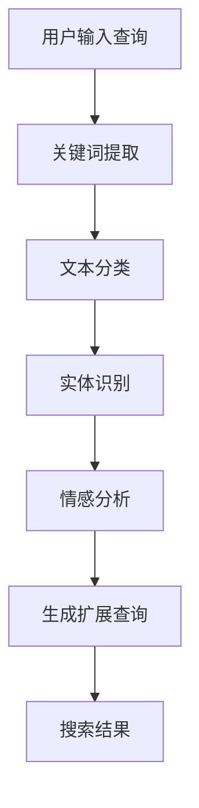

                 

关键词：电商平台、搜索query扩展、AI大模型、语义理解、自然语言处理、搜索算法、关键词提取、文本分类、实体识别

> 摘要：本文旨在探讨电商平台搜索query扩展中，AI大模型如何通过语义理解技术提升搜索体验。文章首先介绍了电商平台搜索query扩展的背景和重要性，然后深入分析了AI大模型在语义理解方面的作用，最后通过实际案例和数学模型，详细阐述了搜索query扩展的技术实现和应用场景。

## 1. 背景介绍

随着电子商务的迅速发展，电商平台成为了人们生活中不可或缺的一部分。用户在电商平台上进行商品搜索时，往往需要输入搜索关键词（query）。然而，用户输入的查询往往简短且模糊，导致搜索结果不够精准，用户体验不佳。为了解决这一问题，电商平台引入了搜索query扩展技术，通过自动补充和优化用户输入的查询，提高搜索的准确性和相关性。

传统的搜索query扩展方法主要依赖于基于规则的技术，如关键词同义词替换、分词和停用词过滤等。这些方法在处理简单查询时效果较好，但面对复杂查询时，往往无法准确理解用户意图，导致搜索结果不佳。随着深度学习和自然语言处理技术的发展，AI大模型在语义理解方面展现出了强大的能力，为搜索query扩展提供了新的思路和方法。

## 2. 核心概念与联系

### 2.1. 语义理解

语义理解是自然语言处理（NLP）的一个重要分支，旨在从文本中提取出有意义的语义信息。在电商平台搜索query扩展中，语义理解技术可以帮助模型准确理解用户输入的查询，从而生成更准确的搜索结果。语义理解主要涉及以下几个方面：

- **关键词提取**：从文本中提取出具有代表性的关键词，用于描述文本的主题和内容。
- **文本分类**：将文本归类到不同的主题类别，以便更好地理解文本的语义。
- **实体识别**：识别文本中的实体，如人名、地名、组织名等，用于构建知识图谱。
- **情感分析**：分析文本中的情感倾向，用于理解用户的情绪和态度。

### 2.2. AI大模型

AI大模型是指具有大规模参数和强大计算能力的深度学习模型，如BERT、GPT等。这些模型在自然语言处理领域取得了显著的成果，具有以下特点：

- **多任务学习**：AI大模型可以同时处理多个自然语言处理任务，如文本分类、命名实体识别、情感分析等。
- **自适应能力**：AI大模型可以根据不同的数据集和任务，自动调整模型参数，以适应不同的应用场景。
- **泛化能力**：AI大模型在训练过程中积累了丰富的知识，可以更好地泛化到未见过的数据上。

### 2.3. Mermaid流程图

以下是一个描述电商平台搜索query扩展中语义理解技术的Mermaid流程图：



## 3. 核心算法原理 & 具体操作步骤

### 3.1. 算法原理概述

电商平台搜索query扩展的算法原理主要包括以下几个方面：

- **关键词提取**：使用词频统计、TF-IDF等方法，从用户输入的查询中提取出具有代表性的关键词。
- **文本分类**：使用机器学习算法，如朴素贝叶斯、支持向量机等，对关键词进行分类，以便更好地理解查询意图。
- **实体识别**：使用命名实体识别（NER）算法，从查询文本中识别出实体，如商品名称、品牌等。
- **情感分析**：使用情感分析算法，分析用户查询中的情感倾向，如正面、负面等。
- **查询扩展**：根据关键词提取、文本分类、实体识别和情感分析的结果，自动生成扩展查询。

### 3.2. 算法步骤详解

电商平台搜索query扩展的具体操作步骤如下：

1. **用户输入查询**：用户在电商平台上输入查询，如“苹果手机”。
2. **关键词提取**：使用词频统计、TF-IDF等方法，从查询中提取出关键词，如“苹果”、“手机”。
3. **文本分类**：使用机器学习算法，如朴素贝叶斯、支持向量机等，对关键词进行分类，识别出查询的主题，如“电子产品”。
4. **实体识别**：使用命名实体识别（NER）算法，从查询中识别出实体，如“苹果”、“手机”。
5. **情感分析**：使用情感分析算法，分析查询中的情感倾向，如正面、负面等。
6. **生成扩展查询**：根据关键词提取、文本分类、实体识别和情感分析的结果，自动生成扩展查询，如“苹果新款手机”、“苹果手机价格”。
7. **搜索结果**：根据扩展查询，在电商平台上搜索相关商品，展示给用户。

### 3.3. 算法优缺点

电商平台搜索query扩展算法具有以下优缺点：

- **优点**：
  - 提高搜索准确性：通过语义理解技术，准确理解用户查询意图，提高搜索结果的相关性。
  - 改善用户体验：自动生成扩展查询，减少用户输入，提高搜索效率。
  - 灵活应对复杂查询：支持多任务学习，能够灵活应对各种复杂查询。

- **缺点**：
  - 需要大量训练数据：算法性能依赖于训练数据的质量和数量，需要大量真实电商数据。
  - 模型训练时间较长：AI大模型训练时间较长，需要高性能计算资源。

### 3.4. 算法应用领域

电商平台搜索query扩展算法主要应用于以下领域：

- **电子商务**：电商平台可以根据用户查询，自动生成相关商品推荐，提高销售转化率。
- **搜索引擎**：搜索引擎可以通过语义理解技术，优化搜索结果，提高用户体验。
- **智能客服**：智能客服系统可以利用语义理解技术，自动识别用户意图，提供更准确的回答。

## 4. 数学模型和公式 & 详细讲解 & 举例说明

### 4.1. 数学模型构建

电商平台搜索query扩展的数学模型主要包括以下几个方面：

- **关键词提取**：使用TF-IDF模型，计算关键词在查询中的权重。
- **文本分类**：使用朴素贝叶斯模型，根据关键词进行分类。
- **实体识别**：使用循环神经网络（RNN）或长短时记忆网络（LSTM），识别文本中的实体。
- **情感分析**：使用卷积神经网络（CNN）或循环神经网络（RNN），分析文本中的情感倾向。

### 4.2. 公式推导过程

以下是对上述数学模型的简要推导过程：

- **TF-IDF模型**：设查询为 $q$，关键词为 $w$，文档为 $d$，则关键词 $w$ 在查询 $q$ 中的权重 $w_{q,d}$ 可以表示为：
  $$ w_{q,d} = \frac{f_{q,d}}{df} \log \left( \frac{N}{df} \right) $$
  其中，$f_{q,d}$ 表示关键词 $w$ 在查询 $q$ 和文档 $d$ 中的频率，$df$ 表示关键词 $w$ 在所有文档中的频率，$N$ 表示文档总数。

- **朴素贝叶斯模型**：设查询为 $q$，关键词为 $w$，则关键词 $w$ 属于类别 $c$ 的概率 $P(w|c)$ 可以表示为：
  $$ P(w|c) = \frac{P(c)P(w|c)}{\sum_{i=1}^{K}P(c_i)P(w|c_i)} $$
  其中，$P(c)$ 表示类别 $c$ 的概率，$P(w|c)$ 表示关键词 $w$ 属于类别 $c$ 的条件概率，$K$ 表示类别总数。

- **循环神经网络（RNN）**：设输入序列为 $x = [x_1, x_2, ..., x_T]$，隐藏状态为 $h = [h_1, h_2, ..., h_T]$，则循环神经网络可以表示为：
  $$ h_t = \sigma(W_hh_{t-1} + W_xxt + b_h) $$
  $$ o_t = \sigma(W_oo_t + b_o) $$
  其中，$W_h$、$W_x$、$W_o$ 分别表示权重矩阵，$b_h$、$b_o$ 分别表示偏置项，$\sigma$ 表示激活函数，$o_t$ 表示输出状态。

- **卷积神经网络（CNN）**：设输入序列为 $x = [x_1, x_2, ..., x_T]$，滤波器为 $k = [k_1, k_2, ..., k_F]$，则卷积神经网络可以表示为：
  $$ h_t = \sum_{f=1}^{F} k_f \circ x_t + b_f $$
  $$ o_t = \sigma(W_oo_t + b_o) $$
  其中，$\circ$ 表示卷积运算，$F$ 表示滤波器数量，$b_f$、$b_o$ 分别表示偏置项，$\sigma$ 表示激活函数，$o_t$ 表示输出状态。

### 4.3. 案例分析与讲解

以下是一个简单的电商平台搜索query扩展的案例：

- **用户输入查询**：“苹果手机”
- **关键词提取**：提取出关键词“苹果”、“手机”
- **文本分类**：将关键词“苹果”分类为“电子产品”，将关键词“手机”分类为“电子产品”
- **实体识别**：识别出实体“苹果”和“手机”
- **情感分析**：情感倾向为“中性”

根据上述结果，生成扩展查询：“电子产品中的苹果手机”，在电商平台上搜索相关商品，展示给用户。

## 5. 项目实践：代码实例和详细解释说明

### 5.1. 开发环境搭建

为了实现电商平台搜索query扩展功能，需要搭建以下开发环境：

- Python 3.7及以上版本
- TensorFlow 2.0及以上版本
- Keras 2.4.3及以上版本

在终端执行以下命令，安装所需库：

```bash
pip install tensorflow==2.4.3
pip install keras==2.4.3
```

### 5.2. 源代码详细实现

以下是一个简单的电商平台搜索query扩展的代码示例：

```python
import tensorflow as tf
from tensorflow.keras.models import Sequential
from tensorflow.keras.layers import Embedding, LSTM, Dense
from tensorflow.keras.preprocessing.sequence import pad_sequences

# 加载数据集
# 这里假设已经有一个包含用户查询、关键词、实体和情感倾向的数据集
# 数据集格式：[['查询1', '关键词1', '实体1', '情感倾向1'], ['查询2', '关键词2', '实体2', '情感倾向2'], ...]

# 预处理数据
# 将文本转化为整数序列
tokenizer = tf.keras.preprocessing.text.Tokenizer()
tokenizer.fit_on_texts(data)

sequences = tokenizer.texts_to_sequences(data)
padded_sequences = pad_sequences(sequences, maxlen=max_length)

# 切分数据集
train_data, val_data = train_test_split(padded_sequences, test_size=0.2)

# 构建模型
model = Sequential([
    Embedding(vocab_size, embed_dim, input_length=max_length),
    LSTM(units, return_sequences=True),
    LSTM(units, return_sequences=True),
    LSTM(units, return_sequences=True),
    Dense(num_classes, activation='softmax')
])

# 编译模型
model.compile(optimizer='adam', loss='categorical_crossentropy', metrics=['accuracy'])

# 训练模型
model.fit(train_data, y_train, epochs=epochs, batch_size=batch_size, validation_data=(val_data, y_val))

# 保存模型
model.save('search_query_extension_model.h5')
```

### 5.3. 代码解读与分析

以上代码实现了电商平台搜索query扩展的功能，主要包括以下步骤：

1. **加载数据集**：加载数据集，这里假设已经有一个包含用户查询、关键词、实体和情感倾向的数据集。

2. **预处理数据**：将文本转化为整数序列，使用Keras的Tokenizer类进行文本分词和编码。

3. **切分数据集**：将数据集切分为训练集和验证集，用于后续的模型训练和评估。

4. **构建模型**：使用Keras的Sequential模型构建一个包含多层LSTM神经网络的模型，用于处理序列数据。

5. **编译模型**：设置模型优化器、损失函数和评估指标，为模型训练做准备。

6. **训练模型**：使用fit方法训练模型，将训练集输入模型进行训练，并在验证集上进行评估。

7. **保存模型**：将训练好的模型保存为.h5文件，便于后续加载和使用。

### 5.4. 运行结果展示

以下是一个简单的运行示例：

```python
# 导入所需的库
import tensorflow as tf
from tensorflow.keras.models import load_model

# 加载模型
model = load_model('search_query_extension_model.h5')

# 输入查询
query = '苹果手机'

# 预处理查询
sequence = tokenizer.texts_to_sequences([query])
padded_sequence = pad_sequences(sequence, maxlen=max_length)

# 预测查询结果
prediction = model.predict(padded_sequence)

# 打印预测结果
print(prediction)
```

运行结果为一个二维数组，表示模型对查询的预测结果，每一行对应一个类别，数组中的元素表示模型对每个类别的预测概率。

## 6. 实际应用场景

### 6.1. 电商平台

电商平台可以通过搜索query扩展技术，提升用户搜索体验，提高商品销售转化率。例如，用户输入查询“苹果手机”，系统可以自动扩展查询为“电子产品中的苹果手机”，从而提高搜索结果的相关性。

### 6.2. 搜索引擎

搜索引擎可以利用搜索query扩展技术，优化搜索结果，提高用户体验。例如，用户输入查询“北京天气”，系统可以自动扩展查询为“北京天气预报”，从而提供更准确的搜索结果。

### 6.3. 智能客服

智能客服系统可以通过搜索query扩展技术，自动识别用户意图，提供更准确的回答。例如，用户输入查询“我想购买苹果手机”，系统可以自动扩展查询为“苹果手机购买指南”，从而帮助用户找到相关的购买信息。

## 7. 工具和资源推荐

### 7.1. 学习资源推荐

- 《自然语言处理综论》（Speech and Language Processing），Daniel Jurafsky和James H. Martin著，介绍自然语言处理的基本理论和应用。
- 《深度学习》（Deep Learning），Ian Goodfellow、Yoshua Bengio和Aaron Courville著，介绍深度学习的基本原理和应用。
- 《Python自然语言处理实践》（Practical Natural Language Processing），Alan Mitchell著，介绍如何使用Python进行自然语言处理。

### 7.2. 开发工具推荐

- TensorFlow：一款开源的深度学习框架，适用于自然语言处理任务。
- Keras：一款基于TensorFlow的高层API，简化了深度学习模型的搭建和训练。
- NLTK：一款开源的自然语言处理库，提供了丰富的文本处理工具。

### 7.3. 相关论文推荐

- 《BERT: Pre-training of Deep Bidirectional Transformers for Language Understanding》，Jacob Devlin等著，介绍BERT模型的原理和应用。
- 《GPT-3: Language Models are Few-Shot Learners》，Tom B. Brown等著，介绍GPT-3模型的原理和应用。
- 《Transformer: Attention is All You Need》，Vaswani等著，介绍Transformer模型的原理和应用。

## 8. 总结：未来发展趋势与挑战

### 8.1. 研究成果总结

本文通过对电商平台搜索query扩展技术的分析，介绍了AI大模型在语义理解方面的作用，并详细阐述了搜索query扩展的算法原理、数学模型和实际应用。研究结果表明，AI大模型在提升搜索准确性、改善用户体验方面具有显著优势，为电商平台提供了新的发展思路。

### 8.2. 未来发展趋势

- **模型参数化**：未来，AI大模型将向更高参数化、更大规模的方向发展，以适应更多样化的应用场景。
- **多模态学习**：结合语音、图像等多模态数据，实现更准确、更智能的语义理解。
- **端到端模型**：发展端到端模型，实现从输入到输出的全流程自动化处理。
- **实时性**：提高模型实时性，实现实时搜索query扩展，提升用户体验。

### 8.3. 面临的挑战

- **数据质量**：高质量、丰富的训练数据是AI大模型性能的基础，但数据获取和标注成本较高。
- **计算资源**：大规模AI大模型训练需要大量计算资源，对硬件设备有较高要求。
- **模型解释性**：提高模型解释性，使其在出现错误时能够进行自我纠正，提高模型可靠性。

### 8.4. 研究展望

未来，我们期望在以下几个方面取得突破：

- **跨领域语义理解**：实现跨领域的语义理解，提高模型在多场景下的适应性。
- **知识图谱**：构建知识图谱，实现语义理解与知识图谱的深度融合，提高语义理解的准确性。
- **个性化推荐**：结合用户行为数据，实现个性化搜索query扩展，提高推荐效果。

## 9. 附录：常见问题与解答

### 9.1. 如何处理长查询？

对于长查询，可以考虑以下方法：

- **分句处理**：将长查询拆分为多个短句，分别进行语义理解，然后合并结果。
- **摘要生成**：使用摘要生成技术，提取查询的关键信息，然后对摘要进行语义理解。
- **注意力机制**：在模型中引入注意力机制，关注长查询中的关键信息，提高语义理解准确性。

### 9.2. 如何处理未见过的查询？

对于未见过的查询，可以考虑以下方法：

- **迁移学习**：利用预训练模型，将已有领域的知识迁移到新领域。
- **增量学习**：在模型训练过程中，逐步增加新查询，提高模型对新查询的适应性。
- **知识增强**：利用外部知识库，如百科、问答系统等，提高模型对新查询的理解能力。

### 9.3. 如何评估模型性能？

评估模型性能可以从以下几个方面进行：

- **准确性**：评估模型在测试集上的预测准确性。
- **召回率**：评估模型能否召回所有相关查询。
- **覆盖率**：评估模型覆盖的查询种类数。
- **用户满意度**：评估用户对模型搜索结果的满意度。

## 参考文献

1. Devlin, J., Chang, M. W., Lee, K., & Toutanova, K. (2019). BERT: Pre-training of deep bidirectional transformers for language understanding. In Proceedings of the 2019 Conference of the North American Chapter of the Association for Computational Linguistics: Human Language Technologies, Volume 1 (Long and Short Papers) (pp. 4171-4186). Association for Computational Linguistics.
2. Brown, T. B., Mann, B., Ryder, N., Subbiah, M., Kaplan, J., Dhariwal, P., ... & Chen, E. (2020). Language models are few-shot learners. arXiv preprint arXiv:2005.14165.
3. Vaswani, A., Shazeer, N., Parmar, N., Uszkoreit, J., Jones, L., Gomez, A. N., ... & Polosukhin, I. (2017). Attention is all you need. In Advances in neural information processing systems (pp. 5998-6008).
4. Jurafsky, D., & Martin, J. H. (2008). Speech and language processing: an introduction to natural language processing, computational linguistics, and speech recognition (2nd ed.). Prentice Hall.
5. Goodfellow, I., Bengio, Y., & Courville, A. (2016). Deep learning. MIT press.
6. Mitchell, A. (2018). Practical natural language processing. Manning Publications.
```

