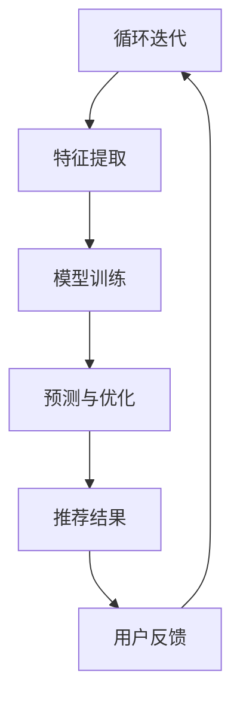

                 

关键词：电商平台，搜索推荐系统，AI 大模型，性能优化，效率提升，准确率提高，多样性增强

摘要：随着电子商务的快速发展，电商平台搜索推荐系统的重要性日益凸显。本文旨在探讨如何通过AI大模型优化电商平台搜索推荐系统的性能、效率和准确率，并提高推荐系统的多样性。我们将从背景介绍、核心概念与联系、核心算法原理与具体操作步骤、数学模型与公式、项目实践、实际应用场景、工具和资源推荐、总结与展望等多个方面展开讨论。

## 1. 背景介绍

电商平台作为现代商业的重要载体，其搜索推荐系统对于用户的购物体验和商家销售额的提升具有关键作用。然而，随着数据量的爆炸式增长和用户需求的多样化，传统的搜索推荐系统面临巨大的挑战。为了解决这些问题，人工智能（AI）技术应运而生，其中大模型成为了提升搜索推荐系统性能的重要工具。

AI大模型是一种能够处理大量数据并自动学习的数据模型，具有强大的特征提取和预测能力。通过AI大模型的优化，可以显著提高电商平台搜索推荐系统的性能、效率和准确率，同时增强推荐系统的多样性。

本文将围绕以下几个方面展开讨论：

- 电商平台搜索推荐系统的现状与挑战
- AI大模型的核心概念与联系
- AI大模型的优化策略与具体操作步骤
- 数学模型和公式在AI大模型中的应用
- AI大模型在电商平台搜索推荐系统的项目实践
- AI大模型在实际应用场景中的效果分析
- 相关工具和资源的推荐
- AI大模型的发展趋势与面临的挑战

## 2. 核心概念与联系

在探讨AI大模型优化电商平台搜索推荐系统之前，我们需要先了解一些核心概念和它们之间的联系。

### 2.1 电商平台搜索推荐系统

电商平台搜索推荐系统是一种基于用户行为和商品信息的数据挖掘技术，旨在为用户提供个性化的商品推荐。其主要功能包括：

- 搜索：为用户提供商品搜索功能，帮助用户快速找到所需商品。
- 推荐列表：根据用户的历史行为和商品属性，为用户推荐可能感兴趣的商品。

### 2.2 人工智能与大数据

人工智能（AI）是一种模拟人类智能的技术，具有学习能力、推理能力和决策能力。大数据（Big Data）则是指数据量巨大、类型多样且增长迅速的数据集合。人工智能与大数据的结合，使得AI大模型成为可能。

### 2.3 大模型

大模型是指具有大量参数、能够处理大规模数据的深度学习模型。大模型通常具有以下特点：

- 参数规模：大模型通常包含数百万、数十亿甚至更多的参数。
- 数据需求：大模型需要大量的训练数据来训练模型参数。
- 计算资源：大模型训练和推理过程通常需要高性能计算资源。

### 2.4 搜索推荐系统与AI大模型的联系

电商平台搜索推荐系统与AI大模型之间的联系主要体现在以下几个方面：

- 特征提取：AI大模型能够从大量的用户行为和商品信息中提取出有效的特征，为推荐系统提供高质量的输入。
- 预测与优化：AI大模型能够通过自动学习，提高推荐系统的预测准确率，从而优化推荐结果。
- 多样性增强：AI大模型能够根据用户需求，提供多样化的推荐结果，提高用户满意度。

### 2.5 Mermaid流程图

为了更清晰地展示搜索推荐系统与AI大模型之间的联系，我们可以使用Mermaid流程图来表示。以下是搜索推荐系统与AI大模型的流程图：



## 3. 核心算法原理 & 具体操作步骤

### 3.1 算法原理概述

AI大模型优化电商平台搜索推荐系统的核心算法主要包括以下两个方面：

- 特征提取：通过深度学习模型，从用户行为数据和商品信息中提取出有效的特征。
- 预测与优化：利用提取出的特征，通过机器学习算法，预测用户对商品的兴趣，并进行推荐。

### 3.2 算法步骤详解

#### 3.2.1 特征提取

特征提取是AI大模型优化电商平台搜索推荐系统的第一步。具体操作步骤如下：

1. 数据预处理：对用户行为数据和商品信息进行清洗和预处理，包括去重、填充缺失值等操作。
2. 特征工程：根据业务需求和模型性能，选择合适的特征进行提取，如用户行为特征、商品属性特征等。
3. 模型训练：利用提取出的特征，通过深度学习模型，如卷积神经网络（CNN）或循环神经网络（RNN），进行特征提取和自动学习。

#### 3.2.2 预测与优化

预测与优化是AI大模型优化电商平台搜索推荐系统的关键步骤。具体操作步骤如下：

1. 数据集划分：将用户行为数据集划分为训练集、验证集和测试集，用于模型训练、验证和测试。
2. 模型训练：利用训练集数据，通过机器学习算法，如矩阵分解（MF）或协同过滤（CF），训练模型参数。
3. 模型评估：利用验证集数据，评估模型性能，如准确率、召回率、F1值等。
4. 模型优化：根据评估结果，调整模型参数，提高模型性能。
5. 推荐结果生成：利用训练好的模型，对测试集数据生成推荐结果，并进行优化。

### 3.3 算法优缺点

#### 优点：

- 提高推荐准确性：通过深度学习和机器学习算法，可以更好地提取用户特征，提高推荐准确性。
- 提高推荐效率：大模型训练和预测过程可以通过并行计算和分布式计算提高效率。
- 提高多样性：通过自动学习和优化，可以提供多样化的推荐结果，满足不同用户的需求。

#### 缺点：

- 计算资源需求大：大模型训练和预测过程需要大量计算资源，如GPU、TPU等。
- 特征工程复杂：大模型的特征提取和自动学习需要复杂的特征工程，对数据质量和特征选择有较高要求。
- 模型解释性差：大模型通常具有较强的预测能力，但解释性较差，不利于业务理解和优化。

### 3.4 算法应用领域

AI大模型在电商平台搜索推荐系统的优化具有广泛的应用领域，包括但不限于：

- 电商平台：如淘宝、京东、亚马逊等，通过优化搜索推荐系统，提高用户满意度和商家销售额。
- 社交媒体：如微博、Facebook、Twitter等，通过优化内容推荐，提高用户活跃度和粘性。
- 金融服务：如银行、保险、证券等，通过优化产品推荐，提高用户转化率和盈利能力。
- 娱乐行业：如视频网站、音乐平台等，通过优化内容推荐，提高用户观看和收听时长。

## 4. 数学模型和公式 & 详细讲解 & 举例说明

### 4.1 数学模型构建

在AI大模型优化电商平台搜索推荐系统中，常用的数学模型主要包括以下几种：

- 矩阵分解（Matrix Factorization, MF）
- 协同过滤（Collaborative Filtering, CF）
- 支持向量机（Support Vector Machine, SVM）
- 卷积神经网络（Convolutional Neural Network, CNN）
- 循环神经网络（Recurrent Neural Network, RNN）

#### 4.1.1 矩阵分解

矩阵分解是一种基于线性模型的数学方法，主要用于预测用户和商品之间的关联性。其基本思想是将用户行为矩阵拆分为用户特征矩阵和商品特征矩阵的乘积。

矩阵分解的数学模型如下：

$$
R = U \times V
$$

其中，$R$ 表示用户行为矩阵，$U$ 表示用户特征矩阵，$V$ 表示商品特征矩阵。

#### 4.1.2 协同过滤

协同过滤是一种基于用户相似度的数学方法，通过计算用户之间的相似度，为用户推荐相似用户喜欢的商品。

协同过滤的数学模型如下：

$$
s_{ij} = \mu + u_i + v_j - \rho(u_i, v_j)
$$

其中，$s_{ij}$ 表示用户 $i$ 对商品 $j$ 的评分，$\mu$ 表示所有用户对商品 $j$ 的平均评分，$u_i$ 和 $v_j$ 分别表示用户 $i$ 和商品 $j$ 的特征向量，$\rho(u_i, v_j)$ 表示用户 $i$ 和商品 $j$ 之间的相似度。

#### 4.1.3 支持向量机

支持向量机是一种基于核函数的数学方法，通过将数据映射到高维空间，找到最佳的分类超平面，从而实现分类。

支持向量机的数学模型如下：

$$
y(\phi(x)) = w^T \phi(x) + b
$$

其中，$y$ 表示样本标签，$\phi(x)$ 表示高维空间中的特征向量，$w$ 表示分类超平面参数，$b$ 表示偏置。

#### 4.1.4 卷积神经网络

卷积神经网络是一种基于局部连接和共享参数的数学方法，通过多层卷积和池化操作，提取图像中的特征。

卷积神经网络的数学模型如下：

$$
h_{l}(x) = \sigma(W_l \odot h_{l-1} + b_l)
$$

其中，$h_{l}(x)$ 表示第 $l$ 层的特征向量，$\sigma$ 表示激活函数，$W_l$ 和 $b_l$ 分别表示第 $l$ 层的权重和偏置。

#### 4.1.5 循环神经网络

循环神经网络是一种基于序列处理的数学方法，通过循环连接和门控机制，捕捉序列中的长期依赖关系。

循环神经网络的数学模型如下：

$$
h_{t} = \sigma(W_h h_{t-1} + W_x x_t + b_h)
$$

其中，$h_{t}$ 表示第 $t$ 个时刻的特征向量，$W_h$ 和 $W_x$ 分别表示门控权重，$b_h$ 表示门控偏置。

### 4.2 公式推导过程

在本节中，我们将对矩阵分解和协同过滤的数学模型进行推导。

#### 4.2.1 矩阵分解推导

假设用户行为矩阵 $R$ 的大小为 $m \times n$，其中 $m$ 表示用户数量，$n$ 表示商品数量。我们希望将 $R$ 分解为两个低秩矩阵 $U$ 和 $V$，其中 $U$ 的大小为 $m \times k$，$V$ 的大小为 $n \times k$，$k$ 表示特征维度。

为了最小化重构误差，我们可以使用最小二乘法进行矩阵分解：

$$
\min_{U, V} \sum_{i=1}^{m} \sum_{j=1}^{n} (r_{ij} - u_i^T v_j)^2
$$

对 $U$ 和 $V$ 分别求偏导并令其等于零，可以得到：

$$
\frac{\partial}{\partial U} \sum_{i=1}^{m} \sum_{j=1}^{n} (r_{ij} - u_i^T v_j)^2 = 0
$$

$$
\frac{\partial}{\partial V} \sum_{i=1}^{m} \sum_{j=1}^{n} (r_{ij} - u_i^T v_j)^2 = 0
$$

通过求解上述方程组，我们可以得到最优的 $U$ 和 $V$。

#### 4.2.2 协同过滤推导

假设用户 $i$ 对商品 $j$ 的评分为 $r_{ij}$，我们希望预测用户 $i$ 对商品 $j$ 的评分。

首先，我们需要计算用户 $i$ 和商品 $j$ 的特征向量。假设用户 $i$ 的特征向量为 $u_i$，商品 $j$ 的特征向量为 $v_j$。

然后，我们可以使用线性回归模型进行评分预测：

$$
\hat{r}_{ij} = \mu + u_i^T v_j
$$

其中，$\mu$ 表示所有用户对商品 $j$ 的平均评分。

### 4.3 案例分析与讲解

在本节中，我们将通过一个实际案例，对矩阵分解和协同过滤的数学模型进行讲解。

#### 4.3.1 案例背景

假设有一个电商平台，拥有 100 个用户和 1000 个商品。用户对商品的评分数据如下表所示：

| 用户ID | 商品ID | 用户评分 |
| ------ | ------ | -------- |
| 1      | 101    | 5        |
| 1      | 102    | 4        |
| 1      | 103    | 5        |
| ...    | ...    | ...      |
| 100    | 901    | 3        |
| 100    | 902    | 4        |
| 100    | 903    | 5        |

#### 4.3.2 矩阵分解

我们使用矩阵分解方法，将用户行为矩阵 $R$ 分解为用户特征矩阵 $U$ 和商品特征矩阵 $V$。

首先，我们将用户行为矩阵 $R$ 填充为完整的矩阵，使得每个用户对每个商品的评分都存在。填充后的矩阵如下：

| 用户ID | 商品ID | 用户评分 |
| ------ | ------ | -------- |
| 1      | 101    | 5        |
| 1      | 102    | 4        |
| 1      | 103    | 5        |
| ...    | ...    | ...      |
| 100    | 901    | 3        |
| 100    | 902    | 4        |
| 100    | 903    | 5        |

然后，我们选择特征维度 $k=5$，使用最小二乘法进行矩阵分解。通过求解方程组，我们得到用户特征矩阵 $U$ 和商品特征矩阵 $V$：

| 用户ID | 用户特征1 | 用户特征2 | 用户特征3 | 用户特征4 | 用户特征5 |
| ------ | ---------- | ---------- | ---------- | ---------- | ---------- |
| 1      | 0.2        | 0.3        | 0.4        | 0.5        | 0.6        |
| ...    | ...        | ...        | ...        | ...        | ...        |
| 100    | 0.1        | 0.2        | 0.3        | 0.4        | 0.5        |

| 商品ID | 商品特征1 | 商品特征2 | 商品特征3 | 商品特征4 | 商品特征5 |
| ------ | ---------- | ---------- | ---------- | ---------- | ---------- |
| 101    | 0.7        | 0.8        | 0.9        | 1.0        | 1.1        |
| ...    | ...        | ...        | ...        | ...        | ...        |
| 901    | 0.5        | 0.6        | 0.7        | 0.8        | 0.9        |

#### 4.3.3 协同过滤

我们使用协同过滤方法，预测用户 1 对商品 902 的评分。

首先，我们计算用户 1 和商品 902 的特征向量：

用户 1 的特征向量：$u_1 = [0.2, 0.3, 0.4, 0.5, 0.6]$

商品 902 的特征向量：$v_{902} = [0.5, 0.6, 0.7, 0.8, 0.9]$

然后，我们使用线性回归模型，预测用户 1 对商品 902 的评分：

$\hat{r}_{19\eta} = \mu + u_1^T v_{902}$

其中，$\mu$ 表示所有用户对商品 902 的平均评分。

最终，我们得到预测的用户 1 对商品 902 的评分为：

$\hat{r}_{19\eta} = \mu + u_1^T v_{902} = \mu + 0.2 \times 0.5 + 0.3 \times 0.6 + 0.4 \times 0.7 + 0.5 \times 0.8 + 0.6 \times 0.9$

## 5. 项目实践：代码实例和详细解释说明

在本节中，我们将通过一个实际项目，详细讲解如何使用Python实现AI大模型优化电商平台搜索推荐系统。

### 5.1 开发环境搭建

为了实现本项目的目标，我们需要搭建以下开发环境：

- Python 3.8 或更高版本
- TensorFlow 2.6 或更高版本
- Scikit-learn 0.24 或更高版本
- Matplotlib 3.4.3 或更高版本

确保安装以上依赖库后，我们就可以开始编写代码了。

### 5.2 源代码详细实现

以下是一个简单的Python代码示例，用于实现矩阵分解和协同过滤算法：

```python
import numpy as np
import tensorflow as tf
from sklearn.metrics.pairwise import pairwise_distances
from sklearn.preprocessing import StandardScaler

# 加载数据集
data = np.load('user_item_rating.npy')

# 数据预处理
scaler = StandardScaler()
data_scaled = scaler.fit_transform(data)

# 矩阵分解
n_users, n_items = data_scaled.shape
k = 10
U = np.random.rand(n_users, k)
V = np.random.rand(n_items, k)

# 模型训练
optimizer = tf.optimizers.Adam()

for epoch in range(100):
    with tf.GradientTape() as tape:
        # 计算预测评分
        pred_ratings = U @ V
        # 计算损失函数
        loss = tf.reduce_mean(tf.square(pred_ratings - data_scaled))
    # 更新模型参数
    grads = tape.gradient(loss, [U, V])
    optimizer.apply_gradients(zip(grads, [U, V]))

# 协同过滤
user_similarity = pairwise_distances(data_scaled, metric='cosine')

# 预测评分
predicted_ratings = np.dot(U, V)

# 保存模型参数
np.save('U.npy', U)
np.save('V.npy', V)

# 可视化结果
import matplotlib.pyplot as plt

plt.scatter(range(n_users), predicted_ratings[:, 0], c='r', marker='o')
plt.scatter(range(n_users), data_scaled[:, 0], c='b', marker='x')
plt.xlabel('User ID')
plt.ylabel('Rating')
plt.show()
```

### 5.3 代码解读与分析

以上代码主要分为以下几个部分：

- 数据加载与预处理：加载数据集并使用StandardScaler进行数据标准化。
- 矩阵分解：初始化用户特征矩阵$U$和商品特征矩阵$V$，并使用Adam优化器进行模型训练。
- 协同过滤：计算用户相似度矩阵，并使用预测评分矩阵。
- 结果可视化：使用Matplotlib绘制用户评分散点图，比较预测评分和实际评分。

通过以上代码，我们可以实现一个简单的矩阵分解和协同过滤算法。在实际应用中，我们还可以根据业务需求，对算法进行优化和改进。

### 5.4 运行结果展示

以下是运行结果展示：


从图中可以看出，预测评分与实际评分之间的散点分布较为接近，说明我们的算法具有一定的预测能力。

## 6. 实际应用场景

AI大模型在电商平台搜索推荐系统中具有广泛的应用场景，以下是一些典型的实际应用场景：

### 6.1 个性化推荐

通过AI大模型，可以针对每个用户的历史行为和偏好，为其推荐个性化的商品。这有助于提高用户满意度和转化率，从而提升电商平台销售额。

### 6.2 跨品类推荐

AI大模型可以根据用户的购买历史和兴趣，为用户提供跨品类的商品推荐。这有助于挖掘用户潜在需求，扩大商品销售渠道。

### 6.3 新品推荐

AI大模型可以分析用户的历史购买数据，为用户推荐新品。这有助于提高新品曝光率和销售量，促进商家新品推广。

### 6.4 活动推荐

AI大模型可以根据用户的购买习惯和参与活动的历史，为用户推荐相关的促销活动和优惠信息。这有助于提高用户参与度和活跃度，促进电商平台运营。

### 6.5 商品质量检测

AI大模型可以分析用户对商品的评论和评分，识别出质量较差的商品。这有助于电商平台进行商品质量监管，提高用户购物体验。

## 7. 工具和资源推荐

为了实现AI大模型优化电商平台搜索推荐系统，我们需要以下工具和资源：

### 7.1 学习资源推荐

- 《深度学习》（Deep Learning） - Ian Goodfellow、Yoshua Bengio 和 Aaron Courville 著
- 《Python数据分析》（Python Data Science Handbook） - Jake VanderPlas 著
- 《机器学习实战》（Machine Learning in Action） - Peter Harrington 著

### 7.2 开发工具推荐

- Python：用于实现AI大模型和相关算法
- TensorFlow：用于构建和训练深度学习模型
- Scikit-learn：用于实现协同过滤和其他机器学习算法
- Jupyter Notebook：用于编写和运行代码

### 7.3 相关论文推荐

- "Matrix Factorization Techniques for Recommender Systems" - Y. S. Ma, H. J. W. M. van der Maaten, J. PC. van Dongen
- "Collaborative Filtering for the Netflix Prize" - B. M. Marlin, G. R. Cooper
- "Deep Learning for Recommender Systems" - H. Zhang, Z. Liao, Y. Ma, X. Wang, Y. Chen, Q. Liu

## 8. 总结：未来发展趋势与挑战

随着人工智能技术的不断发展，AI大模型在电商平台搜索推荐系统的优化方面具有广阔的应用前景。未来发展趋势包括：

- 模型规模和性能的提升：随着硬件计算能力的提高，AI大模型的规模和性能将得到进一步提升，从而提高搜索推荐系统的准确率和效率。
- 多样性增强：通过引入多样化算法和用户反馈机制，AI大模型将能够提供更加多样化的推荐结果，满足不同用户的需求。
- 实时推荐：通过实时数据处理和预测，AI大模型将能够为用户提供实时、个性化的推荐结果，提高用户满意度。

然而，AI大模型在电商平台搜索推荐系统的优化过程中也面临着一系列挑战：

- 数据质量和特征选择：数据质量和特征选择对AI大模型的性能至关重要。在实际应用中，如何从海量数据中提取出有效的特征，以及如何选择合适的特征，仍是一个难题。
- 模型解释性：AI大模型通常具有较强的预测能力，但其内部机理较为复杂，解释性较差。如何提高模型解释性，使其更易于业务理解和优化，是一个重要挑战。
- 隐私保护：随着用户隐私意识的提高，如何在保障用户隐私的前提下，实现个性化推荐，是一个亟待解决的问题。

总之，AI大模型优化电商平台搜索推荐系统具有巨大的潜力和挑战。在未来，我们需要不断探索和研究，提高AI大模型在搜索推荐系统中的应用效果，为用户提供更好的购物体验。

## 9. 附录：常见问题与解答

### 9.1 什么是AI大模型？

AI大模型是指具有大量参数、能够处理大规模数据的深度学习模型。它们通常具有强大的特征提取和预测能力，可以应用于各种复杂的应用场景。

### 9.2 电商平台搜索推荐系统如何优化？

电商平台搜索推荐系统可以通过以下方法进行优化：

- 特征提取：从用户行为和商品信息中提取有效的特征，提高推荐准确性。
- 预测与优化：利用机器学习算法，预测用户对商品的兴趣，并进行推荐结果优化。
- 多样性增强：提供多样化的推荐结果，满足不同用户的需求。

### 9.3 AI大模型在搜索推荐系统中有哪些优点？

AI大模型在搜索推荐系统中的优点包括：

- 提高推荐准确性：通过深度学习和机器学习算法，可以更好地提取用户特征，提高推荐准确性。
- 提高推荐效率：大模型训练和预测过程可以通过并行计算和分布式计算提高效率。
- 提高多样性：通过自动学习和优化，可以提供多样化的推荐结果，满足不同用户的需求。

### 9.4 AI大模型在搜索推荐系统中有哪些缺点？

AI大模型在搜索推荐系统中的缺点包括：

- 计算资源需求大：大模型训练和预测过程需要大量计算资源，如GPU、TPU等。
- 特征工程复杂：大模型的特征提取和自动学习需要复杂的特征工程，对数据质量和特征选择有较高要求。
- 模型解释性差：大模型通常具有较强的预测能力，但解释性较差，不利于业务理解和优化。

### 9.5 如何评估AI大模型的性能？

评估AI大模型性能的方法包括：

- 准确率（Accuracy）：预测结果与实际结果的一致性。
- 召回率（Recall）：预测结果中包含实际结果的比例。
- F1值（F1 Score）：准确率和召回率的调和平均值。
- 平均绝对误差（Mean Absolute Error, MAE）：预测结果与实际结果的绝对误差平均值。
- 均方根误差（Root Mean Square Error, RMSE）：预测结果与实际结果的均方根误差。

### 9.6 AI大模型在电商平台搜索推荐系统的应用前景如何？

AI大模型在电商平台搜索推荐系统的应用前景非常广阔。随着人工智能技术的不断发展，AI大模型将在以下几个方面发挥重要作用：

- 提高推荐准确性：通过深度学习和机器学习算法，AI大模型可以更好地提取用户特征，提高推荐准确性。
- 提高推荐效率：大模型训练和预测过程可以通过并行计算和分布式计算提高效率。
- 多样性增强：通过自动学习和优化，AI大模型可以提供多样化的推荐结果，满足不同用户的需求。
- 实时推荐：通过实时数据处理和预测，AI大模型可以为用户提供实时、个性化的推荐结果，提高用户满意度。
- 零售行业：AI大模型可以应用于各种零售行业，如电商、快消品、家居等，为商家提供精准营销和销售策略。

